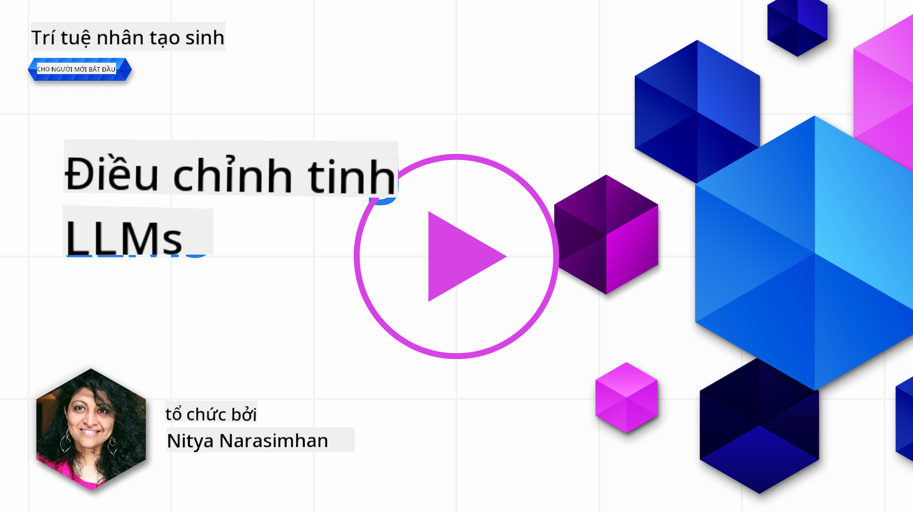
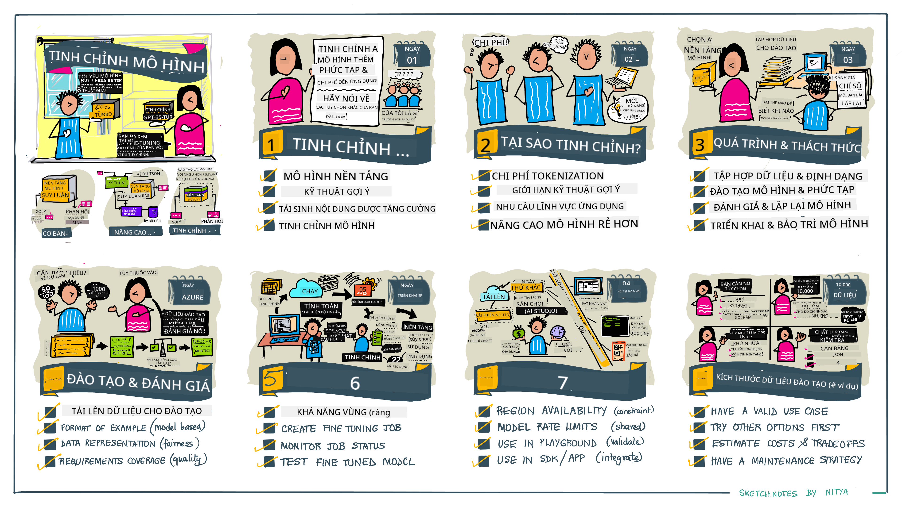

<!--
CO_OP_TRANSLATOR_METADATA:
{
  "original_hash": "68664f7e754a892ae1d8d5e2b7bd2081",
  "translation_date": "2025-05-20T07:53:17+00:00",
  "source_file": "18-fine-tuning/README.md",
  "language_code": "vi"
}
-->

# Tinh chỉnh mô hình ngôn ngữ lớn của bạn

Sử dụng các mô hình ngôn ngữ lớn để xây dựng ứng dụng AI tạo ra những thách thức mới. Một vấn đề quan trọng là đảm bảo chất lượng phản hồi (độ chính xác và sự liên quan) trong nội dung do mô hình tạo ra cho một yêu cầu của người dùng. Trong các bài học trước, chúng ta đã thảo luận về các kỹ thuật như thiết kế nhắc nhở và tạo ra tăng cường truy xuất nhằm giải quyết vấn đề bằng cách _thay đổi đầu vào nhắc nhở_ cho mô hình hiện có.

Trong bài học hôm nay, chúng ta thảo luận về một kỹ thuật thứ ba, **tinh chỉnh**, cố gắng giải quyết thách thức bằng cách _đào tạo lại chính mô hình_ với dữ liệu bổ sung. Hãy đi vào chi tiết.

## Mục tiêu học tập

Bài học này giới thiệu khái niệm tinh chỉnh cho các mô hình ngôn ngữ đã được đào tạo trước, khám phá lợi ích và thách thức của cách tiếp cận này, và cung cấp hướng dẫn về thời điểm và cách sử dụng tinh chỉnh để cải thiện hiệu suất của các mô hình AI tạo ra của bạn.

Đến cuối bài học này, bạn sẽ có thể trả lời các câu hỏi sau:

- Tinh chỉnh mô hình ngôn ngữ là gì?
- Khi nào và tại sao tinh chỉnh hữu ích?
- Làm thế nào tôi có thể tinh chỉnh một mô hình đã được đào tạo trước?
- Những hạn chế của tinh chỉnh là gì?

Sẵn sàng chưa? Hãy bắt đầu nào.

## Hướng dẫn minh họa

Muốn có cái nhìn tổng quát về những gì chúng ta sẽ đề cập trước khi đi sâu vào chi tiết? Hãy xem hướng dẫn minh họa này mô tả hành trình học tập cho bài học này - từ việc học các khái niệm cốt lõi và động lực cho việc tinh chỉnh, đến việc hiểu quy trình và thực hành tốt nhất để thực hiện nhiệm vụ tinh chỉnh. Đây là một chủ đề hấp dẫn để khám phá, vì vậy đừng quên xem trang [Resources](./RESOURCES.md?WT.mc_id=academic-105485-koreyst) để có thêm liên kết hỗ trợ hành trình học tập tự hướng dẫn của bạn!

## Tinh chỉnh mô hình ngôn ngữ là gì?

Theo định nghĩa, các mô hình ngôn ngữ lớn là _đã được đào tạo trước_ trên một lượng lớn văn bản từ nhiều nguồn khác nhau bao gồm internet. Như chúng ta đã học trong các bài học trước, chúng ta cần các kỹ thuật như _thiết kế nhắc nhở_ và _tạo ra tăng cường truy xuất_ để cải thiện chất lượng phản hồi của mô hình đối với câu hỏi của người dùng ("nhắc nhở").

Một kỹ thuật thiết kế nhắc nhở phổ biến liên quan đến việc cung cấp cho mô hình hướng dẫn nhiều hơn về những gì được mong đợi trong phản hồi bằng cách cung cấp _hướng dẫn_ (hướng dẫn rõ ràng) hoặc _đưa ra một vài ví dụ_ (hướng dẫn ngầm). Điều này được gọi là _học ít mẫu_ nhưng nó có hai hạn chế:

- Giới hạn token của mô hình có thể hạn chế số lượng ví dụ bạn có thể đưa ra, và hạn chế hiệu quả.
- Chi phí token của mô hình có thể làm cho việc thêm ví dụ vào mỗi nhắc nhở trở nên đắt đỏ, và hạn chế sự linh hoạt.

Tinh chỉnh là một thực hành phổ biến trong hệ thống học máy, nơi chúng ta lấy một mô hình đã được đào tạo trước và đào tạo lại nó với dữ liệu mới để cải thiện hiệu suất của nó trên một nhiệm vụ cụ thể. Trong ngữ cảnh của mô hình ngôn ngữ, chúng ta có thể tinh chỉnh mô hình đã được đào tạo trước _với một tập hợp ví dụ được chọn lọc cho một nhiệm vụ hoặc lĩnh vực ứng dụng_ để tạo ra một **mô hình tùy chỉnh** có thể chính xác hơn và phù hợp hơn cho nhiệm vụ hoặc lĩnh vực cụ thể đó. Một lợi ích phụ của việc tinh chỉnh là nó cũng có thể giảm số lượng ví dụ cần thiết cho học ít mẫu - giảm sử dụng token và chi phí liên quan.

## Khi nào và tại sao chúng ta nên tinh chỉnh mô hình?

Trong _ngữ cảnh này_, khi chúng ta nói về tinh chỉnh, chúng ta đang đề cập đến tinh chỉnh **có giám sát** nơi việc đào tạo lại được thực hiện bằng cách **thêm dữ liệu mới** không phải là một phần của tập dữ liệu đào tạo ban đầu. Điều này khác với cách tiếp cận tinh chỉnh không có giám sát nơi mô hình được đào tạo lại trên dữ liệu ban đầu, nhưng với các siêu tham số khác nhau.

Điều quan trọng cần nhớ là tinh chỉnh là một kỹ thuật nâng cao yêu cầu một mức độ chuyên môn nhất định để đạt được kết quả mong muốn. Nếu thực hiện không đúng, nó có thể không cung cấp những cải tiến như mong đợi, và thậm chí có thể làm giảm hiệu suất của mô hình cho lĩnh vực mục tiêu của bạn.

Vì vậy, trước khi bạn học "cách" tinh chỉnh mô hình ngôn ngữ, bạn cần biết "tại sao" bạn nên chọn con đường này, và "khi nào" bắt đầu quá trình tinh chỉnh. Bắt đầu bằng cách tự hỏi mình những câu hỏi này:

- **Trường hợp sử dụng**: Trường hợp sử dụng của bạn cho việc tinh chỉnh là gì? Bạn muốn cải thiện khía cạnh nào của mô hình đã được đào tạo trước hiện tại?
- **Các lựa chọn thay thế**: Bạn đã thử _các kỹ thuật khác_ để đạt được kết quả mong muốn chưa? Sử dụng chúng để tạo ra một tiêu chuẩn để so sánh.
  - Thiết kế nhắc nhở: Thử các kỹ thuật như nhắc nhở ít mẫu với ví dụ về phản hồi nhắc nhở liên quan. Đánh giá chất lượng phản hồi.
  - Tạo ra tăng cường truy xuất: Thử tăng cường nhắc nhở với kết quả truy vấn được tìm kiếm trong dữ liệu của bạn. Đánh giá chất lượng phản hồi.
- **Chi phí**: Bạn đã xác định chi phí cho việc tinh chỉnh chưa?
  - Khả năng điều chỉnh - mô hình đã được đào tạo trước có sẵn để tinh chỉnh không?
  - Nỗ lực - để chuẩn bị dữ liệu đào tạo, đánh giá & tinh chỉnh mô hình.
  - Tính toán - để chạy các công việc tinh chỉnh, và triển khai mô hình đã được tinh chỉnh
  - Dữ liệu - truy cập đủ ví dụ chất lượng để ảnh hưởng tinh chỉnh
- **Lợi ích**: Bạn đã xác nhận lợi ích cho việc tinh chỉnh chưa?
  - Chất lượng - mô hình đã được tinh chỉnh có vượt trội hơn tiêu chuẩn không?
  - Chi phí - nó có giảm sử dụng token bằng cách đơn giản hóa nhắc nhở không?
  - Khả năng mở rộng - bạn có thể tái sử dụng mô hình cơ bản cho các lĩnh vực mới không?

Bằng cách trả lời những câu hỏi này, bạn sẽ có thể quyết định xem tinh chỉnh có phải là cách tiếp cận đúng cho trường hợp sử dụng của bạn không. Lý tưởng nhất, cách tiếp cận này chỉ hợp lệ nếu lợi ích vượt trội hơn chi phí. Khi bạn quyết định tiến hành, đã đến lúc nghĩ về _cách_ bạn có thể tinh chỉnh mô hình đã được đào tạo trước.

Muốn có thêm thông tin chi tiết về quá trình ra quyết định? Xem [Có nên tinh chỉnh hay không](https://www.youtube.com/watch?v=0Jo-z-MFxJs)

## Làm thế nào chúng ta có thể tinh chỉnh một mô hình đã được đào tạo trước?

Để tinh chỉnh một mô hình đã được đào tạo trước, bạn cần có:

- một mô hình đã được đào tạo trước để tinh chỉnh
- một tập dữ liệu để sử dụng cho việc tinh chỉnh
- một môi trường đào tạo để chạy công việc tinh chỉnh
- một môi trường lưu trữ để triển khai mô hình đã được tinh chỉnh

## Tinh chỉnh trong thực tế

Các tài nguyên sau cung cấp các hướng dẫn từng bước để hướng dẫn bạn qua một ví dụ thực tế sử dụng một mô hình được chọn với một tập dữ liệu được chọn lọc. Để thực hiện các hướng dẫn này, bạn cần một tài khoản trên nhà cung cấp cụ thể, cùng với quyền truy cập vào mô hình và tập dữ liệu liên quan.

| Nhà cung cấp  | Hướng dẫn                                                                                                                                                                       | Mô tả                                                                                                                                                                                                                                                                                                                                                                                                                        |
| ------------- | ------------------------------------------------------------------------------------------------------------------------------------------------------------------------------ | ---------------------------------------------------------------------------------------------------------------------------------------------------------------------------------------------------------------------------------------------------------------------------------------------------------------------------------------------------------------------------------------------------------------------------------- |
| OpenAI        | [Cách tinh chỉnh mô hình chat](https://github.com/openai/openai-cookbook/blob/main/examples/How_to_finetune_chat_models.ipynb?WT.mc_id=academic-105485-koreyst)                | Học cách tinh chỉnh một `gpt-35-turbo` cho một lĩnh vực cụ thể ("trợ lý công thức") bằng cách chuẩn bị dữ liệu đào tạo, chạy công việc tinh chỉnh, và sử dụng mô hình đã được tinh chỉnh để suy luận.                                                                                                                                                                                                                                              |
| Azure OpenAI  | [Hướng dẫn tinh chỉnh GPT 3.5 Turbo](https://learn.microsoft.com/azure/ai-services/openai/tutorials/fine-tune?tabs=python-new%2Ccommand-line?WT.mc_id=academic-105485-koreyst) | Học cách tinh chỉnh một mô hình `gpt-35-turbo-0613` **trên Azure** bằng cách thực hiện các bước để tạo và tải lên dữ liệu đào tạo, chạy công việc tinh chỉnh. Triển khai và sử dụng mô hình mới.                                                                                                                                                                                                                                                                 |
| Hugging Face  | [Tinh chỉnh LLM với Hugging Face](https://www.philschmid.de/fine-tune-llms-in-2024-with-trl?WT.mc_id=academic-105485-koreyst)                                               | Bài đăng trên blog này hướng dẫn bạn tinh chỉnh một _LLM mở_ (ví dụ: `CodeLlama 7B`) sử dụng thư viện [transformers](https://huggingface.co/docs/transformers/index?WT.mc_id=academic-105485-koreyst) & [Học máy tăng cường Transformer (TRL)](https://huggingface.co/docs/trl/index?WT.mc_id=academic-105485-koreyst]) với các [tập dữ liệu](https://huggingface.co/docs/datasets/index?WT.mc_id=academic-105485-koreyst) mở trên Hugging Face. |
|               |                                                                                                                                                                                |                                                                                                                                                                                                                                                                                                                                                                                                                                    |
| 🤗 AutoTrain  | [Tinh chỉnh LLM với AutoTrain](https://github.com/huggingface/autotrain-advanced/?WT.mc_id=academic-105485-koreyst)                                                         | AutoTrain (hoặc AutoTrain Advanced) là một thư viện python được phát triển bởi Hugging Face cho phép tinh chỉnh cho nhiều nhiệm vụ khác nhau bao gồm tinh chỉnh LLM. AutoTrain là một giải pháp không cần mã và tinh chỉnh có thể được thực hiện trên đám mây của bạn, trên Hugging Face Spaces hoặc cục bộ. Nó hỗ trợ cả giao diện người dùng web, CLI và đào tạo thông qua các tệp cấu hình yaml.                                                                               |
|               |                                                                                                                                                                                |                                                                                                                                                                                                                                                                                                                                                                                                                                    |

## Bài tập

Chọn một trong các hướng dẫn trên và thực hiện theo. _Chúng tôi có thể sao chép một phiên bản của các hướng dẫn này trong Jupyter Notebooks trong repo này chỉ để tham khảo. Vui lòng sử dụng các nguồn gốc trực tiếp để có phiên bản mới nhất_.

## Làm tốt lắm! Tiếp tục học tập của bạn.

Sau khi hoàn thành bài học này, hãy xem bộ sưu tập [Học AI tạo ra](https://aka.ms/genai-collection?WT.mc_id=academic-105485-koreyst) của chúng tôi để tiếp tục nâng cao kiến thức AI tạo ra của bạn!

Chúc mừng!! Bạn đã hoàn thành bài học cuối cùng từ loạt bài v2 cho khóa học này! Đừng dừng lại việc học và xây dựng. **Xem trang [RESOURCES](RESOURCES.md?WT.mc_id=academic-105485-koreyst) để có danh sách các đề xuất bổ sung chỉ cho chủ đề này.

Loạt bài v1 của chúng tôi cũng đã được cập nhật với nhiều bài tập và khái niệm hơn. Vì vậy, hãy dành một chút thời gian để làm mới kiến thức của bạn - và vui lòng [chia sẻ câu hỏi và phản hồi của bạn](https://github.com/microsoft/generative-ai-for-beginners/issues?WT.mc_id=academic-105485-koreyst) để giúp chúng tôi cải thiện những bài học này cho cộng đồng.

**Tuyên bố miễn trừ trách nhiệm**:  
Tài liệu này đã được dịch bằng dịch vụ dịch thuật AI [Co-op Translator](https://github.com/Azure/co-op-translator). Mặc dù chúng tôi cố gắng đảm bảo độ chính xác, xin lưu ý rằng các bản dịch tự động có thể chứa lỗi hoặc không chính xác. Tài liệu gốc bằng ngôn ngữ bản địa nên được coi là nguồn thông tin có thẩm quyền. Đối với thông tin quan trọng, nên sử dụng dịch vụ dịch thuật chuyên nghiệp từ con người. Chúng tôi không chịu trách nhiệm về bất kỳ sự hiểu lầm hoặc giải thích sai nào phát sinh từ việc sử dụng bản dịch này.