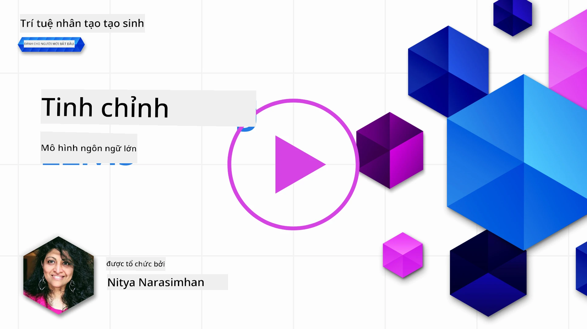
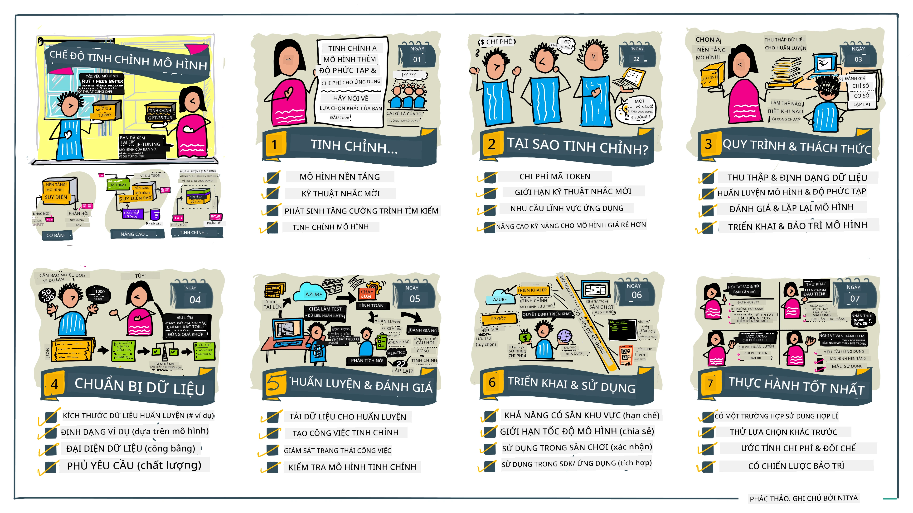

# Tinh Chỉnh Mô Hình Ngôn Ngữ Lớn của Bạn

Việc sử dụng các mô hình ngôn ngữ lớn để xây dựng các ứng dụng AI sinh tạo đi kèm với những thách thức mới. Một vấn đề then chốt là đảm bảo chất lượng phản hồi (độ chính xác và phù hợp) trong nội dung do mô hình tạo ra cho một yêu cầu cụ thể của người dùng. Trong các bài học trước, chúng ta đã thảo luận về các kỹ thuật như kỹ thuật gợi ý (prompt engineering) và tạo ra nội dung dựa trên truy xuất thông tin (retrieval-augmented generation) nhằm giải quyết vấn đề bằng cách _thay đổi đầu vào gợi ý_ cho mô hình hiện có.

Trong bài học hôm nay, chúng ta sẽ thảo luận về một kỹ thuật thứ ba, **tinh chỉnh**, cố gắng giải quyết thách thức này bằng cách _đào tạo lại chính mô hình_ với dữ liệu bổ sung. Hãy cùng tìm hiểu chi tiết.

## Mục Tiêu Học Tập

Bài học này giới thiệu khái niệm tinh chỉnh cho các mô hình ngôn ngữ đã được huấn luyện trước, khám phá lợi ích và thách thức của phương pháp này, đồng thời cung cấp hướng dẫn về thời điểm và cách thức sử dụng tinh chỉnh để cải thiện hiệu suất của các mô hình AI sinh tạo.

Kết thúc bài học này, bạn sẽ có thể trả lời các câu hỏi sau:

- Tinh chỉnh mô hình ngôn ngữ là gì?
- Khi nào và tại sao tinh chỉnh lại hữu ích?
- Làm thế nào để tôi có thể tinh chỉnh một mô hình đã được huấn luyện trước?
- Những hạn chế của việc tinh chỉnh là gì?

Sẵn sàng chưa? Hãy bắt đầu thôi.

## Hướng Dẫn Minh Họa

Muốn có cái nhìn tổng quan về những gì chúng ta sẽ tìm hiểu trước khi đi sâu? Hãy xem hướng dẫn minh họa này mô tả hành trình học tập cho bài học - từ việc tìm hiểu các khái niệm cốt lõi và động lực tinh chỉnh, đến hiểu quy trình và các thực hành tốt nhất để thực hiện nhiệm vụ tinh chỉnh. Đây là chủ đề rất thú vị để khám phá, vì vậy đừng quên kiểm tra trang [Tài nguyên](./RESOURCES.md?WT.mc_id=academic-105485-koreyst) để có thêm các liên kết hỗ trợ hành trình tự học của bạn!

## Tinh Chỉnh Mô Hình Ngôn Ngữ Là Gì?

Theo định nghĩa, các mô hình ngôn ngữ lớn được _huấn luyện trước_ trên lượng lớn văn bản lấy từ nhiều nguồn đa dạng bao gồm cả internet. Như chúng ta đã học trong các bài trước, chúng ta cần các kỹ thuật như _kỹ thuật gợi ý_ và _tạo nội dung dựa trên truy xuất_ để nâng cao chất lượng phản hồi của mô hình đối với các câu hỏi ("gợi ý") của người dùng.

Một kỹ thuật kỹ thuật gợi ý phổ biến là cung cấp cho mô hình nhiều hướng dẫn hơn về những gì được mong đợi trong phản hồi, bằng cách cung cấp _hướng dẫn_ (hướng dẫn rõ ràng) hoặc _đưa ra một vài ví dụ_ (hướng dẫn ngầm). Điều này gọi là _học theo vài ví dụ_ (few-shot learning) nhưng nó có hai hạn chế:

- Giới hạn ký tự của mô hình có thể hạn chế số lượng ví dụ bạn có thể cung cấp và ảnh hưởng hiệu quả.
- Chi phí ký tự của mô hình có thể làm tốn kém khi thêm ví dụ vào mỗi gợi ý và giảm tính linh hoạt.

Tinh chỉnh là một thực hành phổ biến trong hệ thống học máy, trong đó ta lấy một mô hình đã được huấn luyện trước và đào tạo lại với dữ liệu mới để cải thiện hiệu suất trên một nhiệm vụ cụ thể. Trong bối cảnh mô hình ngôn ngữ, ta có thể tinh chỉnh mô hình đã được huấn luyện trước _bằng một tập hợp các ví dụ được biên soạn cho một nhiệm vụ hoặc lĩnh vực ứng dụng nhất định_ để tạo ra một **mô hình tùy biến** có thể chính xác và phù hợp hơn cho nhiệm vụ hoặc lĩnh vực đó. Một lợi ích phụ của tinh chỉnh là nó cũng có thể giảm số lượng ví dụ cần cho học theo vài ví dụ - giảm chi phí ký tự và các chi phí liên quan.

## Khi Nào và Tại Sao Nên Tinh Chỉnh Mô Hình?

Trong _bối cảnh này_, khi nói về tinh chỉnh, chúng ta đang nói đến **tinh chỉnh có giám sát** nơi việc đào tạo lại được thực hiện bằng cách **thêm dữ liệu mới** mà không có trong bộ dữ liệu đào tạo ban đầu. Điều này khác với phương pháp tinh chỉnh không giám sát, nơi mô hình được đào tạo lại trên dữ liệu gốc nhưng với các siêu tham số khác nhau.

Điều quan trọng cần nhớ là tinh chỉnh là một kỹ thuật nâng cao đòi hỏi trình độ chuyên môn nhất định để đạt được kết quả mong muốn. Nếu thực hiện không đúng, nó có thể không đem lại cải tiến như kỳ vọng, thậm chí làm giảm hiệu năng của mô hình đối với lĩnh vực mục tiêu của bạn.

Vì vậy, trước khi học "cách" tinh chỉnh mô hình ngôn ngữ, bạn cần biết "tại sao" nên chọn con đường này và "khi nào" nên bắt đầu quá trình tinh chỉnh. Hãy bắt đầu bằng cách tự hỏi các câu hỏi sau:

- **Trường hợp sử dụng**: Trường hợp sử dụng _tinh chỉnh_ của bạn là gì? Bạn muốn cải thiện khía cạnh nào của mô hình đã được huấn luyện trước?
- **Các lựa chọn thay thế**: Bạn đã thử _các kỹ thuật khác_ để đạt được kết quả mong muốn chưa? Dùng chúng để tạo cơ sở so sánh.
  - Kỹ thuật gợi ý: Thử các kỹ thuật như gợi ý theo vài ví dụ với các ví dụ phản hồi gợi ý liên quan. Đánh giá chất lượng phản hồi.
  - Tạo nội dung dựa trên truy xuất: Thử bổ sung gợi ý với kết quả truy vấn tìm kiếm dữ liệu của bạn. Đánh giá chất lượng phản hồi.
- **Chi phí**: Bạn đã xác định được chi phí cho tinh chỉnh chưa?
  - Khả năng tinh chỉnh - mô hình được huấn luyện trước có thể tinh chỉnh không?
  - Công sức - chuẩn bị dữ liệu huấn luyện, đánh giá & tinh chỉnh mô hình.
  - Tính toán - chạy công việc tinh chỉnh, triển khai mô hình đã tinh chỉnh.
  - Dữ liệu - truy cập đủ ví dụ chất lượng cho tác động tinh chỉnh.
- **Lợi ích**: Bạn đã xác nhận lợi ích từ tinh chỉnh chưa?
  - Chất lượng - mô hình đã tinh chỉnh có vượt trội hơn so với cơ sở không?
  - Chi phí - có giảm sử dụng ký tự bằng cách đơn giản hóa gợi ý không?
  - Khả năng mở rộng - bạn có thể tái sử dụng mô hình cơ sở cho các lĩnh vực mới không?

Bằng cách trả lời những câu hỏi này, bạn sẽ có thể quyết định xem tinh chỉnh có phải là phương án phù hợp cho trường hợp sử dụng của bạn hay không. Lý tưởng là chỉ thực hiện nếu lợi ích lớn hơn chi phí. Khi bạn quyết định tiến hành, đã đến lúc nghĩ về _cách_ bạn có thể tinh chỉnh mô hình đã được huấn luyện trước.

Muốn có thêm góc nhìn về quy trình ra quyết định? Xem [Tinh chỉnh hay không tinh chỉnh](https://www.youtube.com/watch?v=0Jo-z-MFxJs)

## Làm Thế Nào Để Tinh Chỉnh Một Mô Hình Đã Được Huấn Luyện Trước?

Để tinh chỉnh một mô hình đã huấn luyện trước, bạn cần có:

- một mô hình đã huấn luyện trước để tinh chỉnh
- một bộ dữ liệu để dùng cho việc tinh chỉnh
- một môi trường đào tạo để chạy công việc tinh chỉnh
- một môi trường lưu trữ để triển khai mô hình đã tinh chỉnh

## Tinh Chỉnh Trong Thực Tế

Các tài nguyên dưới đây cung cấp hướng dẫn từng bước để bạn thực hành với ví dụ thực tế sử dụng mô hình được chọn cùng bộ dữ liệu được biên soạn. Để làm theo các hướng dẫn này, bạn cần một tài khoản của nhà cung cấp cụ thể, cùng với quyền truy cập vào mô hình và bộ dữ liệu liên quan.

| Nhà Cung Cấp | Hướng Dẫn                                                                                                                                                                     | Mô Tả                                                                                                                                                                                                                                                                                                                                                                                                                            |
| ------------ | ---------------------------------------------------------------------------------------------------------------------------------------------------------------------------- | -------------------------------------------------------------------------------------------------------------------------------------------------------------------------------------------------------------------------------------------------------------------------------------------------------------------------------------------------------------------------------------------------------------------------------- |
| OpenAI       | [Cách tinh chỉnh mô hình chat](https://github.com/openai/openai-cookbook/blob/main/examples/How_to_finetune_chat_models.ipynb?WT.mc_id=academic-105485-koreyst)              | Học cách tinh chỉnh `gpt-35-turbo` cho một lĩnh vực cụ thể ("trợ lý nấu ăn") bằng cách chuẩn bị dữ liệu huấn luyện, chạy công việc tinh chỉnh và sử dụng mô hình đã tinh chỉnh để suy luận.                                                                                                                                                                                                                                 |
| Azure OpenAI | [Hướng dẫn tinh chỉnh GPT 3.5 Turbo](https://learn.microsoft.com/azure/ai-services/openai/tutorials/fine-tune?tabs=python-new%2Ccommand-line&WT.mc_id=academic-105485-koreyst) | Học cách tinh chỉnh mô hình `gpt-35-turbo-0613` **trên Azure** bằng các bước tạo & tải dữ liệu huấn luyện lên, chạy công việc tinh chỉnh. Triển khai & sử dụng mô hình mới.                                                                                                                                                                                                                                                |
| Hugging Face | [Tinh chỉnh LLMs với Hugging Face](https://www.philschmid.de/fine-tune-llms-in-2024-with-trl?WT.mc_id=academic-105485-koreyst)                                               | Bài blog này hướng dẫn bạn cách tinh chỉnh một _mô hình LLM mở_ (ví dụ: `CodeLlama 7B`) sử dụng thư viện [transformers](https://huggingface.co/docs/transformers/index?WT.mc_id=academic-105485-koreyst) & [Transformer Reinforcement Learning (TRL)](https://huggingface.co/docs/trl/index?WT.mc_id=academic-105485-koreyst) với các [dataset](https://huggingface.co/docs/datasets/index?WT.mc_id=academic-105485-koreyst) mở trên Hugging Face. |
|              |                                                                                                                                                                              |                                                                                                                                                                                                                                                                                                                                                                                                                                  |
| 🤗 AutoTrain | [Tinh chỉnh LLMs với AutoTrain](https://github.com/huggingface/autotrain-advanced/?WT.mc_id=academic-105485-koreyst)                                                         | AutoTrain (hoặc AutoTrain Advanced) là thư viện python do Hugging Face phát triển cho phép tinh chỉnh nhiều nhiệm vụ khác nhau bao gồm cả tinh chỉnh LLM. AutoTrain là giải pháp không cần mã hóa và có thể tinh chỉnh trên đám mây riêng, trên Hugging Face Spaces hoặc cục bộ. Hỗ trợ GUI trên web, CLI và đào tạo qua file cấu hình yaml.                                                                                                |
|              |                                                                                                                                                                              |                                                                                                                                                                                                                                                                                                                                                                                                                                  |
| 🦥 Unsloth   | [Tinh chỉnh LLMs với Unsloth](https://github.com/unslothai/unsloth)                                                                                                          | Unsloth là framework nguồn mở hỗ trợ tinh chỉnh LLM và học tăng cường (RL). Unsloth đơn giản hóa đào tạo cục bộ, đánh giá và triển khai với các [notebook](https://github.com/unslothai/notebooks) sẵn sàng sử dụng. Ngoài ra còn hỗ trợ chuyển văn bản thành giọng nói (TTS), mô hình BERT và đa phương tiện. Để bắt đầu, đọc hướng dẫn từng bước [Hướng Dẫn Tinh Chỉnh LLM](https://docs.unsloth.ai/get-started/fine-tuning-llms-guide).                              |
|              |                                                                                                                                                                              |                                                                                                                                                                                                                                                                                                                                                                                                                                  |
## Bài Tập

Chọn một trong các bài hướng dẫn trên và thực hành theo. _Chúng tôi có thể tái tạo phiên bản các bài hướng dẫn này dưới dạng Jupyter Notebooks trong kho lưu trữ này chỉ để tham khảo. Vui lòng sử dụng trực tiếp các nguồn gốc chính để có các phiên bản mới nhất_.

## Hoàn Thành Xuất Sắc! Tiếp Tục Học Hỏi.

Sau khi hoàn thành bài học này, hãy xem bộ sưu tập [Học Generative AI](https://aka.ms/genai-collection?WT.mc_id=academic-105485-koreyst) để tiếp tục nâng cao kiến thức Generative AI của bạn!

Chúc mừng!! Bạn đã hoàn thành bài học cuối cùng trong loạt bài v2 của khóa học này! Đừng ngừng học và xây dựng. \*\*Xem trang [TÀI NGUYÊN](RESOURCES.md?WT.mc_id=academic-105485-koreyst) để biết thêm các gợi ý bổ sung riêng cho chủ đề này.

Loạt bài v1 của chúng tôi cũng đã được cập nhật với nhiều bài tập và khái niệm hơn. Vì vậy hãy dành một phút để làm mới kiến thức - và vui lòng [chia sẻ câu hỏi và phản hồi của bạn](https://github.com/microsoft/generative-ai-for-beginners/issues?WT.mc_id=academic-105485-koreyst) để giúp chúng tôi cải thiện các bài học này cho cộng đồng.

---

<!-- CO-OP TRANSLATOR DISCLAIMER START -->
**Tuyên bố miễn trừ trách nhiệm**:  
Tài liệu này đã được dịch bằng dịch vụ dịch thuật AI [Co-op Translator](https://github.com/Azure/co-op-translator). Mặc dù chúng tôi cố gắng đảm bảo độ chính xác, xin lưu ý rằng bản dịch tự động có thể chứa lỗi hoặc sự không chính xác. Văn bản gốc bằng ngôn ngữ bản địa của tài liệu nên được coi là nguồn chính xác nhất. Đối với thông tin quan trọng, chúng tôi khuyến nghị dịch thuật chuyên nghiệp do con người thực hiện. Chúng tôi không chịu trách nhiệm về bất kỳ sự hiểu nhầm hay diễn giải sai nào phát sinh từ việc sử dụng bản dịch này.
<!-- CO-OP TRANSLATOR DISCLAIMER END -->