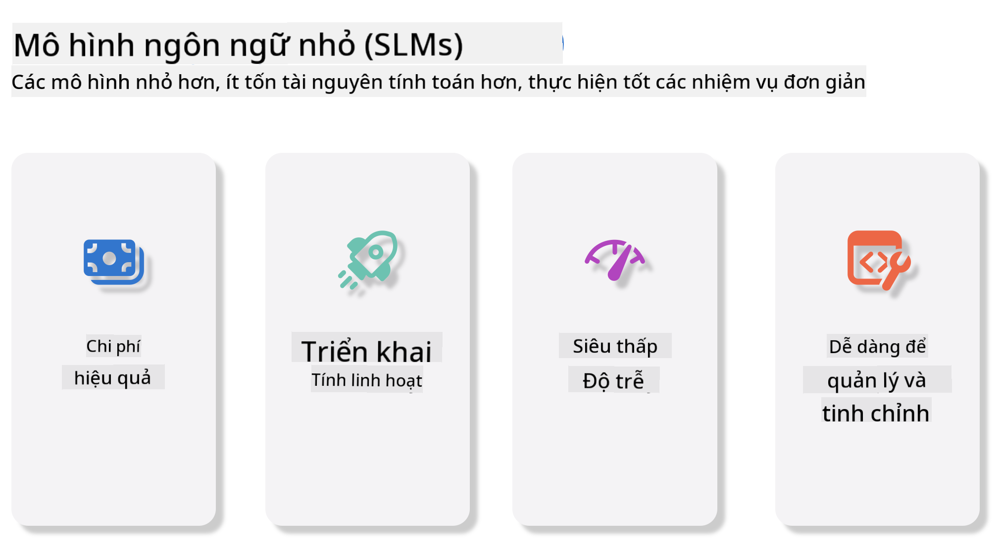
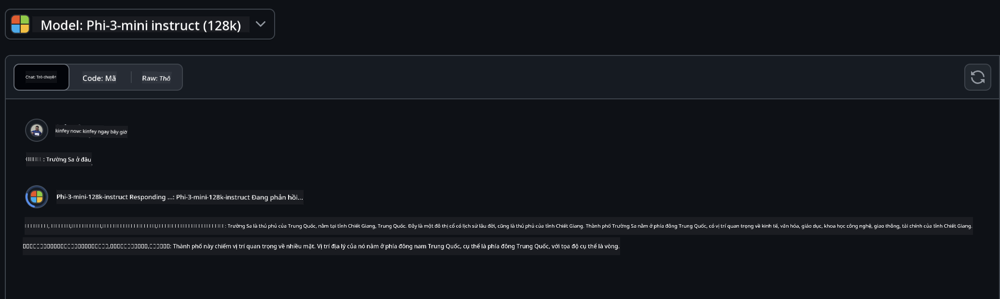
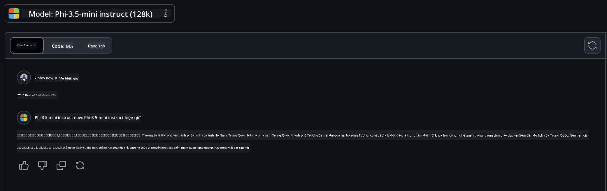

<!--
CO_OP_TRANSLATOR_METADATA:
{
  "original_hash": "124ad36cfe96f74038811b6e2bb93e9d",
  "translation_date": "2025-05-20T10:13:48+00:00",
  "source_file": "19-slm/README.md",
  "language_code": "vi"
}
-->
# Giới thiệu về Mô hình Ngôn ngữ Nhỏ cho AI Tạo sinh cho Người mới bắt đầu

AI Tạo sinh là một lĩnh vực thú vị của trí tuệ nhân tạo tập trung vào việc tạo ra các hệ thống có khả năng tạo ra nội dung mới. Nội dung này có thể bao gồm từ văn bản và hình ảnh đến âm nhạc và thậm chí cả các môi trường ảo hoàn chỉnh. Một trong những ứng dụng thú vị nhất của AI tạo sinh là trong lĩnh vực mô hình ngôn ngữ.

## Mô hình Ngôn ngữ Nhỏ là gì?

Mô hình Ngôn ngữ Nhỏ (SLM) đại diện cho một biến thể thu nhỏ của một mô hình ngôn ngữ lớn (LLM), tận dụng nhiều nguyên tắc kiến trúc và kỹ thuật của LLMs, trong khi thể hiện một dấu chân tính toán giảm đáng kể. SLMs là một tập hợp con của các mô hình ngôn ngữ được thiết kế để tạo ra văn bản giống con người. Không giống như các đối tác lớn hơn của chúng, chẳng hạn như GPT-4, SLMs nhỏ gọn và hiệu quả hơn, làm cho chúng trở nên lý tưởng cho các ứng dụng nơi tài nguyên tính toán bị hạn chế. Mặc dù có kích thước nhỏ hơn, chúng vẫn có thể thực hiện nhiều nhiệm vụ khác nhau. Thông thường, SLMs được xây dựng bằng cách nén hoặc chưng cất các LLMs, nhằm giữ lại một phần đáng kể của chức năng và khả năng ngôn ngữ ban đầu của mô hình. Sự giảm kích thước mô hình này làm giảm độ phức tạp tổng thể, làm cho SLMs hiệu quả hơn về cả việc sử dụng bộ nhớ và yêu cầu tính toán. Mặc dù có những tối ưu hóa này, SLMs vẫn có thể thực hiện một loạt các nhiệm vụ xử lý ngôn ngữ tự nhiên (NLP):

- Tạo văn bản: Tạo ra các câu hoặc đoạn văn mạch lạc và phù hợp với ngữ cảnh.
- Hoàn thành văn bản: Dự đoán và hoàn thành câu dựa trên một lời nhắc cho trước.
- Dịch thuật: Chuyển đổi văn bản từ ngôn ngữ này sang ngôn ngữ khác.
- Tóm tắt: Tóm tắt các đoạn văn dài thành các bản tóm tắt ngắn gọn và dễ hiểu.

Mặc dù có một số đánh đổi về hiệu suất hoặc độ sâu hiểu biết so với các đối tác lớn hơn của chúng.

## Mô hình Ngôn ngữ Nhỏ hoạt động như thế nào?

SLMs được đào tạo trên một lượng lớn dữ liệu văn bản. Trong quá trình đào tạo, chúng học các mẫu và cấu trúc của ngôn ngữ, cho phép chúng tạo ra văn bản đúng ngữ pháp và phù hợp với ngữ cảnh. Quá trình đào tạo bao gồm:

- Thu thập dữ liệu: Thu thập các tập dữ liệu văn bản lớn từ nhiều nguồn khác nhau.
- Tiền xử lý: Làm sạch và tổ chức dữ liệu để làm cho nó phù hợp cho việc đào tạo.
- Đào tạo: Sử dụng các thuật toán học máy để dạy mô hình cách hiểu và tạo ra văn bản.
- Tinh chỉnh: Điều chỉnh mô hình để cải thiện hiệu suất của nó trên các nhiệm vụ cụ thể.

Sự phát triển của SLMs phù hợp với nhu cầu ngày càng tăng về các mô hình có thể triển khai trong các môi trường bị hạn chế về tài nguyên, chẳng hạn như thiết bị di động hoặc nền tảng tính toán biên, nơi các LLMs toàn diện có thể không thực tế do yêu cầu tài nguyên nặng nề của chúng. Bằng cách tập trung vào hiệu quả, SLMs cân bằng hiệu suất với khả năng tiếp cận, cho phép ứng dụng rộng rãi hơn trên nhiều lĩnh vực khác nhau.



## Mục tiêu học tập

Trong bài học này, chúng tôi hy vọng giới thiệu kiến thức về SLM và kết hợp nó với Microsoft Phi-3 để học các kịch bản khác nhau trong nội dung văn bản, tầm nhìn và MoE. Đến cuối bài học này, bạn sẽ có thể trả lời các câu hỏi sau:

- SLM là gì
- Sự khác biệt giữa SLM và LLM là gì
- Microsoft Phi-3/3.5 Family là gì
- Làm thế nào để suy luận Microsoft Phi-3/3.5 Family

Sẵn sàng chưa? Hãy bắt đầu.

## Sự khác biệt giữa Mô hình Ngôn ngữ Lớn (LLMs) và Mô hình Ngôn ngữ Nhỏ (SLMs)

Cả LLMs và SLMs đều được xây dựng trên các nguyên tắc cơ bản của học máy xác suất, theo các phương pháp tương tự trong thiết kế kiến trúc, phương pháp đào tạo, quy trình tạo dữ liệu và kỹ thuật đánh giá mô hình. Tuy nhiên, có một số yếu tố chính phân biệt hai loại mô hình này.

## Ứng dụng của Mô hình Ngôn ngữ Nhỏ

SLMs có một loạt các ứng dụng, bao gồm:

- Chatbots: Cung cấp hỗ trợ khách hàng và tương tác với người dùng theo cách trò chuyện.
- Tạo nội dung: Hỗ trợ các nhà văn bằng cách tạo ra ý tưởng hoặc thậm chí soạn thảo toàn bộ bài viết.
- Giáo dục: Giúp học sinh với các bài tập viết hoặc học ngôn ngữ mới.
- Khả năng tiếp cận: Tạo ra các công cụ cho người khuyết tật, chẳng hạn như hệ thống chuyển văn bản thành giọng nói.

**Kích thước**

Một điểm khác biệt chính giữa LLMs và SLMs nằm ở quy mô của các mô hình. LLMs, chẳng hạn như ChatGPT (GPT-4), có thể bao gồm khoảng 1.76 nghìn tỷ tham số, trong khi SLMs mã nguồn mở như Mistral 7B được thiết kế với số lượng tham số ít hơn đáng kể — khoảng 7 tỷ. Sự chênh lệch này chủ yếu do sự khác biệt trong kiến trúc mô hình và quy trình đào tạo. Ví dụ, ChatGPT sử dụng cơ chế tự chú ý trong một khung mã hóa-giải mã, trong khi Mistral 7B sử dụng chú ý cửa sổ trượt, cho phép đào tạo hiệu quả hơn trong một mô hình chỉ giải mã. Sự khác biệt kiến trúc này có những tác động sâu sắc đến độ phức tạp và hiệu suất của các mô hình này.

**Hiểu biết**

SLMs thường được tối ưu hóa cho hiệu suất trong các lĩnh vực cụ thể, làm cho chúng có tính chuyên môn cao nhưng có thể bị hạn chế trong khả năng cung cấp sự hiểu biết ngữ cảnh rộng rãi trên nhiều lĩnh vực kiến thức. Ngược lại, LLMs nhằm mô phỏng trí tuệ giống con người trên một mức độ toàn diện hơn. Được đào tạo trên các tập dữ liệu đa dạng và rộng lớn, LLMs được thiết kế để hoạt động tốt trên nhiều lĩnh vực khác nhau, cung cấp sự linh hoạt và khả năng thích ứng lớn hơn. Do đó, LLMs phù hợp hơn cho một loạt các nhiệm vụ hạ nguồn, chẳng hạn như xử lý ngôn ngữ tự nhiên và lập trình.

**Tính toán**

Quá trình đào tạo và triển khai LLMs là các quy trình đòi hỏi tài nguyên, thường yêu cầu cơ sở hạ tầng tính toán đáng kể, bao gồm các cụm GPU quy mô lớn. Ví dụ, đào tạo một mô hình như ChatGPT từ đầu có thể cần hàng ngàn GPU trong thời gian dài. Ngược lại, SLMs, với số lượng tham số nhỏ hơn, dễ tiếp cận hơn về tài nguyên tính toán. Các mô hình như Mistral 7B có thể được đào tạo và chạy trên các máy cục bộ được trang bị khả năng GPU vừa phải, mặc dù việc đào tạo vẫn đòi hỏi vài giờ trên nhiều GPU.

**Thiên vị**

Thiên vị là một vấn đề đã biết trong LLMs, chủ yếu do bản chất của dữ liệu đào tạo. Các mô hình này thường dựa vào dữ liệu thô, có sẵn công khai từ internet, có thể không đại diện hoặc hiểu sai một số nhóm nhất định, giới thiệu nhãn sai hoặc phản ánh các thiên vị ngôn ngữ bị ảnh hưởng bởi phương ngữ, biến thể địa lý và quy tắc ngữ pháp. Ngoài ra, độ phức tạp của các kiến trúc LLM có thể vô tình làm trầm trọng thêm thiên vị, điều này có thể không được chú ý nếu không có sự tinh chỉnh cẩn thận. Mặt khác, SLMs, được đào tạo trên các tập dữ liệu bị ràng buộc, cụ thể theo lĩnh vực, vốn dĩ ít bị ảnh hưởng bởi những thiên vị như vậy, mặc dù chúng không miễn nhiễm với chúng.

**Suy luận**

Kích thước giảm của SLMs mang lại cho chúng một lợi thế đáng kể về tốc độ suy luận, cho phép chúng tạo ra đầu ra một cách hiệu quả trên phần cứng cục bộ mà không cần xử lý song song rộng rãi. Ngược lại, LLMs, do kích thước và độ phức tạp của chúng, thường yêu cầu tài nguyên tính toán song song đáng kể để đạt được thời gian suy luận chấp nhận được. Sự hiện diện của nhiều người dùng đồng thời càng làm chậm thời gian phản hồi của LLMs, đặc biệt khi được triển khai ở quy mô lớn.

Tóm lại, mặc dù cả LLMs và SLMs đều có nền tảng cơ bản trong học máy, chúng khác nhau đáng kể về kích thước mô hình, yêu cầu tài nguyên, hiểu biết ngữ cảnh, khả năng bị thiên vị và tốc độ suy luận. Những sự khác biệt này phản ánh sự phù hợp tương ứng của chúng cho các trường hợp sử dụng khác nhau, với LLMs linh hoạt hơn nhưng nặng tài nguyên, và SLMs cung cấp hiệu quả cụ thể theo lĩnh vực với yêu cầu tính toán giảm.

***Lưu ý: Trong chương này, chúng tôi sẽ giới thiệu SLM bằng cách sử dụng Microsoft Phi-3 / 3.5 làm ví dụ.***

## Giới thiệu Phi-3 / Phi-3.5 Family

Phi-3 / 3.5 Family chủ yếu nhắm đến các kịch bản ứng dụng văn bản, tầm nhìn và Agent (MoE):

### Phi-3 / 3.5 Instruct

Chủ yếu dành cho tạo văn bản, hoàn thành trò chuyện và trích xuất thông tin nội dung, v.v.

**Phi-3-mini**

Mô hình ngôn ngữ 3.8B có sẵn trên Microsoft Azure AI Studio, Hugging Face và Ollama. Các mô hình Phi-3 vượt trội hơn đáng kể so với các mô hình ngôn ngữ có kích thước tương đương và lớn hơn trên các tiêu chuẩn chính (xem số liệu tiêu chuẩn dưới đây, số cao hơn là tốt hơn). Phi-3-mini vượt trội hơn các mô hình gấp đôi kích thước của nó, trong khi Phi-3-small và Phi-3-medium vượt trội hơn các mô hình lớn hơn, bao gồm GPT-3.5

**Phi-3-small & medium**

Chỉ với 7B tham số, Phi-3-small vượt trội hơn GPT-3.5T trên nhiều tiêu chuẩn ngôn ngữ, lập luận, mã hóa và toán học. Phi-3-medium với 14B tham số tiếp tục xu hướng này và vượt trội hơn Gemini 1.0 Pro.

**Phi-3.5-mini**

Chúng ta có thể coi nó là một nâng cấp của Phi-3-mini. Mặc dù các tham số không thay đổi, nó cải thiện khả năng hỗ trợ nhiều ngôn ngữ (Hỗ trợ hơn 20 ngôn ngữ: Ả Rập, Trung Quốc, Séc, Đan Mạch, Hà Lan, Anh, Phần Lan, Pháp, Đức, Hebrew, Hungary, Ý, Nhật Bản, Hàn Quốc, Na Uy, Ba Lan, Bồ Đào Nha, Nga, Tây Ban Nha, Thụy Điển, Thái Lan, Thổ Nhĩ Kỳ, Ukraina) và thêm hỗ trợ mạnh mẽ hơn cho ngữ cảnh dài. Phi-3.5-mini với 3.8B tham số vượt trội hơn các mô hình ngôn ngữ cùng kích thước và ngang bằng với các mô hình gấp đôi kích thước của nó.

### Phi-3 / 3.5 Vision

Chúng ta có thể coi mô hình Instruct của Phi-3/3.5 là khả năng hiểu của Phi, và Vision là những gì mang lại cho Phi đôi mắt để hiểu thế giới.

**Phi-3-Vision**

Phi-3-vision, chỉ với 4.2B tham số, tiếp tục xu hướng này và vượt trội hơn các mô hình lớn hơn như Claude-3 Haiku và Gemini 1.0 Pro V trên các nhiệm vụ lý luận thị giác chung, OCR và hiểu bảng và biểu đồ.

**Phi-3.5-Vision**

Phi-3.5-Vision cũng là một nâng cấp của Phi-3-Vision, thêm hỗ trợ cho nhiều hình ảnh. Bạn có thể coi nó như một cải tiến về tầm nhìn, không chỉ có thể xem hình ảnh, mà còn cả video. Phi-3.5-vision vượt trội hơn các mô hình lớn hơn như Claude-3.5 Sonnet và Gemini 1.5 Flash trên các nhiệm vụ hiểu OCR, bảng và biểu đồ và ngang bằng trên các nhiệm vụ lý luận kiến thức thị giác chung. Hỗ trợ đầu vào đa khung, tức là thực hiện lý luận trên nhiều hình ảnh đầu vào

### Phi-3.5-MoE

***Mixture of Experts(MoE)*** cho phép các mô hình được tiền đào tạo với ít tính toán hơn nhiều, có nghĩa là bạn có thể mở rộng quy mô mô hình hoặc kích thước tập dữ liệu đáng kể với cùng ngân sách tính toán như một mô hình dày đặc. Đặc biệt, một mô hình MoE nên đạt được chất lượng tương tự như đối tác dày đặc của nó nhanh hơn nhiều trong quá trình tiền đào tạo. Phi-3.5-MoE bao gồm 16x3.8B mô-đun chuyên gia. Phi-3.5-MoE với chỉ 6.6B tham số hoạt động đạt được mức độ lý luận, hiểu biết ngôn ngữ và toán học tương tự như các mô hình lớn hơn nhiều

Chúng ta có thể sử dụng mô hình Phi-3/3.5 Family dựa trên các kịch bản khác nhau. Không giống như LLM, bạn có thể triển khai Phi-3/3.5-mini hoặc Phi-3/3.5-Vision trên các thiết bị biên.

## Cách sử dụng mô hình Phi-3/3.5 Family

Chúng tôi hy vọng sử dụng Phi-3/3.5 trong các kịch bản khác nhau. Tiếp theo, chúng tôi sẽ sử dụng Phi-3/3.5 dựa trên các kịch bản khác nhau.


### Sự khác biệt suy luận

Cloud's API

**GitHub Models**

GitHub
Models là cách trực tiếp nhất. Bạn có thể nhanh chóng truy cập mô hình Phi-3/3.5-Instruct thông qua GitHub Models. Kết hợp với Azure AI Inference SDK / OpenAI SDK, bạn có thể truy cập API thông qua mã để hoàn thành cuộc gọi Phi-3/3.5-Instruct. Bạn cũng có thể thử nghiệm các hiệu ứng khác nhau thông qua Playground. - Demo: So sánh hiệu ứng của Phi-3-mini và Phi-3.5-mini trong các tình huống tiếng Trung   **Azure AI Studio** Hoặc nếu chúng ta muốn sử dụng các mô hình vision và MoE, bạn có thể sử dụng Azure AI Studio để hoàn thành cuộc gọi. Nếu bạn quan tâm, bạn có thể đọc Phi-3 Cookbook để tìm hiểu cách gọi Phi-3/3.5 Instruct, Vision, MoE thông qua Azure AI Studio [Nhấn vào liên kết này](https://github.com/microsoft/Phi-3CookBook/blob/main/md/02.QuickStart/AzureAIStudio_QuickStart.md?WT.mc_id=academic-105485-koreyst) **NVIDIA NIM** Ngoài các giải pháp Model Catalog dựa trên đám mây do Azure và GitHub cung cấp, bạn cũng có thể sử dụng [Nivida NIM](https://developer.nvidia.com/nim?WT.mc_id=academic-105485-koreyst) để hoàn thành các cuộc gọi liên quan. Bạn có thể truy cập NIVIDA NIM để hoàn thành các cuộc gọi API của Phi-3/3.5 Family. NVIDIA NIM (NVIDIA Inference Microservices) là một tập hợp các dịch vụ vi suy luận được tăng tốc thiết kế để giúp các nhà phát triển triển khai mô hình AI hiệu quả trên nhiều môi trường khác nhau, bao gồm đám mây, trung tâm dữ liệu và máy trạm. Dưới đây là một số tính năng chính của NVIDIA NIM: - **Dễ dàng triển khai:** NIM cho phép triển khai mô hình AI chỉ với một lệnh duy nhất, làm cho việc tích hợp vào các quy trình làm việc hiện có trở nên đơn giản. - **Hiệu suất tối ưu:** Nó tận dụng các động cơ suy luận được tối ưu hóa trước của NVIDIA, như TensorRT và TensorRT-LLM, để đảm bảo độ trễ thấp và thông lượng cao. - **Khả năng mở rộng:** NIM hỗ trợ tự động mở rộng trên Kubernetes, cho phép nó xử lý hiệu quả các tải công việc thay đổi. - **Bảo mật và kiểm soát:** Các tổ chức có thể duy trì kiểm soát dữ liệu và ứng dụng của mình bằng cách tự lưu trữ các dịch vụ vi NIM trên cơ sở hạ tầng do họ quản lý. - **API tiêu chuẩn:** NIM cung cấp các API tiêu chuẩn công nghiệp, làm cho việc xây dựng và tích hợp các ứng dụng AI như chatbot, trợ lý AI và nhiều hơn nữa trở nên dễ dàng. NIM là một phần của NVIDIA AI Enterprise, nhằm đơn giản hóa việc triển khai và vận hành hóa các mô hình AI, đảm bảo chúng chạy hiệu quả trên GPU NVIDIA. - Demo: Sử dụng Nividia NIM để gọi Phi-3.5-Vision-API [[Nhấn vào liên kết này](../../../19-slm/python/Phi-3-Vision-Nividia-NIM.ipynb)] ### Suy luận Phi-3/3.5 trong môi trường địa phương Suy luận liên quan đến Phi-3, hoặc bất kỳ mô hình ngôn ngữ nào như GPT-3, đề cập đến quá trình tạo ra các phản hồi hoặc dự đoán dựa trên đầu vào mà nó nhận được. Khi bạn cung cấp một lời nhắc hoặc câu hỏi cho Phi-3, nó sử dụng mạng nơ-ron được đào tạo của mình để suy luận phản hồi có khả năng và phù hợp nhất bằng cách phân tích các mẫu và mối quan hệ trong dữ liệu mà nó đã được đào tạo. **Hugging Face Transformer** Hugging Face Transformers là một thư viện mạnh mẽ được thiết kế cho xử lý ngôn ngữ tự nhiên (NLP) và các tác vụ học máy khác. Dưới đây là một số điểm chính về nó: 1. **Mô hình được đào tạo trước:** Nó cung cấp hàng ngàn mô hình được đào tạo trước có thể được sử dụng cho các tác vụ khác nhau như phân loại văn bản, nhận dạng thực thể có tên, trả lời câu hỏi, tóm tắt, dịch và tạo văn bản. 2. **Khả năng tương tác giữa các khung:** Thư viện hỗ trợ nhiều khung học sâu, bao gồm PyTorch, TensorFlow và JAX. Điều này cho phép bạn đào tạo một mô hình trong một khung và sử dụng nó trong khung khác. 3. **Khả năng đa phương thức:** Ngoài NLP, Hugging Face Transformers còn hỗ trợ các tác vụ trong thị giác máy tính (ví dụ: phân loại hình ảnh, phát hiện đối tượng) và xử lý âm thanh (ví dụ: nhận dạng giọng nói, phân loại âm thanh). 4. **Dễ sử dụng:** Thư viện cung cấp các API và công cụ để dễ dàng tải xuống và tinh chỉnh mô hình, làm cho nó dễ tiếp cận cho cả người mới bắt đầu và chuyên gia. 5. **Cộng đồng và tài nguyên:** Hugging Face có một cộng đồng sôi động và tài liệu phong phú, hướng dẫn và hướng dẫn để giúp người dùng bắt đầu và tận dụng tối đa thư viện. [tài liệu chính thức](https://huggingface.co/docs/transformers/index?WT.mc_id=academic-105485-koreyst) hoặc kho lưu trữ [GitHub của họ](https://github.com/huggingface/transformers?WT.mc_id=academic-105485-koreyst). Đây là phương pháp được sử dụng phổ biến nhất, nhưng nó cũng yêu cầu tăng tốc GPU. Sau cùng, các cảnh như Vision và MoE yêu cầu nhiều tính toán, điều này sẽ rất hạn chế trên CPU nếu chúng không được lượng hóa. - Demo: Sử dụng Transformer để gọi Phi-3.5-Instuct [Nhấn vào liên kết này](../../../19-slm/python/phi35-instruct-demo.ipynb) - Demo: Sử dụng Transformer để gọi Phi-3.5-Vision[Nhấn vào liên kết này](../../../19-slm/python/phi35-vision-demo.ipynb) - Demo: Sử dụng Transformer để gọi Phi-3.5-MoE[Nhấn vào liên kết này](../../../19-slm/python/phi35_moe_demo.ipynb) **Ollama** [Ollama](https://ollama.com/?WT.mc_id=academic-105485-koreyst) là một nền tảng được thiết kế để giúp chạy các mô hình ngôn ngữ lớn (LLMs) cục bộ trên máy của bạn dễ dàng hơn. Nó hỗ trợ các mô hình khác nhau như Llama 3.1, Phi 3, Mistral và Gemma 2, trong số những mô hình khác. Nền tảng này đơn giản hóa quá trình bằng cách gói các trọng số mô hình, cấu hình và dữ liệu thành một gói duy nhất, làm cho nó dễ tiếp cận hơn cho người dùng để tùy chỉnh và tạo ra mô hình của riêng mình. Ollama có sẵn cho macOS, Linux và Windows. Đây là một công cụ tuyệt vời nếu bạn đang tìm cách thử nghiệm hoặc triển khai LLMs mà không cần dựa vào dịch vụ đám mây. Ollama là cách trực tiếp nhất, bạn chỉ cần thực hiện câu lệnh sau. ```bash

ollama run phi3.5

``` **ONNX Runtime cho GenAI** [ONNX Runtime](https://github.com/microsoft/onnxruntime-genai?WT.mc_id=academic-105485-koreyst) là một bộ tăng tốc học máy suy luận và đào tạo đa nền tảng. ONNX Runtime cho Generative AI (GENAI) là một công cụ mạnh mẽ giúp bạn chạy các mô hình AI tạo ra hiệu quả trên nhiều nền tảng khác nhau. ## ONNX Runtime là gì? ONNX Runtime là một dự án mã nguồn mở cho phép suy luận hiệu suất cao của các mô hình học máy. Nó hỗ trợ các mô hình trong định dạng Open Neural Network Exchange (ONNX), đây là một tiêu chuẩn để biểu diễn các mô hình học máy. Suy luận ONNX Runtime có thể cho phép trải nghiệm khách hàng nhanh hơn và giảm chi phí, hỗ trợ các mô hình từ các khung học sâu như PyTorch và TensorFlow/Keras cũng như các thư viện học máy cổ điển như scikit-learn, LightGBM, XGBoost, v.v. ONNX Runtime tương thích với các phần cứng, trình điều khiển và hệ điều hành khác nhau, và cung cấp hiệu suất tối ưu bằng cách tận dụng các bộ tăng tốc phần cứng khi áp dụng cùng với các tối ưu hóa và biến đổi đồ thị ## Generative AI là gì? Generative AI đề cập đến các hệ thống AI có thể tạo ra nội dung mới, chẳng hạn như văn bản, hình ảnh hoặc âm nhạc, dựa trên dữ liệu mà chúng đã được đào tạo. Các ví dụ bao gồm các mô hình ngôn ngữ như GPT-3 và các mô hình tạo hình ảnh như Stable Diffusion. Thư viện ONNX Runtime cho GenAI cung cấp vòng lặp AI tạo ra cho các mô hình ONNX, bao gồm suy luận với ONNX Runtime, xử lý logits, tìm kiếm và lấy mẫu, và quản lý bộ nhớ cache KV. ## ONNX Runtime cho GENAI ONNX Runtime cho GENAI mở rộng khả năng của ONNX Runtime để hỗ trợ các mô hình AI tạo ra. Dưới đây là một số tính năng chính: - **Hỗ trợ nền tảng rộng:** Nó hoạt động trên nhiều nền tảng, bao gồm Windows, Linux, macOS, Android và iOS. - **Hỗ trợ mô hình:** Nó hỗ trợ nhiều mô hình AI tạo ra phổ biến, chẳng hạn như LLaMA, GPT-Neo, BLOOM, và nhiều hơn nữa. - **Tối ưu hóa hiệu suất:** Nó bao gồm các tối ưu hóa cho các bộ tăng tốc phần cứng khác nhau như GPU NVIDIA, GPU AMD, và nhiều hơn nữa2. - **Dễ sử dụng:** Nó cung cấp các API để dễ dàng tích hợp vào các ứng dụng, cho phép bạn tạo văn bản, hình ảnh và nội dung khác với mã tối thiểu - Người dùng có thể gọi phương thức generate() cấp cao, hoặc chạy mỗi lần lặp của mô hình trong vòng lặp, tạo một token tại một thời điểm, và tùy chọn cập nhật các tham số tạo ra bên trong vòng lặp. - ONNX runtime cũng có hỗ trợ cho tìm kiếm tham lam/tia và lấy mẫu TopP, TopK để tạo chuỗi token và xử lý logits tích hợp như các hình phạt lặp lại. Bạn cũng có thể dễ dàng thêm điểm số tùy chỉnh. ## Bắt đầu Để bắt đầu với ONNX Runtime cho GENAI, bạn có thể làm theo các bước sau: ### Cài đặt ONNX Runtime: ```Python
pip install onnxruntime
``` ### Cài đặt các phần mở rộng AI tạo ra: ```Python
pip install onnxruntime-genai
``` ### Chạy một mô hình: Dưới đây là một ví dụ đơn giản trong Python: ```Python
import onnxruntime_genai as og

model = og.Model('path_to_your_model.onnx')

tokenizer = og.Tokenizer(model)

input_text = "Hello, how are you?"

input_tokens = tokenizer.encode(input_text)

output_tokens = model.generate(input_tokens)

output_text = tokenizer.decode(output_tokens)

print(output_text) 
``` ### Demo: Sử dụng ONNX Runtime GenAI để gọi Phi-3.5-Vision ```python

import onnxruntime_genai as og

model_path = './Your Phi-3.5-vision-instruct ONNX Path'

img_path = './Your Image Path'

model = og.Model(model_path)

processor = model.create_multimodal_processor()

tokenizer_stream = processor.create_stream()

text = "Your Prompt"

prompt = "<|user|>\n"

prompt += "<|image_1|>\n"

prompt += f"{text}<|end|>\n"

prompt += "<|assistant|>\n"

image = og.Images.open(img_path)

inputs = processor(prompt, images=image)

params = og.GeneratorParams(model)

params.set_inputs(inputs)

params.set_search_options(max_length=3072)

generator = og.Generator(model, params)

while not generator.is_done():

    generator.compute_logits()
    
    generator.generate_next_token()

    new_token = generator.get_next_tokens()[0]
    
    code += tokenizer_stream.decode(new_token)
    
    print(tokenizer_stream.decode(new_token), end='', flush=True)

``` **Khác** Ngoài các phương pháp tham khảo ONNX Runtime và Ollama, chúng ta cũng có thể hoàn thành tham chiếu của các mô hình định lượng dựa trên các phương pháp tham chiếu mô hình do các nhà sản xuất khác nhau cung cấp. Chẳng hạn như Apple MLX framework với Apple Metal, Qualcomm QNN với NPU, Intel OpenVINO với CPU/GPU, v.v. Bạn cũng có thể nhận thêm nội dung từ [Phi-3 Cookbook](https://github.com/microsoft/phi-3cookbook?WT.mc_id=academic-105485-koreyst) ## Thêm Chúng ta đã học được những điều cơ bản về Phi-3/3.5 Family, nhưng để tìm hiểu thêm về SLM, chúng ta cần thêm kiến thức. Bạn có thể tìm thấy câu trả lời trong Phi-3 Cookbook. Nếu bạn muốn tìm hiểu thêm, vui lòng truy cập [Phi-3 Cookbook](https://github.com/microsoft/phi-3cookbook?WT.mc_id=academic-105485-koreyst).

**Tuyên bố miễn trừ trách nhiệm**:  
Tài liệu này đã được dịch bằng dịch vụ dịch thuật AI [Co-op Translator](https://github.com/Azure/co-op-translator). Mặc dù chúng tôi cố gắng đảm bảo độ chính xác, xin lưu ý rằng các bản dịch tự động có thể chứa lỗi hoặc không chính xác. Tài liệu gốc bằng ngôn ngữ bản địa nên được coi là nguồn chính thức. Đối với thông tin quan trọng, khuyến nghị sử dụng dịch vụ dịch thuật chuyên nghiệp của con người. Chúng tôi không chịu trách nhiệm về bất kỳ sự hiểu lầm hoặc diễn giải sai nào phát sinh từ việc sử dụng bản dịch này.