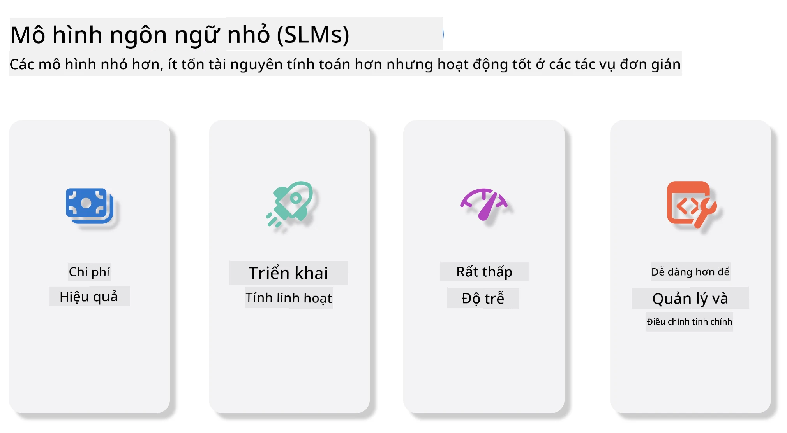
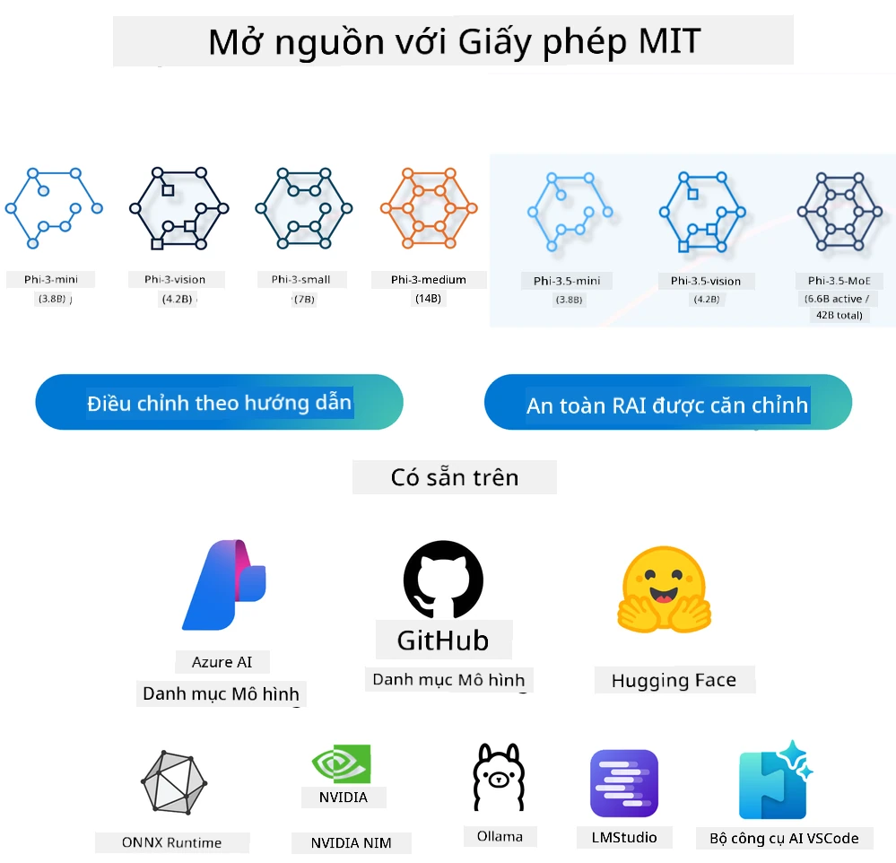
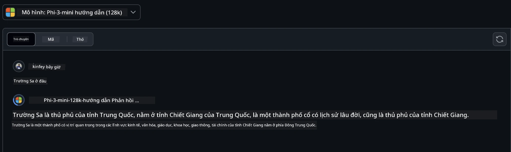
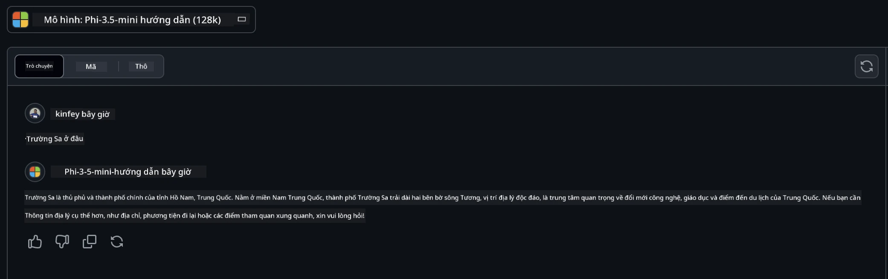

# Giới thiệu về Mô Hình Ngôn Ngữ Nhỏ cho AI Tạo Sinh dành cho Người Mới Bắt Đầu  
AI tạo sinh là một lĩnh vực hấp dẫn của trí tuệ nhân tạo tập trung vào việc tạo ra các hệ thống có khả năng tạo ra nội dung mới. Nội dung này có thể là văn bản, hình ảnh, âm nhạc và thậm chí là toàn bộ môi trường ảo. Một trong những ứng dụng thú vị nhất của AI tạo sinh là trong lĩnh vực mô hình ngôn ngữ.

## Mô Hình Ngôn Ngữ Nhỏ (Small Language Models) là gì?  

Mô Hình Ngôn Ngữ Nhỏ (SLM) đại diện cho biến thể thu nhỏ của một mô hình ngôn ngữ lớn (LLM), tận dụng nhiều nguyên lý kiến trúc và kỹ thuật của LLM, trong khi có dấu chân tính toán giảm đáng kể.

SLM là tập con của các mô hình ngôn ngữ được thiết kế để tạo ra văn bản giống con người. Khác với các mô hình lớn hơn như GPT-4, SLM nhỏ gọn và hiệu quả hơn, thích hợp cho những ứng dụng có giới hạn về tài nguyên tính toán. Mặc dù kích thước nhỏ hơn, chúng vẫn có thể thực hiện nhiều nhiệm vụ khác nhau. Thông thường, SLM được xây dựng bằng cách nén hoặc chiết xuất từ LLM, nhằm giữ lại phần lớn chức năng và khả năng ngôn ngữ của mô hình gốc. Sự giảm kích thước này làm giảm độ phức tạp tổng thể, giúp SLM hiệu quả hơn về mặt sử dụng bộ nhớ và yêu cầu tính toán. Bất chấp những tối ưu này, SLM vẫn có thể thực hiện nhiều tác vụ xử lý ngôn ngữ tự nhiên (NLP) đa dạng:

- Tạo văn bản: Tạo ra các câu hoặc đoạn văn mạch lạc và phù hợp với ngữ cảnh.
- Hoàn thành văn bản: Dự đoán và hoàn thành câu dựa trên câu gợi ý cho trước.
- Dịch thuật: Chuyển đổi văn bản từ ngôn ngữ này sang ngôn ngữ khác.
- Tóm tắt: Rút gọn các đoạn văn dài thành các bản tóm tắt ngắn gọn, dễ tiếp thu.

Tuy nhiên đôi khi có sự đánh đổi về hiệu suất hoặc độ sâu hiểu biết so với các mô hình lớn hơn.

## Mô Hình Ngôn Ngữ Nhỏ hoạt động như thế nào?  
SLM được huấn luyện trên một lượng lớn dữ liệu văn bản. Trong quá trình huấn luyện, chúng học các mẫu và cấu trúc của ngôn ngữ, giúp tạo ra văn bản vừa đúng ngữ pháp vừa phù hợp với ngữ cảnh. Quá trình huấn luyện bao gồm:

- Thu thập dữ liệu: Tập hợp các bộ dữ liệu văn bản lớn từ nhiều nguồn khác nhau.
- Tiền xử lý: Làm sạch và tổ chức dữ liệu để chuẩn bị cho việc huấn luyện.
- Huấn luyện: Sử dụng các thuật toán học máy để dạy mô hình hiểu và tạo văn bản.
- Tinh chỉnh: Điều chỉnh mô hình để nâng cao hiệu quả trên các nhiệm vụ cụ thể.

Việc phát triển SLM phù hợp với nhu cầu ngày càng tăng về các mô hình có thể triển khai trong môi trường hạn chế tài nguyên, như thiết bị di động hoặc các nền tảng điện toán biên, nơi mà các LLM toàn diện có thể không thực tế do yêu cầu tài nguyên cao. Bằng cách tập trung vào hiệu suất, SLM cân bằng giữa năng lực và khả năng tiếp cận, cho phép ứng dụng rộng rãi trong nhiều lĩnh vực.



## Mục tiêu học tập  

Trong bài học này, chúng ta sẽ tìm hiểu kiến thức về SLM và kết hợp nó với Microsoft Phi-3 để học các kịch bản khác nhau trong nội dung văn bản, thị giác và MoE.

Kết thúc bài học này, bạn sẽ có thể trả lời các câu hỏi sau:

- SLM là gì?
- Sự khác biệt giữa SLM và LLM là gì?
- Microsoft Phi-3/3.5 Family là gì?
- Làm thế nào để chạy suy luận với Microsoft Phi-3/3.5 Family?

Sẵn sàng chưa? Bắt đầu nào.

## Sự khác biệt giữa Mô hình Ngôn ngữ Lớn (LLMs) và Mô hình Ngôn ngữ Nhỏ (SLMs)  

Cả LLM và SLM đều được xây dựng dựa trên các nguyên lý cơ bản của học máy xác suất, áp dụng các phương pháp tương tự trong thiết kế kiến trúc, phương pháp huấn luyện, quy trình tạo dữ liệu và kỹ thuật đánh giá mô hình. Tuy nhiên, có một số yếu tố then chốt phân biệt hai loại mô hình này.

## Ứng dụng của Mô hình Ngôn ngữ Nhỏ  

SLM có phạm vi ứng dụng rộng, bao gồm:

- Chatbot: Cung cấp hỗ trợ khách hàng và tương tác với người dùng theo dạng hội thoại.
- Tạo nội dung: Hỗ trợ người viết ý tưởng hoặc thậm chí soạn thảo toàn bộ bài viết.
- Giáo dục: Giúp học sinh trong các bài tập viết hoặc học ngôn ngữ mới.
- Khả năng tiếp cận: Tạo ra các công cụ cho người khuyết tật, ví dụ hệ thống chuyển đổi văn bản thành giọng nói.

**Kích thước**  

Điểm khác biệt chính giữa LLM và SLM nằm ở quy mô mô hình. LLM như ChatGPT (GPT-4) có thể bao gồm khoảng 1.76 nghìn tỷ tham số, trong khi các SLM mã nguồn mở như Mistral 7B được thiết kế với số tham số ít hơn đáng kể — khoảng 7 tỷ. Sự chênh lệch này chủ yếu do khác biệt về kiến trúc mô hình và quy trình huấn luyện. Ví dụ, ChatGPT sử dụng cơ chế tự chú ý trong khung encoder-decoder, còn Mistral 7B dùng chú ý cửa sổ trượt, giúp huấn luyện hiệu quả hơn trong mô hình chỉ decoder. Sự khác biệt về kiến trúc này ảnh hưởng sâu sắc đến độ phức tạp và hiệu suất của các mô hình.

**Khả năng hiểu biết**  

SLM thường được tối ưu cho hiệu suất trong các lĩnh vực cụ thể, khiến chúng rất chuyên biệt nhưng có thể hạn chế trong việc cung cấp hiểu biết tổng quát đa lĩnh vực. Trong khi đó, LLM nhắm đến mô phỏng trí tuệ giống con người ở mức toàn diện hơn. Được huấn luyện trên các bộ dữ liệu lớn và đa dạng, LLM có khả năng hoạt động tốt trên nhiều lĩnh vực, mang lại sự linh hoạt và thích ứng lớn hơn. Do vậy, LLM phù hợp hơn cho đa dạng các nhiệm vụ hạ nguồn như xử lý ngôn ngữ tự nhiên và lập trình.

**Tính toán**  

Việc huấn luyện và triển khai LLM tốn nhiều tài nguyên, thường đòi hỏi hạ tầng tính toán đồ sộ, bao gồm các cụm GPU quy mô lớn. Ví dụ, huấn luyện một mô hình như ChatGPT từ đầu có thể cần hàng nghìn GPU trong thời gian dài. Trái lại, với số tham số nhỏ hơn, SLM dễ dàng tiếp cận hơn về mặt tài nguyên tính toán. Các mô hình như Mistral 7B có thể được huấn luyện và chạy trên máy cục bộ với GPU vừa phải, dù việc huấn luyện vẫn đòi hỏi nhiều giờ chạy trên nhiều GPU.

**Thiên kiến**  

Thiên kiến là vấn đề đã được biết ở LLM, chủ yếu do tính chất dữ liệu huấn luyện. Các mô hình này thường dựa vào dữ liệu thô, công khai trên Internet, có thể thiếu đại diện hoặc miêu tả sai một số nhóm, đưa vào nhãn sai hoặc phản ánh các thiên kiến ngôn ngữ do phương ngữ, biến thể địa lý và quy tắc ngữ pháp. Hơn nữa, độ phức tạp của kiến trúc LLM có thể làm tăng thiên kiến một cách vô ý mà không bị phát hiện nếu không được tinh chỉnh kỹ càng. Trong khi đó, SLM, do được huấn luyện trên các bộ dữ liệu giới hạn và chuyên ngành hơn, ít bị ảnh hưởng bởi các thiên kiến đó, nhưng không phải hoàn toàn miễn nhiễm.

**Suy luận**  

Kích thước nhỏ của SLM giúp chúng có lợi thế lớn về tốc độ suy luận, cho phép tạo ra kết quả nhanh chóng trên phần cứng cục bộ mà không cần xử lý song song lớn. Ngược lại, LLM do kích thước và độ phức tạp sẽ cần tài nguyên tính toán song song đáng kể để đạt thời gian suy luận chấp nhận được. Số lượng người dùng đồng thời cũng làm chậm thời gian phản hồi của LLM, nhất là khi triển khai ở quy mô lớn.

Tóm lại, dù cả LLM và SLM đều dựa trên học máy, chúng khác biệt rõ về kích thước mô hình, yêu cầu tài nguyên, khả năng hiểu ngữ cảnh, mức độ thiên kiến và tốc độ suy luận. Những khác biệt này phản ánh sự phù hợp của từng loại mô hình với các trường hợp sử dụng khác nhau: LLM nhiều chức năng nhưng tốn tài nguyên, còn SLM hiệu quả lĩnh vực cụ thể với yêu cầu tính toán nhẹ hơn.

***Lưu ý: Trong bài học này, chúng ta sẽ giới thiệu SLM sử dụng Microsoft Phi-3 / 3.5 làm ví dụ.***

## Giới thiệu gia đình Phi-3 / Phi-3.5  

Gia đình Phi-3 / 3.5 chủ yếu hướng đến các kịch bản ứng dụng về văn bản, thị giác và Agent (MoE):

### Phi-3 / 3.5 Instruct  

Chủ yếu dùng cho tạo văn bản, hoàn thành hội thoại và trích xuất thông tin nội dung, v.v.

**Phi-3-mini**  

Mô hình ngôn ngữ 3.8 tỷ tham số có sẵn trên Microsoft Azure AI Studio, Hugging Face và Ollama. Các mô hình Phi-3 vượt trội đáng kể so với các mô hình cùng kích thước và lớn hơn trong các bài đánh giá chính (xem các con số benchmark bên dưới, số cao hơn là tốt hơn). Phi-3-mini vượt trội hơn các mô hình gấp đôi kích thước nó, trong khi Phi-3-small và Phi-3-medium vượt trội các mô hình lớn hơn, bao gồm GPT-3.5.

**Phi-3-small & medium**  

Chỉ với 7 tỷ tham số, Phi-3-small đánh bại GPT-3.5T trong nhiều bài đánh giá về ngôn ngữ, lý luận, code và toán học.

Phi-3-medium với 14 tỷ tham số tiếp tục xu hướng này và đánh bại Gemini 1.0 Pro.

**Phi-3.5-mini**  

Có thể coi đây là bản nâng cấp của Phi-3-mini. Tham số không thay đổi nhưng cải thiện khả năng hỗ trợ đa ngôn ngữ (hỗ trợ hơn 20 ngôn ngữ: Ả Rập, Trung, Séc, Đan Mạch, Hà Lan, Anh, Phần Lan, Pháp, Đức, Do Thái, Hungary, Ý, Nhật, Hàn, Na Uy, Ba Lan, Bồ Đào Nha, Nga, Tây Ban Nha, Thụy Điển, Thái, Thổ Nhĩ Kỳ, Ukraina) và tăng cường hỗ trợ ngữ cảnh dài hơn.

Phi-3.5-mini với 3.8 tỷ tham số vượt trội các mô hình cùng kích thước và ngang bằng với các mô hình gấp đôi kích thước.

### Phi-3 / 3.5 Vision  

Chúng ta có thể xem mô hình Instruct của Phi-3/3.5 đại diện cho khả năng hiểu biết của Phi, và Vision chính là mắt của Phi để hiểu thế giới.

**Phi-3-Vision**  

Phi-3-Vision, với chỉ 4.2 tỷ tham số, tiếp tục xu hướng này và vượt trội các mô hình lớn hơn như Claude-3 Haiku và Gemini 1.0 Pro V trong các tác vụ suy luận thị giác tổng quát, OCR, và hiểu bảng biểu và sơ đồ.

**Phi-3.5-Vision**  

Phi-3.5-Vision cũng là bản nâng cấp của Phi-3-Vision, bổ sung hỗ trợ nhiều hình ảnh. Bạn có thể coi đây là cải tiến về thị giác — không chỉ nhìn thấy ảnh mà còn cả video.

Phi-3.5-Vision vượt trội các mô hình lớn hơn như Claude-3.5 Sonnet và Gemini 1.5 Flash trong các tác vụ OCR, hiểu bảng và biểu đồ, và ngang bằng trong các tác vụ suy luận kiến thức thị giác tổng quát. Hỗ trợ đầu vào đa khung hình, tức là suy luận trên nhiều ảnh đầu vào.

### Phi-3.5-MoE  

***Mixture of Experts (MoE)*** cho phép mô hình được tiền huấn luyện với ít tính toán hơn rất nhiều, có nghĩa là bạn có thể mở rộng quy mô mô hình hoặc bộ dữ liệu trên cùng một ngân sách tính toán với mô hình dense. Đặc biệt, mô hình MoE có thể đạt chất lượng tương tự mô hình dense nhanh hơn nhiều trong quá trình tiền huấn luyện.

Phi-3.5-MoE bao gồm 16 module chuyên gia 3.8 tỷ tham số. Phi-3.5-MoE với chỉ 6.6 tỷ tham số hoạt động có hiệu quả tương đương về suy luận, hiểu ngôn ngữ và toán học so với các mô hình lớn hơn nhiều.

Chúng ta có thể sử dụng mô hình Phi-3/3.5 dựa vào các kịch bản khác nhau. Khác với LLM, bạn có thể triển khai Phi-3/3.5-mini hoặc Phi-3/3.5-Vision trên các thiết bị biên.

## Cách sử dụng các mô hình gia đình Phi-3/3.5  

Chúng ta mong muốn dùng Phi-3/3.5 trong nhiều kịch bản khác nhau. Tiếp theo, ta sẽ sử dụng Phi-3/3.5 dựa trên các kịch bản khác nhau.



### Suy luận thông qua Cloud APIs  

**GitHub Models**  

GitHub Models là cách trực tiếp nhất. Bạn có thể nhanh chóng truy cập mô hình Phi-3/3.5-Instruct qua GitHub Models. Kết hợp với Azure AI Inference SDK / OpenAI SDK, bạn có thể gọi API qua mã để hoàn thành lời gọi Phi-3/3.5-Instruct. Bạn cũng có thể thử nghiệm các hiệu ứng khác nhau qua Playground.

- Demo: So sánh hiệu quả của Phi-3-mini và Phi-3.5-mini trong kịch bản tiếng Trung





**Azure AI Studio**  

Hoặc nếu muốn sử dụng các mô hình thị giác và MoE, bạn có thể dùng Azure AI Studio để thực hiện lời gọi. Nếu quan tâm, bạn có thể đọc Phi-3 Cookbook để biết cách gọi Phi-3/3.5 Instruct, Vision, MoE thông qua Azure AI Studio [Click vào link này](https://github.com/microsoft/Phi-3CookBook/blob/main/md/02.QuickStart/AzureAIStudio_QuickStart.md?WT.mc_id=academic-105485-koreyst)

**NVIDIA NIM**  

Ngoài các giải pháp Model Catalog trên đám mây do Azure và GitHub cung cấp, bạn cũng có thể dùng [NVIDIA NIM](https://developer.nvidia.com/nim?WT.mc_id=academic-105485-koreyst) để thực hiện các lời gọi liên quan. Bạn có thể truy cập NVIDIA NIM để thực hiện các cuộc gọi API của gia đình Phi-3/3.5. NVIDIA NIM (NVIDIA Inference Microservices) là tập hợp các microservice suy luận được tăng tốc, giúp các nhà phát triển triển khai các mô hình AI hiệu quả trên nhiều môi trường khác nhau, bao gồm đám mây, trung tâm dữ liệu và workstation.

Dưới đây là một số tính năng chính của NVIDIA NIM:
- **Dễ dàng Triển khai:** NIM cho phép triển khai các mô hình AI chỉ với một lệnh duy nhất, giúp tích hợp dễ dàng vào các quy trình làm việc hiện có.
- **Hiệu suất Tối ưu:** Nó tận dụng các bộ công cụ suy luận được tối ưu sẵn của NVIDIA, chẳng hạn như TensorRT và TensorRT-LLM, để đảm bảo độ trễ thấp và thông lượng cao.
- **Khả năng Mở rộng:** NIM hỗ trợ tự động mở rộng trên Kubernetes, giúp xử lý hiệu quả các khối lượng công việc biến đổi.
- **Bảo mật và Kiểm soát:** Các tổ chức có thể duy trì quyền kiểm soát dữ liệu và ứng dụng của họ bằng cách tự lưu trữ các dịch vụ vi mô NIM trên hạ tầng quản lý riêng.
- **API Chuẩn:** NIM cung cấp các API theo tiêu chuẩn ngành, giúp dễ dàng xây dựng và tích hợp các ứng dụng AI như chatbot, trợ lý AI và hơn thế nữa.

NIM là một phần của NVIDIA AI Enterprise, nhằm đơn giản hóa việc triển khai và vận hành các mô hình AI, đảm bảo chúng chạy hiệu quả trên GPU NVIDIA.

- Demo: Sử dụng NVIDIA NIM để gọi Phi-3.5-Vision-API  [[Nhấp vào liên kết này](./python/Phi-3-Vision-Nividia-NIM.ipynb?WT.mc_id=academic-105485-koreyst)]


### Chạy Phi-3/3.5 Cục bộ
Suy luận liên quan đến Phi-3, hoặc bất kỳ mô hình ngôn ngữ nào như GPT-3, ám chỉ quá trình tạo ra phản hồi hoặc dự đoán dựa trên đầu vào nó nhận được. Khi bạn cung cấp một lời nhắc hoặc câu hỏi cho Phi-3, nó sử dụng mạng nơ-ron đã được huấn luyện để suy luận phản hồi có khả năng xảy ra nhất và phù hợp nhất bằng cách phân tích các mẫu và mối quan hệ trong dữ liệu mà nó đã được đào tạo.

**Hugging Face Transformer**
Hugging Face Transformers là một thư viện mạnh mẽ được thiết kế cho xử lý ngôn ngữ tự nhiên (NLP) và các tác vụ học máy khác. Dưới đây là một số điểm chính về nó:

1. **Mô hình Được Huấn luyện Sẵn**: Thư viện cung cấp hàng ngàn mô hình đã được huấn luyện sẵn có thể sử dụng cho các tác vụ đa dạng như phân loại văn bản, nhận dạng thực thể, trả lời câu hỏi, tóm tắt, dịch thuật và tạo văn bản.

2. **Tương thích Nhiều Framework:** Thư viện hỗ trợ nhiều framework học sâu, bao gồm PyTorch, TensorFlow và JAX. Điều này cho phép bạn huấn luyện mô hình trên một framework và sử dụng nó trên một framework khác.

3. **Khả năng Đa phương thức:** Ngoài NLP, Hugging Face Transformers còn hỗ trợ các tác vụ trong thị giác máy tính (ví dụ: phân loại hình ảnh, phát hiện đối tượng) và xử lý âm thanh (ví dụ: nhận dạng giọng nói, phân loại âm thanh).

4. **Dễ Sử Dụng:** Thư viện cung cấp API và công cụ để dễ dàng tải về và tinh chỉnh mô hình, phù hợp cho cả người mới bắt đầu và chuyên gia.

5. **Cộng đồng và Tài nguyên:** Hugging Face có một cộng đồng năng động và tài liệu đặc tả phong phú, cùng các bài hướng dẫn giúp người dùng bắt đầu và tận dụng tối đa thư viện.
[tài liệu chính thức](https://huggingface.co/docs/transformers/index?WT.mc_id=academic-105485-koreyst) hoặc [kho GitHub của họ](https://github.com/huggingface/transformers?WT.mc_id=academic-105485-koreyst).

Đây là phương pháp được sử dụng phổ biến nhất, nhưng cũng đòi hỏi tăng tốc bằng GPU. Sau cùng, các kịch bản như Vision và MoE yêu cầu nhiều tính toán, sẽ rất chậm trên CPU nếu không được lượng tử hóa.


- Demo: Sử dụng Transformer để gọi Phi-3.5-Instruct [Nhấp vào liên kết này](./python/phi35-instruct-demo.ipynb?WT.mc_id=academic-105485-koreyst)

- Demo: Sử dụng Transformer để gọi Phi-3.5-Vision [Nhấp vào liên kết này](./python/phi35-vision-demo.ipynb?WT.mc_id=academic-105485-koreyst)

- Demo: Sử dụng Transformer để gọi Phi-3.5-MoE [Nhấp vào liên kết này](./python/phi35_moe_demo.ipynb?WT.mc_id=academic-105485-koreyst)

**Ollama**
[Ollama](https://ollama.com/?WT.mc_id=academic-105485-koreyst) là một nền tảng được thiết kế để giúp chạy các mô hình ngôn ngữ lớn (LLM) trên máy cục bộ dễ dàng hơn. Nó hỗ trợ nhiều mô hình như Llama 3.1, Phi 3, Mistral và Gemma 2, trong số những mô hình khác. Nền tảng đơn giản hóa quá trình bằng cách đóng gói trọng số mô hình, cấu hình và dữ liệu vào một gói duy nhất, giúp người dùng dễ dàng tùy chỉnh và tạo ra mô hình riêng của mình. Ollama có sẵn cho macOS, Linux và Windows. Đây là công cụ tuyệt vời nếu bạn muốn thử nghiệm hoặc triển khai LLM mà không phải phụ thuộc vào dịch vụ đám mây. Ollama là cách trực tiếp nhất, bạn chỉ cần thực thi lệnh sau.


```bash

ollama run phi3.5

```


**ONNX Runtime cho GenAI**

[ONNX Runtime](https://github.com/microsoft/onnxruntime-genai?WT.mc_id=academic-105485-koreyst) là một bộ tăng tốc học máy đa nền tảng cho suy luận và đào tạo. ONNX Runtime cho Generative AI (GENAI) là một công cụ mạnh mẽ giúp bạn chạy các mô hình AI sinh tạo hiệu quả trên nhiều nền tảng khác nhau.

## ONNX Runtime là gì?
ONNX Runtime là một dự án mã nguồn mở cho phép thực hiện suy luận hiệu suất cao các mô hình học máy. Nó hỗ trợ các mô hình ở định dạng Open Neural Network Exchange (ONNX), một chuẩn để biểu diễn mô hình học máy. ONNX Runtime có thể giúp cải thiện trải nghiệm khách hàng nhanh hơn và giảm chi phí, hỗ trợ các mô hình từ framework học sâu như PyTorch và TensorFlow/Keras cũng như các thư viện học máy truyền thống như scikit-learn, LightGBM, XGBoost, v.v. ONNX Runtime tương thích với nhiều phần cứng, trình điều khiển và hệ điều hành khác nhau, đồng thời cung cấp hiệu suất tối ưu bằng cách tận dụng tăng tốc phần cứng song song với tối ưu hóa và biến đổi đồ thị.

## AI Sinh Tạo là gì?
AI sinh tạo đề cập đến các hệ thống AI có thể tạo ra nội dung mới, như văn bản, hình ảnh hoặc âm nhạc, dựa trên dữ liệu chúng đã được huấn luyện. Ví dụ bao gồm các mô hình ngôn ngữ như GPT-3 và mô hình tạo ảnh như Stable Diffusion. Thư viện ONNX Runtime cho GenAI cung cấp vòng lặp AI sinh tạo cho các mô hình ONNX, bao gồm suy luận với ONNX Runtime, xử lý logits, tìm kiếm và lấy mẫu, và quản lý bộ nhớ đệm KV.

## ONNX Runtime cho GENAI
ONNX Runtime cho GENAI mở rộng khả năng của ONNX Runtime để hỗ trợ các mô hình AI sinh tạo. Dưới đây là một số tính năng chính:

- **Hỗ trợ Nhiều Nền tảng:** Nó hoạt động trên nhiều nền tảng, bao gồm Windows, Linux, macOS, Android và iOS.
- **Hỗ trợ Mô hình:** Hỗ trợ nhiều mô hình AI sinh tạo phổ biến như LLaMA, GPT-Neo, BLOOM và nhiều mô hình khác.
- **Tối ưu Hiệu suất:** Bao gồm các tối ưu cho các bộ tăng tốc phần cứng khác nhau như GPU NVIDIA, GPU AMD và hơn thế nữa.
- **Dễ Dàng Sử Dụng:** Cung cấp API để dễ dàng tích hợp vào ứng dụng, cho phép bạn tạo văn bản, hình ảnh và các nội dung khác với vài dòng mã.
- Người dùng có thể gọi phương thức generate() cấp cao, hoặc chạy từng vòng lặp mô hình từng token một, và tuỳ chọn cập nhật tham số sinh tạo trong vòng lặp.
- ONNX Runtime cũng hỗ trợ tìm kiếm greedy/beam và lấy mẫu TopP, TopK để tạo chuỗi token và xử lý logits tích hợp như phạt lặp lại. Bạn cũng có thể dễ dàng thêm điểm số tùy chỉnh.

## Bắt đầu
Để bắt đầu với ONNX Runtime cho GENAI, bạn có thể làm theo các bước sau:

### Cài đặt ONNX Runtime:
```Python
pip install onnxruntime
```
### Cài đặt Tiện ích Mở rộng Generative AI:
```Python
pip install onnxruntime-genai
```

### Chạy Mô hình: Đây là ví dụ đơn giản bằng Python:
```Python
import onnxruntime_genai as og

model = og.Model('path_to_your_model.onnx')

tokenizer = og.Tokenizer(model)

input_text = "Hello, how are you?"

input_tokens = tokenizer.encode(input_text)

output_tokens = model.generate(input_tokens)

output_text = tokenizer.decode(output_tokens)

print(output_text) 
```
### Demo: Sử dụng ONNX Runtime GenAI để gọi Phi-3.5-Vision


```python

import onnxruntime_genai as og

model_path = './Your Phi-3.5-vision-instruct ONNX Path'

img_path = './Your Image Path'

model = og.Model(model_path)

processor = model.create_multimodal_processor()

tokenizer_stream = processor.create_stream()

text = "Your Prompt"

prompt = "<|user|>\n"

prompt += "<|image_1|>\n"

prompt += f"{text}<|end|>\n"

prompt += "<|assistant|>\n"

image = og.Images.open(img_path)

inputs = processor(prompt, images=image)

params = og.GeneratorParams(model)

params.set_inputs(inputs)

params.set_search_options(max_length=3072)

generator = og.Generator(model, params)

while not generator.is_done():

    generator.compute_logits()
    
    generator.generate_next_token()

    new_token = generator.get_next_tokens()[0]
    
    output = tokenizer_stream.decode(new_token)
    
    print(tokenizer_stream.decode(new_token), end='', flush=True)

```


**Khác**

Ngoài các phương pháp tham chiếu ONNX Runtime và Ollama, chúng ta cũng có thể hoàn thiện việc tham chiếu các mô hình định lượng dựa trên phương pháp tham chiếu mô hình do các nhà sản xuất khác nhau cung cấp. Chẳng hạn như Apple MLX framework với Apple Metal, Qualcomm QNN với NPU, Intel OpenVINO với CPU/GPU, v.v. Bạn cũng có thể tìm thêm nội dung tại [Phi-3 Cookbook](https://github.com/microsoft/phi-3cookbook?WT.mc_id=academic-105485-koreyst)


## Thêm nữa

Chúng ta đã tìm hiểu những kiến thức cơ bản về Gia đình Phi-3/3.5, nhưng để học sâu về SLM cần nhiều kiến thức hơn. Bạn có thể tìm câu trả lời trong Phi-3 Cookbook. Nếu bạn muốn tìm hiểu thêm, vui lòng truy cập [Phi-3 Cookbook](https://github.com/microsoft/phi-3cookbook?WT.mc_id=academic-105485-koreyst).

---

<!-- CO-OP TRANSLATOR DISCLAIMER START -->
**Tuyên bố miễn trừ trách nhiệm**:  
Tài liệu này đã được dịch bằng dịch vụ dịch thuật AI [Co-op Translator](https://github.com/Azure/co-op-translator). Mặc dù chúng tôi cố gắng đảm bảo độ chính xác, vui lòng lưu ý rằng bản dịch tự động có thể chứa lỗi hoặc không chính xác. Tài liệu gốc bằng ngôn ngữ gốc của nó nên được coi là nguồn thông tin chính thức. Đối với thông tin quan trọng, khuyến nghị sử dụng dịch vụ dịch thuật chuyên nghiệp do con người thực hiện. Chúng tôi không chịu trách nhiệm về bất kỳ hiểu lầm hay giải thích sai nào phát sinh từ việc sử dụng bản dịch này.
<!-- CO-OP TRANSLATOR DISCLAIMER END -->