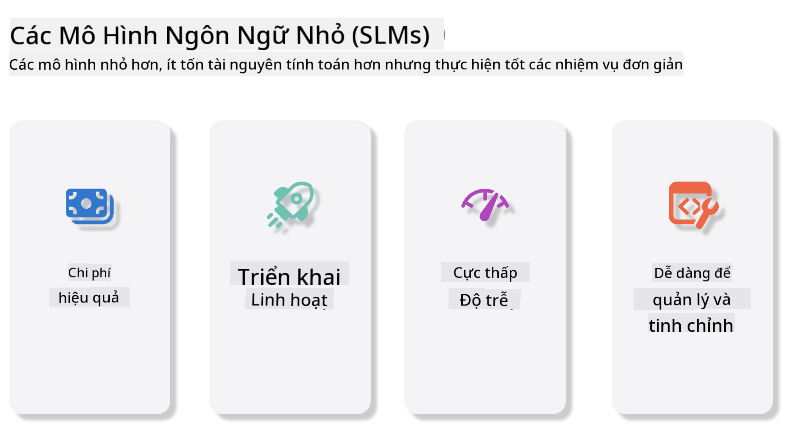
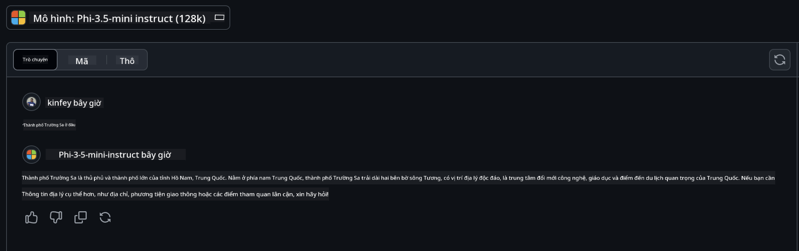

<!--
CO_OP_TRANSLATOR_METADATA:
{
  "original_hash": "124ad36cfe96f74038811b6e2bb93e9d",
  "translation_date": "2025-07-09T18:40:55+00:00",
  "source_file": "19-slm/README.md",
  "language_code": "vi"
}
-->
# Giới thiệu về Mô hình Ngôn ngữ Nhỏ cho Generative AI dành cho Người mới bắt đầu  
Generative AI là một lĩnh vực hấp dẫn của trí tuệ nhân tạo, tập trung vào việc tạo ra các hệ thống có khả năng sinh ra nội dung mới. Nội dung này có thể bao gồm văn bản, hình ảnh, âm nhạc và thậm chí cả các môi trường ảo hoàn chỉnh. Một trong những ứng dụng thú vị nhất của generative AI là trong lĩnh vực mô hình ngôn ngữ.

## Mô hình Ngôn ngữ Nhỏ là gì?  

Mô hình Ngôn ngữ Nhỏ (SLM) là phiên bản thu nhỏ của mô hình ngôn ngữ lớn (LLM), tận dụng nhiều nguyên tắc kiến trúc và kỹ thuật của LLM, nhưng có dấu chân tính toán nhỏ hơn đáng kể.  

SLM là một tập con của các mô hình ngôn ngữ được thiết kế để tạo ra văn bản giống như con người. Khác với các mô hình lớn hơn như GPT-4, SLM nhỏ gọn và hiệu quả hơn, phù hợp cho các ứng dụng có hạn chế về tài nguyên tính toán. Mặc dù kích thước nhỏ hơn, chúng vẫn có thể thực hiện nhiều nhiệm vụ khác nhau. Thông thường, SLM được xây dựng bằng cách nén hoặc chưng cất từ LLM, nhằm giữ lại phần lớn chức năng và khả năng ngôn ngữ của mô hình gốc. Việc giảm kích thước mô hình giúp giảm độ phức tạp tổng thể, làm cho SLM hiệu quả hơn về cả bộ nhớ và yêu cầu tính toán. Dù được tối ưu như vậy, SLM vẫn có thể thực hiện nhiều tác vụ xử lý ngôn ngữ tự nhiên (NLP) như:  

- Tạo văn bản: Tạo ra các câu hoặc đoạn văn mạch lạc và phù hợp ngữ cảnh.  
- Hoàn thành văn bản: Dự đoán và hoàn thiện câu dựa trên gợi ý cho trước.  
- Dịch thuật: Chuyển đổi văn bản từ ngôn ngữ này sang ngôn ngữ khác.  
- Tóm tắt: Rút gọn các đoạn văn dài thành bản tóm tắt ngắn gọn, dễ hiểu.  

Tuy nhiên, có một số đánh đổi về hiệu suất hoặc độ sâu hiểu biết so với các mô hình lớn hơn.  

## Mô hình Ngôn ngữ Nhỏ hoạt động như thế nào?  
SLM được huấn luyện trên lượng lớn dữ liệu văn bản. Trong quá trình huấn luyện, chúng học các mẫu và cấu trúc của ngôn ngữ, giúp tạo ra văn bản vừa đúng ngữ pháp vừa phù hợp ngữ cảnh. Quá trình huấn luyện bao gồm:  

- Thu thập dữ liệu: Tập hợp các bộ dữ liệu văn bản lớn từ nhiều nguồn khác nhau.  
- Tiền xử lý: Làm sạch và tổ chức dữ liệu để phù hợp cho việc huấn luyện.  
- Huấn luyện: Sử dụng các thuật toán học máy để dạy mô hình cách hiểu và tạo văn bản.  
- Tinh chỉnh: Điều chỉnh mô hình để cải thiện hiệu suất trên các nhiệm vụ cụ thể.  

Việc phát triển SLM phù hợp với nhu cầu ngày càng tăng về các mô hình có thể triển khai trong môi trường hạn chế tài nguyên, như thiết bị di động hoặc nền tảng điện toán biên, nơi mà LLM đầy đủ có thể không thực tế do yêu cầu tài nguyên lớn. Bằng cách tập trung vào hiệu quả, SLM cân bằng giữa hiệu suất và khả năng tiếp cận, giúp mở rộng ứng dụng trong nhiều lĩnh vực khác nhau.  

  

## Mục tiêu học tập  

Trong bài học này, chúng ta sẽ tìm hiểu về SLM và kết hợp với Microsoft Phi-3 để khám phá các kịch bản khác nhau trong nội dung văn bản, thị giác và MoE.  

Kết thúc bài học, bạn sẽ có thể trả lời các câu hỏi sau:  

- SLM là gì  
- Sự khác biệt giữa SLM và LLM là gì  
- Microsoft Phi-3/3.5 Family là gì  
- Cách suy luận với Microsoft Phi-3/3.5 Family  

Sẵn sàng chưa? Bắt đầu thôi.  

## Sự khác biệt giữa Mô hình Ngôn ngữ Lớn (LLM) và Mô hình Ngôn ngữ Nhỏ (SLM)  

Cả LLM và SLM đều dựa trên các nguyên tắc cơ bản của học máy xác suất, theo các phương pháp tương tự trong thiết kế kiến trúc, phương pháp huấn luyện, quy trình tạo dữ liệu và kỹ thuật đánh giá mô hình. Tuy nhiên, có một số yếu tố chính phân biệt hai loại mô hình này.  

## Ứng dụng của Mô hình Ngôn ngữ Nhỏ  

SLM có nhiều ứng dụng đa dạng, bao gồm:  

- Chatbot: Hỗ trợ khách hàng và tương tác với người dùng theo cách hội thoại.  
- Tạo nội dung: Hỗ trợ người viết bằng cách tạo ý tưởng hoặc thậm chí soạn thảo toàn bộ bài viết.  
- Giáo dục: Giúp học sinh làm bài tập viết hoặc học ngôn ngữ mới.  
- Hỗ trợ tiếp cận: Tạo công cụ cho người khuyết tật, như hệ thống chuyển văn bản thành giọng nói.  

**Kích thước**  

Điểm khác biệt chính giữa LLM và SLM nằm ở quy mô mô hình. LLM như ChatGPT (GPT-4) có thể chứa khoảng 1,76 nghìn tỷ tham số, trong khi các SLM mã nguồn mở như Mistral 7B chỉ có khoảng 7 tỷ tham số. Sự chênh lệch này chủ yếu do khác biệt trong kiến trúc và quy trình huấn luyện. Ví dụ, ChatGPT sử dụng cơ chế self-attention trong kiến trúc encoder-decoder, còn Mistral 7B dùng sliding window attention, giúp huấn luyện hiệu quả hơn trong mô hình chỉ có decoder. Sự khác biệt kiến trúc này ảnh hưởng sâu sắc đến độ phức tạp và hiệu suất của các mô hình.  

**Khả năng hiểu**  

SLM thường được tối ưu cho hiệu suất trong các lĩnh vực cụ thể, làm cho chúng rất chuyên biệt nhưng có thể hạn chế trong việc cung cấp hiểu biết ngữ cảnh rộng trên nhiều lĩnh vực kiến thức. Ngược lại, LLM hướng tới mô phỏng trí tuệ giống con người ở mức độ toàn diện hơn. Được huấn luyện trên các bộ dữ liệu đa dạng và lớn, LLM có khả năng hoạt động tốt trên nhiều lĩnh vực, mang lại tính linh hoạt và thích ứng cao hơn. Do đó, LLM phù hợp hơn cho nhiều nhiệm vụ hạ nguồn như xử lý ngôn ngữ tự nhiên và lập trình.  

**Tính toán**  

Việc huấn luyện và triển khai LLM đòi hỏi nhiều tài nguyên, thường cần hạ tầng tính toán lớn, bao gồm các cụm GPU quy mô lớn. Ví dụ, huấn luyện một mô hình như ChatGPT từ đầu có thể cần hàng nghìn GPU trong thời gian dài. Trong khi đó, SLM với số lượng tham số nhỏ hơn dễ tiếp cận hơn về mặt tài nguyên tính toán. Các mô hình như Mistral 7B có thể được huấn luyện và chạy trên máy cá nhân với GPU vừa phải, mặc dù quá trình huấn luyện vẫn cần vài giờ trên nhiều GPU.  

**Thiên vị**  

Thiên vị là vấn đề phổ biến trong LLM, chủ yếu do bản chất dữ liệu huấn luyện. Các mô hình này thường dựa vào dữ liệu thô, công khai trên internet, có thể thiếu đại diện hoặc sai lệch về một số nhóm, gây nhãn sai hoặc phản ánh thiên vị ngôn ngữ do phương ngữ, biến thể địa lý và quy tắc ngữ pháp. Thêm vào đó, kiến trúc phức tạp của LLM có thể làm tăng thiên vị một cách vô tình, khó phát hiện nếu không tinh chỉnh kỹ lưỡng. Ngược lại, SLM được huấn luyện trên các bộ dữ liệu hạn chế và chuyên ngành hơn, do đó ít bị ảnh hưởng bởi thiên vị, mặc dù không hoàn toàn miễn nhiễm.  

**Suy luận**  

Kích thước nhỏ hơn giúp SLM có lợi thế lớn về tốc độ suy luận, cho phép tạo ra kết quả nhanh chóng trên phần cứng cục bộ mà không cần xử lý song song phức tạp. Trong khi đó, LLM do kích thước và độ phức tạp lớn thường cần nhiều tài nguyên tính toán song song để đạt thời gian suy luận chấp nhận được. Số lượng người dùng đồng thời cũng làm chậm thời gian phản hồi của LLM, đặc biệt khi triển khai ở quy mô lớn.  

Tóm lại, mặc dù LLM và SLM cùng dựa trên nền tảng học máy, chúng khác biệt rõ rệt về kích thước mô hình, yêu cầu tài nguyên, khả năng hiểu ngữ cảnh, mức độ thiên vị và tốc độ suy luận. Những khác biệt này phản ánh sự phù hợp của từng loại mô hình với các trường hợp sử dụng khác nhau, trong đó LLM đa năng hơn nhưng tốn tài nguyên, còn SLM hiệu quả hơn trong các lĩnh vực chuyên biệt với yêu cầu tính toán thấp hơn.  

***Lưu ý: Trong chương này, chúng ta sẽ giới thiệu SLM thông qua ví dụ Microsoft Phi-3 / 3.5.***  

## Giới thiệu về Phi-3 / Phi-3.5 Family  

Phi-3 / 3.5 Family chủ yếu hướng tới các kịch bản ứng dụng về văn bản, thị giác và Agent (MoE):  

### Phi-3 / 3.5 Instruct  

Chủ yếu dùng cho tạo văn bản, hoàn thành hội thoại và trích xuất thông tin nội dung, v.v.  

**Phi-3-mini**  

Mô hình ngôn ngữ 3.8 tỷ tham số có sẵn trên Microsoft Azure AI Studio, Hugging Face và Ollama. Các mô hình Phi-3 vượt trội hơn đáng kể so với các mô hình ngôn ngữ cùng kích thước hoặc lớn hơn trên các chuẩn đánh giá chính (xem số liệu benchmark bên dưới, số cao hơn là tốt hơn). Phi-3-mini vượt trội hơn các mô hình gấp đôi kích thước, trong khi Phi-3-small và Phi-3-medium vượt trội hơn các mô hình lớn hơn, bao gồm cả GPT-3.5.  

**Phi-3-small & medium**  

Với chỉ 7 tỷ tham số, Phi-3-small đánh bại GPT-3.5T trên nhiều chuẩn đánh giá về ngôn ngữ, suy luận, lập trình và toán học.  

Phi-3-medium với 14 tỷ tham số tiếp tục xu hướng này và vượt trội hơn Gemini 1.0 Pro.  

**Phi-3.5-mini**  

Có thể coi đây là bản nâng cấp của Phi-3-mini. Mặc dù số tham số không đổi, nó cải thiện khả năng hỗ trợ đa ngôn ngữ (hỗ trợ hơn 20 ngôn ngữ: Ả Rập, Trung, Séc, Đan Mạch, Hà Lan, Anh, Phần Lan, Pháp, Đức, Hebrew, Hungary, Ý, Nhật, Hàn, Na Uy, Ba Lan, Bồ Đào Nha, Nga, Tây Ban Nha, Thụy Điển, Thái, Thổ Nhĩ Kỳ, Ukraina) và tăng cường hỗ trợ ngữ cảnh dài.  

Phi-3.5-mini với 3.8 tỷ tham số vượt trội hơn các mô hình cùng kích thước và tương đương với các mô hình gấp đôi kích thước.  

### Phi-3 / 3.5 Vision  

Có thể coi mô hình Instruct của Phi-3/3.5 như khả năng hiểu của Phi, còn Vision là “đôi mắt” giúp Phi nhận biết thế giới.  

**Phi-3-Vision**  

Phi-3-vision, với chỉ 4.2 tỷ tham số, tiếp tục xu hướng này và vượt trội hơn các mô hình lớn hơn như Claude-3 Haiku và Gemini 1.0 Pro V trong các nhiệm vụ suy luận hình ảnh tổng quát, OCR, và hiểu bảng biểu, sơ đồ.  

**Phi-3.5-Vision**  

Phi-3.5-Vision cũng là bản nâng cấp của Phi-3-Vision, bổ sung hỗ trợ đa hình ảnh. Bạn có thể coi đây là cải tiến về thị giác, không chỉ nhìn thấy hình ảnh mà còn cả video.  

Phi-3.5-vision vượt trội hơn các mô hình lớn như Claude-3.5 Sonnet và Gemini 1.5 Flash trong các nhiệm vụ OCR, hiểu bảng biểu và biểu đồ, và tương đương trong các nhiệm vụ suy luận kiến thức hình ảnh tổng quát. Hỗ trợ đầu vào đa khung hình, tức là suy luận trên nhiều hình ảnh đầu vào.  

### Phi-3.5-MoE  

***Mixture of Experts (MoE)*** cho phép mô hình được huấn luyện trước với lượng tính toán ít hơn nhiều, nghĩa là bạn có thể mở rộng quy mô mô hình hoặc bộ dữ liệu với cùng ngân sách tính toán như mô hình dày đặc. Cụ thể, mô hình MoE nên đạt chất lượng tương đương với mô hình dày đặc nhanh hơn nhiều trong quá trình huấn luyện trước.  

Phi-3.5-MoE gồm 16 module chuyên gia 3.8 tỷ tham số. Phi-3.5-MoE với chỉ 6.6 tỷ tham số hoạt động đạt mức suy luận, hiểu ngôn ngữ và toán học tương đương các mô hình lớn hơn nhiều.  

Chúng ta có thể sử dụng mô hình Phi-3/3.5 Family dựa trên các kịch bản khác nhau. Khác với LLM, bạn có thể triển khai Phi-3/3.5-mini hoặc Phi-3/3.5-Vision trên các thiết bị biên.  

## Cách sử dụng các mô hình Phi-3/3.5 Family  

Chúng ta hy vọng sử dụng Phi-3/3.5 trong các kịch bản khác nhau. Tiếp theo, chúng ta sẽ sử dụng Phi-3/3.5 dựa trên các kịch bản khác nhau.  

  

### Sự khác biệt khi suy luận qua API đám mây  

**GitHub Models**  

GitHub Models là cách trực tiếp nhất. Bạn có thể nhanh chóng truy cập mô hình Phi-3/3.5-Instruct qua GitHub Models. Kết hợp với Azure AI Inference SDK / OpenAI SDK, bạn có thể gọi API qua code để hoàn thành gọi Phi-3/3.5-Instruct. Bạn cũng có thể thử nghiệm các hiệu quả khác nhau qua Playground.  

- Demo: So sánh hiệu quả của Phi-3-mini và Phi-3.5-mini trong các kịch bản tiếng Trung  

  

  

**Azure AI Studio**  

Hoặc nếu bạn muốn sử dụng các mô hình thị giác và MoE, bạn có thể dùng Azure AI Studio để gọi. Nếu quan tâm, bạn có thể đọc Phi-3 Cookbook để học cách gọi Phi-3/3.5 Instruct, Vision, MoE qua Azure AI Studio [Click vào đây](https://github.com/microsoft/Phi-3CookBook/blob/main/md/02.QuickStart/AzureAIStudio_QuickStart.md?WT.mc_id=academic-105485-koreyst)  

**NVIDIA NIM**  

Ngoài các giải pháp Model Catalog dựa trên đám mây do Azure và GitHub cung cấp, bạn cũng có thể sử dụng [NVIDIA NIM](https://developer.nvidia.com/nim?WT.mc_id=academic-105485-koreyst) để thực hiện các cuộc gọi liên quan. Bạn có thể truy cập NVIDIA NIM để hoàn thành các cuộc gọi API của Phi-3/3.5 Family. NVIDIA NIM (NVIDIA Inference Microservices) là bộ dịch vụ vi mô suy luận tăng tốc được thiết kế giúp các nhà phát triển triển khai mô hình AI hiệu quả trên nhiều môi trường khác nhau, bao gồm đám mây, trung tâm dữ liệu và máy trạm.  

Dưới đây là một số tính năng chính của NVIDIA NIM:  

- **Dễ triển khai:** NIM cho phép triển khai mô hình AI chỉ với một lệnh, giúp tích hợp dễ dàng vào quy trình làm việc hiện có.  
- **Hiệu suất tối ưu:** Tận dụng các engine suy luận được tối ưu sẵn của NVIDIA, như TensorRT và TensorRT-LLM, đảm bảo độ trễ thấp và thông lượng cao.  
- **Khả năng mở rộng:** NIM hỗ trợ tự động mở rộng trên Kubernetes, giúp xử lý hiệu quả các khối lượng công việc thay đổi.
- **Bảo mật và Kiểm soát:** Các tổ chức có thể duy trì quyền kiểm soát dữ liệu và ứng dụng của mình bằng cách tự lưu trữ các microservices NIM trên hạ tầng do chính họ quản lý.
- **API Chuẩn:** NIM cung cấp các API theo tiêu chuẩn ngành, giúp dễ dàng xây dựng và tích hợp các ứng dụng AI như chatbot, trợ lý AI, và nhiều hơn nữa.

NIM là một phần của NVIDIA AI Enterprise, nhằm đơn giản hóa việc triển khai và vận hành các mô hình AI, đảm bảo chúng hoạt động hiệu quả trên GPU của NVIDIA.

- Demo: Sử dụng Nividia NIM để gọi Phi-3.5-Vision-API  [[Nhấn vào đây](python/Phi-3-Vision-Nividia-NIM.ipynb)]


### Inference Phi-3/3.5 trong môi trường cục bộ
Inference liên quan đến Phi-3, hoặc bất kỳ mô hình ngôn ngữ nào như GPT-3, là quá trình tạo ra phản hồi hoặc dự đoán dựa trên đầu vào nhận được. Khi bạn cung cấp một câu hỏi hoặc yêu cầu cho Phi-3, nó sử dụng mạng nơ-ron đã được huấn luyện để suy luận phản hồi phù hợp và có khả năng nhất bằng cách phân tích các mẫu và mối quan hệ trong dữ liệu đã được huấn luyện.

**Hugging Face Transformer**  
Hugging Face Transformers là một thư viện mạnh mẽ được thiết kế cho xử lý ngôn ngữ tự nhiên (NLP) và các tác vụ học máy khác. Dưới đây là một số điểm chính về nó:

1. **Mô hình đã được huấn luyện sẵn:** Cung cấp hàng ngàn mô hình đã được huấn luyện sẵn cho các tác vụ như phân loại văn bản, nhận dạng thực thể có tên, trả lời câu hỏi, tóm tắt, dịch thuật và tạo văn bản.

2. **Tương thích đa framework:** Thư viện hỗ trợ nhiều framework học sâu như PyTorch, TensorFlow và JAX. Điều này cho phép bạn huấn luyện mô hình trên một framework và sử dụng nó trên framework khác.

3. **Khả năng đa phương tiện:** Ngoài NLP, Hugging Face Transformers còn hỗ trợ các tác vụ trong thị giác máy tính (ví dụ: phân loại ảnh, phát hiện đối tượng) và xử lý âm thanh (ví dụ: nhận dạng giọng nói, phân loại âm thanh).

4. **Dễ sử dụng:** Thư viện cung cấp API và công cụ để dễ dàng tải xuống và tinh chỉnh mô hình, phù hợp cho cả người mới bắt đầu và chuyên gia.

5. **Cộng đồng và tài nguyên:** Hugging Face có một cộng đồng sôi động cùng tài liệu, hướng dẫn và bài học phong phú giúp người dùng bắt đầu và tận dụng tối đa thư viện.  
[thư viện chính thức](https://huggingface.co/docs/transformers/index?WT.mc_id=academic-105485-koreyst) hoặc kho mã nguồn [GitHub](https://github.com/huggingface/transformers?WT.mc_id=academic-105485-koreyst).

Đây là phương pháp phổ biến nhất, nhưng cũng đòi hỏi tăng tốc GPU. Bởi vì các tác vụ như Vision và MoE cần rất nhiều phép tính, nếu không được lượng tử hóa thì CPU sẽ rất hạn chế.

- Demo: Sử dụng Transformer để gọi Phi-3.5-Instuct [Nhấn vào đây](python/phi35-instruct-demo.ipynb)

- Demo: Sử dụng Transformer để gọi Phi-3.5-Vision [Nhấn vào đây](python/phi35-vision-demo.ipynb)

- Demo: Sử dụng Transformer để gọi Phi-3.5-MoE [Nhấn vào đây](python/phi35_moe_demo.ipynb)

**Ollama**  
[Ollama](https://ollama.com/?WT.mc_id=academic-105485-koreyst) là một nền tảng giúp bạn dễ dàng chạy các mô hình ngôn ngữ lớn (LLMs) ngay trên máy của mình. Nó hỗ trợ nhiều mô hình như Llama 3.1, Phi 3, Mistral, Gemma 2, và nhiều hơn nữa. Nền tảng này đơn giản hóa quá trình bằng cách đóng gói trọng số mô hình, cấu hình và dữ liệu thành một gói duy nhất, giúp người dùng dễ dàng tùy chỉnh và tạo mô hình riêng. Ollama có sẵn cho macOS, Linux và Windows. Đây là công cụ tuyệt vời nếu bạn muốn thử nghiệm hoặc triển khai LLM mà không phụ thuộc vào dịch vụ đám mây. Ollama là cách trực tiếp nhất, bạn chỉ cần thực thi câu lệnh sau.

```bash

ollama run phi3.5

```

**ONNX Runtime cho GenAI**

[ONNX Runtime](https://github.com/microsoft/onnxruntime-genai?WT.mc_id=academic-105485-koreyst) là một trình tăng tốc học máy đa nền tảng cho cả inference và training. ONNX Runtime cho Generative AI (GENAI) là công cụ mạnh mẽ giúp bạn chạy các mô hình AI sinh tạo hiệu quả trên nhiều nền tảng khác nhau.

## ONNX Runtime là gì?  
ONNX Runtime là dự án mã nguồn mở cho phép thực thi inference các mô hình học máy với hiệu suất cao. Nó hỗ trợ các mô hình theo định dạng Open Neural Network Exchange (ONNX), một tiêu chuẩn để biểu diễn mô hình học máy. ONNX Runtime giúp cải thiện trải nghiệm khách hàng với tốc độ nhanh hơn và giảm chi phí, hỗ trợ các mô hình từ các framework học sâu như PyTorch, TensorFlow/Keras cũng như các thư viện học máy truyền thống như scikit-learn, LightGBM, XGBoost, v.v. ONNX Runtime tương thích với nhiều phần cứng, driver và hệ điều hành khác nhau, đồng thời tối ưu hiệu suất bằng cách tận dụng các bộ tăng tốc phần cứng cùng các tối ưu hóa và biến đổi đồ thị.

## Generative AI là gì?  
Generative AI là các hệ thống AI có khả năng tạo ra nội dung mới như văn bản, hình ảnh hoặc âm nhạc dựa trên dữ liệu đã được huấn luyện. Ví dụ bao gồm các mô hình ngôn ngữ như GPT-3 và các mô hình tạo ảnh như Stable Diffusion. Thư viện ONNX Runtime cho GenAI cung cấp vòng lặp AI sinh tạo cho các mô hình ONNX, bao gồm inference với ONNX Runtime, xử lý logits, tìm kiếm và lấy mẫu, cũng như quản lý bộ nhớ đệm KV.

## ONNX Runtime cho GENAI  
ONNX Runtime cho GENAI mở rộng khả năng của ONNX Runtime để hỗ trợ các mô hình AI sinh tạo. Một số tính năng chính:

- **Hỗ trợ đa nền tảng:** Hoạt động trên nhiều nền tảng như Windows, Linux, macOS, Android và iOS.  
- **Hỗ trợ mô hình:** Hỗ trợ nhiều mô hình AI sinh tạo phổ biến như LLaMA, GPT-Neo, BLOOM và nhiều hơn nữa.  
- **Tối ưu hiệu suất:** Bao gồm các tối ưu cho các bộ tăng tốc phần cứng như GPU NVIDIA, GPU AMD, v.v.  
- **Dễ sử dụng:** Cung cấp API để tích hợp dễ dàng vào ứng dụng, cho phép bạn tạo văn bản, hình ảnh và nội dung khác chỉ với vài dòng mã.  
- Người dùng có thể gọi phương thức generate() cấp cao, hoặc chạy từng vòng lặp của mô hình, tạo ra từng token một, và tùy chọn cập nhật các tham số sinh trong vòng lặp.  
- ONNX Runtime cũng hỗ trợ tìm kiếm greedy/beam và lấy mẫu TopP, TopK để tạo chuỗi token cùng với xử lý logits tích hợp như phạt lặp lại. Bạn cũng có thể dễ dàng thêm điểm số tùy chỉnh.

## Bắt đầu  
Để bắt đầu với ONNX Runtime cho GENAI, bạn có thể làm theo các bước sau:

### Cài đặt ONNX Runtime:  
```Python
pip install onnxruntime
```  
### Cài đặt phần mở rộng Generative AI:  
```Python
pip install onnxruntime-genai
```

### Chạy mô hình: Ví dụ đơn giản bằng Python:  
```Python
import onnxruntime_genai as og

model = og.Model('path_to_your_model.onnx')

tokenizer = og.Tokenizer(model)

input_text = "Hello, how are you?"

input_tokens = tokenizer.encode(input_text)

output_tokens = model.generate(input_tokens)

output_text = tokenizer.decode(output_tokens)

print(output_text) 
```  
### Demo: Sử dụng ONNX Runtime GenAI để gọi Phi-3.5-Vision

```python

import onnxruntime_genai as og

model_path = './Your Phi-3.5-vision-instruct ONNX Path'

img_path = './Your Image Path'

model = og.Model(model_path)

processor = model.create_multimodal_processor()

tokenizer_stream = processor.create_stream()

text = "Your Prompt"

prompt = "<|user|>\n"

prompt += "<|image_1|>\n"

prompt += f"{text}<|end|>\n"

prompt += "<|assistant|>\n"

image = og.Images.open(img_path)

inputs = processor(prompt, images=image)

params = og.GeneratorParams(model)

params.set_inputs(inputs)

params.set_search_options(max_length=3072)

generator = og.Generator(model, params)

while not generator.is_done():

    generator.compute_logits()
    
    generator.generate_next_token()

    new_token = generator.get_next_tokens()[0]
    
    code += tokenizer_stream.decode(new_token)
    
    print(tokenizer_stream.decode(new_token), end='', flush=True)

```

**Các phương pháp khác**

Ngoài ONNX Runtime và Ollama, chúng ta cũng có thể hoàn thiện tham chiếu các mô hình lượng tử dựa trên các phương pháp tham chiếu mô hình do các nhà sản xuất khác nhau cung cấp. Ví dụ như framework Apple MLX với Apple Metal, Qualcomm QNN với NPU, Intel OpenVINO với CPU/GPU, v.v. Bạn cũng có thể tìm thêm nội dung tại [Phi-3 Cookbook](https://github.com/microsoft/phi-3cookbook?WT.mc_id=academic-105485-koreyst)

## Thêm nữa

Chúng ta đã tìm hiểu những kiến thức cơ bản về Phi-3/3.5 Family, nhưng để hiểu sâu hơn về SLM cần nhiều kiến thức hơn. Bạn có thể tìm câu trả lời trong Phi-3 Cookbook. Nếu muốn học thêm, vui lòng truy cập [Phi-3 Cookbook](https://github.com/microsoft/phi-3cookbook?WT.mc_id=academic-105485-koreyst).

**Tuyên bố từ chối trách nhiệm**:  
Tài liệu này đã được dịch bằng dịch vụ dịch thuật AI [Co-op Translator](https://github.com/Azure/co-op-translator). Mặc dù chúng tôi cố gắng đảm bảo độ chính xác, xin lưu ý rằng các bản dịch tự động có thể chứa lỗi hoặc không chính xác. Tài liệu gốc bằng ngôn ngữ gốc của nó nên được coi là nguồn chính xác và đáng tin cậy. Đối với các thông tin quan trọng, nên sử dụng dịch vụ dịch thuật chuyên nghiệp do con người thực hiện. Chúng tôi không chịu trách nhiệm về bất kỳ sự hiểu lầm hoặc giải thích sai nào phát sinh từ việc sử dụng bản dịch này.