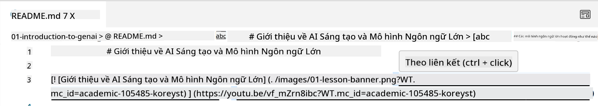
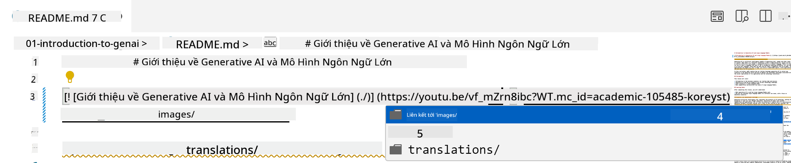
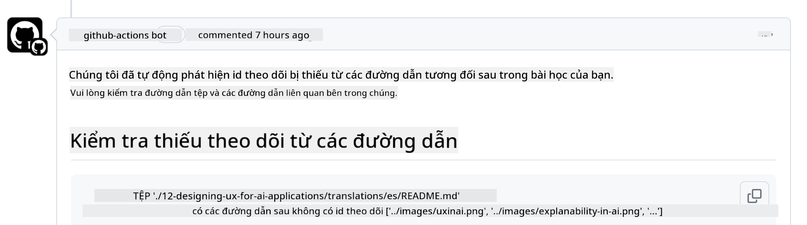
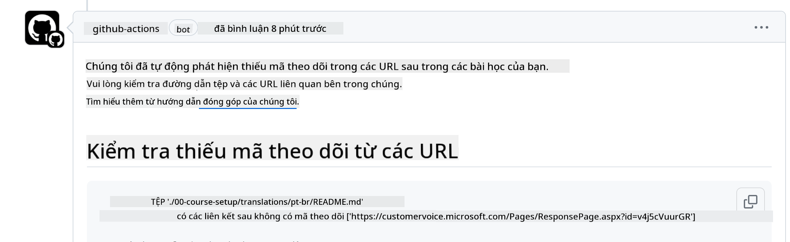
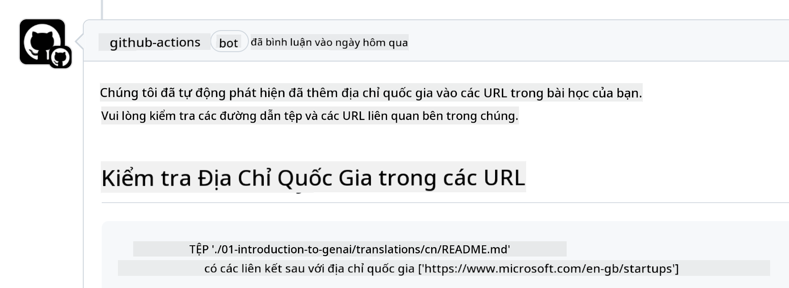

<!--
CO_OP_TRANSLATOR_METADATA:
{
  "original_hash": "57c41f2af71001a2cff9d8eb797cb843",
  "translation_date": "2025-05-19T11:20:33+00:00",
  "source_file": "CONTRIBUTING.md",
  "language_code": "vi"
}
-->
# Đóng góp

Dự án này hoan nghênh các đóng góp và đề xuất. Hầu hết các đóng góp yêu cầu bạn đồng ý với Thỏa thuận Cấp phép Người đóng góp (CLA), tuyên bố rằng bạn có quyền và thực sự cấp cho chúng tôi quyền sử dụng đóng góp của bạn. Để biết chi tiết, hãy truy cập <https://cla.microsoft.com>.

> Quan trọng: khi dịch văn bản trong repo này, vui lòng đảm bảo rằng bạn không sử dụng dịch máy. Chúng tôi sẽ xác minh bản dịch thông qua cộng đồng, vì vậy hãy chỉ tình nguyện dịch sang ngôn ngữ mà bạn thành thạo.

Khi bạn gửi yêu cầu kéo, CLA-bot sẽ tự động xác định xem bạn có cần cung cấp CLA hay không và trang trí PR một cách phù hợp (ví dụ: nhãn, bình luận). Chỉ cần làm theo hướng dẫn được cung cấp bởi bot. Bạn chỉ cần làm điều này một lần trên tất cả các kho lưu trữ sử dụng CLA của chúng tôi.

## Quy tắc ứng xử

Dự án này đã áp dụng [Quy tắc Ứng xử Mã Nguồn Mở của Microsoft](https://opensource.microsoft.com/codeofconduct/?WT.mc_id=academic-105485-koreyst). Để biết thêm thông tin, hãy đọc [Câu hỏi thường gặp về Quy tắc Ứng xử](https://opensource.microsoft.com/codeofconduct/faq/?WT.mc_id=academic-105485-koreyst) hoặc liên hệ [opencode@microsoft.com](mailto:opencode@microsoft.com) với bất kỳ câu hỏi hoặc bình luận nào khác.

## Câu hỏi hoặc Vấn đề?

Vui lòng không mở các vấn đề GitHub cho các câu hỏi hỗ trợ chung vì danh sách GitHub nên được sử dụng cho các yêu cầu tính năng và báo cáo lỗi. Bằng cách này, chúng tôi có thể dễ dàng theo dõi các vấn đề hoặc lỗi thực tế từ mã và giữ cho thảo luận chung tách biệt khỏi mã thực tế.

## Lỗi chính tả, Vấn đề, Lỗi và đóng góp

Bất cứ khi nào bạn gửi bất kỳ thay đổi nào vào kho lưu trữ Generative AI for Beginners, vui lòng tuân theo các khuyến nghị sau.

* Luôn fork kho lưu trữ vào tài khoản của riêng bạn trước khi thực hiện các sửa đổi của mình
* Không kết hợp nhiều thay đổi vào một yêu cầu kéo. Ví dụ, gửi bất kỳ sửa lỗi và cập nhật tài liệu bằng các PR riêng biệt
* Nếu yêu cầu kéo của bạn hiển thị xung đột hợp nhất, hãy đảm bảo cập nhật local main của bạn để phản ánh những gì có trong kho lưu trữ chính trước khi thực hiện các sửa đổi của bạn
* Nếu bạn đang gửi một bản dịch, vui lòng tạo một PR cho tất cả các tệp đã dịch vì chúng tôi không chấp nhận bản dịch một phần cho nội dung
* Nếu bạn đang gửi một sửa lỗi chính tả hoặc tài liệu, bạn có thể kết hợp các sửa đổi vào một PR duy nhất nếu phù hợp

## Hướng dẫn chung khi viết

- Đảm bảo rằng tất cả các URL của bạn được đặt trong dấu ngoặc vuông theo sau là dấu ngoặc đơn mà không có khoảng trắng thừa xung quanh hoặc bên trong chúng ``.
- Đảm bảo rằng bất kỳ liên kết tương đối nào (tức là liên kết đến các tệp và thư mục khác trong kho lưu trữ) bắt đầu bằng `./` đề cập đến một tệp hoặc thư mục nằm trong thư mục làm việc hiện tại hoặc `../` đề cập đến một tệp hoặc thư mục nằm trong thư mục làm việc cha.
- Đảm bảo rằng bất kỳ liên kết tương đối nào (tức là liên kết đến các tệp và thư mục khác trong kho lưu trữ) có ID theo dõi (tức là `?` hoặc `&` sau đó `wt.mc_id=` hoặc `WT.mc_id=`) ở cuối.
- Đảm bảo rằng bất kỳ URL nào từ các tên miền sau _github.com, microsoft.com, visualstudio.com, aka.ms và azure.com_ có ID theo dõi (tức là `?` hoặc `&` sau đó `wt.mc_id=` hoặc `WT.mc_id=`) ở cuối.
- Đảm bảo rằng liên kết của bạn không có mã quốc gia cụ thể trong chúng (tức là `/en-us/` hoặc `/en/`).
- Đảm bảo rằng tất cả các hình ảnh được lưu trữ trong thư mục `./images`.
- Đảm bảo rằng hình ảnh có tên mô tả bằng các ký tự tiếng Anh, số và dấu gạch ngang trong tên hình ảnh của bạn.

## Quy trình làm việc GitHub

Khi bạn gửi yêu cầu kéo, bốn quy trình làm việc khác nhau sẽ được kích hoạt để xác nhận các quy tắc trước đó. Chỉ cần làm theo hướng dẫn được liệt kê ở đây để vượt qua kiểm tra quy trình làm việc.

- [Kiểm tra Đường dẫn Tương đối Bị hỏng](../..)
- [Kiểm tra Đường dẫn Có Theo dõi](../..)
- [Kiểm tra URL Có Theo dõi](../..)
- [Kiểm tra URL Không Có Mã Quốc gia](../..)

### Kiểm tra Đường dẫn Tương đối Bị hỏng

Quy trình làm việc này đảm bảo rằng bất kỳ đường dẫn tương đối nào trong tệp của bạn đều hoạt động. Kho lưu trữ này được triển khai lên GitHub pages nên bạn cần rất cẩn thận khi nhập các liên kết kết nối mọi thứ lại với nhau để không dẫn ai đến sai nơi.

Để đảm bảo rằng liên kết của bạn hoạt động đúng cách, chỉ cần sử dụng VS code để kiểm tra.

Ví dụ, khi bạn di chuột qua bất kỳ liên kết nào trong tệp của mình, bạn sẽ được nhắc theo liên kết bằng cách nhấn **ctrl + click**

Nếu bạn nhấp vào một liên kết và nó không hoạt động cục bộ thì chắc chắn nó sẽ kích hoạt quy trình làm việc và không hoạt động trên GitHub.

Để khắc phục vấn đề này, hãy thử nhập liên kết với sự trợ giúp của VS code.

Khi bạn nhập `./` hoặc `../` VS code sẽ nhắc bạn chọn từ các tùy chọn có sẵn theo những gì bạn đã nhập.

Theo đường dẫn bằng cách nhấp vào tệp hoặc thư mục mong muốn và bạn sẽ chắc chắn rằng đường dẫn của bạn không bị hỏng.

Một khi bạn thêm đúng đường dẫn tương đối, lưu và đẩy các thay đổi của bạn, quy trình làm việc sẽ được kích hoạt lại để xác minh các thay đổi của bạn. Nếu bạn vượt qua kiểm tra thì bạn đã sẵn sàng.

### Kiểm tra Đường dẫn Có Theo dõi

Quy trình làm việc này đảm bảo rằng bất kỳ đường dẫn tương đối nào đều có theo dõi trong đó. Kho lưu trữ này được triển khai lên GitHub pages nên chúng tôi cần theo dõi sự di chuyển giữa các tệp và thư mục khác nhau.

Để đảm bảo đường dẫn tương đối của bạn có theo dõi trong đó, chỉ cần kiểm tra văn bản sau `?wt.mc_id=` ở cuối đường dẫn. Nếu nó được thêm vào đường dẫn tương đối của bạn thì bạn sẽ vượt qua kiểm tra này.

Nếu không, bạn có thể nhận được lỗi sau.

Để khắc phục vấn đề này, hãy thử mở đường dẫn tệp mà quy trình làm việc đã làm nổi bật và thêm ID theo dõi vào cuối các đường dẫn tương đối.

Một khi bạn thêm ID theo dõi, lưu và đẩy các thay đổi của bạn, quy trình làm việc sẽ được kích hoạt lại để xác minh các thay đổi của bạn. Nếu bạn vượt qua kiểm tra thì bạn đã sẵn sàng.

### Kiểm tra URL Có Theo dõi

Quy trình làm việc này đảm bảo rằng bất kỳ URL web nào đều có theo dõi trong đó. Kho lưu trữ này có sẵn cho mọi người nên bạn cần đảm bảo theo dõi truy cập để biết từ đâu lưu lượng truy cập đến.

Để đảm bảo URL của bạn có theo dõi trong đó, chỉ cần kiểm tra văn bản sau `?wt.mc_id=` ở cuối URL. Nếu nó được thêm vào URL của bạn thì bạn sẽ vượt qua kiểm tra này.

Nếu không, bạn có thể nhận được lỗi sau.

Để khắc phục vấn đề này, hãy thử mở đường dẫn tệp mà quy trình làm việc đã làm nổi bật và thêm ID theo dõi vào cuối các URL.

Một khi bạn thêm ID theo dõi, lưu và đẩy các thay đổi của bạn, quy trình làm việc sẽ được kích hoạt lại để xác minh các thay đổi của bạn. Nếu bạn vượt qua kiểm tra thì bạn đã sẵn sàng.

### Kiểm tra URL Không Có Mã Quốc gia

Quy trình làm việc này đảm bảo rằng bất kỳ URL web nào không có mã quốc gia cụ thể trong đó. Kho lưu trữ này có sẵn cho mọi người trên toàn thế giới nên bạn cần đảm bảo không bao gồm mã quốc gia của bạn trong URL.

Để đảm bảo URL của bạn không có mã quốc gia trong đó, chỉ cần kiểm tra văn bản sau `/en-us/` hoặc `/en/` hoặc bất kỳ mã ngôn ngữ nào khác ở bất kỳ đâu trong URL. Nếu nó không có trong URL của bạn thì bạn sẽ vượt qua kiểm tra này.

Nếu không, bạn có thể nhận được lỗi sau.

Để khắc phục vấn đề này, hãy thử mở đường dẫn tệp mà quy trình làm việc đã làm nổi bật và loại bỏ mã quốc gia khỏi URL.

Một khi bạn loại bỏ mã quốc gia, lưu và đẩy các thay đổi của bạn, quy trình làm việc sẽ được kích hoạt lại để xác minh các thay đổi của bạn. Nếu bạn vượt qua kiểm tra thì bạn đã sẵn sàng.

Chúc mừng! Chúng tôi sẽ liên lạc lại với bạn sớm nhất có thể với phản hồi về đóng góp của bạn.

**Tuyên bố miễn trừ trách nhiệm**:  
Tài liệu này đã được dịch bằng dịch vụ dịch thuật AI [Co-op Translator](https://github.com/Azure/co-op-translator). Mặc dù chúng tôi cố gắng đảm bảo độ chính xác, xin lưu ý rằng các bản dịch tự động có thể chứa lỗi hoặc không chính xác. Tài liệu gốc bằng ngôn ngữ bản địa nên được coi là nguồn tài liệu có thẩm quyền. Đối với thông tin quan trọng, khuyến nghị sử dụng dịch vụ dịch thuật chuyên nghiệp từ con người. Chúng tôi không chịu trách nhiệm cho bất kỳ sự hiểu lầm hoặc diễn giải sai nào phát sinh từ việc sử dụng bản dịch này.