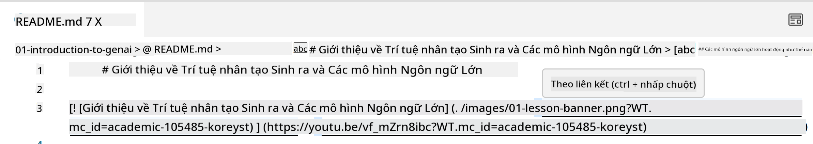
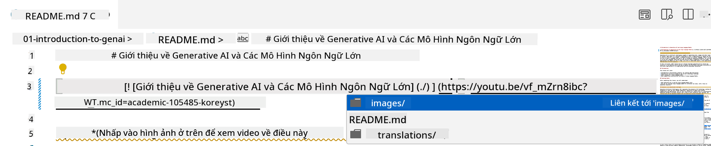
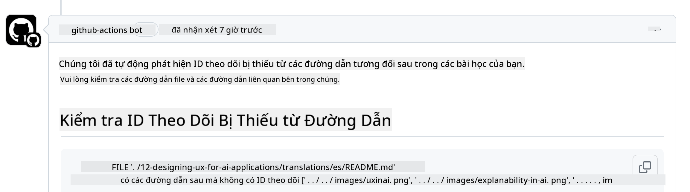
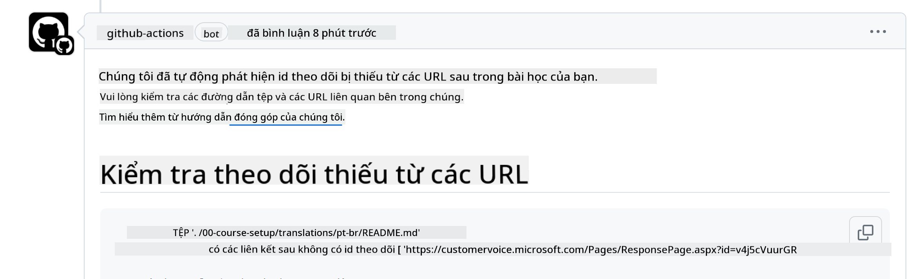
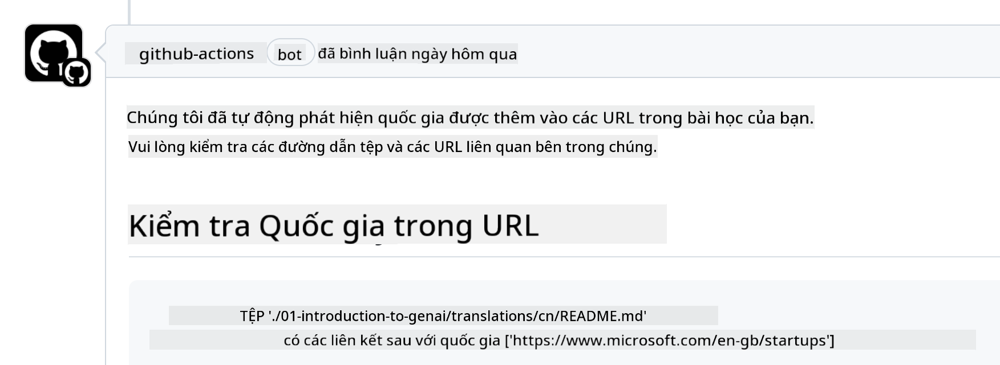

<!--
CO_OP_TRANSLATOR_METADATA:
{
  "original_hash": "57c41f2af71001a2cff9d8eb797cb843",
  "translation_date": "2025-06-25T07:15:04+00:00",
  "source_file": "CONTRIBUTING.md",
  "language_code": "vi"
}
-->
# Đóng góp

Dự án này hoan nghênh các đóng góp và đề xuất. Hầu hết các đóng góp yêu cầu bạn đồng ý với Thỏa thuận Cấp phép Người đóng góp (CLA) tuyên bố rằng bạn có quyền, và thực sự, cấp cho chúng tôi quyền sử dụng đóng góp của bạn. Để biết chi tiết, hãy truy cập <https://cla.microsoft.com>.

> Quan trọng: khi dịch văn bản trong kho lưu trữ này, vui lòng đảm bảo rằng bạn không sử dụng dịch máy. Chúng tôi sẽ xác minh các bản dịch thông qua cộng đồng, vì vậy chỉ tình nguyện dịch những ngôn ngữ mà bạn thông thạo.

Khi bạn gửi một yêu cầu kéo, một bot CLA sẽ tự động xác định liệu bạn có cần cung cấp CLA và gắn nhãn PR phù hợp (ví dụ: nhãn, bình luận). Chỉ cần làm theo hướng dẫn do bot cung cấp. Bạn chỉ cần làm điều này một lần trên tất cả các kho lưu trữ sử dụng CLA của chúng tôi.

## Quy tắc ứng xử

Dự án này đã áp dụng [Quy tắc ứng xử mã nguồn mở của Microsoft](https://opensource.microsoft.com/codeofconduct/?WT.mc_id=academic-105485-koreyst). Để biết thêm thông tin, hãy đọc [Câu hỏi thường gặp về Quy tắc ứng xử](https://opensource.microsoft.com/codeofconduct/faq/?WT.mc_id=academic-105485-koreyst) hoặc liên hệ [opencode@microsoft.com](mailto:opencode@microsoft.com) với bất kỳ câu hỏi hoặc ý kiến nào thêm.

## Câu hỏi hoặc vấn đề?

Vui lòng không mở các vấn đề GitHub cho các câu hỏi hỗ trợ chung vì danh sách GitHub nên được sử dụng cho các yêu cầu tính năng và báo cáo lỗi. Bằng cách này, chúng tôi có thể dễ dàng theo dõi các vấn đề hoặc lỗi thực tế từ mã và giữ cho cuộc thảo luận chung tách biệt khỏi mã thực tế.

## Lỗi chính tả, vấn đề, lỗi và đóng góp

Bất cứ khi nào bạn gửi bất kỳ thay đổi nào cho kho lưu trữ Generative AI for Beginners, vui lòng làm theo các khuyến nghị này.

* Luôn fork kho lưu trữ vào tài khoản của riêng bạn trước khi thực hiện các sửa đổi
* Không kết hợp nhiều thay đổi vào một yêu cầu kéo. Ví dụ, gửi bất kỳ sửa lỗi nào và cập nhật tài liệu bằng các PR riêng biệt
* Nếu yêu cầu kéo của bạn hiển thị xung đột hợp nhất, hãy đảm bảo cập nhật local main của bạn để phản ánh những gì có trong kho lưu trữ chính trước khi thực hiện các sửa đổi
* Nếu bạn đang gửi một bản dịch, vui lòng tạo một PR cho tất cả các tệp đã dịch vì chúng tôi không chấp nhận các bản dịch một phần cho nội dung
* Nếu bạn đang gửi một lỗi chính tả hoặc sửa tài liệu, bạn có thể kết hợp các sửa đổi vào một PR duy nhất nếu phù hợp

## Hướng dẫn chung khi viết

- Đảm bảo rằng tất cả các URL của bạn được đặt trong dấu ngoặc vuông theo sau là dấu ngoặc đơn không có khoảng trắng thêm xung quanh hoặc bên trong chúng ``.
- Đảm bảo rằng bất kỳ liên kết tương đối nào (tức là liên kết đến các tệp và thư mục khác trong kho lưu trữ) bắt đầu bằng `./` đề cập đến một tệp hoặc thư mục nằm trong thư mục làm việc hiện tại hoặc `../` đề cập đến một tệp hoặc thư mục nằm trong thư mục làm việc cha.
- Đảm bảo rằng bất kỳ liên kết tương đối nào (tức là liên kết đến các tệp và thư mục khác trong kho lưu trữ) có một ID theo dõi (tức là `?` hoặc `&` sau đó `wt.mc_id=` hoặc `WT.mc_id=`) ở cuối.
- Đảm bảo rằng bất kỳ URL nào từ các miền sau _github.com, microsoft.com, visualstudio.com, aka.ms, và azure.com_ có một ID theo dõi (tức là `?` hoặc `&` sau đó `wt.mc_id=` hoặc `WT.mc_id=`) ở cuối.
- Đảm bảo rằng các liên kết của bạn không có mã ngôn ngữ cụ thể cho quốc gia trong chúng (tức là `/en-us/` hoặc `/en/`).
- Đảm bảo rằng tất cả các hình ảnh được lưu trữ trong thư mục `./images`.
- Đảm bảo rằng các hình ảnh có tên mô tả bằng các ký tự tiếng Anh, số và dấu gạch ngang trong tên của hình ảnh của bạn.

## Quy trình làm việc trên GitHub

Khi bạn gửi một yêu cầu kéo, bốn quy trình làm việc khác nhau sẽ được kích hoạt để xác nhận các quy tắc trước đó. Chỉ cần làm theo các hướng dẫn được liệt kê ở đây để vượt qua các kiểm tra quy trình làm việc.

- [Kiểm tra Đường dẫn Tương đối Bị Hỏng](../..)
- [Kiểm tra Đường dẫn Có Theo dõi](../..)
- [Kiểm tra URL Có Theo dõi](../..)
- [Kiểm tra URL Không Có Locale](../..)

### Kiểm tra Đường dẫn Tương đối Bị Hỏng

Quy trình làm việc này đảm bảo rằng bất kỳ đường dẫn tương đối nào trong tệp của bạn đang hoạt động. Kho lưu trữ này được triển khai lên các trang GitHub vì vậy bạn cần phải rất cẩn thận khi gõ các liên kết kết nối mọi thứ với nhau để không dẫn ai đó đến sai chỗ.

Để đảm bảo rằng các liên kết của bạn hoạt động đúng, chỉ cần sử dụng VS code để kiểm tra điều đó.

Ví dụ, khi bạn di chuột qua bất kỳ liên kết nào trong tệp của bạn, bạn sẽ được nhắc theo liên kết bằng cách nhấn **ctrl + click**

Nếu bạn nhấp vào một liên kết và nó không hoạt động cục bộ thì, chắc chắn nó sẽ kích hoạt quy trình làm việc và không hoạt động trên GitHub.

Để khắc phục vấn đề này, hãy thử gõ liên kết với sự trợ giúp của VS code.

Khi bạn gõ `./` hoặc `../`, VS code sẽ nhắc bạn chọn từ các tùy chọn có sẵn theo những gì bạn đã gõ.

Theo dõi đường dẫn bằng cách nhấp vào tệp hoặc thư mục mong muốn và bạn sẽ chắc chắn rằng đường dẫn của bạn không bị hỏng.

Khi bạn thêm đường dẫn tương đối đúng, lưu và đẩy các thay đổi của bạn, quy trình làm việc sẽ được kích hoạt lại để xác minh các thay đổi của bạn. Nếu bạn vượt qua kiểm tra thì bạn đã sẵn sàng.

### Kiểm tra Đường dẫn Có Theo dõi

Quy trình làm việc này đảm bảo rằng bất kỳ đường dẫn tương đối nào có theo dõi trong đó. Kho lưu trữ này được triển khai lên các trang GitHub vì vậy chúng tôi cần theo dõi sự di chuyển giữa các tệp và thư mục khác nhau.

Để đảm bảo rằng các đường dẫn tương đối của bạn có theo dõi trong chúng, chỉ cần kiểm tra văn bản sau `?wt.mc_id=` ở cuối đường dẫn. Nếu nó được thêm vào các đường dẫn tương đối của bạn thì bạn sẽ vượt qua kiểm tra này.

Nếu không, bạn có thể nhận được lỗi sau.

Để khắc phục vấn đề này, hãy thử mở đường dẫn tệp mà quy trình làm việc đã làm nổi bật và thêm ID theo dõi vào cuối các đường dẫn tương đối.

Khi bạn thêm ID theo dõi, lưu và đẩy các thay đổi của bạn, quy trình làm việc sẽ được kích hoạt lại để xác minh các thay đổi của bạn. Nếu bạn vượt qua kiểm tra thì bạn đã sẵn sàng.

### Kiểm tra URL Có Theo dõi

Quy trình làm việc này đảm bảo rằng bất kỳ URL web nào có theo dõi trong đó. Kho lưu trữ này có sẵn cho mọi người vì vậy bạn cần đảm bảo theo dõi truy cập để biết từ đâu lưu lượng truy cập đến.

Để đảm bảo rằng các URL của bạn có theo dõi trong chúng, chỉ cần kiểm tra văn bản sau `?wt.mc_id=` ở cuối URL. Nếu nó được thêm vào các URL của bạn thì bạn sẽ vượt qua kiểm tra này.

Nếu không, bạn có thể nhận được lỗi sau.

Để khắc phục vấn đề này, hãy thử mở đường dẫn tệp mà quy trình làm việc đã làm nổi bật và thêm ID theo dõi vào cuối các URL.

Khi bạn thêm ID theo dõi, lưu và đẩy các thay đổi của bạn, quy trình làm việc sẽ được kích hoạt lại để xác minh các thay đổi của bạn. Nếu bạn vượt qua kiểm tra thì bạn đã sẵn sàng.

### Kiểm tra URL Không Có Locale

Quy trình làm việc này đảm bảo rằng bất kỳ URL web nào không có mã ngôn ngữ cụ thể cho quốc gia trong đó. Kho lưu trữ này có sẵn cho mọi người trên toàn thế giới vì vậy bạn cần đảm bảo không bao gồm mã ngôn ngữ của quốc gia bạn trong các URL.

Để đảm bảo rằng các URL của bạn không có mã ngôn ngữ quốc gia trong chúng, chỉ cần kiểm tra văn bản sau `/en-us/` hoặc `/en/` hoặc bất kỳ mã ngôn ngữ nào khác ở bất kỳ đâu trong URL. Nếu nó không có trong các URL của bạn thì bạn sẽ vượt qua kiểm tra này.

Nếu không, bạn có thể nhận được lỗi sau.

Để khắc phục vấn đề này, hãy thử mở đường dẫn tệp mà quy trình làm việc đã làm nổi bật và loại bỏ mã ngôn ngữ quốc gia khỏi các URL.

Khi bạn loại bỏ mã ngôn ngữ quốc gia, lưu và đẩy các thay đổi của bạn, quy trình làm việc sẽ được kích hoạt lại để xác minh các thay đổi của bạn. Nếu bạn vượt qua kiểm tra thì bạn đã sẵn sàng.

Chúc mừng! Chúng tôi sẽ liên hệ lại với bạn sớm nhất có thể với phản hồi về đóng góp của bạn.

**Tuyên bố từ chối trách nhiệm**:  
Tài liệu này đã được dịch bằng dịch vụ dịch thuật AI [Co-op Translator](https://github.com/Azure/co-op-translator). Mặc dù chúng tôi cố gắng đảm bảo độ chính xác, xin lưu ý rằng các bản dịch tự động có thể chứa lỗi hoặc không chính xác. Tài liệu gốc bằng ngôn ngữ bản địa nên được coi là nguồn đáng tin cậy. Đối với thông tin quan trọng, khuyến nghị sử dụng dịch vụ dịch thuật chuyên nghiệp của con người. Chúng tôi không chịu trách nhiệm cho bất kỳ sự hiểu lầm hoặc diễn giải sai nào phát sinh từ việc sử dụng bản dịch này.