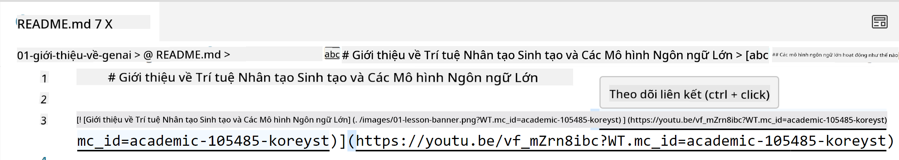
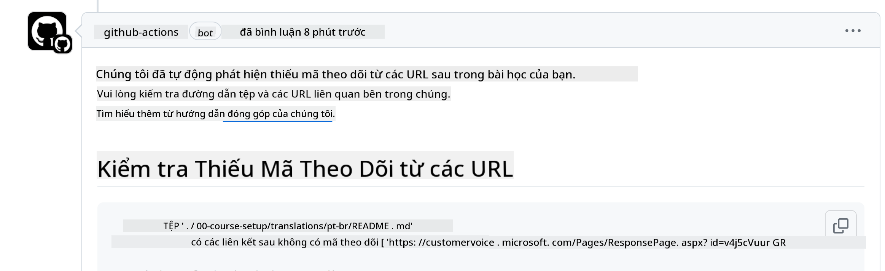
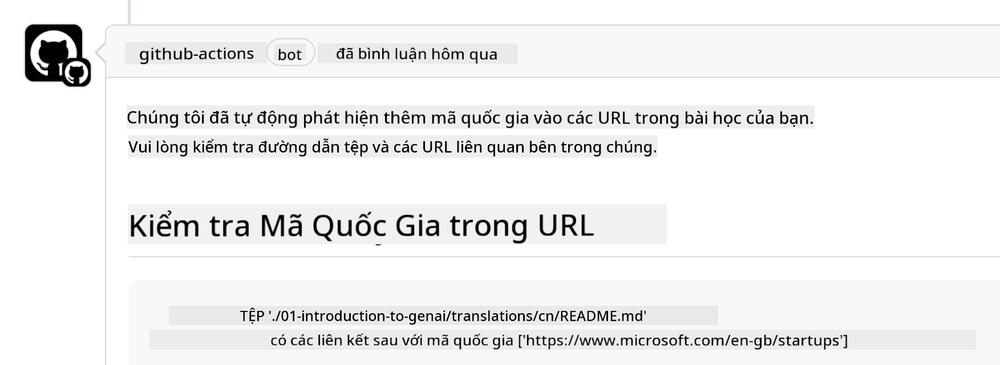

<!--
CO_OP_TRANSLATOR_METADATA:
{
  "original_hash": "57c41f2af71001a2cff9d8eb797cb843",
  "translation_date": "2025-07-09T06:09:43+00:00",
  "source_file": "CONTRIBUTING.md",
  "language_code": "vi"
}
-->
# Đóng góp

Dự án này hoan nghênh các đóng góp và đề xuất. Hầu hết các đóng góp yêu cầu bạn
đồng ý với Thỏa thuận Cấp phép Đóng góp viên (CLA) tuyên bố rằng bạn có quyền,
và thực sự cấp cho chúng tôi quyền sử dụng đóng góp của bạn. Để biết chi tiết, hãy truy cập
<https://cla.microsoft.com>.

> Quan trọng: khi dịch văn bản trong kho này, vui lòng đảm bảo bạn không sử dụng dịch máy. Chúng tôi sẽ xác minh bản dịch qua cộng đồng, vì vậy chỉ nhận dịch các ngôn ngữ mà bạn thành thạo.

Khi bạn gửi pull request, một bot CLA sẽ tự động xác định xem bạn có cần
cung cấp CLA hay không và đánh dấu PR phù hợp (ví dụ: nhãn, bình luận). Chỉ cần làm theo
hướng dẫn do bot cung cấp. Bạn chỉ cần làm việc này một lần cho tất cả các kho sử dụng CLA của chúng tôi.

## Quy tắc ứng xử

Dự án này đã áp dụng [Microsoft Open Source Code of Conduct](https://opensource.microsoft.com/codeofconduct/?WT.mc_id=academic-105485-koreyst).
Để biết thêm thông tin, hãy đọc [Code of Conduct FAQ](https://opensource.microsoft.com/codeofconduct/faq/?WT.mc_id=academic-105485-koreyst) hoặc liên hệ [opencode@microsoft.com](mailto:opencode@microsoft.com) nếu có câu hỏi hoặc góp ý thêm.

## Câu hỏi hoặc Vấn đề?

Vui lòng không mở issue trên GitHub cho các câu hỏi hỗ trợ chung vì danh sách GitHub nên được dùng cho các yêu cầu tính năng và báo lỗi. Cách này giúp chúng tôi dễ dàng theo dõi các vấn đề hoặc lỗi thực tế từ mã nguồn và giữ cuộc thảo luận chung tách biệt với mã nguồn thực tế.

## Lỗi chính tả, Vấn đề, Lỗi và đóng góp

Khi bạn gửi bất kỳ thay đổi nào cho kho Generative AI for Beginners, vui lòng tuân theo các khuyến nghị sau.

* Luôn fork kho về tài khoản của bạn trước khi thực hiện chỉnh sửa
* Không gộp nhiều thay đổi vào một pull request. Ví dụ, gửi sửa lỗi và cập nhật tài liệu bằng các PR riêng biệt
* Nếu pull request của bạn có xung đột khi gộp, hãy cập nhật nhánh main cục bộ của bạn để đồng bộ với kho chính trước khi chỉnh sửa
* Nếu bạn gửi bản dịch, vui lòng tạo một PR cho tất cả các tệp đã dịch vì chúng tôi không chấp nhận bản dịch một phần
* Nếu bạn gửi sửa lỗi chính tả hoặc tài liệu, có thể gộp các chỉnh sửa vào một PR nếu phù hợp

## Hướng dẫn chung khi viết

- Đảm bảo tất cả URL của bạn được bao trong dấu ngoặc vuông theo sau là dấu ngoặc tròn không có khoảng trắng thừa ``.
- Đảm bảo bất kỳ liên kết tương đối nào (liên kết đến các tệp và thư mục trong kho) bắt đầu bằng `./` chỉ đến tệp hoặc thư mục trong thư mục làm việc hiện tại hoặc `../` chỉ đến tệp hoặc thư mục trong thư mục cha.
- Đảm bảo bất kỳ liên kết tương đối nào có ID theo dõi (ví dụ `?` hoặc `&` rồi `wt.mc_id=` hoặc `WT.mc_id=`) ở cuối.
- Đảm bảo bất kỳ URL nào từ các miền _github.com, microsoft.com, visualstudio.com, aka.ms, và azure.com_ đều có ID theo dõi (ví dụ `?` hoặc `&` rồi `wt.mc_id=` hoặc `WT.mc_id=`) ở cuối.
- Đảm bảo các liên kết của bạn không chứa locale theo quốc gia (ví dụ `/en-us/` hoặc `/en/`).
- Đảm bảo tất cả hình ảnh được lưu trong thư mục `./images`.
- Đảm bảo tên hình ảnh mô tả rõ ràng, sử dụng ký tự tiếng Anh, số và dấu gạch ngang.

## Quy trình làm việc trên GitHub

Khi bạn gửi pull request, bốn quy trình làm việc khác nhau sẽ được kích hoạt để kiểm tra các quy tắc trên.
Chỉ cần làm theo hướng dẫn dưới đây để vượt qua các kiểm tra quy trình.

- [Kiểm tra Liên kết Tương đối Bị Hỏng](../..)
- [Kiểm tra Liên kết Có ID Theo Dõi](../..)
- [Kiểm tra URL Có ID Theo Dõi](../..)
- [Kiểm tra URL Không Có Locale](../..)

### Kiểm tra Liên kết Tương đối Bị Hỏng

Quy trình này đảm bảo rằng bất kỳ liên kết tương đối nào trong tệp của bạn đều hoạt động.
Kho này được triển khai trên GitHub pages nên bạn cần rất cẩn thận khi gõ các liên kết để không dẫn đến nhầm chỗ.

Để chắc chắn liên kết của bạn hoạt động, hãy dùng VS code để kiểm tra.

Ví dụ, khi bạn di chuột qua bất kỳ liên kết nào trong tệp, bạn sẽ được nhắc theo liên kết bằng cách nhấn **ctrl + click**

Nếu bạn nhấp vào liên kết mà không hoạt động trên máy cục bộ, chắc chắn nó sẽ gây lỗi trong quy trình và không hoạt động trên GitHub.

Để sửa lỗi này, hãy thử gõ liên kết với sự trợ giúp của VS code.

Khi bạn gõ `./` hoặc `../`, VS code sẽ gợi ý các lựa chọn phù hợp với những gì bạn đã gõ.

Theo đường dẫn bằng cách nhấp vào tệp hoặc thư mục mong muốn và bạn sẽ chắc chắn đường dẫn không bị hỏng.

Khi bạn thêm đường dẫn tương đối chính xác, lưu và đẩy thay đổi, quy trình sẽ được kích hoạt lại để kiểm tra.
Nếu bạn vượt qua kiểm tra, bạn có thể tiếp tục.

### Kiểm tra Liên kết Có ID Theo Dõi

Quy trình này đảm bảo rằng bất kỳ liên kết tương đối nào đều có ID theo dõi.
Kho này được triển khai trên GitHub pages nên chúng ta cần theo dõi sự di chuyển giữa các tệp và thư mục.

Để chắc chắn liên kết tương đối có ID theo dõi, hãy kiểm tra xem có chuỗi `?wt.mc_id=` ở cuối đường dẫn không.
Nếu có, bạn sẽ vượt qua kiểm tra này.

Nếu không, bạn có thể nhận lỗi như sau.

Để sửa lỗi này, hãy mở tệp được quy trình làm việc đánh dấu và thêm ID theo dõi vào cuối liên kết tương đối.

Khi bạn thêm ID theo dõi, lưu và đẩy thay đổi, quy trình sẽ được kích hoạt lại để kiểm tra.
Nếu bạn vượt qua kiểm tra, bạn có thể tiếp tục.

### Kiểm tra URL Có ID Theo Dõi

Quy trình này đảm bảo rằng bất kỳ URL web nào đều có ID theo dõi.
Kho này mở cho mọi người nên bạn cần đảm bảo theo dõi truy cập để biết lưu lượng đến từ đâu.

Để chắc chắn URL có ID theo dõi, hãy kiểm tra xem có chuỗi `?wt.mc_id=` ở cuối URL không.
Nếu có, bạn sẽ vượt qua kiểm tra này.

Nếu không, bạn có thể nhận lỗi như sau.

Để sửa lỗi này, hãy mở tệp được quy trình làm việc đánh dấu và thêm ID theo dõi vào cuối URL.

Khi bạn thêm ID theo dõi, lưu và đẩy thay đổi, quy trình sẽ được kích hoạt lại để kiểm tra.
Nếu bạn vượt qua kiểm tra, bạn có thể tiếp tục.

### Kiểm tra URL Không Có Locale

Quy trình này đảm bảo rằng bất kỳ URL web nào không chứa locale theo quốc gia.
Kho này mở cho mọi người trên toàn thế giới nên bạn cần đảm bảo không đưa locale quốc gia vào URL.

Để chắc chắn URL không có locale quốc gia, hãy kiểm tra xem có chuỗi `/en-us/` hoặc `/en/` hoặc bất kỳ locale ngôn ngữ nào trong URL không.
Nếu không có, bạn sẽ vượt qua kiểm tra này.

Nếu có, bạn có thể nhận lỗi như sau.

Để sửa lỗi này, hãy mở tệp được quy trình làm việc đánh dấu và xóa locale quốc gia khỏi URL.

Khi bạn xóa locale quốc gia, lưu và đẩy thay đổi, quy trình sẽ được kích hoạt lại để kiểm tra.
Nếu bạn vượt qua kiểm tra, bạn có thể tiếp tục.

Chúc mừng! Chúng tôi sẽ phản hồi bạn sớm nhất có thể với phản hồi về đóng góp của bạn.

**Tuyên bố từ chối trách nhiệm**:  
Tài liệu này đã được dịch bằng dịch vụ dịch thuật AI [Co-op Translator](https://github.com/Azure/co-op-translator). Mặc dù chúng tôi cố gắng đảm bảo độ chính xác, xin lưu ý rằng các bản dịch tự động có thể chứa lỗi hoặc không chính xác. Tài liệu gốc bằng ngôn ngữ gốc của nó nên được coi là nguồn chính xác và đáng tin cậy. Đối với các thông tin quan trọng, nên sử dụng dịch vụ dịch thuật chuyên nghiệp do con người thực hiện. Chúng tôi không chịu trách nhiệm về bất kỳ sự hiểu lầm hoặc giải thích sai nào phát sinh từ việc sử dụng bản dịch này.