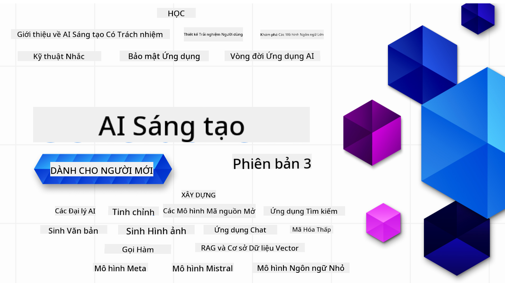

<!--
CO_OP_TRANSLATOR_METADATA:
{
  "original_hash": "5740c9b7fcb6919da1ea4df93475f331",
  "translation_date": "2025-07-09T06:38:48+00:00",
  "source_file": "README.md",
  "language_code": "vi"
}
-->

### 21 bài học dạy tất cả những gì bạn cần biết để bắt đầu xây dựng các ứng dụng Generative AI

### 🌐 Hỗ trợ đa ngôn ngữ

#### Hỗ trợ qua GitHub Action (Tự động & Luôn cập nhật)

[French](../fr/README.md) | [Spanish](../es/README.md) | [German](../de/README.md) | [Russian](../ru/README.md) | [Arabic](../ar/README.md) | [Persian (Farsi)](../fa/README.md) | [Urdu](../ur/README.md) | [Chinese (Simplified)](../zh/README.md) | [Chinese (Traditional, Macau)](../mo/README.md) | [Chinese (Traditional, Hong Kong)](../hk/README.md) | [Chinese (Traditional, Taiwan)](../tw/README.md) | [Japanese](../ja/README.md) | [Korean](../ko/README.md) | [Hindi](../hi/README.md) | [Bengali](../bn/README.md) | [Marathi](../mr/README.md) | [Nepali](../ne/README.md) | [Punjabi (Gurmukhi)](../pa/README.md) | [Portuguese (Portugal)](../pt/README.md) | [Portuguese (Brazil)](../br/README.md) | [Italian](../it/README.md) | [Polish](../pl/README.md) | [Turkish](../tr/README.md) | [Greek](../el/README.md) | [Thai](../th/README.md) | [Swedish](../sv/README.md) | [Danish](../da/README.md) | [Norwegian](../no/README.md) | [Finnish](../fi/README.md) | [Dutch](../nl/README.md) | [Hebrew](../he/README.md) | [Vietnamese](./README.md) | [Indonesian](../id/README.md) | [Malay](../ms/README.md) | [Tagalog (Filipino)](../tl/README.md) | [Swahili](../sw/README.md) | [Hungarian](../hu/README.md) | [Czech](../cs/README.md) | [Slovak](../sk/README.md) | [Romanian](../ro/README.md) | [Bulgarian](../bg/README.md) | [Serbian (Cyrillic)](../sr/README.md) | [Croatian](../hr/README.md) | [Slovenian](../sl/README.md) | [Ukrainian](../uk/README.md) | [Burmese (Myanmar)](../my/README.md)

# Generative AI cho Người Mới Bắt Đầu (Phiên bản 3) - Một Khóa Học

Học những kiến thức cơ bản để xây dựng các ứng dụng Generative AI với khóa học toàn diện gồm 21 bài học do Microsoft Cloud Advocates phát triển.

## 🌱 Bắt đầu

Khóa học này có 21 bài học. Mỗi bài học tập trung vào một chủ đề riêng, bạn có thể bắt đầu từ bất cứ bài nào bạn muốn!

Các bài học được phân loại thành bài "Learn" giải thích khái niệm Generative AI hoặc bài "Build" giải thích khái niệm và kèm theo ví dụ mã nguồn bằng cả **Python** và **TypeScript** khi có thể.

Dành cho các nhà phát triển .NET, hãy xem thêm [Generative AI for Beginners (.NET Edition)](https://github.com/microsoft/Generative-AI-for-beginners-dotnet?WT.mc_id=academic-105485-koreyst)!

Mỗi bài học cũng bao gồm phần "Keep Learning" với các công cụ học tập bổ sung.

## Những gì bạn cần
### Để chạy mã của khóa học này, bạn có thể sử dụng một trong các dịch vụ sau:
 - [Azure OpenAI Service](https://aka.ms/genai-beginners/azure-open-ai?WT.mc_id=academic-105485-koreyst) - **Bài học:** "aoai-assignment"
 - [GitHub Marketplace Model Catalog](https://aka.ms/genai-beginners/gh-models?WT.mc_id=academic-105485-koreyst) - **Bài học:** "githubmodels"
 - [OpenAI API](https://aka.ms/genai-beginners/open-ai?WT.mc_id=academic-105485-koreyst) - **Bài học:** "oai-assignment" 
   
- Kiến thức cơ bản về Python hoặc TypeScript sẽ rất hữu ích - \*Dành cho người mới hoàn toàn, hãy tham khảo các khóa học [Python](https://aka.ms/genai-beginners/python?WT.mc_id=academic-105485-koreyst) và [TypeScript](https://aka.ms/genai-beginners/typescript?WT.mc_id=academic-105485-koreyst)
- Một tài khoản GitHub để [fork toàn bộ repo này](https://aka.ms/genai-beginners/github?WT.mc_id=academic-105485-koreyst) về tài khoản GitHub của bạn

Chúng tôi đã tạo một bài học **[Course Setup](./00-course-setup/README.md?WT.mc_id=academic-105485-koreyst)** để giúp bạn thiết lập môi trường phát triển.

Đừng quên [star (🌟) repo này](https://docs.github.com/en/get-started/exploring-projects-on-github/saving-repositories-with-stars?WT.mc_id=academic-105485-koreyst) để dễ dàng tìm lại sau này.

## 🧠 Sẵn sàng triển khai?

Nếu bạn đang tìm kiếm các mẫu mã nâng cao hơn, hãy xem bộ sưu tập [Generative AI Code Samples](https://aka.ms/genai-beg-code?WT.mc_id=academic-105485-koreyst) của chúng tôi với cả **Python** và **TypeScript**.

## 🗣️ Gặp gỡ các học viên khác, nhận hỗ trợ

Tham gia [server Discord chính thức Azure AI Foundry](https://aka.ms/genai-discord?WT.mc_id=academic-105485-koreyst) để gặp gỡ, kết nối với các học viên khác đang học khóa này và nhận hỗ trợ.

Đặt câu hỏi hoặc chia sẻ phản hồi sản phẩm tại [Azure AI Foundry Developer Forum](https://aka.ms/azureaifoundry/forum) trên Github.

## 🚀 Xây dựng Startup?

Đăng ký [Microsoft for Startups Founders Hub](https://aka.ms/genai-foundershub?WT.mc_id=academic-105485-koreyst) để nhận **tín dụng OpenAI miễn phí** và lên đến **150.000 đô la tín dụng Azure để truy cập các mô hình OpenAI qua Azure OpenAI Services**.

## 🙏 Muốn giúp đỡ?

Bạn có đề xuất hoặc phát hiện lỗi chính tả hay lỗi mã? [Tạo issue](https://github.com/microsoft/generative-ai-for-beginners/issues?WT.mc_id=academic-105485-koreyst) hoặc [Gửi pull request](https://github.com/microsoft/generative-ai-for-beginners/pulls?WT.mc_id=academic-105485-koreyst)

## 📂 Mỗi bài học bao gồm:

- Video giới thiệu ngắn về chủ đề
- Bài học viết nằm trong README
- Mẫu mã Python và TypeScript hỗ trợ Azure OpenAI và OpenAI API
- Liên kết đến các tài nguyên bổ sung để tiếp tục học tập

## 🗃️ Các bài học

| #   | **Liên kết bài học**                                                                                                                          | **Mô tả**                                                                                      | **Video**                                                                   | **Học thêm**                                                                   |
| --- | -------------------------------------------------------------------------------------------------------------------------------------------- | ---------------------------------------------------------------------------------------------- | --------------------------------------------------------------------------- | ------------------------------------------------------------------------------ |
| 00  | [Course Setup](./00-course-setup/README.md?WT.mc_id=academic-105485-koreyst)                                                                 | **Learn:** Cách thiết lập môi trường phát triển của bạn                                       | Video sẽ sớm có                                                               | [Tìm hiểu thêm](https://aka.ms/genai-collection?WT.mc_id=academic-105485-koreyst) |
| 01  | [Introduction to Generative AI and LLMs](./01-introduction-to-genai/README.md?WT.mc_id=academic-105485-koreyst)                              | **Learn:** Hiểu về Generative AI là gì và cách các Large Language Models (LLMs) hoạt động      | [Video](https://aka.ms/gen-ai-lesson-1-gh?WT.mc_id=academic-105485-koreyst) | [Tìm hiểu thêm](https://aka.ms/genai-collection?WT.mc_id=academic-105485-koreyst) |
| 02  | [Exploring and comparing different LLMs](./02-exploring-and-comparing-different-llms/README.md?WT.mc_id=academic-105485-koreyst)             | **Learn:** Cách chọn mô hình phù hợp cho trường hợp sử dụng của bạn                             | [Video](https://aka.ms/gen-ai-lesson2-gh?WT.mc_id=academic-105485-koreyst)  | [Tìm hiểu thêm](https://aka.ms/genai-collection?WT.mc_id=academic-105485-koreyst) |
| 03  | [Using Generative AI Responsibly](./03-using-generative-ai-responsibly/README.md?WT.mc_id=academic-105485-koreyst)                           | **Learn:** Cách xây dựng các ứng dụng Generative AI có trách nhiệm                            | [Video](https://aka.ms/gen-ai-lesson3-gh?WT.mc_id=academic-105485-koreyst)  | [Tìm hiểu thêm](https://aka.ms/genai-collection?WT.mc_id=academic-105485-koreyst) |
| 04  | [Understanding Prompt Engineering Fundamentals](./04-prompt-engineering-fundamentals/README.md?WT.mc_id=academic-105485-koreyst)             | **Learn:** Thực hành các phương pháp tốt nhất trong Prompt Engineering                        | [Video](https://aka.ms/gen-ai-lesson4-gh?WT.mc_id=academic-105485-koreyst)  | [Tìm hiểu thêm](https://aka.ms/genai-collection?WT.mc_id=academic-105485-koreyst) |
| 05  | [Creating Advanced Prompts](./05-advanced-prompts/README.md?WT.mc_id=academic-105485-koreyst)                                                | **Learn:** Cách áp dụng các kỹ thuật prompt engineering nâng cao để cải thiện kết quả prompt  | [Video](https://aka.ms/gen-ai-lesson5-gh?WT.mc_id=academic-105485-koreyst)  | [Tìm hiểu thêm](https://aka.ms/genai-collection?WT.mc_id=academic-105485-koreyst) |
| 06  | [Xây dựng Ứng dụng Tạo Văn bản](./06-text-generation-apps/README.md?WT.mc_id=academic-105485-koreyst)                                | **Xây dựng:** Ứng dụng tạo văn bản sử dụng Azure OpenAI / OpenAI API                                | [Video](https://aka.ms/gen-ai-lesson6-gh?WT.mc_id=academic-105485-koreyst)  | [Tìm hiểu thêm](https://aka.ms/genai-collection?WT.mc_id=academic-105485-koreyst) |
| 07  | [Xây dựng Ứng dụng Chat](./07-building-chat-applications/README.md?WT.mc_id=academic-105485-koreyst)                                     | **Xây dựng:** Các kỹ thuật để xây dựng và tích hợp ứng dụng chat hiệu quả.               | [Video](https://aka.ms/gen-ai-lessons7-gh?WT.mc_id=academic-105485-koreyst) | [Tìm hiểu thêm](https://aka.ms/genai-collection?WT.mc_id=academic-105485-koreyst) |
| 08  | [Xây dựng Ứng dụng Tìm kiếm với Cơ sở dữ liệu Vector](./08-building-search-applications/README.md?WT.mc_id=academic-105485-koreyst)                        | **Xây dựng:** Ứng dụng tìm kiếm sử dụng Embeddings để tìm dữ liệu.                        | [Video](https://aka.ms/gen-ai-lesson8-gh?WT.mc_id=academic-105485-koreyst)  | [Tìm hiểu thêm](https://aka.ms/genai-collection?WT.mc_id=academic-105485-koreyst) |
| 09  | [Xây dựng Ứng dụng Tạo Hình ảnh](./09-building-image-applications/README.md?WT.mc_id=academic-105485-koreyst)                        | **Xây dựng:** Ứng dụng tạo hình ảnh                                                       | [Video](https://aka.ms/gen-ai-lesson9-gh?WT.mc_id=academic-105485-koreyst)  | [Tìm hiểu thêm](https://aka.ms/genai-collection?WT.mc_id=academic-105485-koreyst) |
| 10  | [Xây dựng Ứng dụng AI Low Code](./10-building-low-code-ai-applications/README.md?WT.mc_id=academic-105485-koreyst)                       | **Xây dựng:** Ứng dụng Generative AI sử dụng công cụ Low Code                                     | [Video](https://aka.ms/gen-ai-lesson10-gh?WT.mc_id=academic-105485-koreyst) | [Tìm hiểu thêm](https://aka.ms/genai-collection?WT.mc_id=academic-105485-koreyst) |
| 11  | [Tích hợp Ứng dụng Bên ngoài với Function Calling](./11-integrating-with-function-calling/README.md?WT.mc_id=academic-105485-koreyst) | **Xây dựng:** Function calling là gì và các trường hợp sử dụng trong ứng dụng                          | [Video](https://aka.ms/gen-ai-lesson11-gh?WT.mc_id=academic-105485-koreyst) | [Tìm hiểu thêm](https://aka.ms/genai-collection?WT.mc_id=academic-105485-koreyst) |
| 12  | [Thiết kế UX cho Ứng dụng AI](./12-designing-ux-for-ai-applications/README.md?WT.mc_id=academic-105485-koreyst)                         | **Tìm hiểu:** Cách áp dụng các nguyên tắc thiết kế UX khi phát triển Ứng dụng Generative AI         | [Video](https://aka.ms/gen-ai-lesson12-gh?WT.mc_id=academic-105485-koreyst) | [Tìm hiểu thêm](https://aka.ms/genai-collection?WT.mc_id=academic-105485-koreyst) |
| 13  | [Bảo mật Ứng dụng Generative AI của bạn](./13-securing-ai-applications/README.md?WT.mc_id=academic-105485-koreyst)                         | **Tìm hiểu:** Các mối đe dọa và rủi ro đối với hệ thống AI và cách bảo vệ các hệ thống này.             | [Video](https://aka.ms/gen-ai-lesson13-gh?WT.mc_id=academic-105485-koreyst) | [Tìm hiểu thêm](https://aka.ms/genai-collection?WT.mc_id=academic-105485-koreyst) |
| 14  | [Vòng đời Ứng dụng Generative AI](./14-the-generative-ai-application-lifecycle/README.md?WT.mc_id=academic-105485-koreyst)           | **Tìm hiểu:** Các công cụ và chỉ số để quản lý vòng đời LLM và LLMOps                         | [Video](https://aka.ms/gen-ai-lesson14-gh?WT.mc_id=academic-105485-koreyst) | [Tìm hiểu thêm](https://aka.ms/genai-collection?WT.mc_id=academic-105485-koreyst) |
| 15  | [Retrieval Augmented Generation (RAG) và Cơ sở dữ liệu Vector](./15-rag-and-vector-databases/README.md?WT.mc_id=academic-105485-koreyst)        | **Xây dựng:** Ứng dụng sử dụng Framework RAG để truy xuất embeddings từ Cơ sở dữ liệu Vector  | [Video](https://aka.ms/gen-ai-lesson15-gh?WT.mc_id=academic-105485-koreyst) | [Tìm hiểu thêm](https://aka.ms/genai-collection?WT.mc_id=academic-105485-koreyst) |
| 16  | [Mô hình Mã nguồn mở và Hugging Face](./16-open-source-models/README.md?WT.mc_id=academic-105485-koreyst)                                    | **Xây dựng:** Ứng dụng sử dụng các mô hình mã nguồn mở có trên Hugging Face                    | [Video](https://aka.ms/gen-ai-lesson16-gh?WT.mc_id=academic-105485-koreyst) | [Tìm hiểu thêm](https://aka.ms/genai-collection?WT.mc_id=academic-105485-koreyst) |
| 17  | [AI Agents](./17-ai-agents/README.md?WT.mc_id=academic-105485-koreyst)                                                                       | **Xây dựng:** Ứng dụng sử dụng Framework AI Agent                                           | [Video](https://aka.ms/gen-ai-lesson17-gh?WT.mc_id=academic-105485-koreyst) | [Tìm hiểu thêm](https://aka.ms/genai-collection?WT.mc_id=academic-105485-koreyst) |
| 18  | [Fine-Tuning LLMs](./18-fine-tuning/README.md?WT.mc_id=academic-105485-koreyst)                                                              | **Tìm hiểu:** Fine-tuning LLM là gì, tại sao và cách thực hiện                                            | [Video](https://aka.ms/gen-ai-lesson18-gh?WT.mc_id=academic-105485-koreyst) | [Tìm hiểu thêm](https://aka.ms/genai-collection?WT.mc_id=academic-105485-koreyst) |
| 19  | [Xây dựng với SLMs](./19-slm/README.md?WT.mc_id=academic-105485-koreyst)                                                              | **Tìm hiểu:** Lợi ích của việc xây dựng với Small Language Models                                            | Video Sẽ sớm ra mắt | [Tìm hiểu thêm](https://aka.ms/genai-collection?WT.mc_id=academic-105485-koreyst) |
| 20  | [Xây dựng với Mistral Models](./20-mistral/README.md?WT.mc_id=academic-105485-koreyst)                                                              | **Tìm hiểu:** Các tính năng và sự khác biệt của các Mistral Family Models                                           | Video Sẽ sớm ra mắt | [Tìm hiểu thêm](https://aka.ms/genai-collection?WT.mc_id=academic-105485-koreyst) |
| 21  | [Xây dựng với Meta Models](./21-meta/README.md?WT.mc_id=academic-105485-koreyst)                                                              | **Tìm hiểu:** Các tính năng và sự khác biệt của các Meta Family Models                                           | Video Sẽ sớm ra mắt | [Tìm hiểu thêm](https://aka.ms/genai-collection?WT.mc_id=academic-105485-koreyst) |

### 🌟 Lời cảm ơn đặc biệt

Xin gửi lời cảm ơn đặc biệt đến [**John Aziz**](https://www.linkedin.com/in/john0isaac/) vì đã tạo ra tất cả các GitHub Actions và workflows

[**Bernhard Merkle**](https://www.linkedin.com/in/bernhard-merkle-738b73/) vì những đóng góp quan trọng cho từng bài học nhằm cải thiện trải nghiệm học tập và mã nguồn.

## 🎒 Các Khóa học khác

Nhóm của chúng tôi còn sản xuất các khóa học khác! Hãy xem:

- [**MỚI** Model Context Protocol cho Người mới bắt đầu](https://github.com/microsoft/mcp-for-beginners?WT.mc_id=academic-105485-koreyst)
- [AI Agents cho Người mới bắt đầu](https://github.com/microsoft/ai-agents-for-beginners?WT.mc_id=academic-105485-koreyst)
- [Generative AI cho Người mới bắt đầu sử dụng .NET](https://github.com/microsoft/Generative-AI-for-beginners-dotnet?WT.mc_id=academic-105485-koreyst)
- [Generative AI cho Người mới bắt đầu sử dụng JavaScript](https://aka.ms/genai-js-course?WT.mc_id=academic-105485-koreyst)
- [ML cho Người mới bắt đầu](https://aka.ms/ml-beginners?WT.mc_id=academic-105485-koreyst)
- [Khoa học Dữ liệu cho Người mới bắt đầu](https://aka.ms/datascience-beginners?WT.mc_id=academic-105485-koreyst)
- [AI cho Người mới bắt đầu](https://aka.ms/ai-beginners?WT.mc_id=academic-105485-koreyst)
- [An ninh mạng cho Người mới bắt đầu](https://github.com/microsoft/Security-101??WT.mc_id=academic-96948-sayoung)
- [Phát triển Web cho Người mới bắt đầu](https://aka.ms/webdev-beginners?WT.mc_id=academic-105485-koreyst)
- [IoT cho Người mới bắt đầu](https://aka.ms/iot-beginners?WT.mc_id=academic-105485-koreyst)
- [Phát triển XR cho Người mới bắt đầu](https://github.com/microsoft/xr-development-for-beginners?WT.mc_id=academic-105485-koreyst)
- [Thành thạo GitHub Copilot cho Lập trình AI song hành](https://aka.ms/GitHubCopilotAI?WT.mc_id=academic-105485-koreyst)
- [Thành thạo GitHub Copilot cho Nhà phát triển C#/.NET](https://github.com/microsoft/mastering-github-copilot-for-dotnet-csharp-developers?WT.mc_id=academic-105485-koreyst)
- [Chọn Cuộc phiêu lưu Copilot của riêng bạn](https://github.com/microsoft/CopilotAdventures?WT.mc_id=academic-105485-koreyst)

**Tuyên bố từ chối trách nhiệm**:  
Tài liệu này đã được dịch bằng dịch vụ dịch thuật AI [Co-op Translator](https://github.com/Azure/co-op-translator). Mặc dù chúng tôi cố gắng đảm bảo độ chính xác, xin lưu ý rằng các bản dịch tự động có thể chứa lỗi hoặc không chính xác. Tài liệu gốc bằng ngôn ngữ gốc của nó nên được coi là nguồn chính xác và đáng tin cậy. Đối với các thông tin quan trọng, nên sử dụng dịch vụ dịch thuật chuyên nghiệp do con người thực hiện. Chúng tôi không chịu trách nhiệm về bất kỳ sự hiểu lầm hoặc giải thích sai nào phát sinh từ việc sử dụng bản dịch này.