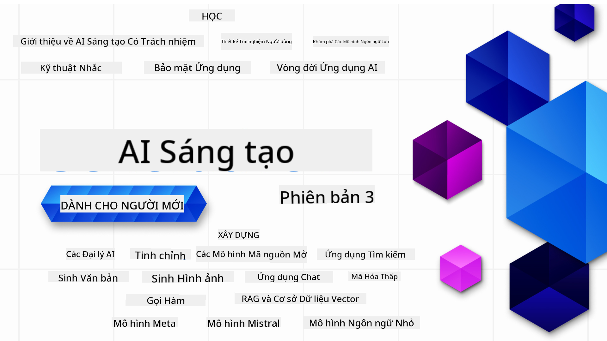

<!--
CO_OP_TRANSLATOR_METADATA:
{
  "original_hash": "6e3f4c8a4f323b8eab1cf11ded304b0f",
  "translation_date": "2025-06-25T08:06:07+00:00",
  "source_file": "README.md",
  "language_code": "vi"
}
-->

### 21 bài học dạy mọi thứ bạn cần biết để bắt đầu xây dựng các ứng dụng AI Tạo Sinh

### 🌐 Hỗ Trợ Đa Ngôn Ngữ

#### Được hỗ trợ qua GitHub Action (Tự động & Luôn cập nhật)

# AI Tạo Sinh cho Người Mới Bắt Đầu (Phiên bản 3) - Một Khóa Học

Học những điều cơ bản về xây dựng ứng dụng AI Tạo Sinh với khóa học 21 bài học toàn diện của chúng tôi từ Microsoft Cloud Advocates.

## 🌱 Bắt đầu

Khóa học này có 21 bài học. Mỗi bài học bao gồm một chủ đề riêng, vì vậy bạn có thể bắt đầu từ bất kỳ đâu!

Các bài học được gắn nhãn là bài học "Học" giải thích một khái niệm AI Tạo Sinh hoặc bài học "Xây dựng" giải thích một khái niệm và ví dụ mã trong cả **Python** và **TypeScript** khi có thể.

Dành cho các nhà phát triển .NET, hãy xem [AI Tạo Sinh cho Người Mới Bắt Đầu (Phiên bản .NET)](https://github.com/microsoft/Generative-AI-for-beginners-dotnet?WT.mc_id=academic-105485-koreyst)!

Mỗi bài học cũng bao gồm phần "Tiếp tục học" với các công cụ học tập bổ sung.

## Những gì bạn cần
### Để chạy mã của khóa học này, bạn có thể sử dụng một trong các dịch vụ sau: 
 - [Dịch vụ Azure OpenAI](https://aka.ms/genai-beginners/azure-open-ai?WT.mc_id=academic-105485-koreyst) - **Bài học:** "aoai-assignment"
 - [Danh mục Mô hình Marketplace GitHub](https://aka.ms/genai-beginners/gh-models?WT.mc_id=academic-105485-koreyst) - **Bài học:** "githubmodels"
 - [API OpenAI](https://aka.ms/genai-beginners/open-ai?WT.mc_id=academic-105485-koreyst) - **Bài học:** "oai-assignment" 

- Kiến thức cơ bản về Python hoặc TypeScript là hữu ích - \*Đối với người mới bắt đầu hoàn toàn, hãy xem các khóa học [Python](https://aka.ms/genai-beginners/python?WT.mc_id=academic-105485-koreyst) và [TypeScript](https://aka.ms/genai-beginners/typescript?WT.mc_id=academic-105485-koreyst)
- Một tài khoản GitHub để [fork toàn bộ kho lưu trữ này](https://aka.ms/genai-beginners/github?WT.mc_id=academic-105485-koreyst) vào tài khoản GitHub của bạn

Chúng tôi đã tạo một bài học **[Thiết lập Khóa học](./00-course-setup/README.md?WT.mc_id=academic-105485-koreyst)** để giúp bạn thiết lập môi trường phát triển của mình.

Đừng quên [gắn sao (🌟) cho kho lưu trữ này](https://docs.github.com/en/get-started/exploring-projects-on-github/saving-repositories-with-stars?WT.mc_id=academic-105485-koreyst) để dễ dàng tìm thấy sau này.

## 🧠 Sẵn sàng triển khai?

Nếu bạn đang tìm kiếm các mẫu mã nâng cao hơn, hãy xem bộ sưu tập [Mẫu mã AI Tạo Sinh](https://aka.ms/genai-beg-code?WT.mc_id=academic-105485-koreyst) của chúng tôi trong cả **Python** và **TypeScript**.

## 🗣️ Gặp gỡ những người học khác, nhận hỗ trợ

Tham gia [máy chủ Discord chính thức Azure AI Foundry](https://aka.ms/genai-discord?WT.mc_id=academic-105485-koreyst) để gặp gỡ và kết nối với những người học khác đang tham gia khóa học này và nhận hỗ trợ.

Đặt câu hỏi hoặc chia sẻ phản hồi về sản phẩm trong [Diễn đàn Nhà phát triển Azure AI Foundry](https://aka.ms/azureaifoundry/forum) trên Github.

## 🚀 Xây dựng một công ty khởi nghiệp?

Đăng ký [Microsoft for Startups Founders Hub](https://aka.ms/genai-foundershub?WT.mc_id=academic-105485-koreyst) để nhận **tín dụng OpenAI miễn phí** và lên đến **$150k tín dụng Azure để truy cập các mô hình OpenAI thông qua Dịch vụ Azure OpenAI**.

## 🙏 Muốn giúp đỡ?

Bạn có đề xuất hoặc phát hiện lỗi chính tả hoặc mã không? [Tạo một vấn đề](https://github.com/microsoft/generative-ai-for-beginners/issues?WT.mc_id=academic-105485-koreyst) hoặc [Tạo một yêu cầu kéo](https://github.com/microsoft/generative-ai-for-beginners/pulls?WT.mc_id=academic-105485-koreyst)

## 📂 Mỗi bài học bao gồm:

- Một video giới thiệu ngắn về chủ đề
- Một bài học viết nằm trong README
- Mẫu mã Python và TypeScript hỗ trợ Azure OpenAI và API OpenAI
- Liên kết đến tài nguyên bổ sung để tiếp tục học

## 🗃️ Bài học

| #   | **Liên kết Bài học**                                                                                                                         | **Mô tả**                                                                                         | **Video**                                                                    | **Học thêm**                                                                   |
| --- | -------------------------------------------------------------------------------------------------------------------------------------------- | ------------------------------------------------------------------------------------------------- | ---------------------------------------------------------------------------- | ------------------------------------------------------------------------------ |
| 00  | [Thiết lập Khóa học](./00-course-setup/README.md?WT.mc_id=academic-105485-koreyst)                                                           | **Học:** Cách thiết lập môi trường phát triển của bạn                                             | Video sẽ sớm có                                                               | [Học thêm](https://aka.ms/genai-collection?WT.mc_id=academic-105485-koreyst)   |
| 01  | [Giới thiệu về AI Tạo Sinh và LLMs](./01-introduction-to-genai/README.md?WT.mc_id=academic-105485-koreyst)                                   | **Học:** Hiểu AI Tạo Sinh là gì và cách hoạt động của Các Mô hình Ngôn ngữ Lớn (LLMs).            | [Video](https://aka.ms/gen-ai-lesson-1-gh?WT.mc_id=academic-105485-koreyst)  | [Học thêm](https://aka.ms/genai-collection?WT.mc_id=academic-105485-koreyst)   |
| 02  | [Khám phá và so sánh các LLMs khác nhau](./02-exploring-and-comparing-different-llms/README.md?WT.mc_id=academic-105485-koreyst)             | **Học:** Cách chọn mô hình phù hợp cho trường hợp sử dụng của bạn                                 | [Video](https://aka.ms/gen-ai-lesson2-gh?WT.mc_id=academic-105485-koreyst)   | [Học thêm](https://aka.ms/genai-collection?WT.mc_id=academic-105485-koreyst)   |
| 03  | [Sử dụng AI Tạo Sinh một cách có trách nhiệm](./03-using-generative-ai-responsibly/README.md?WT.mc_id=academic-105485-koreyst)               | **Học:** Cách xây dựng các ứng dụng AI Tạo Sinh một cách có trách nhiệm                           | [Video](https://aka.ms/gen-ai-lesson3-gh?WT.mc_id=academic-105485-koreyst)   | [Học thêm](https://aka.ms/genai-collection?WT.mc_id=academic-105485-koreyst)   |
| 04  | [Hiểu các Nguyên tắc Cơ bản về Kỹ thuật Prompt](./04-prompt-engineering-fundamentals/README.md?WT.mc_id=academic-105485-koreyst)             | **Học:** Thực hành tốt nhất về Kỹ thuật Prompt                                                   | [Video](https://aka.ms/gen-ai-lesson4-gh?WT.mc_id=academic-105485-koreyst)   | [Học thêm](https://aka.ms/genai-collection?WT.mc_id=academic-105485-koreyst)   |
| 05  | [Tạo các Gợi ý Nâng cao](./05-advanced-prompts/README.md?WT.mc_id=academic-105485-koreyst)                                                | **Học:** Cách áp dụng các kỹ thuật tạo gợi ý để cải thiện kết quả của gợi ý. | [Video](https://aka.ms/gen-ai-lesson5-gh?WT.mc_id=academic-105485-koreyst)  | [Tìm hiểu thêm](https://aka.ms/genai-collection?WT.mc_id=academic-105485-koreyst) |
| 06  | [Xây dựng Ứng dụng Tạo Văn bản](./06-text-generation-apps/README.md?WT.mc_id=academic-105485-koreyst)                                | **Xây dựng:** Một ứng dụng tạo văn bản sử dụng Azure OpenAI / OpenAI API                                | [Video](https://aka.ms/gen-ai-lesson6-gh?WT.mc_id=academic-105485-koreyst)  | [Tìm hiểu thêm](https://aka.ms/genai-collection?WT.mc_id=academic-105485-koreyst) |
| 07  | [Xây dựng Ứng dụng Chat](./07-building-chat-applications/README.md?WT.mc_id=academic-105485-koreyst)                                     | **Xây dựng:** Các kỹ thuật để xây dựng và tích hợp ứng dụng chat một cách hiệu quả.               | [Video](https://aka.ms/gen-ai-lessons7-gh?WT.mc_id=academic-105485-koreyst) | [Tìm hiểu thêm](https://aka.ms/genai-collection?WT.mc_id=academic-105485-koreyst) |
| 08  | [Xây dựng Ứng dụng Tìm kiếm với Cơ sở Dữ liệu Vector](./08-building-search-applications/README.md?WT.mc_id=academic-105485-koreyst)                        | **Xây dựng:** Một ứng dụng tìm kiếm sử dụng Embeddings để tìm kiếm dữ liệu.                        | [Video](https://aka.ms/gen-ai-lesson8-gh?WT.mc_id=academic-105485-koreyst)  | [Tìm hiểu thêm](https://aka.ms/genai-collection?WT.mc_id=academic-105485-koreyst) |
| 09  | [Xây dựng Ứng dụng Tạo Hình ảnh](./09-building-image-applications/README.md?WT.mc_id=academic-105485-koreyst)                        | **Xây dựng:** Một ứng dụng tạo hình ảnh                                                       | [Video](https://aka.ms/gen-ai-lesson9-gh?WT.mc_id=academic-105485-koreyst)  | [Tìm hiểu thêm](https://aka.ms/genai-collection?WT.mc_id=academic-105485-koreyst) |
| 10  | [Xây dựng Ứng dụng AI Thấp Mã](./10-building-low-code-ai-applications/README.md?WT.mc_id=academic-105485-koreyst)                       | **Xây dựng:** Một ứng dụng AI Tạo sinh sử dụng công cụ Thấp Mã                                     | [Video](https://aka.ms/gen-ai-lesson10-gh?WT.mc_id=academic-105485-koreyst) | [Tìm hiểu thêm](https://aka.ms/genai-collection?WT.mc_id=academic-105485-koreyst) |
| 11  | [Tích hợp Ứng dụng Ngoài với Gọi Hàm](./11-integrating-with-function-calling/README.md?WT.mc_id=academic-105485-koreyst) | **Xây dựng:** Gọi hàm là gì và các trường hợp sử dụng cho ứng dụng                          | [Video](https://aka.ms/gen-ai-lesson11-gh?WT.mc_id=academic-105485-koreyst) | [Tìm hiểu thêm](https://aka.ms/genai-collection?WT.mc_id=academic-105485-koreyst) |
| 12  | [Thiết kế UX cho Ứng dụng AI](./12-designing-ux-for-ai-applications/README.md?WT.mc_id=academic-105485-koreyst)                         | **Học:** Cách áp dụng các nguyên tắc thiết kế UX khi phát triển Ứng dụng AI Tạo sinh         | [Video](https://aka.ms/gen-ai-lesson12-gh?WT.mc_id=academic-105485-koreyst) | [Tìm hiểu thêm](https://aka.ms/genai-collection?WT.mc_id=academic-105485-koreyst) |
| 13  | [Bảo mật Ứng dụng AI Tạo sinh của Bạn](./13-securing-ai-applications/README.md?WT.mc_id=academic-105485-koreyst)                         | **Học:** Các mối đe dọa và rủi ro đối với hệ thống AI và phương pháp bảo mật các hệ thống này.             | [Video](https://aka.ms/gen-ai-lesson13-gh?WT.mc_id=academic-105485-koreyst) | [Tìm hiểu thêm](https://aka.ms/genai-collection?WT.mc_id=academic-105485-koreyst) |
| 14  | [Vòng đời của Ứng dụng AI Tạo sinh](./14-the-generative-ai-application-lifecycle/README.md?WT.mc_id=academic-105485-koreyst)           | **Học:** Các công cụ và chỉ số để quản lý Vòng đời LLM và LLMOps                         | [Video](https://aka.ms/gen-ai-lesson14-gh?WT.mc_id=academic-105485-koreyst) | [Tìm hiểu thêm](https://aka.ms/genai-collection?WT.mc_id=academic-105485-koreyst) |
| 15  | [Truy xuất Tăng cường Tạo (RAG) và Cơ sở dữ liệu Vector](./15-rag-and-vector-databases/README.md?WT.mc_id=academic-105485-koreyst)        | **Xây dựng:** Một ứng dụng sử dụng Khung RAG để truy xuất các embeddings từ Cơ sở dữ liệu Vector  | [Video](https://aka.ms/gen-ai-lesson15-gh?WT.mc_id=academic-105485-koreyst) | [Tìm hiểu thêm](https://aka.ms/genai-collection?WT.mc_id=academic-105485-koreyst) |
| 16  | [Mô hình Mã nguồn mở và Hugging Face](./16-open-source-models/README.md?WT.mc_id=academic-105485-koreyst)                                    | **Xây dựng:** Một ứng dụng sử dụng các mô hình mã nguồn mở có sẵn trên Hugging Face                    | [Video](https://aka.ms/gen-ai-lesson16-gh?WT.mc_id=academic-105485-koreyst) | [Tìm hiểu thêm](https://aka.ms/genai-collection?WT.mc_id=academic-105485-koreyst) |
| 17  | [Đại lý AI](./17-ai-agents/README.md?WT.mc_id=academic-105485-koreyst)                                                                       | **Xây dựng:** Một ứng dụng sử dụng Khung Đại lý AI                                           | [Video](https://aka.ms/gen-ai-lesson17-gh?WT.mc_id=academic-105485-koreyst) | [Tìm hiểu thêm](https://aka.ms/genai-collection?WT.mc_id=academic-105485-koreyst) |
| 18  | [Tinh chỉnh LLMs](./18-fine-tuning/README.md?WT.mc_id=academic-105485-koreyst)                                                              | **Tìm hiểu:** Cái gì, tại sao và cách tinh chỉnh LLMs                                            | [Video](https://aka.ms/gen-ai-lesson18-gh?WT.mc_id=academic-105485-koreyst) | [Tìm hiểu thêm](https://aka.ms/genai-collection?WT.mc_id=academic-105485-koreyst) |
| 19  | [Xây dựng với SLMs](./19-slm/README.md?WT.mc_id=academic-105485-koreyst)                                                              | **Tìm hiểu:** Lợi ích của việc xây dựng với Mô hình Ngôn ngữ Nhỏ                                            | Video sẽ sớm ra mắt | [Tìm hiểu thêm](https://aka.ms/genai-collection?WT.mc_id=academic-105485-koreyst) |
| 20  | [Xây dựng với Mô hình Mistral](./20-mistral/README.md?WT.mc_id=academic-105485-koreyst)                                                              | **Tìm hiểu:** Các tính năng và sự khác biệt của Gia đình Mô hình Mistral                                           | Video sẽ sớm ra mắt | [Tìm hiểu thêm](https://aka.ms/genai-collection?WT.mc_id=academic-105485-koreyst) |
| 21  | [Xây dựng với Mô hình Meta](./21-meta/README.md?WT.mc_id=academic-105485-koreyst)                                                              | **Tìm hiểu:** Các tính năng và sự khác biệt của Gia đình Mô hình Meta                                           | Video sẽ sớm ra mắt | [Tìm hiểu thêm](https://aka.ms/genai-collection?WT.mc_id=academic-105485-koreyst) |

### 🌟 Cảm ơn đặc biệt

Cảm ơn đặc biệt đến [**John Aziz**](https://www.linkedin.com/in/john0isaac/) đã tạo tất cả các GitHub Actions và quy trình công việc

[**Bernhard Merkle**](https://www.linkedin.com/in/bernhard-merkle-738b73/) đã đóng góp quan trọng cho mỗi bài học để cải thiện trải nghiệm người học và mã. 

## 🎒 Các khóa học khác

Đội ngũ của chúng tôi sản xuất các khóa học khác! Hãy xem:

- [**MỚI** Giao thức Ngữ cảnh Mô hình cho Người mới bắt đầu](https://github.com/microsoft/mcp-for-beginners?WT.mc_id=academic-105485-koreyst)
- [Đại lý AI cho Người mới bắt đầu](https://github.com/microsoft/ai-agents-for-beginners?WT.mc_id=academic-105485-koreyst)
- [AI Sinh tạo cho Người mới bắt đầu sử dụng .NET](https://github.com/microsoft/Generative-AI-for-beginners-dotnet?WT.mc_id=academic-105485-koreyst)
- [AI Sinh tạo cho Người mới bắt đầu sử dụng JavaScript](https://aka.ms/genai-js-course?WT.mc_id=academic-105485-koreyst)
- [ML cho Người mới bắt đầu](https://aka.ms/ml-beginners?WT.mc_id=academic-105485-koreyst)
- [Khoa học dữ liệu cho Người mới bắt đầu](https://aka.ms/datascience-beginners?WT.mc_id=academic-105485-koreyst)
- [AI cho Người mới bắt đầu](https://aka.ms/ai-beginners?WT.mc_id=academic-105485-koreyst)
- [An ninh mạng cho Người mới bắt đầu](https://github.com/microsoft/Security-101??WT.mc_id=academic-96948-sayoung)
- [Phát triển Web cho Người mới bắt đầu](https://aka.ms/webdev-beginners?WT.mc_id=academic-105485-koreyst)
- [IoT cho Người mới bắt đầu](https://aka.ms/iot-beginners?WT.mc_id=academic-105485-koreyst)
- [Phát triển XR cho người mới bắt đầu](https://github.com/microsoft/xr-development-for-beginners?WT.mc_id=academic-105485-koreyst)
- [Thành thạo GitHub Copilot cho lập trình cặp AI](https://aka.ms/GitHubCopilotAI?WT.mc_id=academic-105485-koreyst)
- [Thành thạo GitHub Copilot cho nhà phát triển C#/.NET](https://github.com/microsoft/mastering-github-copilot-for-dotnet-csharp-developers?WT.mc_id=academic-105485-koreyst)
- [Chọn cuộc phiêu lưu Copilot của riêng bạn](https://github.com/microsoft/CopilotAdventures?WT.mc_id=academic-105485-koreyst)

**Tuyên bố miễn trừ trách nhiệm**:  
Tài liệu này đã được dịch bằng dịch vụ dịch thuật AI [Co-op Translator](https://github.com/Azure/co-op-translator). Mặc dù chúng tôi cố gắng đảm bảo độ chính xác, xin lưu ý rằng các bản dịch tự động có thể chứa lỗi hoặc không chính xác. Tài liệu gốc bằng ngôn ngữ bản địa nên được coi là nguồn tài liệu có thẩm quyền. Đối với thông tin quan trọng, nên sử dụng dịch vụ dịch thuật chuyên nghiệp của con người. Chúng tôi không chịu trách nhiệm về bất kỳ sự hiểu lầm hoặc diễn giải sai nào phát sinh từ việc sử dụng bản dịch này.