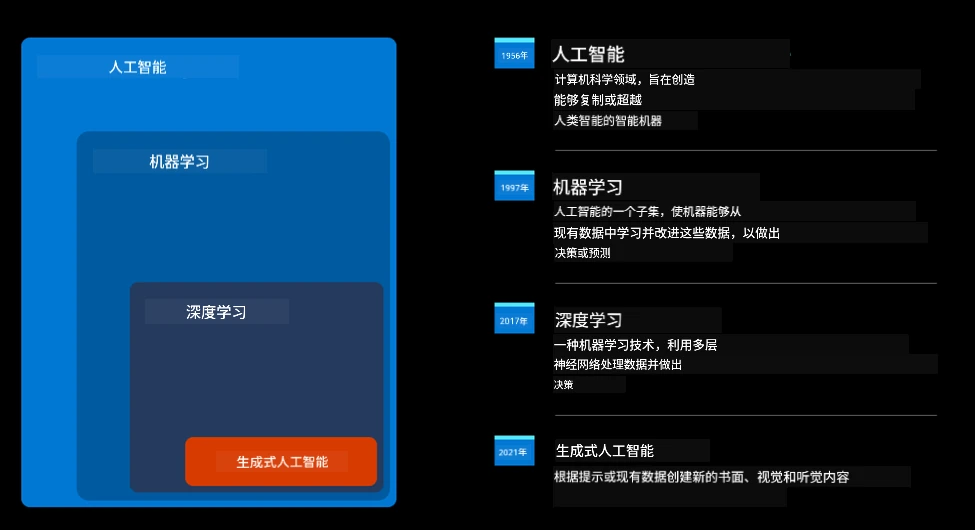
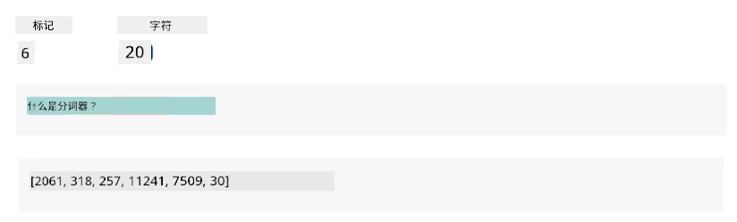
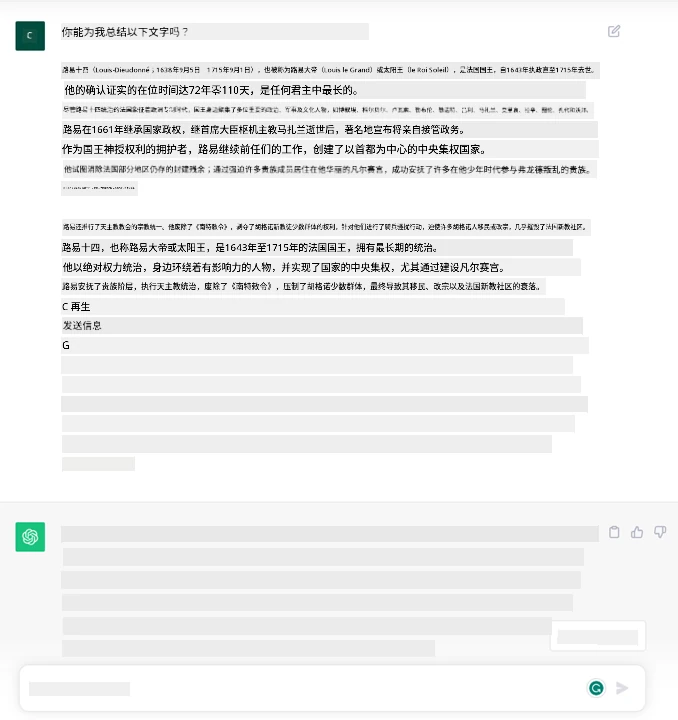
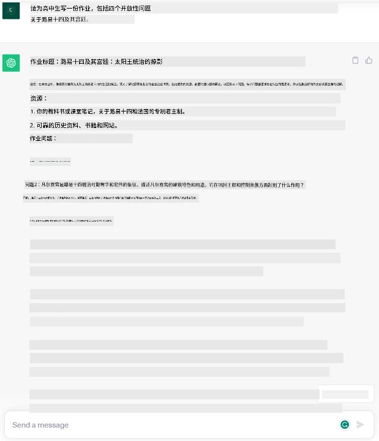
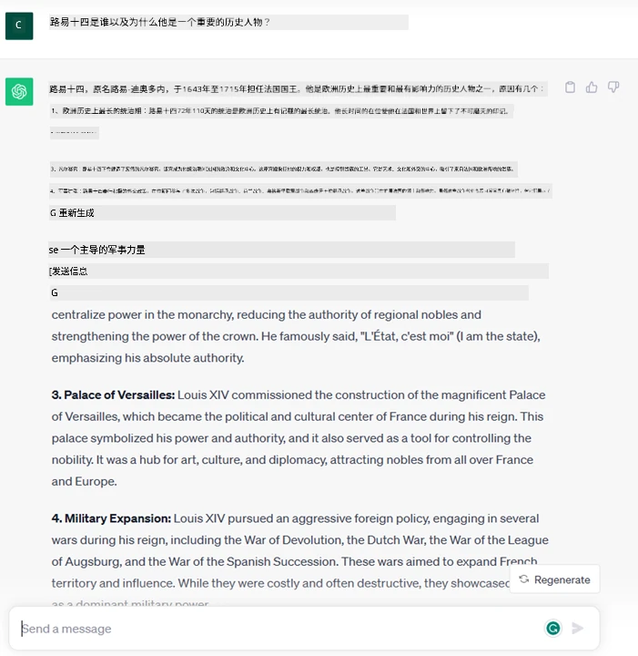
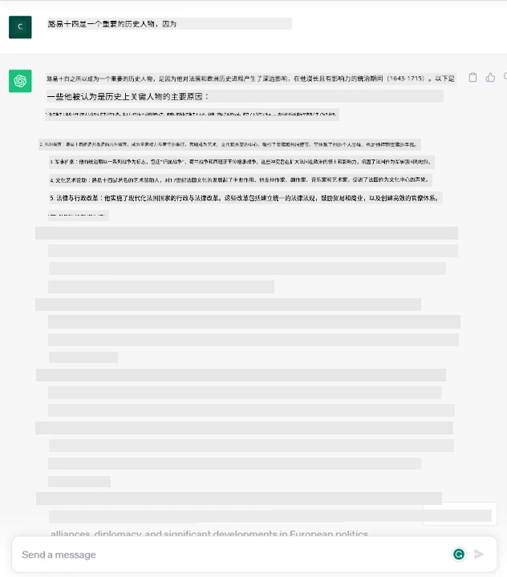
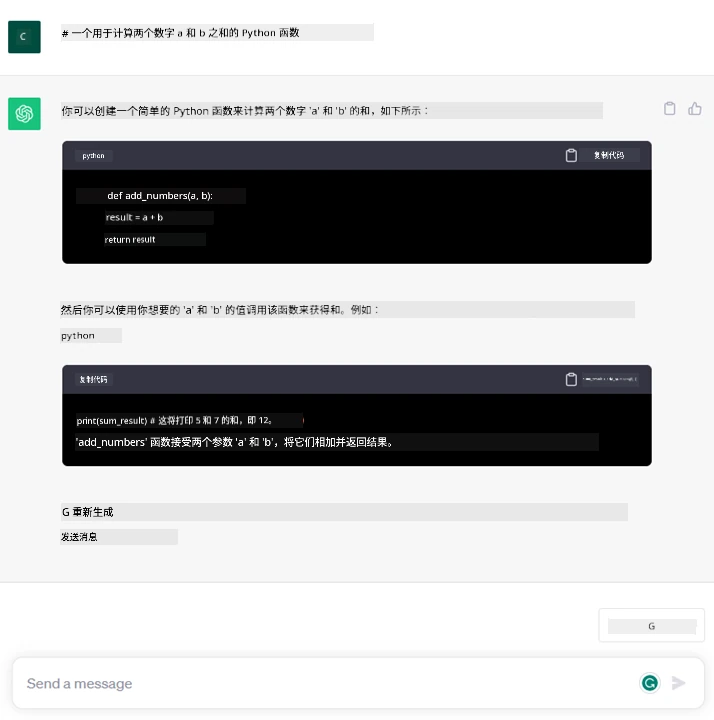

# 生成式人工智能和大型语言模型入门

_(点击上方图片观看本课程视频)_

生成式人工智能是能够生成文本、图像及其他类型内容的人工智能。它是一项卓越的技术，因为它实现了人工智能的普及化，任何人只需一个文本提示、一句自然语言的句子，就能使用它。你无需学习像 Java 或 SQL 这样的语言来完成有价值的任务，只需用自己的语言表达需求，就能从 AI 模型那里获得建议。它的应用和影响极为广泛，你可以撰写或理解报告、编写应用程序等，多数操作仅需几秒钟。

在本课程中，我们将探讨我们的初创企业如何利用生成式 AI 解锁教育领域的新场景，以及如何应对其应用所带来的社会影响和技术限制的不可避免挑战。

## 介绍

本课内容包括：

- 业务场景介绍：我们的初创企业理念和使命。
- 生成式人工智能以及当前技术格局的形成过程。
- 大型语言模型的内部工作原理。
- 大型语言模型的主要能力及实际应用案例。

## 学习目标

完成本课后，您将理解：

- 什么是生成式人工智能以及大型语言模型如何工作。
- 如何利用大型语言模型实现不同的用例，重点放在教育场景。

## 场景：我们的教育初创企业

生成式人工智能代表着人工智能技术的巅峰，突破了曾被认为不可能实现的界限。生成式 AI 模型具备多种功能和应用，但在本课程中，我们将探讨它如何通过一个虚构的初创企业彻底改变教育。我们将称这个初创企业为 _我们的初创企业_。我们的初创企业专注于教育领域，肩负着以下宏伟使命：

> _提升全球学习的可及性，确保教育公平，且根据每个学习者的需求提供个性化学习体验_。

我们的团队知道，没有利用现代最强大的工具之一——大型语言模型（LLMs），这一目标难以实现。

生成式人工智能有望彻底革新今天的学习和教学方式，学生全天候拥有虚拟教师，提供大量信息和示例，教师也能借助创新工具评估学生并提供反馈。

首先，让我们定义一些在本课程中将会反复使用的基础概念和术语。

## 生成式 AI 的发展历程

尽管最近生成式 AI 模型的发布引发了极大_热潮_，但这项技术已有几十年历史，其最早的研究可追溯至60年代。如今，AI 已具备人类认知能力，如对话能力，这在例如 [OpenAI ChatGPT](https://openai.com/chatgpt) 或基于 GPT 模型的 [Microsoft Copilot](https://copilot.microsoft.com/?WT.mc_id=academic-105485-koreyst) 的对话式网页搜索体验中得以体现。

回溯到最初，AI 的原型是基于专家知识库的打字式聊天机器人，知识库的答案通过输入文本中的关键词触发。
但很快我们发现，这种打字式聊天机器人的方法难以扩展。

### 采用统计方法的 AI：机器学习

90年代，一个转折点出现了，统计方法被应用于文本分析。由此开发出新的算法——机器学习——其能通过数据学习模式，而无需显式编程。这使机器能够模拟人类语言理解：统计模型在文本与标签的配对上训练，能够为未知输入文本分类，标签代表该信息的意图。

### 神经网络与现代虚拟助手

近年来，硬件技术的发展能够处理更多数据与更复杂的计算，推动了 AI 研究，催生了被称为神经网络或深度学习的高级机器学习算法。

神经网络（尤其是循环神经网络—RNNs）显著提升了自然语言处理的能力，能够更有意义地表示文本的含义，考虑句子中单词的上下文。

这项技术支撑了新世纪头十年的虚拟助手，它们擅长理解人类语言、识别需求并执行相应操作，如用预设脚本回答或调用第三方服务。

### 当今的生成式 AI

如今的生成式 AI 可视为深度学习的一个子集。

数十年AI领域的研究后，一种名为_Transformer_的新型模型架构突破了RNN的限制，它能处理更长的文本序列输入。Transformer基于注意力机制，使模型能够对收到的输入赋予不同权重，“关注”集中最相关信息的位置，而不受文本顺序的限制。

大多数近期的生成式 AI 模型——也称为大型语言模型（LLMs），因其处理文本输入和输出——确实基于此架构。这些模型在大量未标记的来源数据（如书籍、文章和网站）上训练，具备广泛适应各种任务的能力，且能生成语法正确、具有一定创造性的文本。它们不仅极大提高了机器“理解”输入文本的能力，也使机器能以人类语言生成原创回答成为可能。

## 大型语言模型如何工作？

下一章我们将探讨不同类型的生成式 AI 模型，但现在先了解大型语言模型的工作原理，重点介绍 OpenAI 的 GPT（生成式预训练Transformer）模型。

- **分词器，将文本转换为数字**：大型语言模型以文本作为输入并生成文本输出。然而作为统计模型，它们与数字的兼容度远高于文本序列。这就是为何模型的每个输入都先经过分词器处理，然后再由核心模型使用。一个 token 是一段文本，包含可变数量的字符，因此分词器的主要任务是将输入拆分成 token 数组。随后，每个 token 被映射到一个 token 索引，即原文本片段的整数编码。

- **预测输出 token**：给定 n 个 token 作为输入（最大 n 值因模型而异），模型能够预测一个 token 作为输出。该 token 随后被纳入下一次迭代的输入，采取扩展窗口模式，为用户提供一句或多句的答案体验。这也解释了为什么你在使用 ChatGPT 时，有时会发现它会在句子中途停止。

- **选择过程，概率分布**：输出 token 根据其在当前文本序列之后出现的概率被模型选出。模型依据训练数据计算所有可能“下一个 token”的概率分布。然而，选出的 token 不总是概率最高的那个。选择时加入一定随机性，使得模型的行为非确定性——同一输入不一定有完全相同的输出。随机性有助于模拟创造性思考过程，可通过称为“温度”的参数调整。

## 我们的初创企业如何利用大型语言模型？

现在我们对大型语言模型的工作机制有了更好的理解，接下来看看它们在实际中能高效完成的常见任务，结合我们的业务场景。
我们说过大型语言模型的核心能力是_从零开始生成文本，以自然语言编写的输入文本为起点_。

那输入输出是什么样的文本？
大型语言模型的输入称为 prompt（提示），输出称为 completion（完成），该术语指模型在当前输入基础上生成下一个 token 的机制。我们将深入探讨什么是 prompt 以及如何设计 prompt 来充分发挥模型能力。但现在先介绍 prompt 可能包含的内容：

- 一个<strong>指令</strong>，说明我们期望模型产生何种输出。此指令有时会包含示例或额外数据。

  1. 综合文章、书籍、产品评论等，提炼结构化信息的摘要。
    
    
  
  2. 创意思维与设计，如文章、论文、作业等的写作。
      
     

- 一个<strong>问题</strong>，以与代理对话的形式提出。
  
  

- 一段需<strong>文本补全</strong>的内容，隐含请求写作辅助。
  
  

- 一段<strong>代码</strong>，附带解释和文档编写的请求，或包含生成执行特定任务代码的指令。
  
  

上述示例较为简单，并非大型语言模型能力的详尽演示。它们旨在展示利用生成式 AI 的潜力，特别是在但不限于教育领域的应用。

另外，生成式 AI 模型的输出并不完美，有时模型的创造性反而会带来不利结果，产生让人觉得似是而非的内容，甚至可能包含冒犯性信息。生成式 AI 并非智能——至少不是全面意义上的智能，包括批判性和创造性推理或情感智能；它也非确定性且不完全可信，因为虚构内容如错误引用、内容和陈述可能与正确信息混合，并以令人信服且自信的方式呈现。接下来的课程中，我们将探讨这些限制，并学习如何减轻这些问题。

## 任务

您的任务是深入阅读[生成式人工智能](https://en.wikipedia.org/wiki/Generative_artificial_intelligence?WT.mc_id=academic-105485-koreyst)，尝试找出一个目前还未被生成式 AI 应用的领域。如果在那个领域引入生成式 AI，会带来什么不同？与“旧方法”相比，有何优势？能否做到以前做不到的事？效率提升了多少？请撰写 300 字摘要，描述您的理想 AI 初创企业，包括“问题”、“我如何使用 AI”、“影响”及可选的商业计划标题。

如果您完成了本任务，您甚至可以申请微软的孵化器 [Microsoft for Startups Founders Hub](https://www.microsoft.com/startups?WT.mc_id=academic-105485-koreyst)，我们为 Azure、OpenAI、指导及更多服务提供额度，敬请关注！

## 知识测试

关于大型语言模型哪些说法是正确的？

1. 每次回答都完全相同。
1. 它执行完美，比如擅长加法、生成可用代码等。
1. 即使使用相同的提示，回答也会有所不同。它也擅长为文本或代码提供初稿，但需要人工改进结果。

答案：3，大型语言模型是非确定性的，回答会有所变化，但你可以通过温度设置控制其变化范围。同时不应指望其执行完美，它的作用是为你完成繁重的初步工作，经常给出需要逐步改进的良好初稿。

## 干得漂亮！继续前行

完成本课后，请访问我们的[生成式 AI 学习合集](https://aka.ms/genai-collection?WT.mc_id=academic-105485-koreyst)，继续提升您的生成式 AI 知识！

前往第2课，我们将探讨如何[探索和比较不同类型的LLM](../02-exploring-and-comparing-different-llms/README.md?WT.mc_id=academic-105485-koreyst)！

---

<!-- CO-OP TRANSLATOR DISCLAIMER START -->
**免责声明**：
本文件由 AI 翻译服务 [Co-op Translator](https://github.com/Azure/co-op-translator) 翻译完成。尽管我们力求准确，但请注意，自动翻译可能包含错误或不准确之处。原始语言版文件应视为权威来源。对于重要信息，建议使用专业人工翻译。我们对因使用本翻译而产生的任何误解或误释不承担责任。
<!-- CO-OP TRANSLATOR DISCLAIMER END -->