# 探索和比较不同的大型语言模型（LLMs）

[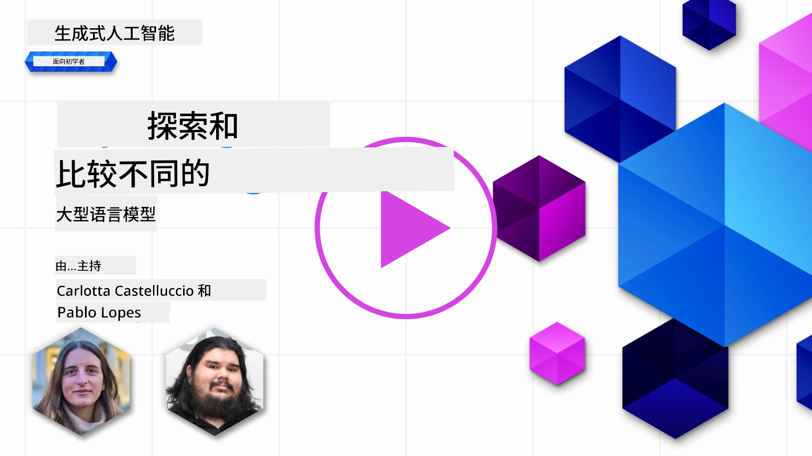](https://youtu.be/KIRUeDKscfI?si=8BHX1zvwzQBn-PlK)

> _点击上方图片观看本课视频_

在上一课中，我们了解了生成式人工智能如何改变技术格局，大型语言模型（LLMs）如何工作，以及像我们这样的初创企业如何将它们应用于实际用例并实现增长！在本章中，我们将比较和对比不同类型的大型语言模型（LLMs），以了解它们的优缺点。

我们初创企业旅程的下一步是探索当前LLM的格局，并了解哪些适合我们的用例。

## 介绍

本课将涵盖：

- 当前格局中不同类型的LLMs。
- 在Azure中测试、迭代和比较不同模型以适应你的用例。
- 如何部署大型语言模型。

## 学习目标

完成本课后，你将能够：

- 为你的用例选择合适的模型。
- 了解如何测试、迭代并提升模型性能。
- 了解企业如何部署模型。

## 了解不同类型的LLMs

根据架构、训练数据和用例，LLMs可以有多种分类。了解这些差异将帮助我们的初创企业为场景选择合适的模型，并理解如何测试、迭代及提升性能。

LLM模型种类繁多，选择哪种模型取决于你的使用目标、数据情况、预算以及更多因素。

根据你是否想使用模型进行文本、音频、视频、图像生成等不同任务，你可能会选择不同类型的模型。

- <strong>音频和语音识别</strong>。Whisper风格的模型依旧是通用语音识别的有用选择，但生产环境中现在也包含了诸如`gpt-4o-transcribe`、`gpt-4o-mini-transcribe`以及带分说时间戳变体的新型语音转文本模型。请根据你的场景评估语言覆盖度、说话人分离（分说）、实时支持、延迟和成本。详情见[OpenAI语音转文本文档](https://platform.openai.com/docs/guides/speech-to-text?WT.mc_id=academic-105485-koreyst)。

- <strong>图像生成</strong>。DALL-E和Midjourney是知名的图像生成选项，但当前OpenAI的图像API主要基于GPT图像模型如`gpt-image-2`，同时Stable Diffusion、Imagen、Flux等模型族也是常见选择。对比提示符合度、编辑支持、风格控制、安全需求及许可条款。了解详情参见[OpenAI图像生成指南](https://platform.openai.com/docs/guides/images?WT.mc_id=academic-105485-koreyst)及本课程第9章。

- <strong>文本生成</strong>。文本模型涵盖前沿模型、推理模型、小型低延迟模型以及开权重模型。目前示例包括OpenAI的GPT-5.x系列、Anthropic的Claude 4.x系列、Google的Gemini 3.x系列、Meta的Llama 4以及Mistral模型。不要仅依赖发布日期或价格选择，需综合考量任务质量、延迟、上下文窗口、工具使用、安全行为、地区可用性及总体成本。[微软Foundry模型目录](https://ai.azure.com/catalog?WT.mc_id=academic-105485-koreyst)是Azure上比较模型的好去处。

- <strong>多模态</strong>。许多现有模型能处理多种输入类型，部分可接受图像、音频或视频输入，有些能调用工具，还有专门生成图像、音频或视频的模型。例如，OpenAI当前模型支持文本和图像输入，Gemini模型可根据变种支持文本、代码、图像、音频及视频输入，Llama 4 Scout和Maverick是开权重原生多模态模型。使用前请务必查阅各模型卡，确认支持的输入输出模态。

选择模型即意味着获得一些基础能力，但可能还不够。通常你有企业特定数据需要以某种方式告知LLM，这里有几种不同做法，稍后章节会详细介绍。

### 基础模型与LLMs的区别

基础模型一词由[斯坦福研究人员提出](https://arxiv.org/abs/2108.07258?WT.mc_id=academic-105485-koreyst)，定义为满足以下部分标准的AI模型：

- <strong>它们使用无监督学习或自监督学习进行训练</strong>，即基于未标注的多模态数据训练，无需人为注释或标注。
- <strong>它们体积庞大</strong>，基于深层神经网络，训练参数达数十亿。
- **它们通常作为其他模型的“基础”**，即可作为后续模型微调的起点。

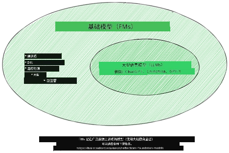

图片来源：[基础模型与大型语言模型详解 | 作者 Babar M Bhatti | Medium
](https://thebabar.medium.com/essential-guide-to-foundation-models-and-large-language-models-27dab58f7404)

为进一步说明这一区别，我们以ChatGPT为例。早期版本的ChatGPT使用GPT-3.5作为基础模型，OpenAI随后利用聊天专用数据和对齐技术，生成针对对话场景（如聊天机器人）性能更优的调优版本。现代AI服务通常会在多个模型变体间切换，因此服务名称与底层模型名称并不总是一致。

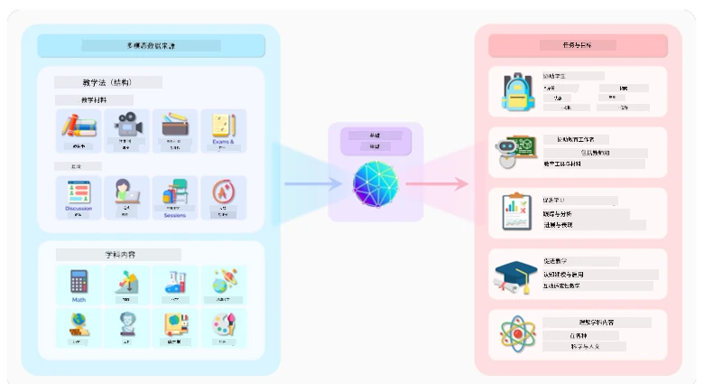

图片来源：[2108.07258.pdf (arxiv.org)](https://arxiv.org/pdf/2108.07258.pdf?WT.mc_id=academic-105485-koreyst)

### 开权重/开源模型与专有模型

另一种分类LLMs的方式是按其是否开权重、开源，或是专有模型。

开源和开权重模型提供模型工件供检查、下载或定制，但许可证各异。有的是完全开源，有的则为带使用限制的开权重模型。当企业需要更多掌控部署、数据本地化、成本或定制化时，这类模型很有用。但使用前务必审查许可证条款、服务成本、维护、安全更新及评估质量等。示例包括[Meta Llama 4](https://ai.meta.com/blog/llama-4-multimodal-intelligence/?WT.mc_id=academic-105485-koreyst)、部分[Mistral模型](https://docs.mistral.ai/models/overview?WT.mc_id=academic-105485-koreyst)及许多托管在[Hugging Face](https://huggingface.co/models?WT.mc_id=academic-105485-koreyst)上的模型。

专有模型由供应商拥有和托管，通常针对托管生产环境进行了优化，能提供强力支持、安全系统、工具集成和规模扩展。不过客户通常无法查看或修改模型权重，且需审查供应商的隐私、数据保留、合规和可接受使用政策条款。示例包括[OpenAI模型](https://platform.openai.com/docs/models?WT.mc_id=academic-105485-koreyst)、[Google Gemini](https://deepmind.google/models/gemini/pro/?WT.mc_id=academic-105485-koreyst)和[Anthropic Claude](https://platform.claude.com/docs/en/about-claude/models/overview?WT.mc_id=academic-105485-koreyst)。

### 嵌入模型与图像生成模型及文本与代码生成模型

LLM还可以根据其生成的输出类型进行分类。

嵌入模型是一类将文本转换为数值形式（称为嵌入）的模型，嵌入是输入文本的数值表示。嵌入使机器更容易理解词语或句子之间的关系，可作为其他模型的输入，如分类模型或聚类模型，这些模型在处理数值数据时性能更佳。嵌入模型通常用于迁移学习，即先针对任务数据丰富的代理任务训练模型，随后将模型权重（嵌入）重用于其他下游任务。此类别示例为[OpenAI嵌入模型](https://platform.openai.com/docs/models/embeddings?WT.mc_id=academic-105485-koreyst)。

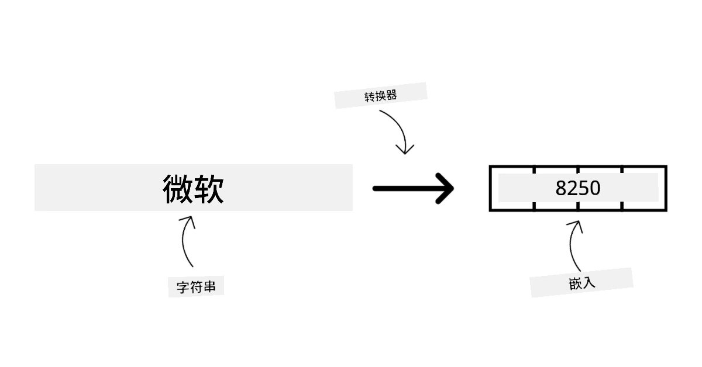

图像生成模型是一类用于生成图像的模型，常用于图像编辑、合成及转换。此类模型通常基于大规模图像数据集训练，如[LAION-5B](https://laion.ai/blog/laion-5b/?WT.mc_id=academic-105485-koreyst)，可生成新图像或通过修补、高分辨率增强、上色等技术编辑现有图像。示例包含[GPT图像模型](https://platform.openai.com/docs/guides/images?WT.mc_id=academic-105485-koreyst)、[Stable Diffusion模型](https://github.com/Stability-AI/StableDiffusion?WT.mc_id=academic-105485-koreyst)、Imagen模型等。

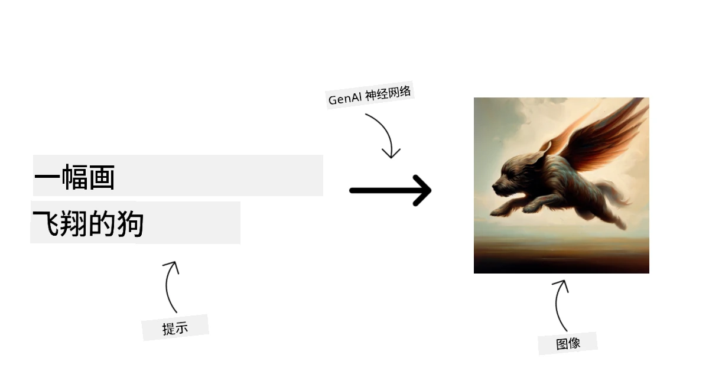

文本与代码生成模型是一类生成文本或代码的模型，常用于文本摘要、翻译和问答。文本生成模型通常在大规模文本数据集上训练，如[BookCorpus](https://www.cv-foundation.org/openaccess/content_iccv_2015/html/Zhu_Aligning_Books_and_ICCV_2015_paper.html?WT.mc_id=academic-105485-koreyst)，能生成新文本或解答问题。代码生成模型如[CodeParrot](https://huggingface.co/codeparrot?WT.mc_id=academic-105485-koreyst)则在大规模代码库（例如GitHub）上训练，能生成新代码或修复现有代码中的Bug。

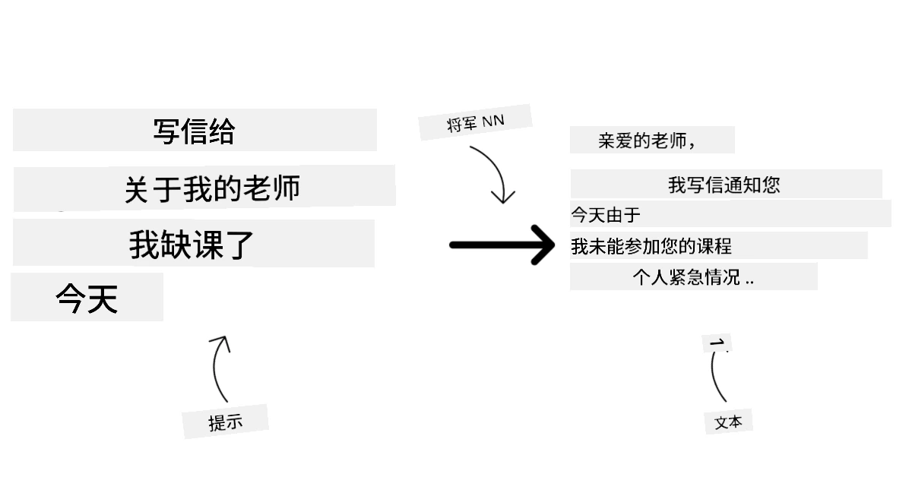

### 编码器-解码器架构与仅解码器架构

讲述不同LLM架构类型时，我们用一个比喻来说明。

假设你的经理给你布置了一个任务，要你出一套学生测验题。你有两位同事，一个负责出题内容，另一个负责审阅。

出题者就像仅解码器模型：他们能看到话题，认知你已写内容，然后基于上下文继续生成内容。他们擅长写出引人入胜且信息丰富的内容，但如果任务仅仅是分类、检索或编码信息，他们可能不是最佳选择。仅解码器模型家族包括GPT和Llama模型。

审阅者就像仅编码器模型，他们查看已写的课程和答案，理解二者的联系和上下文，但不擅长生成内容。仅编码器模型的例子是BERT。

设想还有一个既能出题又能审阅的同事，这就是编码器-解码器模型。典型示例为BART和T5。

### 服务与模型的区别

接下来，我们谈谈服务和模型的区别。服务是云服务提供商提供的产品，通常是模型、数据及其他组件的组合。模型是服务的核心组件，通常是基础模型，例如大型语言模型。

服务通常针对生产环境优化，使用起来比模型更容易，常通过图形用户界面实现。然而，服务不一定永久免费，通常需要订阅或付费，以换取使用服务方的设备和资源、优化费用和轻松扩展的优势。服务示例为[Azure OpenAI Service](https://learn.microsoft.com/azure/ai-services/openai/overview?WT.mc_id=academic-105485-koreyst)，它采用按需付费计费模式，即用户根据使用量付费，且提供企业级安全和负责任的AI框架，基于模型能力之上。

模型则是神经网络工件：参数、权重、架构、分词器及支持配置。若要在本地或专用环境运行模型，则需要合适硬件、服务基础设施、监控及兼容的开源/开权重许可或商业许可。开权重模型如Llama 4或Mistral可以自行托管，但仍需计算资源及运维经验。

## 如何在Azure上测试并迭代不同模型，以了解性能表现

一旦我们的团队探索了当前的大型语言模型（LLM）领域，并为他们的场景确定了一些良好候选，下一步就是在他们的数据和工作负载上测试这些模型。这是一个通过实验和测量进行的迭代过程。
我们在之前的段落中提到的大多数模型（OpenAI 模型、开放权重模型如 Llama 4 和 Mistral，以及 Hugging Face 模型）都可以在 [Microsoft Foundry Models](https://learn.microsoft.com/azure/foundry/concepts/foundry-models-overview?WT.mc_id=academic-105485-koreyst) 找到。

[Microsoft Foundry](https://learn.microsoft.com/azure/foundry/what-is-foundry?WT.mc_id=academic-105485-koreyst)，前身是 Azure AI Studio/Azure AI Foundry，是一个构建 AI 应用和代理的统一 Azure 平台。它帮助开发者管理从实验和评估到部署、监控和治理的整个生命周期。Microsoft Foundry 中的模型目录使用户能够：

- 在目录中找到感兴趣的基础模型，包括 Azure 销售的模型以及合作伙伴和社区提供的模型。用户可以按任务、提供者、许可证、部署选项或名称过滤。

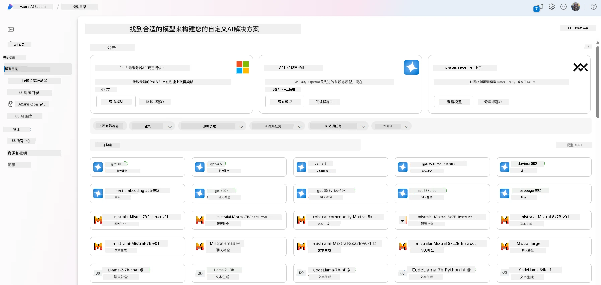

- 查看模型卡，其中包括预期用途和训练数据的详细描述、代码示例以及内部评估库上的评估结果。

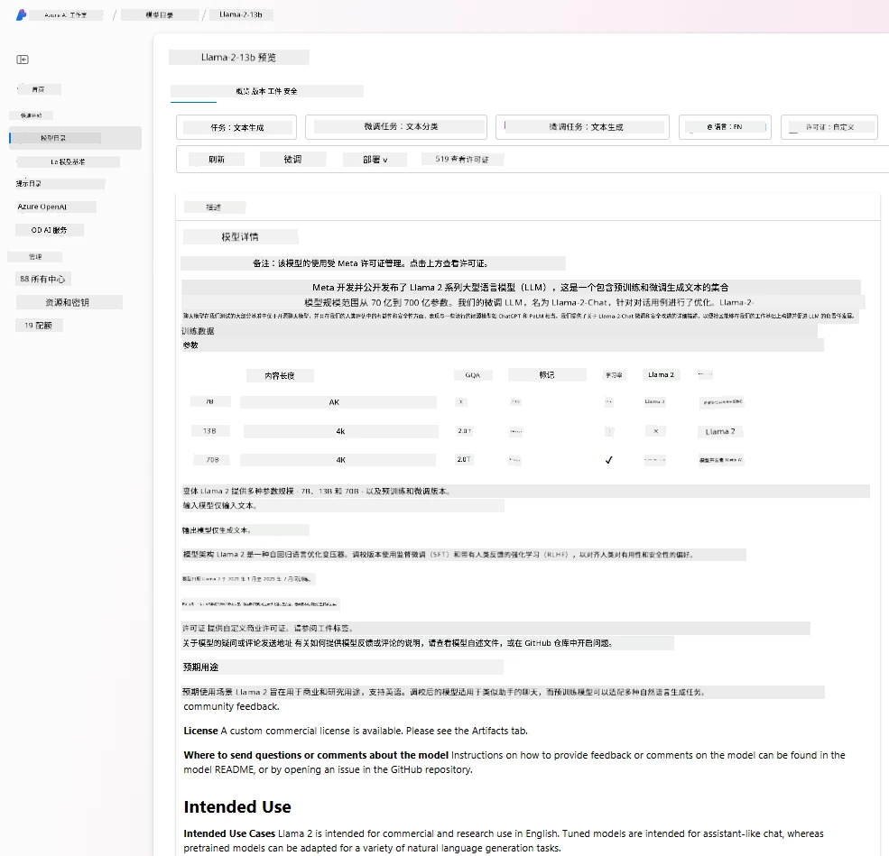

- 比较行业内可用的模型和数据集的基准测试，以评估哪个最符合业务场景，通过 [Model Benchmarks](https://learn.microsoft.com/azure/ai-studio/how-to/model-benchmarks?WT.mc_id=academic-105485-koreyst) 面板实现。

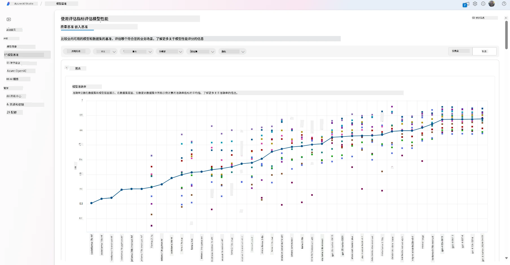

- 对支持的模型进行微调，使用自定义训练数据，提高模型在特定工作负载下的性能，利用 Microsoft Foundry 的实验和跟踪功能。

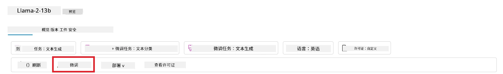

- 将原始预训练模型或微调版本部署到远程实时推理端点，使用托管计算或无服务器部署选项，使应用程序能够使用它。

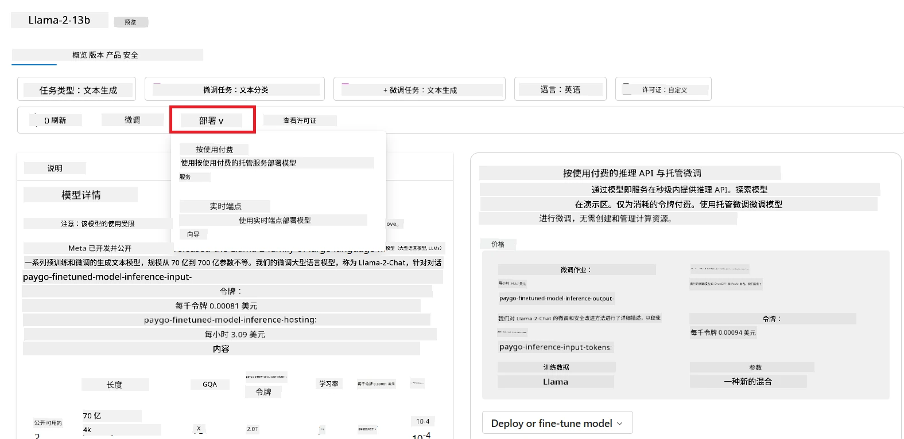

> [!NOTE]
> 目录中的所有模型目前并非都支持微调和/或按用量付费部署。请查看模型卡以了解模型的功能和限制详情。

## 改进大型语言模型结果

我们与创业团队探索了不同类型的 LLM 以及一个云平台（Microsoft Foundry），它使我们能够比较不同模型，在测试数据上评估它们，提升性能，并将它们部署到推理端点。

但是，他们什么时候应考虑微调模型而不是使用预训练模型？还有哪些方法可以改进模型在特定工作负载上的性能？

企业可以使用多种方法从 LLM 中获得所需结果。部署 LLM 时，可以选择不同类型、不同训练程度的模型，具备不同的复杂性、成本和质量水平。以下是几种不同的方法：

- <strong>带上下文的提示工程</strong>。其思想是在提示时提供足够的上下文，以确保获得所需的响应。

- **检索增强生成（RAG）**。您的数据可能存在于数据库或网页端点中，为了确保这些数据或其子集在提示时被包含，可以获取相关数据并将其作为用户提示的一部分。

- <strong>微调模型</strong>。这里，您使用自己的数据进一步训练模型，使模型更准确、更符合您的需求，但可能成本较高。

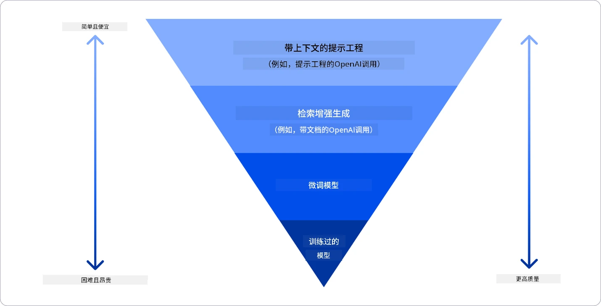

图片来源：[Four Ways that Enterprises Deploy LLMs | Fiddler AI Blog](https://www.fiddler.ai/blog/four-ways-that-enterprises-deploy-llms?WT.mc_id=academic-105485-koreyst)

### 带上下文的提示工程

预训练的大型语言模型在通用自然语言任务上表现非常好，即使仅用短提示，如待完成的句子或问题——即所谓的“零样本”学习。

然而，用户越是能够通过详细请求和示例——即上下文——来构造查询，回答就越准确、越符合用户预期。如果提示中仅包含一个示例，我们称之为“一样本”学习；如果包含多个示例，则称为“少样本”学习。
带上下文的提示工程是启动快速改进的最具成本效益的方法。

### 检索增强生成（RAG）

LLM 的限制在于它们只能使用训练时所用数据来生成答案。这意味着它们不了解训练后发生的事实，也无法访问非公开信息（如公司数据）。
这个问题可以通过 RAG 技术克服，RAG 通过将文档块形式的外部数据增强至提示中，考虑到提示长度限制。这由向量数据库工具支持（如 [Azure Vector Search](https://learn.microsoft.com/azure/search/vector-search-overview?WT.mc_id=academic-105485-koreyst)），该工具从各种预定义数据源中检索有用的数据块并将其加入提示上下文。

当企业缺乏足够的数据、时间或资源来微调 LLM，但仍希望提升特定工作负载的性能并减少幻觉、过时或 unsupported 回答的风险时，该技术极为有用。

### 微调模型

微调是一个利用迁移学习的方法，将模型“调整”到下游任务或解决特定问题。不同于少样本学习和 RAG，它生成一个新的模型，更新权重和偏置。它需要一组训练示例，包括单个输入（提示）及其相关输出（完成）。
如果满足以下条件，这将是首选方法：

- <strong>使用较小的任务专用模型</strong>。企业希望微调较小的模型以完成特定任务，而不是反复提示较大的前沿模型，这样更加经济更快。

- <strong>考虑延迟</strong>。对某个特定用例来说，延迟很关键，因此无法使用过长的提示，或者模型需要学习的例子数与提示长度限制不符。

- <strong>适应稳定行为</strong>。企业拥有许多高质量示例，且希望模型始终遵循某个任务模式、输出格式、语调或领域风格。如果主要问题是频繁变化的新事实或私有知识，应使用 RAG 而非单靠微调。

### 训练模型

从头训练一个 LLM 毫无疑问是最困难和最复杂的方法，需要大量数据、熟练资源和适当的计算能力。只有在企业拥有领域特定用例和大量领域中心数据的情况下，才应考虑该选项。

## 知识检测

哪种方法有助于改进 LLM 的完成结果？

1. 带上下文的提示工程
1. RAG
1. 微调模型

答案：三种方法都有效。先从提示工程和上下文开始，实现快速改进；当模型需要最新事实或私有业务数据时，使用 RAG；当拥有足够高质量的示例且需要模型始终遵循任务、格式、语调或领域模式时，选择微调。

## 🚀 挑战

阅读更多关于如何为您的业务[使用 RAG](https://learn.microsoft.com/azure/search/retrieval-augmented-generation-overview?WT.mc_id=academic-105485-koreyst)。

## 做得很好，继续学习

完成本课后，请查看我们的 [生成式 AI 学习合集](https://aka.ms/genai-collection?WT.mc_id=academic-105485-koreyst)，继续提升生成式 AI 知识！

继续前往第 3 课，我们将探讨如何 [负责任地构建生成式 AI](../03-using-generative-ai-responsibly/README.md?WT.mc_id=academic-105485-koreyst)！

---

<!-- CO-OP TRANSLATOR DISCLAIMER START -->
**免责声明**：
本文件由 AI 翻译服务 [Co-op Translator](https://github.com/Azure/co-op-translator) 翻译完成。尽管我们力求准确，但请注意，自动翻译可能包含错误或不准确之处。原始语言版文件应视为权威来源。对于重要信息，建议使用专业人工翻译。我们对因使用本翻译而产生的任何误解或误释不承担责任。
<!-- CO-OP TRANSLATOR DISCLAIMER END -->