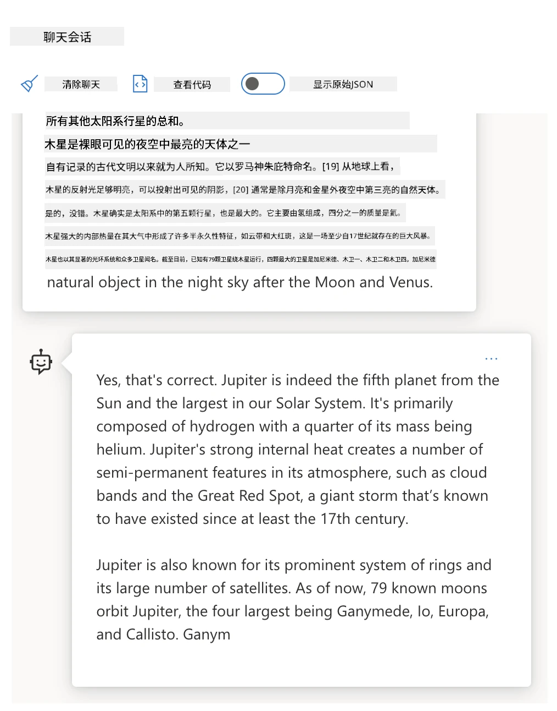
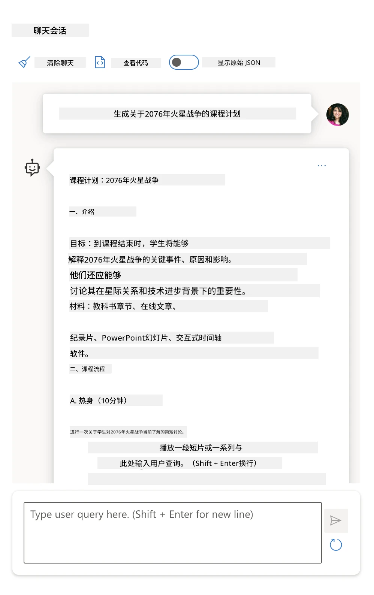

# Prompt Engineering Fundamentals

[](https://youtu.be/GElCu2kUlRs?si=qrXsBvXnCW12epb8)

## Introduction
本模块涵盖生成式 AI 模型中创建有效提示的基本概念和技术。向大型语言模型 (LLM) 编写提示的方式也很重要。精心设计的提示可以获得更高质量的回应。但诸如 _提示_ 和 _提示工程_ 等术语到底是什么意思？我如何改进发送给 LLM 的提示 _输入_？这些问题将在本章及下一章中尝试解答。

_生成式 AI_ 有能力根据用户请求创建新内容（例如文本、图像、音频、代码等）。它通过使用诸如 OpenAI 的 GPT（“生成预训练变换器”）系列等大型语言模型实现，这些模型经过自然语言和代码的训练。

用户现在可以使用熟悉的方式（如聊天）与这些模型交互，无需任何技术专长或培训。这些模型是基于 _提示_ 的——用户发送文本输入（提示）并收到 AI 响应（完成）。然后，他们可以通过多轮对话与 AI 迭代交互，不断完善提示，直到响应符合预期。

“提示”现在成为生成式 AI 应用的主要 _编程接口_，告诉模型该做什么并影响返回响应的质量。“提示工程”是一个快速发展的研究领域，专注于 _设计和优化_ 提示，以大规模提供一致且高质量的响应。

## Learning Goals

在本课中，我们将学习什么是提示工程、为何重要，以及如何为给定模型和应用目标设计更有效的提示。我们将理解提示工程的核心概念和最佳实践——并了解一个交互式 Jupyter Notebook“沙箱”环境，在其中可以看到这些概念应用于真实示例。

本课结束时我们将能够：

1. 解释什么是提示工程以及其重要性。
2. 描述提示的组成部分及其用途。
3. 学习提示工程的最佳实践和技术。
4. 使用 OpenAI 端点将学到的技术应用于真实示例。

## Key Terms

提示工程：设计和优化输入以引导 AI 模型生成预期输出的实践。  
分词（Tokenization）：将文本转换为模型可以理解和处理的较小单位（称为 tokens）的过程。  
指令调优 LLMs：经过特定指令微调的超大型语言模型，旨在提升其响应的准确性和相关性。

## Learning Sandbox

提示工程目前更多是一门艺术而非科学。提高直觉的最好方法是_多加练习_，并采用试错法，将应用领域专业知识与推荐技术及模型特定优化相结合。

本课随附的 Jupyter Notebook 提供一个_沙箱_环境，你可以边学边试——或作为最后代码挑战的一部分来完成。执行练习，你需要：

1. **Azure OpenAI API 密钥** —— 部署的 LLM 服务端点。  
2. **Python 运行环境** —— 用于执行 Notebook。  
3. **本地环境变量** —— 请先完成[设置](./../00-course-setup/02-setup-local.md?WT.mc_id=academic-105485-koreyst)步骤以准备环境。

笔记本带有_入门_练习——但鼓励你添加自己的_Markdown_（描述）和_代码_（提示请求）部分，尝试更多示例或想法，培养提示设计直觉。

## Illustrated Guide

想在深入学习前先了解本课的整体框架？看看这份图解指南，它让你对涵盖的主要主题以及每个主题中的关键要点有所了解。课程路线图引导你从理解核心概念和挑战，到用相关提示工程技术和最佳实践应对问题。请注意，本指南中的“高级技术”部分涉及本课程_下一章_的内容。


## Our Startup

现在，让我们谈谈_本主题_如何与我们启动公司的使命相关，使命是[将 AI 创新引入教育](https://educationblog.microsoft.com/2023/06/collaborating-to-bring-ai-innovation-to-education?WT.mc_id=academic-105485-koreyst)。我们希望构建基于 AI 的_个性化学习_应用——那么，让我们思考应用的不同用户如何“设计”提示：

- **管理员** 可能会要求 AI _分析课程数据以识别覆盖的空白_。AI 可以总结结果或用代码进行可视化。  
- **教育者** 可能会请求 AI _为目标受众和主题生成课程计划_。AI 可以以指定格式构建个性化的计划。  
- **学生** 可能会让 AI _在难学科目上辅导他们_。AI 现在可以通过针对他们水平的课程、提示和示例引导学生。

这只是冰山一角。看看[教育提示库](https://github.com/microsoft/prompts-for-edu/tree/main?WT.mc_id=academic-105485-koreyst)—由教育专家策划的开源提示库—了解更多可能性！_试着在沙箱或 OpenAI Playground 上运行这些提示，看看效果！_

<!--
LESSON TEMPLATE:
This unit should cover core concept #1.
Reinforce the concept with examples and references.

CONCEPT #1:
Prompt Engineering.
Define it and explain why it is needed.
-->

## 什么是提示工程？

我们从定义**提示工程**开始，即_设计和优化_文本输入（提示），以针对给定的应用目标和模型提供一致且高质量的响应（完成）。我们可以将其视为一个两步过程：

- 为给定模型和目标_设计_初始提示  
- 迭代地_完善_提示以提升响应质量

这必然是一个试错过程，需要用户的直觉和努力以获得最佳结果。那么为什么它如此重要？为回答这个问题，我们首先需要理解三个概念：

- _分词_ = 模型如何“看”提示  
- _基础 LLMs_ = 基础模型如何“处理”提示  
- _指令调优 LLMs_ = 模型如何“识别任务”

### 分词

LLM 将提示视为_token 序列_，不同模型（或模型版本）可以用不同方式对同一提示进行分词。由于 LLM 是对 token 进行训练（不是对原文本），分词方式直接影响生成响应的质量。

想直观了解分词工作原理，可以尝试以下工具：[OpenAI Tokenizer](https://platform.openai.com/tokenizer?WT.mc_id=academic-105485-koreyst)。将你的提示复制进去，观察它如何被转换为 token，注意空白字符和标点符号的处理方式。请注意，该示例显示的是较旧的 LLM（GPT-3），使用较新模型时结果可能不同。


### 概念：基础模型

提示一经分词，["基础 LLM"](https://blog.gopenai.com/an-introduction-to-base-and-instruction-tuned-large-language-models-8de102c785a6?WT.mc_id=academic-105485-koreyst)（或基础模型）的主要功能是预测序列中的下一个 token。由于 LLM 在海量文本数据集上训练，它们对 token 之间的统计关系具有良好把握，能有一定信心做出预测。注意，它们不理解提示或 token 中词语的_含义_；它们只是看到一个模式，可以用下一个预测来“完成”它。预测会持续进行，直到用户干预或达到预设条件。

想看基于提示的完成演示？将上述提示输入 Azure OpenAI Studio [_聊天沙盒_](https://oai.azure.com/playground?WT.mc_id=academic-105485-koreyst)，使用默认设置。系统将提示作为信息请求处理——你应会看到符合该上下文的完成结果。

但如果用户想看到满足某些标准或任务目标的特定内容呢？这里就涉及到了_指令调优_的 LLM。



### 概念：指令调优 LLM

[指令调优 LLM](https://blog.gopenai.com/an-introduction-to-base-and-instruction-tuned-large-language-models-8de102c785a6?WT.mc_id=academic-105485-koreyst)是基于基础模型，使用带有明确指令的示例或输入/输出对（例如多轮“消息”）进行微调的模型，AI 的回答尝试遵循这些指令。

这利用了“基于人类反馈的强化学习（RLHF）”等技术，使模型能够_遵循指令_和_从反馈中学习_，从而生成更适合实际应用且更符合用户目标的响应。

我们试试——重新使用以上提示，但现在更改_系统信息_，提供如下指令作为上下文：

> _为二年级学生总结你收到的内容。保持结果为一段文字，包含3-5个要点。_

看看结果如何调整以反映期望的目标和格式？教育者现在可以直接在课堂幻灯片中使用此响应。


## 为什么我们需要提示工程？

既然我们了解了 LLM 如何处理提示，现在让我们谈谈_为何_需要提示工程。答案在于当前 LLM 存在诸多挑战，如果不花力气构建和优化提示，难以实现_可靠且一致的完成结果_。例如：

1. **模型响应具有随机性。** _相同提示_ 在不同模型或版本中可能生成不同响应。即使是_同一模型_，不同时间也可能产生不同结果。_提示工程技术可帮助我们通过提供更好的护栏来最小化这些差异_。

1. **模型可能生成虚假响应。** 模型是用_大而有限_的数据集预训练，意味着它们对训练范围外的概念缺乏知识。因此，可能会产生不准确、虚构或与已知事实直接矛盾的结果。_提示工程技术帮助用户识别和减少此类虚假响应，例如通过要求 AI 提供引用或推理_。

1. **模型能力各异。** 较新型号或新一代模型功能更强大，但也带来费用和复杂性的独特变化与权衡。_提示工程能帮助我们开发最佳实践和工作流，抽象差异并以可扩展、无缝的方式适应模型特定需求_。

让我们在 OpenAI 或 Azure OpenAI Playground 亲自体验：

- 使用相同提示和不同 LLM 部署（例如 OpenAI，Azure OpenAI，Hugging Face），你有没有看到不同的结果？  
- 重复使用相同提示与_同一_ LLM 部署（如 Azure OpenAI Playground），这些结果有何变化？

### 虚假响应示例

在本课程中，我们用**“虚假响应”（fabrication）** 来指代 LLM 由于训练限制等因素，有时生成事实不正确信息的现象。你也可能见过这一现象被称为_“幻觉”（hallucinations）_，但我们强烈建议使用“虚假响应”这一术语，以避免误将机器驱动的输出赋予人类特质，体现更准确的描述。此用语也符合[负责任 AI 指南](https://www.microsoft.com/ai/responsible-ai?WT.mc_id=academic-105485-koreyst)的术语规范，去除某些可能被视为冒犯或不包容的词汇。

想了解虚假响应是如何出现的吗？想象一个指示 AI 生成不存在主题内容的提示（以确保训练集未涵盖该主题）。例如——我尝试了这个提示：

> **提示：** 生成一份关于 2076 年火星战争的课程计划。
一次网络搜索显示，有关于火星战争的虚构记录（例如电视剧或书籍）——但没有任何是发生在2076年的。常识也告诉我们，2076年是在未来，因此无法与真实事件相关联。

那么，当我们用不同的LLM服务商运行这个提示时，会发生什么？

> **回应 1**：OpenAI Playground（GPT-35）


> **回应 2**：Azure OpenAI Playground（GPT-35）



> **回应 3**：Hugging Face Chat Playground（LLama-2）


如预期，每个模型（或模型版本）由于随机行为和模型能力差异，会产生略有不同的回答。例如，一个模型面向8年级学生，另一个假设是高中生。但这三个模型都生成了可能让不了解情况的用户相信该事件是真的的回答。

诸如_元提示法_和_温度参数配置_等提示工程技术，或许能在一定程度上减少模型的虚构内容。新的提示工程_架构_也无缝整合了新的工具和技术到提示流程中，以缓解或减少这些影响。

## 案例研究：GitHub Copilot

本节最后，通过一个案例研究来看提示工程是如何应用于现实解决方案的： [GitHub Copilot](https://github.com/features/copilot?WT.mc_id=academic-105485-koreyst)。

GitHub Copilot 是你的“AI 搭档程序员”——它将文本提示转换成代码补全，并集成到你的开发环境（例如 Visual Studio Code）中，提供无缝的使用体验。正如以下系列博客所述，最早版本基于 OpenAI Codex 模型——工程师们很快意识到需要对模型进行微调，并开发更好的提示工程技术，以提升代码质量。今年7月，他们[推出了超越 Codex 的改进版AI模型](https://github.blog/2023-07-28-smarter-more-efficient-coding-github-copilot-goes-beyond-codex-with-improved-ai-model/?WT.mc_id=academic-105485-koreyst)，以实现更快速的建议。

请按顺序阅读这些帖子，跟踪他们的学习历程。

- **2023年5月** | [GitHub Copilot 逐步提升了对你代码的理解能力](https://github.blog/2023-05-17-how-github-copilot-is-getting-better-at-understanding-your-code/?WT.mc_id=academic-105485-koreyst)
- **2023年5月** | [走进 GitHub：揭秘 GitHub Copilot 背后的大型语言模型](https://github.blog/2023-05-17-inside-github-working-with-the-llms-behind-github-copilot/?WT.mc_id=academic-105485-koreyst)
- **2023年6月** | [如何为 GitHub Copilot 撰写更好的提示](https://github.blog/2023-06-20-how-to-write-better-prompts-for-github-copilot/?WT.mc_id=academic-105485-koreyst)
- **2023年7月** | [GitHub Copilot 超越 Codex，采用改进的AI模型](https://github.blog/2023-07-28-smarter-more-efficient-coding-github-copilot-goes-beyond-codex-with-improved-ai-model/?WT.mc_id=academic-105485-koreyst)
- **2023年7月** | [开发者提示工程与大语言模型指南](https://github.blog/2023-07-17-prompt-engineering-guide-generative-ai-llms/?WT.mc_id=academic-105485-koreyst)
- **2023年9月** | [如何构建企业级大型语言模型应用：GitHub Copilot 的经验教训](https://github.blog/2023-09-06-how-to-build-an-enterprise-llm-application-lessons-from-github-copilot/?WT.mc_id=academic-105485-koreyst)

你也可以浏览他们的[工程博客](https://github.blog/category/engineering/?WT.mc_id=academic-105485-koreyst)获取更多文章，比如这篇[如何用 GitHub Copilot Chat 构建 ReactJS 画廊原型](https://github.blog/2023-09-27-how-i-used-github-copilot-chat-to-build-a-reactjs-gallery-prototype/?WT.mc_id=academic-105485-koreyst)，展示这些模型和技术是如何运用来驱动真实世界应用的。

---

<!--
LESSON TEMPLATE:
This unit should cover core concept #2.
Reinforce the concept with examples and references.

CONCEPT #2:
Prompt Design.
Illustrated with examples.
-->

## 提示构建

我们已经了解了为什么提示工程重要——现在让我们理解提示是如何_构建_的，从而评估不同技巧以设计更有效的提示。

### 基础提示

先说最基础的提示：一个只包含文本输入、无其他上下文的请求。比如，当我们向 OpenAI [Completion API](https://platform.openai.com/docs/api-reference/completions?WT.mc_id=academic-105485-koreyst)发送美国国歌开头的几个词，它会立即_补全_接下来的歌词，展示了基本的预测行为。

| 提示（输入）       | 补全（输出）                                                                                                                       |
| :----------------- | :-------------------------------------------------------------------------------------------------------------------------------- |
| Oh say can you see | 听起来你正在唱《星条旗永不落》，这是美国的国歌。完整歌词是……                                                                      |

### 复杂提示

现在给这个基础提示增加上下文和指令。[Chat Completion API](https://learn.microsoft.com/azure/ai-services/openai/how-to/chatgpt?WT.mc_id=academic-105485-koreyst)让我们可以通过一组_消息_来构建复杂的提示：

- 输入/输出对，反映_用户_输入和_助手_回应。
- 系统消息，设置助手的行为或个性上下文。

请求现在是下面这种形式，_分词_有效地捕捉了上下文和对话中的相关信息。改变系统上下文对补全质量的影响可以和用户输入一样显著。

```python
response = openai.chat.completions.create(
    model="gpt-3.5-turbo",
    messages=[
        {"role": "system", "content": "You are a helpful assistant."},
        {"role": "user", "content": "Who won the world series in 2020?"},
        {"role": "assistant", "content": "The Los Angeles Dodgers won the World Series in 2020."},
        {"role": "user", "content": "Where was it played?"}
    ]
)
```

### 指令提示

在上述例子中，用户提示是一个简单的文本查询，可以理解为请求信息。对于_指令_提示，我们可以用该文本更详细地说明任务，为AI提供更明确的引导。示例如下：

| 提示（输入）                                                                                                                                                                                                                              | 补全（输出）                                                                                                  | 指令类型           |
| :---------------------------------------------------------------------------------------------------------------------------------------------------------------------------------------------------------------------------------------- | :------------------------------------------------------------------------------------------------------------- | :----------------- |
| 写一段关于内战的描述                                                                                                                                                                                                                      | _返回一段简单的文字_                                                                                          | 简单               |
| 写一段关于内战的描述。提供关键日期和事件，并描述其意义                                                                                                                                                                                  | _返回一段文字，随后附上关键事件日期及说明列表_                                                               | 复杂               |
| 用一段话描述内战。提供3条关键日期及其意义的要点。再提供3条关键历史人物及其贡献的要点。以JSON格式返回结果。                                                                                                                                | _返回更详细内容，文本框中为JSON格式，便于复制粘贴验证_                                                        | 复杂，格式化       |

## 主要内容

上例中，提示仍然相对开放，允许LLM决定其预训练数据集的相关部分。借助_主要内容_设计模式，输入文本被分为两部分：

- 一个指令（动作）
- 相关内容（影响动作）

下面示例，指令是“用两句话总结”。

| 提示（输入）                                                                                                                                                                                                                                                                                                                                                                                                                                                                                                                                                                                                                                                                                     | 补全（输出）                                                                                                                                                                                                                                                                                   |
| :------------------------------------------------------------------------------------------------------------------------------------------------------------------------------------------------------------------------------------------------------------------------------------------------------------------------------------------------------------------------------------------------------------------------------------------------------------------------------------------------------------------------------------------------------------------------------------------------------------------------------------------------------------------------------------------------- | :---------------------------------------------------------------------------------------------------------------------------------------------------------------------------------------------------------------------------------------------------------------------------------------------- |
| 木星是距离太阳第五颗行星，也是太阳系中最大的行星。它是一颗气体巨星，质量约为太阳的千分之一，但却是太阳系其他所有行星质量总和的两倍半。木星是夜空中用肉眼能见到的最亮天体之一，自有历史记载之前便为古代文明所知。它以罗马神朱庇特命名。[19] 从地球上看，木星反射的光线足以投射可见的影子，[20] 平均是夜空中第三亮的自然天体，仅次于月亮和金星。 <br/> **请用两句简短的话总结以上内容** | 木星是距离太阳第五的大行星，也是太阳系中最大的行星之一，夜空中最亮的天体之一。它以罗马神朱庇特命名，是一颗质量相当于太阳系中其他行星总和两倍半的气体巨星。                                                                                                                                                                               |

主要内容段可以通过多种方式驱动更有效的指令：

- **示例** — 不是直接告诉模型做什么，而是给它该任务的样例，让它推断模式。
- **提示语** — 在指令后接一个“提示”，激发补全，引导模型生成更相关答案。
- **模板** — 可重复使用的提示“配方”，含有占位符（变量），便于用数据定制特定场景。

下面演示这些方法的具体操作。

### 使用示例

这是用主要内容“喂”给模型若干输出示例，让它推断出期望输出的模式。根据示例数量，可分为零样本、一样本、多样本提示等。

提示现在包含三部分：

- 任务描述
- 若干想要的输出示例
- 新示例的开头（隐含任务描述）

| 学习类型 | 提示（输入）                                                                                                              | 补全（输出）           |
| :-------- | :------------------------------------------------------------------------------------------------------------------------ | :---------------------- |
| 零样本    | “The Sun is Shining”。翻译成西班牙语                                                                                      | “El Sol está brillando”。  |
| 一样本    | “The Sun is Shining” => “El Sol está brillando”。<br>“It's a Cold and Windy Day” =>                                      | “Es un día frío y ventoso”。 |
| 多样本    | 该球员跑垒 => 棒球 <br/> 该球员发ace球 => 网球 <br/> 该球员击出六分球 => 板球 <br/> 该球员扣篮得分 => 篮球                     | 篮球                     |
|           |                                                                                                                            |                         |

注意零样本提示需要显式指令（“翻译成西班牙语”），而一样本提示中的指令是隐含推断出来的。多样本示例则展示了更多示例如何帮助模型更准确推断，且无需额外指令。

### 提示语

另一种使用主要内容的方法是提供_提示语_而非示例。在这种方法中，通过给模型一个反映想要回复格式的开头片段，来“引导”它。模型据此“接招”，续写同样风格的内容。

| 提示语数量 | 提示（输入）                                                                                                                                                                                                                                                                                                                                                                                                                                   | 补全（输出）                                                                                                                                                                                                                                                                                  |
| :--------- | :--------------------------------------------------------------------------------------------------------------------------------------------------------------------------------------------------------------------------------------------------------------------------------------------------------------------------------------------------------------------------------------------------------------------------------------------- | :-------------------------------------------------------------------------------------------------------------------------------------------------------------------------------------------------------------------------------------------------------------------------------------------- |
| 0          | 木星是距离太阳第五颗行星，也是太阳系中最大的行星。它是一颗气体巨星，质量约为太阳的千分之一，但却是太阳系其他所有行星质量总和的两倍半。木星是夜空中用肉眼能见到的最亮天体之一，自有历史记载之前便为古代文明所知。 <br/>**请总结以上内容**                                                                                                 | 木星是太阳系中最大的行星，排行第五。它是一颗质量为太阳千分之一的气体巨星，但质量是其他行星总和的两倍半。古代文明早已知晓木星，它在夜空中非常明亮。                                                                                                                                                           |
| 1              | 木星是距离太阳第五颗行星，也是太阳系中最大的行星。它是一颗气态巨行星，质量是太阳的千分之一，但相当于太阳系中所有其他行星质量总和的两倍半。木星是夜空中用肉眼可见的最明亮天体之一，自有记载的历史之前，古代文明就已知晓它。<br/>**总结如下** <br/> 我们了解到木星 | 是距离太阳的第五颗行星，也是太阳系中最大的行星。它是一颗气态巨行星，质量是太阳的千分之一，但相当于所有其他行星总和的两倍半。它能被肉眼轻易看见，自古代就已知晓。                        |
| 2              | 木星是距离太阳第五颗行星，也是太阳系中最大的行星。它是一颗气态巨行星，质量是太阳的千分之一，但相当于太阳系中所有其他行星质量总和的两倍半。木星是夜空中用肉眼可见的最明亮天体之一，自有记载的历史之前，古代文明就已知晓它。<br/>**总结如下** <br/> 我们了解到的三大事实：         | 1. 木星是距离太阳第五颗行星，也是太阳系中最大的行星。<br/> 2. 它是一颗气态巨行星，质量是太阳的千分之一……<br/> 3. 木星自古代以来就是肉眼可见……                                                                       |
|                |                                                                                                                                                                                                                                                                                                                                                                                                                                                              |                                                                                                                                                                                                                                                                                                           |

### Prompt Templates

提示模板是一种_预定义的提示“配方”_，可以存储并根据需要重复使用，以推动更一致的大规模用户体验。它最简单的形式就是像[OpenAI这个示例](https://platform.openai.com/examples?WT.mc_id=academic-105485-koreyst)那样收集的提示示例，既包含交互式提示组件（用户和系统消息），又包含通过 API 调用的请求格式——以支持重复使用。

在更复杂的形式如[LangChain的例子](https://python.langchain.com/docs/concepts/prompt_templates/?WT.mc_id=academic-105485-koreyst)中，包含了_占位符_，可以用来自各种来源（用户输入、系统上下文、外部数据源等）的数据动态替换，从而生成动态提示。这使我们能够创建可重复使用的提示库，**通过编程方式**驱动更大规模的一致用户体验。

最终，模板真正的价值在于能够创建和发布针对垂直应用领域的_提示库_——提示模板经过_优化_以反映特定应用上下文或示例，使得响应更切合目标用户的需求和准确性。[Prompts For Edu](https://github.com/microsoft/prompts-for-edu?WT.mc_id=academic-105485-koreyst) 仓库就是一个很好的例子，筛选出教育领域的提示库，重点覆盖课程规划、教学设计、学生辅导等关键目标。

## Supporting Content

如果我们把提示构建看成包括一个指令（任务）和目标（主要内容），那么_次要内容_就像是我们提供的额外上下文，**以某种方式影响输出**。它可能是调优参数、格式化指令、主题分类等，帮助模型_调整_响应以符合期望的用户目标或预期。

例如：给出了一个包含丰富元数据（名称、描述、级别、标签、讲师等）的课程目录：

- 我们可以定义一个指令“总结2023年秋季课程目录”
- 用主要内容给出几个所需输出的示例
- 用次要内容标识5个最感兴趣的“标签”

这样，模型可以以示例展示的格式提供摘要——如果一个结果包含多个标签，则可以优先考虑次要内容中确定的5个标签。

---

<!--
LESSON TEMPLATE:
This unit should cover core concept #1.
Reinforce the concept with examples and references.

CONCEPT #3:
Prompt Engineering Techniques.
What are some basic techniques for prompt engineering?
Illustrate it with some exercises.
-->

## Prompting Best Practices

既然我们了解了如何_构建_提示，我们就可以开始考虑如何_设计_它们以体现最佳实践。可以从两个方面考虑——拥有正确的_心态_和应用恰当的_技巧_。

### Prompt Engineering Mindset

提示工程需要反复试验，所以要牢记以下三个大方向：

1. **领域理解很重要。** 响应的准确性和相关性取决于该应用或用户所处的_领域_。用你的直觉和领域专业知识来**进一步定制技巧**。例如，在系统提示中定义_领域特定的人格_，或在用户提示中使用_领域特定的模板_。提供反映领域特定上下文的次要内容，或使用_领域相关的提示和示例_引导模型朝熟悉的用法靠拢。

2. **模型本身的理解也重要。** 我们知道模型本质是随机的。但模型的实现也会因训练数据集（预训练知识）、提供的能力（如通过 API 或 SDK），以及优化内容类型（如代码、图像、文本）而异。了解你所用模型的优势和限制，并据此调整任务优先级或构建针对该模型能力优化的模板。

3. **迭代与验证同样重要。** 模型和提示工程技术都在快速发展。作为领域专家，你可能会有其他上下文或指标，适用于你的具体应用场景，但不一定适用于更广泛的社区。使用提示工程工具和技巧“快速启动”提示构建，然后通过直觉和领域知识反复迭代验证结果。记录见解并创建一个**知识库**（如提示库），为他人未来更快迭代提供新基线。

## Best Practices

接下来看看 [OpenAI](https://help.openai.com/en/articles/6654000-best-practices-for-prompt-engineering-with-openai-api?WT.mc_id=academic-105485-koreyst) 和 [Azure OpenAI](https://learn.microsoft.com/azure/ai-services/openai/concepts/prompt-engineering#best-practices?WT.mc_id=academic-105485-koreyst) 从业者推荐的一些通用最佳实践。

| 内容                             | 原因                                                                                                                                                                                                                                              |
| :------------------------------- | :------------------------------------------------------------------------------------------------------------------------------------------------------------------------------------------------------------------------------------------------ |
| 评估最新的模型                   | 新一代模型会有更好的特性和质量——但也可能带来更高成本。评估其影响后再决定是否迁移。                                                                                                                                                                |
| 分离指令和上下文                | 查看你的模型或服务提供商是否定义了_分隔符_，以更清楚地区分指令、主要和次要内容。这能帮助模型更准确地分配权重给不同的词元。                                                                                                                        |
| 具体且清晰                     | 提供更多关于期望上下文、结果、长度、格式、风格等的细节，有助于提升响应质量和一致性。把这些配方写成可重用的模板。                                                                                                                                       |
| 描述性强，使用示例              | 模型对“边做边讲”的方式响应更好。先用零样本指令（无示例），再用少样本（few-shot）以几个示例细化。使用类比帮助说明。                                                                                                                                |
| 用提示启动完成                 | 给模型一些引导词和短语，促使它使用这些作为回答的起点。                                                                                                                                                                                              |
| 反复强调                       | 有时需要对模型重复强调。比如主内容前后都给指示，或者同时用说明和提示语。反复迭代验证什么有效。                                                                                                                                                |
| 顺序很重要                     | 信息呈现顺序可能影响输出，比如学习示例中近期偏好效应。尝试不同顺序找出最佳做法。                                                                                                                                                                    |
| 给模型“退路”                   | 给模型设置一个_兜底回应_，如果因某种原因无法完成任务，则输出该回应。这能减少模型产生错误或虚假的回答概率。                                                                                                                                             |
|                                |                                                                                                                                                                                                                                                  |

和任何最佳实践一样，记住_具体效果可能因模型、任务和领域不同而异_。把它们作为出发点，反复迭代找出最适合你的方案。随着新的模型和工具的出现，持续重新评估提示工程流程，关注流程的可扩展性和响应质量。

<!--
LESSON TEMPLATE:
This unit should provide a code challenge if applicable

CHALLENGE:
Link to a Jupyter Notebook with only the code comments in the instructions (code sections are empty).

SOLUTION:
Link to a copy of that Notebook with the prompts filled in and run, showing what one example could be.
-->

## Assignment

恭喜你！你已经完成本课！现在是用真实示例检验一些概念和技巧的时候了！

这次作业我们将使用一个 Jupyter Notebook，里面有可以交互完成的练习。你也可以用自己的 Markdown 和代码单元扩展 Notebook，自主探索思想和技巧。

### 入门步骤，先 fork 仓库，然后

- （推荐）启动 GitHub Codespaces
- （或者）克隆到本地设备并用 Docker Desktop 运行
- （或者）用你偏好的 Notebook 运行环境打开 Notebook

### 接着，配置环境变量

- 复制仓库根目录的 `.env.copy` 文件为 `.env`，填写 `AZURE_OPENAI_API_KEY`、`AZURE_OPENAI_ENDPOINT` 和 `AZURE_OPENAI_DEPLOYMENT` 的对应值。后面请回到[学习沙盒章节](../../../04-prompt-engineering-fundamentals)了解如何操作。

### 再打开 Jupyter Notebook

- 选择运行时内核。如果用选项 1 或 2，直接选择开发容器提供的默认 Python 3.10.x 内核即可。

现在你已准备好运行练习。请注意这里没有绝对的“对错”答案——只是通过反复试验探索选项，并培养对特定模型和应用领域何为有效的直觉。

_因此本课没有代码示范段落。Notebook 中会有标题为“我的解决方案”的 Markdown 单元，展示参考的示例输出。_

 <!--
LESSON TEMPLATE:
Wrap the section with a summary and resources for self-guided learning.
-->

## Knowledge check

以下哪个是符合合理最佳实践的好提示？

1. 给我一张红色汽车的图像
2. 给我一张红色汽车的图像，汽车品牌是沃尔沃，型号是XC90，停在悬崖边，夕阳西下
3. 给我一张红色汽车的图像，汽车品牌是沃尔沃，型号是XC90

答：2，是最佳提示，因为它提供了“什么”的详情，并展开具体细节（不仅仅是随便一辆车，而是特定品牌和型号），还描述了整体环境。3次之，因为它也包含较多细节描述。

## 🚀 Challenge

试试看用“提示语”技术，提示语是：完成句子“给我一张红色汽车的图像，汽车品牌是沃尔沃，型号为”。它的回复是什么？你会如何改进它？

## Great Work! Continue Your Learning

想了解更多提示工程相关概念？请访问[继续学习页面](https://aka.ms/genai-collection?WT.mc_id=academic-105485-koreyst)，这里有更多关于该主题的好资源。

接着去第5课，我们将探讨[高级提示技术](../05-advanced-prompts/README.md?WT.mc_id=academic-105485-koreyst)！

---

<!-- CO-OP TRANSLATOR DISCLAIMER START -->
**免责声明**：  
本文档使用 AI 翻译服务 [Co-op Translator](https://github.com/Azure/co-op-translator) 进行翻译。虽然我们力求准确，但请注意，自动翻译可能包含错误或不准确之处。原始语言的文档应被视为权威来源。对于重要信息，建议采用专业人工翻译。因使用本翻译而产生的任何误解或误释，我们概不负责。
<!-- CO-OP TRANSLATOR DISCLAIMER END -->