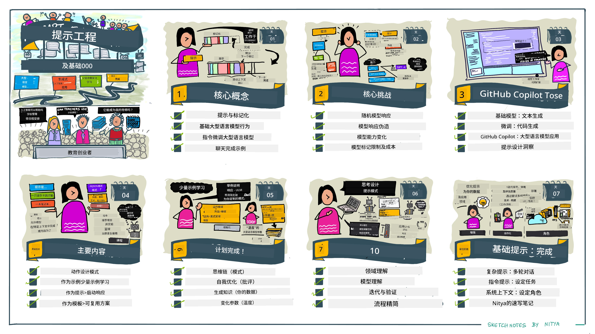
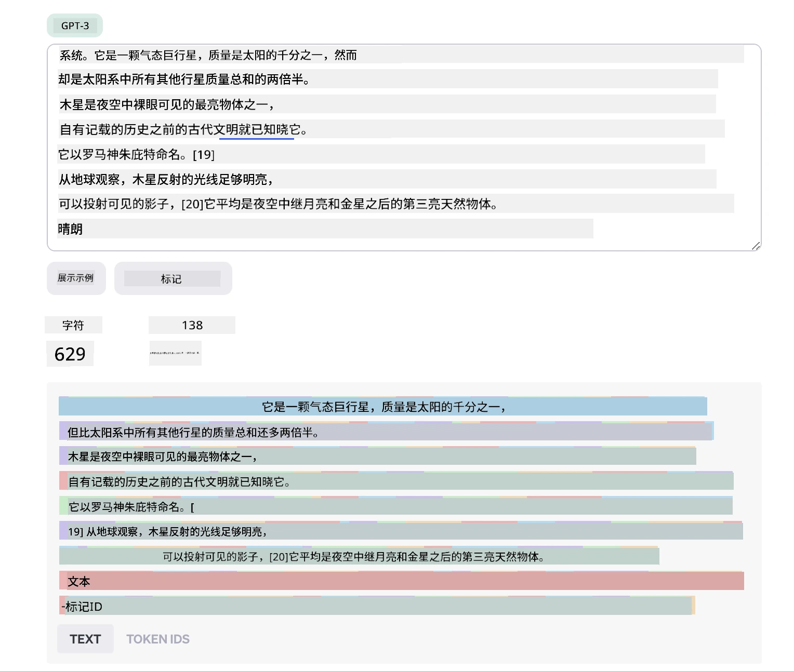
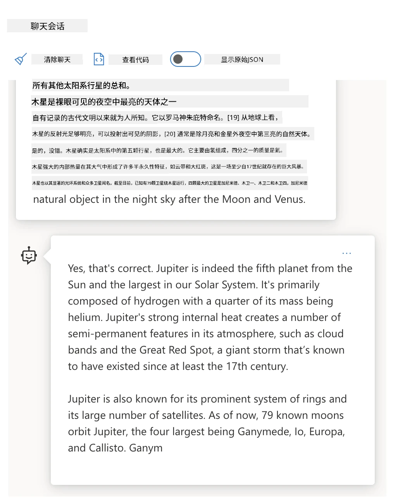
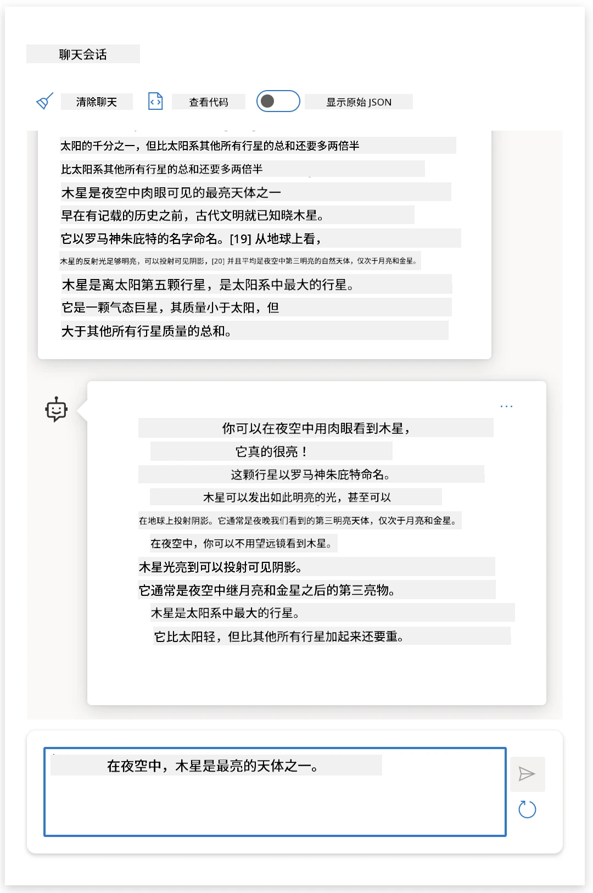
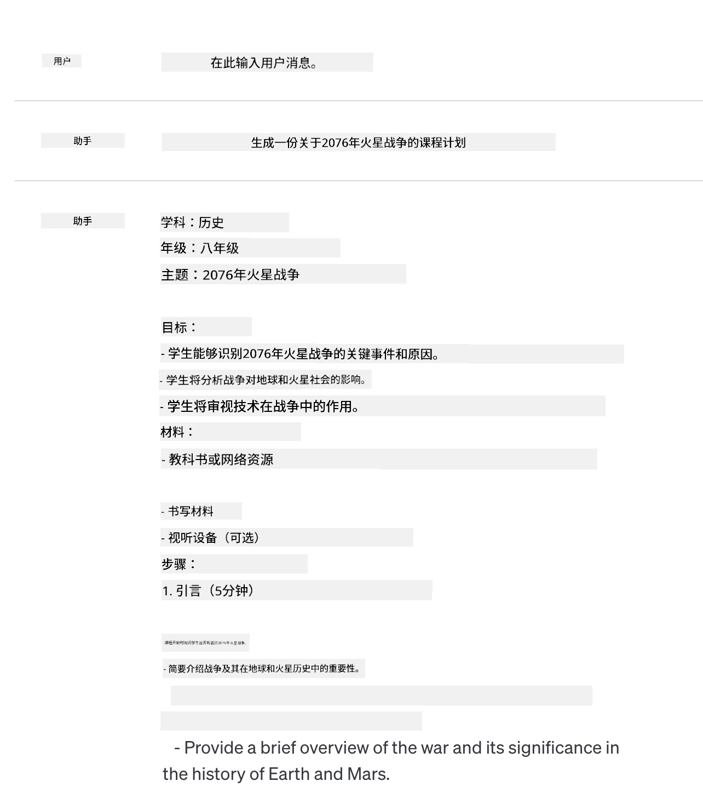
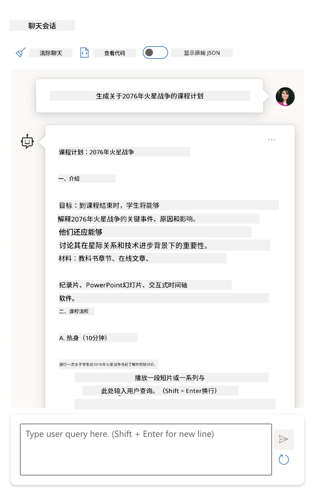
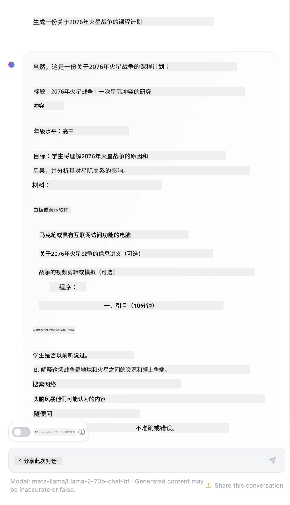

# 提示工程基础

[](https://youtu.be/GElCu2kUlRs?si=qrXsBvXnCW12epb8)

## 介绍
本模块涵盖了在生成式 AI 模型中创建有效提示的基本概念和技术。你向大型语言模型（LLM）编写的提示方式也很重要。精心设计的提示可以获得更高质量的响应。但诸如 _提示_ 和 _提示工程_ 这样的术语到底是什么意思？以及我如何改进发送到 LLM 的提示 _输入_？这些是我们将在本章及下一章中尝试回答的问题。

_生成式 AI_ 能够根据用户请求创建新内容（例如文本、图像、音频、代码等）。它通过类似 OpenAI GPT（“生成式预训练变换器”）系列的大型语言模型来实现，这些模型经过自然语言和代码的训练。

用户现在可以使用熟悉的范式（如聊天）与这些模型互动，无需任何技术专长或培训。这些模型是基于 _提示_ 的——用户发送文本输入（提示），并获得 AI 响应（补全）。用户随后可以通过多轮对话与 AI “聊天”，反复完善提示，直到响应符合他们的期望。

“提示” 现在成为生成式 AI 应用的主要 _编程接口_，告诉模型该做什么并影响返回响应的质量。“提示工程”是一个快速发展的研究领域，专注于提示的 _设计和优化_，以在规模上提供一致且高质量的响应。

## 学习目标

在本课中，我们将学习什么是提示工程、它为何重要，以及如何为给定模型和应用目标设计更有效的提示。我们将理解提示工程的核心概念和最佳实践——并学习一个交互式 Jupyter 笔记本“沙盒”环境，在那里我们可以看到这些概念如何应用于实际示例。

课程结束时，我们将能够：

1. 解释什么是提示工程以及它为何重要。
2. 描述提示的组成部分及其用法。
3. 学习提示工程的最佳实践和技术。
4. 运用所学技术在实际示例中，使用 OpenAI 端点。

## 关键词

提示工程：设计和完善输入以引导 AI 模型生成期望输出的实践。
分词(Tokenization)：将文本转换为模型可以理解和处理的更小单位（称为 tokens）的过程。
指令调优的 LLM：已通过特定指令进行微调，以提高响应准确性和相关性的大型语言模型（LLM）。

## 学习沙盒

提示工程目前更多是艺术而非科学。提升我们直觉的最佳方法是 _多练习_，采用结合应用领域专业知识、推荐技术和模型特定优化的试错方法。

本课附带的 Jupyter 笔记本提供了一个 _沙盒_ 环境，你可以随时尝试你学到的内容——无论是课中还是课后挑战。要执行练习，你需要：

1. **Azure OpenAI API 密钥**——已部署 LLM 的服务端点。
2. **Python 运行时**——用于运行笔记本。
3. <strong>本地环境变量</strong>——请先完成[设置](./../00-course-setup/02-setup-local.md?WT.mc_id=academic-105485-koreyst)步骤做好准备。

笔记本带有 _入门_ 练习——但鼓励你添加自己的 _Markdown_（描述）和 _代码_（提示请求）部分，尝试更多示例或想法，构建你的提示设计直觉。

## 插图指南

想在深入学习前了解本课涵盖的整体内容吗？看看这份插图指南，它展示了主要主题和每个主题的关键要点供你思考。课程路线图带你从理解核心概念和挑战，到用相关提示工程技术和最佳实践解决它们。请注意本指南中的“高级技术”部分，指的是本课程下一章内容。



## 我们的创业公司

现在，让我们谈谈 _这个主题_ 如何关联到我们的创业使命——[将 AI 创新带入教育](https://educationblog.microsoft.com/2023/06/collaborating-to-bring-ai-innovation-to-education?WT.mc_id=academic-105485-koreyst)。我们希望构建 AI 驱动的 _个性化学习_ 应用——所以让我们考虑应用的不同用户如何“设计”提示：

- <strong>管理员</strong> 可能会让 AI _分析课程数据以识别覆盖空白_。AI 可以总结结果或用代码进行可视化。
- <strong>教育工作者</strong> 可能会让 AI _为目标受众和主题生成课程计划_。AI 可以按照指定格式构建个性化计划。
- <strong>学生</strong> 可能会让 AI _辅导他们攻克难题_。AI 现在可以针对他们的水平提供定制的课程、提示和示例。

这只是冰山一角。看看 [教育提示库](https://github.com/microsoft/prompts-for-edu/tree/main?WT.mc_id=academic-105485-koreyst)——一个由教育专家策划的开源提示库——以获得更多可能性的广阔视野！_尝试在沙盒中或使用 OpenAI Playground 运行这些提示，看看效果如何！_

<!--
课程模板：
本单元应涵盖核心概念 #1。
通过示例和参考强化概念。

概念 #1：
提示工程。
定义并解释其必要性。
-->

## 什么是提示工程？

我们开始本课时将 <strong>提示工程</strong> 定义为设计和优化文本输入（提示）的过程，以实现给定应用目标和模型的稳定且高质量响应（补全）。我们可以将其视为两个步骤的过程：

- 为特定模型和目标 _设计_ 初始提示
- 反复 _完善_ 提示以提升响应质量

这必然是一个试错过程，需要用户直觉和努力以获得最佳结果。那么，为什么它很重要呢？为回答这个问题，我们首先需要理解三个概念：

- _分词_ = 模型如何“看待”提示
- _基础 LLM_ = 基础模型如何“处理”提示
- _指令调优 LLM_ = 模型如何“理解”任务

### 分词(Tokenization)

LLM 将提示视为 _token 序列_，不同模型（或模型的不同版本）可用不同方式对同一提示进行分词。由于 LLM 是基于 token（而非原始文本）训练，因此提示的分词方式直接影响生成响应的质量。

要了解分词的工作方式，可尝试下面展示的 [OpenAI Tokenizer](https://platform.openai.com/tokenizer?WT.mc_id=academic-105485-koreyst) 等工具。将你的提示复制进去，观察它是如何转换为 tokens 的，特别注意空白字符和标点符号的处理方式。注意，此示例显示的是较旧的 LLM（GPT-3）——使用更新模型测试可能会得到不同结果。



### 概念：基础模型

一旦提示被分词，基础 LLM（或基础模型）的主要功能是预测该序列中的下一个 token。由于 LLM 是基于大量文本数据集训练的，它们对 tokens 之间的统计关系有较好认知，能够较自信地做出预测。注意它们并不理解提示或 token 中单词的 _含义_；它们只看到一个可以通过下一次预测“补全”的模式。模型可以持续预测序列，直到用户干预或满足某种预设条件。

想看看基于提示的补全如何工作？在 [Microsoft Foundry playground](https://ai.azure.com?WT.mc_id=academic-105485-koreyst) 中输入上述提示，并使用默认设置。系统配置为将提示视为信息请求——因此你应该会看到满足该上下文的补全。

但如果用户想要查看满足某些标准或任务目标的特定内容呢？这时就是 _指令调优_ LLM 发挥作用的时候了。



### 概念：指令调优的 LLM

[指令调优 LLM](https://blog.gopenai.com/an-introduction-to-base-and-instruction-tuned-large-language-models-8de102c785a6?WT.mc_id=academic-105485-koreyst) 以基础模型为起点，通过示例或输入/输出对（例如多轮“消息”）进行微调，这些示例包含明确指令，AI 的响应尝试遵循这些指令。

这使用了人类反馈强化学习（RLHF）等技术，可以训练模型 _遵循指令_ 并 _从反馈中学习_，使其生成的响应更适合实际应用，更符合用户目标。

让我们试试——回到上述提示，但现在将 _系统消息_ 更改为提供以下指令作为上下文：

> _为二年级学生总结你提供的内容。结果保持为一段话，包含3-5个要点。_

看结果现在如何针对期望目标和格式调整？教育工作者可以直接在他们的课堂幻灯片中使用此响应。



## 为什么我们需要提示工程？

现在我们知道提示是如何被 LLM 处理的，来谈谈 _为什么_ 需要提示工程。原因在于当前 LLM 存在许多挑战，没有投入精力进行提示构建和优化，很难实现 _可靠且一致的补全_。例如：

1. **模型响应具有随机性。** 同一提示在不同模型或模型版本中可能产生不同响应。即使是在 _同一模型_ 上的不同时间，也可能产生不同结果。_提示工程技术可以帮助我们通过提供更好的保护措施来减少这些差异。_

1. **模型可能生成虚构内容。** 模型用 _庞大但有限_ 的数据集预训练，因此缺乏超出训练范围的概念知识，可能产生不准确、虚构或直接与事实矛盾的补全内容。_提示工程技术帮助用户识别并减轻这些虚构，例如要求 AI 提供引用或推理。_

1. **模型能力各异。** 新模型或新一代模型能力更强，但也带来独特的特性以及成本和复杂度上的权衡。_提示工程可以帮助我们制定最佳实践和工作流程，以抽象差异并无缝适应模型特定要求，实现可扩展性。_

让我们在 OpenAI 或 Azure OpenAI Playground 中看看这些现象：

- 使用相同提示与不同 LLM 部署（例如 OpenAI、Azure OpenAI、Hugging Face）交互——你注意到差异了吗？
- 用 _同一_ LLM 部署（例如 Azure OpenAI playground）多次使用相同提示——这些差异有什么不同？

### 虚构示例

在本课程中，我们用“<strong>虚构</strong>”一词来指代由于训练或其他限制，LLM 有时生成事实错误信息的现象。你可能也听过在流行文章或研究论文中称为 _“幻觉”_。不过我们强烈推荐使用 _“虚构”_ 这一术语，避免将机器产生的结果误认为具有人类般的行为特质。这也从术语角度符合[负责任 AI 指南](https://www.microsoft.com/ai/responsible-ai?WT.mc_id=academic-105485-koreyst)，去除了某些语境中可能被视为冒犯或不包容的词汇。

想了解虚构是如何产生的吗？想象一个提示要求 AI 为一个不存在的话题生成内容（确保该话题未包含在训练数据中）。例如——我尝试了这个提示：

> **提示:** 生成一份关于2076年火星战争的课程计划。

网络搜索显示，有关火星战争的虚构作品（例如电视剧或书籍）存在——但没有关于2076年的。常识也告诉我们2076年 _是未来_，因此不可能是已发生的真实事件。


那么，当我们用不同的 LLM 供应商运行这个提示时会发生什么？

> **回应 1**：OpenAI Playground (GPT-35)



> **回应 2**：Azure OpenAI Playground (GPT-35)



> **回应 3**：Hugging Face Chat Playground (LLama-2)



如预期，每个模型（或模型版本）由于随机行为和模型能力的差异产生了略有不同的响应。例如，一个模型针对的是八年级的观众，而另一个假设是高中生。但这三个模型都生成了能让不了解情况的用户相信事件真实发生的回应。

提示工程技术如 _元提示(metaprompting)_ 和 _温度设置_ 可能在一定程度上减少模型的虚构内容。新的提示工程 _架构_ 也将新的工具和技术无缝集成到提示流程中，以缓解或减少这些影响。

## 案例研究：GitHub Copilot

让我们通过一个案例研究来了解提示工程如何在现实世界解决方案中被使用，即 [GitHub Copilot](https://github.com/features/copilot?WT.mc_id=academic-105485-koreyst)。

GitHub Copilot 是你的“AI 配对程序员”——它将文本提示转换为代码补全，并集成在你的开发环境中（比如 Visual Studio Code），提供无缝的用户体验。如下面一系列博客所述，最早的版本基于 OpenAI Codex 模型，工程师很快意识到需要微调模型并开发更好的提示工程技术，以提高代码质量。今年七月，他们[推出了超越 Codex 的改进版 AI 模型](https://github.blog/2023-07-28-smarter-more-efficient-coding-github-copilot-goes-beyond-codex-with-improved-ai-model/?WT.mc_id=academic-105485-koreyst)，以获得更快的建议。

按顺序阅读这些文章，跟随他们的学习历程。

- **2023年5月** | [GitHub Copilot 在理解你的代码方面变得更好](https://github.blog/2023-05-17-how-github-copilot-is-getting-better-at-understanding-your-code/?WT.mc_id=academic-105485-koreyst)
- **2023年5月** | [GitHub 内部：与驱动 GitHub Copilot 的大型语言模型协作](https://github.blog/2023-05-17-inside-github-working-with-the-llms-behind-github-copilot/?WT.mc_id=academic-105485-koreyst)
- **2023年6月** | [如何为 GitHub Copilot 写出更好的提示](https://github.blog/2023-06-20-how-to-write-better-prompts-for-github-copilot/?WT.mc_id=academic-105485-koreyst)
- **2023年7月** | [.. GitHub Copilot 通过改进的 AI 模型超越 Codex](https://github.blog/2023-07-28-smarter-more-efficient-coding-github-copilot-goes-beyond-codex-with-improved-ai-model/?WT.mc_id=academic-105485-koreyst)
- **2023年7月** | [开发者的提示工程和大型语言模型指南](https://github.blog/2023-07-17-prompt-engineering-guide-generative-ai-llms/?WT.mc_id=academic-105485-koreyst)
- **2023年9月** | [如何构建企业级大型语言模型应用：GitHub Copilot 的经验教训](https://github.blog/2023-09-06-how-to-build-an-enterprise-llm-application-lessons-from-github-copilot/?WT.mc_id=academic-105485-koreyst)

你还可以浏览他们的 [工程博客](https://github.blog/category/engineering/?WT.mc_id=academic-105485-koreyst) 查看更多类似于[这篇](https://github.blog/2023-09-27-how-i-used-github-copilot-chat-to-build-a-reactjs-gallery-prototype/?WT.mc_id=academic-105485-koreyst)的文章，展示这些模型和技术如何被 _应用_ 驱动现实世界的应用。

---

<!--
LESSON TEMPLATE:
本单元应涵盖核心概念 #2。
通过示例和参考资料强化该概念。

CONCEPT #2:
提示设计。
通过示例进行说明。
-->

## 提示构建

我们已经明白了提示工程为什么重要——现在让我们了解提示是如何 _构建_ 的，这样我们就能评估不同技术，实现更有效的提示设计。

### 基础提示

先从基础提示开始：向模型发送无上下文的文本输入。这里是一个例子——当我们向 OpenAI [Completion API](https://platform.openai.com/docs/api-reference/completions?WT.mc_id=academic-105485-koreyst) 发送美国国歌开头的几个单词时，它立刻用接下来的几句歌词 _完成_ 了响应，展示了基础预测行为。

| 提示（输入）            | 补全（输出）                                                                                                                           |
| :--------------------- | :------------------------------------------------------------------------------------------------------------------------------------ |
| Oh say can you see      | 听起来你正在开始唱《星条旗永不落》，美国的国歌。这首歌的完整歌词是...                                                                         |

### 复杂提示

现在让我们向基础提示添加上下文和指令。[Chat Completion API](https://learn.microsoft.com/azure/ai-foundry/openai/how-to/chatgpt?WT.mc_id=academic-105485-koreyst) 让我们用一组 _消息_ 来构建复杂提示，其中包括：

- 体现 _用户_ 输入和 _助手_ 响应的输入/输出对。
- 设定助手行为或个性的系统消息。

请求现在以如下形式出现，其中 _分词(tokenization)_ 有效地捕捉了来自上下文和对话的相关信息。更改系统上下文对补全质量的影响，可以和提供的用户输入一样显著。

```python
response = client.responses.create(
    model="gpt-5-mini",
    input=[
        {"role": "system", "content": "You are a helpful assistant."},
        {"role": "user", "content": "Who won the world series in 2020?"},
        {"role": "assistant", "content": "The Los Angeles Dodgers won the World Series in 2020."},
        {"role": "user", "content": "Where was it played?"}
    ]
)
```

### 指令提示

上例中，用户提示是简单的文本查询，可以理解为请求信息。使用 _指令_ 提示时，我们可以用文本更详细地指定任务，给 AI 以更好的指导。示例如下：

| 提示（输入）                                                                                                                                                                                                                         | 补全（输出）                                                                                                         | 指令类型           |
| :------------------------------------------------------------------------------------------------------------------------------------------------------------------------------------------------------------------------------------- | :-------------------------------------------------------------------------------------------------------------------- | :----------------- |
| 写一段关于内战的描述                                                                                                                                                                                                                 | _返回一个简单段落_                                                                                                   | 简单               |
| 写一段关于内战的描述。提供关键日期和事件，描述它们的重要性                                                                                                                                                                       | _返回一段文字，后跟带描述的关键事件日期列表_                                                                         | 复杂               |
| 用一段话描述内战。提供3条带关键日期及意义的要点。再提供3条关于重要历史人物及贡献的要点。将结果以JSON文件格式返回                                                                                                                   | _返回更详尽内容的文本框，格式为 JSON，可复制粘贴到文件并根据需要验证_                                               | 复杂。格式化。      |

## 主要内容

上面的例子中，提示仍然相当开放，允许 LLM 决定其预训练数据集的相关部分。使用 _主要内容_ 设计模式时，输入文本分为两部分：

- 一条指令（动作）
- 相关内容（影响动作）

这里有一个例子，指令是“用两句话总结这个”。

| 提示（输入）                                                                                                                                                                                                                                                                                                                                                                                                                                                                                                                                                                                                                                                                                      | 补全（输出）                                                                                                                                                                                                                                                                             |
| :-------------------------------------------------------------------------------------------------------------------------------------------------------------------------------------------------------------------------------------------------------------------------------------------------------------------------------------------------------------------------------------------------------------------------------------------------------------------------------------------------------------------------------------------------------------------------------------------------------------------------------------------------------------------------------------------------- | :---------------------------------------------------------------------------------------------------------------------------------------------------------------------------------------------------------------------------------------------------------------------------------------------- |
| 木星是太阳系中绕太阳运行的第五颗行星，也是最大的行星。它是一个气态巨行星，质量约为太阳的千分之一，但却是太阳系中所有其他行星质量总和的两倍半。木星是夜空中用肉眼可见的最亮天体之一，自有记录的历史之前已经为古代文明所知。它以罗马神朱庇特命名。[19] 从地球观察，木星反射的光足够强烈能够投下可见的阴影，[20] 平均来说它是夜空中仅次于月亮和金星的第三亮天然天体。 <br/> <strong>用两句话简短总结这个</strong> | 木星是太阳系中绕太阳运行的第五颗行星，也是最大的行星，以其夜空中最明亮的天体之一而闻名。它以罗马神朱庇特命名，是一个气态巨行星，其质量是太阳系中所有其他行星质量总和的两倍半。                       |

主要内容部分可用于多种方式来推动更有效的指令：

- <strong>示例</strong> - 与其告诉模型明确指令，不如给它示例让它推断模式。
- <strong>提示</strong> - 在指令后面跟一个“提示”，为补全设定基调，指导模型生成更相关的回应。
- <strong>模板</strong> - 这是一种可重复使用的提示“配方”，带有可自定义为特定用例变量的数据占位符。

让我们看看实际操作。

### 使用示例

这是一种用主要内容“喂给模型”一些期望输出的示例，以供其推断期望输出模式的方法。根据示例数量不同，我们称为零样本提示(one-shot)、单样本提示(one-shot)、少样本提示(few-shot)等。

提示现在由三部分组成：

- 任务描述
- 期望输出的几个示例
- 一个新示例的开始（成为隐含的任务描述）

| 学习类型        | 提示（输入）                                                                                                     | 补全（输出）           |
| :-------------- | :------------------------------------------------------------------------------------------------------------- | :---------------------- |
| 零样本(zero-shot) | "The Sun is Shining". 翻译成西班牙语                                                                              | "El Sol está brillando". |
| 单样本(one-shot)  | "The Sun is Shining" => ""El Sol está brillando". <br> "It's a Cold and Windy Day" =>                             | "Es un día frío y ventoso". |
| 少样本(few-shot)  | The player ran the bases => Baseball <br/> The player hit an ace => Tennis <br/> The player hit a six => Cricket <br/> The player made a slam-dunk => | 篮球                    |
|                 |                                                                                                               |                        |

注意我们在零样本提示中必须给出明确指令（“翻译成西班牙语”），但在单样本示例中这条指令被隐含推断出了。少样本示例则展示了增加示例数量如何使模型进行更准确的推断，而无需额外指令。

### 提示线索

另一种使用主要内容的技术是提供 _提示线索_ 而非示例。这里我们通过 _起始_ 一段反映期望响应格式的片段，给模型一个暗示。模型随后“接线索”继续以相同风格响应。

| 线索数量        | 提示（输入）                                                                                                                                                                                                                                                                                                                                                                                                                                               | 补全（输出）                                                                                                                                                                                                                                                                                       |
| :------------- | :----------------------------------------------------------------------------------------------------------------------------------------------------------------------------------------------------------------------------------------------------------------------------------------------------------------------------------------------------------------------------------------------------------------------------------------------------------- | :-------------------------------------------------------------------------------------------------------------------------------------------------------------------------------------------------------------------------------------------------------------------------------------------------------- |
| 0              | 木星是太阳系中绕太阳运行的第五颗行星，也是最大的行星。它是一个气态巨行星，质量约为太阳的千分之一，但却是太阳系中所有其他行星质量总和的两倍半。木星是夜空中用肉眼可见的最亮天体之一，自有记录的历史之前已经为古代文明所知。 <br/><strong>简短总结</strong>                                       | 木星是太阳系中最大的行星，也是第五颗绕太阳运行的行星。它是一个质量为太阳千分之一的气态巨行星，但它比其他所有行星加起来还要重。古代文明很早就知道木星，并且它在夜空中很容易看见。                                                   |
| 1              | 木星是太阳系中绕太阳运行的第五颗行星，也是最大的行星。它是一个气态巨行星，质量约为太阳的千分之一，但却是太阳系中所有其他行星质量总和的两倍半。木星是夜空中用肉眼可见的最亮天体之一，自有记录的历史之前已经为古代文明所知。 <br/><strong>简短总结</strong> <br/> 我们知道木星                                                    | 是绕太阳运行的第五颗行星，也是太阳系中最大的行星。它是一个气态巨行星，质量约为太阳的千分之一，但却是其他所有行星质量总和的两倍半。它肉眼可见，自古代以来就被人类所知。                                                                                     |

| 2              | 木星是距离太阳的第五颗行星，也是太阳系中最大的行星。它是一颗气体巨星，质量约为太阳的千分之一，但却是太阳系中所有其他行星质量总和的两倍半。木星是夜空中肉眼可见的最亮天体之一，自有记录的历史之前就已为古代文明所知。 <br/><strong>总结</strong> <br/> 我们学到的三大事实：         | 1. 木星是距离太阳的第五颗行星，也是太阳系中最大的行星。<br/> 2. 它是一颗质量约为太阳千分之一的气体巨星...<br/> 3. 木星自古代以来就可以用肉眼看到 ...                                                                       |
|                |                                                                                                                                                                                                                                                                                                                                                                                                                                                              |                                                                                                                                                                                                                                                                                                           |

### 提示模板

提示模板是一个 _预定义的提示配方_ ，可以存储并根据需要重复使用，以实现更大规模的一致用户体验。最简单的形式，就是像[OpenAI的这个示例](https://cookbook.openai.com/examples/gpt4-1_prompting_guide?WT.mc_id=academic-105485-koreyst)那样，收集提示示例，既提供交互式的提示组件（用户和系统消息），又提供基于API的请求格式——以支持重复使用。

在更复杂的形式中，比如[LangChain的这个示例](https://python.langchain.com/docs/concepts/prompt_templates/?WT.mc_id=academic-105485-koreyst)，它包含了可以用各种来源数据（用户输入、系统上下文、外部数据源等）替换的_占位符_，以动态生成提示。这使我们能够创建一个可重用的提示库，从而通过<strong>编程方式</strong>推动持续一致的用户体验。

最后，模板的真正价值在于能够创建和发布面向垂直应用领域的_提示库_ —— 其中提示模板已被_优化_以反映特定应用的上下文或示例，使响应对目标用户更相关、更准确。[Prompts For Edu](https://github.com/microsoft/prompts-for-edu?WT.mc_id=academic-105485-koreyst)仓库是这种方法的绝佳示例，它策划了专注于教育领域的提示库，强调诸如课程规划、课程设计、学生辅导等关键目标。

## 辅助内容

如果我们把提示构造看作有一个指令（任务）和目标（主要内容），那么_次要内容_就像是我们提供的额外上下文，用来<strong>以某种方式影响输出</strong>。这可以是调整参数、格式说明、主题分类等，有助于模型_定制_其响应以符合期望的用户目标或需求。

例如：考虑一个课程目录，包含所有课程的丰富元数据（名称、描述、级别、元数据标签、讲师等）：

- 我们可以定义一个指令“总结2023年秋季的课程目录”
- 用主要内容提供几条期望输出的示例
- 用次要内容确定最受关注的5个“标签”

现在，模型可以按照示例格式提供总结——但如果某结果有多个标签，可以优先考虑次要内容中确定的5个标签。

---

<!--
课程模板：
本单元应涵盖核心概念#1。
通过示例和参考加强该概念。

概念#3：
提示工程技术。
有哪些基本的提示工程技术？
用一些练习举例说明。
-->

## 提示最佳实践

既然我们知道了如何_构造_提示，就可以开始思考如何_设计_它们以体现最佳实践。可以从两方面考虑：拥有正确的_思维方式_和应用合适的_技巧_。

### 提示工程思维方式

提示工程是一个反复试验的过程，记住以下三点指导原则：

1. **领域理解很重要。** 响应的准确性和相关性取决于应用或用户所处的_领域_。运用你的直觉和领域专业知识来<strong>进一步定制技巧</strong>。例如，在系统提示中定义_领域特定个性_，或在用户提示中使用_领域特定模板_。提供反映领域上下文的次要内容，或用_领域特定提示和示例_引导模型走向熟悉的使用模式。

2. **模型理解很重要。** 我们知道模型本质上是概率性的，但模型实现也可能因训练数据集（预训练知识）、提供的功能（如API或SDK）以及优化的内容类型（如代码、图像、文本）而异。了解你使用的模型的优势和限制，利用这些知识_优先安排任务_或构建_优化模型能力的自定义模板_。

3. **迭代与验证很重要。** 模型和提示工程技术都在快速发展，作为领域专家，你可能对_自己的_特定应用有额外的上下文或标准，不一定适用于更广泛的社区。利用提示工程的工具与技术“快速启动”提示构造，再用你的直觉和领域专业知识不断迭代和验证结果。记录你获得的洞见，并创建一个<strong>知识库</strong>（如提示库），供他人作为新基线，实现更快的未来迭代。

## 最佳实践

现在让我们看看[OpenAI](https://help.openai.com/en/articles/6654000-best-practices-for-prompt-engineering-with-openai-api?WT.mc_id=academic-105485-koreyst)和[Azure OpenAI](https://learn.microsoft.com/azure/ai-foundry/openai/concepts/prompt-engineering#best-practices?WT.mc_id=academic-105485-koreyst)从业者推荐的一些常见最佳实践。

| 事项                              | 原因                                                                                                                                                                                                                                               |
| :-------------------------------- | :------------------------------------------------------------------------------------------------------------------------------------------------------------------------------------------------------------------------------------------------ |
| 评估最新模型                       | 新一代模型可能拥有更优功能和质量，但成本可能更高。评估其影响后再决定是否迁移。                                                                                                                                                                   |
| 分离指令与上下文                   | 检查你的模型/供应商是否定义了_分隔符_，用以更清晰地区分指令、主要和次要内容，帮助模型更准确地为令牌分配权重。                                                                                                                               |
| 坚持具体且清晰                     | 提供更多关于期望的上下文、结果、长度、格式、风格等细节，会提升响应质量和一致性。在可复用模板中捕获这些配方。                                                                                                                               |
| 详细描述，使用示例                 | 模型可能对“边演示边说明”反应更好。先用“零样本”（无示例）指令开始，再用“少样本”示例来微调，给出期望输出的几个例子。也可以用类比。                                                                                                              |
| 用提示语启发完成                   | 通过给出一些开头词或短语，推动模型生成期望的结果，作为响应的起点。                                                                                                                                                                           |
| 加倍强调                         | 有时需要重复指令，比如在主要内容前后都给出指令，或者同时用指令和提示语等。通过迭代和验证看看哪种方法有效。                                                                                                                                     |
| 顺序重要                         | 呈现给模型信息的顺序可能影响输出结果，即使在学习示例中也因近因效应有影响。尝试不同顺序，找出最佳效果。                                                                                                                                         |
| 给模型“退路”                     | 给模型一个_回退_响应，以便在无法完成任务时提供，减少生成错误或虚构回答的概率。                                                                                                                                                                   |
|                                   |                                                                                                                                                                                                                                                   |

和任何最佳实践一样，记住_你的实际情况可能有所不同_，这取决于模型、任务和领域。把这些作为起点，不断迭代，找到最适合你的方法。随着新模型和工具出现，持续重新评估你的提示工程流程，重点关注流程的可扩展性和响应质量。

<!--
课程模板：
本单元如果适用，应提供编程挑战。

挑战：
链接到一个Jupyter Notebook，指令中只有代码注释（代码部分为空）。

解决方案：
链接到该Notebook的副本，其中填写了提示并运行，展示一个可能的示例。
-->

## 任务

恭喜你完成了本课！现在是通过真实示例检验所学概念和技术的时刻了！

我们将使用一个Jupyter Notebook完成互动练习。你也可以在Notebook中添加自己的Markdown和代码单元，以探索更多想法和技术。

### 开始之前，请先fork本仓库，然后

- （推荐）启动GitHub Codespaces
- （或者）克隆仓库到本地设备，并使用Docker Desktop运行
- （或者）用你喜欢的Notebook运行环境打开该Notebook

### 然后，配置环境变量

- 复制仓库根目录下的`.env.copy`文件为`.env`，并填写`AZURE_OPENAI_API_KEY`、`AZURE_OPENAI_ENDPOINT`和`AZURE_OPENAI_DEPLOYMENT`值。详情见[学习沙盒部分](#学习沙盒)。

### 接着，打开Jupyter Notebook

- 选择运行时内核。如果使用方案一或二，只需选择开发容器提供的默认Python 3.10.x内核即可。

现在你可以开始运行练习了。注意这里没有_绝对对错_的答案，只是在试错中探索选项，建立对特定模型和应用领域的直觉。

_因此本课中没有代码解答单元，Notebook中会有标题为“我的解决方案：”的Markdown单元，展示一个示例输出供参考。_

 <!--
课程模板：
用总结和资源包围该部分，支持自主学习。
-->

## 知识检测

以下哪条是遵循合理最佳实践的好提示？

1. 给我看一张红色汽车的图片
2. 给我看一张红色沃尔沃XC90汽车停靠悬崖边，日落时分的图片
3. 给我看一张红色沃尔沃XC90汽车的图片

答案：2，它是最好的提示，因为它提供了“什么”的细节，描述具体品牌和型号，还描绘了整体场景。3次之，因为它也包含了很多描述信息。

## 🚀 挑战

试试看能否利用“提示语”技术继续完成句子：“给我看一张红色沃尔沃汽车的图片，品牌是...”。它会如何回复？你会怎么改进？

## 干得不错！继续学习

想了解更多提示工程的相关概念？请访问[后续学习页面](https://aka.ms/genai-collection?WT.mc_id=academic-105485-koreyst)获取更多精彩资源。

接下来请移步第5课，了解[高级提示技巧](../05-advanced-prompts/README.md?WT.mc_id=academic-105485-koreyst)！

---

<!-- CO-OP TRANSLATOR DISCLAIMER START -->
**免责声明**：
本文件由 AI 翻译服务 [Co-op Translator](https://github.com/Azure/co-op-translator) 翻译完成。尽管我们力求准确，但请注意，自动翻译可能包含错误或不准确之处。原始语言版文件应视为权威来源。对于重要信息，建议使用专业人工翻译。我们对因使用本翻译而产生的任何误解或误释不承担责任。
<!-- CO-OP TRANSLATOR DISCLAIMER END -->