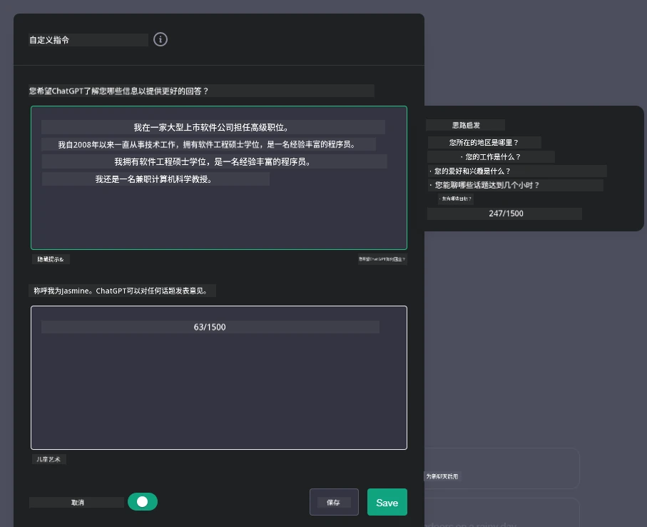
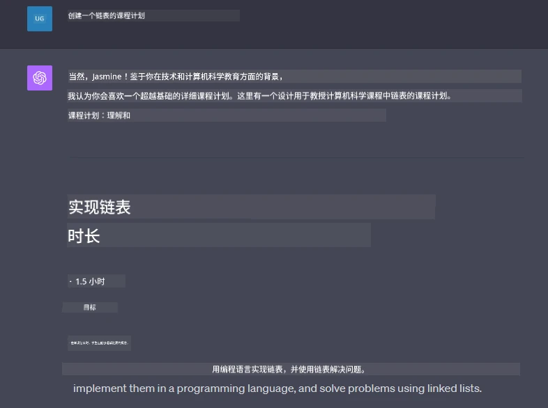

# 构建生成式 AI 驱动的聊天应用

[](https://youtu.be/R9V0ZY1BEQo?si=IHuU-fS9YWT8s4sA)

> _(点击上方图片查看本课视频)_

现在我们已经了解了如何构建文本生成应用，让我们来看看聊天应用。

聊天应用已经融入我们的日常生活，提供的不仅仅是休闲对话的手段。它们是客户服务、技术支持甚至复杂咨询系统的核心部分。你很可能不久前刚通过聊天应用获得过帮助。随着我们将生成式 AI 等更先进技术整合进这些平台，复杂度和挑战也随之增加。

我们需要回答的一些问题包括：

- <strong>构建应用</strong>。如何高效构建并无缝集成这些 AI 驱动的应用以实现特定用例？
- <strong>监控</strong>。应用部署后，如何监控并确保其在功能和遵守[负责任 AI 六大原则](https://www.microsoft.com/ai/responsible-ai?WT.mc_id=academic-105485-koreyst)方面都保持最高质量？

随着我们进入一个由自动化和无缝人机交互定义的时代，理解生成式 AI 如何变革聊天应用的范围、深度和适应性变得至关重要。本课将探讨支持这些复杂系统的架构方面，深入研究针对特定领域任务的微调方法，并评估确保负责任 AI 部署的指标与考量。

## 介绍

本课涵盖内容：

- 高效构建与集成聊天应用的技术。
- 如何对应用进行定制和微调。
- 有效监控聊天应用的策略和考量。

## 学习目标

完成本课后，你将能够：

- 描述在构建与集成聊天应用入现有系统时的注意事项。
- 针对特定用例定制聊天应用。
- 确定关键指标和考量，有效监控并维护 AI 驱动聊天应用的质量。
- 确保聊天应用负责任地利用 AI。

## 将生成式 AI 集成到聊天应用中

利用生成式 AI 提升聊天应用，不仅仅是让它们更智能；还包括优化其架构、性能和用户界面，以提供优质的用户体验。这涉及架构基础、API 集成及用户界面方面的考量。本节旨在为你提供一条全面的路线图，帮助你驾驭这些复杂领域，无论是将聊天应用接入现有系统，还是打造独立平台。

完成本节后，你将具备高效构建和整合聊天应用所需的专业知识。

### 聊天机器人还是聊天应用？

在深入构建聊天应用之前，让我们比较一下“聊天机器人”和“AI 驱动的聊天应用”，它们分别承担不同的角色和功能。聊天机器人的主要目的是自动执行特定对话任务，如回答常见问题或追踪包裹。它通常基于规则逻辑或复杂 AI 算法。相比之下，AI 驱动的聊天应用是一个更广泛的环境，设计用于促进各种数字通信形式，如人与人之间的文本、语音和视频聊天。其显著特点是整合了生成式 AI 模型，模拟细腻的人类对话，根据多种输入和上下文线索生成回应。生成式 AI 驱动的聊天应用能进行开放领域的讨论，适应不断变化的对话上下文，甚至产出创造性或复杂的对话。

下表列出了关键差异和相似点，帮助我们理解它们在数字通信中的独特作用。

| 聊天机器人                               | 生成式 AI 驱动的聊天应用                       |
| --------------------------------------- | ---------------------------------------------- |
| 以任务为中心且基于规则                   | 具备上下文感知能力                              |
| 通常集成于更大系统中                     | 可能包含一个或多个聊天机器人                    |
| 功能受限于预设程序                       | 包含生成式 AI 模型                              |
| 专业化且结构化的交互                     | 支持开放领域讨论                                |

### 利用 SDK 和 API 的预构建功能

构建聊天应用时，一个很好的第一步是评估已有资源。使用 SDK 和 API 构建聊天应用是一种有利策略，原因多种多样。通过集成文档完善的 SDK 和 API，你可以为应用的长期成功奠定坚实基础，解决可扩展性和维护难题。

- **加快开发过程，减少负担**：依赖预构建功能而非自己从头构建，能让你专注于应用中你更看重的其他方面，如业务逻辑。
- <strong>更佳性能</strong>：从零开始构建功能时，你终将面对“它如何扩展？该应用能否应对用户激增？”等问题。维护良好的 SDK 和 API 通常内置解决方案来应对这些问题。
- <strong>更易维护</strong>：大多数 API 和 SDK 只需更新库文件即可完成版本升级，更新与改进更易于管理。
- <strong>获得尖端技术</strong>：利用经过微调和大量数据训练的模型，为你的应用提供自然语言处理能力。

访问 SDK 或 API 功能通常需获得使用权限，通常通过唯一密钥或认证令牌来实现。我们将使用 OpenAI Python 库演示这一过程。你也可以在以下[OpenAI笔记本](./python/oai-assignment.ipynb?WT.mc_id=academic-105485-koreyst)或[Azure OpenAI 服务笔记本](./python/aoai-assignment.ipynb?WT.mc_id=academic-105485-koreys)中自行尝试本课内容。

```python
import os
from openai import OpenAI

API_KEY = os.getenv("OPENAI_API_KEY","")

client = OpenAI(
    api_key=API_KEY
    )

response = client.responses.create(model="gpt-5-mini", input="Suggest two titles for an instructional lesson on chat applications for generative AI.", store=False)
print(response.output_text)
```

上例使用 GPT-5 mini 模型和 Responses API 来完成提示，但请注意，API 密钥是在调用之前设置的。如果未设置密钥，会收到错误信息。

## 用户体验（UX）

通用的 UX 原则适用于聊天应用，但由于涉及机器学习组件，以下额外考量尤为重要。

- <strong>解决歧义的机制</strong>：生成式 AI 模型偶尔会产生含糊的回答。若用户遇到该问题，允许他们请求澄清的功能会很有帮助。
- <strong>上下文保留</strong>：先进的生成式 AI 模型能够在对话中记忆上下文，这对用户体验至关重要。赋予用户控制和管理上下文的能力能提升体验，但也带来保留敏感用户信息的风险。可通过引入保留策略等方式平衡上下文需求和隐私保护。
- <strong>个性化</strong>：AI 模型具备学习和适应能力，为用户提供个性化体验。通过用户档案等功能定制体验，不仅让用户感受到被理解，还助力其高效找到特定答案，提升交互满意度。

OpenAI ChatGPT 的“自定义指令”设置即为个性化示例。它允许你提供关于自己的信息，为提示提供重要上下文。以下是自定义指令的示例。



该“档案”提示 ChatGPT 制作关于链表的课程计划。请注意，ChatGPT 考虑到用户可能希望根据其经验获得更深入的课程内容。



### 微软的大型语言模型系统消息框架

[微软提供了指导](https://learn.microsoft.com/azure/ai-foundry/openai/concepts/system-message#define-the-models-output-format?WT.mc_id=academic-105485-koreyst)，用于撰写有效的系统消息以生成 LLM 响应，分为四个方面：

1. 定义模型的对象及其能力和局限。
2. 定义模型的输出格式。
3. 提供展示模型预期行为的具体示例。
4. 提供额外的行为护栏。

### 可访问性

无论用户是否有视觉、听觉、运动或认知障碍，一个设计良好的聊天应用都应对所有用户友好。以下列表细分了针对各种用户障碍的增强可访问性功能。

- <strong>视觉障碍功能</strong>：高对比度主题和可调整大小的文本，兼容屏幕阅读器。
- <strong>听觉障碍功能</strong>：文本转语音和语音转文本功能，音频通知的视觉提示。
- <strong>运动障碍功能</strong>：支持键盘导航，语音命令。
- <strong>认知障碍功能</strong>：简化语言选项。

## 针对特定领域语言模型的定制和微调

想象一个能理解贵公司术语并预测用户群常见问题的聊天应用。这里有几种值得提及的方法：

- **利用 DSL 模型**。DSL 代表领域专用语言。你可以利用经过特定领域训练的 DSL 模型，以理解其概念和场景。
- <strong>应用微调</strong>。微调是用特定数据对模型进行进一步训练的过程。

## 定制：使用 DSL

利用领域专用语言模型（DSL 模型）可以通过提供专业化、上下文相关的交互提升用户参与度。该模型针对特定领域、行业或主题进行训练或微调，用以理解生成相关文本。使用 DSL 模型的选项包括从头训练、通过 SDK 和 API 使用现成模型，或微调现有预训练模型以适应特定领域。

## 定制：应用微调

当预训练模型在专门领域或特定任务表现不足时，通常会考虑微调。

例如，医学问题复杂且需要大量上下文。医疗专业人员在诊断患者时基于多种因素，如生活方式、既往病史，甚至依赖最新医学文献验证诊断。在此类细微场景中，通用 AI 聊天应用无法成为可靠来源。

### 场景：医疗应用

考虑一款旨在帮助医务人员快速查询治疗指南、药物相互作用或最新研究成果的聊天应用。

通用模型可能适合回答基础医疗问题或提供一般建议，但可能难以应对：

- <strong>高度特定或复杂案例</strong>。例如，一位神经科医生可能会询问：“目前儿童药物难治性癫痫的最佳管理实践是什么？”
- <strong>缺乏最新进展</strong>。通用模型可能无法给出包含神经学和药理学最新进展的回答。

在此类情况下，用专门医学数据集微调模型可显著提升其准确可靠处理复杂医疗查询的能力。这需要访问涵盖领域特定挑战和问题的大型相关数据集。

## 高质量 AI 驱动聊天体验的考量

本节概述“高质量”聊天应用的标准，包括捕获可操作指标及遵循负责任利用 AI 技术的框架。

### 关键指标

为保持应用的高质量性能，必须跟踪关键指标和考量。这些度量不仅保证应用功能，还评估 AI 模型质量与用户体验。以下列举了基础指标、AI 指标及用户体验指标以供参考。

| 指标                          | 定义                                                                                                             | 聊天应用开发者的考量                                                   |
| ----------------------------- | ---------------------------------------------------------------------------------------------------------------- | ----------------------------------------------------------------------- |
| <strong>正常运行时间</strong>              | 衡量应用可供用户使用的时间长度。                                                                                 | 你将如何最大限度减少停机时间？                                         |
| <strong>响应时间</strong>                  | 应用回复用户查询所需的时间。                                                                                       | 你将如何优化查询处理以提升响应速度？                                   |
| <strong>精确度</strong>                    | 真阳性预测数量与所有阳性预测数量之比。                                                                             | 你将如何验证模型的精确度？                                             |
| **召回率（灵敏度）**          | 真阳性预测数量与实际阳性数量之比。                                                                                 | 你将如何衡量和提升召回率？                                             |
| **F1 分数**                   | 精确率和召回率的调和平均数，平衡两者的权衡。                                                                       | 你的目标 F1 分数是多少？你如何平衡精确度和召回率？                     |
| <strong>困惑度</strong>                   | 衡量模型预测的概率分布与数据实际分布的匹配程度。                                                                     | 你将如何最小化困惑度？                                                 |
| <strong>用户满意度指标</strong>            | 衡量用户对应用的感知，通常通过调查收集。                                                                           | 你多久收集一次用户反馈？你如何根据反馈进行调整？                       |
| <strong>错误率</strong>                    | 模型在理解或输出方面出错的频率。                                                                                   | 你有哪些策略来降低错误率？                                             |
| <strong>再训练周期</strong>                | 模型更新以加入新数据和见解的频率。                                                                                 | 你多久会再训练一次模型？什么触发再训练周期？                           |

| <strong>异常检测</strong>               | 用于识别不符合预期行为的异常模式的工具和技术。                                        | 你将如何应对异常？                                                        |

### 在聊天应用中实施负责任的 AI 实践

微软负责任 AI 的方法确定了六项原则，应指导 AI 的开发和使用。以下是这些原则、定义以及聊天开发者应考虑的事项和为何应认真对待它们。

| 原则                   | 微软的定义                                              | 聊天开发者应考虑的事项                                                | 重要原因                                                                                 |
| ---------------------- | ----------------------------------------------------- | -------------------------------------------------------------------- | --------------------------------------------------------------------------------------- |
| 公平                   | AI 系统应公平对待所有人。                               | 确保聊天应用不会基于用户数据进行歧视。                                | 建立用户信任和包容性；避免法律风险。                                                    |
| 可靠性和安全           | AI 系统应表现得可靠且安全。                             | 实施测试和故障保护以尽量减少错误和风险。                              | 确保用户满意度并防止潜在危害。                                                           |
| 隐私和安全             | AI 系统应安全且尊重隐私。                               | 实施强加密和数据保护措施。                                           | 保护敏感的用户数据并遵守隐私法规。                                                      |
| 包容性                 | AI 系统应赋能每个人并吸引所有人参与。                    | 设计对多样化用户友好且易用的 UI/UX。                                 | 确保更多的人能够有效使用该应用。                                                        |
| 透明度                 | AI 系统应易于理解。                                     | 提供 AI 回应的清晰文档和推理说明。                                   | 用户更可能信任可理解决策过程的系统。                                                  |
| 问责制                 | 人们应对 AI 系统负责。                                 | 建立明确的审核和改进 AI 决策的流程。                                | 促进持续改进和在出现错误时采取纠正措施。                                               |

## 任务

请参见 [assignment](../../../07-building-chat-applications/python)。它将带你完成一系列练习，从运行第一个聊天提示，到分类和总结文本等。注意，作业提供多种编程语言版本！

## 干得好！继续前进

完成本课程后，查看我们的 [生成式 AI 学习合集](https://aka.ms/genai-collection?WT.mc_id=academic-105485-koreyst)，继续提升你的生成式 AI 知识！

前往第 8 课，了解如何开始[构建搜索应用](../08-building-search-applications/README.md?WT.mc_id=academic-105485-koreyst)！

---

<!-- CO-OP TRANSLATOR DISCLAIMER START -->
**免责声明**：
本文件由 AI 翻译服务 [Co-op Translator](https://github.com/Azure/co-op-translator) 翻译完成。尽管我们力求准确，但请注意，自动翻译可能包含错误或不准确之处。原始语言版文件应视为权威来源。对于重要信息，建议使用专业人工翻译。我们对因使用本翻译而产生的任何误解或误释不承担责任。
<!-- CO-OP TRANSLATOR DISCLAIMER END -->