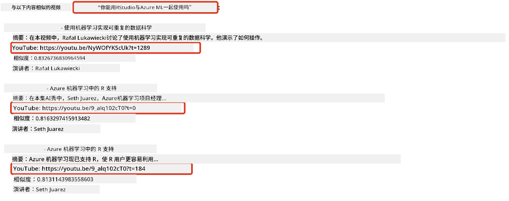
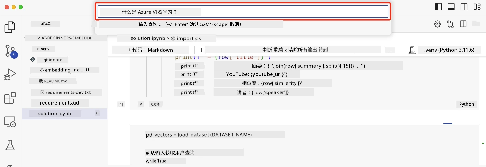

# 构建搜索应用程序

[](https://youtu.be/W0-nzXjOjr0?si=GcsqiTTvd7RKbo7V)

> > _点击上方图片观看本课视频_

大型语言模型不仅仅是聊天机器人和文本生成。我们还可以使用嵌入向量构建搜索应用程序。嵌入是数据的数值表示，也称为向量，可用于对数据进行语义搜索。

在本课中，您将为我们的教育创业公司构建一个搜索应用程序。我们的创业公司是一个非盈利组织，向发展中国家的学生免费提供教育。我们的创业公司拥有大量的YouTube视频，供学生学习人工智能。创业公司希望构建一个搜索应用程序，让学生通过输入问题搜索YouTube视频。

例如，学生可能输入“什么是 Jupyter 笔记本？”或“什么是 Azure ML”，搜索应用程序将返回与问题相关的一系列YouTube视频，更棒的是，搜索应用程序会返回视频中回答该问题的具体位置的链接。

## 介绍

本课内容包括：

- 语义搜索与关键词搜索的区别。
- 什么是文本嵌入。
- 创建文本嵌入索引。
- 搜索文本嵌入索引。

## 学习目标

完成本课后，您将能够：

- 分辨语义搜索与关键词搜索的不同。
- 解释文本嵌入的概念。
- 使用嵌入创建应用程序以搜索数据。

## 为什么要构建搜索应用程序？

构建搜索应用程序有助于您理解如何使用嵌入进行数据搜索。您还将学习如何构建一个可供学生快速查找信息的搜索应用程序。

本课包含了微软 [AI Show](https://www.youtube.com/playlist?list=PLlrxD0HtieHi0mwteKBOfEeOYf0LJU4O1) 频道 YouTube 转录文本的嵌入索引。AI Show 是一个教您人工智能和机器学习的YouTube频道。该嵌入索引包含了截至2023年10月的每个YouTube转录文本的嵌入。您将使用嵌入索引构建我们的创业公司的搜索应用程序。搜索应用程序会返回视频中问题答案所在位置的链接，这对于学生快速找到所需信息非常有用。

以下是对问题“可以用RStudio配合Azure ML吗？”的语义查询示例。查看YouTube链接，您会发现链接包含一个时间戳，直接带您到视频中答案所在的位置。



## 什么是语义搜索？

你可能会想，什么是语义搜索？语义搜索是一种搜索技术，它利用查询中词语的语义或含义来返回相关结果。

这是一个语义搜索的例子。假设你想买车，你可能搜索“我的梦想车”，语义搜索理解你并不是在“梦想”一辆车，而是希望购买“理想”的汽车。语义搜索理解您的意图，返回相关结果。另一种方式是“关键词搜索”，它会字面搜索与“梦想车”相关的结果，通常会带来无关信息。

## 什么是文本嵌入？

[文本嵌入](https://en.wikipedia.org/wiki/Word_embedding?WT.mc_id=academic-105485-koreyst)是一种用于[自然语言处理](https://en.wikipedia.org/wiki/Natural_language_processing?WT.mc_id=academic-105485-koreyst)的文本表示技术。文本嵌入是文本的语义数值表示。嵌入用于以机器易理解的方式表示数据。构建文本嵌入有很多模型，本课重点介绍使用OpenAI嵌入模型生成嵌入。

举个例子，假设以下文本来自AI Show YouTube频道某期节目的视频转录：

```text
Today we are going to learn about Azure Machine Learning.
```

我们将文本传递给OpenAI嵌入API，它会返回包含1536个数字的嵌入向量。向量中的每个数字代表文本的不同方面。为简洁起见，这里展示向量的前10个数字。

```python
[-0.006655829958617687, 0.0026128944009542465, 0.008792596869170666, -0.02446001023054123, -0.008540431968867779, 0.022071078419685364, -0.010703742504119873, 0.003311325330287218, -0.011632772162556648, -0.02187200076878071, ...]
```

## 嵌入索引如何创建？

本课的嵌入索引是通过一系列Python脚本创建的。您可在本课的“scripts”文件夹中的[README](./scripts/README.md?WT.mc_id=academic-105485-koreyst)找到脚本及说明。完成本课不必运行这些脚本，因为嵌入索引已提供。

脚本执行以下操作：

1. 下载 [AI Show](https://www.youtube.com/playlist?list=PLlrxD0HtieHi0mwteKBOfEeOYf0LJU4O1) 播放列表中每个YouTube视频的转录文本。
2. 使用 [OpenAI函数调用](https://learn.microsoft.com/azure/ai-foundry/openai/how-to/function-calling?WT.mc_id=academic-105485-koreyst)，尝试从视频转录的前三分钟提取讲者名称。每个视频的讲者名存储在嵌入索引文件 `embedding_index_3m.json` 中。
3. 将转录文本分块为<strong>3分钟文本片段</strong>。每片段包含约20个单词与下个片段重叠，确保片段嵌入完整，并提供更好搜索上下文。
4. 将每段文本传递给OpenAI聊天API，压缩成60词的摘要。摘要也存储在嵌入索引 `embedding_index_3m.json` 文件中。
5. 最后，将文本片段传入OpenAI嵌入API。嵌入API返回一个1536维的向量，表达片段的语义意义。片段和对应向量一起存储在嵌入索引 `embedding_index_3m.json` 中。

### 向量数据库

为简化教学，嵌入索引存成名为 `embedding_index_3m.json` 的JSON文件，并加载到Pandas数据框中。然而在生产环境，嵌入索引会存储在向量数据库，如 [Azure Cognitive Search](https://learn.microsoft.com/training/modules/improve-search-results-vector-search?WT.mc_id=academic-105485-koreyst)、[Redis](https://cookbook.openai.com/examples/vector_databases/redis/readme?WT.mc_id=academic-105485-koreyst)、[Pinecone](https://cookbook.openai.com/examples/vector_databases/pinecone/readme?WT.mc_id=academic-105485-koreyst)、[Weaviate](https://cookbook.openai.com/examples/vector_databases/weaviate/readme?WT.mc_id=academic-105485-koreyst) 等数据库。

## 理解余弦相似度

我们已经了解文本嵌入，接下来学习如何使用嵌入搜索数据，特别是如何使用余弦相似度找到与给定查询最相似的嵌入。

### 什么是余弦相似度？

余弦相似度是衡量两个向量相似度的一种指标，也称为“最近邻搜索”。进行余弦相似度搜索时，需先用OpenAI嵌入API将查询文本“向量化”，然后计算查询向量与嵌入索引中每个向量的余弦相似度。记住，嵌入索引为每个YouTube转录文本片段都有一个向量。最后按余弦相似度排序，最高的文本片段即最接近查询。

从数学角度看，余弦相似度测量两个向量在多维空间投影间的夹角的余弦值。该指标有益于度量文档间的语义相似度，因为文档尺寸导致的欧氏距离很远时，它们可能夹角更小，从而具备更高余弦相似度。更多计算公式请见 [余弦相似度](https://en.wikipedia.org/wiki/Cosine_similarity?WT.mc_id=academic-105485-koreyst)。

## 构建您的第一个搜索应用程序

接下来，我们学习如何使用嵌入构建搜索应用程序。该应用程序允许学生通过输入问题搜索视频，返回与问题相关的视频列表，还能返回视频中回答问题的具体位置链接。

本解决方案在Windows 11、macOS和Ubuntu 22.04上使用Python 3.10或更高版本构建和测试。您可以从 [python.org](https://www.python.org/downloads/?WT.mc_id=academic-105485-koreyst) 下载Python。

## 任务 - 构建搜索应用，助力学生

课程开头介绍了我们的创业公司。现在是让学生们构建搜索应用程序用于他们的评估的时候了。

在本任务中，您将创建用于搜索应用的Azure OpenAI服务。需要一个Azure订阅来完成任务。

### 启动Azure云Shell

1. 登录 [Azure门户](https://portal.azure.com/?WT.mc_id=academic-105485-koreyst)。
2. 点击Azure门户右上角的云Shell图标。
3. 选择 **Bash** 作为环境类型。

#### 创建资源组

> 这里使用名为“semantic-video-search”的东美地区资源组。
> 您可以更改资源组名称，但更改资源位置时，
> 请查看[模型可用性表](https://aka.ms/oai/models?WT.mc_id=academic-105485-koreyst)。

```shell
az group create --name semantic-video-search --location eastus
```

#### 创建Azure OpenAI服务资源

在Azure云Shell中运行以下命令创建Azure OpenAI服务资源。

```shell
az cognitiveservices account create --name semantic-video-openai --resource-group semantic-video-search \
    --location eastus --kind OpenAI --sku s0
```

#### 获取端点和密钥以供应用使用

在Azure云Shell中运行以下命令获取Azure OpenAI服务资源的端点和密钥。

```shell
az cognitiveservices account show --name semantic-video-openai \
   --resource-group  semantic-video-search | jq -r .properties.endpoint
az cognitiveservices account keys list --name semantic-video-openai \
   --resource-group semantic-video-search | jq -r .key1
```

#### 部署OpenAI嵌入模型

在Azure云Shell中运行以下命令部署OpenAI嵌入模型。

```shell
az cognitiveservices account deployment create \
    --name semantic-video-openai \
    --resource-group  semantic-video-search \
    --deployment-name text-embedding-ada-002 \
    --model-name text-embedding-ada-002 \
    --model-version "2"  \
    --model-format OpenAI \
    --sku-capacity 100 --sku-name "Standard"
```

## 解决方案

在GitHub Codespaces中打开[解决方案笔记本](./python/aoai-solution.ipynb?WT.mc_id=academic-105485-koreyst)，并按照Jupyter Notebook中的指示操作。

运行笔记本时，系统会提示您输入查询，输入框如下所示：



## 做得好！继续学习

完成本课后，查看我们的[生成式人工智能学习合集](https://aka.ms/genai-collection?WT.mc_id=academic-105485-koreyst)，持续提升您的生成式AI知识！

接下来进入第9课，我们将学习如何[构建图像生成应用](../09-building-image-applications/README.md?WT.mc_id=academic-105485-koreyst)！

---

<!-- CO-OP TRANSLATOR DISCLAIMER START -->
**免责声明**：
本文件由 AI 翻译服务 [Co-op Translator](https://github.com/Azure/co-op-translator) 翻译完成。尽管我们力求准确，但请注意，自动翻译可能包含错误或不准确之处。原始语言版文件应视为权威来源。对于重要信息，建议使用专业人工翻译。我们对因使用本翻译而产生的任何误解或误释不承担责任。
<!-- CO-OP TRANSLATOR DISCLAIMER END -->