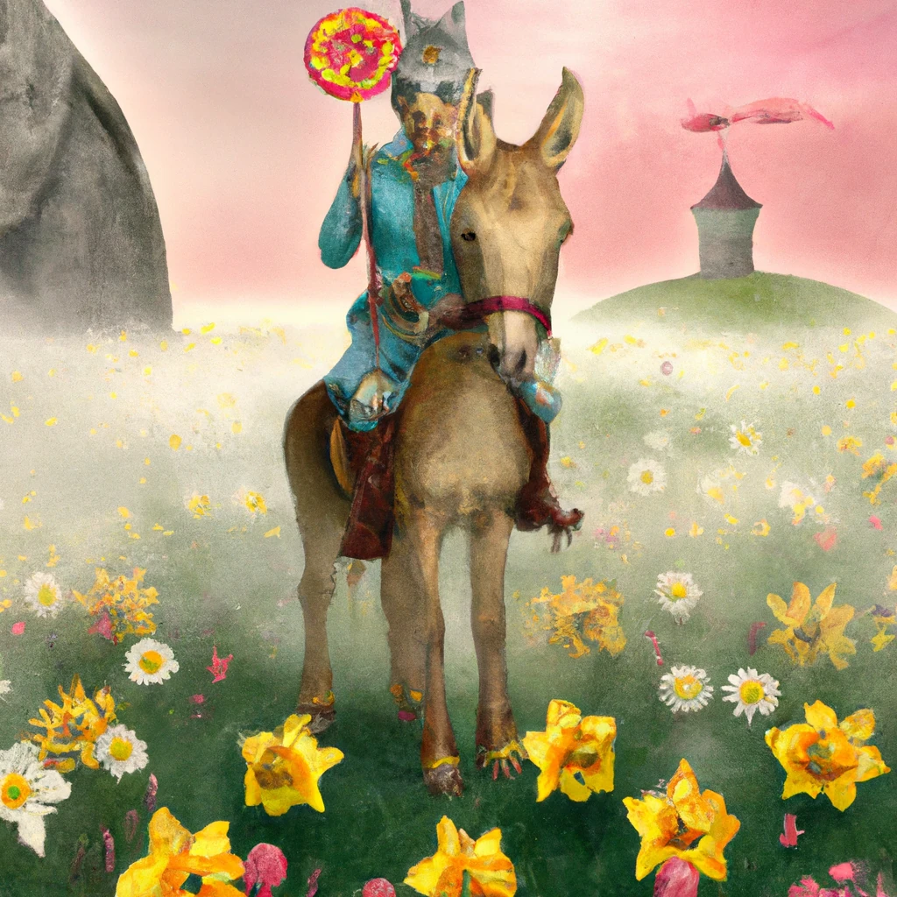

# 构建图像生成应用

[](https://youtu.be/B5VP0_J7cs8?si=5P3L5o7F_uS_QcG9)

大型语言模型不仅能生成文本，还能根据文字描述生成图像。将图像作为一种模态，在医疗技术、建筑、旅游、游戏开发等多个领域非常有用。本章将介绍两个最流行的图像生成模型，DALL-E 和 Midjourney。

## 介绍

本课将涵盖：

- 图像生成及其用途。
- DALL-E 和 Midjourney 是什么，以及它们的工作原理。
- 如何构建一个图像生成应用。

## 学习目标

完成本课后，您将能够：

- 构建图像生成应用。
- 通过元提示定义应用的边界。
- 使用 DALL-E 和 Midjourney。

## 为什么构建图像生成应用？

图像生成应用是探索生成式AI能力的绝佳方式。例如，它们可用于：

- <strong>图像编辑和合成</strong>。你可以针对多种用例生成图像，如图像编辑和图像合成。

- <strong>应用于多个行业</strong>。它们也可以用于医疗技术、旅游、游戏开发等多个行业的图像生成。

## 场景：Edu4All

在本课中，我们将继续与初创企业 Edu4All 合作。学生将为他们的评估创建图像，具体图像内容由学生决定，可能是他们自己童话故事的插图，或为故事创建新角色，或帮助他们可视化想法和概念。

如果 Edu4All 的学生在课堂上研究纪念碑，他们可能会生成如下图像：


使用如下提示：

> “黎明阳光下埃菲尔铁塔旁的一只狗”

## 什么是 DALL-E 和 Midjourney？

[DALL-E](https://openai.com/dall-e-2?WT.mc_id=academic-105485-koreyst) 和 [Midjourney](https://www.midjourney.com/?WT.mc_id=academic-105485-koreyst) 是两个非常流行的图像生成模型，允许你使用提示生成图像。

### DALL-E

先介绍 DALL-E，它是一个根据文本描述生成图像的生成式 AI 模型。

> [DALL-E 是两个模型的结合，CLIP 和扩散注意力](https://towardsdatascience.com/openais-dall-e-and-clip-101-a-brief-introduction-3a4367280d4e?WT.mc_id=academic-105485-koreyst)。

- **CLIP** 是一种从图像和文本生成嵌入向量（数据的数字表示）的模型。

- <strong>扩散注意力</strong> 是一种根据嵌入向量生成图像的模型。DALL-E 训练于图像与文本数据集，能够根据文本描述生成图像。例如，可以用来生成戴帽子的猫，或者莫霍克发型的狗。

### Midjourney

Midjourney 的工作方式类似于 DALL-E，也是根据文本提示生成图像。Midjourney 也可以用类似“戴帽子的猫”或“莫霍克发型的狗”的提示来生成图像。


_图片来源 维基百科，Midjourney 生成_

## DALL-E 和 Midjourney 如何工作

先看 [DALL-E](https://arxiv.org/pdf/2102.12092.pdf?WT.mc_id=academic-105485-koreyst)。DALL-E 是一种基于变换器架构的生成式 AI 模型，采用了自回归变换器。

自回归变换器定义了模型如何根据文本描述生成图像，它一次生成一个像素，然后利用生成的像素生成下一个像素。通过神经网络的多层传递，直到图像完成。

通过这个过程，DALL-E 可以控制所生成图像中的属性、对象、特征等。DALL-E 2 和 3 版本对生成图像的控制能力更强。

## 构建你的第一个图像生成应用

那么构建图像生成应用需要什么？你需要以下库：

- **python-dotenv**，强烈推荐使用此库将秘密保存在 _.env_ 文件中，避免代码中暴露。
- **openai**，你将用它与 OpenAI API 交互。
- **pillow**，用于在 Python 中处理图像。
- **requests**，帮助你发送 HTTP 请求。

## 创建并部署 Azure OpenAI 模型

如果尚未完成，请按照 [Microsoft Learn](https://learn.microsoft.com/azure/ai-foundry/openai/how-to/create-resource?pivots=web-portal&WT.mc_id=academic-105485-koreyst) 页面上的说明
创建 Azure OpenAI 资源和模型。选择 **gpt-image-1** 作为模型（当前 Azure OpenAI 的图像生成模型；DALL-E 3 属于旧版，新部署中不再提供）。

## 创建应用

1. 创建一个 _.env_ 文件，内容如下：

   ```text
   AZURE_OPENAI_ENDPOINT=<your endpoint>
   AZURE_OPENAI_API_KEY=<your key>
   AZURE_OPENAI_DEPLOYMENT="gpt-image-1"
   ```

   在 Azure OpenAI Foundry 门户的“Deployments”部分找到这些信息。

1. 在 _requirements.txt_ 文件中收集上述库，内容如下：

   ```text
   python-dotenv
   openai
   pillow
   requests
   ```

1. 接下来，创建虚拟环境并安装库：

   ```bash
   python3 -m venv venv
   source venv/bin/activate
   pip install -r requirements.txt
   ```

   对于 Windows，使用以下命令创建并激活虚拟环境：

   ```bash
   python3 -m venv venv
   venv\Scripts\activate.bat
   ```

1. 在名为 _app.py_ 的文件中添加以下代码：


    ```python
    import openai
    import os
    import requests
    from PIL import Image
    import dotenv
    from openai import OpenAI, AzureOpenAI
    
    # import dotenv
    dotenv.load_dotenv()
    
    # 配置 Azure OpenAI 服务客户端
    client = AzureOpenAI(
      azure_endpoint = os.environ["AZURE_OPENAI_ENDPOINT"],
      api_key=os.environ['AZURE_OPENAI_API_KEY'],
      api_version = "2024-10-21"
      )
    try:
        # 使用图像生成 API 创建图像
        generation_response = client.images.generate(
                                prompt='Bunny on horse, holding a lollipop, on a foggy meadow where it grows daffodils',
                                size='1024x1024', n=1,
                                model=os.environ['AZURE_OPENAI_DEPLOYMENT']
                              )

        # 设置存储图像的目录
        image_dir = os.path.join(os.curdir, 'images')

        # 如果目录不存在，则创建它
        if not os.path.isdir(image_dir):
            os.mkdir(image_dir)

        # 初始化图像路径（注意文件类型应为 png）
        image_path = os.path.join(image_dir, 'generated-image.png')

        # 获取生成的图像
        image_url = generation_response.data[0].url  # 从响应中提取图像 URL
        generated_image = requests.get(image_url).content  # 下载图像
        with open(image_path, "wb") as image_file:
            image_file.write(generated_image)

        # 在默认图像查看器中显示图像
        image = Image.open(image_path)
        image.show()

    # 捕获异常
    except openai.BadRequestError as err:
        print(err)
   ```

让我们解释这段代码：

- 首先，我们导入所需的库，包括 OpenAI 库、dotenv 库、requests 库和 Pillow 库。

  ```python
  import openai
  import os
  import requests
  from PIL import Image
  import dotenv
  ```

- 接下来，我们从 _.env_ 文件加载环境变量。

  ```python
  # 导入 dotenv
  dotenv.load_dotenv()
  ```

- 然后，我们配置 Azure OpenAI 服务客户端

  ```python
  # 从环境变量获取端点和密钥
  client = AzureOpenAI(
      azure_endpoint = os.environ["AZURE_OPENAI_ENDPOINT"],
      api_key=os.environ['AZURE_OPENAI_API_KEY'],
      api_version = "2024-10-21"
      )
  ```

- 接着，我们生成图像：

  ```python
  # 使用图像生成API创建图像
  generation_response = client.images.generate(
                        prompt='Bunny on horse, holding a lollipop, on a foggy meadow where it grows daffodils',
                        size='1024x1024', n=1,
                        model=os.environ['AZURE_OPENAI_DEPLOYMENT']
                      )
  ```

  上述代码返回一个包含生成图像 URL 的 JSON 对象。我们可以使用该 URL 下载图像并保存为文件。

- 最后，我们打开图像并使用标准图像查看器显示它：

  ```python
  image = Image.open(image_path)
  image.show()
  ```

### 生成图像的更多细节

让我们更详细地看一下生成图像的代码：

   ```python
     generation_response = client.images.generate(
                               prompt='Bunny on horse, holding a lollipop, on a foggy meadow where it grows daffodils',
                               size='1024x1024', n=1,
                               model=os.environ['AZURE_OPENAI_DEPLOYMENT']
                           )
   ```

- **prompt**，是用于生成图像的文本提示。在本例中，我们使用的提示是 "Bunny on horse, holding a lollipop, on a foggy meadow where it grows daffodils"（骑在马上的兔子，手持棒棒糖，所在的雾气弥漫的草地上长满水仙花）。
- **size**，是生成图像的尺寸。在本例中，我们生成一幅 1024x1024 像素的图像。
- **n**，是生成的图像数量。在本例中，我们生成两张图像。
- **temperature**，是控制生成式 AI 模型输出随机性的参数。temperature 的取值在 0 到 1 之间，0 表示输出是确定性的，1 表示输出是随机的。默认值是 0.7。

你还可以对图像做更多操作，我们将在下一节中介绍。

## 图像生成的额外功能

到目前为止，你已经看到我们可以用几行 Python 代码生成图像。但图像处理还有更多可能。

你还可以执行以下操作：

- <strong>执行编辑</strong>。通过提供一张已有图像、一个遮罩和一个提示，你可以改变图像。例如，你可以给图像的一部分添加内容。想象我们的兔子图像，你可以给兔子加个帽子。实现方式是提供图像、遮罩（标识需修改的区域）和文本提示，说明要做什么。
> 注意：DALL-E 3 不支持此功能。
 
这是一个使用 GPT Image 的示例：

   ```python
   response = client.images.edit(
       model="gpt-image-1",
       image=open("sunlit_lounge.png", "rb"),
       mask=open("mask.png", "rb"),
       prompt="A sunlit indoor lounge area with a pool containing a flamingo"
   )
   image_url = response.data[0].url
   ```

  基础图像仅包含带泳池的休息区，但最终图像中会有一只火烈鸟：

<div style="display: flex; justify-content: space-between; align-items: center; margin: 20px 0;">
  
  
  
</div>


- <strong>创建变体</strong>。这意味着从一个已有图像创建多个变体。要创建变体，提供图像和文本提示，代码示例如下：

  ```python
  response = client.images.create_variation(
    image=open("bunny-lollipop.png", "rb"),
    n=1,
    size="1024x1024"
  )
  image_url = response.data[0].url
  ```

  > 注意，此功能仅支持 OpenAI 的 DALL-E 2 模型，不支持 gpt-image-1。

## 温度参数

温度是控制生成式 AI 模型输出随机性的参数。temperature 的取值介于 0 和 1 之间。0 表示输出确定性强，1 表示输出随机性高。默认值为 0.7。

让我们通过运行相同提示两次来看看温度参数的效果：

> 提示 : "Bunny on horse, holding a lollipop, on a foggy meadow where it grows daffodils"


现在我们再运行同样的提示，看看是否能得到完全相同的图像：


如你所见，图像相似但不相同。我们尝试将 temperature 改为 0.1，看看会发生什么：

```python
 generation_response = client.images.generate(
        prompt='Bunny on horse, holding a lollipop, on a foggy meadow where it grows daffodils',    # 在此输入您的提示文本
        size='1024x1024',
        n=2
    )
```

### 改变温度值

我们想让输出更具确定性。从之前两张图像可以观察到，第一张图中出现的是兔子，第二张图中出现的是马，所以两张图差异较大。

因此我们修改代码，将 temperature 设为 0，代码如下：

```python
generation_response = client.images.generate(
        prompt='Bunny on horse, holding a lollipop, on a foggy meadow where it grows daffodils',    # 在此输入您的提示文本
        size='1024x1024',
        n=2,
        temperature=0
    )
```

现在运行这段代码，你会获得以下两张图像：

- 
- 

这里你可以明显看到两张图像更加相似。

## 如何通过元提示定义应用边界

通过我们的演示，已经可以为客户生成图像了。但我们需要为应用创建一些边界。

例如，我们不希望生成不适合工作环境的图像，或者不适合儿童的内容。

我们可以使用 _元提示 (metaprompts)_ 来实现。元提示是用来控制生成式 AI 模型输出的文本提示。例如，我们可以用元提示来控制输出，确保生成的图像适合工作环境，或者适合儿童观看。

### 它是如何运作的？

那么，元提示是如何工作的？

元提示是用来控制生成式 AI 模型输出的文本提示，置于文本提示之前，用以控制模型的输出，并嵌入至应用程序里来控制输出。即将提示输入和元提示输入封装成一个完整的文本提示。

一个元提示的示例是：

```text
You are an assistant designer that creates images for children.

The image needs to be safe for work and appropriate for children.

The image needs to be in color.

The image needs to be in landscape orientation.

The image needs to be in a 16:9 aspect ratio.

Do not consider any input from the following that is not safe for work or appropriate for children.

(Input)

```

现在，让我们看看如何在演示中使用元提示。

```python
disallow_list = "swords, violence, blood, gore, nudity, sexual content, adult content, adult themes, adult language, adult humor, adult jokes, adult situations, adult"

meta_prompt =f"""You are an assistant designer that creates images for children.

The image needs to be safe for work and appropriate for children.

The image needs to be in color.

The image needs to be in landscape orientation.

The image needs to be in a 16:9 aspect ratio.

Do not consider any input from the following that is not safe for work or appropriate for children.
{disallow_list}
"""

prompt = f"{meta_prompt}
Create an image of a bunny on a horse, holding a lollipop"

# 待办：添加生成图像的请求
```

从上述提示中可以看到，所有生成的图像都考虑了元提示的内容。

## 任务 - 让学生能够使用

我们在本课开始时介绍了 Edu4All。现在是时候让学生们能够为他们的作业生成图像了。


学生们将为他们的评估创建包含纪念碑的图像，具体是什么纪念碑由学生决定。学生们被要求在此任务中发挥创造力，将这些纪念碑置于不同的语境中。

## 解决方案

这是一个可能的解决方案：

```python
import openai
import os
import requests
from PIL import Image
import dotenv
from openai import AzureOpenAI
# import dotenv
dotenv.load_dotenv()

# 从环境变量获取终端和密钥
client = AzureOpenAI(
  azure_endpoint = os.environ["AZURE_OPENAI_ENDPOINT"],
  api_key=os.environ['AZURE_OPENAI_API_KEY'],
  api_version = "2024-10-21"
  )


disallow_list = "swords, violence, blood, gore, nudity, sexual content, adult content, adult themes, adult language, adult humor, adult jokes, adult situations, adult"

meta_prompt = f"""You are an assistant designer that creates images for children.

The image needs to be safe for work and appropriate for children.

The image needs to be in color.

The image needs to be in landscape orientation.

The image needs to be in a 16:9 aspect ratio.

Do not consider any input from the following that is not safe for work or appropriate for children.
{disallow_list}
"""

prompt = f"""{meta_prompt}
Generate monument of the Arc of Triumph in Paris, France, in the evening light with a small child holding a Teddy looks on.
"""

try:
    # 使用图像生成API创建图像
    generation_response = client.images.generate(
        prompt=prompt,    # 在此处输入你的提示文本
        size='1024x1024',
        n=1,
    )
    # 设置存储图像的目录
    image_dir = os.path.join(os.curdir, 'images')

    # 如果目录不存在，则创建它
    if not os.path.isdir(image_dir):
        os.mkdir(image_dir)

    # 初始化图像路径（注意文件类型应为png）
    image_path = os.path.join(image_dir, 'generated-image.png')

    # 获取生成的图像
    image_url = generation_response.data[0].url  # 从响应中提取图像URL
    generated_image = requests.get(image_url).content  # 下载图像
    with open(image_path, "wb") as image_file:
        image_file.write(generated_image)

    # 在默认图像查看器中显示图像
    image = Image.open(image_path)
    image.show()

# 捕获异常
except openai.BadRequestError as err:
    print(err)
```

## 很棒的工作！继续学习

完成本课后，查看我们的 [生成式 AI 学习合集](https://aka.ms/genai-collection?WT.mc_id=academic-105485-koreyst) ，继续提升你的生成式 AI 知识！

请前往第10课，我们将探讨如何[构建低代码 AI 应用程序](../10-building-low-code-ai-applications/README.md?WT.mc_id=academic-105485-koreyst)

---

<!-- CO-OP TRANSLATOR DISCLAIMER START -->
**免责声明**：
本文件由 AI 翻译服务 [Co-op Translator](https://github.com/Azure/co-op-translator) 翻译完成。尽管我们力求准确，但请注意，自动翻译可能包含错误或不准确之处。原始语言版文件应视为权威来源。对于重要信息，建议使用专业人工翻译。我们对因使用本翻译而产生的任何误解或误释不承担责任。
<!-- CO-OP TRANSLATOR DISCLAIMER END -->