# 构建低代码 AI 应用

> _(点击上方图片观看本课视频)_

## 介绍

既然我们已经学习了如何构建图像生成应用，我们现在来聊聊低代码。生成式 AI 可以应用于包括低代码在内的各种领域，但什么是低代码，我们如何将 AI 添加到其中呢？

通过使用低代码开发平台，传统开发者和非开发者构建应用和解决方案变得更加容易。低代码开发平台使您能够以几乎不写代码的方式构建应用和解决方案。这是通过提供一个可视化开发环境来实现的，该环境允许您拖放组件来构建应用和解决方案。这使您能够更快地使用更少的资源来构建应用和解决方案。在本课中，我们将深入探讨如何使用低代码，以及如何通过 Power Platform 利用 AI 增强低代码开发。

Power Platform 为组织提供了赋能其团队自行构建解决方案的机会，通过一个直观的低代码或无代码环境。该环境简化了构建解决方案的过程。利用 Power Platform，解决方案可以在几天或几周内完成，而不是几个月甚至几年。Power Platform 包含五个关键产品：Power Apps、Power Automate、Power BI、Power Pages 和 Copilot Studio。

本课涵盖内容：

- Power Platform 中生成式 AI 介绍
- Copilot 介绍及其使用方法
- 使用生成式 AI 构建 Power Platform 中的应用和流程
- 理解 Power Platform 中 AI Builder 的 AI 模型
- 使用 Microsoft Copilot Studio 构建智能代理

## 学习目标

在本课结束时，您将能够：

- 理解 Copilot 在 Power Platform 中的工作原理。

- 构建教育初创公司的学生作业跟踪应用。

- 构建使用 AI 提取发票信息的发票处理流程。

- 采用使用 GPT AI 模型的文本创建最佳实践。

- 理解 Microsoft Copilot Studio 及其如何构建智能代理。

本课中您将使用的工具和技术包括：

- **Power Apps**，用于构建学生作业跟踪应用，提供低代码开发环境，用于构建跟踪、管理和交互数据的应用。

- **Dataverse**，用于存储学生作业跟踪应用的数据，Dataverse 提供低代码数据平台以存储应用数据。

- **Power Automate**，用于发票处理流程，提供低代码开发环境以构建自动化发票处理的工作流。

- **AI Builder**，用于发票处理 AI 模型，使用预建 AI 模型来处理初创公司的发票。

## Power Platform 中的生成式 AI

通过生成式 AI 增强低代码开发和应用是 Power Platform 的重点领域。目标是让每个人都能打造带有 AI 功能的应用、网站、仪表板和通过 AI 自动化流程，_无需任何数据科学专业知识_。这一目标通过在 Power Platform 的低代码开发体验中集成生成式 AI 以 Copilot 和 AI Builder 的形式实现。

### 这如何运作？

Copilot 是一个 AI 助手，它通过自然语言的对话步骤，让您描述需求来构建 Power Platform 解决方案。比如，您可以告诉 AI 助手您的应用会使用哪些字段，它将创建应用以及底层数据模型；或者您可以说明如何设置 Power Automate 中的流程。

您还可以在应用屏幕中以功能形式使用 Copilot 驱动的特性，使用户能够通过会话互动发掘洞察。

AI Builder 是 Power Platform 中的低代码 AI 功能，允许您使用 AI 模型来帮助自动化流程和预测结果。借助 AI Builder，您可以将 AI 融入连接 Dataverse 或各种云数据源（如 SharePoint、OneDrive 或 Azure）数据的应用和流程中。

Copilot 可用于所有 Power Platform 产品：Power Apps、Power Automate、Power BI、Power Pages 和 Copilot Studio（前称 Power Virtual Agents）。AI Builder 可用于 Power Apps 和 Power Automate。本课重点介绍如何在 Power Apps 和 Power Automate 中使用 Copilot 和 AI Builder，为教育初创公司构建解决方案。

### Power Apps 中的 Copilot

作为 Power Platform 的一部分，Power Apps 提供低代码开发环境，用于构建跟踪、管理和交互数据的应用。它是一套应用开发服务，具有可扩展的数据平台，并能连接云服务和本地数据。Power Apps 允许您构建能在浏览器、平板和手机上运行的应用，并可与同事共享。Power Apps 通过简单界面让每个业务用户或专业开发者轻松进入应用开发领域。应用开发体验也通过 Copilot 的生成式 AI 得到提升。

Power Apps 中的 Copilot AI 助手功能使您可以描述所需应用类型以及想要跟踪、收集或显示的信息。然后 Copilot 根据您的描述生成响应式 Canvas 应用。生成后，您可以自定义该应用以满足需求。AI Copilot 还会生成并建议一个带有您需要存储数据字段及示例数据的 Dataverse 表。本课后续将介绍 Dataverse 以及如何在 Power Apps 中使用。您还可以通过会话步骤使用 AI Copilot 助手功能定制该表。此功能在 Power Apps 主页屏幕即可使用。

### Power Automate 中的 Copilot

作为 Power Platform 的一部分，Power Automate 允许用户创建应用和服务之间的自动化工作流。它帮助自动化重复的业务流程，如沟通、数据收集和审批等。其简单界面适用于所有技术水平用户（从初学者到资深开发者）自动化工作任务。工作流开发体验也通过 Copilot 的生成式 AI 得到提升。

Power Automate 中的 Copilot AI 助手功能使您可以描述所需流程类型以及期望流程执行的操作。Copilot 会根据描述生成流程。生成后，您可以自定义流程以满足需求。AI Copilot 还会生成并建议完成自动化任务所需的操作。本课后续将介绍流程及其在 Power Automate 中的应用。您还可以通过会话步骤使用 AI Copilot 助手功能定制这些操作。此功能在 Power Automate 主页屏幕即可使用。

## 使用 Microsoft Copilot Studio 构建智能代理

[Microsoft Copilot Studio](https://learn.microsoft.com/microsoft-copilot-studio/fundamentals-what-is-copilot-studio?WT.mc_id=academic-105485-koreyst)（前称 Power Virtual Agents）是 Power Platform 中的低代码工具，用于构建<strong>AI 代理</strong>——会话型助理，可以代表用户回答问题、执行操作和自动任务。与 Power Platform 其他部分一样，您通过可视化、自然语言优先的体验构建这些代理：描述您希望代理执行的任务，Copilot Studio 便帮助构建其指令、知识和动作。

对于我们的教育初创公司，您可以构建一个代理，回答学生关于课程的问题，检查作业截止日期，甚至给讲师发邮件——而无需写代码。

以下是使 Copilot Studio 功能强大的最新能力：

- <strong>从您的知识中生成答案</strong>。您无需手工编写每段对话，可以连接<strong>知识来源</strong>——公共网站、SharePoint、OneDrive、Dataverse、上传文件或通过连接器访问企业数据，代理从中生成有根据的答案。

- <strong>生成式编排</strong>。代理不局限于严格的触发短语，借助 AI 理解请求并动态决定结合哪些知识、话题和操作完成请求，包括将多步操作串联起来。

- <strong>操作与连接器</strong>。代理不仅能聊天，还能<em>执行操作</em>。您可以赋予代理超过 1500+ 预构建 Power Platform 连接器、Power Automate 流程、自定义 REST API、提示或<strong>模型上下文协议（MCP）</strong>服务器支持的操作。

- <strong>自治代理</strong>。代理不限于聊天窗口响应。您可以构建<strong>自治代理</strong>响应事件触发——如新邮件、Dataverse 新记录或文件上传——然后在后台执行任务。

- <strong>多代理编排</strong>。代理可以调用其他代理。Copilot Studio 代理可转接或被其他代理扩展，包括发布到 Microsoft 365 Copilot 的代理和在 Microsoft Foundry 构建的代理。

- <strong>模型选择</strong>。除内置模型外，您还可以从 Microsoft Foundry 模型目录引入模型，定制代理的推理和响应方式。

- <strong>多渠道发布</strong>。构建完成后，代理可发布到多个渠道——Microsoft Teams、Microsoft 365 Copilot、网站或自定义应用等，安全、认证和分析通过 Power Platform 管理体验管理。

您可以在 [copilotstudio.microsoft.com](https://copilotstudio.microsoft.com?WT.mc_id=academic-105485-koreyst) 开始构建您的第一个代理，并在 [Microsoft Copilot Studio 文档](https://learn.microsoft.com/microsoft-copilot-studio/?WT.mc_id=academic-105485-koreyst) 了解更多。

## 任务：使用 Copilot 管理我们初创公司的学生作业和发票

我们的初创公司为学生提供在线课程。公司发展迅速，如今难以满足课程需求。公司聘请您作为 Power Platform 开发者，帮助构建低代码解决方案，管理学生作业和发票。解决方案应通过应用帮助跟踪和管理学生作业，并通过工作流自动化发票处理流程。您被要求使用生成式 AI 开发解决方案。

开始使用 Copilot 时，您可以使用 [Power Platform Copilot 提示库](https://github.com/pnp/powerplatform-prompts?WT.mc_id=academic-109639-somelezediko)获取提示。该库包含可用于通过 Copilot 构建应用和流程的提示列表，也能帮助您了解如何向 Copilot 描述需求。

### 为我们的初创公司构建学生作业跟踪应用

我们的教育者一直难以跟踪学生作业。他们过去使用电子表格跟踪作业，但随着学生数量增加，管理变得困难。他们请求您构建一款帮助跟踪和管理学生作业的应用。该应用应支持添加新作业、查看作业、更新作业和删除作业，同时让教育者和学生查看已评分和未评分的作业。

按照以下步骤，您将使用 Power Apps 中的 Copilot 构建该应用：

1. 进入 [Power Apps](https://make.powerapps.com?WT.mc_id=academic-105485-koreyst)主屏幕。

1. 利用主屏幕的文本区域描述您想构建的应用。例如，**_我想构建一款用于跟踪和管理学生作业的应用_**。点击 <strong>发送</strong> 按钮向 AI Copilot 发送提示。

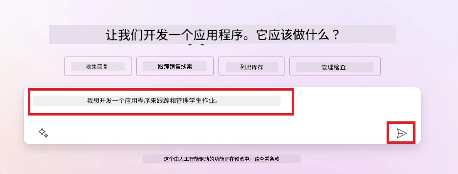

1. AI Copilot 会建议一个带有所需存储数据字段和示例数据的 Dataverse 表。您可通过会话步骤与 AI Copilot 助手功能定制该表以满足需求。

   > <strong>重要</strong>：Dataverse 是 Power Platform 的底层数据平台，是存储应用数据的低代码数据平台。它是一个完全托管的服务，将数据安全存储于 Microsoft 云中，并在您的 Power Platform 环境中提供。它内置数据治理功能，如数据分类、数据血缘、细粒度访问控制等。您可以在[这里](https://docs.microsoft.com/powerapps/maker/data-platform/data-platform-intro?WT.mc_id=academic-109639-somelezediko)了解更多关于 Dataverse 的信息。

   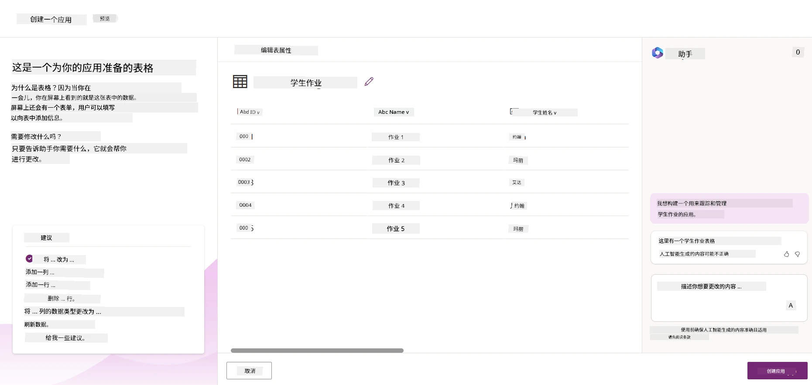

1. 教育者希望给已提交作业的学生发送邮件，告知作业进度。您可以使用 Copilot 向表中添加一个新字段以存储学生邮箱。例如，您可以用以下提示添加新字段：**_我想添加一个存储学生邮箱的列_**。点击 <strong>发送</strong> 按钮向 AI Copilot 发送提示。

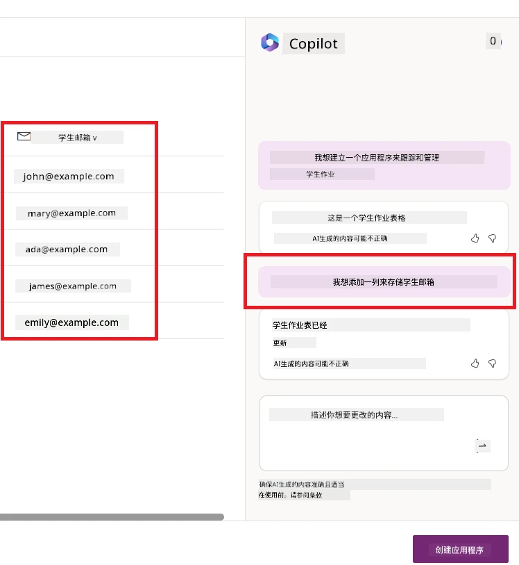

1. AI Copilot 会生成新字段，您随后可以定制该字段以满足需求。

1. 完成表格后，点击 <strong>创建应用</strong> 按钮创建应用。

1. AI 助手将根据您的描述生成一个响应式 Canvas 应用。然后，您可以自定义该应用以满足您的需求。

1. 教师想给学生发送邮件时，可以使用 Copilot 向应用添加一个新屏幕。例如，您可以使用以下提示向应用添加一个新屏幕：**_我想添加一个发送邮件给学生的屏幕_**。点击 <strong>发送</strong> 按钮将提示发送给 AI 助手。

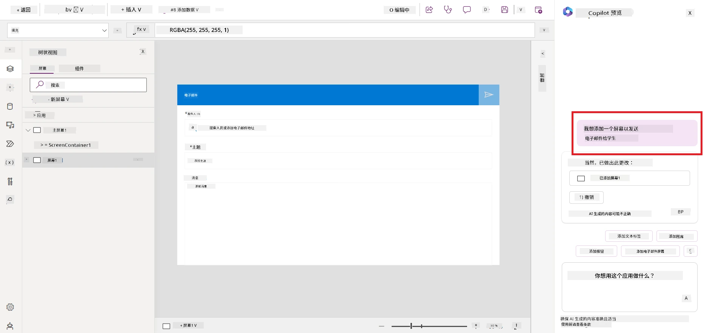

1. AI 助手将生成一个新屏幕，您可以自定义该屏幕以满足您的需求。

1. 完成应用后，点击 <strong>保存</strong> 按钮保存应用。

1. 要与教师共享应用，点击 <strong>共享</strong> 按钮，然后再次点击 <strong>共享</strong> 按钮。您可以通过输入教师的电子邮件地址来共享应用。

> <strong>你的作业</strong>：你刚刚构建的应用是一个良好的开始，但还有改进空间。使用邮件功能时，教师只能通过手动输入学生的邮件来发送邮件。你能否使用 Copilot 构建一个自动化流程，使教师在学生提交作业时能自动发送邮件？提示是通过合适的提示你可以使用 Power Automate 中的 Copilot 来实现此功能。

### 为我们的创业公司构建发票信息表

我们创业公司的财务团队一直在努力跟踪发票。他们一直使用电子表格跟踪发票，但随着发票数量增加，管理变得困难。他们请你构建一个表格来帮助存储、跟踪和管理收到的发票信息。该表将用于构建一个自动化流程，提取所有发票信息并存储到表中。同时，该表还应使财务团队能够查看已支付和未支付的发票。

Power Platform 有一个底层数据平台叫 Dataverse，允许你存储应用和解决方案的数据。Dataverse 是一个低代码数据平台，用于存储应用数据。它是一个完全托管的服务，安全地在微软云中存储数据，并在你的 Power Platform 环境中进行配置。它具备内置的数据治理功能，如数据分类、数据血缘、细粒度访问控制等。你可以在此处了解更多关于 Dataverse 的信息 [关于 Dataverse](https://docs.microsoft.com/powerapps/maker/data-platform/data-platform-intro?WT.mc_id=academic-109639-somelezediko)。

为什么我们创业公司应该使用 Dataverse？Dataverse 中的标准和自定义表提供了安全且基于云的数据存储选项。表允许你存储不同类型的数据，类似于你在一个 Excel 工作簿中使用多个工作表。你可以使用表存储与你的组织或业务需求相关的数据。使用 Dataverse，我们创业公司将获得以下益处（但不限于）：

- <strong>易于管理</strong>：元数据和数据都存储在云端，所以你不必担心它们如何存储或管理的细节。你可以专注于构建你的应用和解决方案。

- <strong>安全</strong>：Dataverse 提供安全且基于云的数据存储选项。你可以通过基于角色的安全控制谁可以访问表中的数据以及如何访问。

- <strong>丰富的元数据</strong>：可以在 Power Apps 中直接使用数据类型和关系

- <strong>逻辑和验证</strong>：你可以使用业务规则、计算字段和验证规则来执行业务逻辑并保持数据准确性。

现在你知道什么是 Dataverse 以及为什么应该使用它，让我们看看如何使用 Copilot 在 Dataverse 中创建一个满足财务团队需求的表。

> <strong>注意</strong> ：你将在下一节中使用此表来构建一个自动化流程，该流程会提取所有发票信息并存储在表中。

使用 Copilot 在 Dataverse 创建表，按照以下步骤操作：

1. 进入 [Power Apps](https://make.powerapps.com?WT.mc_id=academic-105485-koreyst) 主页面。

2. 在左侧导航栏选择 <strong>表</strong>，然后点击 <strong>描述新表</strong>。

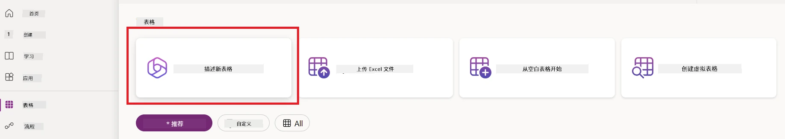

1. 在 <strong>描述新表</strong> 页面，使用文本区域描述你要创建的表。例如，**_我想创建一个用来存储发票信息的表_**。点击 <strong>发送</strong> 按钮将提示发送给 AI 助手。

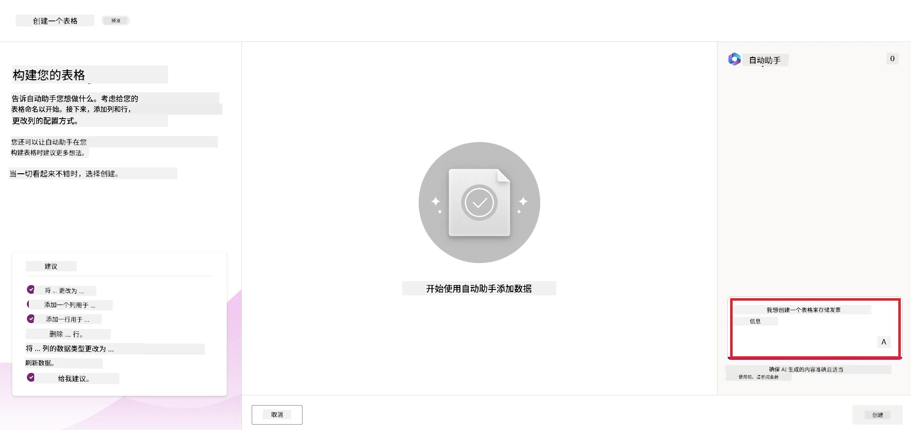

1. AI 助手将建议一个 Dataverse 表，包含你需要存储的跟踪数据字段和一些示例数据。你可以通过对话步骤使用 AI 助手助手功能自定义表以满足你的需求。

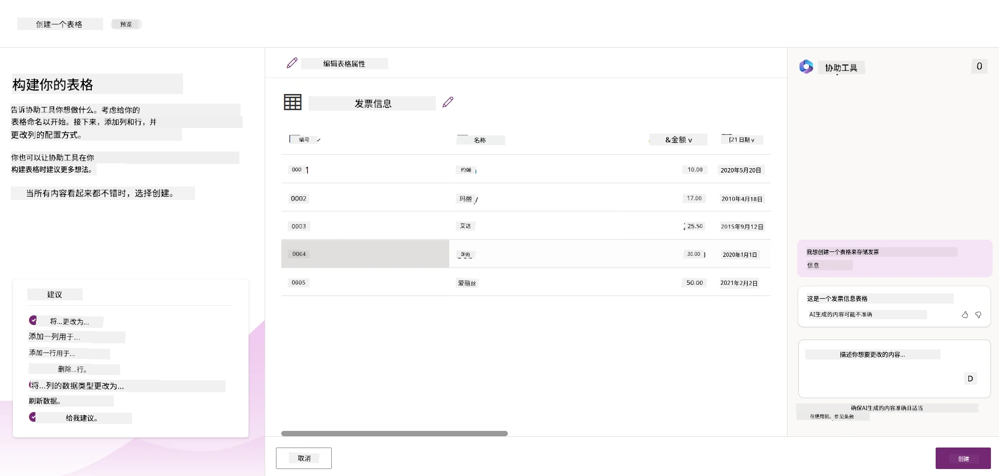

1. 财务团队想要向供应商发送邮件以更新发票当前状态。你可以使用 Copilot 向表添加一个新字段以存储供应商邮箱。例如，你可以使用以下提示来添加一个新字段：**_我想添加一列来存储供应商邮箱_**。点击 <strong>发送</strong> 按钮将提示发送给 AI 助手。

1. AI 助手将生成一个新字段，之后你可以自定义该字段以满足需求。

1. 完成表的制作后，点击 <strong>创建</strong> 按钮创建表。

## Power Platform 中的 AI 模型和 AI Builder

AI Builder 是 Power Platform 中一个低代码 AI 功能，使你可以使用 AI 模型来自动化流程和预测结果。借助 AI Builder，你可以将 AI 引入你的应用和流程，连接 Dataverse 或多种云数据源（如 SharePoint、OneDrive 或 Azure）中的数据。

## 预构建 AI 模型 vs 自定义 AI 模型

AI Builder 提供两种类型的 AI 模型：预构建 AI 模型和自定义 AI 模型。预构建 AI 模型是微软训练并在 Power Platform 中提供的现成模型，帮助你向应用和流程中添加智能，而无需收集数据、构建、训练和发布自己的模型。你可以使用这些模型来自动化流程和预测结果。

Power Platform 中的一些预构建 AI 模型包括：

- <strong>关键词提取</strong>：此模型从文本中提取关键短语。
- <strong>语言检测</strong>：此模型检测文本的语言。
- <strong>情感分析</strong>：此模型检测文本的积极、消极、中性或混合情感。
- <strong>名片读取器</strong>：此模型从名片中提取信息。
- <strong>文字识别</strong>：此模型从图片中提取文字。
- <strong>目标检测</strong>：此模型检测并提取图片中的对象。
- <strong>文档处理</strong>：此模型从表单中提取信息。
- <strong>发票处理</strong>：此模型从发票中提取信息。

使用自定义 AI 模型，你可以将自己的模型导入 AI Builder，使其像任何 AI Builder 自定义模型一样运行，允许你使用自己的数据训练模型。你可以在 Power Apps 和 Power Automate 中使用这些模型来自动化流程和预测结果。使用自己的模型时，有一定限制。阅读有关这些 [限制](https://learn.microsoft.com/ai-builder/byo-model#limitations?WT.mc_id=academic-105485-koreyst) 的更多内容。

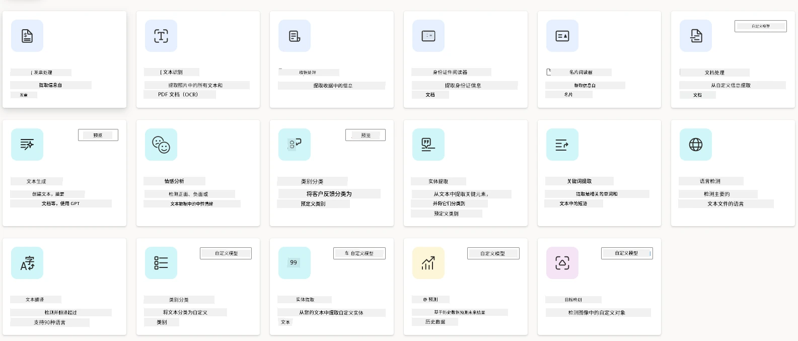

## 任务 #2 - 为我们的创业公司构建发票处理流程

财务团队一直难以处理发票。他们用电子表格跟踪发票，但随着发票数量的增加，管理变得困难。他们请你构建一个使用 AI 帮助他们处理发票的工作流。该工作流应能从发票中提取信息并将其存储在 Dataverse 表中，同时应能向财务团队发送包含提取信息的电子邮件。

既然你知道什么是 AI Builder 以及为什么应该使用它，让我们看看如何使用之前介绍的 AI Builder 中的发票处理 AI 模型，构建一个帮助财务团队处理发票的工作流。

按照以下步骤，使用 AI Builder 中的发票处理 AI 模型构建帮助财务团队处理发票的工作流：

1. 进入 [Power Automate](https://make.powerautomate.com?WT.mc_id=academic-105485-koreyst) 主页面。

2. 在主页的文本区域描述你想构建的工作流。例如，**_当邮件到达我的邮箱时处理发票_**。点击 <strong>发送</strong> 按钮将提示发送给 AI 助手。

   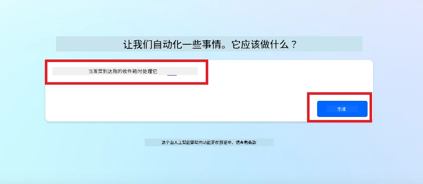

3. AI 助手会建议完成任务所需的操作。你可以点击 <strong>下一步</strong> 按钮浏览后续步骤。

4. 下一步，Power Automate 会提示你设置工作流所需的连接。完成后，点击 <strong>创建流程</strong> 按钮创建流程。

5. AI 助手将生成一个流程，你可以自定义它以满足你的需求。

6. 更新流程的触发器，设置 <strong>文件夹</strong> 为存放发票的文件夹。例如，可以将文件夹设置为 <strong>收件箱</strong>。点击 <strong>显示高级选项</strong> 并将 <strong>仅有附件</strong> 设置为 <strong>是</strong>。这样确保只有当文件夹收到带附件的邮件时流程才会运行。

7. 从流程中移除以下操作：**HTML 转文本**、<strong>组合</strong>、**组合 2**、**组合 3** 和 **组合 4**，因为你不会使用它们。

8. 从流程中移除 <strong>条件</strong> 操作，因为你不会使用它。流程应如下所示截图：

   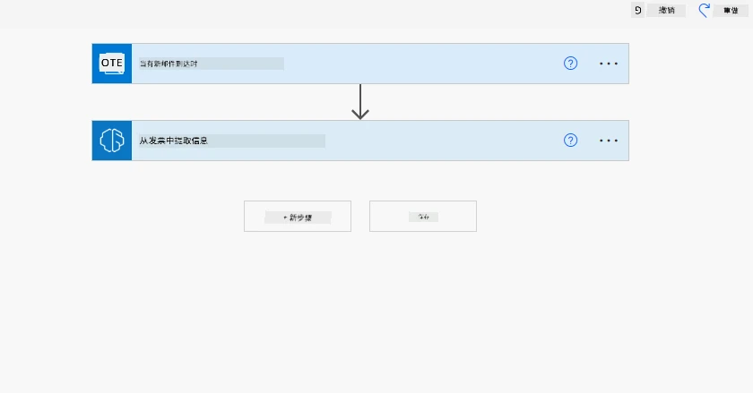

9. 点击 <strong>添加操作</strong> 按钮，搜索 **Dataverse**，选择 <strong>添加新行</strong> 操作。

10. 在 <strong>从发票提取信息</strong> 操作中，将 <strong>发票文件</strong> 更新为指向来自邮件的 <strong>附件内容</strong>。这确保流程从发票附件中提取信息。

11. 选择你之前创建的表。例如，可以选择 <strong>发票信息</strong> 表。使用前一个操作提供的动态内容填充以下字段：

    - ID
    - 金额
    - 日期
    - 名称
    - 状态 - 将 <strong>状态</strong> 设置为 <strong>待处理</strong>。
    - 供应商邮箱 - 使用 <strong>当有新邮件到达</strong> 触发器中的 <strong>发件人</strong> 动态内容。

    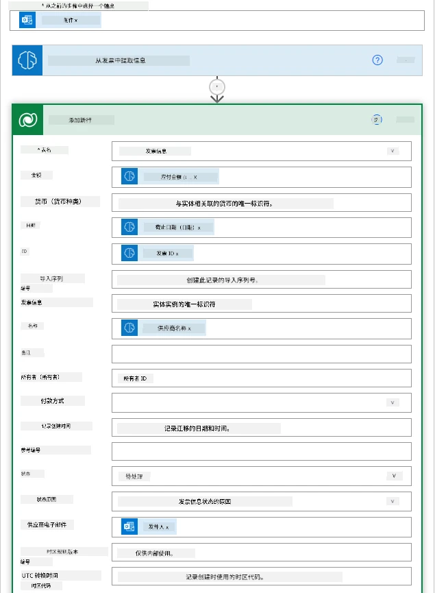

12. 完成流程后，点击 <strong>保存</strong> 按钮保存流程。然后你可以通过发送带发票的邮件到触发器指定的文件夹来测试流程。

> <strong>你的作业</strong>：你刚构建的流程是一个良好的开始，现在需要思考如何构建一个自动化流程，使财务团队可以向供应商发送邮件，更新其发票状态。提示：流程必须在发票状态更改时运行。

## 在 Power Automate 中使用文本生成 AI 模型

AI Builder 中的 GPT 创建文本 AI 模型可以基于提示生成文本，依托微软 Azure OpenAI 服务。借助此功能，你可以将 GPT（生成型预训练变换模型）技术集成到应用和流程中，构建多种自动化流程和智能应用。

GPT 模型经过大量数据的广泛训练，能基于提示生成与人类语言相似的文本。结合工作流自动化，像 GPT 这样的 AI 模型可以用来简化和自动化各种任务。

例如，你可以构建自动生成文本的流程，应用场景包括：邮件草稿、产品描述等。你也可以用模型为各种应用生成文本，比如聊天机器人和客服应用，帮助客服人员高效有效地响应客户咨询。

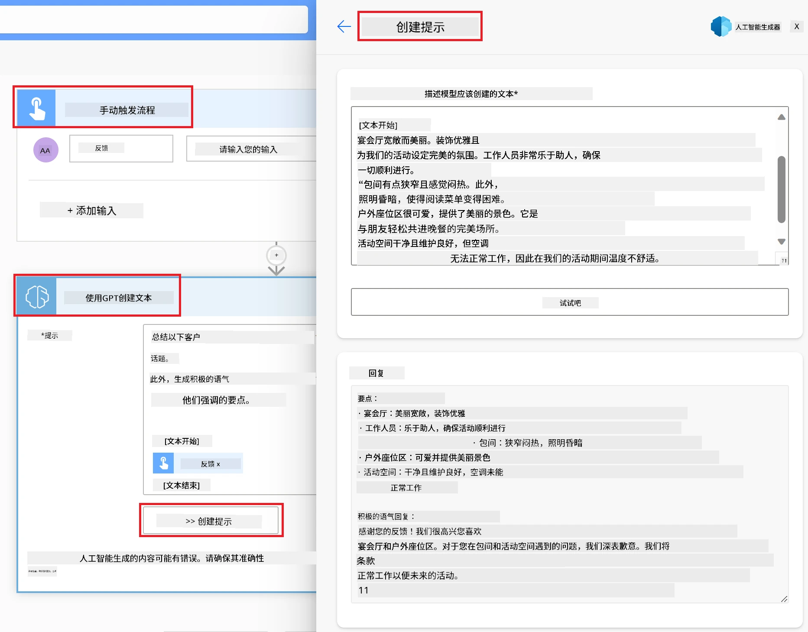

要了解如何在 Power Automate 中使用此 AI 模型，请学习 [使用 AI Builder 和 GPT 添加智能](https://learn.microsoft.com/training/modules/ai-builder-text-generation/?WT.mc_id=academic-109639-somelezediko) 模块。

## 干得好！继续学习吧

完成本课后，请查看我们的 [生成式 AI 学习合集](https://aka.ms/genai-collection?WT.mc_id=academic-105485-koreyst)，继续提升您的生成式 AI 知识！

想要定制并充分利用 Copilot？请探索 [Awesome Copilot](https://github.com/github/awesome-copilot?WT.mc_id=academic-105485-koreyst) —— 一个由社区贡献的指令、代理、技能和配置集合，帮助您最大化 GitHub Copilot 的使用价值。

请前往第 11 课，我们将探讨如何 [将生成式 AI 与函数调用集成](../11-integrating-with-function-calling/README.md?WT.mc_id=academic-105485-koreyst)！

---

<!-- CO-OP TRANSLATOR DISCLAIMER START -->
**免责声明**：
本文件由 AI 翻译服务 [Co-op Translator](https://github.com/Azure/co-op-translator) 翻译完成。尽管我们力求准确，但请注意，自动翻译可能包含错误或不准确之处。原始语言版文件应视为权威来源。对于重要信息，建议使用专业人工翻译。我们对因使用本翻译而产生的任何误解或误释不承担责任。
<!-- CO-OP TRANSLATOR DISCLAIMER END -->