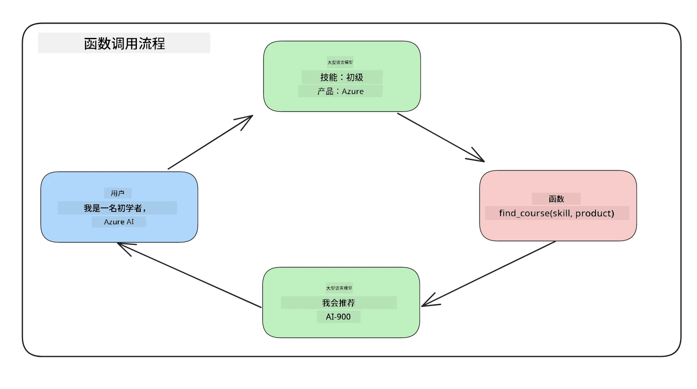
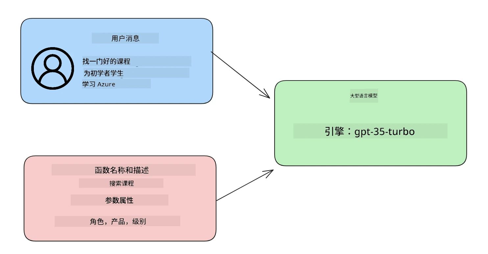

# 集成函数调用

[](https://youtu.be/DgUdCLX8qYQ?si=f1ouQU5HQx6F8Gl2)

到目前为止，你已经在之前的课程中学到了不少内容。然而，我们还可以进一步改进。一些我们可以解决的问题包括如何获得更一致的响应格式，以便更方便地在后续处理响应。此外，我们可能还想添加来自其他来源的数据，以进一步丰富我们的应用程序。

上述问题就是本章要解决的内容。

## 介绍

本课将涵盖：

- 解释什么是函数调用及其使用场景。
- 使用 Azure OpenAI 创建函数调用。
- 如何将函数调用集成到应用程序中。

## 学习目标

课程结束时，你将能够：

- 解释使用函数调用的目的。
- 使用 Azure OpenAI 服务设置函数调用。
- 设计适合你应用场景的有效函数调用。

## 场景：通过函数改进聊天机器人

在本课中，我们要为我们的教育初创公司构建一个功能，允许用户使用聊天机器人查找技术课程。我们将推荐符合他们技能水平、当前角色和感兴趣技术的课程。

为完成此场景，我们将结合使用：

- `Azure OpenAI` 为用户创建聊天体验。
- `Microsoft Learn Catalog API` 帮助用户基于请求查找课程。
- `函数调用` 将用户查询发送给函数以发起 API 请求。

现在开始，我们先来看为什么我们首先想要使用函数调用：

## 为什么使用函数调用

在函数调用出现之前，LLM 的响应是无结构和不一致的。开发者需要编写复杂的验证代码来确保能够处理每种响应变体。用户无法获得像“斯德哥尔摩当前天气如何？”这样的答案，因为模型受训练数据时间限制。

函数调用是 Azure OpenAI 服务的一个功能，用来克服以下限制：

- <strong>响应格式一致</strong>。如果我们可以更好地控制响应格式，就能更容易将响应集成到下游系统。
- <strong>外部数据</strong>。能够在聊天上下文中使用应用程序其他来源的数据。

## 通过场景说明问题

> 如果你想运行下面的场景，建议使用[本课附带的笔记本](./python/aoai-assignment.ipynb?WT.mc_id=academic-105485-koreyst)。你也可以边看边理解，我们旨在说明函数在解决该问题时的作用。

让我们来看一个说明响应格式问题的示例：

假设我们想创建一个学生数据数据库，以便向他们推荐合适的课程。以下是两个学生描述，数据非常相似。

1. 建立到我们的 Azure OpenAI 资源的连接：

   ```python
   import os
   import json
   from openai import OpenAI
   from dotenv import load_dotenv
   load_dotenv()

   # Responses API 由 Azure OpenAI（Microsoft Foundry）v1 端点提供服务
   # 因此我们将 OpenAI 客户端指向 <your-endpoint>/openai/v1/。
   endpoint = os.environ['AZURE_OPENAI_ENDPOINT']
   client = OpenAI(
   api_key=os.environ['AZURE_OPENAI_API_KEY'],
   base_url=f"{endpoint.rstrip('/')}/openai/v1/",
   )

   deployment=os.environ['AZURE_OPENAI_DEPLOYMENT']
   ```

   以下是配置 Azure OpenAI 连接的 Python 代码。因为我们使用的是 v1 端点，只需要设置 `api_key` 和 `base_url`（不需要 `api_version`）。

1. 使用变量 `student_1_description` 和 `student_2_description` 创建两个学生描述。

   ```python
   student_1_description="Emily Johnson is a sophomore majoring in computer science at Duke University. She has a 3.7 GPA. Emily is an active member of the university's Chess Club and Debate Team. She hopes to pursue a career in software engineering after graduating."

   student_2_description = "Michael Lee is a sophomore majoring in computer science at Stanford University. He has a 3.8 GPA. Michael is known for his programming skills and is an active member of the university's Robotics Club. He hopes to pursue a career in artificial intelligence after finishing his studies."
   ```

   我们想将上述学生描述发送给 LLM 以解析数据。该数据稍后可用于我们的应用程序，也可以发送至 API 或存储在数据库中。

1. 创建两个相同的提示，指导 LLM 我们关心哪些信息：

   ```python
   prompt1 = f'''
   Please extract the following information from the given text and return it as a JSON object:

   name
   major
   school
   grades
   club

   This is the body of text to extract the information from:
   {student_1_description}
   '''

   prompt2 = f'''
   Please extract the following information from the given text and return it as a JSON object:

   name
   major
   school
   grades
   club

   This is the body of text to extract the information from:
   {student_2_description}
   '''
   ```

   以上提示指导 LLM 提取信息并以 JSON 格式返回响应。

1. 设置好提示和 Azure OpenAI 连接后，我们现在通过 `client.responses.create` 将提示发送给 LLM。我们将提示存储在 `input` 变量中，并将角色分配为 `user`，以模拟用户发送给聊天机器人的消息。

   ```python
   # 来自提示一的响应
   openai_response1 = client.responses.create(
   model=deployment,
   input = [{'role': 'user', 'content': prompt1}],
   store=False,
   )
   openai_response1.output_text

   # 来自提示二的响应
   openai_response2 = client.responses.create(
   model=deployment,
   input = [{'role': 'user', 'content': prompt2}],
   store=False,
   )
   openai_response2.output_text
   ```

现在我们可以将两个请求都发送给 LLM，并通过 `openai_response1.output_text` 查看响应。

1. 最后，我们可以通过调用 `json.loads` 将响应转换为 JSON 格式：

   ```python
   # 以 JSON 对象加载响应
   json_response1 = json.loads(openai_response1.output_text)
   json_response1
   ```

   响应 1：

   ```json
   {
     "name": "Emily Johnson",
     "major": "computer science",
     "school": "Duke University",
     "grades": "3.7",
     "club": "Chess Club"
   }
   ```

   响应 2：

   ```json
   {
     "name": "Michael Lee",
     "major": "computer science",
     "school": "Stanford University",
     "grades": "3.8 GPA",
     "club": "Robotics Club"
   }
   ```

   尽管提示相同且描述类似，我们发现 `Grades` 属性的值格式不统一，有时是`3.7`，有时是 `3.7 GPA`。

   这是因为 LLM 接受的是无结构的文本提示，返回的也是无结构数据。我们需要结构化格式，这样才能在存储或使用数据时明确预期。

那么我们如何解决格式问题呢？通过使用函数调用，我们可以确保收到结构化数据。使用函数调用时，LLM 并不会真正调用或运行任何函数。相反，我们为 LLM 创建一个响应结构，让它按此结构返回结果。我们随后利用这些结构化响应，决定应用中调用哪个函数。



然后我们可以将函数返回的内容发送回 LLM，LLM 会使用自然语言回答用户的问题。

## 函数调用的使用场景

有许多场景中函数调用可以提升你的应用，比如：

- <strong>调用外部工具</strong>。聊天机器人用来回答用户问题很出色。通过函数调用，聊天机器人可以利用用户消息完成某些任务。例如，学生可以让聊天机器人“给我的老师发封邮件，说我需要关于这门课的更多帮助”。这会调用函数 `send_email(to: string, body: string)`。

- **创建 API 或数据库查询**。用户可以使用自然语言查找信息，转换成格式化查询或 API 请求。例如，教师请求“谁完成了最后一次作业？”时，可以调用函数 `get_completed(student_name: string, assignment: int, current_status: string)`。

- <strong>生成结构化数据</strong>。用户可以提交一段文本或 CSV，使用 LLM 提取重要信息。例如，学生可以将关于和平协议的维基百科文章转换为 AI 闪卡。此操作可通过函数 `get_important_facts(agreement_name: string, date_signed: string, parties_involved: list)` 实现。

## 创建第一个函数调用

创建函数调用的过程包括三个主要步骤：

1. 使用函数（工具）列表和用户消息调用响应 API。
2. 读取模型的响应以执行某个操作，例如调用函数或 API。
3. 使用函数响应再次调用响应 API，利用这些信息生成对用户的回复。



### 第一步 - 创建消息

第一步是创建一个用户消息。该值可以动态赋值，例如取自文本输入，也可以直接赋值。如果是首次使用响应 API，需要定义消息的 `role` 和 `content`。

`role` 可以是 `system`（创建规则），`assistant`（模型）或 `user`（终端用户）。在函数调用中，我们将此设置为 `user` 并给出示例问题。

```python
messages= [ {"role": "user", "content": "Find me a good course for a beginner student to learn Azure."} ]
```

通过分配不同角色，LLM 会清楚是系统说话还是用户说话，从而建立可供 LLM 构建的对话历史。

### 第二步 - 创建函数

接下来，我们定义一个函数及其参数。这里仅用一个名为 `search_courses` 的函数，你也可以创建多个函数。

> <strong>重要</strong>：函数包含在发送给 LLM 的系统消息中，会占用可用的 token 数量。

下方以数组形式创建函数。每个元素是响应 API 中的工具，具有属性 `type`、`name`、`description` 和 `parameters`：

```python
functions = [
   {
      "type":"function",
      "name":"search_courses",
      "description":"Retrieves courses from the search index based on the parameters provided",
      "parameters":{
         "type":"object",
         "properties":{
            "role":{
               "type":"string",
               "description":"The role of the learner (i.e. developer, data scientist, student, etc.)"
            },
            "product":{
               "type":"string",
               "description":"The product that the lesson is covering (i.e. Azure, Power BI, etc.)"
            },
            "level":{
               "type":"string",
               "description":"The level of experience the learner has prior to taking the course (i.e. beginner, intermediate, advanced)"
            }
         },
         "required":[
            "role"
         ]
      }
   }
]
```

下面详细描述函数实例的各个部分：

- `name` - 函数名称。
- `description` - 函数功能说明，需具体清晰。
- `parameters` - 希望模型在响应中产生的值和格式。参数数组包含以下属性：
  1. `type` - 属性存储的数据类型。
  1. `properties` - 模型将在响应中使用的具体值列表。
      1. `name` - 属性键名，例如 `product`。
      1. `type` - 该属性的数据类型，例如 `string`。
      1. `description` - 属性说明。

此外，还有一个可选属性 `required` - 函数调用必需的属性。

### 第三步 - 进行函数调用

定义函数后，需要在调用响应 API 时包含它。可通过将 `tools` 设置为 `functions` 实现。

还有一个选项是将 `tool_choice` 设置为 `auto`，即由 LLM 根据用户消息决定调用哪个函数，而非手动分配。

下面是调用 `client.responses.create` 的代码示例，注意设置了 `tools=functions` 和 `tool_choice="auto"`，让 LLM 自行决定调用函数时机：

```python
response = client.responses.create(model=deployment,
                                        input=messages,
                                        tools=functions,
                                        tool_choice="auto",
                                        store=False)

print(response.output)
```

现在返回的响应中，在 `response.output` 中包含了一个 `function_call` 项，看起来如下：

```json
{
  "type": "function_call",
  "name": "search_courses",
  "call_id": "call_abc123",
  "arguments": "{\n  \"role\": \"student\",\n  \"product\": \"Azure\",\n  \"level\": \"beginner\"\n}"
}
```

在这里我们可以看到函数 `search_courses` 被调用了，带的参数在 JSON 响应的 `arguments` 属性中列出。

LLM 能提取数据填充函数参数，是因为它从传入响应 API 的 `input` 参数的值中抽取相应信息。下面是 `messages` 的提醒：

```python
messages= [ {"role": "user", "content": "Find me a good course for a beginner student to learn Azure."} ]
```

如你所见，`student`、`Azure` 和 `beginner` 从 `messages` 中提取并设置为函数输入。通过函数调用提取信息是一种很棒的方式，同时也给 LLM 提供了结构化和可重用功能。

接下来，我们看看如何在应用程序中使用它。

## 将函数调用集成到应用中

在测试了 LLM 返回的结构化响应后，我们现在可以将其集成到应用中。

### 流程管理

集成到应用中，我们采取以下步骤：

1. 首先，调用 OpenAI 服务，从响应 `output` 中提取函数调用项。

   ```python
   response_items = response.output
   tool_calls = [item for item in response_items if item.type == "function_call"]
   ```

1. 现在定义调用 Microsoft Learn API 以获取课程列表的函数：

   ```python
   import requests

   def search_courses(role, product, level):
     url = "https://learn.microsoft.com/api/catalog/"
     params = {
        "role": role,
        "product": product,
        "level": level
     }
     response = requests.get(url, params=params)
     modules = response.json()["modules"]
     results = []
     for module in modules[:5]:
        title = module["title"]
        url = module["url"]
        results.append({"title": title, "url": url})
     return str(results)
   ```

   注意我们现在创建了实际的 Python 函数，对应 `functions` 变量中的函数名称。我们实际上调用外部 API 拉取数据，这里是对 Microsoft Learn API 搜索培训模块。

好的，创建了 `functions` 变量和对应的 Python 函数，我们如何告诉 LLM 将二者映射，使我们的 Python 函数被调用？

1. 判断是否调用 Python 函数，需要查看 LLM 响应中是否包含 `function_call` 条目，并调用相应函数。下面是检查代码示例：

   ```python
   # 检查模型是否想调用一个函数
   if tool_calls:
    for tool_call in tool_calls:
     print("Recommended Function call:")
     print(tool_call.name)
     print()

     # 调用该函数。
     function_name = tool_call.name

     available_functions = {
             "search_courses": search_courses,
     }
     function_to_call = available_functions[function_name]

     function_args = json.loads(tool_call.arguments)
     function_response = function_to_call(**function_args)

     print("Output of function call:")
     print(function_response)
     print(type(function_response))

     # 将函数调用及其结果添加回对话中。
     # 模型的 function_call 项必须附加在其输出之前。
     messages.append(tool_call)  # 助手的 function_call 项
     messages.append( # 函数结果
         {
             "type": "function_call_output",
             "call_id": tool_call.call_id,
             "output": function_response,
         }
     )
   ```

   这三行代码能确保提取函数名、参数并执行调用：

   ```python
   function_to_call = available_functions[function_name]

   function_args = json.loads(tool_call.arguments)
   function_response = function_to_call(**function_args)
   ```

   以下是运行以上代码的输出：

   <strong>输出</strong>

   ```Recommended Function call:
   {
     "name": "search_courses",
     "arguments": "{\n  \"role\": \"student\",\n  \"product\": \"Azure\",\n  \"level\": \"beginner\"\n}"
   }

   Output of function call:
   [{'title': 'Describe concepts of cryptography', 'url': 'https://learn.microsoft.com/training/modules/describe-concepts-of-cryptography/?
   WT.mc_id=api_CatalogApi'}, {'title': 'Introduction to audio classification with TensorFlow', 'url': 'https://learn.microsoft.com/en-
   us/training/modules/intro-audio-classification-tensorflow/?WT.mc_id=api_CatalogApi'}, {'title': 'Design a Performant Data Model in Azure SQL
   Database with Azure Data Studio', 'url': 'https://learn.microsoft.com/training/modules/design-a-data-model-with-ads/?
   WT.mc_id=api_CatalogApi'}, {'title': 'Getting started with the Microsoft Cloud Adoption Framework for Azure', 'url':
   'https://learn.microsoft.com/training/modules/cloud-adoption-framework-getting-started/?WT.mc_id=api_CatalogApi'}, {'title': 'Set up the
   Rust development environment', 'url': 'https://learn.microsoft.com/training/modules/rust-set-up-environment/?WT.mc_id=api_CatalogApi'}]
   <class 'str'>
   ```

1. 现在我们将更新后的消息 `messages` 发送到 LLM，以获得自然语言响应，而非 API JSON 格式响应。

   ```python
   print("Messages in next request:")
   print(messages)
   print()

   second_response = client.responses.create(
      input=messages,
      model=deployment,
      tool_choice="auto",
      tools=functions,
      temperature=0,
      store=False,
         )  # 从模型获取一个新的响应，其中它可以看到函数的响应


   print(second_response.output_text)
   ```

   <strong>输出</strong>

   ```text
   I found some good courses for beginner students to learn Azure:

   1. [Describe concepts of cryptography](https://learn.microsoft.com/training/modules/describe-concepts-of-cryptography/?WT.mc_id=api_CatalogApi)
   2. [Introduction to audio classification with TensorFlow](https://learn.microsoft.com/training/modules/intro-audio-classification-tensorflow/?WT.mc_id=api_CatalogApi)
   3. [Design a Performant Data Model in Azure SQL Database with Azure Data Studio](https://learn.microsoft.com/training/modules/design-a-data-model-with-ads/?WT.mc_id=api_CatalogApi)
   4. [Getting started with the Microsoft Cloud Adoption Framework for Azure](https://learn.microsoft.com/training/modules/cloud-adoption-framework-getting-started/?WT.mc_id=api_CatalogApi)
   5. [Set up the Rust development environment](https://learn.microsoft.com/training/modules/rust-set-up-environment/?WT.mc_id=api_CatalogApi)

   You can click on the links to access the courses.
   ```

## 作业

如需继续学习 Azure OpenAI 函数调用，可以构建：

- 更多功能参数，帮助学习者发现更多课程。

- 创建另一个函数调用，从学习者那里获取更多信息，比如他们的母语
- 在函数调用和/或 API 调用未返回任何合适课程时，创建错误处理

提示：请参阅 [Learn API 参考文档](https://learn.microsoft.com/training/support/catalog-api-developer-reference?WT.mc_id=academic-105485-koreyst) 页面，了解这些数据如何以及在哪里可用。

## 干得好！继续前行

完成本课后，查看我们的 [生成式 AI 学习集合](https://aka.ms/genai-collection?WT.mc_id=academic-105485-koreyst)，继续提升您的生成式 AI 知识！

前往第12课，我们将学习如何为 AI 应用设计 [用户体验](../12-designing-ux-for-ai-applications/README.md?WT.mc_id=academic-105485-koreyst)！

---

<!-- CO-OP TRANSLATOR DISCLAIMER START -->
**免责声明**：
本文件由 AI 翻译服务 [Co-op Translator](https://github.com/Azure/co-op-translator) 翻译完成。尽管我们力求准确，但请注意，自动翻译可能包含错误或不准确之处。原始语言版文件应视为权威来源。对于重要信息，建议使用专业人工翻译。我们对因使用本翻译而产生的任何误解或误释不承担责任。
<!-- CO-OP TRANSLATOR DISCLAIMER END -->