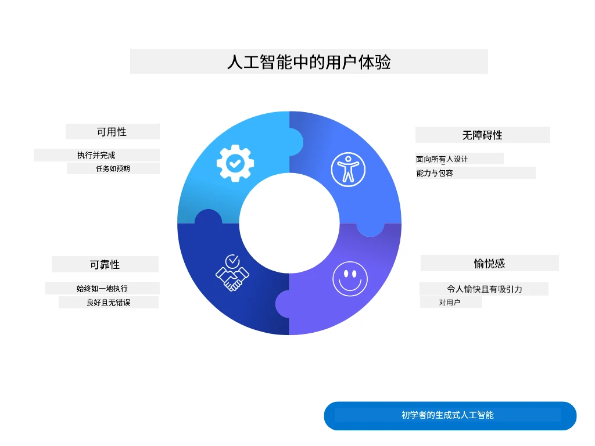
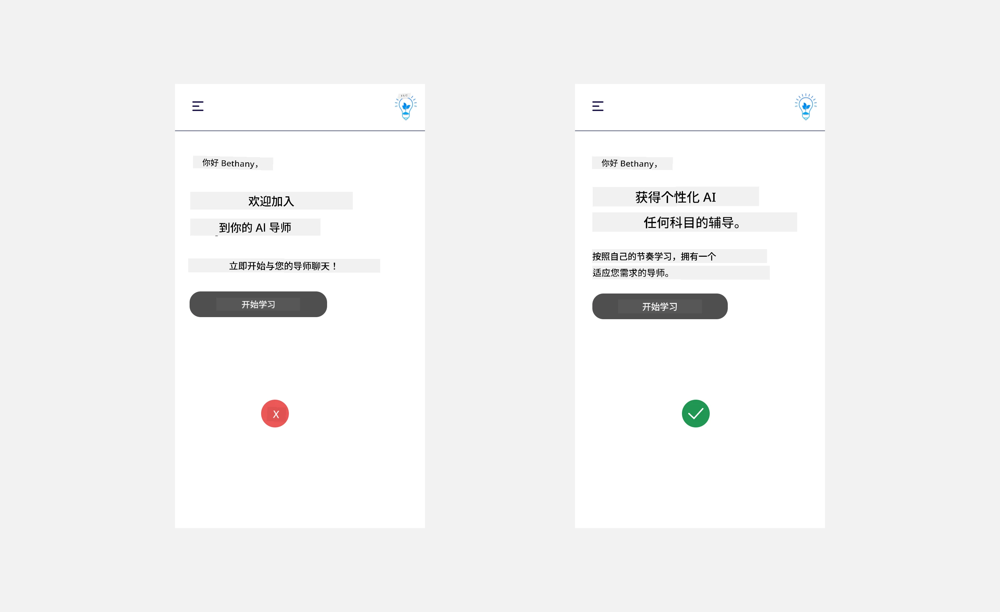
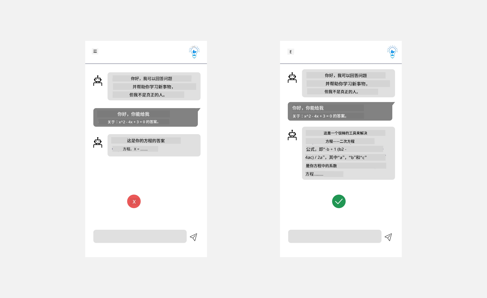
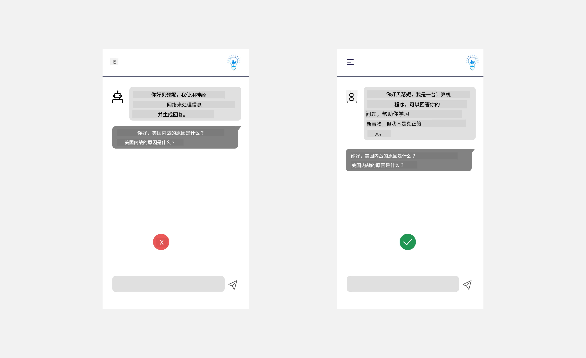
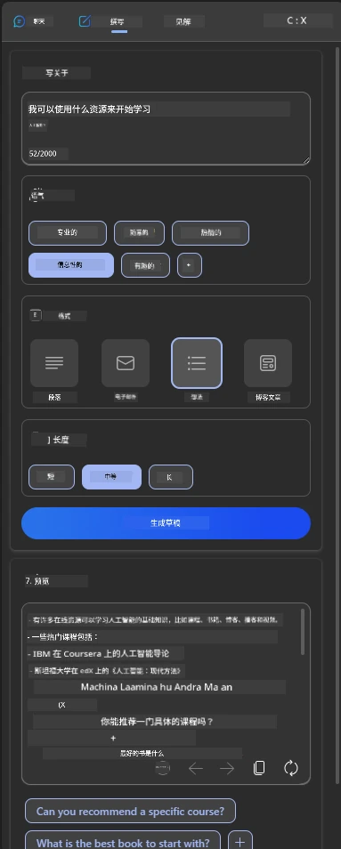
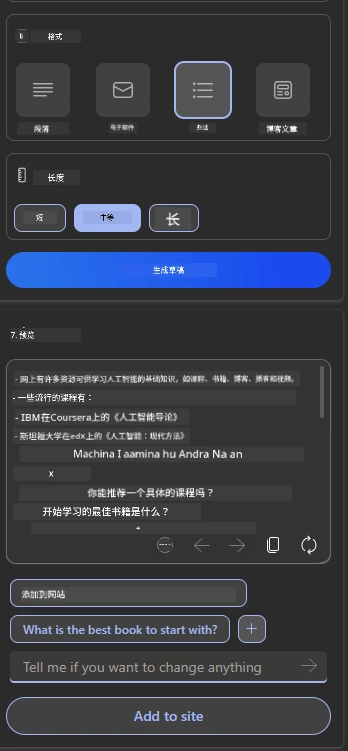
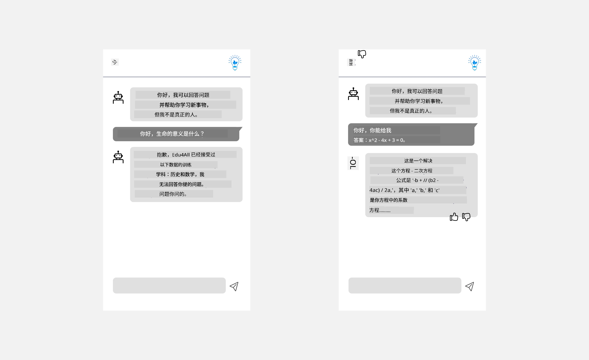

# 为 AI 应用设计用户体验

> _(点击上方图片查看本课视频)_

用户体验是构建应用程序非常重要的一个方面。用户需要能够高效地使用你的应用来完成任务。高效是其一，但你还需要设计能被所有人使用的应用，使其具有_可访问性_。本章将重点关注这一领域，希望你最终设计出的应用既能被人们使用，也受到欢迎。

## 介绍

用户体验指的是用户如何与特定产品或服务（无论是系统、工具还是设计）进行交互和使用。在开发 AI 应用时，开发者不仅关注用户体验的有效性，还关注其伦理性。本课将介绍如何构建满足用户需求的人工智能（AI）应用。

本课将涵盖以下内容：

- 用户体验简介与理解用户需求
- 为信任与透明度设计 AI 应用
- 为协作与反馈设计 AI 应用

## 学习目标

完成本课后，你将能够：

- 理解如何构建满足用户需求的 AI 应用。
- 设计促进信任与协作的 AI 应用。

### 先决条件

花些时间阅读更多有关[用户体验与设计思维](https://learn.microsoft.com/training/modules/ux-design?WT.mc_id=academic-105485-koreyst)的内容。

## 用户体验简介与理解用户需求

在我们虚构的教育初创公司中，有两类主要用户，老师和学生。每类用户都有其独特需求。以用户为中心的设计优先考虑用户，确保产品对其目标用户相关且有用。

应用应具备<strong>实用、可靠、可访问且让人愉悦</strong>的特性，以提供良好的用户体验。

### 易用性

实用意味着应用的功能符合其预期用途，比如自动评分或生成复习闪卡。自动评分应用应能根据预设标准准确高效地评分。类似地，生成复习闪卡的应用应能基于数据生成相关且多样化的问题。

### 可靠性

可靠意味着应用能持续且无误地执行任务。但 AI 和人类一样不完美，可能出错。应用可能遇到错误或意外情况，需要人工干预或纠正。你如何处理错误？本课最后部分将讲述如何设计 AI 系统与应用以支持协作与反馈。

### 可访问性

可访问性意味着将用户体验扩展到各种能力层面的用户，包括残疾人士，确保没有人被排除。遵循可访问性准则和原则，使 AI 解决方案更具包容性、易用且对所有用户有益。

### 愉悦感

愉悦感意味着应用使用起来令人愉快。吸引人的用户体验可积极影响用户，鼓励他们再次使用应用，提升业务收入。

不是所有挑战都能用 AI 解决。AI 用于增强你的用户体验，比如自动化手动任务或个性化用户体验。

## 为信任与透明度设计 AI 应用

构建信任是设计 AI 应用的关键。信任确保用户相信应用能完成任务，持续提供所需结果。风险在于不信任或过度信任。不信任指用户对 AI 系统几乎没有信任，导致拒绝使用应用；过度信任指用户高估 AI 系统能力，过于依赖它。例如，过度信任自动评分系统可能使教师不检查部分试卷，导致学生成绩不公或错过反馈与改进机会。

确保信任成为设计核心的两种方法是可解释性和控制。

### 可解释性

当 AI 帮助做出决策，如向未来一代传授知识时，教师和家长理解 AI 如何做出决策至关重要。这即是可解释性——理解 AI 应用如何决定。设计可解释性包括增加细节，突出 AI 如何得出结果。受众应知道输出是由 AI 生成而非人工。例如，不说“现在开始与导师聊天”，而说“使用适应你需求并帮助你按节奏学习的 AI 导师。”

另一个示例是 AI 如何使用用户及个人数据。例如，学生角色的用户可能受限于其角色。AI 不一定能直接透露答案，但可引导用户思考解题方法。

可解释性的最后一个关键部分是简化解释。学生和教师可能不是 AI 专家，因此应用的能力或限制解释应简单易懂。

### 控制

生成式 AI 创建了 AI 与用户间的协作，例如用户可修改提示以获得不同结果。此外，生成输出后，用户应能修改结果，从而感受到控制权。例如，使用 Microsoft Copilot（前身 Bing Chat）时，可根据格式、语气和长度定制提示。还可以对输出做出更改和调整，如下所示：

Microsoft Copilot 的另一项用户控制功能是允许选择是否让 AI 使用其数据。对于学校应用，学生可能想使用自己的笔记和老师的资源作为复习材料。

> 设计 AI 应用时，意图性是关键，确保用户不会对 AI 抱有过高期望。一个方法是在提示和结果之间制造摩擦，提醒用户这是 AI，而非真人。

## 为协作与反馈设计 AI 应用

如前所述，生成式 AI 创造了用户与 AI 之间的协作。多数互动是用户输入提示，AI 生成输出。如果输出错误，应用如何处理错误？AI 会责怪用户吗？还是会解释错误原因？

AI 应用应内置接收和提供反馈的机制。这不仅帮助 AI 系统改进，还能建立用户信任。设计中应包含反馈循环，例如对输出的简单点赞或踩。

另一种处理方式是清晰传达系统能力及限制。当用户请求超出 AI 能力范围时，应有相应处理方法，如下所示。

系统错误在应用中常见，用户可能需要 AI 范围外的帮助，或应用对生成摘要的问题/主题有数量限制。例如，训练数据仅包含历史和数学的 AI 应用可能无法回答地理问题。为缓解此问题，AI 系统可以响应：“抱歉，我们产品仅训练了以下学科的数据……，无法回答您提出的问题。”

AI 应用并不完美，因此不可避免会出错。设计应用时，应确保留有用户反馈和错误处理的空间，且方式简单易懂。

## 练习任务

以你迄今构建的任何 AI 应用为例，考虑在应用中实施以下步骤：

- **愉悦感：** 考虑如何让你的应用更愉悦。你是否在到处添加解释？是否鼓励用户探索？错误信息如何表述？

- **易用性：** 构建网页应用。确保应用可用鼠标和键盘导航。

- **信任与透明度：** 不要完全信任 AI 及其输出，考虑如何加入人工流程验证输出。还要考虑并实施实现信任与透明度的其他方法。

- **控制：** 让用户控制他们提供给应用的数据。实现用户可选择加入或退出 AI 应用中的数据收集的机制。

<!-- ## [课后测验](../../../12-designing-ux-for-ai-applications/quiz-url) -->

## 继续学习！

完成本课后，查看我们的[生成式 AI 学习合集](https://aka.ms/genai-collection?WT.mc_id=academic-105485-koreyst)，继续提升你的生成式 AI 知识！

前往第 13 课，我们将探讨如何[保障 AI 应用安全](../13-securing-ai-applications/README.md?WT.mc_id=academic-105485-koreyst)！

---

<!-- CO-OP TRANSLATOR DISCLAIMER START -->
**免责声明**：
本文件由 AI 翻译服务 [Co-op Translator](https://github.com/Azure/co-op-translator) 翻译完成。尽管我们力求准确，但请注意，自动翻译可能包含错误或不准确之处。原始语言版文件应视为权威来源。对于重要信息，建议使用专业人工翻译。我们对因使用本翻译而产生的任何误解或误释不承担责任。
<!-- CO-OP TRANSLATOR DISCLAIMER END -->