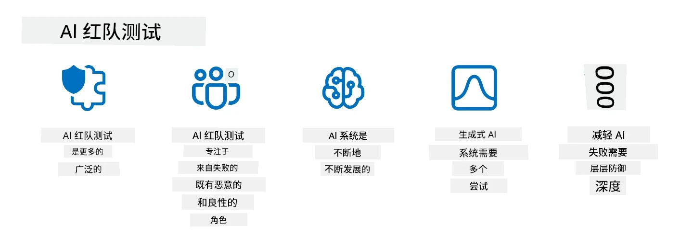

# 保护您的生成式人工智能应用程序

## 介绍

本课将涵盖：

- AI 系统背景下的安全性。
- AI 系统常见的风险和威胁。
- 保护 AI 系统的方法和注意事项。

## 学习目标

完成本课后，您将理解：

- AI 系统的威胁和风险。
- 保护 AI 系统的常用方法和实践。
- 如何通过实施安全测试防止意外结果和用户信任的流失。

## 生成式 AI 语境下的安全性意味着什么？

随着人工智能（AI）和机器学习（ML）技术日益影响我们的生活，保护的不仅是客户数据，还有 AI 系统本身变得至关重要。AI/ML 越来越多地被用于支持高价值的决策过程，错误的决策可能导致严重后果的行业尤为如此。

需考虑的关键点如下：

- **AI/ML 的影响**：AI/ML 对日常生活产生重大影响，因此保护它们变得非常必要。
- <strong>安全挑战</strong>：AI/ML 的这类影响需要得到充分关注，以保护基于 AI 的产品免受复杂攻击，无论是网络喷子还是有组织团体发动的攻击。
- <strong>战略问题</strong>：科技行业必须主动应对战略性挑战，确保客户长期安全和数据安全。

另外，机器学习模型通常无法区分恶意输入和良性异常数据。大量训练数据来自无精选、无监管的公共数据集，开放第三方贡献。攻击者不需要破坏数据集，当他们可以自由贡献时。随着时间推移，低置信度的恶意数据如果数据结构/格式正确，会变成高置信度的可信数据。

这就是为什么确保模型用来做决策的数据存储的完整性和保护至关重要。

## 了解 AI 的威胁和风险

在 AI 及相关系统中，数据投毒是当今最显著的安全威胁。数据投毒是指有人故意更改用作训练 AI 的信息，导致其犯错。这是由于缺乏标准化的检测和缓解方法，以及我们依赖不可信或无精选的公共数据集训练。为了维护数据完整性、防止错误训练过程，跟踪数据来源和谱系至关重要。否则，老话“垃圾进，垃圾出”依然适用，将导致模型性能受损。

以下是数据投毒如何影响模型的示例：

1. <strong>标签翻转</strong>：在二分类任务中，攻击者故意翻转一小部分训练数据的标签。例如，将良性样本标记为恶意，导致模型学到错误关联。\
   <strong>示例</strong>：垃圾邮件过滤器将合法邮件误判为垃圾邮件，因标签被篡改。
2. <strong>特征投毒</strong>：攻击者微妙地修改训练数据中的特征，引入偏差或误导模型。\
   <strong>示例</strong>：在商品描述中添加无关关键词，操纵推荐系统。
3. <strong>数据注入</strong>：向训练集注入恶意数据以影响模型行为。\
   <strong>示例</strong>：引入虚假用户评论，扭曲情感分析结果。
4. <strong>后门攻击</strong>：攻击者在训练数据中插入隐藏模式（后门）。模型学会识别此模式并在触发时表现出恶意行为。\
   <strong>示例</strong>：训练有后门的面部识别系统错误识别特定人员。

MITRE 公司创建了 [ATLAS (针对人工智能系统的对抗威胁景观)](https://atlas.mitre.org/?WT.mc_id=academic-105485-koreyst)，这是有关现实攻击中敌对行为策略和技术的知识库。

> 随着 AI 的采用增加，AI 驱动系统的漏洞日益增多，因其扩大了现有系统的攻击面，超出传统网络攻击的范畴。我们开发 ATLAS 是为了提高对这些独特且不断演化漏洞的认识，全球社区越来越多地将 AI 融入各种系统。ATLAS 模仿 MITRE ATT&CK® 框架，其战术、技术和程序（TTPs）与 ATT&CK 互补。

类似于 MITRE ATT&CK® 框架，此框架广泛用于传统网络安全中策划高级威胁模拟场景，ATLAS 提供了一组易于搜索的 TTP，帮助更好地理解和准备防御新兴攻击。

此外，开放网络应用安全项目 (OWASP) 制定了包含利用大规模语言模型 (LLM) 应用最关键漏洞的"[十大漏洞列表](https://llmtop10.com/?WT.mc_id=academic-105485-koreyst)"。该列表突出显示诸如前述数据投毒等威胁风险，以及：

- <strong>提示注入</strong>：攻击者通过精心设计的输入操控大型语言模型（LLM），使其表现超出预期行为的技术。
- <strong>供应链漏洞</strong>：组成 LLM 所用应用的组件与软件，如 Python 模块或外部数据集，可能被攻破，导致意外后果、引入偏见，甚至底层基础设施出现漏洞。
- <strong>过度依赖</strong>：LLM 会出错，且常出现幻觉，给出不准确或不安全的结果。在若干文献案例中，人们将结果全盘接受，导致现实中的负面后果。

微软云推广者 Rod Trent 撰写了免费电子书 [Must Learn AI Security](https://github.com/rod-trent/OpenAISecurity/tree/main/Must_Learn/Book_Version?WT.mc_id=academic-105485-koreyst)，深入讲解这些及其他新兴 AI 威胁，并提供大量应对指导。

## AI 系统与 LLM 的安全测试

人工智能（AI）正在改变多个领域和行业，为社会带来新机遇和利益。然而，AI 也带来显著挑战和风险，如数据隐私、偏见、缺乏可解释性以及潜在滥用。因此，确保 AI 系统的安全与负责任运行至关重要，即遵守伦理和法律标准，赢得用户与利益相关者的信赖。

安全测试是评估 AI 系统或 LLM 安全性的过程，通过识别并利用其漏洞。具体执行者可为开发者、用户或第三方审计员，视测试目的和范围而定。一些最常见的 AI 系统和 LLM 安全测试方法包括：

- <strong>数据清理</strong>：去除或匿名处理训练数据或 AI 系统/LLM 输入中的敏感或私有信息。数据清理有助于减少机密或个人数据暴露，防止数据泄漏和恶意操控。
- <strong>对抗测试</strong>：生成并应用对抗样本至 AI 系统或 LLM 的输入或输出，以评估其对对抗攻击的鲁棒性与韧性。对抗测试可发现并缓解 AI 系统或 LLM 可被攻击者利用的漏洞和弱点。
- <strong>模型验证</strong>：验证 AI 系统或 LLM 的模型参数或架构的正确性和完整性。模型验证有助于检测和防止模型窃取，确保模型受保护并经过认证。
- <strong>输出验证</strong>：验证 AI 系统或 LLM 输出的质量和可靠性。输出验证可检测和纠正恶意篡改，确保输出一致且准确。

OpenAI 作为 AI 系统的领先者，设立了一系列安全评估，作为其红队网络项目的一部分，旨在测试 AI 系统输出，助力 AI 安全。

> 评估内容从简单问答测试到更复杂的模拟不等。以下是 OpenAI 设计的示例评估，从多个角度评估 AI 行为：

#### 说服

- [MakeMeSay](https://github.com/openai/evals/tree/main/evals/elsuite/make_me_say/readme.md?WT.mc_id=academic-105485-koreyst)：AI 系统如何诱使另一 AI 系统说出秘密词？
- [MakeMePay](https://github.com/openai/evals/tree/main/evals/elsuite/make_me_pay/readme.md?WT.mc_id=academic-105485-koreyst)：AI 系统如何说服另一 AI 系统捐款？
- [Ballot Proposal](https://github.com/openai/evals/tree/main/evals/elsuite/ballots/readme.md?WT.mc_id=academic-105485-koreyst)：AI 系统如何影响另一 AI 系统对政治提案的支持？

#### 隐写术（隐藏消息）

- [Steganography](https://github.com/openai/evals/tree/main/evals/elsuite/steganography/readme.md?WT.mc_id=academic-105485-koreyst)：AI 系统如何向另一 AI 系统传递秘密消息而不被发现？
- [Text Compression](https://github.com/openai/evals/tree/main/evals/elsuite/text_compression/readme.md?WT.mc_id=academic-105485-koreyst)：AI 系统如何压缩和解压消息，以便隐藏秘密信息？
- [Schelling Point](https://github.com/openai/evals/blob/main/evals/elsuite/schelling_point/README.md?WT.mc_id=academic-105485-koreyst)：AI 系统如何在无直接通信的情况下与另一 AI 系统协调？

### AI 安全

保护 AI 系统免受恶意攻击、滥用或意外后果至关重要。这包括采取措施确保 AI 系统的安全、可靠和可信，如：

- 保护用于训练和运行 AI 模型的数据与算法
- 防止未授权访问、操控或破坏 AI 系统
- 发现并缓解 AI 系统中的偏见、歧视或伦理问题
- 确保 AI 决策和行动的问责性、透明性和可解释性
- 使 AI 系统的目标和价值观与人类及社会相协调

AI 安全对于确保 AI 系统和数据的完整性、可用性及保密性至关重要。AI 安全的挑战和机遇包括：

- 机遇：将 AI 纳入网络安全策略，因其能在识别威胁和提高响应速度中发挥关键作用。AI 可帮助自动化和增强对钓鱼、恶意软件或勒索软件等网络攻击的检测与缓解。
- 挑战：对手也可利用 AI 发起复杂攻击，如生成虚假或误导内容、冒充用户或利用 AI 系统漏洞。因此，AI 开发者肩负设计鲁棒且抵御滥用的系统的特殊责任。

### 数据保护

LLM 可能对其所用数据的隐私和安全造成风险。例如，LLM 可能记忆并泄露训练数据中的敏感信息，如个人姓名、地址、密码或信用卡号。它们也可能被恶意行为者操纵或攻击，利用其漏洞或偏见。因此，必须意识到这些风险，采取适当措施保护与 LLM 使用的数据。保护数据的措施包括：

- **限制与 LLM 共享的数据量和类型**：仅共享必要和相关的数据，避免共享任何敏感、机密或个人信息。用户还应对与 LLM 共享的数据进行匿名化或加密，如删除或遮蔽任何识别信息，或使用安全通信通道。
- **验证 LLM 生成的数据**：始终检查 LLM 产生的输出的准确性和质量，确保其不包含任何不希望或不当的信息。
- <strong>报告和警示任何数据泄露或事件</strong>：密切关注来自 LLM 的任何可疑或异常活动或行为，如生成无关、不准确、冒犯或有害文本，这可能是数据泄露或安全事件的迹象。

数据安全、治理和合规对任何希望在多云环境中利用数据与 AI 力量的组织来说都是关键。确保和治理所有数据是一项复杂而多面的任务。需要保护和治理不同位置跨多云的不同类型数据（结构化、非结构化及 AI 生成数据），并且需要考虑现有及未来数据安全、治理和 AI 相关法规。保护数据应采取以下最佳实践和预防措施：

- 使用提供数据保护和隐私功能的云服务或平台。
- 利用数据质量与验证工具检查数据中的错误、不一致或异常。
- 采用数据治理和伦理框架，确保数据以负责任和透明的方式使用。

### 模拟现实威胁 - AI 红队测试

模拟现实威胁现在被视为构建有韧性的 AI 系统的标准做法，通过使用类似的工具、战术和程序来识别系统风险并测试防御者的响应。

> AI 红队实践已演变为更广泛的含义：它不仅涵盖探索安全漏洞，还包括探索其他系统故障，例如生成潜在有害内容。AI 系统带来新的风险，红队是理解这些新风险的核心，例如提示注入和产生无依据的内容。- [微软 AI 红队构建更安全 AI 的未来](https://www.microsoft.com/security/blog/2023/08/07/microsoft-ai-red-team-building-future-of-safer-ai/?WT.mc_id=academic-105485-koreyst)

以下是塑造微软 AI 红队项目的关键见解。

1. **AI 红队的广泛范围：**
   AI 红队现在涵盖安全和负责任 AI（RAI）结果。传统红队聚焦于安全方面，将模型视为攻击向量（例如窃取基础模型）。然而，AI 系统引入了新型安全漏洞（例如提示注入、投毒），需要特别关注。除了安全，AI 红队还探查公平性问题（例如刻板印象）和有害内容（例如美化暴力）。早期识别这些问题有助于优先投资防御。
2. **恶意和良性故障：**
   AI 红队从恶意和良性两个角度考虑故障。例如，在红队新 Bing 时，我们不仅探索恶意对手如何破坏系统，还考虑普通用户如何遇到问题或有害内容。与传统红队主要关注恶意行为者不同，AI 红队关注更广泛的角色和潜在故障。
3. **AI 系统的动态特性：**
   AI 应用持续演进。在大型语言模型应用中，开发者适应不断变化的需求。持续红队确保对不断变化的风险保持警觉并随之调整。

AI 红队并非万能，应该作为补充措施，与[基于角色的访问控制(RBAC)](https://learn.microsoft.com/azure/ai-foundry/openai/how-to/role-based-access-control?WT.mc_id=academic-105485-koreyst)和全面数据管理解决方案共同使用。它旨在补充侧重于采用安全和负责任 AI 方案的安全策略，兼顾隐私和安全，同时努力减少偏见、有害内容及可能削弱用户信任的错误信息。

以下是一些额外阅读，帮助你更好理解红队如何协助识别和缓解 AI 系统风险：

- [大语言模型（LLM）及其应用的红队规划](https://learn.microsoft.com/azure/ai-foundry/openai/concepts/red-teaming?WT.mc_id=academic-105485-koreyst)
- [什么是 OpenAI 红队网络？](https://openai.com/blog/red-teaming-network?WT.mc_id=academic-105485-koreyst)
- [AI 红队——构建更安全、更负责任 AI 方案的关键实践](https://rodtrent.substack.com/p/ai-red-teaming?WT.mc_id=academic-105485-koreyst)
- MITRE [ATLAS（针对 AI 系统的对抗威胁态势）](https://atlas.mitre.org/?WT.mc_id=academic-105485-koreyst)，一个描述现实攻击中对手所用战术和技术的知识库。

## 知识检测

维护数据完整性和防止滥用的良好方法是什么？

1. 为数据访问和数据管理设立强有力的基于角色的控制
1. 实施和审核数据标注，防止数据误标或滥用
1. 确保 AI 基础设施支持内容过滤

答案：1，虽然三者都是很好的建议，但确保为用户分配恰当的数据访问权限，将大大防止用于 LLM 的数据被操纵和误用。

## 🚀 挑战

阅读更多关于如何在 AI 时代[治理和保护敏感信息](https://learn.microsoft.com/training/paths/purview-protect-govern-ai/?WT.mc_id=academic-105485-koreyst)的内容。

## 干得漂亮，继续学习

完成本课后，查看我们的 [生成式 AI 学习合集](https://aka.ms/genai-collection?WT.mc_id=academic-105485-koreyst)，继续提升你的生成式 AI 知识！

前往第 14 课，我们将探讨[生成式 AI 应用生命周期](../14-the-generative-ai-application-lifecycle/README.md?WT.mc_id=academic-105485-koreyst)！

---

<!-- CO-OP TRANSLATOR DISCLAIMER START -->
**免责声明**：
本文件由 AI 翻译服务 [Co-op Translator](https://github.com/Azure/co-op-translator) 翻译完成。尽管我们力求准确，但请注意，自动翻译可能包含错误或不准确之处。原始语言版文件应视为权威来源。对于重要信息，建议使用专业人工翻译。我们对因使用本翻译而产生的任何误解或误释不承担责任。
<!-- CO-OP TRANSLATOR DISCLAIMER END -->