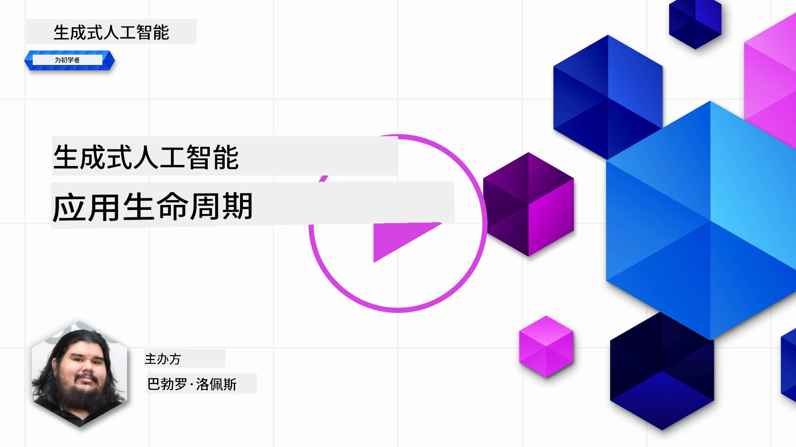
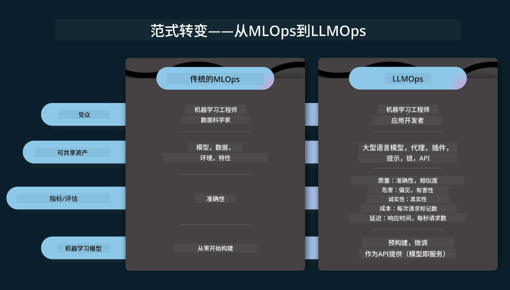
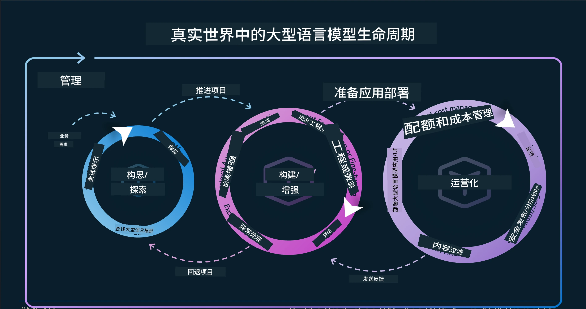
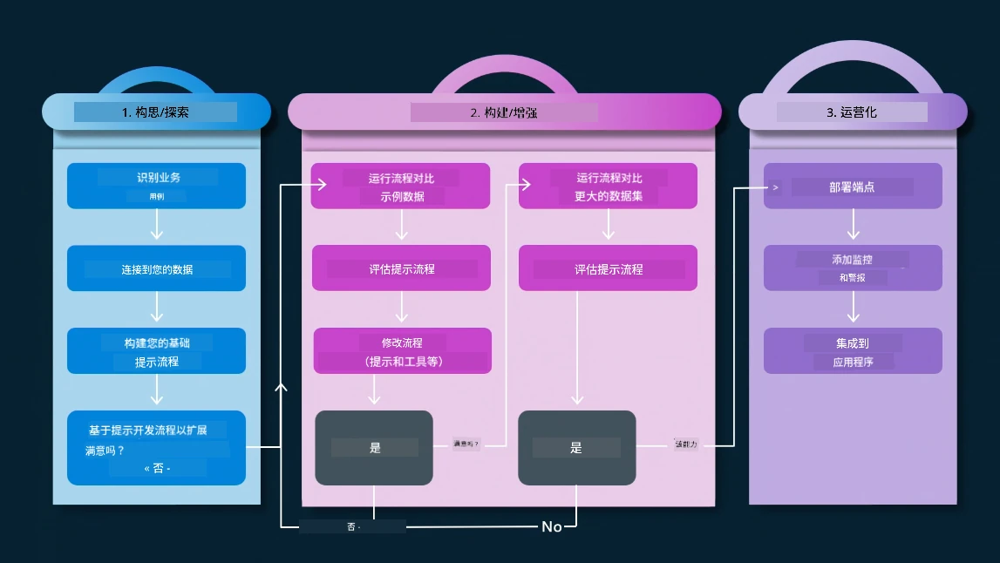
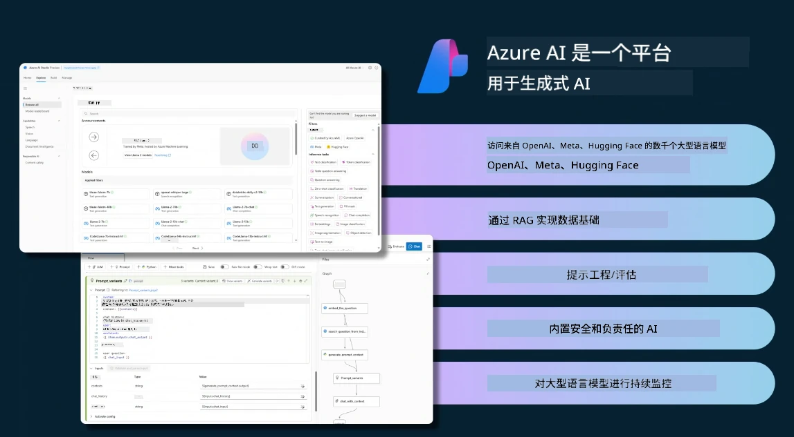
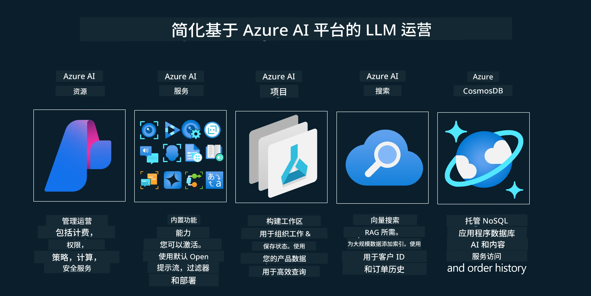
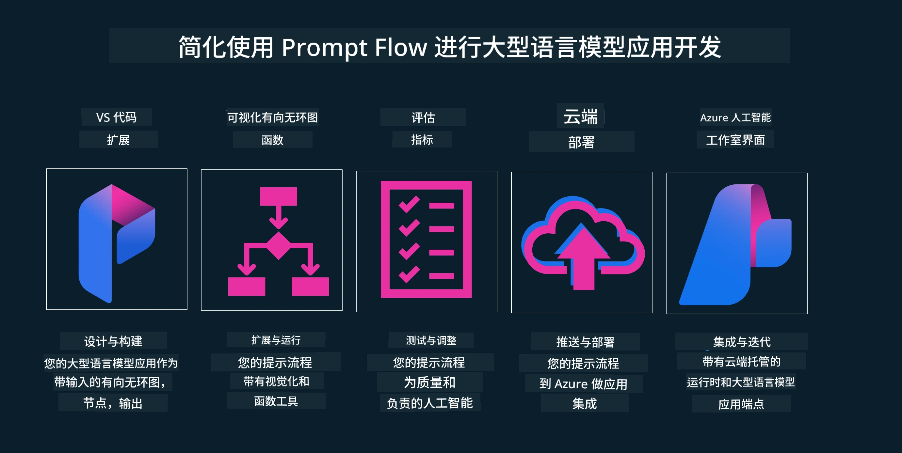

# 生成式 AI 应用生命周期

对于所有 AI 应用来说，一个重要的问题是 AI 功能的相关性。由于 AI 是一个快速发展的领域，为了确保您的应用保持相关性、可靠性和稳健性，您需要持续监控、评估和改进。这就是生成式 AI 生命周期的意义所在。

生成式 AI 生命周期是一个指导您开发、部署和维护生成式 AI 应用各阶段的框架。它帮助您定义目标、衡量性能、识别挑战并实施解决方案，还帮助您使应用符合领域及利益相关者的伦理和法律标准。通过遵循生成式 AI 生命周期，您可以确保应用始终提供价值并满足用户需求。

## 介绍

在本章节中，您将：

- 了解从 MLOps 向 LLMOps 的范式转变
- LLM 生命周期
- 生命周期工具
- 生命周期度量与评估

## 了解从 MLOps 到 LLMOps 的范式转变

大型语言模型（LLM）是人工智能武器库中的一项新工具，在应用的分析和生成任务中极为强大，但这股力量在我们简化 AI 和经典机器学习任务时也带来了一些影响。

因此，我们需要一个新的范式来动态适应这一工具，并激励正确的导向。我们可以将较早的 AI 应用归为“机器学习应用（ML 应用）”，而较新的 AI 应用称为“生成式 AI 应用（GenAI 应用）”或简称“AI 应用”，反映当时的主流技术和方法。这在多方面改变了我们的叙事，以下对比可见一斑。

请注意，在 LLMOps 中，我们更加关注应用开发者，使用集成作为关键点，采用“模型即服务”，并关注以下指标：

- 质量：响应质量
- 伤害：负责任的 AI
- 诚实度：响应的依据性（合乎逻辑吗？正确吗？）
- 成本：解决方案预算
- 延迟：平均生成一个 token 的时间

## LLM 生命周期

首先，为了理解生命周期及其变化，请参考下图。

如您所见，这与传统的 MLOps 生命周期不同。LLM 有许多新需求，如提示工程、提升质量的不同技术（微调、RAG、元提示）、负责任 AI 的评估及责任评估，最后是新的评估指标（质量、伤害、诚实度、成本和延迟）。

例如，看看我们如何进行创意构思。我们使用提示工程来尝试各种 LLM，探索可能性，验证假设是否成立。

注意，这不是线性的，而是集成的循环、迭代的，并且存在一个整体的周期。

我们如何探索这些步骤呢？让我们详细了解如何构建一个生命周期。

这可能看起来有些复杂，让我们先关注三个主要步骤。

1. 创意/探索：探索阶段，根据业务需求进行探索。构建原型，创建 [PromptFlow](https://microsoft.github.io/promptflow/index.html?WT.mc_id=academic-105485-koreyst) 并测试其是否足够支持我们的假设。
1. 构建/增强：实施阶段，开始评估更大规模的数据集，实施诸如微调和 RAG 等技术，以检验解决方案的稳健性。如果不行，可以重新实现，添加流程步骤或重组数据。经过测试且符合指标后，准备进入下一阶段。
1. 运营：集成阶段，为系统添加监控和告警，部署并集成到应用程序中。

此外，我们还有管理的整体周期，重点关注安全性、合规性和治理。

恭喜，您的 AI 应用现已准备就绪并投入运营。想要实践体验，请查看 [Contoso Chat 演示。](https://nitya.github.io/contoso-chat/?WT.mc_id=academic-105485-koreyst)

那么，我们可以用哪些工具？

## 生命周期工具

在工具方面，微软提供了 [Azure AI 平台](https://azure.microsoft.com/solutions/ai/?WT.mc_id=academic-105485-koreyst) 和 [PromptFlow](https://microsoft.github.io/promptflow/index.html?WT.mc_id=academic-105485-koreyst)，这让您的生命周期实现更加便捷且迅速。

[Azure AI 平台](https://azure.microsoft.com/solutions/ai/?WT.mc_id=academic-105485-koreyst) 允许您使用 [AI Studio](https://ai.azure.com/?WT.mc_id=academic-105485-koreyst)。AI Studio 是一个网页门户，帮助您探索模型、示例和工具，管理资源，支持 UI 开发流程以及代码优先开发的 SDK/CLI 选项。

Azure AI 允许您利用多种资源，管理运营、服务、项目、向量搜索和数据库需求。

使用 PromptFlow，从概念验证（POC）到大规模应用构建：

- 在 VS Code 中设计和构建应用，提供可视化和功能工具
- 轻松测试和微调应用，实现高质量 AI
- 使用 Azure AI Studio 进行集成和迭代，推送和部署，实现快速集成

## 太棒了！继续学习吧！

太棒了！现在了解如何构建应用以使用这些概念，请查看 [Contoso Chat 应用](https://nitya.github.io/contoso-chat/?WT.mc_id=academic-105485-koreyst)，看看云倡导如何在演示中应用这些概念。更多内容，请查看我们的 [Ignite 分会会议！](https://www.youtube.com/watch?v=DdOylyrTOWg)

接下来，请查看第15课，了解如何利用 [检索增强生成（RAG）和向量数据库](../15-rag-and-vector-databases/README.md?WT.mc_id=academic-105485-koreyst) 影响生成式 AI，实现更具吸引力的应用！

---

<!-- CO-OP TRANSLATOR DISCLAIMER START -->
**免责声明**：  
本文件使用 AI 翻译服务 [Co-op Translator](https://github.com/Azure/co-op-translator) 进行翻译。虽然我们力求准确，但请注意自动翻译可能包含错误或不准确之处。原始语言版本的文件应视为权威来源。对于关键信息，建议使用专业人工翻译。对于因使用本翻译而产生的任何误解或误释，我们不承担任何责任。
<!-- CO-OP TRANSLATOR DISCLAIMER END -->