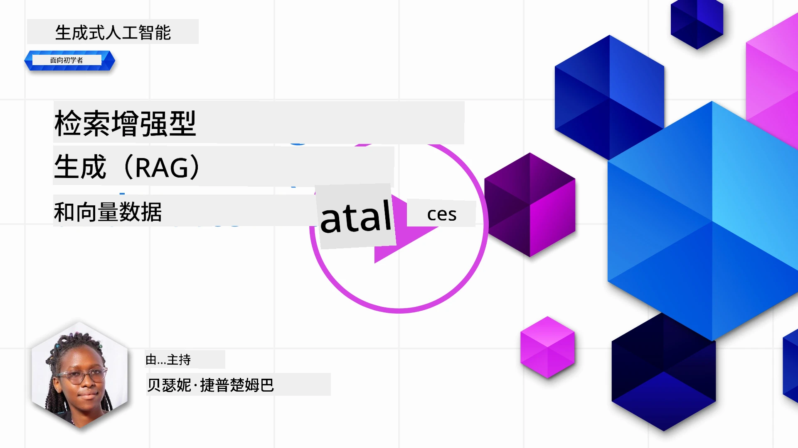
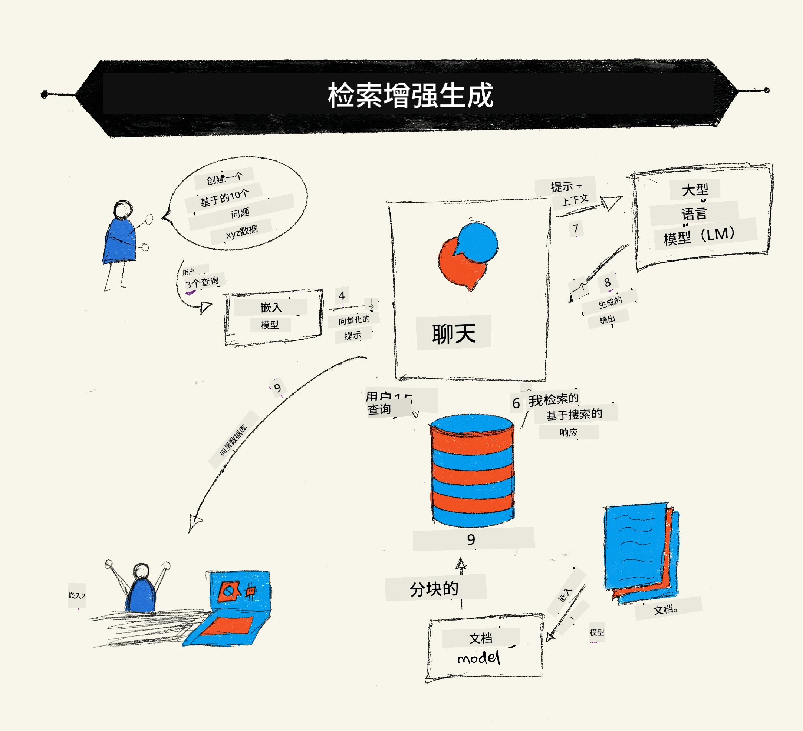
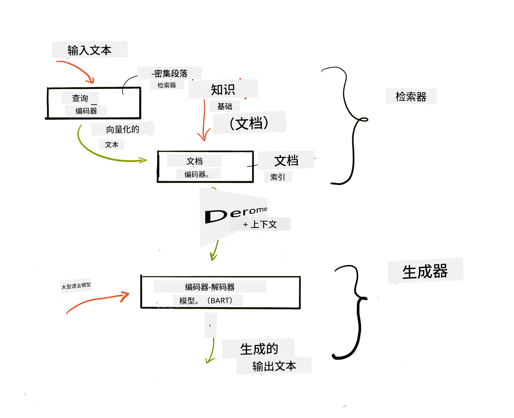

# 检索增强生成（RAG）与向量数据库

[](https://youtu.be/4l8zhHUBeyI?si=BmvDmL1fnHtgQYkL)

在搜索应用课程中，我们简要了解了如何将您自己的数据整合到大型语言模型（LLM）中。在本课中，我们将进一步深入探讨在LLM应用中为数据提供支撑的概念、过程机制以及存储数据的方法，包括嵌入和文本的存储。

> <strong>视频即将上线</strong>

## 介绍

本课将涵盖以下内容：

- RAG简介，什么是RAG以及为什么在人工智能中使用它。

- 了解向量数据库是什么，以及如何为我们的应用创建一个。

- 一个关于如何将RAG集成到应用中的实用示例。

## 学习目标

完成本课后，您将能够：

- 解释RAG在数据检索和处理中的重要性。

- 设置RAG应用并将您的数据接地到LLM中

- 有效整合RAG与向量数据库于LLM应用。

## 我们的场景：用自己的数据增强我们的LLM

在本课中，我们希望将自己的笔记添加到教育创业项目中，使聊天机器人能够获取更多关于不同学科的信息。利用我们拥有的笔记，学习者将能够更好地学习并理解不同主题，便于备考。为了创建我们的场景，我们将使用：

- `Azure OpenAI:` 我们将用来创建聊天机器人的LLM

- `面向初学者的AI课程-神经网络`: 这是我们将用来为LLM接地的数据

- `Azure AI Search` 和 `Azure Cosmos DB:` 用于存储数据并创建搜索索引的向量数据库

用户将能够根据自己的笔记创建练习测验、复习闪卡，并将其总结成简明概述。开始之前，让我们看看什么是RAG及其工作原理：

## 检索增强生成（RAG）

一个由LLM驱动的聊天机器人处理用户提示以生成响应。它设计为交互式的，能在广泛主题上与用户交流。然而，其回答受限于提供的上下文和基础训练数据。例如，GPT-4的知识截止日期为2021年9月，意味着它不了解此后发生的事件。此外，训练LLM时使用的数据不包括诸如个人笔记或公司产品手册等机密信息。

### RAG（检索增强生成）如何工作



假设您想部署一个基于笔记生成测验的聊天机器人，您将需要连接到知识库，这时RAG就派上用场了。RAG的工作流程如下：

- **知识库:** 检索之前，文档需要被摄取和预处理，通常是将大文档拆分成更小的块，转换成文本嵌入并存储到数据库中。

- **用户查询:** 用户提出问题

- **检索:** 用户提问时，嵌入模型从知识库中检索相关信息，以提供更多上下文，这些上下文将被整合进提示中。

- **增强生成:** LLM根据检索的数据增强其回复。它使生成的回答不仅基于预训练数据，还能基于附加上下文的相关信息。检索到的数据被用于增强LLM的回答，LLM随后返回对用户问题的答案。



RAG的架构采用变压器实现，由编码器和解码器两部分组成。例如，当用户提出问题时，输入文本被“编码”成捕捉词义的向量，这些向量被“解码”成我们的文档索引，并基于用户查询生成新文本。LLM使用编码器-解码器模型来生成输出。

根据提出的论文：[Retrieval-Augmented Generation for Knowledge intensive NLP Tasks](https://arxiv.org/pdf/2005.11401.pdf?WT.mc_id=academic-105485-koreyst) ，实现RAG有两种方法：

- **_RAG-Sequence_** 使用检索到的文档预测用户查询的最佳答案

- **RAG-Token** 使用文档生成下一个标记，然后检索它们以回答用户查询

### 为什么使用RAG？

- **信息丰富:** 确保文本回答最新和及时，从而通过访问内部知识库提升特定领域任务的性能。

- 通过利用知识库中<strong>可验证的数据</strong>来为用户查询提供上下文，减少虚构信息。

- 它是<strong>成本效益高</strong>的，相较于微调LLM更经济。

## 创建知识库

我们的应用基于我们个人数据，即“面向初学者的AI神经网络”课程内容。

### 向量数据库

向量数据库不同于传统数据库，是专门设计用于存储、管理和搜索嵌入向量的数据库。它存储文档的数值表示。将数据拆解为数值嵌入使我们的AI系统更易理解和处理数据。

我们将在向量数据库中存储嵌入，因为LLM对其接受输入的标记数有限。由于不能将全部嵌入直接传入LLM，我们需要将其拆分成块，当用户提问时，将返回与问题最相关的嵌入和提示。拆分还可以减少传入LLM的标记数，从而降低成本。

一些流行的向量数据库包括Azure Cosmos DB、Clarifyai、Pinecone、Chromadb、ScaNN、Qdrant和DeepLake。您可以使用Azure CLI通过以下命令创建Azure Cosmos DB模型：

```bash
az login
az group create -n <resource-group-name> -l <location>
az cosmosdb create -n <cosmos-db-name> -r <resource-group-name>
az cosmosdb list-keys -n <cosmos-db-name> -g <resource-group-name>
```

### 从文本到嵌入

在存储数据之前，我们需要先将其转换成向量嵌入。如果您处理大文档或长文本，可以根据预期查询对其分块。分块可以在句子级别或段落级别进行。由于分块是根据周围的词义来派生含义，您可以为分块添加其他上下文，例如添加文档标题或在分块前后包含一些文本。您可以按如下方式分块数据：

```python
def split_text(text, max_length, min_length):
    words = text.split()
    chunks = []
    current_chunk = []

    for word in words:
        current_chunk.append(word)
        if len(' '.join(current_chunk)) < max_length and len(' '.join(current_chunk)) > min_length:
            chunks.append(' '.join(current_chunk))
            current_chunk = []

    # 如果最后一块长度未达到最小值，也要添加它
    if current_chunk:
        chunks.append(' '.join(current_chunk))

    return chunks
```

分块完成后，我们可以使用不同的嵌入模型对文本进行嵌入。一些可用的模型包括：word2vec、OpenAI的ada-002、Azure计算机视觉等。选用哪个模型取决于您使用的语言、编码的内容类型（文本/图像/音频）、输入大小和嵌入输出长度。

使用OpenAI的`text-embedding-ada-002`模型嵌入文本的示例如下：


## 检索与向量搜索

当用户提问时，检索器使用查询编码器将其转换为向量，然后在文档搜索索引中搜索与输入相关的文档向量。完成后，将输入向量和文档向量转换成文本并传入LLM。

### 检索

检索发生在系统尝试快速从索引中找到满足搜索条件的文档时。检索器的目标是获取将用于提供上下文并为LLM基于您的数据提供支撑的文档。

在数据库中执行搜索有多种方式，如：

- <strong>关键词搜索</strong> - 用于文本搜索

- <strong>向量搜索</strong> - 使用嵌入模型将文本文档转换为向量表示，实现基于词义的<strong>语义搜索</strong>。检索通过查询与用户问题向量最相近的文档向量完成。

- <strong>混合搜索</strong> - 结合关键词和向量搜索。

检索的挑战之一是当数据库中没有与查询相似的响应时，系统会返回尽可能相关的信息。您可以使用诸如设置最大距离以定义相关度或使用结合关键词和向量的混合搜索等策略。本课将使用混合搜索，将向量和关键词搜索结合。我们将数据存储到包含分块及嵌入的dataframe中。

### 向量相似度

检索器会在知识库中搜索相近的嵌入，即最近邻，因为它们表示相似文本。在用户提出查询时，先进行嵌入，然后与相似嵌入匹配。常用的相似度度量是基于两个向量夹角的余弦相似度。

我们还可以使用其它度量标准，如欧氏距离（向量端点之间的直线距离）和点积（两个向量对应元素乘积之和）。

### 搜索索引

检索前，我们需要为知识库构建搜索索引。索引存储嵌入，即使数据库很大，也能快速检索最相似的分块。我们可以使用下列方式在本地创建索引：

```python
from sklearn.neighbors import NearestNeighbors

embeddings = flattened_df['embeddings'].to_list()

# 创建搜索索引
nbrs = NearestNeighbors(n_neighbors=5, algorithm='ball_tree').fit(embeddings)

# 要查询索引，可以使用kneighbors方法
distances, indices = nbrs.kneighbors(embeddings)
```

### 重排序

查询数据库后，您可能需要从最相关的结果开始对其进行排序。重排序LLM利用机器学习通过排序提高搜索结果的相关性。使用Azure AI Search，重排序通过语义重排序器自动完成。以下是基于最近邻的重排序示例：

```python
# 查找最相似的文档
distances, indices = nbrs.kneighbors([query_vector])

index = []
# 打印最相似的文档
for i in range(3):
    index = indices[0][i]
    for index in indices[0]:
        print(flattened_df['chunks'].iloc[index])
        print(flattened_df['path'].iloc[index])
        print(flattened_df['distances'].iloc[index])
    else:
        print(f"Index {index} not found in DataFrame")
```

## 综合应用

最后一步是将我们的LLM加入流程，能够基于数据给出有支撑的回答。实现方式如下：

```python
user_input = "what is a perceptron?"

def chatbot(user_input):
    # 将问题转换为查询向量
    query_vector = create_embeddings(user_input)

    # 查找最相似的文档
    distances, indices = nbrs.kneighbors([query_vector])

    # 将文档添加到查询中以提供上下文
    history = []
    for index in indices[0]:
        history.append(flattened_df['chunks'].iloc[index])

    # 结合历史记录和用户输入
    history.append(user_input)

    # 创建消息对象
    messages=[
        {"role": "system", "content": "You are an AI assistant that helps with AI questions."},
        {"role": "user", "content": "\n\n".join(history) }
    ]

    # 使用响应API生成回复
    response = client.responses.create(
        model="gpt-4o-mini",
        temperature=0.7,
        max_output_tokens=800,
        input=messages,
        store=False,
    )

    return response.output_text

chatbot(user_input)
```

## 评估我们的应用

### 评估指标

- 回复质量：确保回答自然、流畅且具有人性化

- 数据支撑性：评估回答是否来源于提供的文档

- 相关性：评估回答与提问的匹配和关联程度

- 流畅性：回答语法是否通顺

## RAG 和向量数据库的应用场景

功能调用可以提升应用的多种场景，例如：

- 问答系统：将公司数据接地到聊天中，供员工提问使用。

- 推荐系统：您可以创建匹配最相似值的系统，例如电影、餐厅等。

- 聊天机器人服务：可以存储聊天记录，并基于用户数据个性化对话。

- 基于向量嵌入的图像搜索，适用于图像识别和异常检测。

## 总结

我们已经涵盖了RAG的基本领域，从将数据加入应用、用户查询到输出。为简化RAG的构建，您可以使用诸如Semantic Kernel、Langchain或Autogen等框架。

## 任务

为继续学习检索增强生成（RAG），您可以构建：

- 使用您选择的框架构建应用的前端

- 使用LangChain或Semantic Kernel框架，重建您的应用。

恭喜完成本课 👏。

## 学习不会停止，继续探索旅程

完成本课后，请访问我们的[生成式AI学习合集](https://aka.ms/genai-collection?WT.mc_id=academic-105485-koreyst)，继续提升您的生成式AI知识！

---

<!-- CO-OP TRANSLATOR DISCLAIMER START -->
**免责声明**：
本文件由 AI 翻译服务 [Co-op Translator](https://github.com/Azure/co-op-translator) 翻译完成。尽管我们力求准确，但请注意，自动翻译可能包含错误或不准确之处。原始语言版文件应视为权威来源。对于重要信息，建议使用专业人工翻译。我们对因使用本翻译而产生的任何误解或误释不承担责任。
<!-- CO-OP TRANSLATOR DISCLAIMER END -->