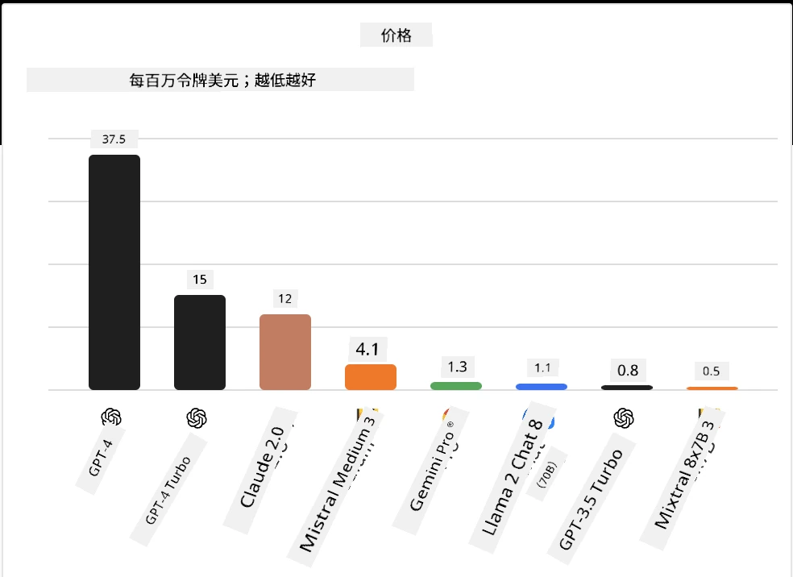
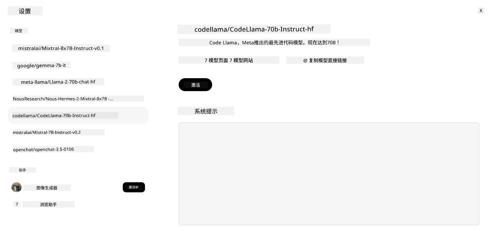
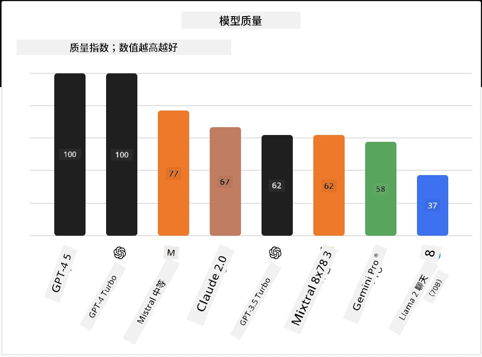

## 介绍

开源大语言模型的世界令人兴奋且不断发展。本课旨在深入介绍开源模型。如果你想了解专有模型与开源模型的比较，请访问[“探索和比较不同的大语言模型”课程](../02-exploring-and-comparing-different-llms/README.md?WT.mc_id=academic-105485-koreyst)。本课还将涵盖微调主题，但更详细的解释可以在[“大语言模型微调”课程](../18-fine-tuning/README.md?WT.mc_id=academic-105485-koreyst)中找到。

## 学习目标

- 了解开源模型
- 理解使用开源模型的优势
- 探索 Hugging Face 和 Microsoft Foundry 模型目录中的开源模型

## 什么是开源模型？

开源软件在各领域技术的发展中发挥了关键作用。开源倡议（OSI）定义了[软件开源的10条标准](https://web.archive.org/web/20241126001143/https://opensource.org/osd?WT.mc_id=academic-105485-koreyst)，要求源代码必须在OSI批准的许可证下公开共享。

虽然大语言模型的开发与软件开发有相似之处，但过程并不完全相同。这引发了社区对开源定义在大语言模型领域的争论。为了符合传统开源定义，模型应公开以下信息：

- 用于训练模型的数据集。
- 训练过程中完整的模型权重。
- 评估代码。
- 微调代码。
- 完整的模型权重和训练指标。

目前只有少数模型符合这些标准。[由艾伦人工智能研究所（AllenAI）创建的 OLMo 模型](https://huggingface.co/allenai/OLMo-7B?WT.mc_id=academic-105485-koreyst) 就属于这一类。

在本课中，我们将这些模型统称为“开源模型”，因为它们在撰写时可能并不完全符合上述标准。

## 开源模型的优势

<strong>高度可定制</strong> —— 由于开源模型发布了详细的训练信息，研究人员和开发者可以修改模型内部结构，从而创建针对特定任务或研究领域的高度专业化模型。例如代码生成、数学运算和生物学领域的应用。

<strong>成本</strong> —— 使用和部署这些模型的每个令牌成本低于专有模型。在构建生成式人工智能应用时，应根据性能与价格对比评估这些模型在你的用例中的表现。

来源：Artificial Analysis

<strong>灵活性</strong> —— 使用开源模型可以灵活地选择不同模型或组合模型。例如，[HuggingChat 助手](https://huggingface.co/chat?WT.mc_id=academic-105485-koreyst)允许用户直接在界面中选择所用模型：

## 探索不同的开源模型

### Llama 2

[Llama2](https://huggingface.co/meta-llama?WT.mc_id=academic-105485-koreyst)由 Meta 开发，是一个针对聊天应用优化的开源模型。这归功于其微调方法，包含大量对话数据和人类反馈。该方法使模型输出更符合人类预期，提升用户体验。

一些微调版的 Llama 模型示例包括专注于日语的[Japanese Llama](https://huggingface.co/elyza/ELYZA-japanese-Llama-2-7b?WT.mc_id=academic-105485-koreyst)和增强版的[Llama Pro](https://huggingface.co/TencentARC/LLaMA-Pro-8B?WT.mc_id=academic-105485-koreyst)。

### Mistral

[Mistral](https://huggingface.co/mistralai?WT.mc_id=academic-105485-koreyst)是一个注重高性能和效率的开源模型。它采用专家混合（Mixture-of-Experts）方法，将多个专业专家模型组合成一个系统，根据输入选择相应模型使用。这使得计算更加高效，模型只处理其专长的输入。

一些微调版 Mistral 模型示例包括专注医疗领域的[BioMistral](https://huggingface.co/BioMistral/BioMistral-7B?text=Mon+nom+est+Thomas+et+mon+principal?WT.mc_id=academic-105485-koreyst)和执行数学运算的[OpenMath Mistral](https://huggingface.co/nvidia/OpenMath-Mistral-7B-v0.1-hf?WT.mc_id=academic-105485-koreyst)。

### Falcon

[Falcon](https://huggingface.co/tiiuae?WT.mc_id=academic-105485-koreyst)是由技术创新研究院（**TII**）创建的大语言模型。Falcon-40B 训练了 400 亿参数，表现优于 GPT-3，但耗费的计算资源更少。这得益于其采用的 FlashAttention 算法和多查询注意力机制，减少了推理时的内存需求。凭借降低的推理时间，Falcon-40B 适合聊天应用。

一些微调版 Falcon 模型示例包括基于开源模型构建的[OpenAssistant](https://huggingface.co/OpenAssistant/falcon-40b-sft-top1-560?WT.mc_id=academic-105485-koreyst)及表现优于基础模型的[GPT4ALL](https://huggingface.co/nomic-ai/gpt4all-falcon?WT.mc_id=academic-105485-koreyst)。

## 如何选择

选择开源模型没有唯一答案。一个良好的起点是利用 Microsoft Foundry 模型目录的按任务筛选功能，这有助于了解模型针对的训练任务。Hugging Face 还维护了一个大语言模型排行榜，展示基于特定指标的最佳表现模型。

在比较不同类型大语言模型时，[Artificial Analysis](https://artificialanalysis.ai/?WT.mc_id=academic-105485-koreyst)是另一个很好的资源：

来源：Artificial Analysis

如果针对特定用例，搜索关注相同领域的微调版本很有效。试用多种开源模型以评估其表现是否符合你和用户的期望也是一个好方法。

## 下一步

开源模型最棒的地方是你可以很快开始使用。查看[Microsoft Foundry 模型目录](https://ai.azure.com?WT.mc_id=academic-105485-koreyst)，其中包含了我们这里讨论的 Hugging Face 模型集合。

## 学习不会止步于此，继续前行

完成本课后，访问我们的[生成式人工智能学习集合](https://aka.ms/genai-collection?WT.mc_id=academic-105485-koreyst)，继续提升生成式人工智能知识！

---

<!-- CO-OP TRANSLATOR DISCLAIMER START -->
**免责声明**：
本文件由 AI 翻译服务 [Co-op Translator](https://github.com/Azure/co-op-translator) 翻译完成。尽管我们力求准确，但请注意，自动翻译可能包含错误或不准确之处。原始语言版文件应视为权威来源。对于重要信息，建议使用专业人工翻译。我们对因使用本翻译而产生的任何误解或误释不承担责任。
<!-- CO-OP TRANSLATOR DISCLAIMER END -->