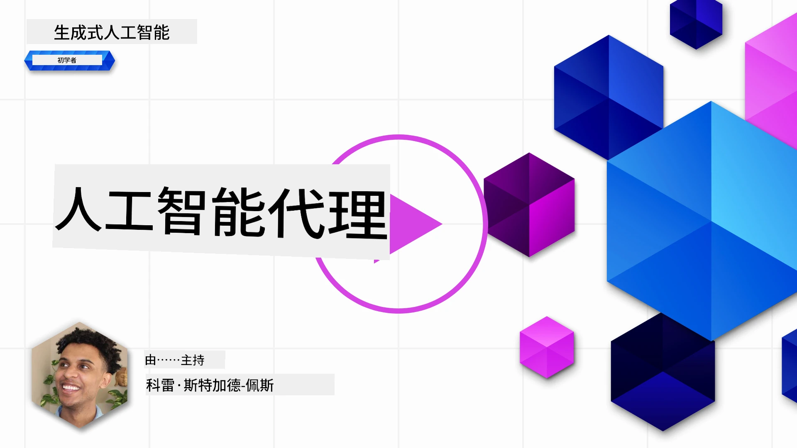
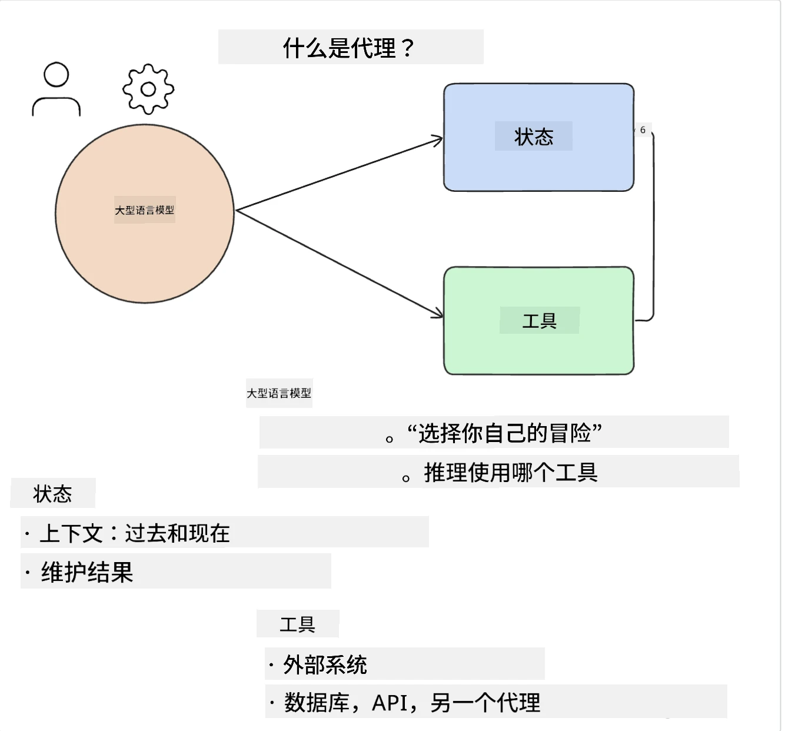
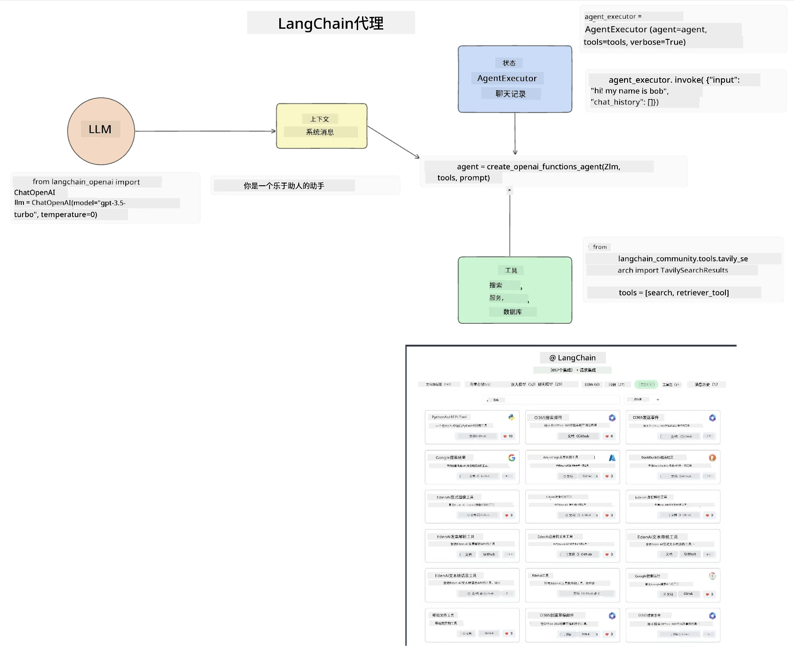
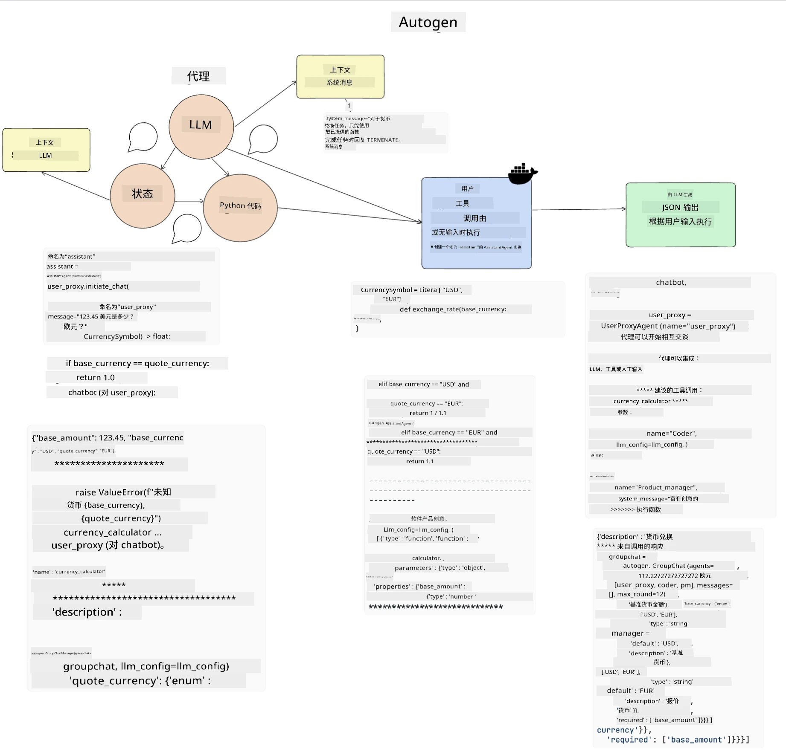
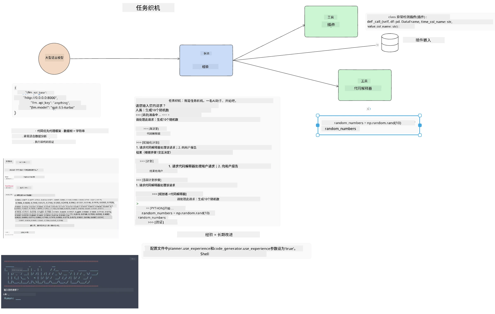
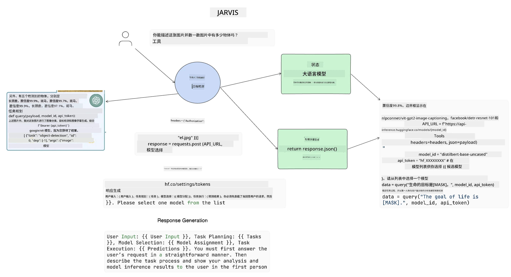

[](https://youtu.be/yAXVW-lUINc?si=bOtW9nL6jc3XJgOM)

## 介绍

AI 代理是生成式 AI 的一个令人兴奋的进展，使大型语言模型（LLM）能够从助手进化为能够执行操作的代理。AI 代理框架使开发人员能够创建让 LLM 访问工具和状态管理的应用。这些框架还增强了可视性，使用户和开发者能够监控 LLM 计划的操作，从而改进体验管理。

本课程将涵盖以下内容：

- 理解什么是 AI 代理——AI 代理究竟是什么？
- 探索四种不同的 AI 代理框架——它们各自的独特之处在哪里？
- 将这些 AI 代理应用于不同的使用场景——什么时候应当使用 AI 代理？

## 学习目标

完成本课程后，您将能够：

- 解释什么是 AI 代理以及它们如何使用。
- 理解一些流行 AI 代理框架之间的区别及其差异。
- 理解 AI 代理的工作原理，以便构建相关应用。

## 什么是 AI 代理？

AI 代理是在生成式 AI 领域非常令人兴奋的一个方向。随之而来的是术语和应用的混淆。为保持简单且涵盖大多数称为 AI 代理的工具，我们将使用如下定义：

AI 代理允许大型语言模型（LLM）通过给予其访问**状态**和**工具**来执行任务。



我们来定义这些术语：

**大型语言模型** —— 本课程提到的模型，如 GPT-3.5、GPT-4、Llama-2 等。

**状态** —— 指 LLM 工作的上下文。LLM 利用过去操作的上下文和当前上下文来指导后续操作的决策。AI 代理框架使开发者更容易维护此上下文。

**工具** —— 为完成用户请求并由 LLM 规划的任务，LLM 需要访问工具。例如，数据库、API、外部应用甚至另一个 LLM！

这些定义将为您后续学习它们的实现打下良好基础。让我们探索几种不同的 AI 代理框架：

## LangChain 代理

[LangChain Agents](https://python.langchain.com/docs/how_to/#agents?WT.mc_id=academic-105485-koreyst) 实现了上述定义。

为管理**状态**，它使用一个内置函数 `AgentExecutor`。该函数接受已定义的 `agent` 和可用的 `tools`。

`Agent Executor` 还保存聊天记录以提供对话上下文。



LangChain 提供了一个 [工具目录](https://integrations.langchain.com/tools?WT.mc_id=academic-105485-koreyst)，可以导入应用，使 LLM 能访问它们。这些工具由社区和 LangChain 团队制作。

接着，您可以定义这些工具并传递给 `Agent Executor`。

可视性是谈论 AI 代理时另一个重要方面。应用开发者需要了解 LLM 使用了哪个工具以及原因。为此，LangChain 团队开发了 LangSmith。

## AutoGen

下一个我们将讨论的 AI 代理框架是 [AutoGen](https://microsoft.github.io/autogen/?WT.mc_id=academic-105485-koreyst)。AutoGen 主要关注对话。代理既是**可对话的**又是**可定制的**。

**可对话——**LLM 可与另一个 LLM 开启并继续对话，以完成任务。通过创建 `AssistantAgents` 并赋予其特定的系统消息实现。

```python

autogen.AssistantAgent( name="Coder", llm_config=llm_config, ) pm = autogen.AssistantAgent( name="Product_manager", system_message="Creative in software product ideas.", llm_config=llm_config, )

```

**可定制——**代理不仅可以定义为 LLM，还可以是用户或工具。作为开发者，可以定义一个 `UserProxyAgent`，负责与用户互动以获取完成任务的反馈。此反馈可继续执行任务，也可停止任务。

```python
user_proxy = UserProxyAgent(name="user_proxy")
```

### 状态和工具

为了更改和管理状态，助手代理生成 Python 代码以完成任务。

这是一个过程示例：



#### 用系统消息定义 LLM

```python
system_message="For weather related tasks, only use the functions you have been provided with. Reply TERMINATE when the task is done."
```

此系统消息指导该特定 LLM 哪些函数与其任务相关。请记住，AutoGen 允许定义多个带有不同系统消息的 AssistantAgents。

#### 聊天由用户发起

```python
user_proxy.initiate_chat( chatbot, message="I am planning a trip to NYC next week, can you help me pick out what to wear? ", )

```

该来自 user_proxy（人类）的消息将启动代理探索应执行函数的过程。

#### 执行函数

```bash
chatbot (to user_proxy):

***** Suggested tool Call: get_weather ***** Arguments: {"location":"New York City, NY","time_periond:"7","temperature_unit":"Celsius"} ******************************************************** --------------------------------------------------------------------------------

>>>>>>>> EXECUTING FUNCTION get_weather... user_proxy (to chatbot): ***** Response from calling function "get_weather" ***** 112.22727272727272 EUR ****************************************************************

```

初始聊天处理后，代理将发送建议调用的工具。这里是一个名为 `get_weather` 的函数。根据配置，该函数可以自动执行和被代理读取，或基于用户输入执行。

您可查阅更多 [AutoGen 代码示例](https://microsoft.github.io/autogen/docs/Examples/?WT.mc_id=academic-105485-koreyst)，深入了解如何入门构建。

## Taskweaver

接下来我们将探索的代理框架是 [Taskweaver](https://microsoft.github.io/TaskWeaver/?WT.mc_id=academic-105485-koreyst)。它被称作“代码优先”代理，因为它不仅处理`字符串`，还能操作 Python 中的 DataFrame。这对数据分析和生成任务非常有用，比如绘制图表或生成随机数。

### 状态和工具

TaskWeaver 使用 `Planner` 概念来管理对话状态。`Planner` 是一个 LLM，接收用户请求并规划完成请求所需的任务。

为完成任务，`Planner` 可以访问名为 `Plugins` 的工具集合。这些可以是 Python 类或通用代码解释器。插件被存储为嵌入，方便 LLM 搜索正确插件。



这是一个处理异常检测的插件示例：

```python
class AnomalyDetectionPlugin(Plugin): def __call__(self, df: pd.DataFrame, time_col_name: str, value_col_name: str):
```

代码会在执行前进行验证。Taskweaver 管理上下文的另一特性是 `experience`。体验允许会话上下文长期存储到 YAML 文件。配置后，LLM 在接触过往对话的基础上，能随时间改进特定任务表现。

## JARVIS

我们将探索的最后一个代理框架是 [JARVIS](https://github.com/microsoft/JARVIS?tab=readme-ov-file&WT.mc_id=academic-105485-koreyst)。JARVIS 的独特之处在于，它使用一个 LLM 管理对话的 `state`，而 `tools` 则是其他 AI 模型。这些 AI 模型是专用模型，执行特定任务，如对象检测、转录或图像标题生成。



这位通用型 LLM 收到用户请求，识别具体任务及完成任务所需的参数/数据。

```python
[{"task": "object-detection", "id": 0, "dep": [-1], "args": {"image": "e1.jpg" }}]
```

LLM 之后以专用 AI 模型能理解的格式（如 JSON）整理请求。AI 模型做出预测后，LLM 接收响应。

如需多模型协作完成任务，LLM 也会解析这些模型的响应，然后汇总生成对用户的回复。

以下示例展示用户请求描述和计数图片中物体时的工作流程：

## 练习作业

为了继续您的 AI 代理学习，可以使用 AutoGen 构建：

- 一个模拟教育创业公司不同部门业务会议的应用。
- 创建系统消息，引导 LLM 理解不同角色和优先事项，使用户能够推销新产品想法。
- LLM 应针对各部门生成后续问题，以完善和改进推销及产品想法。

## 学习不止于此，继续前进

完成本课程后，请查阅我们的 [生成式 AI 学习合集](https://aka.ms/genai-collection?WT.mc_id=academic-105485-koreyst)，持续提升您的生成式 AI 知识！

---

<!-- CO-OP TRANSLATOR DISCLAIMER START -->
**免责声明**：  
本文档由人工智能翻译服务 [Co-op Translator](https://github.com/Azure/co-op-translator) 翻译。虽然我们努力确保准确性，但请注意自动翻译可能包含错误或不准确之处。原始文档的原文应被视为权威来源。对于重要信息，建议采用专业人工翻译。我们不对因使用本翻译而产生的任何误解或错误解释承担责任。
<!-- CO-OP TRANSLATOR DISCLAIMER END -->