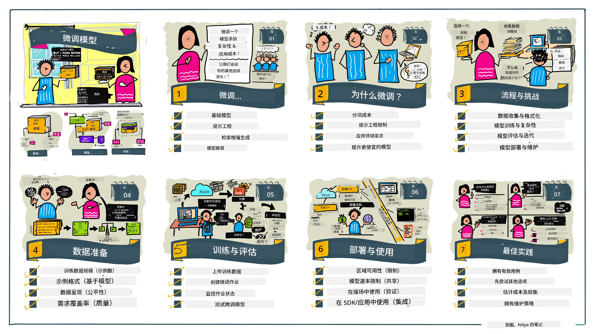

# 微调您的大型语言模型

使用大型语言模型构建生成式人工智能应用带来了新的挑战。一个关键问题是确保模型为特定用户请求生成的内容在响应质量（准确性和相关性）方面表现良好。在之前的课程中，我们讨论了诸如提示工程和基于检索的增强生成等技术，这些技术试图通过_修改现有模型的提示输入_来解决该问题。

在今天的课程中，我们将讨论第三种技术，**微调**，该技术通过_使用额外数据重新训练模型本身_来应对这一挑战。让我们深入了解细节。

## 学习目标

本课程介绍预训练语言模型的微调概念，探讨该方法的优点和挑战，并就何时以及如何使用微调来提升生成式人工智能模型的性能提供指导。

完成本课程后，您应能回答以下问题：

- 语言模型的微调是什么？
- 何时以及为何微调有用？
- 如何微调预训练模型？
- 微调有哪些局限性？

准备好了吗？让我们开始吧。

## 图解指南

想在深入学习之前先了解我们将涵盖的整体内容吗？请查看这份图解指南，介绍本课程的学习旅程——从学习微调的核心概念和动机，到理解执行微调任务的过程和最佳实践。这是一个引人入胜的探索主题，别忘了查看[资源](./RESOURCES.md?WT.mc_id=academic-105485-koreyst)页面，获取更多支持您自主学习之旅的链接！

## 什么是语言模型的微调？

根据定义，大型语言模型是在来自包含互联网的多样化来源的大量文本上_预训练_的。正如我们在之前课程中所学，为了提升模型对用户提问（“提示”）的响应质量，我们需要采用诸如_提示工程_和_基于检索的增强生成_等技术。

一种流行的提示工程技术是通过提供_指令_（显式指导）或_给出一些示例_（隐式指导）来给模型更多关于期望响应内容的引导。这被称为_少样本学习_，但存在两个限制：

- 模型的令牌限制可能限制您能提供的示例数量，影响效果。
- 模型令牌成本可能使得在每个提示中添加示例代价高昂，限制灵活性。

微调是机器学习系统中的一种常见做法，我们在这里取用一个预训练模型，并用新数据重新训练，以提升其在特定任务上的性能。在语言模型的上下文中，我们可以用_为给定任务或应用领域精心挑选的一组示例_来微调预训练模型，从而创建一个针对该特定任务或领域更准确且相关的**定制模型**。微调的一个附带好处是，它还可以减少少样本学习所需的示例数量——降低令牌使用量和相关成本。

## 何时以及为何要微调模型？

在_这里_所说的微调，指的是**监督式**微调，即通过**添加原训练数据集之外的新数据**来进行重新训练。这不同于无监督微调方法，即在原始数据上但使用不同超参数进行再训练。

需要记住的关键点是，微调是一种高级技术，要求一定的专业知识才能获得预期效果。如果操作不当，可能无法带来预期的改进，甚至会降低模型在目标领域的性能。

因此，在学习“如何”微调语言模型之前，您需要清楚“为什么”要走这条路，以及“何时”开始微调过程。首先自问以下问题：

- **用例**：您进行微调的_用例_是什么？您想在哪些方面提升当前预训练模型的表现？
- **替代方案**：您是否尝试过_其他技术_以实现目标？利用这些技术创建基线以进行比较。
  - 提示工程：尝试例如带有相关示例的少样本提示技术。评估响应质量。
  - 基于检索的增强生成：尝试用查询结果增强提示，来源是您的数据检索。评估响应质量。
- **成本**：您是否确定了微调的成本？
  - 可调性——预训练模型是否支持微调？
  - 努力——准备训练数据、评估和优化模型所需的工作量。
  - 计算资源——运行微调任务和部署微调模型所需计算资源。
  - 数据——获取足够高质量示例以对微调产生影响。
- **收益**：您是否确认了微调的收益？
  - 质量——微调模型是否优于基线？
  - 成本——是否通过简化提示降低了令牌使用量？
  - 可扩展性——是否能将基础模型重新用于新领域？

回答这些问题后，您应能判断微调是否适合您的用例。理想情况下，只有当收益大于成本时，这种方式才是合理的。一旦您决定推进，就该考虑_如何_微调预训练模型了。

想深入了解决策过程？观看[微调，还是不微调](https://www.youtube.com/watch?v=0Jo-z-MFxJs)

## 如何微调预训练模型？

要微调预训练模型，您需要具备：

- 一个预训练模型供微调
- 用于微调的数据集
- 用来运行微调任务的训练环境
- 用来部署微调模型的托管环境

## 微调实战

以下资源提供了逐步教程，带您通过使用选定模型和精心挑选的数据集的真实示例。要完成这些教程，您需要在指定提供商处注册账户，并获得相关模型和数据集的访问权限。

| 提供商        | 教程                                                                                                                                                                        | 描述                                                                                                                                                                                                                                                                                                                                                                                                                                 |
| ------------- | ------------------------------------------------------------------------------------------------------------------------------------------------------------------------- | ------------------------------------------------------------------------------------------------------------------------------------------------------------------------------------------------------------------------------------------------------------------------------------------------------------------------------------------------------------------------------------------------------------------------------------ |
| OpenAI        | [如何微调聊天模型](https://github.com/openai/openai-cookbook/blob/main/examples/How_to_finetune_chat_models.ipynb?WT.mc_id=academic-105485-koreyst)                      | 学习如何以“食谱助手”为特定领域，微调`gpt-35-turbo`，包括准备训练数据、运行微调任务以及使用微调模型进行推理。                                                                                                                                                                                                                                                                                                                                 |
| Azure OpenAI  | [GPT 3.5 Turbo微调教程](https://learn.microsoft.com/azure/ai-services/openai/tutorials/fine-tune?tabs=python-new%2Ccommand-line&WT.mc_id=academic-105485-koreyst)        | 学习如何在**Azure**上微调`gpt-35-turbo-0613`模型，包括创建和上传训练数据、运行微调任务、部署及使用新模型。                                                                                                                                                                                                                                                                                                                            |
| Hugging Face  | [使用Hugging Face微调大型语言模型](https://www.philschmid.de/fine-tune-llms-in-2024-with-trl?WT.mc_id=academic-105485-koreyst)                                          | 本博客介绍如何使用[transformers](https://huggingface.co/docs/transformers/index?WT.mc_id=academic-105485-koreyst)库和[Transformer强化学习 (TRL)](https://huggingface.co/docs/trl/index?WT.mc_id=academic-105485-koreyst)，利用Hugging Face上的开源[数据集](https://huggingface.co/docs/datasets/index?WT.mc_id=academic-105485-koreyst)微调(open LLM，例如`CodeLlama 7B`)。 |
|               |                                                                                                                                                                           |                                                                                                                                                                                                                                                                                                                                                                                                                                      |
| 🤗 AutoTrain  | [使用AutoTrain微调大型语言模型](https://github.com/huggingface/autotrain-advanced/?WT.mc_id=academic-105485-koreyst)                                                    | AutoTrain（或AutoTrain Advanced）是Hugging Face开发的Python库，支持针对多种任务的微调，包括大型语言模型微调。AutoTrain为无代码解决方案，支持在您自己的云端、Hugging Face Spaces或本地运行微调。支持网页GUI、命令行工具和基于yaml配置文件的训练。                                                                                                                                                                              |
|               |                                                                                                                                                                           |                                                                                                                                                                                                                                                                                                                                                                                                                                      |
| 🦥 Unsloth   | [使用Unsloth微调大型语言模型](https://github.com/unslothai/unsloth)                                                                                                      | Unsloth是一个开源框架，支持大型语言模型微调和强化学习（RL）。Unsloth简化了本地训练、评估和部署流程，配有现成的[笔记本](https://github.com/unslothai/notebooks)。它还支持文本转语音（TTS）、BERT和多模态模型。入门可阅读其逐步[微调大型语言模型指南](https://docs.unsloth.ai/get-started/fine-tuning-llms-guide)。                                                                                                                        |
|               |                                                                                                                                                                           |                                                                                                                                                                                                                                                                                                                                                                                                                                      |
## 任务

选择以上教程中的一个进行学习演练。_我们可能会在本仓库中以Jupyter笔记本形式复刻这些教程供参考。请直接使用原始资源以获取最新版本_。

## 做得很好！继续学习吧。

完成本课程后，访问我们的[生成式人工智能学习合集](https://aka.ms/genai-collection?WT.mc_id=academic-105485-koreyst)，继续提升您的生成式人工智能知识！

恭喜您！您已完成本课程v2系列的最后一课！别停止学习和构建。**请查看[资源](RESOURCES.md?WT.mc_id=academic-105485-koreyst)页面，获取本主题的额外推荐清单。

我们的v1系列课程也已有更新，增加了更多的任务和概念。花点时间复习下您的知识，并请[分享您的问题和反馈](https://github.com/microsoft/generative-ai-for-beginners/issues?WT.mc_id=academic-105485-koreyst)，帮助我们为社区改进这些课程。

---

<!-- CO-OP TRANSLATOR DISCLAIMER START -->
**免责声明**：
本文件由人工智能翻译服务[Co-op Translator](https://github.com/Azure/co-op-translator)翻译。尽管我们力求准确，但请注意自动翻译可能存在错误或不准确之处。以原文档的原始语言版本为权威来源。对于重要信息，建议使用专业人工翻译。对于因使用本翻译而产生的任何误解或误译，我们不承担任何责任。
<!-- CO-OP TRANSLATOR DISCLAIMER END -->