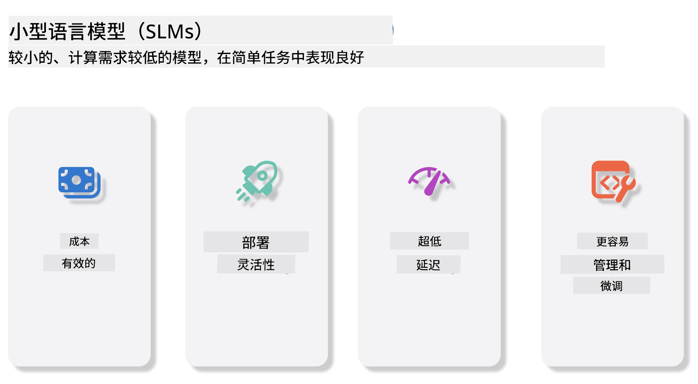
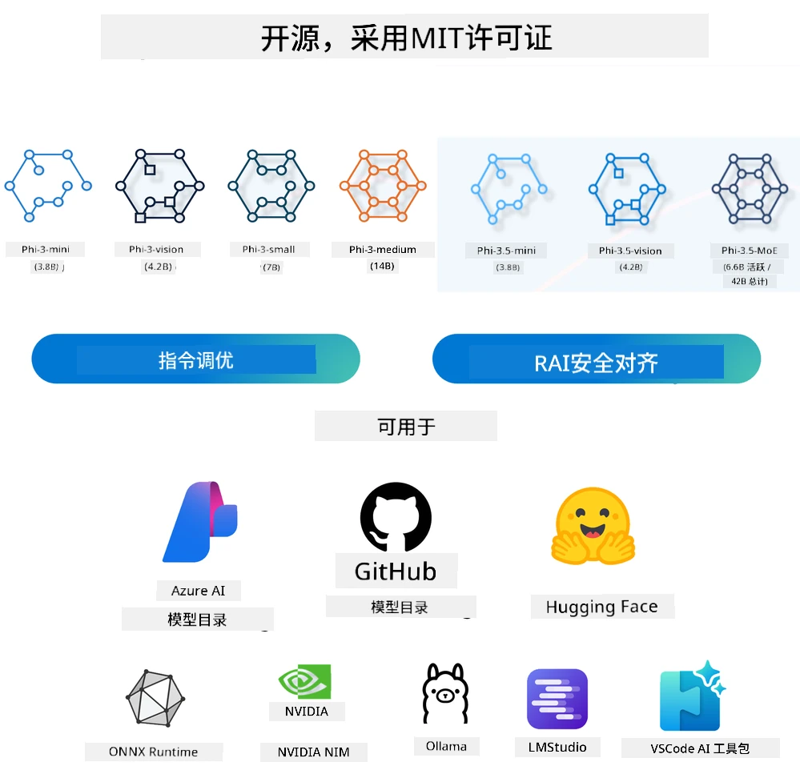
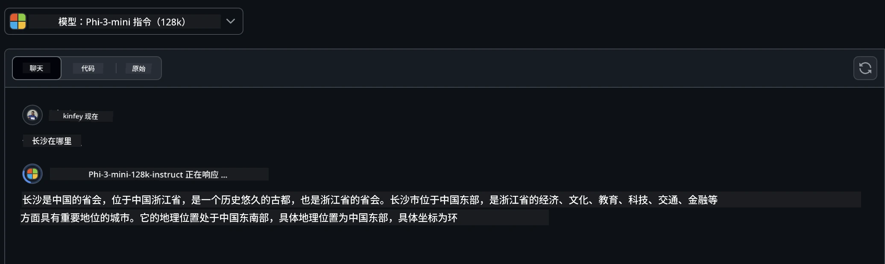
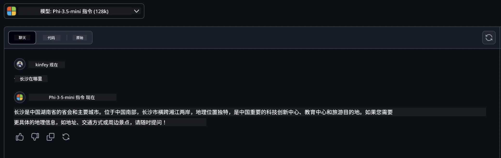

# 初学者生成式人工智能中的小型语言模型介绍
生成式人工智能是人工智能领域一个令人着迷的分支，专注于创建能够生成新内容的系统。这些内容可以是文本、图像、音乐，甚至是完整的虚拟环境。生成式人工智能最令人兴奋的应用之一就是语言模型领域。

## 什么是小型语言模型？

小型语言模型（SLM）是大型语言模型（LLM）的缩小版本，利用了LLM的许多架构原则和技术，同时大幅减少了计算资源的占用。

SLM是一类旨在生成类人文本的语言模型。与如GPT-4这类规模庞大的模型不同，SLM更加紧凑和高效，适合计算资源受限的应用场景。尽管体积较小，但SLM仍能完成多种任务。通常，SLM是通过压缩或蒸馏LLM构建的，旨在保留原模型的大部分功能和语言能力。模型规模的缩减降低了整体复杂度，使得SLM在内存使用和计算需求方面更为高效。经过这些优化，SLM依然能够执行广泛的自然语言处理（NLP）任务：

- 文本生成：创建连贯且符合上下文的句子或段落。
- 文本补全：基于给定提示预测并完成句子。
- 翻译：将文本从一种语言转换为另一种语言。
- 摘要：将长文本压缩成更简洁易懂的摘要。

尽管在性能或理解深度上与大型模型相比可能存在一些折衷。

## 小型语言模型是如何工作的？
SLM经过大量文本数据的训练。在训练过程中，它们学习语言的模式和结构，使其能够生成语法正确且符合上下文的文本。训练流程包括：

- 数据收集：从各种来源收集大量文本数据。
- 预处理：清洗和组织数据，使其适合训练。
- 训练：使用机器学习算法教授模型如何理解和生成文本。
- 微调：调整模型以提升其在特定任务上的表现。

SLM的发展响应了在资源受限环境（如移动设备或边缘计算平台）中部署模型的需求，在这些环境中，完整规模的LLM因资源消耗过大而不切实际。通过注重效率，SLM在性能与可访问性之间取得平衡，使其能在不同领域得到更广泛应用。



## 学习目标

在本课程中，我们希望介绍SLM的知识，并结合微软的Phi-3模型，学习文本内容、视觉和MoE等不同场景的应用。

课程结束时，你应该能够回答以下问题：

- 什么是SLM？
- SLM与LLM有什么区别？
- 什么是微软Phi-3/3.5家族？
- 如何使用微软Phi-3/3.5家族进行推理？

准备好了吗？让我们开始吧。

## 大型语言模型（LLM）与小型语言模型（SLM）的区别

LLM和SLM均基于概率机器学习的基础原理，采用相似的架构设计、训练方法、数据生成流程和模型评估技术。但这两类模型存在若干关键区别。

## 小型语言模型的应用

SLM有广泛的应用，包括：

- 聊天机器人：提供客户支持，与用户进行对话交互。
- 内容创作：辅助写作者生成创意或草拟文章。
- 教育：帮助学生完成写作任务或学习新语言。
- 无障碍辅助：开发针对残障人士的工具，如文本转语音系统。

**规模**

LLM与SLM的主要区别在于模型规模。LLM如ChatGPT（GPT-4）参数数目估计为1.76万亿，而开源的SLM如Mistral 7B仅约70亿参数。此差异主要源于模型架构和训练过程。比如，ChatGPT采用了基于编码器-解码器框架的自注意力机制，而Mistral 7B采用滑动窗口注意力，使得在仅含解码器的模型架构中训练更高效。架构的差异对模型的复杂度和性能有深远影响。

**理解能力**

SLM通常针对特定领域优化，专门化程度较高，但在跨领域的广泛上下文理解方面可能有限。相比之下，LLM旨在模拟更广泛层面的类人智能。LLM通过庞大且多样化的数据集训练，旨在不同领域表现良好，具有更高的多样性和适应性。因此，LLM更适合多种下游任务，如自然语言处理和编程。

**计算资源**

LLM的训练和部署资源消耗极大，通常需要大规模的GPU集群。例如，训练ChatGPT此类模型可能需要数千GPU长时间运行。相比之下，参数较少的SLM对计算资源的需求更为友好。像Mistral 7B此类模型可以在具备适度GPU能力的本地机器上训练和运行，虽然训练仍需多个GPU数小时。

**偏差**

偏差是LLM中已知的问题，主要源于训练数据的性质。这些模型通常依赖开放的互联网原始数据，可能对某些群体的代表性不足或错误标注，也可能反映出方言、地理变异和语法规则带来的语言偏见。此外，LLM复杂的架构可能无意间放大偏差，若无细致的微调难以察觉。相较之下，SLM训练于更受限的领域特定数据，固有偏差风险较低，但并非完全免疫。

**推理速度**

SLM较小的体积使其在推理速度上具有显著优势，能够在本地硬件上高效生成输出，无需大量并行计算资源。而LLM由于规模庞大和复杂度高，通常需依赖大量并行计算资源以保证可接受的推理时间。多用户并发时，LLM的响应速度尤其受影响，特别是在大规模部署时。

总之，虽然LLM与SLM共享机器学习的基础，但在模型规模、资源需求、上下文理解、偏差性及推理速度方面差异显著。这些差异决定了它们在不同应用场景中的适用性：LLM更通用但资源消耗高，SLM更专注领域效率且计算需求低。

***注意：本课程将以微软Phi-3 / 3.5作为例子介绍SLM。***

## 介绍Phi-3 / Phi-3.5家族

Phi-3 / 3.5家族主要面向文本、视觉和Agent（MoE）应用场景：

### Phi-3 / 3.5 Instruct

主要用于文本生成、聊天补全和内容信息提取等。

**Phi-3-mini**

3.8B的语言模型可在微软Azure AI Studio、Hugging Face和Ollama平台上获得。Phi-3模型在关键基准测试中显著优于同体量及更大型的语言模型（详见下方基准数据，数字越高越好）。Phi-3-mini表现优于同为其两倍规模的模型，而Phi-3-small和Phi-3-medium则优于更大模型，包括GPT-3.5。

**Phi-3-small 与 Phi-3-medium**

仅用7B参数，Phi-3-small在多项语言、推理、编码及数学基准上击败GPT-3.5T。

14B参数的Phi-3-medium延续此趋势，领先Gemini 1.0 Pro。

**Phi-3.5-mini**

可以看作是Phi-3-mini的升级版。虽参数未变，但增强了多语言支持（支持20+语言：阿拉伯语、中文、捷克语、丹麦语、荷兰语、英语、芬兰语、法语、德语、希伯来语、匈牙利语、意大利语、日语、韩语、挪威语、波兰语、葡萄牙语、俄语、西班牙语、瑞典语、泰语、土耳其语、乌克兰语）并加强了对长上下文的支持。

3.8B参数的Phi-3.5-mini优于同尺寸模型，并可与规模为其两倍的模型匹敌。

### Phi-3 / 3.5 Vision

我们可以把Phi-3/3.5的Instruct模型看作Phi的理解能力，而Vision模块赋予Phi观察世界的“眼睛”。

**Phi-3-Vision**

Phi-3-vision仅4.2B参数，继续领先更大模型，如Claude-3 Haiku和Gemini 1.0 Pro V，在常规视觉推理、OCR及表格和图表理解任务中表现优越。

**Phi-3.5-Vision**

Phi-3.5-Vision是对Phi-3-Vision的升级，增加了对多图像的支持。可以视作视觉能力的提升，不仅能“看”图片，还能“看”视频。

Phi-3.5-vision在OCR、表格和图表理解任务中优于Claude-3.5 Sonnet和Gemini 1.5 Flash，在常规视觉知识推理任务中表现相当。支持多帧输入，即可对多张输入图片进行推理。

### Phi-3.5-MoE

***专家混合（MoE）***使模型预训练计算成本大幅降低，这意味着可在相同算力预算下显著扩大模型或数据集规模。特别是，MoE模型在预训练阶段可比同规模密集模型更快地达到相似质量。

Phi-3.5-MoE由16个3.8B参数的专家模块组成。仅6.6B活跃参数的Phi-3.5-MoE在推理、语言理解和数学能力上可媲美更大规模模型。

我们可以根据不同场景使用Phi-3/3.5家族模型。与LLM不同，Phi-3/3.5-mini或Phi-3/3.5-Vision可部署在边缘设备上。

## 如何使用Phi-3/3.5家族模型

我们希望在不同场景中使用Phi-3/3.5，接下来将基于不同应用场景介绍如何使用。



### 通过云API推理

**GitHub模型**

GitHub模型是最直接的方式。你可以通过GitHub模型快速访问Phi-3/3.5-Instruct模型。结合Azure AI推理SDK / OpenAI SDK，可通过代码调用API完成Phi-3/3.5-Instruct的调用，也可通过Playground测试不同效果。

- 演示：Phi-3-mini和Phi-3.5-mini在中文场景下的效果对比





**Azure AI Studio**

若想使用视觉和MoE模型，则可通过Azure AI Studio完成调用。有兴趣的读者可以阅读Phi-3使用手册，了解如何通过Azure AI Studio调用Phi-3/3.5 Instruct、Vision及MoE模型。[点击此链接](https://github.com/microsoft/Phi-3CookBook/blob/main/md/02.QuickStart/AzureAIStudio_QuickStart.md?WT.mc_id=academic-105485-koreyst)

**NVIDIA NIM**

除Azure和GitHub提供的云端模型目录方案外，你还可使用[NVIDIA NIM](https://developer.nvidia.com/nim?WT.mc_id=academic-105485-koreyst)完成相关调用。你可以访问NVIDIA NIM以完成Phi-3/3.5家族模型的API调用。NVIDIA NIM（NVIDIA Inference Microservices）是一套加速推理微服务，旨在帮助开发者高效部署AI模型，适用于云端、数据中心和工作站等多种环境。

以下是NVIDIA NIM的一些关键特性：
- **部署简便：** NIM 允许通过一条命令部署 AI 模型，使其易于集成到现有工作流中。
- **性能优化：** 它利用 NVIDIA 预优化的推理引擎，如 TensorRT 和 TensorRT-LLM，确保低延迟和高吞吐量。
- **可扩展性：** NIM 支持 Kubernetes 的自动伸缩，能够有效处理不同的工作负载。
- **安全与控制：** 组织可以通过在自有管理基础设施上自托管 NIM 微服务来保持对数据和应用的控制权。
- **标准 API：** NIM 提供行业标准 API，方便构建和集成聊天机器人、AI 助手等 AI 应用。

NIM 是 NVIDIA AI Enterprise 的一部分，旨在简化 AI 模型的部署和运营化，确保它们能高效运行在 NVIDIA GPU 上。

- 演示：使用 NVIDIA NIM 调用 Phi-3.5-Vision-API  [[点击此链接](./python/Phi-3-Vision-Nividia-NIM.ipynb?WT.mc_id=academic-105485-koreyst)]


### 本地运行 Phi-3/3.5
针对 Phi-3 或任何类似 GPT-3 语言模型的推理，是指基于接收到的输入生成响应或预测的过程。当你提供提示或问题给 Phi-3 时，它会利用训练好的神经网络，通过分析训练数据中的模式和关系，推断出最可能且相关的回答。

**Hugging Face Transformer**
Hugging Face Transformers 是一个强大的库，专门用于自然语言处理（NLP）及其他机器学习任务。下面是一些关键点：

1. **预训练模型**：它提供成千上万的预训练模型，可用于文本分类、命名实体识别、问答、摘要、翻译和文本生成等多种任务。

2. **框架互操作性**：该库支持多个深度学习框架，包括 PyTorch、TensorFlow 和 JAX。你可以在一个框架中训练模型，然后在另一个框架中使用。

3. **多模态能力**：除 NLP 外，Hugging Face Transformers 还支持计算机视觉（例如图像分类、目标检测）和音频处理（如语音识别、音频分类）任务。

4. **易用性**：该库提供 API 和工具，方便下载和微调模型，适合初学者和专家使用。

5. **社区与资源**：Hugging Face 拥有活跃的社区以及丰富的文档、教程和指南，帮助用户快速上手并充分利用该库。
[官方文档](https://huggingface.co/docs/transformers/index?WT.mc_id=academic-105485-koreyst) 或其 [GitHub 仓库](https://github.com/huggingface/transformers?WT.mc_id=academic-105485-koreyst)。

这是最常用的方法，但也需要 GPU 加速。毕竟，诸如 Vision 和 MoE 这类场景需要大量计算，如果未进行量化，CPU 会非常缓慢。

- 演示：使用 Transformer 调用 Phi-3.5-Instruct [点击此链接](./python/phi35-instruct-demo.ipynb?WT.mc_id=academic-105485-koreyst)

- 演示：使用 Transformer 调用 Phi-3.5-Vision [点击此链接](./python/phi35-vision-demo.ipynb?WT.mc_id=academic-105485-koreyst)

- 演示：使用 Transformer 调用 Phi-3.5-MoE [点击此链接](./python/phi35_moe_demo.ipynb?WT.mc_id=academic-105485-koreyst)

**Ollama**
[Ollama](https://ollama.com/?WT.mc_id=academic-105485-koreyst) 是一个旨在让你更容易在本地机器上运行大型语言模型（LLM）平台。它支持多种模型，如 Llama 3.1、Phi 3、Mistral 和 Gemma 2 等。该平台通过将模型权重、配置和数据打包成一个包简化了过程，使用户更易于自定义和创建自己的模型。Ollama 支持 macOS、Linux 和 Windows。如果你想尝试或部署 LLM 但不依赖云服务，Ollama 是一个很好的工具。它是最直接的方法，只需执行以下命令即可。

```bash

ollama run phi3.5

```


**ONNX Runtime for GenAI**

[ONNX Runtime](https://github.com/microsoft/onnxruntime-genai?WT.mc_id=academic-105485-koreyst) 是一个跨平台的推理和训练机器学习加速器。ONNX Runtime for Generative AI (GENAI) 是一个强大的工具，帮助你在各种平台上高效运行生成式 AI 模型。

## 什么是 ONNX Runtime？
ONNX Runtime 是一个开源项目，使机器学习模型能够高性能推理。它支持 Open Neural Network Exchange (ONNX) 格式的模型，这是一种机器学习模型表示的标准。ONNX Runtime 推理可以带来更快的客户体验和更低的成本，支持来自深度学习框架如 PyTorch 和 TensorFlow/Keras，以及经典机器学习库如 scikit-learn、LightGBM、XGBoost 等的模型。ONNX Runtime 兼容不同硬件、驱动和操作系统，并通过利用硬件加速器及图优化和转换提供最佳性能。

## 什么是生成式 AI？
生成式 AI 指的是能够基于训练数据生成新内容（如文本、图像或音乐）的 AI 系统。例子包括语言模型 GPT-3 和图像生成模型 Stable Diffusion。ONNX Runtime for GenAI 库提供了 ONNX 模型的生成式 AI 循环，包括推理、logits 处理、搜索与采样以及 KV 缓存管理。

## ONNX Runtime for GENAI
ONNX Runtime for GENAI 扩展了 ONNX Runtime 的功能，以支持生成式 AI 模型。主要特性包括：

- **广泛的平台支持：** 兼容 Windows、Linux、macOS、Android 和 iOS。
- **模型支持：** 支持许多流行的生成式 AI 模型，如 LLaMA、GPT-Neo、BLOOM 等。
- **性能优化：** 针对 NVIDIA GPU、AMD GPU 等硬件加速器进行了优化。
- **易用性：** 提供 API 方便集成，您可以用最少代码生成文本、图像等内容。
- 用户可以调用高级的 generate() 方法，或者在循环中逐一生成 token，并可选择在循环内部更新生成参数。
- ONNX Runtime 支持贪婪/束搜索和 TopP、TopK 采样来生成 token 序列，并内置了如重复惩罚的 logits 处理。你还可以轻松添加自定义评分。

## 入门指南
开始使用 ONNX Runtime for GENAI，你可以按照以下步骤：

### 安装 ONNX Runtime：
```Python
pip install onnxruntime
```
### 安装生成式 AI 扩展：
```Python
pip install onnxruntime-genai
```

### 运行示例模型：以下是一个简单的 Python 示例：
```Python
import onnxruntime_genai as og

model = og.Model('path_to_your_model.onnx')

tokenizer = og.Tokenizer(model)

input_text = "Hello, how are you?"

input_tokens = tokenizer.encode(input_text)

output_tokens = model.generate(input_tokens)

output_text = tokenizer.decode(output_tokens)

print(output_text) 
```
### 演示：使用 ONNX Runtime GenAI 调用 Phi-3.5-Vision


```python

import onnxruntime_genai as og

model_path = './Your Phi-3.5-vision-instruct ONNX Path'

img_path = './Your Image Path'

model = og.Model(model_path)

processor = model.create_multimodal_processor()

tokenizer_stream = processor.create_stream()

text = "Your Prompt"

prompt = "<|user|>\n"

prompt += "<|image_1|>\n"

prompt += f"{text}<|end|>\n"

prompt += "<|assistant|>\n"

image = og.Images.open(img_path)

inputs = processor(prompt, images=image)

params = og.GeneratorParams(model)

params.set_inputs(inputs)

params.set_search_options(max_length=3072)

generator = og.Generator(model, params)

while not generator.is_done():

    generator.compute_logits()
    
    generator.generate_next_token()

    new_token = generator.get_next_tokens()[0]
    
    output = tokenizer_stream.decode(new_token)
    
    print(tokenizer_stream.decode(new_token), end='', flush=True)

```


**其他**

除了 ONNX Runtime 和 Ollama 参考方法之外，我们还可以基于不同厂商提供的模型参考方法，完成量化模型的参考。例如 Apple 的 MLX 框架结合 Apple Metal，Qualcomm 的 QNN 结合 NPU，Intel 的 OpenVINO 结合 CPU/GPU 等。你还可以从 [Phi-3 Cookbook](https://github.com/microsoft/phi-3cookbook?WT.mc_id=academic-105485-koreyst) 获取更多内容。

## 更多

我们已经学习了 Phi-3/3.5 系列的基础知识，但要深入了解 SLM，我们还需更多知识。答案可以在 Phi-3 Cookbook 中找到。如果你想了解更多，请访问 [Phi-3 Cookbook](https://github.com/microsoft/phi-3cookbook?WT.mc_id=academic-105485-koreyst)。

---

<!-- CO-OP TRANSLATOR DISCLAIMER START -->
**免责声明**：  
本文件使用AI翻译服务[Co-op Translator](https://github.com/Azure/co-op-translator)进行翻译。虽然我们努力确保准确性，但请注意，自动翻译可能存在错误或不准确之处。原始文件的母语版本应被视为权威来源。对于重要信息，建议采用专业人工翻译。对于因使用本翻译而产生的任何误解或误读，我们不承担任何责任。
<!-- CO-OP TRANSLATOR DISCLAIMER END -->