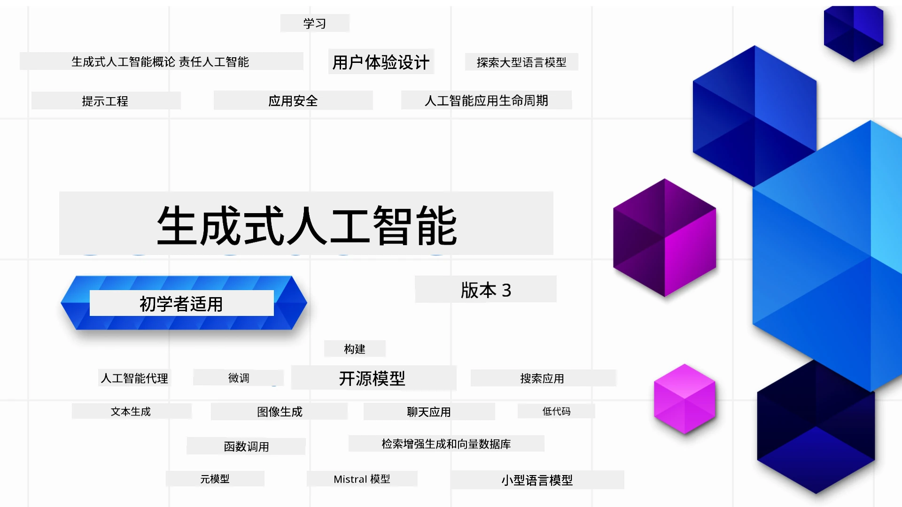

### 21课课程，教你了解构建生成式 AI 应用所需的全部知识

[](https://github.com/microsoft/Generative-AI-For-Beginners/blob/master/LICENSE?WT.mc_id=academic-105485-koreyst)
[](https://GitHub.com/microsoft/Generative-AI-For-Beginners/graphs/contributors/?WT.mc_id=academic-105485-koreyst)
[](https://GitHub.com/microsoft/Generative-AI-For-Beginners/issues/?WT.mc_id=academic-105485-koreyst)
[](https://GitHub.com/microsoft/Generative-AI-For-Beginners/pulls/?WT.mc_id=academic-105485-koreyst)
[](http://makeapullrequest.com?WT.mc_id=academic-105485-koreyst)

[](https://GitHub.com/microsoft/Generative-AI-For-Beginners/watchers/?WT.mc_id=academic-105485-koreyst)
[](https://GitHub.com/microsoft/Generative-AI-For-Beginners/network/?WT.mc_id=academic-105485-koreyst)
[](https://GitHub.com/microsoft/Generative-AI-For-Beginners/stargazers/?WT.mc_id=academic-105485-koreyst)

[](https://discord.gg/nTYy5BXMWG)

### 🌐 多语言支持

#### 通过 GitHub Action 支持（自动化且始终保持最新）

<!-- CO-OP TRANSLATOR LANGUAGES TABLE START -->
[阿拉伯语](../ar/README.md) | [孟加拉语](../bn/README.md) | [保加利亚语](../bg/README.md) | [缅甸语](../my/README.md) | [中文（简体）](./README.md) | [中文（繁体，香港）](../zh-HK/README.md) | [中文（繁体，澳门）](../zh-MO/README.md) | [中文（繁体，台湾）](../zh-TW/README.md) | [克罗地亚语](../hr/README.md) | [捷克语](../cs/README.md) | [丹麦语](../da/README.md) | [荷兰语](../nl/README.md) | [爱沙尼亚语](../et/README.md) | [芬兰语](../fi/README.md) | [法语](../fr/README.md) | [德语](../de/README.md) | [希腊语](../el/README.md) | [希伯来语](../he/README.md) | [印地语](../hi/README.md) | [匈牙利语](../hu/README.md) | [印度尼西亚语](../id/README.md) | [意大利语](../it/README.md) | [日语](../ja/README.md) | [卡纳达语](../kn/README.md) | [高棉语](../km/README.md) | [韩语](../ko/README.md) | [立陶宛语](../lt/README.md) | [马来语](../ms/README.md) | [马拉雅拉姆语](../ml/README.md) | [马拉地语](../mr/README.md) | [尼泊尔语](../ne/README.md) | [尼日利亚皮钦语](../pcm/README.md) | [挪威语](../no/README.md) | [波斯语（法尔西语）](../fa/README.md) | [波兰语](../pl/README.md) | [葡萄牙语（巴西）](../pt-BR/README.md) | [葡萄牙语（葡萄牙）](../pt-PT/README.md) | [旁遮普语（古鲁穆奇文）](../pa/README.md) | [罗马尼亚语](../ro/README.md) | [俄语](../ru/README.md) | [塞尔维亚语（西里尔字母）](../sr/README.md) | [斯洛伐克语](../sk/README.md) | [斯洛文尼亚语](../sl/README.md) | [西班牙语](../es/README.md) | [斯瓦希里语](../sw/README.md) | [瑞典语](../sv/README.md) | [他加禄语（菲律宾语）](../tl/README.md) | [泰米尔语](../ta/README.md) | [泰卢固语](../te/README.md) | [泰语](../th/README.md) | [土耳其语](../tr/README.md) | [乌克兰语](../uk/README.md) | [乌尔都语](../ur/README.md) | [越南语](../vi/README.md)

> **更喜欢本地克隆？**
>
> 本仓库包含50多种语言的翻译，会显著增加下载大小。要克隆不含翻译的版本，请使用稀疏检出：
>
> **Bash / macOS / Linux：**
> ```bash
> git clone --filter=blob:none --sparse https://github.com/microsoft/generative-ai-for-beginners.git
> cd generative-ai-for-beginners
> git sparse-checkout set --no-cone '/*' '!translations' '!translated_images'
> ```
>
> **CMD（Windows）：**
> ```cmd
> git clone --filter=blob:none --sparse https://github.com/microsoft/generative-ai-for-beginners.git
> cd generative-ai-for-beginners
> git sparse-checkout set --no-cone "/*" "!translations" "!translated_images"
> ```
>
> 这样你就能下载更快，且获得完成课程所需的所有内容。
<!-- CO-OP TRANSLATOR LANGUAGES TABLE END -->

# 面向初学者的生成式 AI（版本 3） - 一门课程

通过 Microsoft 云倡导者提供的21课综合课程，学习构建生成式 AI 应用的基础知识。

## 🌱 入门指南

本课程共21课。每课涵盖一个主题，欢迎从任意一课开始学习！

课程包含“学习”课，讲解生成式 AI 概念；以及“构建”课，讲解概念并尽可能提供 **Python** 与 **TypeScript** 的代码示例。

.NET 开发者请查看 [面向初学者的生成式 AI（.NET 版）](https://github.com/microsoft/Generative-AI-for-beginners-dotnet?WT.mc_id=academic-105485-koreyst)！

每课还包括“继续学习”部分，提供额外的学习工具。

## 所需条件
### 运行本课程代码，你可以使用：
 - [Azure OpenAI 服务](https://aka.ms/genai-beginners/azure-open-ai?WT.mc_id=academic-105485-koreyst) - **课程：** "aoai-assignment"
 - [Microsoft Foundry 模型](https://ai.azure.com/catalog/models?WT.mc_id=academic-105485-koreyst) - **课程：** "githubmodels"（GitHub 模型将于2026年7月底退休，建议使用 Microsoft Foundry 模型）
 - [OpenAI API](https://aka.ms/genai-beginners/open-ai?WT.mc_id=academic-105485-koreyst) - **课程：** "oai-assignment"
 - [Foundry Local](https://foundrylocal.ai?WT.mc_id=academic-105485-koreyst) - 在你自己的设备上完全离线运行模型，无需云订阅
   
- 基础的 Python 或 TypeScript 知识会有所帮助 - \*针对零基础学习者，请查看这些 [Python](https://aka.ms/genai-beginners/python?WT.mc_id=academic-105485-koreyst) 和 [TypeScript](https://aka.ms/genai-beginners/typescript?WT.mc_id=academic-105485-koreyst) 课程
- 拥有一个 GitHub 账号，以便 [将整个仓库 fork](https://aka.ms/genai-beginners/github?WT.mc_id=academic-105485-koreyst) 到你自己的 GitHub 账户

我们准备了一个 **[课程设置](./00-course-setup/README.md?WT.mc_id=academic-105485-koreyst)** 课程，帮助你进行开发环境配置。

别忘了给这个仓库点个[星标 (🌟)](https://docs.github.com/en/get-started/exploring-projects-on-github/saving-repositories-with-stars?WT.mc_id=academic-105485-koreyst)，方便以后查找。

## 🧠 准备好部署了？

若想获得更多高级代码示例，请查看我们提供的 [生成式 AI 代码示例集合](https://aka.ms/genai-beg-code?WT.mc_id=academic-105485-koreyst)，含 **Python** 与 **TypeScript** 版本。

## 🗣️ 结识其他学习者，获取支持

加入我们的[官方 Microsoft Foundry Discord 服务器](https://aka.ms/genai-discord?WT.mc_id=academic-105485-koreyst)，与其他学习者交流并获得支持。

在我们的 [Microsoft Foundry 开发者论坛](https://aka.ms/azureaifoundry/forum)（Github）提出问题或分享产品反馈。

## 🚀 正在创业？

访问 [Microsoft 创业支持](https://www.microsoft.com/startups?WT.mc_id=academic-105485-koreyst)，了解如何用 Azure 奖励金开始构建。

## 🙏 想要帮助？

你有建议或发现拼写或代码错误吗？[提出问题](https://github.com/microsoft/generative-ai-for-beginners/issues?WT.mc_id=academic-105485-koreyst)或[创建拉取请求](https://github.com/microsoft/generative-ai-for-beginners/pulls?WT.mc_id=academic-105485-koreyst)。

## 📂 每课包含：

- 主题简短的视频介绍
- README 中的书面课程内容
- 支持 Azure OpenAI 和 OpenAI API 的 Python 和 TypeScript 代码示例
- 继续学习的额外资源链接

## 🗃️ 课程列表

| #   | <strong>课程链接</strong>                                                                                                                              | <strong>描述</strong>                                                                                 | <strong>视频</strong>                                                                   | <strong>额外学习</strong>                                                             |
| --- | -------------------------------------------------------------------------------------------------------------------------------------------- | ----------------------------------------------------------------------------------------------- | --------------------------------------------------------------------------- | ------------------------------------------------------------------------------ |
| 00  | [课程设置](./00-course-setup/README.md?WT.mc_id=academic-105485-koreyst)                                                                 | **学习:** 如何设置你的开发环境                                            | 视频即将推出                                                                 | [了解更多](https://aka.ms/genai-collection?WT.mc_id=academic-105485-koreyst) |
| 01  | [生成式 AI 与大语言模型介绍](./01-introduction-to-genai/README.md?WT.mc_id=academic-105485-koreyst)                              | **学习:** 了解什么是生成式 AI 以及大语言模型（LLMs）如何工作       | [视频](https://aka.ms/gen-ai-lesson-1-gh?WT.mc_id=academic-105485-koreyst) | [了解更多](https://aka.ms/genai-collection?WT.mc_id=academic-105485-koreyst) |
| 02  | [探索与比较不同的大语言模型](./02-exploring-and-comparing-different-llms/README.md?WT.mc_id=academic-105485-koreyst)             | **学习:** 如何为你的用例选择合适的模型                                      | [视频](https://aka.ms/gen-ai-lesson2-gh?WT.mc_id=academic-105485-koreyst)  | [了解更多](https://aka.ms/genai-collection?WT.mc_id=academic-105485-koreyst) |

| 03  | [负责任地使用生成式 AI](./03-using-generative-ai-responsibly/README.md?WT.mc_id=academic-105485-koreyst)                           | **学习：** 如何负责任地构建生成式 AI 应用                                  | [视频](https://aka.ms/gen-ai-lesson3-gh?WT.mc_id=academic-105485-koreyst)  | [了解更多](https://aka.ms/genai-collection?WT.mc_id=academic-105485-koreyst) |
| 04  | [理解提示工程基础](./04-prompt-engineering-fundamentals/README.md?WT.mc_id=academic-105485-koreyst)             | **学习：** 实践提示工程最佳实践                                           | [视频](https://aka.ms/gen-ai-lesson4-gh?WT.mc_id=academic-105485-koreyst)  | [了解更多](https://aka.ms/genai-collection?WT.mc_id=academic-105485-koreyst) |
| 05  | [创建高级提示](./05-advanced-prompts/README.md?WT.mc_id=academic-105485-koreyst)                                                | **学习：** 如何应用提示工程技术提升提示的效果 | [视频](https://aka.ms/gen-ai-lesson5-gh?WT.mc_id=academic-105485-koreyst)  | [了解更多](https://aka.ms/genai-collection?WT.mc_id=academic-105485-koreyst) |
| 06  | [构建文本生成应用](./06-text-generation-apps/README.md?WT.mc_id=academic-105485-koreyst)                                | **构建：** 使用 Azure OpenAI / OpenAI API 构建文本生成应用                                | [视频](https://aka.ms/gen-ai-lesson6-gh?WT.mc_id=academic-105485-koreyst)  | [了解更多](https://aka.ms/genai-collection?WT.mc_id=academic-105485-koreyst) |
| 07  | [构建聊天应用](./07-building-chat-applications/README.md?WT.mc_id=academic-105485-koreyst)                                     | **构建：** 高效构建和集成聊天应用的技术               | [视频](https://aka.ms/gen-ai-lessons7-gh?WT.mc_id=academic-105485-koreyst) | [了解更多](https://aka.ms/genai-collection?WT.mc_id=academic-105485-koreyst) |
| 08  | [构建基于向量数据库的搜索应用](./08-building-search-applications/README.md?WT.mc_id=academic-105485-koreyst)                        | **构建：** 使用 Embeddings 搜索数据的搜索应用                        | [视频](https://aka.ms/gen-ai-lesson8-gh?WT.mc_id=academic-105485-koreyst)  | [了解更多](https://aka.ms/genai-collection?WT.mc_id=academic-105485-koreyst) |
| 09  | [构建图像生成应用](./09-building-image-applications/README.md?WT.mc_id=academic-105485-koreyst)                        | **构建：** 图像生成应用                                                       | [视频](https://aka.ms/gen-ai-lesson9-gh?WT.mc_id=academic-105485-koreyst)  | [了解更多](https://aka.ms/genai-collection?WT.mc_id=academic-105485-koreyst) |
| 10  | [构建低代码 AI 应用](./10-building-low-code-ai-applications/README.md?WT.mc_id=academic-105485-koreyst)                       | **构建：** 使用低代码工具构建生成式 AI 应用                                     | [视频](https://aka.ms/gen-ai-lesson10-gh?WT.mc_id=academic-105485-koreyst) | [了解更多](https://aka.ms/genai-collection?WT.mc_id=academic-105485-koreyst) |
| 11  | [使用函数调用集成外部应用](./11-integrating-with-function-calling/README.md?WT.mc_id=academic-105485-koreyst) | **构建：** 什么是函数调用及其在应用中的用例                          | [视频](https://aka.ms/gen-ai-lesson11-gh?WT.mc_id=academic-105485-koreyst) | [了解更多](https://aka.ms/genai-collection?WT.mc_id=academic-105485-koreyst) |
| 12  | [设计 AI 应用的用户体验](./12-designing-ux-for-ai-applications/README.md?WT.mc_id=academic-105485-koreyst)                         | **学习：** 开发生成式 AI 应用时如何应用用户体验设计原则         | [视频](https://aka.ms/gen-ai-lesson12-gh?WT.mc_id=academic-105485-koreyst) | [了解更多](https://aka.ms/genai-collection?WT.mc_id=academic-105485-koreyst) |
| 13  | [保障你的生成式 AI 应用安全](./13-securing-ai-applications/README.md?WT.mc_id=academic-105485-koreyst)                         | **学习：** AI 系统的威胁和风险及其安全防护方法             | [视频](https://aka.ms/gen-ai-lesson13-gh?WT.mc_id=academic-105485-koreyst) | [了解更多](https://aka.ms/genai-collection?WT.mc_id=academic-105485-koreyst) |
| 14  | [生成式 AI 应用生命周期](./14-the-generative-ai-application-lifecycle/README.md?WT.mc_id=academic-105485-koreyst)           | **学习：** 管理 LLM 生命周期和LLMOps 的工具及指标                         | [视频](https://aka.ms/gen-ai-lesson14-gh?WT.mc_id=academic-105485-koreyst) | [了解更多](https://aka.ms/genai-collection?WT.mc_id=academic-105485-koreyst) |
| 15  | [检索增强生成 (RAG) 及向量数据库](./15-rag-and-vector-databases/README.md?WT.mc_id=academic-105485-koreyst)        | **构建：** 使用 RAG 框架结合向量数据库中的嵌入进行检索的应用  | [视频](https://aka.ms/gen-ai-lesson15-gh?WT.mc_id=academic-105485-koreyst) | [了解更多](https://aka.ms/genai-collection?WT.mc_id=academic-105485-koreyst) |
| 16  | [开源模型与 Hugging Face](./16-open-source-models/README.md?WT.mc_id=academic-105485-koreyst)                                    | **构建：** 使用 Hugging Face 上可用的开源模型的应用                    | [视频](https://aka.ms/gen-ai-lesson16-gh?WT.mc_id=academic-105485-koreyst) | [了解更多](https://aka.ms/genai-collection?WT.mc_id=academic-105485-koreyst) |
| 17  | [AI 代理](./17-ai-agents/README.md?WT.mc_id=academic-105485-koreyst)                                                                       | **构建：** 使用 AI 代理框架的应用                                           | [视频](https://aka.ms/gen-ai-lesson17-gh?WT.mc_id=academic-105485-koreyst) | [了解更多](https://aka.ms/genai-collection?WT.mc_id=academic-105485-koreyst) |
| 18  | [微调大型语言模型 (LLMs)](./18-fine-tuning/README.md?WT.mc_id=academic-105485-koreyst)                                                              | **学习：** 微调大型语言模型的内容、原因和方法                                            | [视频](https://aka.ms/gen-ai-lesson18-gh?WT.mc_id=academic-105485-koreyst) | [了解更多](https://aka.ms/genai-collection?WT.mc_id=academic-105485-koreyst) |
| 19  | [使用小型语言模型 (SLMs) 构建](./19-slm/README.md?WT.mc_id=academic-105485-koreyst)                                                              | **学习：** 使用小型语言模型构建的优势                                            | 视频即将推出 | [了解更多](https://aka.ms/genai-collection?WT.mc_id=academic-105485-koreyst) |
| 20  | [使用 Mistral 模型构建](./20-mistral/README.md?WT.mc_id=academic-105485-koreyst)                                                              | **学习：** Mistral 系列模型的特性和区别                                           | 视频即将推出 | [了解更多](https://aka.ms/genai-collection?WT.mc_id=academic-105485-koreyst) |
| 21  | [使用 Meta 模型构建](./21-meta/README.md?WT.mc_id=academic-105485-koreyst)                                                              | **学习：** Meta 系列模型的特性和区别                                           | 视频即将推出 | [了解更多](https://aka.ms/genai-collection?WT.mc_id=academic-105485-koreyst) |

### 🌟 特别感谢

特别感谢 [**John Aziz**](https://www.linkedin.com/in/john0isaac/) 创建了所有 GitHub Actions 和工作流

[**Bernhard Merkle**](https://www.linkedin.com/in/bernhard-merkle-738b73/) 为每堂课做出了关键贡献，提升了学习者和代码体验。

## 🎒 其他课程

我们的团队还制作了其他课程！请查看：

<!-- CO-OP TRANSLATOR OTHER COURSES START -->
### LangChain
[](https://aka.ms/langchain4j-for-beginners)
[](https://aka.ms/langchainjs-for-beginners?WT.mc_id=m365-94501-dwahlin)
[](https://github.com/microsoft/langchain-for-beginners?WT.mc_id=m365-94501-dwahlin)
---

### Azure / Edge / MCP / 代理
[](https://github.com/microsoft/AZD-for-beginners?WT.mc_id=academic-105485-koreyst)
[](https://github.com/microsoft/edgeai-for-beginners?WT.mc_id=academic-105485-koreyst)
[](https://github.com/microsoft/mcp-for-beginners?WT.mc_id=academic-105485-koreyst)
[](https://github.com/microsoft/ai-agents-for-beginners?WT.mc_id=academic-105485-koreyst)

---
 
### 生成式 AI 系列
[](https://github.com/microsoft/generative-ai-for-beginners?WT.mc_id=academic-105485-koreyst)
[-9333EA?style=for-the-badge&labelColor=E5E7EB&color=9333EA)](https://github.com/microsoft/Generative-AI-for-beginners-dotnet?WT.mc_id=academic-105485-koreyst)

[-C084FC?style=for-the-badge&labelColor=E5E7EB&color=C084FC)](https://github.com/microsoft/generative-ai-for-beginners-java?WT.mc_id=academic-105485-koreyst)
[-E879F9?style=for-the-badge&labelColor=E5E7EB&color=E879F9)](https://github.com/microsoft/generative-ai-with-javascript?WT.mc_id=academic-105485-koreyst)

---
 
### 核心学习
[](https://aka.ms/ml-beginners?WT.mc_id=academic-105485-koreyst)
[](https://aka.ms/datascience-beginners?WT.mc_id=academic-105485-koreyst)
[](https://aka.ms/ai-beginners?WT.mc_id=academic-105485-koreyst)
[](https://github.com/microsoft/Security-101?WT.mc_id=academic-96948-sayoung)
[](https://aka.ms/webdev-beginners?WT.mc_id=academic-105485-koreyst)
[](https://aka.ms/iot-beginners?WT.mc_id=academic-105485-koreyst)
[](https://github.com/microsoft/xr-development-for-beginners?WT.mc_id=academic-105485-koreyst)

---
 
### Copilot 系列
[](https://aka.ms/GitHubCopilotAI?WT.mc_id=academic-105485-koreyst)
[](https://github.com/microsoft/mastering-github-copilot-for-dotnet-csharp-developers?WT.mc_id=academic-105485-koreyst)
[](https://github.com/microsoft/CopilotAdventures?WT.mc_id=academic-105485-koreyst)
<!-- CO-OP TRANSLATOR OTHER COURSES END -->

## 获取帮助

如果遇到困难或对构建 AI 应用有任何疑问，欢迎加入志同道合的学习者和经验丰富的开发者一起讨论 MCP。这里是一个支持性社区，欢迎提问并自由分享知识。

[](https://discord.gg/nTYy5BXMWG)

如果您在构建过程中有产品反馈或发现错误，请访问：

[](https://aka.ms/foundry/forum)

---

<!-- CO-OP TRANSLATOR DISCLAIMER START -->
**免责声明**：
本文件由 AI 翻译服务 [Co-op Translator](https://github.com/Azure/co-op-translator) 翻译完成。尽管我们力求准确，但请注意，自动翻译可能包含错误或不准确之处。原始语言版文件应视为权威来源。对于重要信息，建议使用专业人工翻译。我们对因使用本翻译而产生的任何误解或误释不承担责任。
<!-- CO-OP TRANSLATOR DISCLAIMER END -->