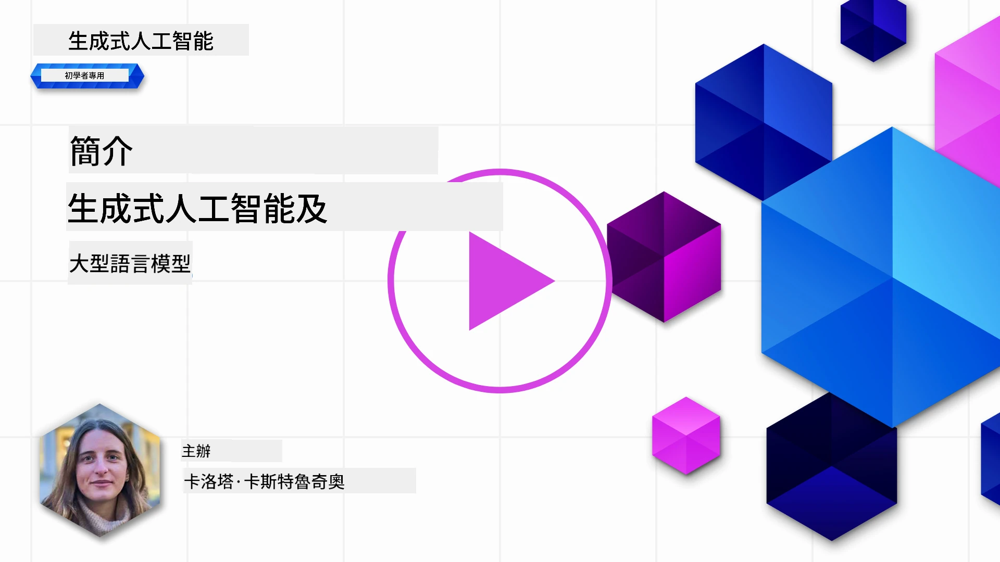
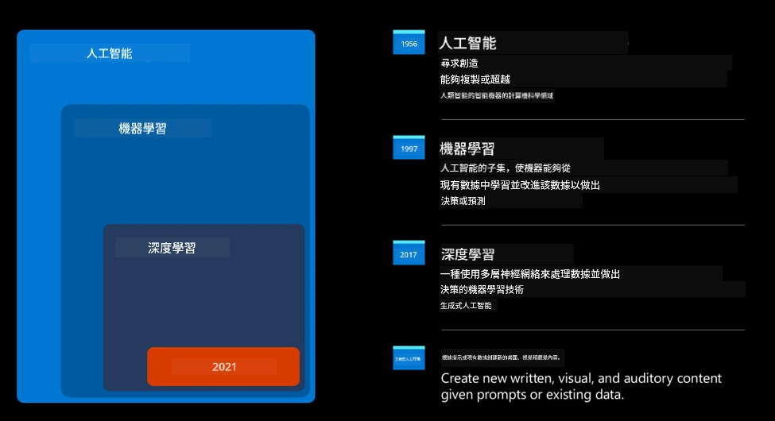
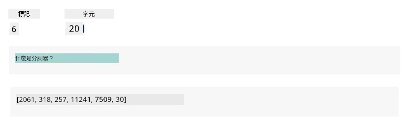
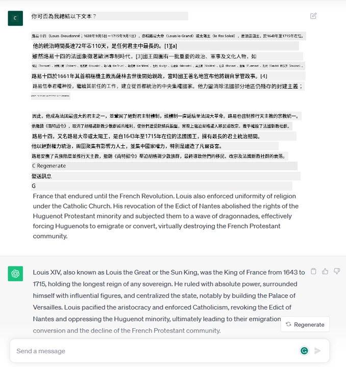
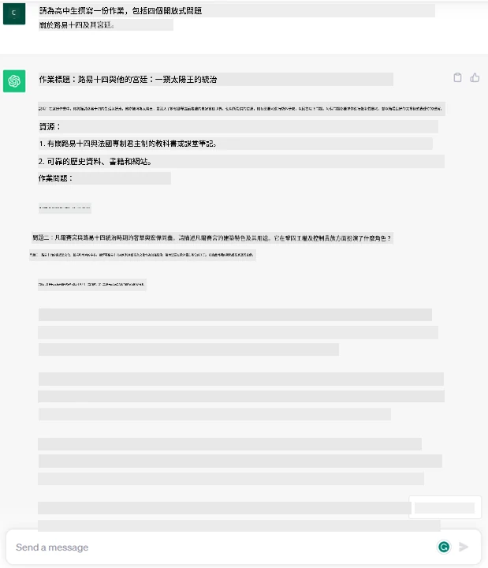
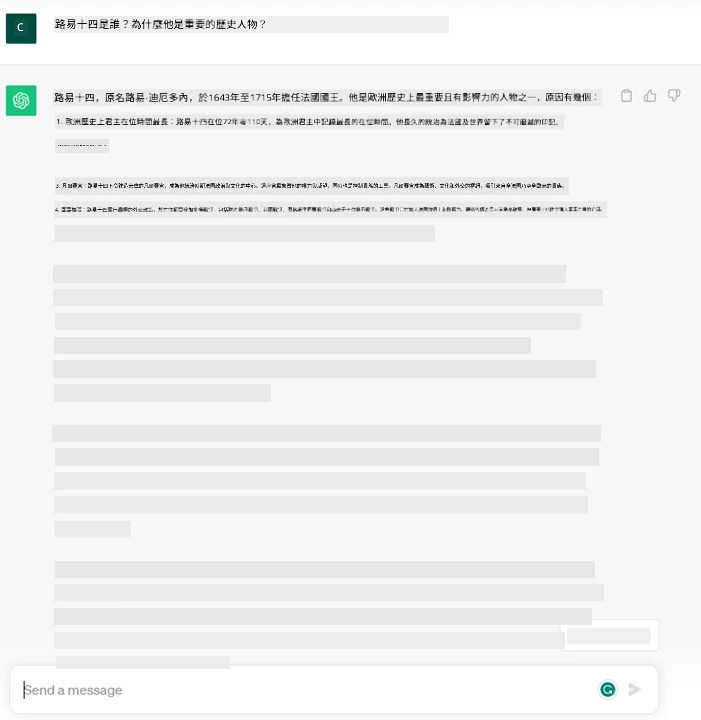
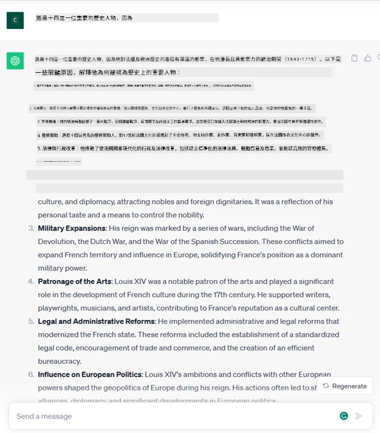
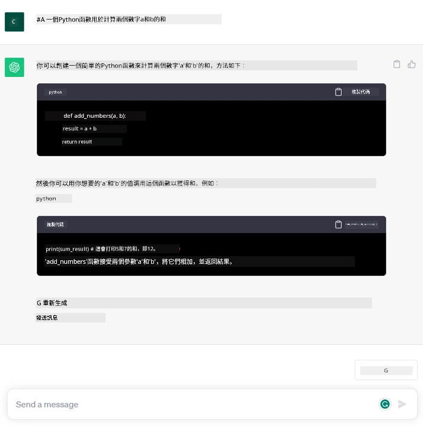

# 生成式人工智能與大型語言模型簡介

_(點擊上方圖片觀看本課程影片)_

生成式人工智能是能夠生成文本、圖像及其他類型內容的人工智能。這項技術的美妙之處在於它實現了人工智能的民主化，任何人只需一個文本提示，一句以自然語言書寫的句子，就能使用它。你不需要學習像 Java 或 SQL 這樣的語言來完成有價值的工作，只需使用你自己的語言，陳述你的需求，就會得到 AI 模型的建議。其應用與影響巨大，無論是撰寫或理解報告、撰寫應用程式等等，都能在短短數秒內完成。

在本課程中，我們將探索我們的創業公司如何利用生成式 AI 在教育領域開啟新場景，以及我們如何應對其社會影響的不可避免挑戰和技術限制。

## 簡介

本課程將涵蓋：

- 商業場景介紹：我們的創業點子與使命。
- 生成式 AI 以及我們如何踏上現有技術版圖。
- 大型語言模型的內部運作原理。
- 大型語言模型的主要能力與實際應用案例。

## 學習目標

完成本課程後，您將了解：

- 什麼是生成式 AI 及大型語言模型的工作原理。
- 如何在不同應用案例中利用大型語言模型，特別聚焦教育場景。

## 場景：我們的教育創業公司

生成式人工智能（AI）代表了 AI 技術的巔峰，突破了過去被認為不可能的界限。生成式 AI 模型具有多種能力與應用，但在本課程中，我們將探討它如何透過一個虛構的創業公司改變教育。我們將此創業公司稱為_我們的創業公司_。我們的創業公司專注於教育領域，其雄心壯志的使命宣言是

> _提升全球學習的可及性，確保教育公平，並依照每位學習者的需求提供個人化學習體驗_。

我們的創業團隊深知，若不借助現代最強大的工具之一──大型語言模型（LLM）──無法實現此目標。

預計生成式 AI 將徹底改變我們今日的學習與教學方式，學生可隨時擁有虛擬教師，提供大量資訊與範例，教師則能運用創新工具評估學生並給予反饋。

我們先定義課程中將使用的一些基本概念與術語。

## 生成式 AI 從何而來？

儘管近期生成式 AI 模型的問世掀起了巨大的_炒作_，但這項技術已歷經數十年發展，最早的研究可追溯到1960年代。如今的 AI 已具有類似人類認知能力，例如對話，如 [OpenAI ChatGPT](https://openai.com/chatgpt) 或 [Microsoft Copilot](https://copilot.microsoft.com/?WT.mc_id=academic-105485-koreyst) 這類產品，後者也利用 GPT 模型實現對話式網絡搜尋體驗。

回顧過去，最早的 AI 原型是通過打字的聊天機器人，依賴從專家群體提取並表示於電腦內的知識庫。知識庫中的回答是由輸入文本中的關鍵字觸發。
但很快便發現，這種利用打字聊天機器人的方法擴展性不足。

### 統計式人工智能方法：機器學習

90年代出現了轉折點，應用了統計方法於文本分析，催生出機器學習這類新算法，能夠從資料中學習模式而無需明確編程。此法使機器模擬人類語言理解：訓練統計模型配對文本與標籤，使模型能以預定義標籤對未知輸入文本分類，標籤代表訊息意圖。

### 神經網絡與現代虛擬助理

近年來，硬體技術進步能處理更大量的資料與複雜計算，推動 AI 研究，促成先進機器學習算法──神經網絡或深度學習算法──的發展。

神經網絡（特別是遞歸神經網絡 RNN）大幅提升自然語言處理能力，使文本意義表達更具語境價值，重視句中詞彙的上下文。

這項技術支撐了新世紀首個十年誕生的虛擬助理，在理解人類語言、識別需求與執行行動上表現優異──如以預設腳本回答或調用第三方服務。

### 當今的生成式 AI

這就是我們今日所見的生成式 AI，可視為深度學習的一個子集。

經過數十年 AI 研究，一種名為_Transformer_的新型模型架構突破了 RNN 的限制，能夠輸入更長的文本序列。Transformer 基於注意力機制，使模型能針對接收的輸入賦予不同權重，「更加關注」最相關資訊，無論其在文本中的順序為何。

多數近期生成式 AI 模型──亦稱為大型語言模型（LLM），因其以文本作為輸入與輸出──皆基於此架構。這些模型在訓練時使用來自書籍、文章與網站等各種來源的大量未標註資料，其有趣之處在於能適應多種任務，並能生成語法正確且具似創造力的文本。由此，模型不僅極大提升了機器「理解」輸入文本的能力，更賦予了以人類語言創造原創回應的能力。

## 大型語言模型如何運作？

接下來的章節將探討不同類型的生成式 AI 模型，但目前我們先了解大型語言模型的運作方式，特別以 OpenAI GPT（生成式預訓練 Transformer）模型為例。

- **分詞器，文本轉數字**：大型語言模型輸入文本並輸出文本，但由於它們是統計模型，更擅長處理數字而非文本序列。因此每個輸入在送入核心模型前都要經過分詞器處理。分詞是將輸入文本拆分成若干「詞元」，即由不同字元組成的文本片段。接著，詞元會被映射為詞元索引，即此文本片段的整數編碼。

- <strong>預測輸出詞元</strong>：模型輸入 n 個詞元（最大 n 值依模型而異），可預測一個詞元作為輸出。此詞元隨後會被包含於下一輪輸入中，隨著視窗擴展，帶來更佳的用戶體驗，產出一個（或多個）句子作為回答。這也解釋了為何有時玩 ChatGPT 時會見到它像是停在句中間。

- **選擇過程，機率分布**：模型根據當前文本序列後出現的概率來選擇輸出詞元，模型會預測所有可能的「下一詞元」的機率分布，該分布基於訓練結果。但模型不一定會選擇機率最高的詞元，會引入一定程度的隨機性，使模型表現為非確定性——同樣的輸入可能產生不同的輸出。此隨機性用以模擬創意思考過程，並可利用一個叫作 temperature 的參數來調節。

## 我們的創業公司如何運用大型語言模型？

在瞭解大型語言模型內在運作後，讓我們看看它能勝任的常見任務實例，聚焦於我們的商業場景。我們說大型語言模型的主要能力是_從無到有生成文本，起點是以自然語言書寫的文本輸入_。

大型語言模型的輸入被稱為提示（prompt），輸出則稱為完成（completion），此詞指模型生成下一詞元以完成當前輸入的機制。我們將深入探討提示是什麼，以及如何設計提示來最大化模型效能。但目前先說，一個提示可能包含：

  
    
  
  2. 創意構思與設計文章、論文、作業等。
  
    

  
  

  
  

  
  

若完成此任務，你甚至可以嘗試申請微軟的創業孵化器，[Microsoft for Startups Founders Hub](https://www.microsoft.com/startups?WT.mc_id=academic-105485-koreyst)，我們提供 Azure、OpenAI、導師指導等多項資源與額度，快來看看！

## 知識檢測

關於大型語言模型，下列何者正確？

1. 每次輸入都得到完全相同的回應。
1. 其執行完美無缺，很擅長加法運算，生成可用程式碼等。
1. 即使使用同一提示，回應也可能不同。它也很適合提供草稿，無論是文本或程式碼，但你需要對結果進行改進。

A: 3，是非確定性模型，回應會變化，但可透過溫度參數控制變異程度。也不應期望它做事完美，它的目標是為你做大量繁重工作，通常意味著你會取得一個良好的初稿，需要你逐步改進。

## 做得好！繼續前進

完成本課程後，請瀏覽我們的[生成式 AI 學習合集](https://aka.ms/genai-collection?WT.mc_id=academic-105485-koreyst)，持續提升你的生成式 AI 知識！

前往第 2 課，我們將會探討如何[探索及比較不同類型的 LLM](../02-exploring-and-comparing-different-llms/README.md?WT.mc_id=academic-105485-koreyst)！

---

<!-- CO-OP TRANSLATOR DISCLAIMER START -->
**免責聲明**：
本文件由 AI 翻譯服務 [Co-op Translator](https://github.com/Azure/co-op-translator) 翻譯而成。雖然我們致力於確保準確性，但請注意，機器自動翻譯可能包含錯誤或不準確之處。原始文件的母語版本應被視為權威來源。對於重要資訊，建議進行專業人工翻譯。我們不對因使用本翻譯而產生的任何誤解或誤釋承擔責任。
<!-- CO-OP TRANSLATOR DISCLAIMER END -->