# 探索與比較不同的大型語言模型（LLM）

[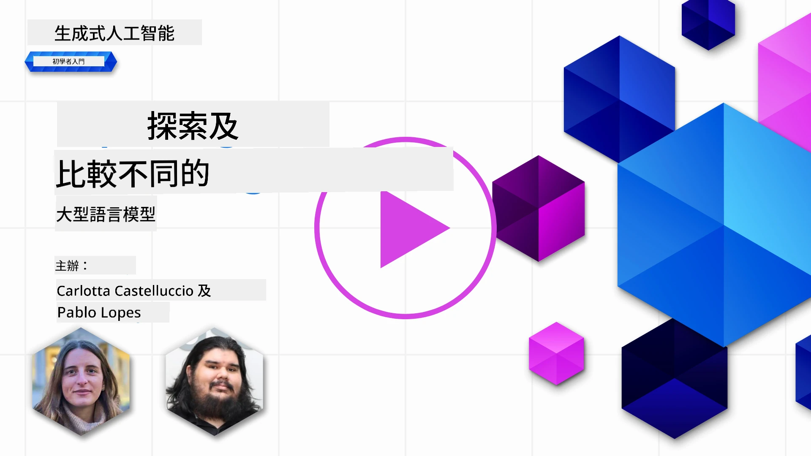](https://youtu.be/KIRUeDKscfI?si=8BHX1zvwzQBn-PlK)

> _點擊上方圖片觀看本課程視頻_

在上一課中，我們已經看到生成式人工智能如何改變技術格局、大型語言模型（LLM）的運作方式，以及像我們的創業公司這樣的企業如何應用它們到實際用例並成長！本章節中，我們將比較和對比不同類型的大型語言模型，以了解它們的優缺點。

我們創業公司的下一步是探索現有大型語言模型的景況，並了解哪些模型適合我們的用例。

## 介紹

本課程將涵蓋：

- 當前大型語言模型的不同類型。
- 在 Azure 上針對你的用例進行測試、迭代和比較不同的模型。
- 如何部署大型語言模型。

## 學習目標

完成本課程後，你將能夠：

- 選擇適合你用例的正確模型。
- 了解如何測試、迭代和提升模型性能。
- 知道企業如何部署模型。

## 了解不同類型的大型語言模型

大型語言模型可以依其架構、訓練數據及用例有多種分類。了解這些差異將幫助我們的創業公司選擇適合情境的模型，並明白如何測試、迭代及提升性能。

LLM 有很多不同的類型，你選擇哪一款模型取決於你打算如何使用它們、你的數據量、預算等等。

根據你想將模型用於文字、音訊、影像、影片生成等等，你可能會選擇不同類型的模型。

- <strong>音訊與語音識別</strong>。Whisper 類模型仍是有用的通用語音識別模型，但生產環境選擇現在也包含較新的語音轉文字模型，如 `gpt-4o-transcribe`、`gpt-4o-mini-transcribe`，以及分離語者的變種。請根據你的情境評估語言覆蓋範圍、語者分離、實時支援、延遲和成本。更多資訊請參考 [OpenAI 語音轉文字文件](https://platform.openai.com/docs/guides/speech-to-text?WT.mc_id=academic-105485-koreyst)。

- <strong>圖像生成</strong>。DALL-E 和 Midjourney 是知名的圖像生成選項，但現有 OpenAI 圖像 API 主要以 GPT Image 模型（如 `gpt-image-2`）為中心，而 Stable Diffusion、Imagen、Flux 以及其他模型家族也是常見選擇。請比較提示符合度、編輯支援、風格控制、安全要求和授權情況。詳情請參考 [OpenAI 圖像生成指南](https://platform.openai.com/docs/guides/images?WT.mc_id=academic-105485-koreyst) 以及本課程第9章。

- <strong>文字生成</strong>。文字模型涵蓋前沿模型、推理模型、更小的低延遲模型及開源權重模型。目前範例包括 OpenAI GPT-5.x 模型、Anthropic Claude 4.x 模型、Google Gemini 3.x 模型、Meta Llama 4 模型和 Mistral 模型。不可僅以發布日期或價格選擇，需比較任務質量、延遲、上下文窗口、工具使用、安全行為、區域可用性和總成本。[Microsoft Foundry 模型目錄](https://ai.azure.com/catalog?WT.mc_id=academic-105485-koreyst) 是比較 Azure 上可用模型的好去處。

- <strong>多模態</strong>。許多現有模型能處理不止文字。一些接受圖像、音訊或影片輸入；有些能調用工具；專門模型則能生成圖像、音訊或影片。例如，現有 OpenAI 模型支援文字與圖像輸入，Gemini 模型根據變體支援文字、代碼、圖像、音訊及影片輸入，Llama 4 Scout 和 Maverick 是原生多模態開權重模型。使用前請務必查看各模型的支持輸入與輸出模態。

選擇模型意味著你獲得一些基本能力，但這通常不足夠。通常，你會有公司特定數據需要告訴 LLM。有幾種方法可以處理後續這部分，我們在接下來的章節會介紹。

### 基礎模型與大型語言模型的差異

「基礎模型」一詞由 [斯坦福研究者創造](https://arxiv.org/abs/2108.07258?WT.mc_id=academic-105485-koreyst)，並定義為符合以下標準的人工智能模型：

- <strong>它們使用無監督學習或自監督學習訓練</strong>，意即它們使用未標記的多模態數據訓練，不需人工標註或標記數據。
- <strong>它們是非常大型的模型</strong>，基於深層神經網絡並由數十億參數訓練而成。
- **它們通常用作其他模型的「基礎」**，即可以作為開發其他模型的起點，透過微調完成。

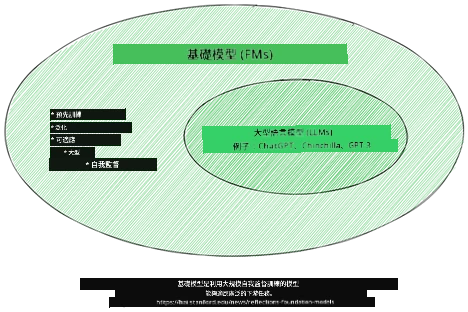

圖片來源：[Essential Guide to Foundation Models and Large Language Models | by Babar M Bhatti | Medium
](https://thebabar.medium.com/essential-guide-to-foundation-models-and-large-language-models-27dab58f7404)

進一步說明這區別，我們以 ChatGPT 作為歷史範例。早期版本的 ChatGPT 使用 GPT-3.5 作為基礎模型。OpenAI 隨後使用聊天特定數據和對齊技術，創建出調優版本，在對話場景（如聊天機器人）中表現更佳。如今的 AI 服務通常在幾個模型變體間切換，因此服務名稱和底層模型名稱不總是相同。

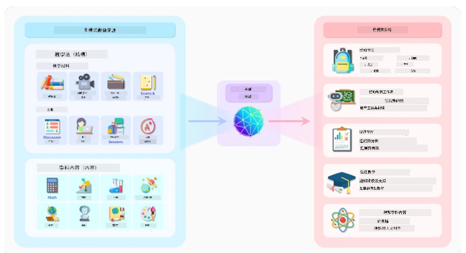

圖片來源：[2108.07258.pdf (arxiv.org)](https://arxiv.org/pdf/2108.07258.pdf?WT.mc_id=academic-105485-koreyst)

### 開權重／開源模型與專有模型的區別

另一種分類方式是根據模型是否為開權重、開源或專有。

開源及開權重模型會提供模型產物供檢查、下載或定制，但許可條款不同。有些完全開源，有些是帶使用限制的開權重模型。當企業需更好控制部署、數據位置、成本或定制時，這些模型十分有用。不過團隊仍須查看授權條款、服務成本、維護、安全更新及評估質量，才能生產使用。例子包括 [Meta Llama 4](https://ai.meta.com/blog/llama-4-multimodal-intelligence/?WT.mc_id=academic-105485-koreyst)、部分 [Mistral 模型](https://docs.mistral.ai/models/overview?WT.mc_id=academic-105485-koreyst)，以及許多托管於 [Hugging Face](https://huggingface.co/models?WT.mc_id=academic-105485-koreyst) 的模型。

專有模型由供應商擁有並托管。這些模型通常針對托管生產使用進行優化，能提供強大的支援、安全系統、工具整合和擴展能力，但客戶通常無法檢查或修改模型權重，且必須審查供應商條款，注意隱私、資料保留、合規及合理使用。例子有 [OpenAI 模型](https://platform.openai.com/docs/models?WT.mc_id=academic-105485-koreyst)、[Google Gemini](https://deepmind.google/models/gemini/pro/?WT.mc_id=academic-105485-koreyst) 及 [Anthropic Claude](https://platform.claude.com/docs/en/about-claude/models/overview?WT.mc_id=academic-105485-koreyst)。

### 嵌入模型、圖像生成模型與文字和程式碼生成模型

LLM 還可依輸出類型分類。

嵌入模型能將文本轉換為數值形式，稱為嵌入，是輸入文本的數字表示。嵌入有助機器理解單詞或句子間關係，且可作為其他模型的輸入，如分類模型或聚類模型，這些模型在數值資料上性能更佳。嵌入模型常用於遷移學習，即建立一個有充裕數據的代理任務模型，然後重用其模型權重（嵌入）以用於其他下游任務。此類的例子為 [OpenAI 嵌入模型](https://platform.openai.com/docs/models/embeddings?WT.mc_id=academic-105485-koreyst)。

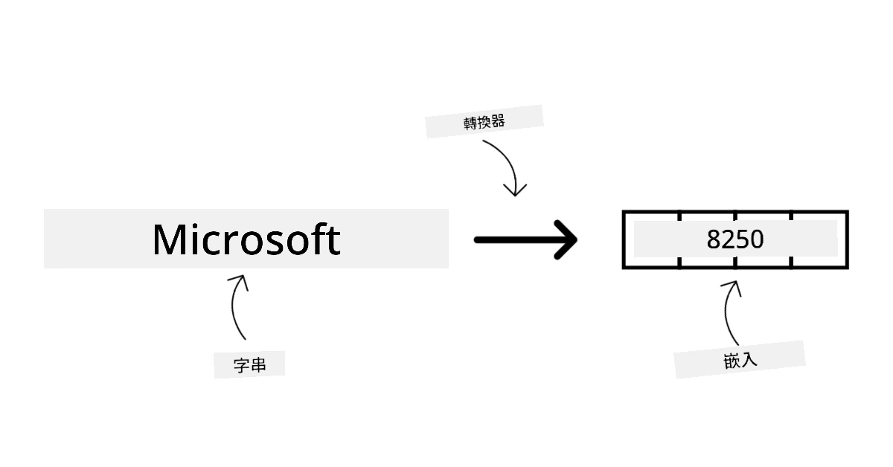

圖像生成模型可以生成圖像，常用於圖像編輯、合成和轉換。這些模型通常用大量圖像數據集訓練，如 [LAION-5B](https://laion.ai/blog/laion-5b/?WT.mc_id=academic-105485-koreyst)，能生成新圖像或利用塗抹、超解析、著色等技術編輯既有圖像。例子有 [GPT 圖像模型](https://platform.openai.com/docs/guides/images?WT.mc_id=academic-105485-koreyst)、[Stable Diffusion 模型](https://github.com/Stability-AI/StableDiffusion?WT.mc_id=academic-105485-koreyst) 和 Imagen 模型。

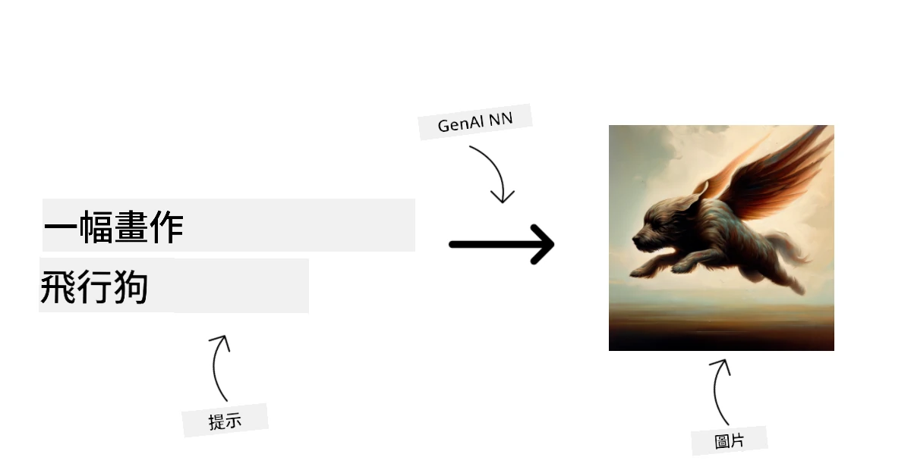

文字和程式碼生成模型能生成文字或程式碼，通常用於文字總結、翻譯和問答。文字生成模型如 [BookCorpus](https://www.cv-foundation.org/openaccess/content_iccv_2015/html/Zhu_Aligning_Books_and_ICCV_2015_paper.html?WT.mc_id=academic-105485-koreyst) 大型文字數據集訓練，能生成新文字或回答問題。程式碼生成模型如 [CodeParrot](https://huggingface.co/codeparrot?WT.mc_id=academic-105485-koreyst) 通常用大型程式碼數據如 GitHub 訓練，可生成新程式碼或修復現有程式碼的錯誤。

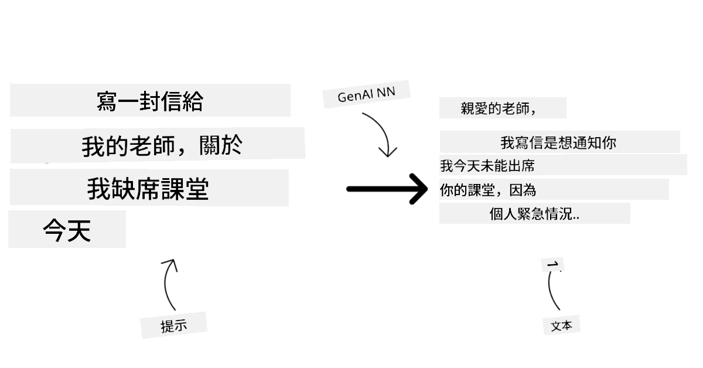

### 編碼器－解碼器架構與僅解碼器架構

談論 LLM 的不同架構類型時，我們用比喻來說明。

想像你的主管交給你一個任務，要為學生撰寫測驗題。你有兩個同事；一個負責創作內容，另一個負責審核。

創作內容的人就像僅解碼器模型：他們能看主題、檢視你已寫的內容，並基於上下文繼續生成內容。他們很拿手寫吸引人且具資訊性的內容，但在只需分類、檢索或編碼資訊時不一定最適合。例子為 GPT 和 Llama 家族的模型。

審核的人就像僅編碼器模型，他們查看撰寫過的課程和答案，察覺彼此關係並理解上下文，但不擅長生成內容。編碼器模型的例子有 BERT。

想像我們還可以有一位既能創作又能審核測驗的人，這就是編碼器－解碼器模型。例子有 BART 和 T5。

### 服務與模型的區別

現在，讓我們談談服務和模型的區別。服務是由雲服務提供商所提供的產品，通常是模型、資料及其他元件的組合。模型是服務的核心元件，通常是基礎模型，如大型語言模型。

服務常為生產用途優化，且較模型容易操作，通常有圖形用戶介面。然而服務通常非免費，可能需訂閱或付費，以換取利用服務擁有者的設備與資源，達成成本優化和易擴展。例子為 [Azure OpenAI 服務](https://learn.microsoft.com/azure/ai-services/openai/overview?WT.mc_id=academic-105485-koreyst)，其提供隨用隨付的費率，依使用量計費。Azure OpenAI 服務同時在模型能力上層加企業級安全與負責任的 AI 框架。

模型指神經網絡相關產物：參數、權重、架構、分詞器及支援配置。要在本地或私有環境運行模型，需合適硬件、服務基礎設施、監控，且要有相容的開源／開權重許可或商用許可。開權重模型如 Llama 4 或 Mistral 可自託管，但仍需運算能力和營運專業知識。

## 如何在 Azure 上測試並迭代不同模型以了解其性能

當我們的團隊探索了現有的 LLM 生態並為他們的場景挑選出一些合適的候選模型後，下一步就是在他們的數據和工作負載上對模型進行測試。這是一個通過實驗和測量進行的迭代過程。
我們在前述段落中提到的大部分模型（OpenAI 模型、如 Llama 4 和 Mistral 的開放權重模型，以及 Hugging Face 模型）都可在 [Microsoft Foundry Models](https://learn.microsoft.com/azure/foundry/concepts/foundry-models-overview?WT.mc_id=academic-105485-koreyst) 使用。

[Microsoft Foundry](https://learn.microsoft.com/azure/foundry/what-is-foundry?WT.mc_id=academic-105485-koreyst)，原名 Azure AI Studio/Azure AI Foundry，是一個統一的 Azure 平台，用於構建 AI 應用程式和代理。它幫助開發人員管理從實驗、評估到部署、監控及治理的生命週期。Microsoft Foundry 的模型目錄讓使用者能夠：

- 在目錄中找到感興趣的基礎模型，包括由 Azure 銷售的模型以及合作夥伴和社區提供者的模型。用戶可以通過任務、供應商、授權、部署選項或名稱進行篩選。

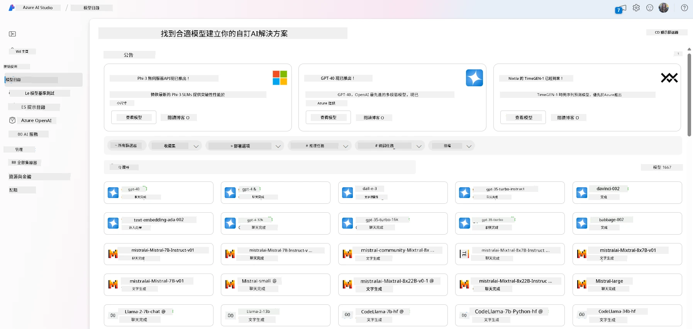

- 閱讀模型卡，包括對預期用途和訓練數據的詳細描述、示範代碼及內部評估庫上的評估結果。

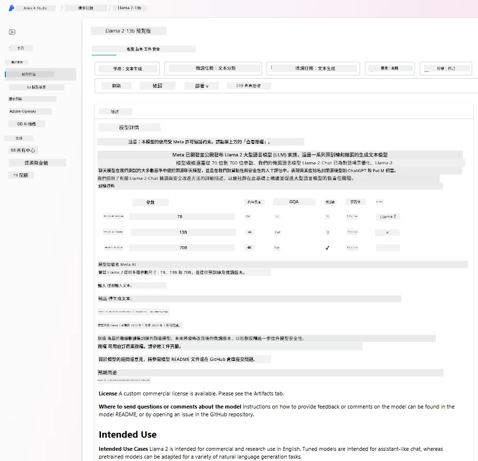

- 通過[模型基準測試](https://learn.microsoft.com/azure/ai-studio/how-to/model-benchmarks?WT.mc_id=academic-105485-koreyst)面板，對行業中可用的不同模型和數據集的基準進行比較，以評估哪個符合商業場景。

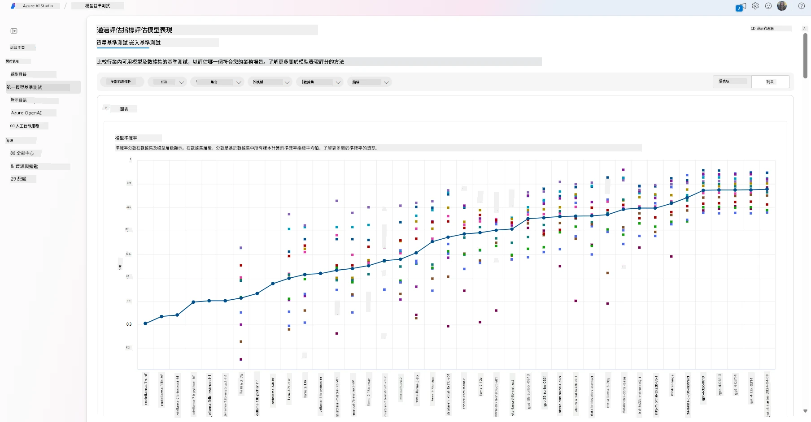

- 利用 Microsoft Foundry 的實驗和追蹤功能，對支持的模型進行自訂訓練數據的微調，以提升模型在特定工作負載下的性能。

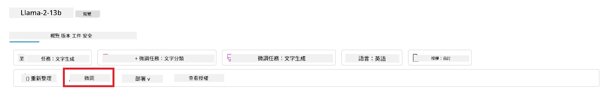

- 將原始預訓練模型或微調後的版本部署到遠端的實時推理端點，使用託管計算或無伺服器部署選項，讓應用程式能使用模型。

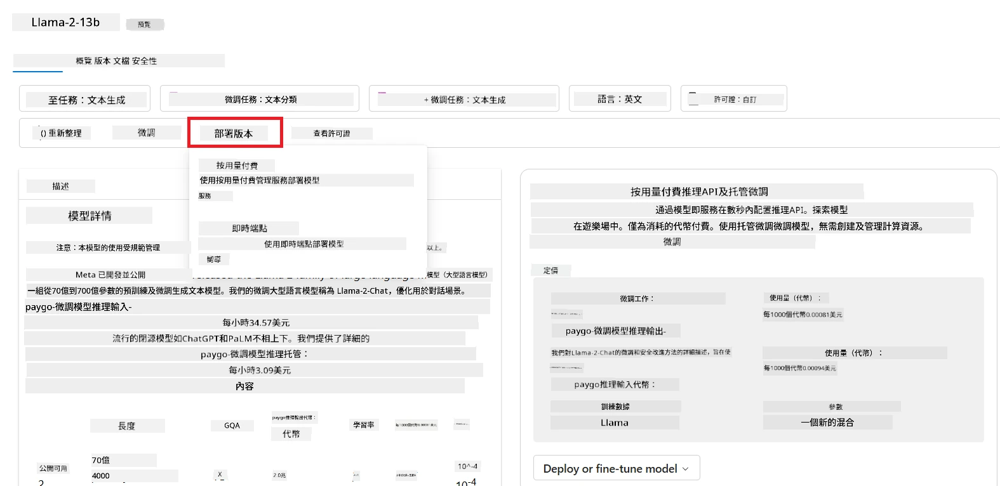

> [!NOTE]
> 目錄中的所有模型目前不一定能進行微調和/或按需付費部署。請查看模型卡了解模型的功能和限制詳情。

## 改善 LLM 結果

我們與初創團隊探索了各種 LLM 以及一個能讓我們比較不同模型、在測試數據上評估、提升性能和部署到推理端點的雲端平台（Microsoft Foundry）。

但他們到底何時應該考慮微調模型，而不是使用預訓練模型？還有其他方法可提升模型在特定工作負載上的性能嗎？

企業可以使用多種方法從 LLM 中獲得所需結果。部署時可以選擇不同類型、不同訓練程度的模型，並有不同複雜度、成本和品質水平。以下是一些不同的方法：

- <strong>帶上下文的提示工程</strong>。想法是提供足夠的上下文在提示時，以確保獲得所需的回應。

- **檢索增強生成，RAG**。你的數據可能存在於資料庫或網絡端點中，為確保該數據或其子集於提示時被包含，你可以抓取相關數據並使其成為用戶提示的一部分。

- <strong>微調模型</strong>。在這裡，你對模型進行了額外的訓練，使用你自己的數據，使模型更精確且更能回應你的需求，但成本可能較高。

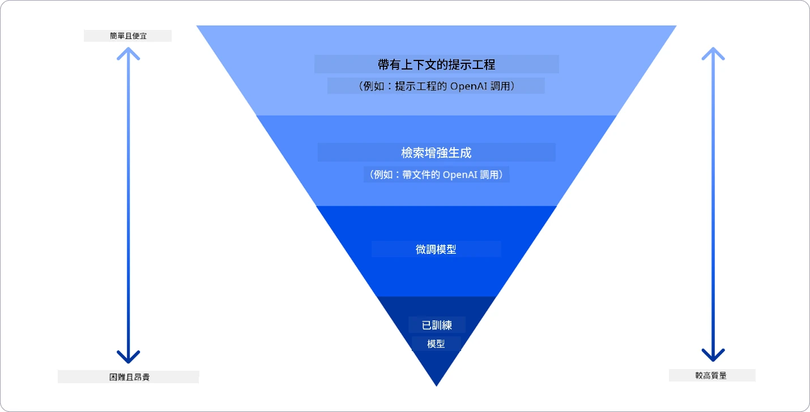

圖片來源：[Four Ways that Enterprises Deploy LLMs | Fiddler AI Blog](https://www.fiddler.ai/blog/four-ways-that-enterprises-deploy-llms?WT.mc_id=academic-105485-koreyst)

### 帶上下文的提示工程

預訓練的 LLM 在一般語言任務中表現良好，即使只給一個簡短提示，如完成一句句子或回答問題——即所謂的「零次學習」。

但用戶越能用詳細的請求和範例來限定查詢的範圍——上下文——回答就越準確且越符合用戶預期。如果提示只包含一個範例，稱為「一次學習」，包含多個範例則稱為「少量學習」。
帶上下文的提示工程是最具成本效益的入門方法。

### 檢索增強生成 (RAG)

LLM 有限制，僅能使用訓練時已有的數據來生成答案。這意味著它們不了解訓練後發生的事實，且無法訪問非公開資訊（如公司數據）。
這問題可通過 RAG 克服，該技術將一份份文件片段作為外部數據擴充提示，考慮提示長度限制。這由向量數據庫工具支援（例如 [Azure Vector Search](https://learn.microsoft.com/azure/search/vector-search-overview?WT.mc_id=academic-105485-koreyst)），可從各種預設數據來源檢索有用片段，並將其加入提示上下文。

當企業無足夠數據、時間或資源來微調 LLM，但仍希望提升特定工作負載的性能並減少虛構、過時或無支持回答的風險時，這技術非常有幫助。

### 微調模型

微調是一種利用轉移學習來「適配」模型於下游任務或解決特定問題的過程。與少量學習和 RAG 不同，它產生一個新模型，擁有更新的權重和偏差。需要一套訓練範例，每例包含輸入（提示）及其相應輸出（完成）。
這會是首選方法，如果：

- <strong>使用較小的任務專屬模型</strong>。企業希望微調較小模型來處理狹窄任務，而不是重複提示較大型的先進模型，從而節省成本並加快速度。

- <strong>考慮延遲</strong>。對某些用例延遲很重要，因此無法使用非常長的提示，或模型要學習的範例數不符合提示長度限制。

- <strong>適應穩定行為</strong>。企業擁有很多高質量範例，希望模型持續遵循任務模式、輸出格式、語氣或特定領域風格。如果主要問題是最新事實或頻繁變更的私人知識，應用 RAG 而非僅依賴微調。

### 訓練模型

從零開始訓練 LLM 無疑是最困難且最複雜的方法，需要大量數據、專業人員和充足運算能力。僅在企業有領域特定應用和大量領域中心數據時才考慮此選項。

## 知識測試

下列哪種方法可以有效改善 LLM 的完成結果？

1. 帶上下文的提示工程
1. RAG
1. 微調模型

答：三種方法皆可幫助。先從帶上下文的提示工程開始以快速改善，當模型需要最新事實或私人商業數據時使用 RAG。有足夠高質量範例且需要模型持續遵循任務、格式、語氣或領域模式時，選擇微調。

## 🚀 挑戰

進一步了解如何為你的業務[使用 RAG](https://learn.microsoft.com/azure/search/retrieval-augmented-generation-overview?WT.mc_id=academic-105485-koreyst)。

## 幹得好，繼續學習

完成本課程後，查看我們的[生成式 AI 學習合集](https://aka.ms/genai-collection?WT.mc_id=academic-105485-koreyst)，持續提升你的生成式 AI 知識！

前往第三課，我們將探討如何[負責任地使用生成式 AI](../03-using-generative-ai-responsibly/README.md?WT.mc_id=academic-105485-koreyst)！

---

<!-- CO-OP TRANSLATOR DISCLAIMER START -->
**免責聲明**：
本文件由 AI 翻譯服務 [Co-op Translator](https://github.com/Azure/co-op-translator) 翻譯而成。雖然我們致力於確保準確性，但請注意，機器自動翻譯可能包含錯誤或不準確之處。原始文件的母語版本應被視為權威來源。對於重要資訊，建議進行專業人工翻譯。我們不對因使用本翻譯而產生的任何誤解或誤釋承擔責任。
<!-- CO-OP TRANSLATOR DISCLAIMER END -->