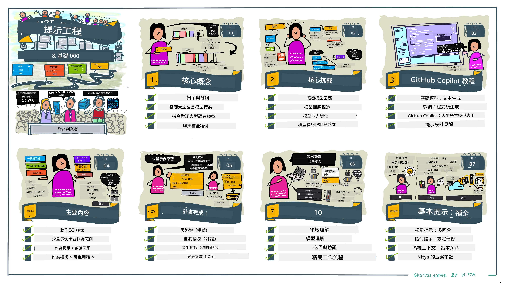
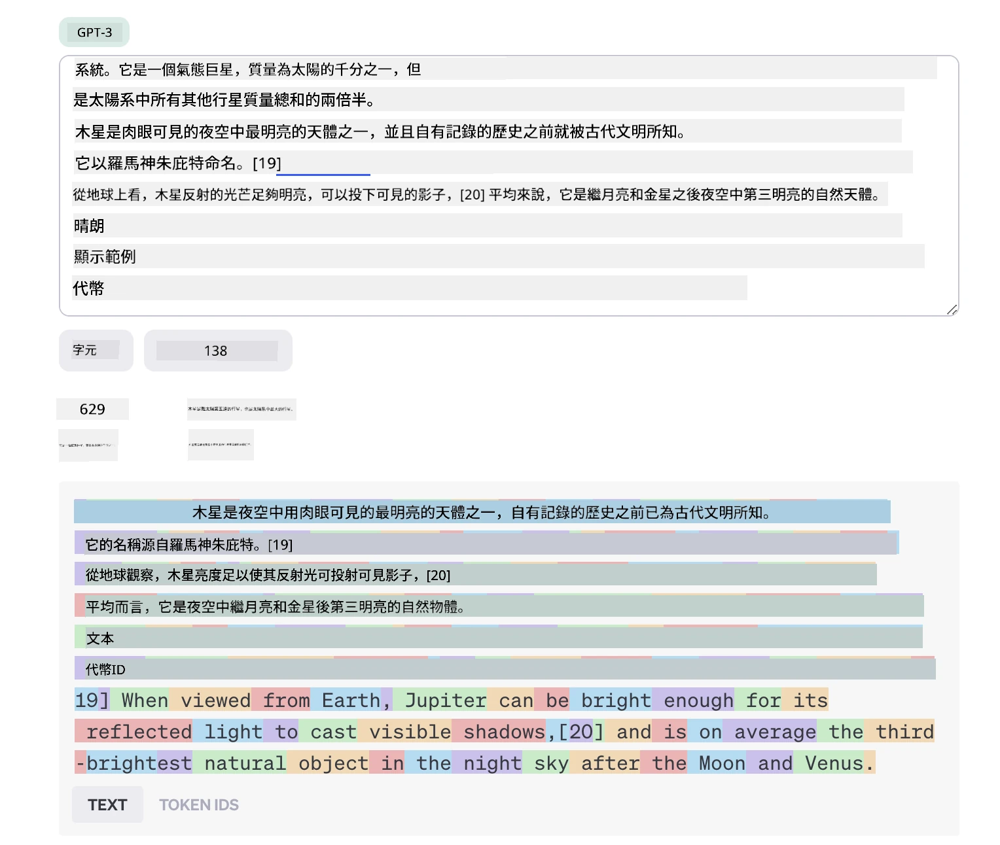
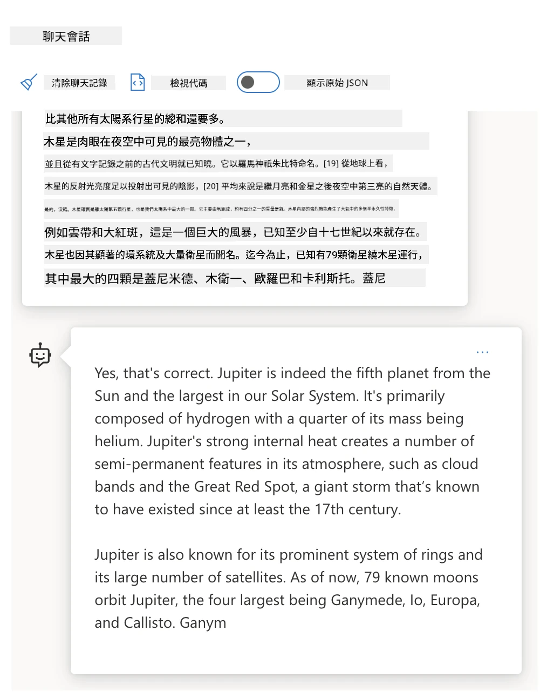
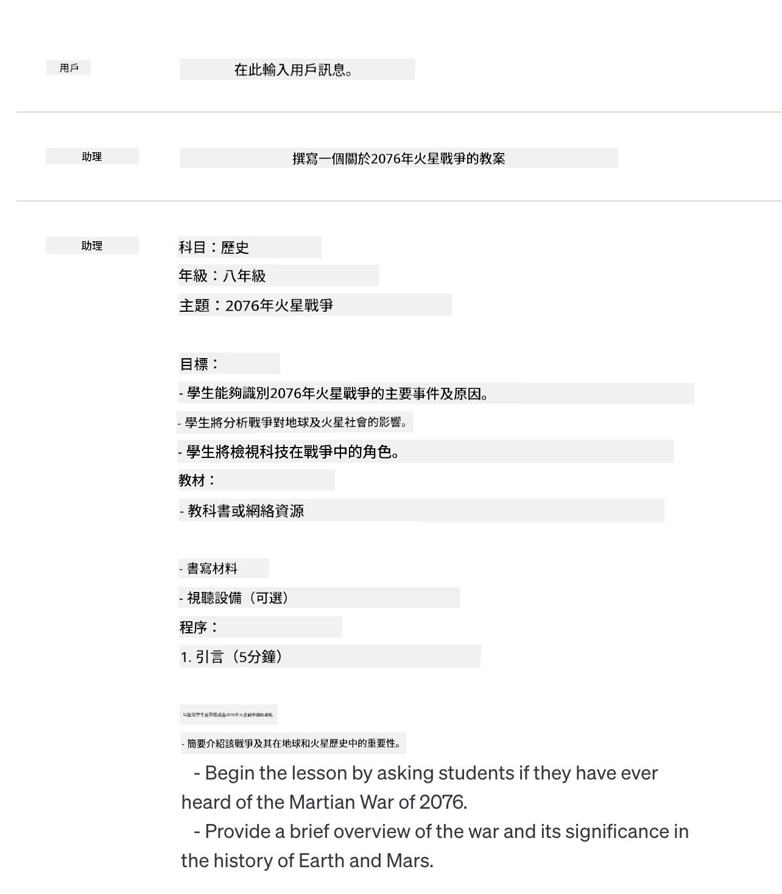

# Prompt 工程基礎

[](https://youtu.be/GElCu2kUlRs?si=qrXsBvXnCW12epb8)

## 介紹
本模組涵蓋了在生成式 AI 模型中創建有效提示的基本概念和技術。你如何撰寫給大語言模型（LLM）的提示也非常重要。一個精心設計的提示可以達到更好的回應質量。但像 _prompt_ 和 _prompt engineering_ 這些詞到底是什麼意思？我如何改進傳送給 LLM 的提示 _輸入_？這些是我們在本章及下一章將嘗試回答的問題。

_生成式 AI_ 能夠根據用戶請求產生新的內容（例如文字、圖片、音頻、程式碼等）。它利用像 OpenAI GPT（「生成式預訓練轉換器」）系列這樣的大型語言模型（LLM），這些模型經過自然語言和程式碼的訓練來實現此功能。

用戶現在可以使用熟悉的聊天等範式與這些模型互動，無需技術專業知識或培訓。這些模型是 _以提示為基礎_ 的 — 用戶發送文字輸入（提示），然後獲得 AI 回應（完成）。他們可以反覆「和 AI 聊天」，進行多輪對話，優化提示，直到回應符合預期為止。

「提示」現在成為生成式 AI 應用的主要 _程式設計介面_，告訴模型要做什麼，並影響返回回應的品質。「提示工程」是一個快速發展的研究領域，專注於 _提示的設計與優化_，以規模化地提供一致且優質的回應。

## 學習目標

在本課中，我們將了解什麼是提示工程，為何它很重要，以及如何為特定模型和應用目標精心設計更有效的提示。我們會理解提示工程的核心概念和最佳實踐，並學習一個互動式 Jupyter 筆記本的「沙盒」環境，看到這些概念在真實範例中如何應用。

完成本課後，我們將能夠：

1. 解釋什麼是提示工程以及它的重要性。
2. 描述提示的組成部分及其使用方式。
3. 學習提示工程的最佳實踐與技術。
4. 使用 OpenAI 端點將所學技術應用於真實範例。

## 關鍵詞彙

提示工程：設計和優化輸入以引導 AI 模型產生期望輸出的實踐。  
分詞（Tokenization）：將文字轉換成模型可理解和處理的較小單位（稱為代幣）的過程。  
指令調校的大型語言模型（Instruction-Tuned LLMs）：經由特定指令微調的大型語言模型，以提升回應的準確性和相關性。

## 學習沙盒

提示工程目前更多是藝術而非科學。提升直覺的最佳方法是 _多加練習_，並採用結合應用領域專業知識、推薦技術與模型特定優化的反覆試錯方式。

隨本課提供的 Jupyter 筆記本是個 _沙盒_ 環境，你可以隨學習進度或課程最後的程式挑戰中嘗試所學。執行練習需要：

1. **Azure OpenAI API 金鑰** — 部署的大型語言模型的服務端點。  
2. **Python 執行環境** — 用以執行筆記本。  
3. **本地環境變數** — _現在完成 [SETUP](./../00-course-setup/02-setup-local.md?WT.mc_id=academic-105485-koreyst) 步驟以準備好環境_。

筆記本附有 _入門_ 練習，但鼓勵你加入自己的 _Markdown_（說明）與 _Code_（提示請求）區塊，嘗試更多範例或想法，建立提示設計的直覺。

## 插圖指南

想在深入學習前把握本課重點？參考這份插圖指南，讓你了解主要議題和每部分的關鍵收穫。課程路線圖帶領你從理解核心概念和挑戰，進而以相關提示工程技術和最佳實踐來應對。請注意，本指南中的「進階技術」章節屬於本課程 _下一章_ 的內容。



## 我們的初創公司

現在，讓我們談談 _此主題_ 如何與我們初創公司的使命連結──[將 AI 創新帶入教育](https://educationblog.microsoft.com/2023/06/collaborating-to-bring-ai-innovation-to-education?WT.mc_id=academic-105485-koreyst)。我們想建立以 AI 推動的 _個性化學習_ 應用，來思考不同使用者如何「設計」提示：

- **管理員** 可能會請 AI _分析課程數據以找出覆蓋缺口_。AI 可以總結結果或用程式碼視覺化。
- **教育者** 可能會請 AI _為目標受眾及主題生成教案_。AI 可以用指定格式建立個人化計劃。
- **學生** 可能會請 AI _輔導他們攻克難題_。AI 現能依學生程度提供課程、提示和範例。

這只是一小部分。瀏覽 [教育專用提示庫](https://github.com/microsoft/prompts-for-edu/tree/main?WT.mc_id=academic-105485-koreyst) ——這是由教育專家策劃的開源提示庫——可更全面了解可能性！_試著在沙盒或 OpenAI Playground 運行部分提示看看結果！_

<!--
LESSON TEMPLATE:
本單元應涵蓋核心概念 #1。
用範例和參考資料來強化該概念。

概念 #1:
提示工程。
定義並解釋其必要性。
-->

## 什麼是提示工程？

我們從定義開始，**提示工程** 是一個 _設計與優化_ 文字輸入（提示）以對特定應用目標和模型提供一致且優質回應（完成）的過程。我們可以將其視為兩步驟過程：

- 為特定模型與目標 _設計_ 初始提示  
- 迭代 _優化_ 提示以提升回應品質

這是一個需要用戶直覺和努力、必須透過反覆試錯取得最佳結果的過程。那為什麼它重要？為了回答這問題，我們先得了解三個概念：

- _分詞_ = 模型如何「看見」提示  
- _基礎大型語言模型_ = 基礎模型如何「處理」提示  
- _指令調校大型語言模型_ = 模型如何開始「理解任務」

### 分詞

LLM 把提示視為 _代幣序列_，不同模型（或同模型版本）對同一提示的分詞可能不同。由於 LLM 是基於代幣（而非原始文字）訓練，提示的分詞方式直接影響生成回應的質量。

想了解分詞如何運作，可以試用像 [OpenAI Tokenizer](https://platform.openai.com/tokenizer?WT.mc_id=academic-105485-koreyst) 的工具。複製你的提示，看看它如何轉換成代幣，特別留意空格和標點符號的處理方式。請注意，此例是較舊的 LLM（GPT-3），用較新模型試可能結果不同。



### 概念：基礎模型（Foundation Models）

提示分詞後，["基礎大型語言模型"](https://blog.gopenai.com/an-introduction-to-base-and-instruction-tuned-large-language-models-8de102c785a6?WT.mc_id=academic-105485-koreyst)（基礎模型）的主要功能是預測序列中的代幣。由於 LLM 是以龐大文字資料集訓練，它們能很好地理解代幣間的統計關係，並有一定信心作出預測。注意它們不理解提示或代幣的 _字義_，只是看到可「接續」的模式。它們會一直預測序列直到用戶干預或達到某種條件。

想瞭解基於提示的完成運作？把上面的提示輸入 Azure OpenAI Studio [_Chat Playground_](https://oai.azure.com/playground?WT.mc_id=academic-105485-koreyst) 的預設設定。系統配置會將提示視為資訊請求 — 你應該會看到符合此語境的完成回應。

但若用戶希望回應符合某些標準或任務目標呢？這時 _指令調校_ 的 LLM 就派上用場了。



### 概念：指令調校的 LLM

[指令調校 LLM](https://blog.gopenai.com/an-introduction-to-base-and-instruction-tuned-large-language-models-8de102c785a6?WT.mc_id=academic-105485-koreyst) 是在基礎模型基礎上，透過範例或輸入/輸出對（例如多輪「訊息」）微調，內容包含明確指令，AI 回應會嘗試依指令執行。

這使用了如人類反饋強化學習（RLHF）技術，訓練模型 _遵從指令_ 並 _從回饋學習_，使其產生更符合實際應用且與用戶目標相關的回應。

我們來試試 — 回到上面提示，將 _系統訊息_ 改為提供以下指令作為語境：

> _為二年級學生總結提供的內容。結果保持在一個段落內，並列出3-5點要點。_

看到結果現在如何調校，反映了預期目標與格式？教育者現在可直接將此回應用於該堂課的簡報中。


## 為什麼需要提示工程？

了解提示如何被 LLM 處理後，來談談 _為什麼_ 需要提示工程。原因在於目前 LLM 存在若干挑戰，使得若不花心思設計和優化提示，_可靠且一致的完成結果_ 很難達成。例如：

1. **模型回應具隨機性。** _同一提示_ 在不同模型或模型版本間可能產生差異，甚至同模型在不同時間回應也或有變化。_提示工程技術能幫你透過更完善的護欄降低變異_。

1. **模型可能捏造回應。** 模型是以 _龐大但有限_ 的資料集預訓練，意味著其缺乏訓練範圍外的知識，可能產生不準確、虛構或與已知事實相矛盾的完成。_提示工程技術協助用戶辨識及化解此類捏造，例如要求 AI 提供出處或推理_。

1. **模型能力會有差異。** 新版或新一代模型擁有更豐富能力，也帶來成本與複雜性的獨特差異。_提示工程幫助我們建立最佳實踐與工作流程，以抽象差異並適應模型特定需求，實現規模化與無縫對接_。

試著在 OpenAI 或 Azure OpenAI Playground 觀察具體情況：

- 用相同提示對不同 LLM 部署（如 OpenAI、Azure OpenAI、Hugging Face）進行測試— 你有看到差異嗎？  
- 用相同提示對同一 LLM 部署（如 Azure OpenAI playground）重複測試 — 差異如何？

### 捏造示例

本課使用 **「捏造」（fabrication）** 一詞來指 LLM 有時因訓練限制或其他條件而生成事實錯誤的資訊。你可能在流行文章或研究論文看到 _「幻覺」（hallucinations）_ 一詞，但我們強烈推薦使用 _「捏造」_，避免將機器行為擬人化。這也符合[負責任的 AI 指引](https://www.microsoft.com/ai/responsible-ai?WT.mc_id=academic-105485-koreyst)中詞彙使用的角度，去除可能被視為冒犯或不包容的用語。

想了解捏造是如何發生的？試想一個指令 AI 產生不存在主題內容的提示（保證不在訓練資料集內）。例如，我試過這個提示：

> **提示：** 生成一份 2076 年火星戰爭的教案。
一次網上搜尋顯示，曾有關於火星戰爭的虛構故事（例如電視劇或書籍）——但沒有發生於2076年。常識亦告訴我們，2076年是在未來，因此不可能與真實事件相關。

那麼，當我們用不同的LLM供應商執行這個提示時，會發生什麼事呢？

> **回應 1**：OpenAI Playground（GPT-35）



> **回應 2**：Azure OpenAI Playground（GPT-35）


> **回應 3**：Hugging Face Chat Playground（LLama-2）


如預期，每個模型（或模型版本）由於隨機行為及模型能力差異，產生略有不同的回應。例如，其中一個模型的目標對象是中學八年級學生，而另一個假設是高中生。但三個模型都產生了能令未受教育用戶相信該事件為真的回應。

提示工程技術如_元提示（metaprompting）_及_溫度配置_或可在一定程度上減少模型的虛構內容。新型提示工程_架構_亦能無縫整合新工具及技術於提示流程，緩解或減少部分這些效應。

## 個案研究：GitHub Copilot

讓我們透過一個個案研究了解提示工程在現實方案中的應用：[GitHub Copilot](https://github.com/features/copilot?WT.mc_id=academic-105485-koreyst)。

GitHub Copilot 是你的「AI配對程式員」——它將文字提示轉換成代碼補全，並整合進你的開發環境（例如 Visual Studio Code），帶來無縫使用體驗。以下一系列博客記錄，最初版本是基於 OpenAI Codex 模型，工程師們很快意識到需要微調模型及發展更佳的提示工程技巧，以提升代碼質素。今年七月，他們[發布了超越 Codex 的改良AI模型](https://github.blog/2023-07-28-smarter-more-efficient-coding-github-copilot-goes-beyond-codex-with-improved-ai-model/?WT.mc_id=academic-105485-koreyst)，使建議更快更準。

請按順序閱讀以下文章，跟進他們的學習之旅。

- **2023年5月** | [GitHub Copilot愈來愈了解你的代碼](https://github.blog/2023-05-17-how-github-copilot-is-getting-better-at-understanding-your-code/?WT.mc_id=academic-105485-koreyst)
- **2023年5月** | [GitHub內幕：透視GitHub Copilot背後的LLM](https://github.blog/2023-05-17-inside-github-working-with-the-llms-behind-github-copilot/?WT.mc_id=academic-105485-koreyst)
- **2023年6月** | [如何撰寫更好的GitHub Copilot提示](https://github.blog/2023-06-20-how-to-write-better-prompts-for-github-copilot/?WT.mc_id=academic-105485-koreyst)
- **2023年7月** | [GitHub Copilot超越Codex，採用改良AI模型](https://github.blog/2023-07-28-smarter-more-efficient-coding-github-copilot-goes-beyond-codex-with-improved-ai-model/?WT.mc_id=academic-105485-koreyst)
- **2023年7月** | [開發者的提示工程與LLM指引](https://github.blog/2023-07-17-prompt-engineering-guide-generative-ai-llms/?WT.mc_id=academic-105485-koreyst)
- **2023年9月** | [如何建立企業級LLM應用：GitHub Copilot教訓](https://github.blog/2023-09-06-how-to-build-an-enterprise-llm-application-lessons-from-github-copilot/?WT.mc_id=academic-105485-koreyst)

你亦可瀏覽他們的[工程博客](https://github.blog/category/engineering/?WT.mc_id=academic-105485-koreyst)尋找更多文章，如[這篇](https://github.blog/2023-09-27-how-i-used-github-copilot-chat-to-build-a-reactjs-gallery-prototype/?WT.mc_id=academic-105485-koreyst)，展示如何將這些模型與技術_應用_於推動真實世界的應用。

---

<!--
LESSON TEMPLATE:
This unit should cover core concept #2.
Reinforce the concept with examples and references.

CONCEPT #2:
Prompt Design.
Illustrated with examples.
-->

## 提示構造

我們已了解提示工程的重要性——現在讓我們明白提示是如何_構造_，以便評估不同技術，達成更有效的提示設計。

### 基本提示

先從基本提示開始：一段單純文字輸入送入模型，沒有其他上下文。以下例子是當我們將美國國歌的首句送入 OpenAI [Completion API](https://platform.openai.com/docs/api-reference/completions?WT.mc_id=academic-105485-koreyst)，它立即_完成_後續歌詞，示範基本預測行為。

| 提示（輸入）            | 補全（輸出）                                                                                                                                                      |
| :---------------------- | :---------------------------------------------------------------------------------------------------------------------------------------------------------------- |
| Oh say can you see      | 聽來你好像開始輸入美國國歌「星條旗永不落」的歌詞。完整歌詞是 ...                                                                                                   |

### 複雜提示

現在在基本提示上加入上下文與指示，[Chat Completion API](https://learn.microsoft.com/azure/ai-services/openai/how-to/chatgpt?WT.mc_id=academic-105485-koreyst)讓我們以一組_訊息_組成複雜提示，包括：

- 反映_用戶_輸入與_助手_回應的輸入/輸出對。
- 設定助手行為或個性的系統訊息。

請求現以如下形式出現，其中_tokenization_有效捕獲上下文及對話中的相關資訊。改變系統上下文對補全質量的影響，可與用戶輸入同樣重要。

```python
response = openai.chat.completions.create(
    model="gpt-3.5-turbo",
    messages=[
        {"role": "system", "content": "You are a helpful assistant."},
        {"role": "user", "content": "Who won the world series in 2020?"},
        {"role": "assistant", "content": "The Los Angeles Dodgers won the World Series in 2020."},
        {"role": "user", "content": "Where was it played?"}
    ]
)
```

### 指令提示

在上述例子中，用戶提示是簡單的文字查詢，當作資訊請求。用_指令_提示，我們可用該文字詳細指定任務，提供更佳指引給AI。例子如下：

| 提示（輸入）                                                                                                                                                                         | 補全（輸出）                                                                                              | 指令類型      |
| :---------------------------------------------------------------------------------------------------------------------------------------------------------------------------------- | :------------------------------------------------------------------------------------------------------ | :------------ |
| Write a description of the Civil War                                                                                                                                                  | _返回一段簡單描述_                                                                                         | 簡單           |
| Write a description of the Civil War. Provide key dates and events and describe their significance                                                                                  | _返回一段描述，接著列出重點事件日期及說明_                                                                | 複雜           |
| Write a description of the Civil War in 1 paragraph. Provide 3 bullet points with key dates and their significance. Provide 3 more bullet points with key historical figures and their contributions. Return the output as a JSON file | _返回更詳盡內容於文字框，以JSON格式呈現，方便複製貼上並驗證_                                            | 複雜。格式化。 |

## 主要內容

上述例子中，提示仍然相當開放，允許LLM決定其預訓練資料集中的哪部分相關。採用_主要內容_設計模式，輸入文字分為兩部分：

- 指令（動作）
- 相關內容（影響動作）

以下例子中指令為「用兩句話總結」。

| 提示（輸入）                                                                                                                                                                                                                                                                                                                                                                                                                                                                                         | 補全（輸出）                                                                                                                                                                                                                                                                             |
| :------------------------------------------------------------------------------------------------------------------------------------------------------------------------------------------------------------------------------------------------------------------------------------------------------------------------------------------------------------------------------------------------------------------------------------------------------------------------------------------------ | :-------------------------------------------------------------------------------------------------------------------------------------------------------------------------------------------------------------------------------------------------------------------------------------- |
| Jupiter is the fifth planet from the Sun and the largest in the Solar System. It is a gas giant with a mass one-thousandth that of the Sun, but two-and-a-half times that of all the other planets in the Solar System combined. Jupiter is one of the brightest objects visible to the naked eye in the night sky, and has been known to ancient civilizations since before recorded history. It is named after the Roman god Jupiter.[19] When viewed from Earth, Jupiter can be bright enough for its reflected light to cast visible shadows,[20] and is on average the third-brightest natural object in the night sky after the Moon and Venus. <br/> **Summarize this in 2 short sentences** | Jupiter，太陽系中第五顆行星，是最大行星，也是夜空中最亮的天體之一。它以羅馬神朱比特命名，是一顆氣態巨星，質量為所有其他行星總和的兩倍半。 |

主要內容段可用多種方式驅動更有效指令：

- **範例** — 不以明確指令告訴模型做什麼，而是給出範例，讓模型推斷模式。
- **提示** — 在指令後加入「提示」片段，引導補全，指導模型產出更相關回應。
- **範本** — 可重用的提示「食譜」，帶佔位符（變量），用數據定制特定用例。

讓我們探索這些應用。

### 使用範例

這種方法中你用主要內容「餵給模型」一些指定指令所需輸出的範例，讓模型推斷該輸出的模式。根據範例數量，可分為零次學習提示、一次學習提示、少量學習提示等。

提示由三部分組成：

- 任務描述
- 幾個期望輸出的範例
- 新範例開頭（隱式任務描述）

| 學習類別  | 提示（輸入）                                                                  | 補全（輸出）           |
| :--------- | :---------------------------------------------------------------------------- | :--------------------- |
| 零次學習   | "The Sun is Shining". Translate to Spanish                                   | "El Sol está brillando".    |
| 一次學習   | "The Sun is Shining" => ""El Sol está brillando". <br> "It's a Cold and Windy Day" => | "Es un día frío y ventoso". |
| 少量學習   | The player ran the bases => Baseball <br/> The player hit an ace => Tennis <br/> The player hit a six => Cricket <br/> The player made a slam-dunk => | Basketball         |
|            |                                                                              |                        |

注意零次學習提示必須明確指示（「翻譯西班牙語」），但一次學習提示讓模型推斷指令。少量學習提示則示範多個範例，令模型推斷更準確，不需額外指令。

### 提示暗示

另一種使用主要內容的技巧是提供_提示_而非範例。在此方法中，我們以反映預期回應格式的片段_起頭_，推動模型「承接提示」，按該格式延續。

| 提示暗示數量 | 提示（輸入）                                                                                                                                                                                                                                                                                                                                                                                                                                                    | 補全（輸出）                                                                                                                                                                                                                                                                   |
| :----------- | :---------------------------------------------------------------------------------------------------------------------------------------------------------------------------------------------------------------------------------------------------------------------------------------------------------------------------------------------------------------------------------------------------------------------------------------------------------------- | :------------------------------------------------------------------------------------------------------------------------------------------------------------------------------------------------------------------------------------------------------------------------------ |
| 0            | Jupiter is the fifth planet from the Sun and the largest in the Solar System. It is a gas giant with a mass one-thousandth that of the Sun, but two-and-a-half times that of all the other planets in the Solar System combined. Jupiter is one of the brightest objects visible to the naked eye in the night sky, and has been known to ancient civilizations since before recorded history. <br/>**Summarize This**                                    | Jupiter 是我們太陽系中最大的行星，也是距太陽第五遠的行星。它是一顆質量是太陽千分之一，但質量是其它行星總和兩倍半的氣態巨行星。古代文明早已認識到木星，且它在夜空中十分明亮，肉眼可見。                                                                                                                                               |
| 1              | 木星是距太陽第五遠的行星，也是太陽系中最大的行星。它是一顆氣態巨星，質量約為太陽的千分之一，但卻是太陽系中所有其他行星質量總和的兩倍半。木星是肉眼可見夜空中最明亮的天體之一，並且自有歷史記載之前就為古代文明所知。<br/>**總結這點** <br/> 我們學到的是木星 | 是距離太陽第五遠的行星，也是太陽系中最大的行星。它是一顆氣態巨星，質量約為太陽的千分之一，但卻是所有其他行星質量總和的兩倍半。它肉眼易見，自古以來便為人所知。                        |
| 2              | 木星是距太陽第五遠的行星，也是太陽系中最大的行星。它是一顆氣態巨星，質量約為太陽的千分之一，但卻是太陽系中所有其他行星質量總和的兩倍半。木星是肉眼可見夜空中最明亮的天體之一，並且自有歷史記載之前就為古代文明所知。<br/>**總結這點** <br/> 我們學到的三個重點事實：         | 1. 木星是距太陽第五遠的行星，也是太陽系中最大的行星。<br/> 2. 它是一顆氣態巨星，質量約為太陽的千分之一...<br/> 3. 木星自古以來便肉眼可見...                                                                       |
|                |                                                                                                                                                                                                                                                                                                                                                                                                                                                              |                                                                                                                                                                                                                                                                                                           |

### Prompt Templates

提示模板是 _預先定義的提示配方_，可以儲存並按需重用，以在大規模範圍內推動更一致的用戶體驗。它最簡單的形式，是像 [這個來自 OpenAI 的範例](https://platform.openai.com/examples?WT.mc_id=academic-105485-koreyst) 一樣的一組提示示例，提供了交互式提示組件（用戶和系統訊息）和 API 請求格式，以支持重用。

在更複雜的形式中，如 [這個來自 LangChain 的範例](https://python.langchain.com/docs/concepts/prompt_templates/?WT.mc_id=academic-105485-koreyst) 包含了可以從多種來源（用戶輸入、系統上下文、外部數據源等）替換的 _佔位符_，以動態生成提示。這讓我們能夠建立可重用提示庫，從而能夠**程式化**地大規模驅動一致的用戶體驗。

最後，模板的真正價值在於創建和發布 _垂直應用領域的提示庫_，提示模板會被_優化_，反映應用特定的上下文或示例，使回應更貼切且精確對應目標用戶群。[Prompts For Edu](https://github.com/microsoft/prompts-for-edu?WT.mc_id=academic-105485-koreyst) 存儲庫是這種方法的絕佳示例，策劃了一個專注於教育領域的提示庫，重點在課程規劃、課程設計、學生輔導等關鍵目標。

## Supporting Content

如果我們將提示構造視為包含「指令（任務）」和「目標（主要內容）」兩部分，那麼 _次要內容_ 就像是我們提供的額外上下文，用來**以某種方式影響輸出**。它可以是調整參數、格式說明、主題分類法等，有助於模型 _調整_ 回應以符合期望的用戶目標或預期。

舉例來說：給定一個課程目錄，包含了豐富的元數據（名稱、描述、級別、元標籤、講師等）關於所有可選課程：

- 我們可以定義指令為「總結 2023 年秋季的課程目錄」
- 我們可以用主要內容給予幾個期望輸出的示例
- 我們可以使用次要內容指出最感興趣的 5 個「標籤」

那麼，模型就可以用示例中的格式提供摘要——如果結果包含多個標籤，也能優先考慮次要內容中指出的 5 個標籤。

---

<!--
LESSON TEMPLATE:
This unit should cover core concept #1.
Reinforce the concept with examples and references.

CONCEPT #3:
Prompt Engineering Techniques.
What are some basic techniques for prompt engineering?
Illustrate it with some exercises.
-->

## Prompting Best Practices

既然我們已經了解如何 _構造_ 提示，我們可以開始思考如何 _設計_ 它們以反映最佳實踐。我們可以分兩部分來思考——擁有正確的 _心態_ 和應用正確的 _技巧_。

### Prompt Engineering Mindset

提示工程是一個試錯過程，請記住三個廣泛的指導原則：

1. **領域理解很重要。** 回應的準確度和相關性取決於應用或用戶所在的 _領域_。運用直覺和領域專業知識來**自訂技術**。例如，在系統提示中定義_特定領域的人格_，或在用戶提示中使用_特定領域的模板_。提供反映領域上下文的次要內容，或用_特定領域的提示與示例_引導模型進入熟悉的使用模式。

2. **模型理解很重要。** 我們知道模型本質上是隨機的。但模型實現可能在訓練數據集（預訓練知識）、提供的能力（比如 API 或 SDK）以及優化內容類型（例如代碼、圖片或文字）方面有所不同。了解你使用的模型優勢和限制，用這些知識來_優先任務_或建立_針對模型能力最佳化的自訂模板_。

3. **迭代與驗證很重要。** 模型不斷進化，提示工程技術也如此。作為領域專家，你可能對你的具體應用擁有其他背景或標準，而非所有社群皆適用。使用提示工程工具和技術「快速啟動」提示構造，再用你的直覺和領域專業反覆迭代和驗證結果。記錄你的見解，建立一個**知識庫**（如提示庫），為他人提供新的基線，加速未來迭代。

## Best Practices

現在來看看 [OpenAI](https://help.openai.com/en/articles/6654000-best-practices-for-prompt-engineering-with-openai-api?WT.mc_id=academic-105485-koreyst) 和 [Azure OpenAI](https://learn.microsoft.com/azure/ai-services/openai/concepts/prompt-engineering#best-practices?WT.mc_id=academic-105485-koreyst) 實務者推薦的常見最佳實踐。

| 操作內容                           | 原因                                                                                                                                                                                                                                              |
| :-------------------------------- | :------------------------------------------------------------------------------------------------------------------------------------------------------------------------------------------------------------------------------------------------ |
| 評估最新模型                     | 新一代模型可能具有改進的功能和品質，但成本可能更高。評估其影響後再決定是否遷移。                                                                                                                        |
| 區分指令與上下文                 | 確認模型或服務提供者是否定義了用於區分指令、主要和次要內容的_分隔符_，有助於模型更準確地對 Token 分配權重。                                                                                                 |
| 具體且清晰                       | 提供更多目標上下文、結果、長度、格式、風格等細節，有助於提升回應質量和一致性。把常用做法收錄在可重用模板。                                                                                               |
| 詳盡描述並使用範例               | 模型通常對「示範教學」方式反應更佳。可先用 `zero-shot`（無範例）給出指令，再用 `few-shot`（有少量範例）做細化，展示期望的輸出。可用類比輔助說明。                                                                    |
| 用提示引導起步                   | 給模型一些開頭語或短語，作為回應的起點，引導完成更符合期望的輸出。                                                                                                                                          |
| 多次強調                         | 有時需要對模型重複指令。可在主要內容前後給指令，使用指令加提示等，反覆迭代驗證效果。                                                                                                                        |
| 呈現順序很重要                   | 呈現給模型的信息順序可能影響輸出，尤其在學習示例中，近期偏好有所影響。嘗試多種順序以找出最佳效果。                                                                                                          |
| 給模型「退路」                  | 提供模型一個可用的備選完成回應，以防無法完成任務。可降低生成虛假或捏造回應的機率。                                                                                                                         |
|                                   |                                                                                                                                                                                                                                                   |

如同任何最佳實踐，請記住根據模型、任務和領域不同，_你的情況可能有所差異_。把這些作為起點，反覆試驗來找到最適合你的做法。隨著新模型和工具問世，不斷重新評估提示工程流程，關注可規模化的流程和回應質量。

<!--
LESSON TEMPLATE:
This unit should provide a code challenge if applicable

CHALLENGE:
Link to a Jupyter Notebook with only the code comments in the instructions (code sections are empty).

SOLUTION:
Link to a copy of that Notebook with the prompts filled in and run, showing what one example could be.
-->

## Assignment

恭喜！你已經完成這課程！是時候用真實範例來測試這些概念和技巧了！

本次作業會使用可互動完成練習的 Jupyter Notebook。你也可以延伸 Notebook，新增自己的 Markdown 與 Code 單元，自己探索概念和技巧。

### 開始之前，先 Fork 這個倉庫，然後

- （推薦）啟動 GitHub Codespaces
- （替代）將倉庫複製至本地裝置並用 Docker Desktop 執行
- （替代）用你偏好的 Notebook 運行環境開啟 Notebook

### 接著，設定環境變數

- 複製倉庫根目錄的 `.env.copy` 檔案為 `.env`，並填寫 `AZURE_OPENAI_API_KEY`、`AZURE_OPENAI_ENDPOINT` 和 `AZURE_OPENAI_DEPLOYMENT` 的數值。再回到 [學習沙盒章節](../../../04-prompt-engineering-fundamentals) 了解如何操作。

### 接著，打開 Jupyter Notebook

- 選擇執行核心。如果使用方案 1 或 2，直接選默認的 dev container 提供的 Python 3.10.x 核心。

你就可以開始執行練習。請注意，這裡沒有什麼「對錯」答案—只是透過試錯來探索選項，建立對給定模型和應用領域有效方法的直覺。

_因此本課沒有程式碼解答段落。Notebook 裡會有標題為「My Solution:」的 Markdown 單元，展示一個範例輸出供參考。_

 <!--
LESSON TEMPLATE:
Wrap the section with a summary and resources for self-guided learning.
-->

## Knowledge check

以下哪一個是遵循合理最佳實踐的良好提示？

1. 給我一張紅色汽車圖片
2. 給我一張品牌是 Volvo，型號是 XC90 的紅色汽車，停在懸崖旁夕陽下的圖片
3. 給我一張品牌是 Volvo，型號是 XC90 的紅色汽車圖片

答：2 是最佳提示，因為它提供了「什麼車」的細節並詳細說明（不只是任何車，而是特定品牌和型號），還描述了整體場景。3 次之，因為也包含很多描述。

## 🚀 Challenge

試試看能否利用「提示引導」技術搭配提示：完成句子「給我一張品牌是 Volvo，型號是 XC90 的紅色汽車，並且……」。模型回應怎麼樣？你會怎麼改進？

## Great Work! Continue Your Learning

想了解更多不同的提示工程概念？請前往[持續學習頁面](https://aka.ms/genai-collection?WT.mc_id=academic-105485-koreyst)尋找該主題的其他優質資源。

接著到第 5 課，我們將探討[進階提示技巧](../05-advanced-prompts/README.md?WT.mc_id=academic-105485-koreyst)！

---

<!-- CO-OP TRANSLATOR DISCLAIMER START -->
**免責聲明**：
本文件已使用人工智能翻譯服務 [Co-op Translator](https://github.com/Azure/co-op-translator) 進行翻譯。儘管我們致力於確保翻譯的準確性，但請注意自動翻譯可能包含錯誤或不準確之處。原始文件應以其本地語言版本作為權威來源。對於重要資訊，建議採用專業人工翻譯。我們不對因使用本翻譯內容所引起的任何誤解或誤釋承擔責任。
<!-- CO-OP TRANSLATOR DISCLAIMER END -->