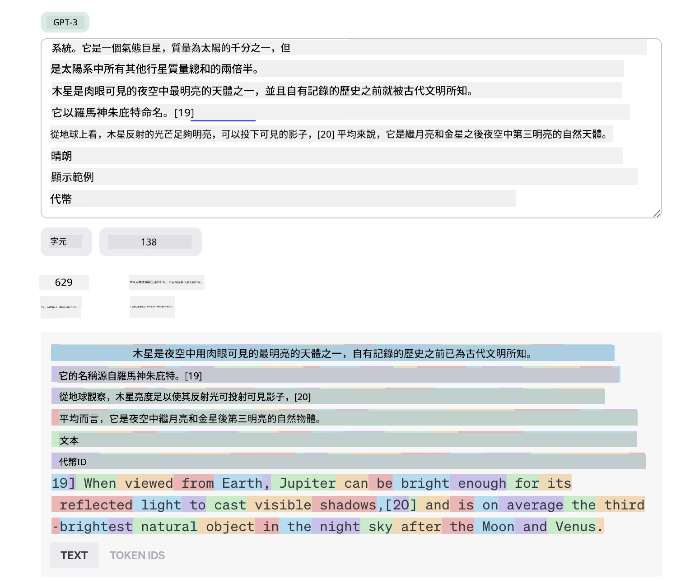
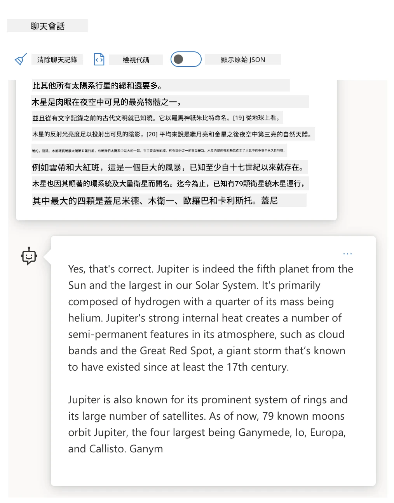
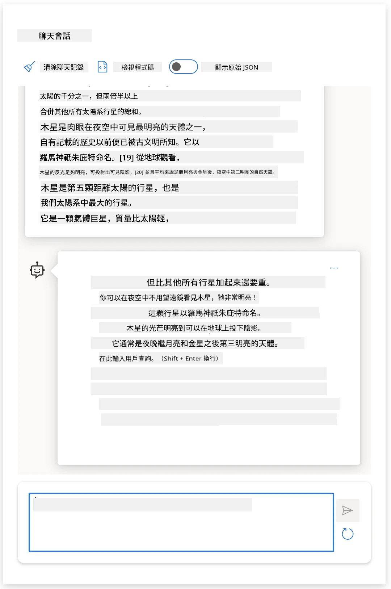
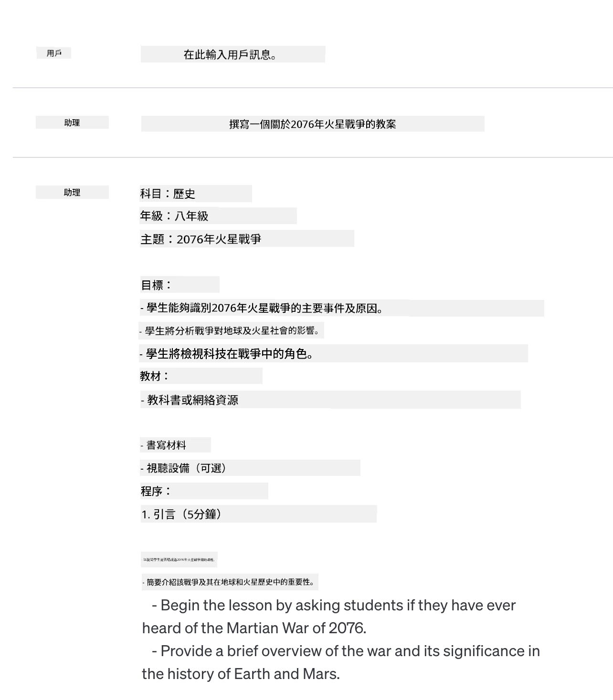
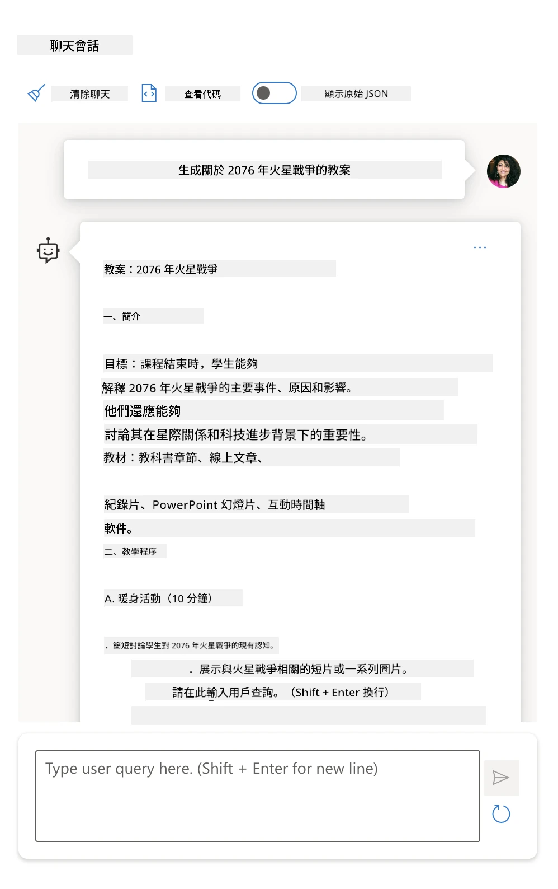
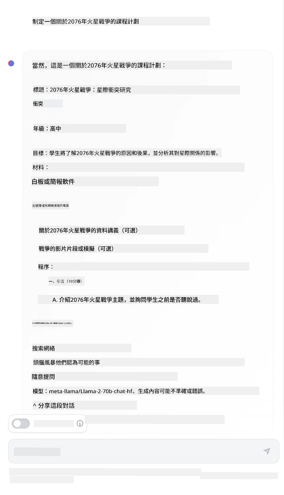

# Prompt Engineering Fundamentals

[](https://youtu.be/GElCu2kUlRs?si=qrXsBvXnCW12epb8)

## Introduction
本模組涵蓋在生成式 AI 模型中創建有效提示的基本概念和技術。你向大型語言模型 (LLM) 編寫提示的方式同樣重要。精心設計的提示可以達到更高質量的回應。但「提示」和「提示工程」這些術語到底是什麼意思？我應如何改進我發送給 LLM 的提示 _輸入_？這些是我們在本章及下一章中嘗試回答的問題。

_生成式 AI_ 能根據使用者請求創造新內容（例如文本、圖片、音頻、程式碼等）。它通過使用像 OpenAI GPT（「生成式預訓練變壓器」）系列這類大型語言模型，進行自然語言和程式碼的訓練來實現。

使用者現在可以通過熟悉的互動方式（如聊天）與這些模型交流，不需要任何技術專長或訓練。這些模型是 _基於提示_ 的——使用者提供文字輸入（提示），模型回傳 AI 回應（完成回應）。他們可以反覆「與 AI 聊天」，在多輪對話中逐步調整提示，直到回應符合期望為止。

「提示」現已成為生成式 AI 應用的主要 _編程介面_，用來告訴模型該做什麼，並影響回傳回應的質量。「提示工程」是一個快速發展的研究領域，聚焦於對提示的 _設計與優化_，以在大規模情境中提供一致且高品質的回應。

## Learning Goals

在本課程中，我們將學習什麼是提示工程、為何重要，以及如何為指定模型和應用目標打造更有效的提示。我們會理解提示工程的核心概念和最佳實踐 — 並了解一個可以互動應用這些概念的 Jupyter Notebook 「沙盒」環境。

課程結束後，我們將能夠：

1. 解釋什麼是提示工程及其重要性。
2. 描述提示的組成部分及其使用方式。
3. 學習提示工程的最佳實踐和技術。
4. 使用 OpenAI 端點將所學技術應用於實際範例。

## Key Terms

提示工程：設計與完善輸入，以引導 AI 模型產生期望輸出的實踐。
分詞（Tokenization）：將文本轉換為模型能理解和處理的較小單位（令牌）的過程。
指令微調大型語言模型（Instruction-Tuned LLMs）：經過指令微調，提升回答準確性和相關性的 LLM。

## Learning Sandbox

提示工程至今仍偏向藝術多於科學。提升直覺的最佳方法是 _多加練習_，採取結合應用領域專業知識、推薦技術和模型特定優化的反覆嘗試方法。

本課程配套的 Jupyter Notebook 提供了 _沙盒_ 環境，讓你能邊學邊試，或在課程末的程式挑戰中反覆操作。執行練習前，你需要：

1. **Azure OpenAI API 金鑰** — 已部署 LLM 的服務端點。
2. **Python 執行環境** — 可運行 Notebook。
3. <strong>本機環境變數</strong> — _請先完成[設定](./../00-course-setup/02-setup-local.md?WT.mc_id=academic-105485-koreyst)步驟。_

此 Notebook 附帶入門練習——你也鼓勵自行添加 _Markdown_（描述）和 _代碼_（提示請求）部分，嘗試更多示例或想法，並培養提示設計的直覺。

## Illustrated Guide

想在深入學習前先掌握本課程的整體架構嗎？看看這個圖解指南，它讓你了解主要主題和每個部分的重點思考事項。課程路線圖將引領你從核心概念與挑戰，到運用相關提示工程技巧和最佳實踐解決問題。提醒：「進階技巧」部分指的是本課程 _下一章_ 的內容。


## Our Startup

現在，讓我們談談 _本主題_ 如何與我們的創業使命結合——[將 AI 創新引入教育](https://educationblog.microsoft.com/2023/06/collaborating-to-bring-ai-innovation-to-education?WT.mc_id=academic-105485-koreyst)。我們想要打造 AI 驅動的 _個人化學習_ 應用，思考應用的不同用戶如何「設計」提示：

- <strong>管理員</strong> 可能會請求 AI _分析課程資料，找出覆蓋不足的地方_。AI 可總結結果或用程式碼呈現視覺化。
- <strong>教育工作者</strong> 可能會請 AI _為指定族群和主題產生教案_。AI 可依指定格式建立個人化計畫。
- <strong>學生</strong> 可能會請 AI _在難懂科目上給予輔導_。AI 可依學生程度提供課程、提示與範例指導。

以上僅為冰山一角。查閱 [Prompts For Education](https://github.com/microsoft/prompts-for-edu/tree/main?WT.mc_id=academic-105485-koreyst) ——開源的教育專家策劃提示庫，讓你了解更多可能性！_試著在沙盒或 OpenAI Playground 執行部分提示，看看會發生什麼！_

<!--
LESSON TEMPLATE:
This unit should cover core concept #1.
Reinforce the concept with examples and references.

CONCEPT #1:
Prompt Engineering.
Define it and explain why it is needed.
-->

## What is Prompt Engineering?

我們一開始定義 <strong>提示工程</strong> 為 _設計與優化_ 文本輸入（提示）的過程，目的是為特定應用目標與模型提供一致且高品質的回應（完成）。可視為兩階段流程：

- 為特定模型與目標 _設計_ 初始提示
- 反覆 _優化_ 提示以提升回應質量

這過程本質為嘗試錯誤，需要用戶直覺和努力以獲得最佳結果。為何它重要？先了解三個概念：

- _分詞_ = 模型如何「看」提示
- _基礎 LLM_ = 基礎模型如何「處理」提示
- _指令微調 LLM_ = 模型如何理解「任務」

### Tokenization

LLM 將提示視為一串 _令牌序列_，不同模型（或版本）對同提示的分詞方式可能不同。因為 LLM 用令牌（非原始文字）進行訓練，提示分詞方式直接影響生成回答的品質。

想了解分詞如何運作，可試用下列工具，例如下面展示的 [OpenAI Tokenizer](https://platform.openai.com/tokenizer?WT.mc_id=academic-105485-koreyst)。將提示貼入後，查看如何轉成令牌，特別留意空白字元和標點符號的處理。注意此範例用的是較舊的 LLM（GPT-3），新模型可能結果會不同。



### Concept: Foundation Models

提示一經分詞，["基礎 LLM"](https://blog.gopenai.com/an-introduction-to-base-and-instruction-tuned-large-language-models-8de102c785a6?WT.mc_id=academic-105485-koreyst)（或稱基礎模型）主要功能即為預測該序列中的下一個令牌。LLM 在海量文本資料訓練下，對令牌間統計關係有相當認知，能以一定信心作出預測。但它不理解提示中文字的 _意義_，只是看見可被「補全」的模式。它可以持續預測序列直到被使用者終止或遇到預設條件。

想看基於提示的完成如何工作？將上述提示輸入 Azure OpenAI Studio [_Chat Playground_](https://oai.azure.com/playground?WT.mc_id=academic-105485-koreyst) 預設設定。系統設定將提示視為信息請求——你會看到符合此語境的完成回應。

如果使用者想要看到符合特定條件或任務目標的特定內容呢？這時候就需要 _指令微調_ LLM。



### Concept: Instruction Tuned LLMs

[指令微調 LLM](https://blog.gopenai.com/an-introduction-to-base-and-instruction-tuned-large-language-models-8de102c785a6?WT.mc_id=academic-105485-koreyst)是基礎模型的增強版本，透過範例或輸入/輸出配對（如多輪「訊息」），透過明確指令微調，令 AI 回應盡力遵循這些指令。

此技術常用人類反饋強化學習（RLHF），讓模型 _遵從指令_ 並 _從反饋學習_，產生更符合實際應用和用戶目標的回答。

實際操作可試以下步驟——回到上述提示，這次更改 _系統訊息_，提供以下指令作為上下文：

> _將提供的內容摘要成適合二年級學生閱讀。摘要保持一段文字，並以 3-5 個重點條列說明。_

看看結果如何針對目標與格式做調整？教育工作者便可直接將此結果用於教學簡報。



## Why do we need Prompt Engineering?

既然了解 LLM 如何處理提示，接下來談為何我們需要提示工程。因當前 LLM 面臨若干挑戰，使得無經過提示構造與優化的情況下，要達成 _可靠且一致_ 的完成回應非常困難。例如：

1. **模型回答具有隨機性。** 相同提示在不同模型或版本間可能產生不同回答；同一模型不同時間也可能出現差異。_提示工程技巧可幫助我們降低這種變異，提供更佳的防護措施_。

1. **模型會虛構回答。** 模型經過 _大量但有限_ 的資料訓練，缺乏訓練範圍外的知識，可能產生不正確、虛構或與已知事實直接矛盾的回應。_提示工程技巧幫助使用者辨識與降低這類虛構，例如詢問 AI 提供出處或推理原因_。

1. **模型能力會不同。** 新一代模型功能更強，但成本與複雜度亦有不同。_提示工程幫助我們建立最佳實踐與工作流程，抽象化差異、適應各模型特性，實現可擴展且無縫的應用_。

可以在 OpenAI 或 Azure OpenAI Playground 親自試試：

- 用相同提示測試不同 LLM 服務部署（例如 OpenAI、Azure OpenAI、Hugging Face），有何變化？
- 在相同 LLM 部署環境重複使用相同提示，結果又如何不同？

### Fabrications Example

本課程中使用 **「虛構」** 一詞描述 LLM 有時因訓練限制或其他因素，產出事實錯誤的資訊。你也可能看到稱作 _「幻覺」_ 的表述，但我們強烈建議使用 _「虛構」_，避免誤將機器生成行為擬人化，附加人類特質。這也符合[負責任 AI 指南](https://www.microsoft.com/ai/responsible-ai?WT.mc_id=academic-105485-koreyst)中用詞標準，排除可能具冒犯性或不包容的詞彙。

想了解虛構如何發生？想像一個指令要求 AI 生成一個不存在主題的內容（保證不在訓練資料中）。例如，我嘗試了以下提示：

> **提示：** 生成一個 2076 年火星戰爭的教案。
網絡搜尋顯示有關火星戰爭的虛構記錄（例如，電視劇或書籍）——但沒有發生在2076年。常識也告訴我們，2076年是在未來，因此不可能與真實事件有關。

那麼，當我們使用不同的 LLM 供應商執行此提示時會發生什麼？

> **回應 1**：OpenAI Playground (GPT-35)



> **回應 2**：Azure OpenAI Playground (GPT-35)



> **回應 3**：Hugging Face Chat Playground (LLama-2)



正如預期，每個模型（或模型版本）由於隨機行為和模型能力差異，產生略微不同的回應。例如，一個模型針對八年級的聽眾，而另一個假設是中學生。但這三個模型都產生了可能讓不知情使用者相信該事件是真實的回應。

提示工程技術如 _元提示(metaprompting)_ 和 _溫度配置_ 可以在某種程度上減少模型捏造。新的提示工程 _架構_ 也將新工具和技術無縫整合進提示流程，以緩解或減少這些影響。

## 個案研究：GitHub Copilot

讓我們用一個個案研究來總結本節，了解提示工程在現實世界解決方案中的應用：[GitHub Copilot](https://github.com/features/copilot?WT.mc_id=academic-105485-koreyst)。

GitHub Copilot 是你的「AI 配對程式員」——它將文本提示轉換為程式完成功能，並整合進你的開發環境（例如 Visual Studio Code），帶來無縫的用戶體驗。正如以下一系列博客所記錄，最早版本基於 OpenAI Codex 模型——工程師很快意識到需要微調模型並開發更好的提示工程技術，以提升代碼質量。今年七月，他們[推出了超越 Codex 的提升 AI 模型](https://github.blog/2023-07-28-smarter-more-efficient-coding-github-copilot-goes-beyond-codex-with-improved-ai-model/?WT.mc_id=academic-105485-koreyst)，以實現更快的建議。

請按順序閱讀這些文章，以跟隨他們的學習歷程。

- **2023年5月** | [GitHub Copilot 正在更好地理解你的代碼](https://github.blog/2023-05-17-how-github-copilot-is-getting-better-at-understanding-your-code/?WT.mc_id=academic-105485-koreyst)
- **2023年5月** | [GitHub 內部揭秘：與 GitHub Copilot 背後的 LLMs 合作](https://github.blog/2023-05-17-inside-github-working-with-the-llms-behind-github-copilot/?WT.mc_id=academic-105485-koreyst)
- **2023年6月** | [如何為 GitHub Copilot 編寫更好的提示](https://github.blog/2023-06-20-how-to-write-better-prompts-for-github-copilot/?WT.mc_id=academic-105485-koreyst)
- **2023年7月** | [GitHub Copilot 跨越 Codex，提升 AI 模型](https://github.blog/2023-07-28-smarter-more-efficient-coding-github-copilot-goes-beyond-codex-with-improved-ai-model/?WT.mc_id=academic-105485-koreyst)
- **2023年7月** | [開發者的提示工程與大型語言模型指南](https://github.blog/2023-07-17-prompt-engineering-guide-generative-ai-llms/?WT.mc_id=academic-105485-koreyst)
- **2023年9月** | [如何打造企業級大型語言模型應用：GitHub Copilot 的經驗教訓](https://github.blog/2023-09-06-how-to-build-an-enterprise-llm-application-lessons-from-github-copilot/?WT.mc_id=academic-105485-koreyst)

你也可以瀏覽他們的[工程部落格](https://github.blog/category/engineering/?WT.mc_id=academic-105485-koreyst)來閱讀更多文章，如[這篇](https://github.blog/2023-09-27-how-i-used-github-copilot-chat-to-build-a-reactjs-gallery-prototype/?WT.mc_id=academic-105485-koreyst)，展示了這些模型與技術如何被 _應用_ 於推動現實世界的應用。

---

<!--
LESSON TEMPLATE:
This unit should cover core concept #2.
Reinforce the concept with examples and references.

CONCEPT #2:
Prompt Design.
Illustrated with examples.
-->

## 提示構建

我們已經了解了為何提示工程重要——現在讓我們理解提示是如何被 _構建_，以便評估不同技術，實現更有效的提示設計。

### 基本提示

先從基本提示開始：沒有其他上下文，只是發送給模型的文本輸入。以下是一個例子——當我們把美國國歌的前幾個字發送到 OpenAI [Completion API](https://platform.openai.com/docs/api-reference/completions?WT.mc_id=academic-105485-koreyst)，它會立即 _自動補全_ 後面幾行，展示基本的預測行為。

| 提示（輸入）           | 回應（輸出）                                                                                                                             |
| :----------------- | :----------------------------------------------------------------------------------------------------------------------------------------- |
| Oh say can you see | 聽起來你正在開始唱「星條旗永不落」的歌詞，這是美國的國歌。完整的歌詞是... |

### 複雜提示

現在，讓我們在基本提示上加入上下文和指令。[Chat Completion API](https://learn.microsoft.com/azure/ai-services/openai/how-to/chatgpt?WT.mc_id=academic-105485-koreyst) 讓我們構建為一組 _訊息_ 的複雜提示，其中包括：

- 反映 _用戶_ 輸入和 _助理_ 回應的輸入/輸出對。
- 設定助理行為或性格的系統訊息。

請求格式如下，其中 _分詞(tokenization)_ 有效捕捉了來自上下文和對話的相關資訊。改變系統上下文對完成品質的影響，可能和提供的用戶輸入一樣重要。

```python
response = openai.chat.completions.create(
    model="gpt-3.5-turbo",
    messages=[
        {"role": "system", "content": "You are a helpful assistant."},
        {"role": "user", "content": "Who won the world series in 2020?"},
        {"role": "assistant", "content": "The Los Angeles Dodgers won the World Series in 2020."},
        {"role": "user", "content": "Where was it played?"}
    ]
)
```

### 指令提示

在以上例子中，用戶提示是一個簡單的文本查詢，可以解釋為請求信息。使用 _指令_ 提示，我們可以用該文本更詳細地指定任務，給 AI 更好的指導。示例如下：

| 提示（輸入）                                                                                                                                                                                                                         | 回應（輸出）                                                                                                        | 指令類型          |
| :------------------------------------------------------------------------------------------------------------------------------------------------------------------------------------------------------------------------------------- | :------------------------------------------------------------------------------------------------------------------------- | :------------------ |
| 描述內戰                                                                                                                                                                                                   | _返回了一段簡單段落_                                                                                              | 簡單               |
| 描述內戰。提供重要日期和事件，並描述其重要性                                                                                                                                                                                         | _返回一段段落，接著是帶說明的重要事件日期清單_                                             | 複雜               |
| 用一段話描述內戰。提供三個重點項目說明重要日期及其意義。再提供三個重點項目說明重要歷史人物及其貢獻。以 JSON 檔案格式返回輸出 | _返回更詳盡資訊在文本框中，格式為 JSON，方便複製貼上並視需要驗證_ | 複雜。格式化。       |

## 主要內容

在以上例子中，提示仍然相當開放，讓大型語言模型決定預訓練數據中哪些部分是相關的。使用 _主要內容_ 設計模式，輸入文本被分為兩部分：

- 指令（行動）
- 相關內容（影響行動）

以下是一個例子，指令是「用兩句話摘要此文」。

| 提示（輸入）                                                                                                                                                                                                                                                                                                                                                                                                                                                                                                                                                                                                                                                                                      | 回應（輸出）                                                                                                                                                                                                                                                                             |
| :-------------------------------------------------------------------------------------------------------------------------------------------------------------------------------------------------------------------------------------------------------------------------------------------------------------------------------------------------------------------------------------------------------------------------------------------------------------------------------------------------------------------------------------------------------------------------------------------------------------------------------------------------------------------------------------------------- | :---------------------------------------------------------------------------------------------------------------------------------------------------------------------------------------------------------------------------------------------------------------------------------------------- |
| 木星是太陽系中第5顆行星，也是最大的一顆。它是一顆氣態巨行星，質量是太陽的千分之一，但比太陽系中其他所有行星質量總和的兩倍半還要大。木星是夜空中肉眼可見最明亮的天體之一，自有歷史記錄前就為古文明所知。它以羅馬神朱庇特命名。[19] 從地球觀察時，木星反射的光足以形成可見陰影，[20] 且平均為夜空中繼月亮和金星之後的第三亮自然天體。<br/><strong>用兩句短句總結此文</strong> | 木星是太陽系中第5顆行星，也是最大的行星，並以夜空中最亮的天體之一聞名。它以羅馬神朱庇特命名，是一顆氣態巨行星，質量是太陽系中其他所有行星質量總和的兩倍半。 |

主要內容片段可以用多種方式推動更有效的指令：

- <strong>範例</strong> — 不用明示指令告訴模型怎麼做，給它你想要的範例讓它推斷模式。
- **提示詞(Cues)** — 緊接指令給模型一個「提示」，引導完成，幫助模型產生更相關的回應。
- <strong>模板</strong> — 這些是可重複的「配方」，帶有佔位符（變量），可以用來為特定用例客製化數據。

讓我們來看看實際操作。

### 使用範例

這種方法是用主要內容來「餵給模型」一些期望輸出的範例，讓它推斷出所需輸出的模式。根據範例數量，我們有零射(zero-shot)、單射(one-shot)、少射(few-shot)提示等。

提示由三部分構成：

- 任務描述
- 幾個期望輸出的範例
- 新範例的開始（成為隱含的任務描述）

| 學習類型 | 提示（輸入）                                                                                                                                        | 回應（輸出）         |
| :------------ | :---------------------------------------------------------------------------------------------------------------------------------------------------- | :-------------------------- |
| 零射         | "The Sun is Shining". 翻譯為西班牙語                                                                                                            | "El Sol está brillando".    |
| 單射         | "The Sun is Shining" => "El Sol está brillando". <br> "It's a Cold and Windy Day" =>                                                                 | "Es un día frío y ventoso". |
| 少射         | The player ran the bases => Baseball <br/> The player hit an ace => Tennis <br/> The player hit a six => Cricket <br/> The player made a slam-dunk => | Basketball                  |
|               |                                                                                                                                                       |                             |

注意，在零射提示中，我們必須提供明示指令（「翻譯為西班牙語」），但在單射提示中這被模型自行推斷。少射範例則展示了加入更多範例，模型能在無需額外指令下做更準確推理。

### 提示詞(Cues)

另一種使用主要內容的方法是提供 _提示詞_ 而非範例。在這情況下，我們給模型一個開頭片段，反映期望的回應格式，讓模型「接收到提示詞」繼續以相同方式輸出。

| 提示詞數量 | 提示（輸入）                                                                                                                                                                                                                                                                                                                                                                                                                                               | 回應（輸出）                                                                                                                                                                                                                                                                                       |
| :------------- | :----------------------------------------------------------------------------------------------------------------------------------------------------------------------------------------------------------------------------------------------------------------------------------------------------------------------------------------------------------------------------------------------------------------------------------------------------------- | :-------------------------------------------------------------------------------------------------------------------------------------------------------------------------------------------------------------------------------------------------------------------------------------------------------- |
| 0              | 木星是太陽系中第5顆行星，也是最大的一顆。它是一顆氣態巨行星，質量是太陽的千分之一，但比太陽系中其他所有行星質量總和的兩倍半還要大。木星是夜空中肉眼可見最明亮的天體之一，自有歷史記錄前就為古文明所知。<br/><strong>請總結此文</strong>                                       | 木星是太陽系中最大的行星，也是第五顆離太陽最近的行星。它是一顆氣態巨行星，質量是太陽的千分之一，但比其他所有行星的總和還要重。古代文明早已認識木星，它在夜空中非常明亮。 |
| 1              | 木星是距太陽第五顆行星，也是太陽系中最大的行星。它是一顆氣態巨星，質量約為太陽的千分之一，但約是太陽系中所有其他行星質量總和的兩倍半。木星是夜空中裸眼可見的最明亮天體之一，自有記錄以來的古代文明便已知曉。<br/><strong>總結</strong><br/> 我們學習到木星是距太陽第五顆行星，也是太陽系中最大的行星。它是一顆氣態巨星，質量約為太陽的千分之一，但約是所有其他行星質量總和的兩倍半。它裸眼容易看見，自古以來便為人所知。                        |
| 2              | 木星是距太陽第五顆行星，也是太陽系中最大的行星。它是一顆氣態巨星，質量約為太陽的千分之一，但約是太陽系中所有其他行星質量總和的兩倍半。木星是夜空中裸眼可見的最明亮天體之一，自有記錄以來的古代文明便已知曉。<br/><strong>總結</strong><br/> 我們學到的三個主要事實：         | 1. 木星是距太陽第五顆行星，也是太陽系中最大的行星。<br/> 2. 它是氣態巨星，質量約為太陽的千分之一…<br/> 3. 木星自古以來便能被裸眼看見…                                                                       |
|                |                                                                                                                                                                                                                                                                                                                                                                                                                                                              |                                                                                                                                                                                                                                                                                                           |

### Prompt Templates

一個提示模板是 _預先定義的提示配方_，可以儲存並根據需要重複使用，以在規模上推動更一致的用戶體驗。在最簡單的形式中，它僅僅是一組提示示例，比如[OpenAI 的這個示例](https://cookbook.openai.com/examples/gpt4-1_prompting_guide?WT.mc_id=academic-105485-koreyst)，提供互動式提示成分（用戶和系統訊息）及 API 驅動的請求格式，以支持重用。

在更複雜的形式中，如[LangChain 的這個示例](https://python.langchain.com/docs/concepts/prompt_templates/?WT.mc_id=academic-105485-koreyst)，它包含可由不同來源的數據（用戶輸入、系統上下文、外部數據源等）替換的 _佔位符_，動態生成提示。這允許我們建立一個可程式化地重用的提示庫來推動一致的用戶體驗。

最終，模板的真正價值在於能創建和發布針對垂直應用領域的 _提示庫_，令提示模板根據特定應用背景或示例「最佳化」，使得輸出對目標用戶群更具相關性和準確性。[Prompts For Edu](https://github.com/microsoft/prompts-for-edu?WT.mc_id=academic-105485-koreyst) 倉庫是這種方法很好的示例，專注於教育領域的提示庫，重點在課程規劃、課程設計、學生輔導等關鍵目標。

## Supporting Content

如果將提示構建視為有一個指令（任務）和一個目標（主要內容），那麼 _次要內容_ 就像我們提供的額外背景，以<strong>影響輸出</strong>。它可能是調整參數、格式指示、主題分類等，有助模型 _定制_ 回應，使其符合預期的用戶目標。

舉例：在有詳細元數據（名稱、描述、級別、標籤、講師等）的課程目錄中：

- 我們可以定義指令為「總結 2023 年秋季課程目錄」
- 用主要內容提供期望輸出的一些範例
- 用次要內容明確前 5 個感興趣的「標籤」

這樣模型會按照範例格式給出摘要，若結果有多個標籤，會優先考慮次要內容中指定的前 5 個標籤。

---

<!--
LESSON TEMPLATE:
This unit should cover core concept #1.
Reinforce the concept with examples and references.

CONCEPT #3:
Prompt Engineering Techniques.
What are some basic techniques for prompt engineering?
Illustrate it with some exercises.
-->

## Prompting Best Practices

既然我們知道如何 _構建_ 提示，就可以開始思考如何 _設計_ 它們以反映最佳實踐。我們可以從兩個角度考慮：保持正確的 _心態_ 和運用合適的 _技巧_。

### Prompt Engineering Mindset

提示工程是個嘗試錯誤的過程，請記住三大指導因素：

1. **領域理解很重要。** 回應的準確性和相關性取決於應用或用戶所在的 _領域_。運用你的直覺和領域專長進一步 <strong>定制技巧</strong>。例如，在系統提示中定義 _領域特定人物設定_，或者在用戶提示中使用 _領域特定模板_。提供反映領域特定背景的次要內容，或者用 _領域特定提示和示例_ 來引導模型向熟悉用法。

2. **模型理解很重要。** 我們知道模型本質上是隨機的，但模型的實現也可能因用的訓練數據集（預訓練知識）、提供的功能（如 API 或 SDK）以及優化的內容類型（程式碼、圖片、文本等）而異。了解你使用的模型的優缺點，據此 _優先安排任務_ 或構建 _定制模板_，以發揮模型實力。

3. **迭代與驗證很重要。** 模型和提示工程技術都在快速發展。作為領域專家，你可能對 _特定應用_ 擁有其他背景或標準，這些不一定適用於大眾。使用提示工程工具和技巧「啟動」提示建構，然後用直覺和領域知識不斷迭代與驗證，記錄洞察，建立 <strong>知識庫</strong>（如提示庫），讓其他人以後能用作新基線，更快迭代。

## Best Practices

以下是 [OpenAI](https://help.openai.com/en/articles/6654000-best-practices-for-prompt-engineering-with-openai-api?WT.mc_id=academic-105485-koreyst) 和 [Azure OpenAI](https://learn.microsoft.com/azure/ai-services/openai/concepts/prompt-engineering#best-practices?WT.mc_id=academic-105485-koreyst) 實務者推介的常見最佳實踐。

| 事項                              | 原因                                                                                                                                                                                                                                               |
| :-------------------------------- | :------------------------------------------------------------------------------------------------------------------------------------------------------------------------------------------------------------------------------------------------ |
| 評估最新模型                     | 新一代模型通常功能和品質更好，但可能成本也更高。評估其影響後再決定是否遷移。                                                                                                                                                                     |
| 分隔指令與上下文                | 檢查模型/提供者是否定義了 _分隔符_ 以更清晰區分指令、主要和次要內容，有助模型更精確地加權文字。                                                                                                                                                  |
| 要具體明確                      | 提供更多關於期望背景、結果、長度、格式、風格等細節，提升回應品質與一致性。將流程記錄在可重用模板中。                                                                                                                                        |
| 詳細描述，多用範例               | 模型對「展示與說明」的方式反應更好。先採用「零樣本」指令（無範例），再用「少樣本」調整，給幾個期望輸出的範例。可使用類比說明。                                                                                                               |
| 用提示詞促成完成               | 透過給模型一些引導詞或語句， nudging 它向預期結果靠攏。                                                                                                                                                                                           |
| 重複重申                       | 有時需向模型重複說明。內容前後多給些指令，指令加提示詞等，通過重複與驗證找出有效方式。                                                                                                                                                         |
| 順序重要                       | 向模型呈現資訊的順序可能影響輸出（包含學習示例），因為模型有「近期偏好」。嘗試不同方式找出最佳選項。                                                                                                                                              |
| 給模型「退路」                  | 提供模型如果無法完成任務時的 _後備回答_，減少模型產生錯誤或虛構回應的機會。                                                                                                                                                                   |
|                                  |                                                                                                                                                                                                                                                   |

如同所有最佳實踐，記得 _視具體模型、任務及領域而異_。將此作為起點，不斷迭代找到最適合你的方式。隨著新模型和工具推出，持續重新評估提示工程流程，著重於流程可擴展性與回應質量。

<!--
LESSON TEMPLATE:
This unit should provide a code challenge if applicable

CHALLENGE:
Link to a Jupyter Notebook with only the code comments in the instructions (code sections are empty).

SOLUTION:
Link to a copy of that Notebook with the prompts filled in and run, showing what one example could be.
-->

## Assignment

恭喜你完成本課！現在就把學到的概念與技巧用在實際範例上吧！

這次作業會使用 Jupyter Notebook，裡面有互動練習可以完成。你也可以自己加 Markdown 和程式碼區塊來探索想法與技巧。

### 開始前，先 fork 倉庫，然後

- （推薦）啟動 GitHub Codespaces
- （或）將倉庫 clone 至本機並用 Docker Desktop
- （或）用你偏好的 Notebook 執行環境打開 Notebook

### 接著，設定環境變數

- 複製倉庫根目錄下 `.env.copy` 檔案為 `.env`，填寫 `AZURE_OPENAI_API_KEY`、`AZURE_OPENAI_ENDPOINT` 和 `AZURE_OPENAI_DEPLOYMENT`。回到[Learning Sandbox section](#learning-sandbox)學習如何設定。

### 開啟 Jupyter Notebook

- 選擇執行核心。如果使用方案 1 或 2，直接選擇開發容器提供的預設 Python 3.10.x 核心。

一切就緒，可以執行練習。注意，這裡沒有「正確答案」— 只是透過嘗試錯誤探索選項，建立對特定模型和應用領域有效方法的直覺。

_因此本課沒有程式碼解答段落。Notebook 裡有標題為「我的解答：」的 Markdown 區塊，展示一個範例輸出，供參考。_

 <!--
LESSON TEMPLATE:
Wrap the section with a summary and resources for self-guided learning.
-->

## 知識檢核

以下哪個提示符合合理的最佳實踐？

1. 給我一張紅色汽車的圖片
2. 給我一張紅色沃爾沃 XC90，停靠在懸崖邊夕陽下的圖片
3. 給我一張紅色沃爾沃 XC90 的圖片

答：2 是最佳提示，因為它提供了「什麼」的詳細描述，具體指定車款與情境。3 次之，因為它也包含豐富描述。

## 🚀 挑戰

試用「提示詞」技巧，使用這句提示：「Complete the sentence 'Show me an image of red car of make Volvo and '」。看看它怎麼回應，你會如何改進？

## 幹得好！繼續學習

想了解更多不同的提示工程概念？前往[持續學習頁面](https://aka.ms/genai-collection?WT.mc_id=academic-105485-koreyst)，尋找更多優秀資源。

接著前往課程 5，將探討[進階提示技巧](../05-advanced-prompts/README.md?WT.mc_id=academic-105485-koreyst)！

---

<!-- CO-OP TRANSLATOR DISCLAIMER START -->
**免責聲明**：
本文件由 AI 翻譯服務 [Co-op Translator](https://github.com/Azure/co-op-translator) 翻譯而成。雖然我們致力於確保準確性，但請注意，機器自動翻譯可能包含錯誤或不準確之處。原始文件的母語版本應被視為權威來源。對於重要資訊，建議進行專業人工翻譯。我們不對因使用本翻譯而產生的任何誤解或誤釋承擔責任。
<!-- CO-OP TRANSLATOR DISCLAIMER END -->