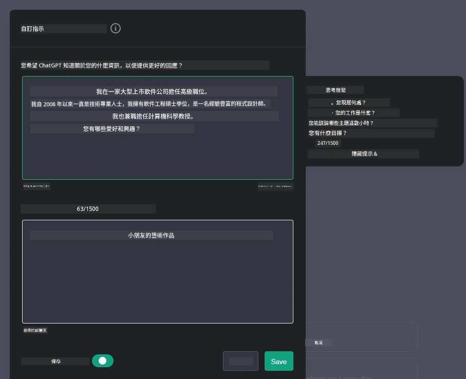
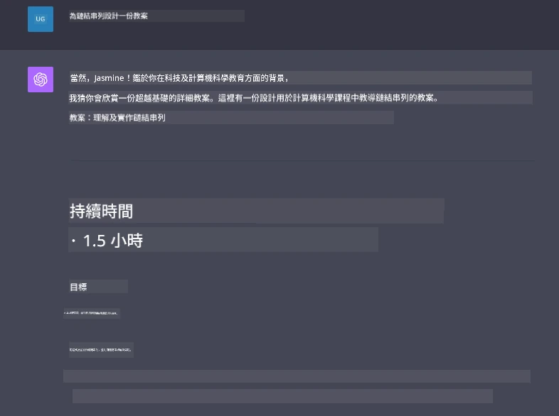

# 建立生成式 AI 驅動的聊天應用程式

[](https://youtu.be/R9V0ZY1BEQo?si=IHuU-fS9YWT8s4sA)

> _(點擊上方圖片觀看此課程的視頻)_

現在我們已經了解如何建立文本生成應用程式，讓我們來深入探討聊天應用程式。

聊天應用程式已融入我們的日常生活，不僅僅是閒聊的工具。它們是客戶服務、技術支援，甚至是複雜諮詢系統的重要組成部分。很可能你在不久前就從聊天應用程式獲得了幫助。隨著生成式 AI 等先進技術的整合到這些平台，複雜性和挑戰也隨之增加。

我們需要回答的一些問題包括：

- <strong>建立應用程式</strong>。我們如何有效地建立並無縫整合這些針對特定案例的 AI 驅動應用程式？
- <strong>監控</strong>。應用程式部署後，我們如何監控並確保持續運作於最高品質水平，包括功能性及遵守 [負責任 AI 的六大原則](https://www.microsoft.com/ai/responsible-ai?WT.mc_id=academic-105485-koreyst)？

隨著我們進入一個以自動化和無縫人機互動定義的時代，了解生成式 AI 如何改變聊天應用的範疇、深度和適應性變得至關重要。本課程將探討支持這些複雜系統的架構面向，深入調整以領域特定任務的技術，並評估確保負責任 AI 部署的指標和考量。

## 介紹

本課程涵蓋：

- 高效建立與整合聊天應用程式的技術。
- 如何對應用程式進行客製化及微調。
- 有效監控聊天應用的策略與考量。

## 學習目標

本課程結束時，你將能夠：

- 描述建立和整合聊天應用程式至現有系統的考量。
- 針對特定使用案例客製化聊天應用程式。
- 了解關鍵指標和考量來有效監控並維護 AI 驅動聊天應用的品質。
- 確保聊天應用負責任地運用 AI。

## 將生成式 AI 整合至聊天應用

透過生成式 AI 強化聊天應用不僅是讓它們更聰明；更是優化架構、效能與用戶介面，提供優質的使用者體驗。這涉及探索架構基礎、API 整合與用戶介面考量。本節旨在為你提供一條通徑，幫助你在將其整合進現有系統或建立獨立平台時，順利導航這些複雜領域。

本節結束時，你將擁有高效構建和整合聊天應用程式的專業知識。

### 聊天機械人還是聊天應用程式？

在深入建立聊天應用之前，讓我們比較「聊天機械人」與「AI 驅動的聊天應用程式」兩者的不同角色與功能。聊天機械人的主要目的是自動化特定的對話任務，例如回答常見問題或追蹤包裹。它通常由規則邏輯或複雜的 AI 算法管理。相比之下，AI 驅動的聊天應用程式是一個更廣泛的環境，專為促進各種形式的數字溝通設計，如文字、語音和視訊聊天。其核心特色在於整合生成式 AI 模型，模擬細膩且類人化的對話，根據多種輸入和上下文線索生成回應。生成式 AI 驅動的聊天應用能參與開放領域的討論，適應不斷變化的對話上下文，甚至產出創意或複雜的對話。

以下表格列出主要差異與相似處，幫助我們理解它們在數字通訊中的獨特角色。

| 聊天機械人                           | 生成式 AI 驅動聊天應用程式                      |
| ----------------------------------- | ---------------------------------------------- |
| 以任務為中心、基於規則               | 具備上下文感知                                |
| 通常整合於較大系統                   | 可容納一個或多個聊天機械人                      |
| 功能受限於預設程式                   | 融合生成式 AI 模型                            |
| 專門且結構化的互動                   | 能進行開放領域討論                            |

### 利用 SDK 和 API 內建功能

建立聊天應用時，一個很好的第一步是評估現有的解決方案。利用 SDK 和 API 來建立聊天應用是一種省時且行之有效的策略。通過整合完善文檔的 SDK 和 API，你能為應用程式的長遠成功做策略性佈局，同時解決擴展性和維護性問題。

- <strong>加快開發流程並減少負擔</strong>：依賴現有功能，避免耗費時間自行開發，而能專注於應用中更重要的部分，如商業邏輯。
- <strong>提升效能</strong>：從零開始建立功能時，終會面臨擴展性問題，例如應用能否應對突增使用者？良好維護的 SDK 和 API 通常內建解決方案。
- <strong>維護更容易</strong>：當有新版釋出時，大多數 API 和 SDK 僅需更新函式庫即可輕鬆管理更新與改進。
- <strong>接觸尖端技術</strong>：利用經過微調且訓練於龐大資料集上的模型，提升應用的自然語言能力。

存取 SDK 或 API 功能通常需要取得使用權限，常以唯一金鑰或認證令牌操作。本課程將使用 OpenAI Python 函式庫示範其運用情況。你也可自行嘗試以下本課程提供的 [OpenAI 筆記本](./python/oai-assignment.ipynb?WT.mc_id=academic-105485-koreyst) 或 [Azure OpenAI 服務筆記本](./python/aoai-assignment.ipynb?WT.mc_id=academic-105485-koreys)。

```python
import os
from openai import OpenAI

API_KEY = os.getenv("OPENAI_API_KEY","")

client = OpenAI(
    api_key=API_KEY
    )

response = client.responses.create(model="gpt-5-mini", input="Suggest two titles for an instructional lesson on chat applications for generative AI.", store=False)
print(response.output_text)
```

上述範例使用 GPT-5 mini 模型及 Responses API 來完成提示，但請注意，API 金鑰必須先設定，不然會收到錯誤。

## 使用者體驗（UX）

一般使用者體驗原則適用於聊天應用，但因涵蓋機器學習元件，以下幾點特別重要。

- <strong>模糊性處理機制</strong>：生成式 AI 模型偶爾生成模棱兩可的答案。讓用戶能請求澄清的功能，在遇到問題時十分有用。
- <strong>上下文保留</strong>：先進生成式 AI 模型能記憶對話上下文，是提升用戶體驗的重要資產。讓使用者掌控和管理上下文，提升體驗，但增加敏感資料保留風險。需考慮資料儲存時長，像是引入保留政策，平衡上下文需求和隱私。
- <strong>個人化</strong>：AI 模型具備學習與適應能力，提供個人化體驗。透過用戶設定檔等功能客製化體驗，不僅讓用戶感受被理解，也助其更快速找到想要答案，打造更有效率且滿意的互動。

OpenAI ChatGPT 的「自定義指令」設定便是一個個人化例子。它允許你提供可能是提示重要上下文的個人資訊。以下為一個自定義指令範例。



此「個人設定」促使 ChatGPT 針對連結串列製作課程計畫。可以看到 ChatGPT 會根據使用者經驗，考慮其可能需要更深入的課程計畫。



### 微軟的大型語言模型系統訊息框架

[微軟提供了指引](https://learn.microsoft.com/azure/ai-foundry/openai/concepts/system-message#define-the-models-output-format?WT.mc_id=academic-105485-koreyst)來撰寫有效系統訊息，用於生成大型語言模型回應，涵蓋以下四個方面：

1. 定義模型所面向的對象、能力及限制。
2. 定義模型的輸出格式。
3. 提供示範模型預期行為的具體範例。
4. 補充額外的行為防護措施。

### 無障礙設計

無論使用者是視覺、聽覺、運動或認知障礙，設計良好的聊天應用程式都應該能供所有人使用。以下列出增進各類使用障礙者無障礙性的特定功能。

- <strong>視覺障礙功能</strong>：高對比度主題、可調尺寸文字、螢幕閱讀器相容性。
- <strong>聽覺障礙功能</strong>：文字轉語音及語音轉文字功能、音訊通知的視覺提示。
- <strong>運動障礙功能</strong>：鍵盤導航支援、語音指令。
- <strong>認知障礙功能</strong>：簡化語言選項。

## 領域特定語言模型的客製化與微調

想像一個了解你公司行話並預測用戶常有的特定查詢的聊天應用。有兩種值得提及的方法：

- **利用 DSL 模型**。DSL 指領域特定語言。你可以利用訓練於特定領域的 DSL 模型來理解其概念與場景。
- <strong>應用微調</strong>。微調是指使用特定數據對模型進行進一步訓練的過程。

## 客製化：使用 DSL

利用領域特定語言模型（DSL 模型）可透過提供專門且上下文相關的互動來提升用戶參與度。該模型經過訓練或微調，能理解及生成與特定領域、行業或主題相關的文本。使用 DSL 模型的選項多元，既可從零開始訓練，也可透過 SDK 和 API 使用現成模型。另外，微調則是對現有預訓練模型加以修改，適用於特定領域。

## 客製化：應用微調

當預訓練模型在專業領域或特定任務表現不足時，通常會考慮微調。

例如，醫療查詢複雜且需大量上下文。醫療專業人員診斷患者時，會根據生活方式或既有病史等多種因素，甚至依賴最新醫學期刊驗證診斷。在此類精細場景中，一般用途 AI 聊天應用無法成為可靠來源。

### 情境示範：醫療應用

想像一個設計用以協助醫療人員快速查詢治療指引、藥物交互作用或最新研究結果的聊天應用。

一般用途模型或許能處理基本醫療問題或提供一般建議，但可能難以應付以下情況：

- <strong>高度專門或複雜案例</strong>。例如，神經科醫師詢問「兒童藥物抗性癲癇的最佳管理現行做法為何？」。
- <strong>缺乏最新進展</strong>。一般模型可能難以結合神經學與藥理學的最新發展來提供回答。

在這類情況下，使用專業醫療數據集微調模型能大幅提升其處理精密醫療查詢的準確性與可靠度。這需要擁有大量具代表性、反映該領域挑戰與問題的相關數據集。

## 提供高品質 AI 驅動聊天體驗的考量

本節闡述「高品質」聊天應用的標準，包括可量化的指標及遵守負責任 AI 技術運用的框架。

### 關鍵指標

為維持應用程式的高品質表現，追蹤關鍵指標和考量至關重要。這些指標不僅確保功能完整，還評估 AI 模型品質與使用者體驗。以下列出應考慮的基礎、AI 及使用者體驗指標。

| 指標                          | 定義                                                                                                                 | 聊天開發者的考量                                                         |
| ----------------------------- | ------------------------------------------------------------------------------------------------------------------ | ------------------------------------------------------------------------- |
| **運行時間（Uptime）**           | 測量應用程式可供用戶順利運行及訪問的時間。                                                                       | 如何將停機時間降至最低？                                                   |
| <strong>回應時間</strong>                    | 應用程式對用戶查詢的回覆時間。                                                                                     | 如何優化查詢處理以縮短回應時間？                                         |
| **精確度（Precision）**          | 真陽性預測數與所有陽性預測數的比率。                                                                               | 如何驗證模型的精確度？                                                     |
| **召回率（Recall／靈敏度）**      | 真陽性預測數與實際陽性數的比率。                                                                                   | 如何測量並提升召回率？                                                     |
| **F1 分數**                     | 精確度與召回率的調和平均數，平衡兩者間的取捨。                                                                     | 你的目標 F1 分數為何？如何平衡精確度與召回率？                           |
| **困惑度（Perplexity）**         | 測量模型預測的機率分佈與實際資料分佈的吻合程度。                                                                   | 如何將困惑度降至最低？                                                     |
| <strong>用戶滿意度指標</strong>               | 測量用戶對應用程式的感知，常透過調查取得。                                                                          | 你多常收集用戶回饋？如何依此調整？                                       |
| <strong>錯誤率</strong>                      | 模型在理解或產出上發生錯誤的頻率。                                                                                 | 你有哪些策略來降低錯誤率？                                                 |
| <strong>重訓週期</strong>                    | 模型更新以吸納新數據和見解的頻率。                                                                                 | 你多久重訓一次模型？什麼情況觸發重訓週期？                               |

| <strong>異常檢測</strong>               | 用於識別不符合預期行為的異常模式的工具和技術。                          | 你將如何回應異常？                                                      |

### 在聊天應用中實踐負責任的 AI 操作

微軟的負責任 AI 方法已確立六項指導 AI 開發與使用的原則。以下是這些原則、它們的定義，以及聊天應用開發者應該考慮的事項及其重要原因。

| 原則                   | 微軟的定義                                            | 聊天應用開發者的考量                                                | 重要原因                                                                           |
| ---------------------- | ----------------------------------------------------- | ------------------------------------------------------------------ | ---------------------------------------------------------------------------------- |
| 公平性                 | AI 系統應公平對待所有人。                              | 確保聊天應用不會基於用戶資料進行歧視。                            | 建立用戶信任與包容性；避免法律風險。                                             |
| 可靠性與安全性         | AI 系統應可靠且安全地運作。                            | 實施測試和故障保護以盡量減少錯誤與風險。                          | 確保用戶滿意度並防止潛在傷害。                                                   |
| 隱私與安全             | AI 系統應安全並尊重隱私。                              | 實施強加密與資料保護措施。                                        | 保護敏感用戶資料並符合隱私法規。                                                 |
| 包容性                 | AI 系統應賦能所有人並促進參與。                        | 設計對不同族群友好的易用 UI/UX。                                  | 確保更廣泛的人群能有效使用應用。                                                 |
| 透明度                 | AI 系統應該是可理解的。                                | 提供清楚的文件及 AI 回應的推理說明。                              | 用戶若能理解決策過程，更可能信任系統。                                           |
| 問責性                 | 人們應對 AI 系統負起責任。                              | 建立審計與改進 AI 決策的明確流程。                                | 促進持續改進及錯誤時的修正措施。                                                 |

## 作業

請參考[作業](../../../07-building-chat-applications/python)。它將引導你完成一系列練習，從執行第一個聊天提示，到分類與摘要文字等。請注意，作業有多種程式語言版本可用！

## 很棒的工作！繼續學習之旅

完成本課後，請查看我們的[生成式 AI 學習專區](https://aka.ms/genai-collection?WT.mc_id=academic-105485-koreyst)，持續提升你的生成式 AI 知識！

前往第 8 課，看看如何開始[構建搜索應用](../08-building-search-applications/README.md?WT.mc_id=academic-105485-koreyst)！

---

<!-- CO-OP TRANSLATOR DISCLAIMER START -->
**免責聲明**：
本文件由 AI 翻譯服務 [Co-op Translator](https://github.com/Azure/co-op-translator) 翻譯而成。雖然我們致力於確保準確性，但請注意，機器自動翻譯可能包含錯誤或不準確之處。原始文件的母語版本應被視為權威來源。對於重要資訊，建議進行專業人工翻譯。我們不對因使用本翻譯而產生的任何誤解或誤釋承擔責任。
<!-- CO-OP TRANSLATOR DISCLAIMER END -->