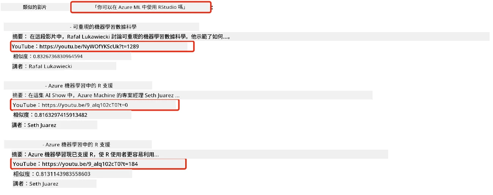
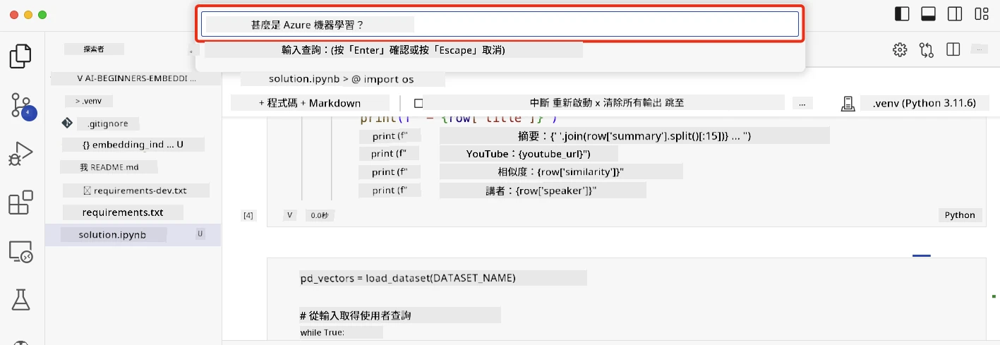

# 建立搜尋應用程式

[](https://youtu.be/W0-nzXjOjr0?si=GcsqiTTvd7RKbo7V)

> > _點擊上方圖片觀看本課程影片_

大型語言模型（LLM）不只是聊天機器人與文字生成。也可以利用嵌入向量來建立搜尋應用程式。嵌入向量是數值化的資料表示方式，也稱為向量，可用於語意搜尋資料。

在本課程中，你將建立一個為我們教育新創構建的搜尋應用程式。我們的新創組織是一個非營利組織，為發展中國家的學生提供免費教育內容。我們的新創擁有大量 YouTube 影片，學生可用來學習 AI。我們的新創想建立一個搜尋應用程式，讓學生能透過輸入問題來搜尋 YouTube 影片。

例如，學生可能會輸入「什麼是 Jupyter 筆記本？」或「什麼是 Azure ML」，搜尋應用程式將返回與問題相關的 YouTube 影片清單，更棒的是，搜尋應用程式會返回一個連結，連到影片中問題答案所在的位置。

## 簡介

在本課程中，我們將涵蓋：

- 語意搜尋與關鍵字搜尋的不同。
- 什麼是文字嵌入向量（Text Embeddings）。
- 建立文字嵌入向量索引。
- 搜尋文字嵌入向量索引。

## 學習目標

完成本課後，你將能：

- 分辨語意搜尋與關鍵字搜尋的差異。
- 解釋什麼是文字嵌入向量。
- 利用嵌入向量建立應用程式來搜尋資料。

## 為何要建立搜尋應用程式？

建立搜尋應用程式將幫助你了解如何使用嵌入向量搜尋資料。你也會學習如何建立一個能讓學生快速找到資訊的搜尋應用程式。

本課程包含 Microsoft [AI Show](https://www.youtube.com/playlist?list=PLlrxD0HtieHi0mwteKBOfEeOYf0LJU4O1) YouTube 頻道的影片逐字稿嵌入向量索引。AI Show 是一個介紹 AI 和機器學習的 YouTube 頻道。該嵌入向量索引包含所有影片至 2023 年 10 月的逐字稿嵌入向量。你將使用該索引來建立我們新創的搜尋應用程式。該搜尋應用程式會返回一個連結到影片中答案所在位置，這是學生快速找到所需資訊的極佳方式。

以下是針對問題「可以用 RStudio 搭配 Azure ML 嗎？」的語意查詢範例。查看影片的 YouTube URL，你會發現其中包含時間戳記，引導你直接到問題答案的影片位置。



## 什麼是語意搜尋？

你可能會想知道什麼是語意搜尋？語意搜尋是一種利用查詢中詞彙的語意（意義）來返回相關結果的搜尋技術。

這是一個語意搜尋的例子。假設你想買一部車，你可能會搜尋「我的夢想車」，語意搜尋會理解你不是在「夢想」一部車，而是想買你的「理想」車款。語意搜尋理解你的意圖並返回相關結果。相對地，關鍵字搜尋會字面搜尋包含「夢想」及「車」的結果，往往返回不相關的內容。

## 什麼是文字嵌入向量？

[文字嵌入向量](https://en.wikipedia.org/wiki/Word_embedding?WT.mc_id=academic-105485-koreyst)是用於[自然語言處理](https://en.wikipedia.org/wiki/Natural_language_processing?WT.mc_id=academic-105485-koreyst)中的一種文字表示方法。文字嵌入向量是對文字的語意數值表示。嵌入向量用來將資料以機器易於理解的方式表達。有很多模型可以用來生成文字嵌入向量，在本課中，我們將專注於使用 OpenAI 嵌入向量模型來產生。

這是一個範例，想像以下文字來自 AI Show YouTube 頻道某集的逐字稿：

```text
Today we are going to learn about Azure Machine Learning.
```

我們會將文字傳給 OpenAI 嵌入向量 API，它會返回一個由 1536 個數字組成的嵌入向量。向量中的每個數字代表文字的不同面向。為簡潔起見，這裡只顯示向量的前 10 個數字。

```python
[-0.006655829958617687, 0.0026128944009542465, 0.008792596869170666, -0.02446001023054123, -0.008540431968867779, 0.022071078419685364, -0.010703742504119873, 0.003311325330287218, -0.011632772162556648, -0.02187200076878071, ...]
```

## 嵌入向量索引是如何建立的？

本課程的嵌入向量索引是用一系列 Python 腳本建立。你可以在本課程的 `scripts` 資料夾中的 [README](./scripts/README.md?WT.mc_id=academic-105485-koreyst) 找到腳本與說明文件。你不需要執行這些腳本來完成本課，因為嵌入向量索引已提供給你。

這些腳本執行以下操作：

1. 下載 [AI Show](https://www.youtube.com/playlist?list=PLlrxD0HtieHi0mwteKBOfEeOYf0LJU4O1) 播放清單中每個 YouTube 影片的逐字稿。
2. 使用 [OpenAI Functions](https://learn.microsoft.com/azure/ai-foundry/openai/how-to/function-calling?WT.mc_id=academic-105485-koreyst) 嘗試從每個 YouTube 逐字稿的前三分鐘提取講者名稱。每個影片的講者名稱會存於名為 `embedding_index_3m.json` 的嵌入向量索引中。
3. 將逐字稿文字分割成 **3 分鐘文字段落**。這些段落會與下一段有約 20 個字的重疊，以確保嵌入向量不被切割，並提供更好搜尋上下文。
4. 將每個文字段落傳給 OpenAI 聊天 API，將文字摘要為 60 字，摘要也會存於 `embedding_index_3m.json`。
5. 最後，將段落文字傳給 OpenAI 嵌入向量 API，API 會返回 1536 個數字的向量，代表段落的語意。段落連同其向量被存入嵌入向量索引 `embedding_index_3m.json`。

### 向量資料庫

為簡化本課，嵌入向量索引儲存在名為 `embedding_index_3m.json` 的 JSON 檔案，並載入至 Pandas DataFrame。但在生產環境中，嵌入向量索引會存於向量資料庫，例如 [Azure Cognitive Search](https://learn.microsoft.com/training/modules/improve-search-results-vector-search?WT.mc_id=academic-105485-koreyst)、[Redis](https://cookbook.openai.com/examples/vector_databases/redis/readme?WT.mc_id=academic-105485-koreyst)、[Pinecone](https://cookbook.openai.com/examples/vector_databases/pinecone/readme?WT.mc_id=academic-105485-koreyst)、[Weaviate](https://cookbook.openai.com/examples/vector_databases/weaviate/readme?WT.mc_id=academic-105485-koreyst) 等等。

## 了解餘弦相似度

我們已經學習了文字嵌入向量，下一步是學習如何利用文字嵌入向量搜尋資料，特別是利用餘弦相似度找到與查詢最相似的嵌入向量。

### 什麼是餘弦相似度？

餘弦相似度是衡量兩個向量相似程度的方法，你也會聽到這稱為「近鄰搜尋」。要進行餘弦相似度搜尋，你需要先用 OpenAI 嵌入向量 API 將查詢文字 _向量化_，然後計算查詢向量與嵌入向量索引中每個向量的 _餘弦相似度_。記住，嵌入向量索引中的每個向量代表一段 YouTube 逐字稿文字段落。最後，根據餘弦相似度對結果排序，餘弦相似度最高的文字段落即與查詢最相似。

從數學角度來看，餘弦相似度是兩向量在多維空間中投影出的夾角餘弦值。這種測量有益處，因為即便兩個文件由於大小原因在歐氏距離上可能相距較遠，它們之間的夾角可能較小，因此餘弦相似度會更高。更多餘弦相似度的公式說明請見 [餘弦相似度](https://en.wikipedia.org/wiki/Cosine_similarity?WT.mc_id=academic-105485-koreyst)。

## 建立你的第一個搜尋應用程式

接下來，我們將學習如何利用嵌入向量建立搜尋應用程式。搜尋應用程式允許學生透過輸入問題搜尋影片，並返回與問題相關的影片清單。搜尋結果還會提供連結，帶你到影片中問題答案所在的位置。

此方案已在 Windows 11、macOS 與 Ubuntu 22.04 上使用 Python 3.10 或更新版本建置及測試。你可從 [python.org](https://www.python.org/downloads/?WT.mc_id=academic-105485-koreyst) 下載 Python。

## 作業 - 建立搜尋應用程式，協助學生

我們在本課開始時介紹了我們的新創。現在是時候讓學生自己建立搜尋應用程式來完成評量。

在此作業中，你將建立用於建構搜尋應用程式的 Azure OpenAI 服務。你將需要建立以下 Azure OpenAI 服務。完成此作業需要 Azure 訂閱。

### 啟動 Azure 雲端殼層

1. 登入 [Azure 入口網站](https://portal.azure.com/?WT.mc_id=academic-105485-koreyst)。
2. 選擇 Azure 入口網站右上角的「Cloud Shell」圖示。
3. 選擇環境類型為 **Bash**。

#### 建立資源群組

> 本指示中，我們使用位於東美區的資源群組「semantic-video-search」。
> 你可以更改資源群組名稱，但若更改資源區域，
> 請先檢查 [模型可用性表](https://aka.ms/oai/models?WT.mc_id=academic-105485-koreyst)。

```shell
az group create --name semantic-video-search --location eastus
```

#### 建立 Azure OpenAI 服務資源

在 Azure 雲端殼層中執行以下指令來建立 Azure OpenAI 服務資源。

```shell
az cognitiveservices account create --name semantic-video-openai --resource-group semantic-video-search \
    --location eastus --kind OpenAI --sku s0
```

#### 取得應用程式使用的端點與金鑰

在 Azure 雲端殼層中執行以下指令以取得 Azure OpenAI 服務資源的端點與金鑰。

```shell
az cognitiveservices account show --name semantic-video-openai \
   --resource-group  semantic-video-search | jq -r .properties.endpoint
az cognitiveservices account keys list --name semantic-video-openai \
   --resource-group semantic-video-search | jq -r .key1
```

#### 部署 OpenAI 嵌入模型

在 Azure 雲端殼層中執行以下指令來部署 OpenAI 嵌入模型。

```shell
az cognitiveservices account deployment create \
    --name semantic-video-openai \
    --resource-group  semantic-video-search \
    --deployment-name text-embedding-ada-002 \
    --model-name text-embedding-ada-002 \
    --model-version "2"  \
    --model-format OpenAI \
    --sku-capacity 100 --sku-name "Standard"
```

## 解決方案

打開 GitHub Codespaces 中的 [解決方案筆記本](./python/aoai-solution.ipynb?WT.mc_id=academic-105485-koreyst)，並按照 Jupyter 筆記本中的指示操作。

執行筆記本時，系統會提示你輸入查詢。輸入框會長這樣：



## 做得很好！繼續你的學習

完成本課後，請查看我們的 [生成式 AI 學習合輯](https://aka.ms/genai-collection?WT.mc_id=academic-105485-koreyst)，持續提升你的生成式 AI 知識！

接著前往第 9 課，我們將學習如何[建立圖像生成應用程式](../09-building-image-applications/README.md?WT.mc_id=academic-105485-koreyst)！

---

<!-- CO-OP TRANSLATOR DISCLAIMER START -->
**免責聲明**：
本文件由 AI 翻譯服務 [Co-op Translator](https://github.com/Azure/co-op-translator) 翻譯而成。雖然我們致力於確保準確性，但請注意，機器自動翻譯可能包含錯誤或不準確之處。原始文件的母語版本應被視為權威來源。對於重要資訊，建議進行專業人工翻譯。我們不對因使用本翻譯而產生的任何誤解或誤釋承擔責任。
<!-- CO-OP TRANSLATOR DISCLAIMER END -->