# 建立低代碼 AI 應用程式

> _(點擊上方圖片觀看本課程影片)_

## 介紹

現在我們已經學會如何建立影像生成功能的應用程式，讓我們來談談低代碼。生成式 AI 可以應用於多個不同領域，包括低代碼，但什麼是低代碼呢？我們又如何將 AI 加入其中？

透過低代碼開發平台，傳統開發者和非開發者建構應用程式和解決方案變得更加輕鬆。低代碼開發平台讓你可以幾乎不寫任何程式碼便能打造應用程式和解決方案。這是透過提供視覺化的開發環境來實現的，你可以拖拉元件來建置應用程式和解決方案。如此一來，可以更快速且以較少資源建構應用程式與解決方案。在本課程中，我們將深入探討如何使用低代碼，並且利用 Power Platform 透過 AI 強化低代碼開發。

Power Platform 為組織提供機會，讓團隊透過直覺的低代碼或無代碼環境，自己建構解決方案。此環境有助於簡化構建解決方案的流程。使用 Power Platform，解決方案能在數日或數週內完成，而非數月或數年。Power Platform 包含五個主要產品：Power Apps、Power Automate、Power BI、Power Pages 和 Copilot Studio。

本課程涵蓋：

- 生成式 AI 在 Power Platform 的介紹
- Copilot 介紹及使用方法
- 使用生成式 AI 在 Power Platform 建立應用程式與流程
- 透過 AI Builder 了解 Power Platform 中的 AI 模型
- 使用 Microsoft Copilot Studio 建立智能代理人

## 學習目標

完成本課程後，你將能：

- 了解 Copilot 在 Power Platform 的運作方式。

- 為我們的教育創業公司建立學生作業追蹤應用程式。

- 建立使用 AI 從發票中擷取資訊的發票處理流程。

- 使用 Create Text with GPT AI 模型時套用最佳實務。

- 了解 Microsoft Copilot Studio 及如何利用它建立智能代理人。

本課程將使用的工具與技術有：

- **Power Apps**，用於學生作業追蹤應用程式，提供一個低代碼開發環境來建立追蹤、管理與互動資料的應用程式。

- **Dataverse**，用於存儲學生作業追蹤應用程式的資料，Dataverse 會提供一個低代碼資料平台來儲存應用程式資料。

- **Power Automate**，用於發票處理流程，你會使用低代碼開發環境來建立自動化發票處理的工作流程。

- **AI Builder**，用於發票處理 AI 模型，你將使用預建的 AI 模型來處理我們創業公司的發票。

## Power Platform 中的生成式 AI

強化低代碼開發及應用生成式 AI 是 Power Platform 的一大重點。目標是讓每個人都能打造由 AI 驅動的應用程式、網站、儀表板並運用 AI 自動化流程，_而無需任何資料科學專業知識_。這個目標是透過將生成式 AI 以 Copilot 和 AI Builder 形式整合到 Power Platform 的低代碼開發體驗中來實現的。

### 這是如何運作的？

Copilot 是一個 AI 助手，讓你能透過一系列自然語言的對話步驟描述你的需求來建立 Power Platform 解決方案。例如，你可以指示 AI 助手指出應用程式將使用的欄位，它就會建立應用程式及其基礎資料模型，或指定如何在 Power Automate 中設定流程。

你可以在應用程式畫面中使用 Copilot 推動的功能，讓使用者透過對話互動來探索洞察。

AI Builder 是 Power Platform 中的低代碼 AI 功能，允許你使用 AI 模型來幫助自動化流程和預測結果。利用 AI Builder，你可以將 AI 引入連接 Dataverse 或多種雲端資料來源（如 SharePoint、OneDrive 或 Azure）的應用程式和流程中。

Copilot 可用於所有 Power Platform 產品：Power Apps、Power Automate、Power BI、Power Pages 及 Copilot Studio（前稱 Power Virtual Agents）。AI Builder 則可用於 Power Apps 及 Power Automate。本課程將重點介紹如何在 Power Apps 和 Power Automate 中使用 Copilot 和 AI Builder，為我們的教育創業公司打造解決方案。

### Power Apps 中的 Copilot

作為 Power Platform 的一部分，Power Apps 提供一個低代碼開發環境，用來建構可追蹤、管理及互動數據的應用程式。它是一套擁有可擴展資料平台並能連接雲端服務及本地數據的應用開發服務。Power Apps 允許你建立能在瀏覽器、平板及手機上執行並可與同事分享的應用程式。Power Apps 以簡單介面引領用戶步入應用程式開發，使每個商業用戶或資深開發者都能打造客製化應用程式。並且其應用開發體驗還透過 Copilot 加強生成式 AI 功能。

Power Apps 中的 Copilot AI 助手功能讓你描述你需要什麼樣的應用程式，想追蹤、收集或展示哪些資訊。然後 Copilot 根據你的描述產生一個響應式畫布應用程式。接著你可以自訂應用程式以符合需求。AI Copilot 也會產生並建議一個 Dataverse 表格，其中包含你需要用來儲存所需追蹤資料的欄位及一些範例資料。我們稍後會在課程中看見 Dataverse 是什麼及你如何在 Power Apps 中使用。你還可以透過會話式步驟，利用 AI Copilot 助手功能自訂該表格。此功能可從 Power Apps 首頁畫面輕鬆取得。

### Power Automate 中的 Copilot

作為 Power Platform 的一部分，Power Automate 讓使用者建立應用程式和服務間的自動化工作流程。它協助自動化重複的業務流程，如溝通、資料收集與審核決策。簡單的介面讓從初學者到資深開發者的所有技術能力者都能自動化工作任務。工作流程開發體驗同樣透過 Copilot 強化生成式 AI。

Power Automate 中的 Copilot AI 助手功能允許你描述所需的流程類型及要執行什麼動作。Copilot 即依據描述生成流程，之後你可以自訂該流程以貼合需求。AI Copilot 也會產生並建議完成任務所需的動作。我們在本課程稍後會檢視流程是什麼及如何在 Power Automate 中使用它們。你可以透過會話式步驟，借助 AI Copilot 助手自訂動作。此功能可從 Power Automate 首頁畫面輕鬆取得。

## 使用 Microsoft Copilot Studio 建立智能代理人

[Microsoft Copilot Studio](https://learn.microsoft.com/microsoft-copilot-studio/fundamentals-what-is-copilot-studio?WT.mc_id=academic-105485-koreyst)（前稱 Power Virtual Agents）是 Power Platform 中的低代碼成員，用於建構<strong>AI 代理人</strong>——對話型副手，可替你的使用者回答問題、執行動作並自動化任務。就像 Power Platform 其他產品一樣，你可以在視覺化、以自然語言為主的體驗中建立這些代理人：你描述想讓代理人做的事，Copilot Studio 協助架構其指令、知識和動作。

對於我們的教育創業公司，你可以建構一個代理人，回答學生關於課程的問題、檢查作業截止日期，甚至發送電子郵件給講師——全部無需撰寫程式碼。

以下是讓 Copilot Studio 強大的部分最新功能：

- <strong>來自你的知識的生成回答</strong>。你不需逐字打造對話，而是可以連接<strong>知識來源</strong>——公共網站、SharePoint、OneDrive、Dataverse、上傳的文件，或透過連接器的企業資料——代理人利用它們產生有依據的回答。

- <strong>生成式協調</strong>。代理人不只依賴死板的觸發語句，它用 AI 理解請求並動態決定結合哪些知識、主題和動作來完成請求，甚至串聯多個步驟。

- <strong>動作與連接器</strong>。代理人能<em>執行</em>任務，不只是聊天。你可以給代理人 1,500 多個預建的 Power Platform 連接器、Power Automate 流程、自訂 REST API、提示詞或<strong>模型上下文協議（MCP）</strong>伺服器支持的動作。

- <strong>自動代理人</strong>。代理人不限於在聊天視窗回應。你可以建立<strong>自治代理人</strong>，由事件觸發——如新電郵、Dataverse 新紀錄或檔案上傳——然後在背景執行任務。

- <strong>多代理協調</strong>。代理人能呼叫其他代理人。Copilot Studio 代理人可以轉交給其他代理人，或由其他代理人延伸，包括發佈到 Microsoft 365 Copilot 的代理人及 Microsoft Foundry 建置的代理人。

- <strong>模型選擇</strong>。除了內建模型外，你還可以從 Microsoft Foundry 模型目錄導入模型，客製化代理人的推理與回應方式。

- <strong>多渠道發佈</strong>。建立完成的代理人可發佈至多個平台——Microsoft Teams、Microsoft 365 Copilot、網站或自訂應用程式等——並透過 Power Platform 管理體驗管理安全、身分驗證及分析。

你可以在 [copilotstudio.microsoft.com](https://copilotstudio.microsoft.com?WT.mc_id=academic-105485-koreyst) 開始建立第一個代理人，並在 [Microsoft Copilot Studio 文件](https://learn.microsoft.com/microsoft-copilot-studio/?WT.mc_id=academic-105485-koreyst) 了解更多。

## 任務：使用 Copilot 管理我們初創公司的學生作業與發票

我們的創業公司提供線上課程給學生。公司迅速成長，目前難以應付課程需求。公司聘請你作為 Power Platform 開發者，協助他們建立低代碼解決方案以管理學生作業與發票。該方案應能透過應用程式協助追蹤及管理學生作業，並透過工作流程自動化發票處理。你被要求使用生成式 AI 來開發此方案。

開始使用 Copilot 時，你可以使用 [Power Platform Copilot Prompt Library](https://github.com/pnp/powerplatform-prompts?WT.mc_id=academic-109639-somelezediko) 來取得提示。該資源庫包含多個你可以使用來用 Copilot 建立應用程式與流程的提示範例。你也可以參考這些提示範例，獲得如何描述需求給 Copilot 的靈感。

### 為我們的創業公司建立學生作業追蹤應用程式

我們的教育工作者一直在努力追蹤學生作業。他們過去使用試算表來追蹤，但隨著學生數量增加，已難以管理。他們請你幫忙建立一個應用程式，協助追蹤及管理學生作業。該應用程式應允許新增作業、檢視作業、更新作業及刪除作業。並且讓教育工作者與學生都能檢視已評分和未評分作業。

你將使用 Power Apps 中的 Copilot 依照以下步驟建立應用程式：

1. 前往 [Power Apps](https://make.powerapps.com?WT.mc_id=academic-105485-koreyst) 首頁。

1. 在首頁的文字區域描述你想要建立的應用程式。例如，**_我想建立一個追蹤及管理學生作業的應用程式_**。點擊<strong>發送</strong>按鈕將提示送出給 AI Copilot。

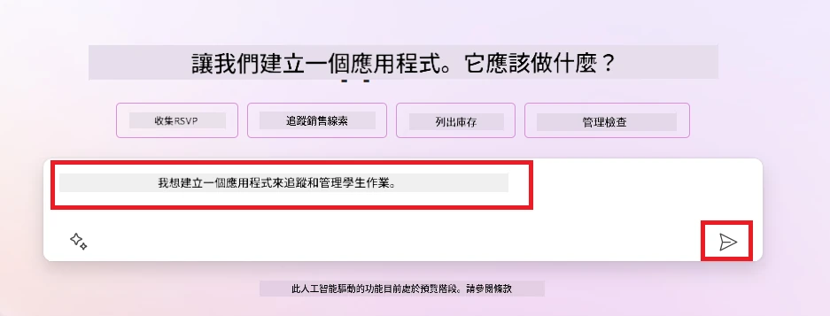

1. AI Copilot 會建議一個 Dataverse 表格，包含儲存你要追蹤資料所需的欄位和一些範例資料。你可以透過會話式步驟，利用 AI Copilot 助手功能自訂該表格，以滿足需求。

   > <strong>重要</strong>：Dataverse 是 Power Platform 的基礎資料平台，是一個低代碼資料平台用於儲存應用程式資料。它是完全管理的服務，安全地將資料儲存在 Microsoft 雲端，並在你的 Power Platform 環境中提供。它具備內建資料治理功能，例如資料分類、資料血緣、細粒度存取控制等。你可以在[這裡](https://learn.microsoft.com/power-apps/maker/data-platform/data-platform-intro?WT.mc_id=academic-109639-somelezediko)了解更多關於 Dataverse 的資訊。

   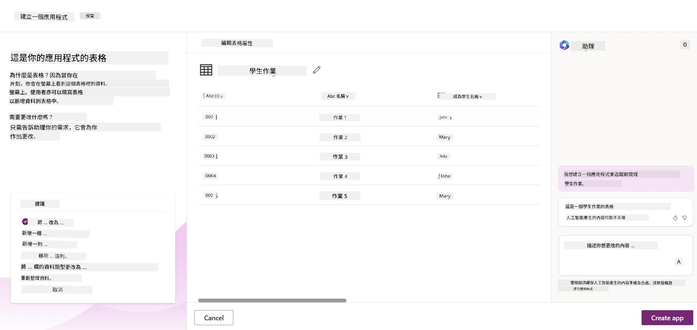

1. 教育工作者想要發電子郵件給已提交作業的學生，讓他們了解作業進度。你可以使用 Copilot 新增欄位至表格，儲存學生的電子郵件。例如，你可以使用以下提示新增欄位：**_我想新增一欄用於儲存學生電子郵件_**。點擊<strong>發送</strong>將提示送出給 AI Copilot。

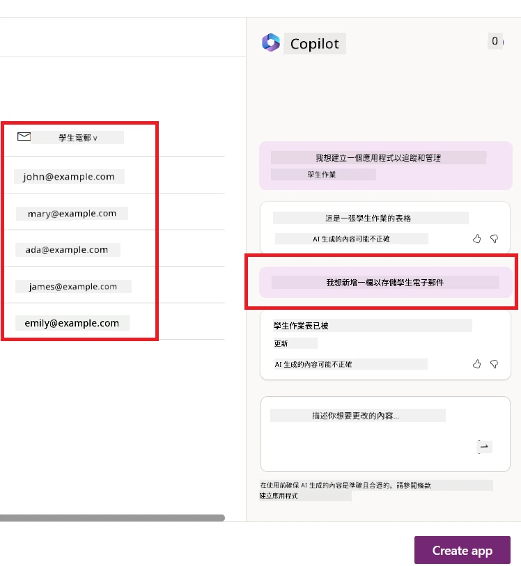

1. AI Copilot 會生成新的欄位，之後你就可以自訂該欄位來符合你的需求。

1. 完成表格後，按一下 <strong>建立應用程式</strong> 按鈕來建立應用程式。

1. AI 助理將根據您的描述生成一個響應式 Canvas 應用程式，然後您可以自訂應用程式以滿足您的需求。

1. 對於教育工作者發送電子郵件給學生，您可以使用助理來新增一個螢幕到應用程式。例如，您可以使用以下提示來新增一個螢幕到應用程式：**_我想新增一個螢幕來發送電子郵件給學生_**。按一下 <strong>傳送</strong> 按鈕將提示發送給 AI 助理。

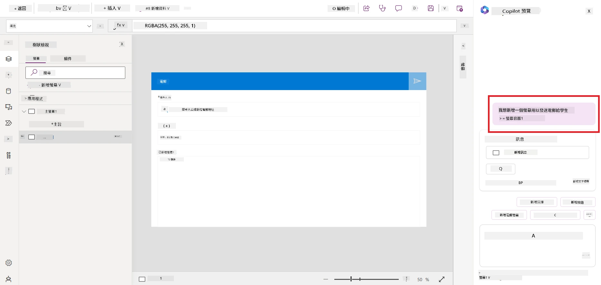

1. AI 助理將生成一個新螢幕，然後您可以自訂該螢幕以滿足您的需求。

1. 完成應用程式後，按一下 <strong>儲存</strong> 按鈕以儲存應用程式。

1. 若要與教育工作者分享應用程式，按一下 <strong>分享</strong> 按鈕，然後再按一次 <strong>分享</strong> 按鈕。您可以透過輸入他們的電子郵件地址來與教育工作者分享應用程式。

> <strong>您的作業</strong>：您剛建置的應用程式是一個良好的起點，但仍可改進。用電子郵件功能，教育工作者只能手動輸入電子郵件地址來發送郵件。您能否使用助理來建立一個自動化，讓教育工作者在學生提交作業時自動發送電子郵件？提示是用合適的提示，您可以使用 Power Automate 中的助理來建立這項功能。

### 為我們的初創公司建立發票資料表

我們初創公司的財務團隊一直在努力追蹤發票。他們一直用電子試算表來追蹤發票，但隨著發票數量增加，已經難以管理。他們請您建立一個資料表，幫助他們儲存、追蹤和管理收到的發票資訊。該資料表將用於建立一個自動化流程，以提取所有發票資訊並儲存在資料表中。該資料表也應讓財務團隊能查看已付款與未付款的發票。

Power Platform 有一個基礎資料平台稱為 Dataverse，讓您為應用程式和解決方案儲存資料。Dataverse 提供低程式碼資料平台用於儲存應用程式資料。它是一項完全託管的服務，在 Microsoft 雲端安全儲存資料，並在您的 Power Platform 環境中配置。它附帶內建的資料治理功能，如資料分類、資料沿革、細粒度存取控制等。您可以在[這裡了解更多關於 Dataverse 的資訊](https://learn.microsoft.com/power-apps/maker/data-platform/data-platform-intro?WT.mc_id=academic-109639-somelezediko)。

為什麼我們初創公司應該使用 Dataverse？Dataverse 內的標準與自訂資料表提供安全且基於雲端的資料儲存選項。資料表讓您能存放不同類型的資料，類似於在單一 Excel 活頁簿使用多個工作表。您可以使用資料表存放符合組織或業務需求的資料。我們初創公司從使用 Dataverse 獲得的好處包括但不限於：

- <strong>易於管理</strong>：元資料和資料皆存放於雲端，因此您不必擔心如何儲存或管理它們。您可以專注於建置應用程式和解決方案。

- <strong>安全</strong>：Dataverse 提供安全且基於雲端的資料儲存選項。您可以使用基於角色的安全機制控制誰能存取資料表中的資料，以及如何存取。

- <strong>豐富的元資料</strong>：資料類型與關聯直接在 Power Apps 中使用。

- <strong>邏輯與驗證</strong>：您可以使用業務規則、計算欄位和驗證規則來執行業務邏輯並維持資料準確度。

現在您已了解 Dataverse 及其用途，讓我們來看看如何使用助理在 Dataverse 中建立表格，以符合財務團隊的需求。

> <strong>注意</strong> ：您將在下一節使用此資料表來建置自動化流程，以提取所有發票資訊並儲存在資料表中。

使用助理在 Dataverse 建立資料表，請遵循以下步驟：

1. 導航至 [Power Apps](https://make.powerapps.com?WT.mc_id=academic-105485-koreyst) 主螢幕。

2. 在左側導覽欄選取 <strong>資料表</strong>，然後點選 <strong>描述新資料表</strong>。

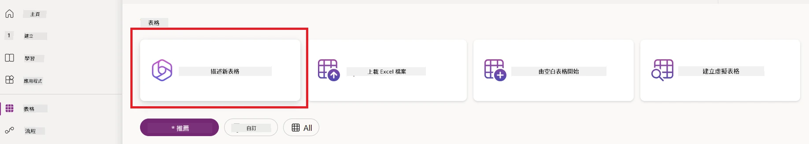

1. 在 <strong>描述新資料表</strong> 螢幕，使用文字區描述您要建立的資料表。例如，**_我想建立一個用於儲存發票資訊的資料表_**。按一下 <strong>傳送</strong> 按鈕將提示發送給 AI 助理。

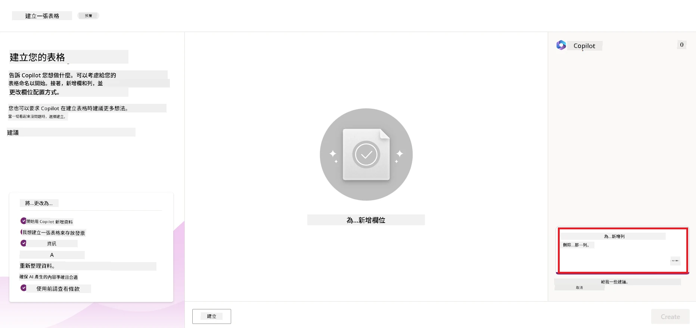

1. AI 助理將建議一個 Dataverse 資料表和適合儲存您要追蹤資料的欄位及示範資料。接著，您可以透過與 AI 助理對話式互動功能自訂資料表以符需求。

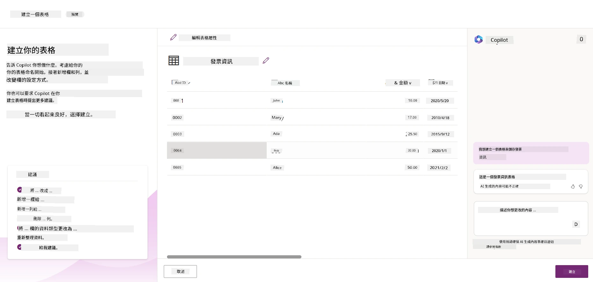

1. 財務團隊希望發送電子郵件給供應商，以更新其發票的當前狀態。您可以使用助理為資料表新增一個用於儲存供應商電子郵件的欄位。例如，您可以使用以下提示新增一個欄位到資料表：**_我想新增一個欄位來儲存供應商電子郵件_**。按一下 <strong>傳送</strong> 按鈕將提示送給 AI 助理。

1. AI 助理將建立新欄位，然後您可以依需求自訂該欄位。

1. 完成資料表後，按一下 <strong>建立</strong> 按鈕來建立資料表。

## Power Platform 中的 AI 模型與 AI Builder

AI Builder 是 Power Platform 中的低程式碼 AI 功能，讓您能使用 AI 模型自動化流程與預測結果。使用 AI Builder，您可以將 AI 引入連接 Dataverse 或其他多種雲端資料來源（如 SharePoint、OneDrive 或 Azure）的應用程式與流程。

## 預建 AI 模型與自訂 AI 模型

AI Builder 提供兩種類型的 AI 模型：預建 AI 模型與自訂 AI 模型。預建 AI 模型是由 Microsoft 訓練且可直接在 Power Platform 使用的即用型模型，能幫助您為應用程式與流程加入智能，而無需自行收集資料及建置、訓練與發佈模型。您可以使用這些模型來自動化流程與預測結果。

Power Platform 中的部分預建 AI 模型包括：

- <strong>關鍵詞摘取</strong>：本模型從文字摘取關鍵詞。
- <strong>語言識別</strong>：本模型識別文字語言。
- <strong>情感分析</strong>：本模型偵測正面、負面、中立或混合情感。
- <strong>名片閱讀器</strong>：本模型從名片提取資訊。
- <strong>文字識別</strong>：本模型從影像中提取文字。
- <strong>物件偵測</strong>：本模型偵測並提取影像中的物件。
- <strong>文件處理</strong>：本模型從表單中提取資訊。
- <strong>發票處理</strong>：本模型從發票中提取資訊。

使用自訂 AI 模型時，您可以帶入自己的模型到 AI Builder，使其像任何 AI Builder 自訂模型一樣運作，並使用您自己的資料訓練模型。您可使用這些模型在 Power Apps 和 Power Automate 中自動化流程與預測結果。使用自訂模型時會有一些限制，詳情請參閱這些[限制](https://learn.microsoft.com/ai-builder/byo-model#limitations?WT.mc_id=academic-105485-koreyst)。

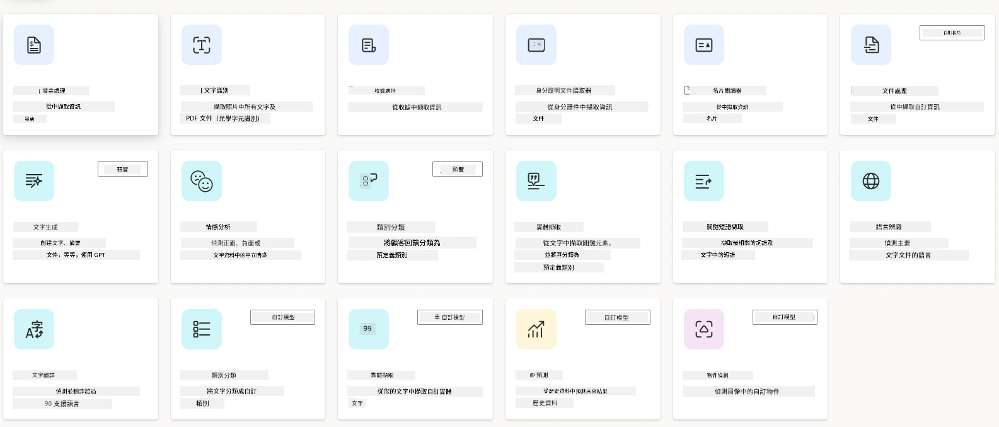

## 作業 #2 - 為我們的初創公司建置一個發票處理流程

財務團隊一直難以處理發票。他們用電子試算表追蹤發票，但隨著發票數量增加，管理變得困難。他們請您建置一個工作流程協助使用 AI 來處理發票。該工作流程應能提取發票資訊，並儲存在 Dataverse 資料表中，同時也使他們能發送電子郵件給財務團隊，附上提取的資訊。

現在您已了解 AI Builder 及其用途，讓我們來看看如何使用先前介紹過的 AI Builder 中的發票處理 AI 模型，建立一個幫助財務團隊處理發票的工作流程。

使用 AI Builder 中的發票處理 AI 模型建置工作流程，以幫助財務團隊處理發票，請遵循以下步驟：

1. 導航至 [Power Automate](https://make.powerautomate.com?WT.mc_id=academic-105485-koreyst) 主螢幕。

2. 使用主螢幕上的文字區描述您要建置的工作流程。例如，**_當發票到達我的郵件匣時處理發票_**。按一下 <strong>傳送</strong> 按鈕將提示發送給 AI 助理。

   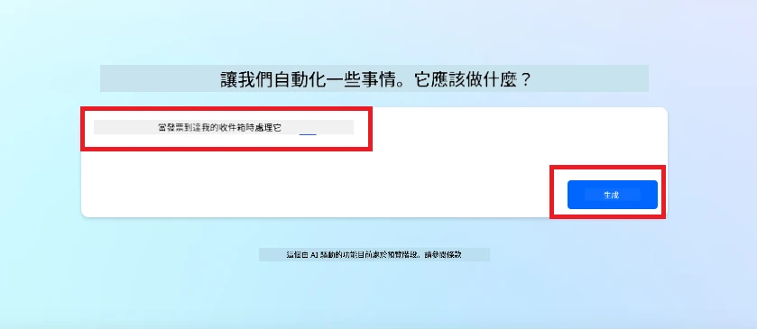

3. AI 助理將建議您自動化任務所需採取的動作。您可以按一下 <strong>下一步</strong> 按鈕以繼續後續步驟。

4. 在下一步，Power Automate 會提示您設定流程所需的連接。完成後，按一下 <strong>建立流程</strong> 按鈕建立流程。

5. AI 助理將產生一個流程，然後您可以自訂它以符合需求。

6. 更新流程觸發器，設定 <strong>資料夾</strong> 為將存放發票的資料夾。例如，您可以將資料夾設定為 <strong>收件匣</strong>。點選 <strong>顯示進階選項</strong>，將 <strong>只有附有附件</strong> 設為 <strong>是</strong>。這可確保流程只在收件匣收到附有附件的郵件時執行。

7. 從流程中移除以下動作：**HTML 轉文字**、<strong>組合</strong>、**組合 2**、**組合 3** 和 **組合 4**，因為這些動作不會使用。

8. 從流程中移除 <strong>條件</strong> 動作，因為不會使用它。流程應如以下截圖所示：

   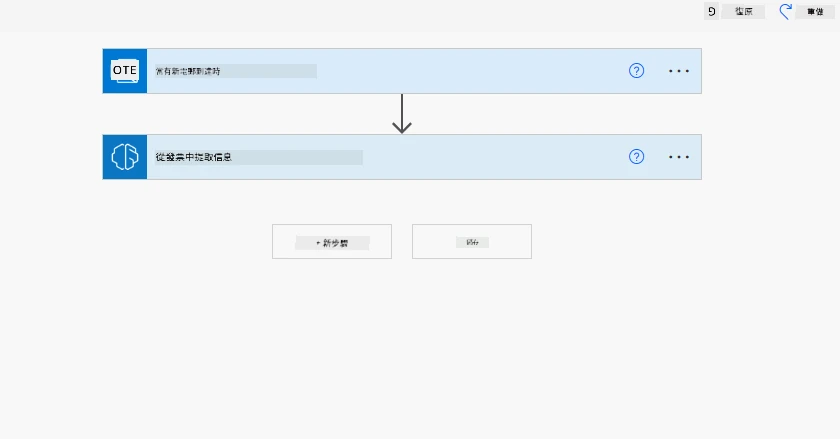

9. 按一下 <strong>新增動作</strong> 按鈕，搜尋 **Dataverse**，並選擇 <strong>新增資料列</strong> 動作。

10. 在 <strong>從發票擷取資訊</strong> 動作中，更新 <strong>發票檔案</strong> 以指向電子郵件中的 <strong>附件內容</strong>。這確保流程能從發票附件擷取資訊。

11. 選擇您之前建立的資料表，例如 <strong>發票資訊</strong> 資料表。使用上一個動作的動態內容填入以下欄位：

    - ID
    - 金額
    - 日期
    - 名稱
    - 狀態 - 將 <strong>狀態</strong> 設為 <strong>待處理</strong>。
    - 供應商電子郵件 - 使用 <strong>當收到新郵件</strong> 觸發器中的 <strong>寄件者</strong> 動態內容。

    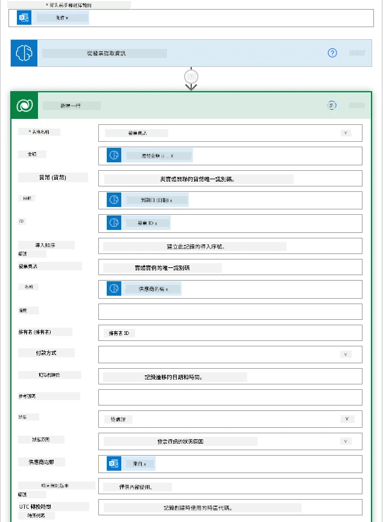

12. 完成流程後，按一下 <strong>儲存</strong> 按鈕以儲存流程。您然後可透過寄送附有發票的電子郵件到您在觸發器中指定的資料夾來測試流程。

> <strong>您的作業</strong>：您剛建置的流程是良好開始，接著您需要思考如何建置一個自動化，讓我們的財務團隊可發送電子郵件給供應商，以更新其發票的當前狀態。提示：流程必須在發票狀態更改時執行。

## 在 Power Automate 中使用文字生成 AI 模型

AI Builder 中的 Create Text with GPT AI 模型讓您可以根據提示生成文字，此功能由 Microsoft Azure OpenAI 服務提供支持。使用此功能，您可以將 GPT（生成預訓練轉換器）技術整合到您的應用程式與流程中，建置各種自動化流程與具洞見性的應用程式。

GPT 模型經過大量數據密集訓練，使其在給定提示時能生成與人類語言極為相似的文字。結合工作流程自動化，像 GPT 這類 AI 模型可用於優化與自動化廣泛任務。

例如，您可以建置流程自動生成各種用途的文本，例如電子郵件草稿、產品描述等。您也可使用此模型產生聊天機器人與客服應用程式的文本，幫助客服人員有效且高效地回應客戶查詢。

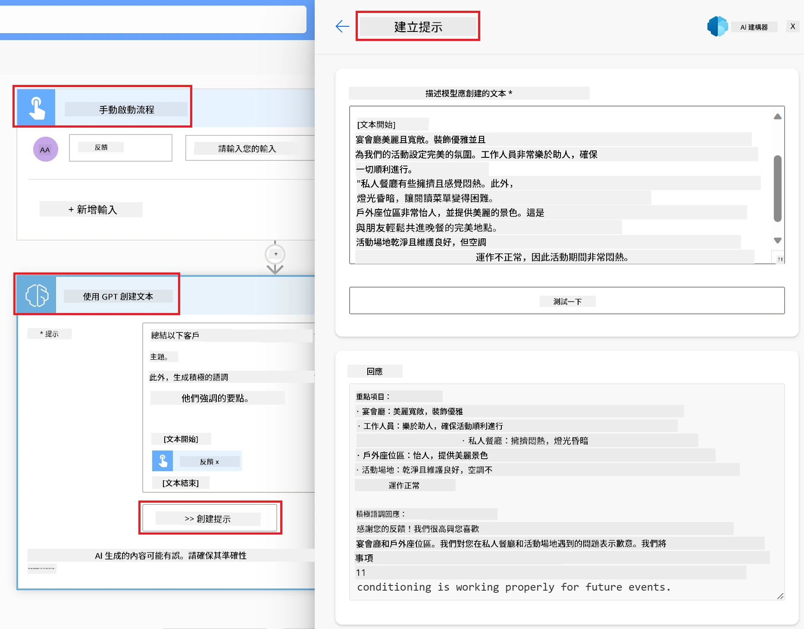

若要了解如何在 Power Automate 中使用此 AI 模型，請參閱 [利用 AI Builder 與 GPT 增強智能](https://learn.microsoft.com/training/modules/ai-builder-text-generation/?WT.mc_id=academic-109639-somelezediko) 課程。

## 做得好！繼續你的學習旅程

完成本課後，請查看我們的 [生成型 AI 學習系列](https://aka.ms/genai-collection?WT.mc_id=academic-105485-koreyst)，繼續提升你的生成型 AI 知識！

想自訂並充分利用 Copilot？探索 [Awesome Copilot](https://github.com/github/awesome-copilot?WT.mc_id=academic-105485-koreyst) — 一個由社區貢獻的指令、代理、技能及配置集合，幫助你最大化使用 GitHub Copilot。

前往第 11 課，我們將探討如何 [結合生成型 AI 與 Function Calling](../11-integrating-with-function-calling/README.md?WT.mc_id=academic-105485-koreyst)！

---

<!-- CO-OP TRANSLATOR DISCLAIMER START -->
**免責聲明**：
本文件由 AI 翻譯服務 [Co-op Translator](https://github.com/Azure/co-op-translator) 翻譯而成。雖然我們致力於確保準確性，但請注意，機器自動翻譯可能包含錯誤或不準確之處。原始文件的母語版本應被視為權威來源。對於重要資訊，建議進行專業人工翻譯。我們不對因使用本翻譯而產生的任何誤解或誤釋承擔責任。
<!-- CO-OP TRANSLATOR DISCLAIMER END -->