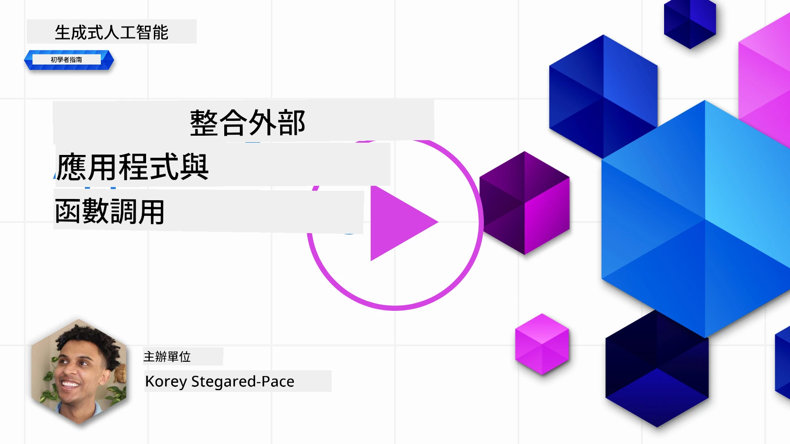
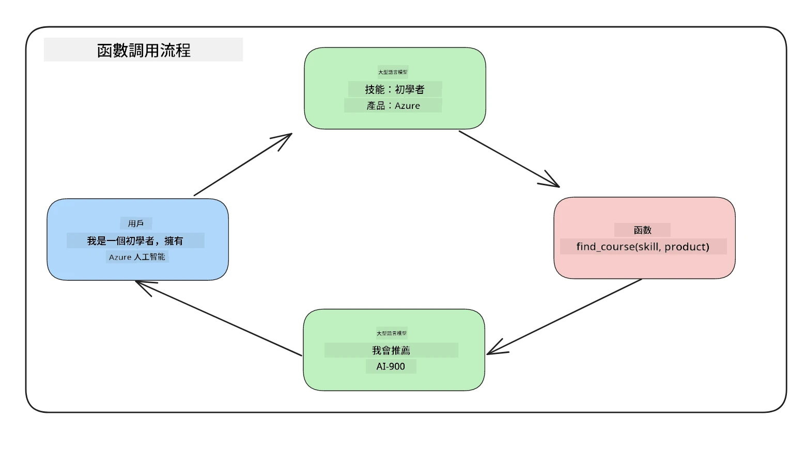
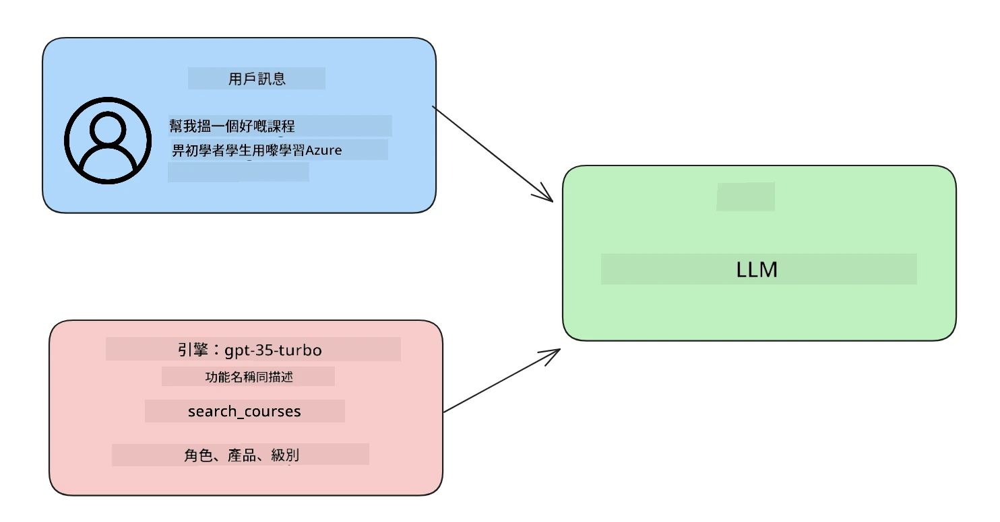

# 與函數調用整合

[](https://youtu.be/DgUdCLX8qYQ?si=f1ouQU5HQx6F8Gl2)

你已經在之前的課程中學到不少內容。然而，我們仍可進一步改進。一些我們可以處理的問題是如何獲得更一致的回應格式，以便在後續環節更輕鬆地處理回應。同時，我們亦可能希望加入來自其他來源的資料，以進一步豐富我們的應用程式。

上述問題即是本章將要解決的。

## 介紹

本課程將涵蓋：

- 解釋什麼是函數調用及其使用場景。
- 使用 Azure OpenAI 建立函數調用。
- 如何將函數調用整合到應用程式中。

## 學習目標

在本課程結束時，你將能夠：

- 解釋使用函數調用的目的。
- 使用 Azure OpenAI 服務設定函數調用。
- 設計有效的函數調用以符合你的應用案例。

## 情境：用函數改進聊天機械人

本課程中，我們希望為我們的教育新創公司建立一項功能，讓使用者能透過聊天機械人尋找技術課程。我們會根據使用者的技能水平、當前角色及感興趣的技術來推薦合適的課程。

為了完成這個情境，我們會結合以下工具：

- 使用 `Azure OpenAI` 為使用者建立聊天體驗。
- 使用 `Microsoft Learn Catalog API` 幫助使用者根據需求尋找課程。
- 使用 `函數調用` 將使用者的查詢發送至函數以進行 API 請求。

讓我們先來看看為什麼想要使用函數調用：

## 為什麼使用函數調用

在函數調用之前，LLM 的回答是非結構化且不一致的。開發者需要撰寫複雜的驗證代碼來確保能處理每種回應變體。使用者無法得到像「斯德哥爾摩目前天氣如何？」這樣的答案，因為模型的資料是受限於訓練時間的。

函數調用是 Azure OpenAI 服務的一個功能，用來克服以下限制：

- <strong>一致的回應格式</strong>。如果我們能更好地控制回應格式，就能更容易將回應整合到下游系統中。
- <strong>外部資料</strong>。能在聊天情景中使用應用程式其他來源的資料。

## 透過情境說明問題

> 建議你使用[包含的筆記本](./python/aoai-assignment.ipynb?WT.mc_id=academic-105485-koreyst)來運行下列情境。你也可以只讀解釋，我們會嘗試展示一個函數能幫助解決的問題。

讓我們來看一個說明回應格式問題的範例：

假設我們想建立一個學生資料庫，以便向學生推薦合適的課程。下方有兩個學生的描述，它們所含的資料非常相似。

1. 建立與我們 Azure OpenAI 資源的連線：

   ```python
   import os
   import json
   from openai import OpenAI
   from dotenv import load_dotenv
   load_dotenv()

   # Responses API 是由 Azure OpenAI（Microsoft Foundry）v1 端點提供服務
   # 因此，我們將 OpenAI 用戶端指向 <your-endpoint>/openai/v1/。
   endpoint = os.environ['AZURE_OPENAI_ENDPOINT']
   client = OpenAI(
   api_key=os.environ['AZURE_OPENAI_API_KEY'],
   base_url=f"{endpoint.rstrip('/')}/openai/v1/",
   )

   deployment=os.environ['AZURE_OPENAI_DEPLOYMENT']
   ```

   以下是一些用於設定與 Azure OpenAI 連線的 Python 程式碼。由於我們使用的是 v1 端點，只需設定 `api_key` 和 `base_url`（不需要 `api_version`）。

1. 用變數 `student_1_description` 和 `student_2_description` 建立兩個學生描述。

   ```python
   student_1_description="Emily Johnson is a sophomore majoring in computer science at Duke University. She has a 3.7 GPA. Emily is an active member of the university's Chess Club and Debate Team. She hopes to pursue a career in software engineering after graduating."

   student_2_description = "Michael Lee is a sophomore majoring in computer science at Stanford University. He has a 3.8 GPA. Michael is known for his programming skills and is an active member of the university's Robotics Club. He hopes to pursue a career in artificial intelligence after finishing his studies."
   ```

   我們想將上面的學生描述發送給 LLM 來解析資料。這些資料稍後可在應用程式中使用，並可發送到 API 或儲存在資料庫中。

1. 建立兩個相同的提示語，指示 LLM 我們感興趣的資料：

   ```python
   prompt1 = f'''
   Please extract the following information from the given text and return it as a JSON object:

   name
   major
   school
   grades
   club

   This is the body of text to extract the information from:
   {student_1_description}
   '''

   prompt2 = f'''
   Please extract the following information from the given text and return it as a JSON object:

   name
   major
   school
   grades
   club

   This is the body of text to extract the information from:
   {student_2_description}
   '''
   ```

   上述提示語指示 LLM 提取資訊並以 JSON 格式回應。

1. 設定好提示語與連線到 Azure OpenAI 後，我們將使用 `client.responses.create` 傳送提示語給 LLM。將提示存放在 `input` 變數，並將角色設為 `user`，模擬使用者撰寫訊息給聊天機械人。

   ```python
   # 來自提示一的回應
   openai_response1 = client.responses.create(
   model=deployment,
   input = [{'role': 'user', 'content': prompt1}],
   store=False,
   )
   openai_response1.output_text

   # 來自提示二的回應
   openai_response2 = client.responses.create(
   model=deployment,
   input = [{'role': 'user', 'content': prompt2}],
   store=False,
   )
   openai_response2.output_text
   ```

現在我們可以同時向 LLM 傳送兩個請求，並透過 `openai_response1.output_text` 查看收到的回應。

1. 最後，我們可以使用 `json.loads` 將回應轉換成 JSON 格式：

   ```python
   # 將回應載入為 JSON 物件
   json_response1 = json.loads(openai_response1.output_text)
   json_response1
   ```

   回應 1：

   ```json
   {
     "name": "Emily Johnson",
     "major": "computer science",
     "school": "Duke University",
     "grades": "3.7",
     "club": "Chess Club"
   }
   ```

   回應 2：

   ```json
   {
     "name": "Michael Lee",
     "major": "computer science",
     "school": "Stanford University",
     "grades": "3.8 GPA",
     "club": "Robotics Club"
   }
   ```

   即使提示語相同且描述相似，我們看到 `Grades` 屬性的值格式卻不同，例如有時是 `3.7`，有時是 `3.7 GPA`。

   此結果是因為 LLM 處理的是非結構化的提示語資料，回傳也是非結構化資料。我們需要有結構化的格式，才能知道在儲存或使用這些資料時可期待什麼。

那麼，我們要如何解決格式問題呢？透過函數調用，我們可以確保回傳的是結構化資料。使用函數調用時，LLM 並不會實際執行任何函數，而是我們為 LLM 回應建立了一個結構。接著，我們利用這些結構化回應來判斷應該在應用程式中執行哪個函數。



我們然後可拿函數回傳結果，再傳給 LLM，LLM 會以自然語言回應使用者的查詢。

## 函數調用的使用場景

函數調用有多種使用場景能改善你的應用程式，例如：

- <strong>調用外部工具</strong>。聊天機械人非常擅長回答使用者提問。透過函數調用，聊天機械人可以根據使用者訊息完成特定任務。例如，學生可請聊天機械人「發送郵件給我的講師，說我需要更多這科目的協助」。這時會呼叫 `send_email(to: string, body: string)` 函數。

- **建立 API 或資料庫查詢**。使用者可用自然語言查找資訊，系統將其轉換成格式化查詢或 API 請求。舉例來說，老師想知道「哪些學生完成了最後的作業」，就可呼叫名為 `get_completed(student_name: string, assignment: int, current_status: string)` 的函數。

- <strong>創建結構化資料</strong>。使用者可將一段文字或 CSV 檔案交給 LLM 從中提取重要資訊。例如，學生可以將一篇關於和平協議的維基百科文章轉成 AI 快閃卡。這可以使用 `get_important_facts(agreement_name: string, date_signed: string, parties_involved: list)` 函數來完成。

## 創建你的第一個函數調用

創建函數調用的流程包含三個主要步驟：

1. 使用函數列表（工具）和使用者訊息調用 Responses API。
2. 讀取模型的回應以執行動作，例如執行函數或 API 調用。
3. 再次調用 Responses API，將函數回應用於產生回應給使用者。



### 步驟一 - 創建訊息

首先創建一個使用者訊息，可動態分配該值（例如從文字輸入取得），或者直接在此指定值。如果你首次使用 Responses API，需要定義訊息的 `role` 與 `content`。

`role` 可為 `system`（制定規則）、`assistant`（模型）或 `user`（終端使用者）。函數調用我們將設為 `user`，並示範一個問題。

```python
messages= [ {"role": "user", "content": "Find me a good course for a beginner student to learn Azure."} ]
```

指定不同角色讓 LLM 明確得知此為系統訊息或使用者訊息，有助於建立 LLM 可依的對話歷史。

### 步驟二 - 創建函數

接著定義函數及其參數。我們這次只用一個函數 `search_courses`，但是你可以建立多個函數。

> <strong>重要</strong>：函數包含於發給 LLM 的系統訊息中，會佔用你的可用令牌數。

以下將函數建立為一個陣列，每一項目為一個工具，使用 Responses API 扁平格式，有 `type`、`name`、`description` 及 `parameters` 屬性：

```python
functions = [
   {
      "type":"function",
      "name":"search_courses",
      "description":"Retrieves courses from the search index based on the parameters provided",
      "parameters":{
         "type":"object",
         "properties":{
            "role":{
               "type":"string",
               "description":"The role of the learner (i.e. developer, data scientist, student, etc.)"
            },
            "product":{
               "type":"string",
               "description":"The product that the lesson is covering (i.e. Azure, Power BI, etc.)"
            },
            "level":{
               "type":"string",
               "description":"The level of experience the learner has prior to taking the course (i.e. beginner, intermediate, advanced)"
            }
         },
         "required":[
            "role"
         ]
      }
   }
]
```

下面更詳細說明各個函數實例：

- `name` - 要呼叫的函數名稱。
- `description` - 函數運作描述，需明確且具體。
- `parameters` - 希望模型在回應中產生的值及格式列表。parameters 陣列項目具備以下屬性：
  1.  `type` - 屬性資料類型。
  1.  `properties` - 用於回應的具體值列表
      1. `name` - 屬性名稱，例如 `product`。
      1. `type` - 該屬性資料型別，如 `string`。
      1. `description` - 具體屬性描述。

同時有可選屬性 `required` - 指定函數調用時必須有此屬性。

### 步驟三 - 進行函數調用

定義函數後，我們需在呼叫 Responses API 時包含它們，方法是將 `tools` 加入請求，此處為 `tools=functions`。

也可設定 `tool_choice` 為 `auto`，讓 LLM 根據使用者訊息自行決定呼叫哪個函數，而非我們指定。

以下程式碼示範如何呼叫 `client.responses.create`，注意我們設 `tools=functions` 與 `tool_choice="auto"`，讓 LLM 自行決定何時呼叫我們提供的函數：

```python
response = client.responses.create(model=deployment,
                                        input=messages,
                                        tools=functions,
                                        tool_choice="auto",
                                        store=False)

print(response.output)
```

回應中 `response.output` 將包含 `function_call` 項目，如下所示：

```json
{
  "type": "function_call",
  "name": "search_courses",
  "call_id": "call_abc123",
  "arguments": "{\n  \"role\": \"student\",\n  \"product\": \"Azure\",\n  \"level\": \"beginner\"\n}"
}
```

在這裡我們可以看到 `search_courses` 函數被呼叫，及其參數列在 JSON 回應中的 `arguments` 屬性。

LLM 的判斷是從 Responses API 呼叫中 `input` 參數的值提取到能符合函數參數的資料。以下提醒你 `messages` 的值：

```python
messages= [ {"role": "user", "content": "Find me a good course for a beginner student to learn Azure."} ]
```

可見 `student`、`Azure` 與 `beginner` 是從 `messages` 提取並作為函數輸入。如此利用函數不僅有效從提示提取資訊，亦可為 LLM 給予結構並實現可重複使用的功能。

接著我們看看如何在應用程式中使用這些。

## 將函數調用整合到應用程式中

在測試過 LLM 結構化回應後，我們可將其整合到應用程式。

### 管理流程

整合到應用程式，我們可以進行以下步驟：

1. 首先呼叫 OpenAI 服務並從回應 `output` 中提取函數調用項目。

   ```python
   response_items = response.output
   tool_calls = [item for item in response_items if item.type == "function_call"]
   ```

1. 現在定義一個函數呼叫 Microsoft Learn API 以取得課程清單：

   ```python
   import requests

   def search_courses(role, product, level):
     url = "https://learn.microsoft.com/api/catalog/"
     params = {
        "role": role,
        "product": product,
        "level": level
     }
     response = requests.get(url, params=params)
     modules = response.json()["modules"]
     results = []
     for module in modules[:5]:
        title = module["title"]
        url = module["url"]
        results.append({"title": title, "url": url})
     return str(results)
   ```

   注意我們現在建立了對應於前面 `functions` 變數所列函數名稱的 Python 函數。我們也進行真正的外部 API 呼叫以擷取資料，此處是向 Microsoft Learn API 搜尋訓練模組。

好了，我們建立了 `functions` 變數及相符的 Python 函數，那要如何告訴 LLM 要映射這兩者，以便呼叫我們的 Python 函數？

1. 要判斷是否需要呼叫 Python 函數，我們得查看 LLM 回應是否包含 `function_call` 項目，若有則呼叫該函數。以下示範如何檢查：

   ```python
   # 檢查模型是否想調用函數
   if tool_calls:
    for tool_call in tool_calls:
     print("Recommended Function call:")
     print(tool_call.name)
     print()

     # 調用該函數。
     function_name = tool_call.name

     available_functions = {
             "search_courses": search_courses,
     }
     function_to_call = available_functions[function_name]

     function_args = json.loads(tool_call.arguments)
     function_response = function_to_call(**function_args)

     print("Output of function call:")
     print(function_response)
     print(type(function_response))

     # 將函數調用及其結果加入對話中。
     # 模型的 function_call 項目必須在輸出之前附加。
     messages.append(tool_call)  # 助理的 function_call 項目
     messages.append( # 函數結果
         {
             "type": "function_call_output",
             "call_id": tool_call.call_id,
             "output": function_response,
         }
     )
   ```

   這三行確保我們提取函數名稱、參數並進行呼叫：

   ```python
   function_to_call = available_functions[function_name]

   function_args = json.loads(tool_call.arguments)
   function_response = function_to_call(**function_args)
   ```

   以下為執行程式的輸出：

   <strong>輸出</strong>

   ```Recommended Function call:
   {
     "name": "search_courses",
     "arguments": "{\n  \"role\": \"student\",\n  \"product\": \"Azure\",\n  \"level\": \"beginner\"\n}"
   }

   Output of function call:
   [{'title': 'Describe concepts of cryptography', 'url': 'https://learn.microsoft.com/training/modules/describe-concepts-of-cryptography/?
   WT.mc_id=api_CatalogApi'}, {'title': 'Introduction to audio classification with TensorFlow', 'url': 'https://learn.microsoft.com/en-
   us/training/modules/intro-audio-classification-tensorflow/?WT.mc_id=api_CatalogApi'}, {'title': 'Design a Performant Data Model in Azure SQL
   Database with Azure Data Studio', 'url': 'https://learn.microsoft.com/training/modules/design-a-data-model-with-ads/?
   WT.mc_id=api_CatalogApi'}, {'title': 'Getting started with the Microsoft Cloud Adoption Framework for Azure', 'url':
   'https://learn.microsoft.com/training/modules/cloud-adoption-framework-getting-started/?WT.mc_id=api_CatalogApi'}, {'title': 'Set up the
   Rust development environment', 'url': 'https://learn.microsoft.com/training/modules/rust-set-up-environment/?WT.mc_id=api_CatalogApi'}]
   <class 'str'>
   ```

1. 現在我們將更新後的訊息 `messages` 送給 LLM，以收到自然語言回答，取代 API JSON 格式的回應。

   ```python
   print("Messages in next request:")
   print(messages)
   print()

   second_response = client.responses.create(
      input=messages,
      model=deployment,
      tool_choice="auto",
      tools=functions,
      temperature=0,
      store=False,
         )  # 從模型獲取一個新的回應，使其可以看到函數回應


   print(second_response.output_text)
   ```

   <strong>輸出</strong>

   ```text
   I found some good courses for beginner students to learn Azure:

   1. [Describe concepts of cryptography](https://learn.microsoft.com/training/modules/describe-concepts-of-cryptography/?WT.mc_id=api_CatalogApi)
   2. [Introduction to audio classification with TensorFlow](https://learn.microsoft.com/training/modules/intro-audio-classification-tensorflow/?WT.mc_id=api_CatalogApi)
   3. [Design a Performant Data Model in Azure SQL Database with Azure Data Studio](https://learn.microsoft.com/training/modules/design-a-data-model-with-ads/?WT.mc_id=api_CatalogApi)
   4. [Getting started with the Microsoft Cloud Adoption Framework for Azure](https://learn.microsoft.com/training/modules/cloud-adoption-framework-getting-started/?WT.mc_id=api_CatalogApi)
   5. [Set up the Rust development environment](https://learn.microsoft.com/training/modules/rust-set-up-environment/?WT.mc_id=api_CatalogApi)

   You can click on the links to access the courses.
   ```

## 作業

繼續學習 Azure OpenAI 函數調用，你可以建立：

- 函數更多參數，幫助學習者找到更多課程。

- 建立另一個函式呼叫，以取得學習者更多資訊，如他們的母語
- 在函式呼叫和/或 API 呼叫未回傳任何合適課程時實作錯誤處理

提示：請參考[Learn API 參考文件](https://learn.microsoft.com/training/support/catalog-api-developer-reference?WT.mc_id=academic-105485-koreyst) 頁面，以了解這些資料如何及在哪裡取得。

## 做得好！繼續你的旅程

完成本課程後，請瀏覽我們的[生成式 AI 學習合集](https://aka.ms/genai-collection?WT.mc_id=academic-105485-koreyst)，繼續提升你的生成式 AI 知識！

前往第 12 課，我們將探討如何[設計 AI 應用程式的使用者體驗](../12-designing-ux-for-ai-applications/README.md?WT.mc_id=academic-105485-koreyst)！

---

<!-- CO-OP TRANSLATOR DISCLAIMER START -->
**免責聲明**：
本文件由 AI 翻譯服務 [Co-op Translator](https://github.com/Azure/co-op-translator) 翻譯而成。雖然我們致力於確保準確性，但請注意，機器自動翻譯可能包含錯誤或不準確之處。原始文件的母語版本應被視為權威來源。對於重要資訊，建議進行專業人工翻譯。我們不對因使用本翻譯而產生的任何誤解或誤釋承擔責任。
<!-- CO-OP TRANSLATOR DISCLAIMER END -->