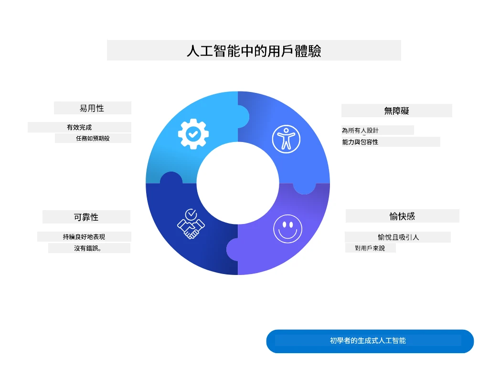
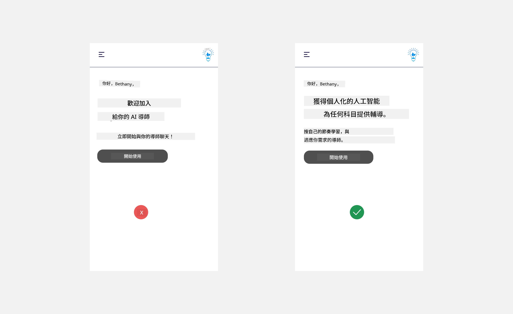
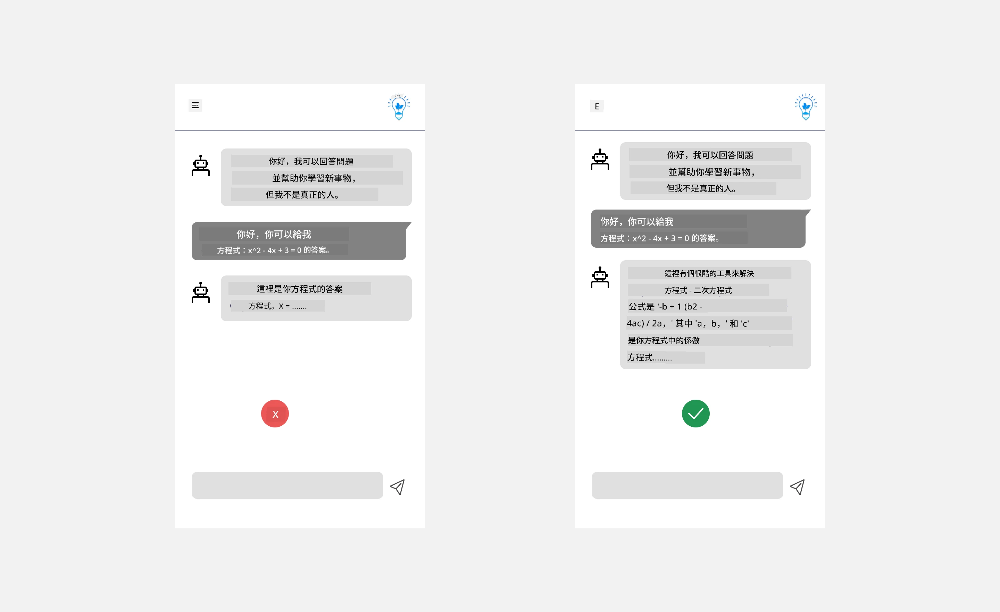
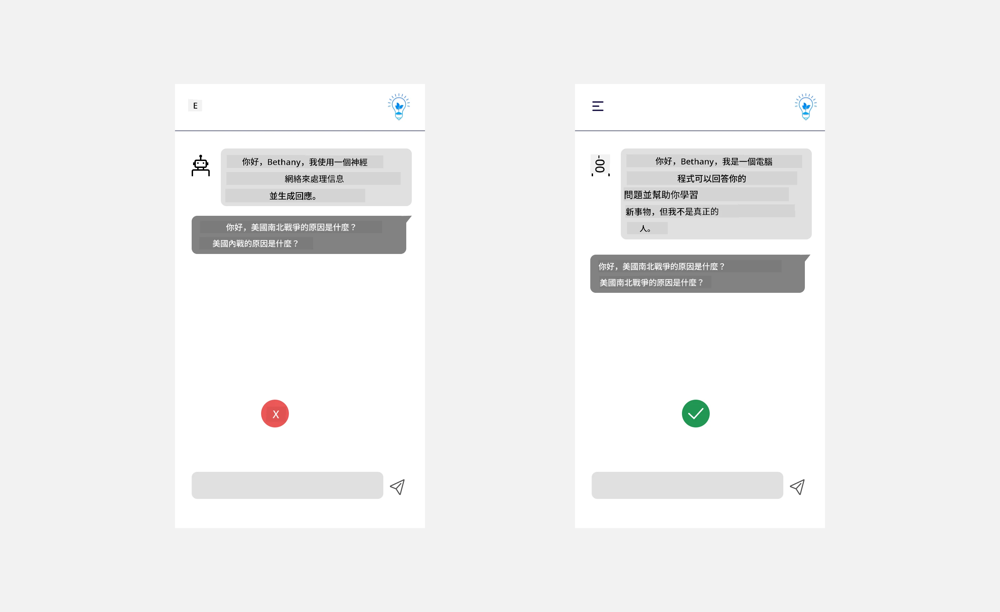
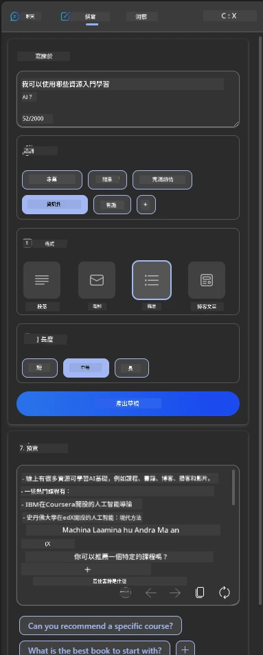
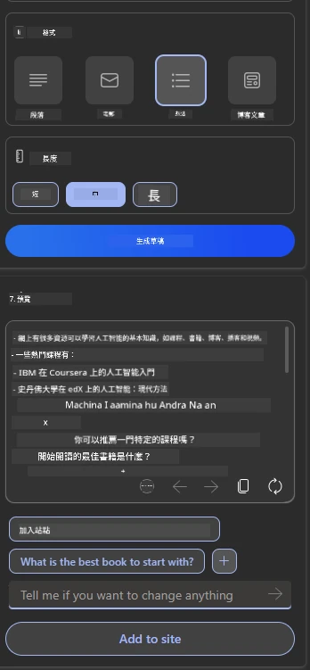
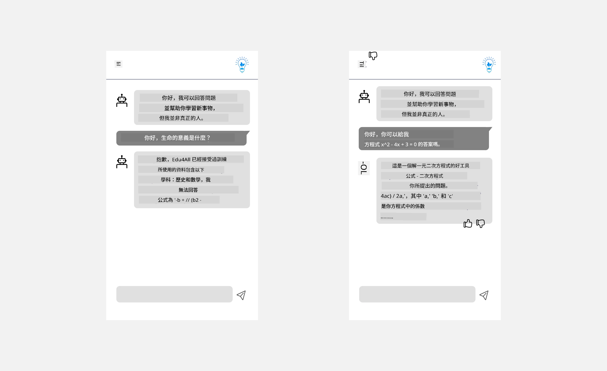

# 為人工智能應用設計使用者體驗

> _(點擊上方圖片觀看本課視頻)_

使用者體驗是構建應用程式非常重要的一環。用戶需要能高效使用你的應用程式去完成任務。效率是一方面，但同時你也需要設計應用程式，使其能為每個人所用，令其具備_無障礙_特性。本章將聚焦此範疇，助你設計出一個人們能夠且願意使用的應用程式。

## 介紹

使用者體驗是指用戶如何與特定產品或服務互動及使用它，無論是系統、工具或設計。在開發人工智能應用程式時，開發者不僅關注確保使用者體驗有效，還重視倫理。本課程將探討如何構建符合用戶需求的人工智能（AI）應用程式。

本課程將涵蓋以下範疇：

- 介紹使用者體驗及理解用戶需求
- 設計促進信任與透明化的AI應用程式
- 設計促進協作與反饋的AI應用程式

## 學習目標

完成本課後，你將能夠：

- 了解如何構建符合用戶需求的AI應用程式。
- 設計促進信任與協作的AI應用程式。

### 先決條件

花些時間閱讀更多關於[使用者體驗與設計思維。](https://learn.microsoft.com/training/modules/ux-design?WT.mc_id=academic-105485-koreyst)

## 介紹使用者體驗及理解用戶需求

在我們虛構的教育新創企業中，有兩類主要用戶：教師及學生。這兩類用戶各有獨特需求。以用戶為中心的設計優先考慮用戶，確保產品對目標用戶具相關性和益處。

應用程式應該是<strong>有用、可靠、無障礙且愉悅</strong>的，以提供良好的用戶體驗。

### 可用性

有用意指應用程式功能符合其預期用途，例如自動化評分程序或生成複習用的抽認卡。自動化評分的應用程式需能根據預先定義的標準準確且高效地評分學生的作業。同樣地，生成複習抽認卡的應用程式需根據資料創建相關且多元的問題。

### 可靠性

可靠意指應用程式能持續且無錯誤地執行其任務。但人工智能就像人類一樣並非完美，可能會犯錯。應用程式可能遇到錯誤或意外情況，需人工介入或修正。你如何處理錯誤？本課最後一節將涵蓋AI系統和應用程式如何設計以促進協作及反饋。

### 無障礙

無障礙意指將用戶體驗延伸至不同能力的用戶，包括殘疾人士，確保沒有人被排除。遵循無障礙指引和原則，AI解決方案變得更包容、易用且對所有用戶有益。

### 愉悅

愉悅意指應用程式使用體驗令人享受。吸引人的使用者體驗能正面影響用戶，鼓勵他們回來使用應用，並提升業務收入。

並非所有挑戰都能用AI解決。AI可以輔助你的使用者體驗，例如自動化手動任務或個人化用戶體驗。

## 設計促進信任與透明化的AI應用程式

建立信任在設計AI應用程式時至關重要。信任使用戶有信心應用程式能完成工作、穩定輸出結果，而結果符合用戶需求。此處風險為不信任及過度信任。不信任發生在用戶對AI系統缺乏信心，導致拒絕使用應用程式。過度信任則是用戶高估AI能力，過度依賴AI系統。例如，在過度信任情況下，自動評分系統可能導致老師不檢查部分試卷，導致評分不公或不準確，或錯失反饋與改進機會。

確保信任置於設計核心的兩種策略是可解釋性和控制。

### 可解釋性

當AI幫助決策，如向後代傳授知識時，教師和家長理應了解AI如何作出決策。這就是可解釋性——了解AI應用怎樣做決策。設計具可解釋性包括增加細節，突出AI如何得出輸出。用戶必須知道輸出是由AI生成，而非人類。例如，不說「現在開始與導師聊天」，而說「使用能適應你需求及學習節奏的AI導師」。

另一例子是AI如何使用用戶及個人數據。例如，擁有學生角色的用戶可能會有角色限定。AI可能無法揭示問題答案，但能幫助引導用戶思考如何解決問題。

可解釋性的另一重點是簡化解釋。學生和教師可能非AI專家，因此應用能做什麼或不做什麼的解釋應簡單易明。

### 控制

生成式AI在AI與用戶間建立合作關係，例如用戶可修改提示詞以獲得不同結果。此外，生成輸出後，用戶應能修改結果，從而增強控制感。例如，使用Microsoft Copilot（前稱Bing Chat）時，你可根據格式、語氣及長度調整提示詞。你也可對輸出內容進行修改，示例如下：

Microsoft Copilot另一讓用戶控制應用程式的功能是可選擇是否讓AI使用其數據。以學校應用為例，學生可能想使用自己的筆記和老師的資源作為複習材料。

> 在設計AI應用程式時，意圖性是確保用戶不會過度信任並設立不切實際期待的關鍵。一種做法是在提示詞與結果之間製造摩擦，提醒用戶這是AI，而非真正的人類。

## 設計促進協作與反饋的AI應用程式

前述提到，生成式AI創造用戶與AI間的合作。大部分互動是用戶輸入提示詞，AI生成輸出。如果輸出錯誤，應用怎麼處理呢？出錯時，AI會責怪用戶還是花時間解釋錯誤？

AI應用應具備接收與提供反饋的功能。這不僅幫助AI系統改進，也建立用戶信任。設計中應包含反饋回路，例如簡單的對輸出點讚或點踩。

另一處理方式是明確溝通系統的功能與限制。當用戶請求超出AI能力的功能時，系統也應有相應處理，如下所示。

系統錯誤在應用中屢見不鮮，用戶可能需要AI範圍外的資訊幫助，或應用有限制用戶可生成多少問題／學科摘要。例如，若AI應用只針對有限學科（如歷史及數學）訓練，無法回應地理相關問題。為減輕此情況，AI系統可回覆：「抱歉，我們產品只用以下學科數據訓練......，無法回答你提出的問題。」

AI應用並非完美無缺，必然會出錯。設計應用時，需確保為用戶提供反饋空間及簡便易懂的錯誤處理機制。

## 作業

以你至今建構的任何AI應用為例，考慮於應用中實施以下步驟：

- **愉悅性：** 考慮如何讓應用更愉快。你是否到處添加說明？是否鼓勵用戶探索？錯誤信息的措辭如何？

- **可用性：** 若在建造網頁應用，確保用戶可用鼠標及鍵盤導航。

- **信任和透明度：** 不要完全信任AI及其輸出，考慮如何加入人工核實輸出。亦考慮並實施其他達成信任和透明度的方法。

- **控制權：** 賦予用戶控制其提供給應用的數據。實施用戶可選擇加入或退出數據收集的機制。

<!-- ## [課後測驗](../../../12-designing-ux-for-ai-applications/quiz-url) -->

## 持續學習！

完成本課後，查看我們的[生成式AI學習合集](https://aka.ms/genai-collection?WT.mc_id=academic-105485-koreyst)，繼續提升你的生成式AI知識！

前往第13課，我們將探討如何[保護AI應用](../13-securing-ai-applications/README.md?WT.mc_id=academic-105485-koreyst)！

---

<!-- CO-OP TRANSLATOR DISCLAIMER START -->
**免責聲明**：
本文件由 AI 翻譯服務 [Co-op Translator](https://github.com/Azure/co-op-translator) 翻譯而成。雖然我們致力於確保準確性，但請注意，機器自動翻譯可能包含錯誤或不準確之處。原始文件的母語版本應被視為權威來源。對於重要資訊，建議進行專業人工翻譯。我們不對因使用本翻譯而產生的任何誤解或誤釋承擔責任。
<!-- CO-OP TRANSLATOR DISCLAIMER END -->