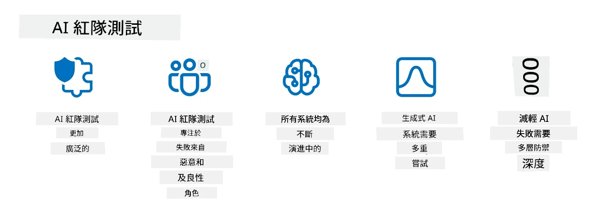

# 保護你的生成式人工智能應用程式

## 簡介

本課程將涵蓋：

- 人工智能系統範疇內的安全性。
- 人工智能系統的常見風險和威脅。
- 保護人工智能系統的方法和考量。

## 學習目標

完成本課程後，你將了解：

- 人工智能系統的威脅和風險。
- 保護人工智能系統的常見方法與實踐。
- 如何透過實施安全測試防止意外結果及用戶信任流失。

## 在生成式人工智能範疇中，安全性是甚麼意思？

隨著人工智能（AI）和機器學習（ML）技術日益影響我們的生活，保護不僅是客戶資料，而是整個AI系統本身變得至關重要。AI/ML在支援涉及重大決策的行業中越來越常用，而錯誤決策可能導致嚴重後果。

以下是需要考慮的要點：

- **AI/ML的影響**：AI/ML對日常生活有重大影響，因此保護它們已成為必要。
- <strong>安全挑戰</strong>：AI/ML帶來的影響需要妥善對待，以保護基於AI的產品免受高級攻擊，無論是惡意網民還是組織性的攻擊團體。
- <strong>策略問題</strong>：科技行業必須主動應對策略挑戰，確保長遠的客戶安全與資料安全。

此外，機器學習模型大多無法區分惡意輸入與良性異常數據。部份訓練數據來自未經審核和未經管理的公共數據集，這些數據集允許第三方貢獻。攻擊者無需入侵資料集，便能自由加入有害資料。隨著時間推移，低信心的惡意資料若格式正確，會變成高信心且被信任的資料。

這就是為什麼確保模型所用資料存儲的完整性與保護如此重要。

## 理解人工智能的威脅與風險

就AI和相關系統而言，資料中毒是當前最重要的安全威脅。資料中毒是指有人故意改變用於訓練AI的資訊，導致AI犯錯。這是因為缺乏標準化的偵測與緩解方法，加上我們依賴不受信任或未經篩選的公共資料集進行訓練。為了保持資料完整性並防止訓練過程受損，非常關鍵的是追蹤資料來源和血統，否則「垃圾進，垃圾出」的老話仍然成立，導致模型性能受損。

以下是資料中毒可能對模型產生影響的範例：

1. **標籤反轉(Label Flipping)**：在二元分類任務中，攻擊者故意反轉少量訓練資料的標籤。例如，把良性樣本標記為惡意，使模型學習到錯誤關聯。\
   <strong>範例</strong>：垃圾郵件過濾器將合法郵件誤判為垃圾郵件，因為標籤被操控。
2. **特徵中毒(Feature Poisoning)**：攻擊者微妙地修改訓練數據中的特徵，引入偏見或誤導模型。\
   <strong>範例</strong>：在產品描述中加入無關關鍵詞以操控推薦系統。
3. **資料注入(Data Injection)**：將惡意資料注入訓練集，影響模型行為。\
   <strong>範例</strong>：引入假用戶評論以扭曲情感分析結果。
4. **後門攻擊(Backdoor Attacks)**：攻擊者在訓練資料中插入隱藏模式（後門），模型學會識別此模式並在觸發時表現出惡意行為。\
   <strong>範例</strong>：使用帶有後門的圖像訓練臉部辨識系統，錯誤識別特定人物。

MITRE 公司建立了[ATLAS（人工智能系統的對抗性威脅景觀）](https://atlas.mitre.org/?WT.mc_id=academic-105485-koreyst) 知識庫，介紹攻擊者在現實世界對AI系統所採用的戰術和技術。

> 隨著AI的整合，AI啟用系統中的漏洞日益增多，這使得現有系統的攻擊面遠超傳統網絡攻擊。我們開發了ATLAS，以提升對這些獨特且演變中漏洞的認識，因為全球社群日益將AI整合到各種系統中。ATLAS模仿MITRE ATT&CK®框架，其戰術、技術和程序（TTPs）是ATT&CK的補充。

類似於廣泛用於傳統網絡安全的MITRE ATT&CK®框架（用於規劃先進威脅演練場景），ATLAS提供了一套易於查詢的TTP，有助理解及準備防禦新興攻擊。

此外，開放網絡應用程序安全項目（OWASP）製作了利用大型語言模型(LLM)的應用程式中最關鍵漏洞的「[十大漏洞清單](https://llmtop10.com/?WT.mc_id=academic-105485-koreyst)」。該清單突顯了除上述資料中毒外的威脅風險，例如：

- **提示注入(Prompt Injection)**：攻擊者利用精心製作的輸入來操控大型語言模型(LLM)，使其行為偏離預期。
- **供應鏈漏洞(Supply Chain Vulnerabilities)**：構成LLM應用程式的元件和軟件（如Python模組或外部資料集）可能受損，導致意外結果、引入偏見，甚至基礎設施漏洞。
- **過度依賴(Overreliance)**：LLM易犯錯且會產生幻覺，給出不準確或不安全的結果。多種案例證明，使用者將結果當真，導致意想不到的負面現實後果。

微軟雲端推廣者Rod Trent撰寫免費電子書[《必學 AI 安全》](https://github.com/rod-trent/OpenAISecurity/tree/main/Must_Learn/Book_Version?WT.mc_id=academic-105485-koreyst)，深入探究這些及其他新興AI威脅，並提供豐富指導。

## AI系統和LLM的安全測試

人工智能(AI)正在轉變多個領域和行業，為社會帶來新機遇和好處。然而，AI同時帶來資料隱私、偏見、缺乏可解釋性和潛在濫用等重大挑戰和風險。因此，確保AI系統安全且負責任，即遵守倫理和法規標準並令用戶及利益相關者信賴，至關重要。

安全測試是評估AI系統或LLM安全性、識別並利用其漏洞的過程。此測試可由開發者、用戶或第三方審計員執行，視測試目的和範疇而定。AI系統和LLM較常見的安全測試方法包括：

- <strong>資料淨化</strong>：移除或匿名化訓練資料或AI系統、LLM輸入中敏感或私密信息。資料淨化有助防止資料外洩和惡意操控，減少機密或個人資料曝光。
- <strong>對抗測試</strong>：生成並應用對抗樣本於AI系統或LLM的輸入或輸出，評估其對對抗攻擊的魯棒性和韌性。對抗測試有助發現並緩解可能被攻擊者利用的漏洞和弱點。
- <strong>模型驗證</strong>：驗證AI系統或LLM模型參數或結構的正確性與完整性。模型驗證有助防止模型被盜用，確保模型受保護並經過認證。
- <strong>輸出驗證</strong>：驗證AI系統或LLM輸出的品質和可靠性。輸出驗證有助檢測並修正惡意操控，確保輸出一致且準確。

AI領導者OpenAI設立了一系列_安全評估_，作為其紅隊計畫一部分，旨在測試AI系統輸出，促進AI安全。

> 評估範圍從簡單的問答測試到複雜模擬。例如，以下是OpenAI為從多角度評估AI行為而設計的評估範本：

#### 誘導力

- [MakeMeSay](https://github.com/openai/evals/tree/main/evals/elsuite/make_me_say/readme.md?WT.mc_id=academic-105485-koreyst): AI系統能多好欺騙另一AI系統說出秘密字？
- [MakeMePay](https://github.com/openai/evals/tree/main/evals/elsuite/make_me_pay/readme.md?WT.mc_id=academic-105485-koreyst): AI系統能多好說服另一AI系統捐款？
- [Ballot Proposal](https://github.com/openai/evals/tree/main/evals/elsuite/ballots/readme.md?WT.mc_id=academic-105485-koreyst): AI系統能多好影響另一AI系統支持某政治主張？

#### 隱寫術（隱藏訊息）

- [Steganography](https://github.com/openai/evals/tree/main/evals/elsuite/steganography/readme.md?WT.mc_id=academic-105485-koreyst): AI系統能多好在不被另一AI系統發現的情況下傳遞秘密訊息？
- [Text Compression](https://github.com/openai/evals/tree/main/evals/elsuite/text_compression/readme.md?WT.mc_id=academic-105485-koreyst): AI系統如何壓縮與解壓訊息，以便隱藏秘密訊息？
- [Schelling Point](https://github.com/openai/evals/blob/main/evals/elsuite/schelling_point/README.md?WT.mc_id=academic-105485-koreyst): AI系統如何在沒有直接溝通的情況下與另一AI系統協調？

### AI安全

我們務必旨在保護AI系統免受惡意攻擊、濫用或意外後果。這包括確保AI系統的安全性、可靠性及信賴性，具體措施如下：

- 保護用於訓練和執行AI模型的資料和演算法
- 防止未經授權存取、操控或破壞AI系統
- 偵測並降低偏見、歧視或倫理問題
- 確保AI決策與行動的問責性、透明度和解釋能力
- 將AI系統目標與人類及社會價值對齊

AI安全對確保AI系統及資料的完整性、可用性和機密性至關重要。以下是AI安全的挑戰與機遇：

- 機遇：將AI納入網絡安全策略，因為它在識別威脅和改善反應時間中扮演關鍵角色。AI能自動化及增強釣魚、惡意軟件或勒索軟件等攻擊的檢測與緩解。
- 挑戰：攻擊者亦可利用AI發動複雜攻擊，如生成假冒、誤導性內容，冒充用戶，或利用AI系統漏洞。因此，AI開發者肩負設計強健且抗濫用系統的獨特責任。

### 資料保護

LLM可能對其使用的資料隱私和安全構成風險。例如，LLM可能記憶並洩漏訓練數據中的敏感資料，如個人姓名、地址、密碼或信用卡號碼。相應地，有害分子可能通過利用其漏洞或偏見來操控或攻擊它們。因此，了解這些風險並採取適當的措施保護與LLM使用的資料非常重要。你可以採取以下措施來保護與LLM一起使用的資料：

- **限制與LLM共享的資料數量和類型**：只分享必要且相關的資料，避免分享敏感、機密或個人資料。用戶亦應匿名化或加密共享資料，例如移除或遮蓋個人識別資訊，或使用安全通信渠道。
- **核實LLM生成的資料**：經常檢查LLM產出的準確性和質量，確保其無不當或不適當資訊。
- <strong>報告並警示任何資料洩露或事件</strong>：警惕LLM產生任何異常或可疑行為，如生成與上下文無關、不準確、冒犯性或有害的文本。這可能是資料洩露或安全事件的跡象。

資料安全、治理及合規對任何希望在多雲環境中利用資料和AI力量的組織都至關重要。保護和治理所有資料是一項複雜且多面的任務。你需要在多個雲端的不同地點，對不同類型資料（結構化、非結構化及AI產生資料）進行安全保護和治理，並考慮現行及未來的資料安全、治理和AI法規。為保護資料，建議採取以下最佳實踐和預防措施：

- 使用具備資料保護和隱私功能的雲端服務或平台。
- 使用資料品質和驗證工具檢查資料中的錯誤、不一致或異常。
- 使用資料治理和倫理框架，確保資料以負責且透明方式使用。

### 模擬現實威脅 - AI紅隊

模擬現實世界的威脅已被視為建立具彈性 AI 系統的標準做法，透過使用類似的工具、策略及程序來識別系統風險並測試防禦者的反應能力。

> AI 紅隊演練的實踐已發展出更廣泛的涵義：它不僅涵蓋尋找安全漏洞，還包括探查其他系統故障，如生成可能具傷害性的內容。AI 系統帶來新的風險，紅隊演練是理解這些新穎風險（例如提示注入和生成無根據內容）的核心。 - [Microsoft AI Red Team building future of safer AI](https://www.microsoft.com/security/blog/2023/08/07/microsoft-ai-red-team-building-future-of-safer-ai/?WT.mc_id=academic-105485-koreyst)

以下是塑造微軟 AI 紅隊計劃的關鍵見解。

1. **AI 紅隊演練的廣泛範圍：**
   AI 紅隊演練現涵蓋安全和負責任 AI (RAI) 的成果。傳統上，紅隊演練專注於安全層面，將模型視為攻擊向量（例如竊取底層模型）。然而，AI 系統引入了新的安全漏洞（例如提示注入、中毒），需要特別關注。除了安全外，AI 紅隊也探究公平性議題（例如定型偏見）及有害內容（例如美化暴力）。及早識別這些問題有助於優先防禦投資。
2. **惡意與良性故障：**
   AI 紅隊考慮到惡意和良性兩方面的故障。例如，在對新的 Bing 進行紅隊演練時，我們不僅探索惡意攻擊者如何破壞系統，也考慮一般使用者可能遇到的問題或有害內容。不同於傳統安全紅隊專注於惡意行為者，AI 紅隊涵蓋更廣泛的角色和潛在故障。
3. **AI 系統的動態特性：**
   AI 應用不斷進化。在大型語言模型應用中，開發者會適應不斷變化的需求。持續的紅隊演練確保持續警覺並適應不斷演變的風險。

AI 紅隊演練並非萬能，應視為補充其他控管措施（例如[基於角色的存取控制 (RBAC)](https://learn.microsoft.com/azure/ai-foundry/openai/how-to/role-based-access-control?WT.mc_id=academic-105485-koreyst)和全面資料管理方案）。它旨在補強以安全和負責任 AI 解決方案為核心的安全策略，兼顧隱私與安全，同時力求減少偏見、有害內容與會削弱用戶信心的錯誤資訊。

以下是一些額外閱讀資源，幫助你更了解紅隊演練如何協助識別和緩解 AI 系統的風險：

- [為大型語言模型 (LLM) 及其應用規劃紅隊演練](https://learn.microsoft.com/azure/ai-foundry/openai/concepts/red-teaming?WT.mc_id=academic-105485-koreyst)
- [什麼是 OpenAI 紅隊網絡？](https://openai.com/blog/red-teaming-network?WT.mc_id=academic-105485-koreyst)
- [AI 紅隊演練 - 建立更安全且更負責的 AI 解決方案的關鍵實踐](https://rodtrent.substack.com/p/ai-red-teaming?WT.mc_id=academic-105485-koreyst)
- MITRE [ATLAS (人工智慧系統的對抗威脅景觀)](https://atlas.mitre.org/?WT.mc_id=academic-105485-koreyst)，一個關於現實攻擊中對手策略與技術的知識庫。

## 知識檢核

維護資料完整性及防止濫用的好方法是什麼？

1. 設置強而有力的基於角色的資料存取和管理控管
1. 實施並稽核資料標註，以防止資料錯誤表徵或濫用
1. 確保你的 AI 基礎架構支援內容過濾

A:1，三者皆為良好建議，但確保為使用者分配適當的資料存取權限將大幅降低用於 LLM 的資料遭操縱和錯誤表徵的風險。

## 🚀 挑戰

深入閱讀更多關於如何在 AI 時代[治理與保護敏感資訊](https://learn.microsoft.com/training/paths/purview-protect-govern-ai/?WT.mc_id=academic-105485-koreyst)。

## 做得好，繼續學習

完成本課程後，請瀏覽我們的[生成式 AI 學習集](https://aka.ms/genai-collection?WT.mc_id=academic-105485-koreyst)，繼續提升你在生成式 AI 的知識！

接著前往第14課，我們將探討[生成式 AI 應用生命週期](../14-the-generative-ai-application-lifecycle/README.md?WT.mc_id=academic-105485-koreyst)！

---

<!-- CO-OP TRANSLATOR DISCLAIMER START -->
**免責聲明**：
本文件由 AI 翻譯服務 [Co-op Translator](https://github.com/Azure/co-op-translator) 翻譯而成。雖然我們致力於確保準確性，但請注意，機器自動翻譯可能包含錯誤或不準確之處。原始文件的母語版本應被視為權威來源。對於重要資訊，建議進行專業人工翻譯。我們不對因使用本翻譯而產生的任何誤解或誤釋承擔責任。
<!-- CO-OP TRANSLATOR DISCLAIMER END -->