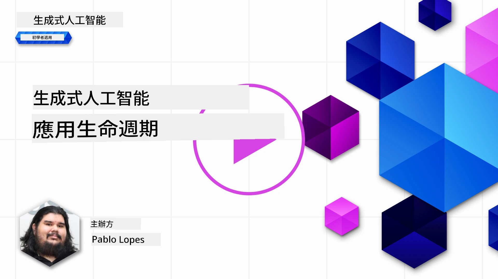
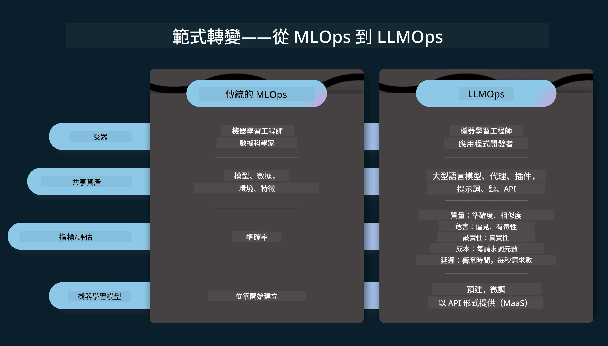
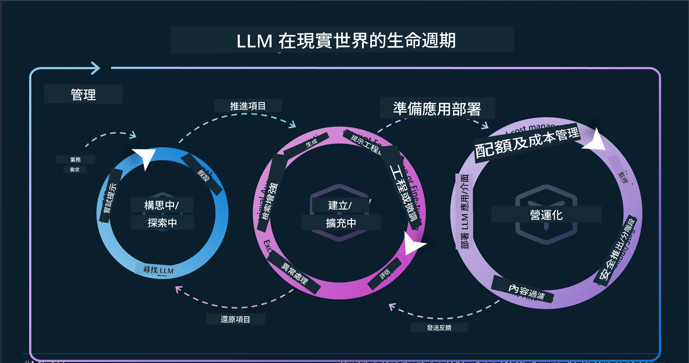
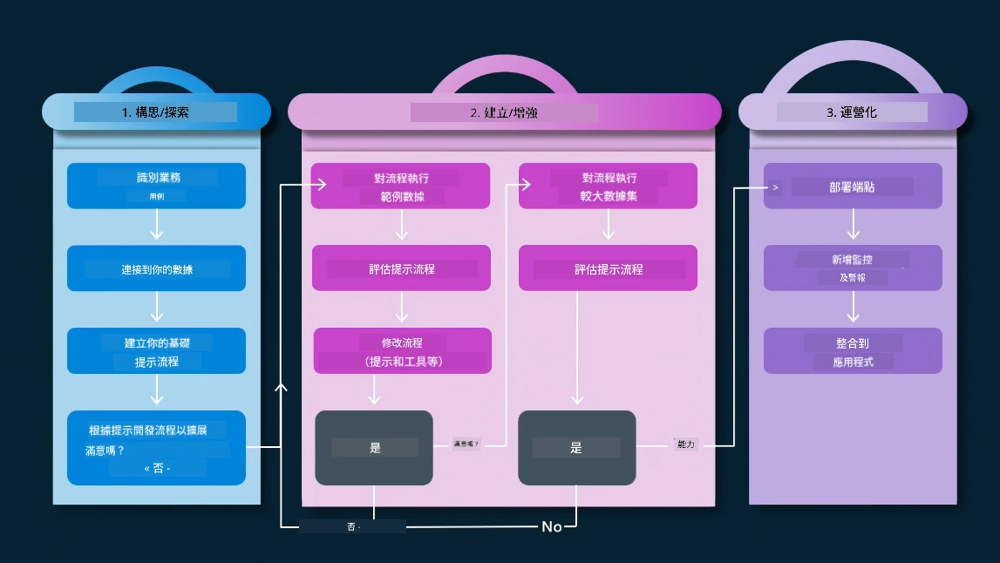
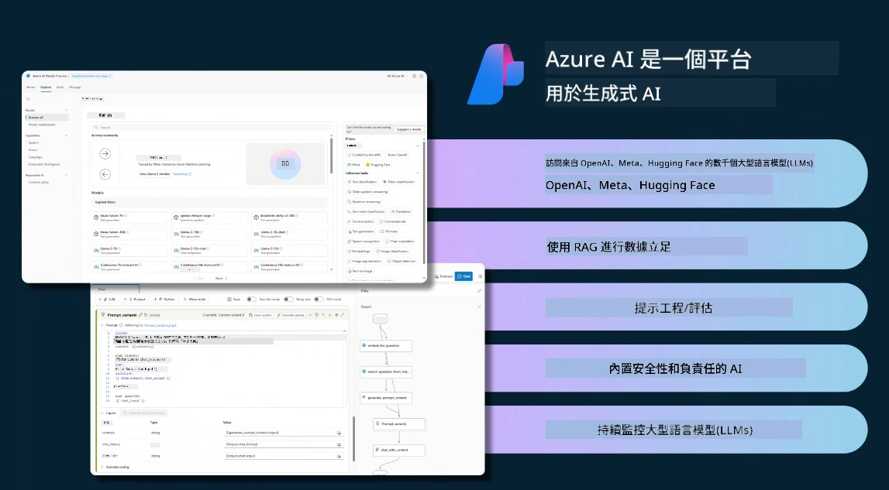
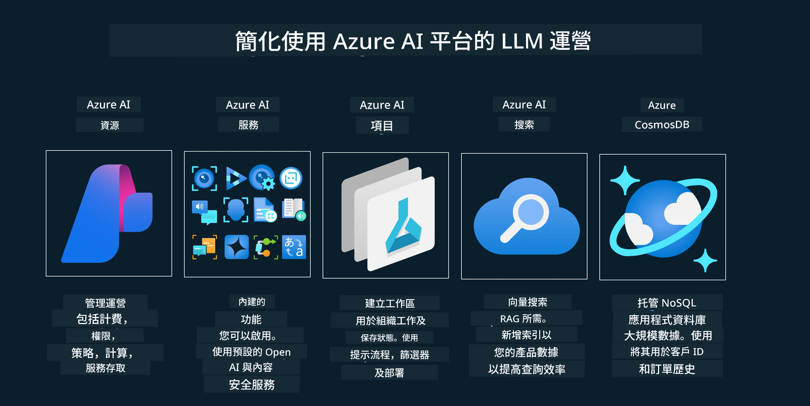
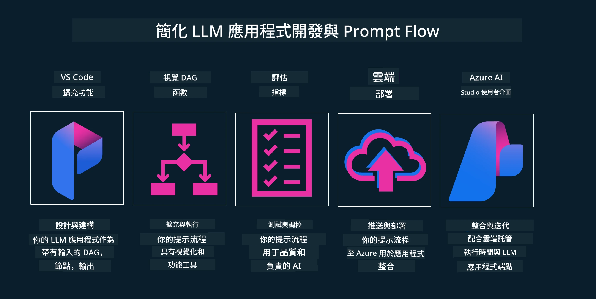

# 生成式 AI 應用程式生命週期

所有 AI 應用程式的一個重要問題是 AI 功能的相關性，由於 AI 是一個快速演進的領域，為確保您的應用程式保持相關、可靠且強健，您需要持續監控、評估並改進它。這就是生成式 AI 生命週期的用處。

生成式 AI 生命週期是一個指引您開發、部署及維護生成式 AI 應用程式階段的框架。它幫助您定義目標、衡量績效、識別挑戰及實施解決方案。它亦幫助您將應用程式與您領域及利益相關者的倫理和法律標準對齊。透過遵循生成式 AI 生命週期，您可以確保您的應用程式不斷帶來價值並滿足用戶需求。

## 介紹

在本章節中，您將會：

- 理解從 MLOps 到 LLMOps 的範式轉變
- LLM 生命週期
- 生命週期工具
- 生命週期指標化與評估

## 理解從 MLOps 到 LLMOps 的範式轉變

LLM 是人工智能武器庫中新興的工具，它們在分析和生成任務中對應用程式非常強大，但這種強大也對我們簡化 AI 與經典機器學習任務的方式帶來影響。

因此，我們需要一個新的範式，以正確的激勵動態地適應這項工具。我們可以將舊的 AI 應用程式歸類為「ML 應用程式」，而新的 AI 應用則稱為「生成式 AI 應用」或簡稱「AI 應用」，反映當時主流技術和方法。這在多方面改變了我們的敘述，請參考以下比較。

請注意，在 LLMOps 中，我們更關注應用程式開發者，將整合作為關鍵點，使用「模型即服務」並考慮以下指標：

- 品質：回應品質
- 風險：負責任的 AI
- 誠實性：回應依據（合理嗎？正確嗎？）
- 成本：解決方案預算
- 延遲：平均回應時間（以 token 計）

## LLM 生命週期

首先，為了了解生命週期及修改內容，請參考以下資訊圖。

如您所見，這與傳統的 MLOps 生命週期有所不同。LLM 有許多新需求，如提示設計（Prompting）、提升品質的不同技術（微調 Fine-Tuning、檢索增強生成 RAG、元提示 Meta-Prompts）、負責任 AI 的不同評估方式，以及全新評估指標（品質、風險、誠實性、成本與延遲）。

例如，看看我們是如何構思的。利用提示工程對各種 LLM 進行嘗試，以探索可能性，測試假設是否正確。

請注意這不是線性的流程，而是整合的循環，迭代且涵蓋整體循環。

我們如何探討這些步驟？讓我們深入了解如何建立生命週期。

這看起來有點複雜，我們先專注於三個主要步驟。

1. 構思/探索：探索，根據商業需求進行探索。快速原型開發，建立 [PromptFlow](https://microsoft.github.io/promptflow/index.html?WT.mc_id=academic-105485-koreyst) 並測試假設是否有效。
1. 建構/擴充：實作，現在開始評估較大型資料集，實施技術，如微調與 RAG，以檢視解決方案的強健性。如不理想，重新實作、加入流程步驟或重組資料可能有幫助。測試流程與規模後，確認運作正常且指標良好，準備進入下一步。
1. 運營化：整合，加入監控與警報系統，系統部署並與應用整合。

接著，還有管理的整體循環，專注於安全性、合規及治理。

恭喜，您的 AI 應用程式已準備好運行。想親身體驗，請查看 [Contoso Chat Demo.](https://nitya.github.io/contoso-chat/?WT.mc_id=academic-105485-koreyst)

那麼，我們可以使用什麼工具？

## 生命週期工具

在工具方面，微軟提供了 [Azure AI 平台](https://azure.microsoft.com/solutions/ai/?WT.mc_id=academic-105485-koreyst) 與 [PromptFlow](https://microsoft.github.io/promptflow/index.html?WT.mc_id=academic-105485-koreyst)，方便且輕鬆地實作生命週期。

[Azure AI 平台](https://azure.microsoft.com/solutions/ai/?WT.mc_id=academic-105485-koreyst) 允許您使用 [AI Studio](https://ai.azure.com/?WT.mc_id=academic-105485-koreyst)。AI Studio 是一個網頁入口，讓您探索模型、範例和工具。管理資源、UI 開發流程，以及 SDK/CLI 選項以進行代碼優先開發。

Azure AI 允許您使用多種資源，管理您的作業、服務、專案、向量搜尋和資料庫需求。

從概念驗證（Proof-of-Concept，POC）至大規模應用程式，使用 PromptFlow：

- 從 VS Code 設計與建構應用程式，具視覺化及功能性工具
- 輕鬆測試與微調您的應用，確保 AI 品質
- 使用 Azure AI Studio 與雲端整合並迭代，快速推送與部署

## 太好了！繼續學習吧！

很棒，現在請進一步了解我們如何構建應用程式，並利用 [Contoso Chat App](https://nitya.github.io/contoso-chat/?WT.mc_id=academic-105485-koreyst) 實踐這些概念，觀察雲端推廣如何在示範中加入這些概念。更多內容，請查看我們的 [Ignite 主題演講!](https://www.youtube.com/watch?v=DdOylyrTOWg)

接著，查看第 15 課，了解 [檢索增強生成與向量資料庫](../15-rag-and-vector-databases/README.md?WT.mc_id=academic-105485-koreyst) 如何影響生成式 AI 並開發更具吸引力的應用程式！

---

<!-- CO-OP TRANSLATOR DISCLAIMER START -->
**免責聲明**：
本文件由人工智能翻譯服務 [Co-op Translator](https://github.com/Azure/co-op-translator) 處理翻譯。我們致力於確保準確性，但請注意，自動翻譯可能存在錯誤或不準確之處。原始語言文件應被視為權威來源。對於重要資訊，建議聘請專業人工翻譯。本公司不對因使用此翻譯而引起的任何誤解或曲解承擔責任。
<!-- CO-OP TRANSLATOR DISCLAIMER END -->