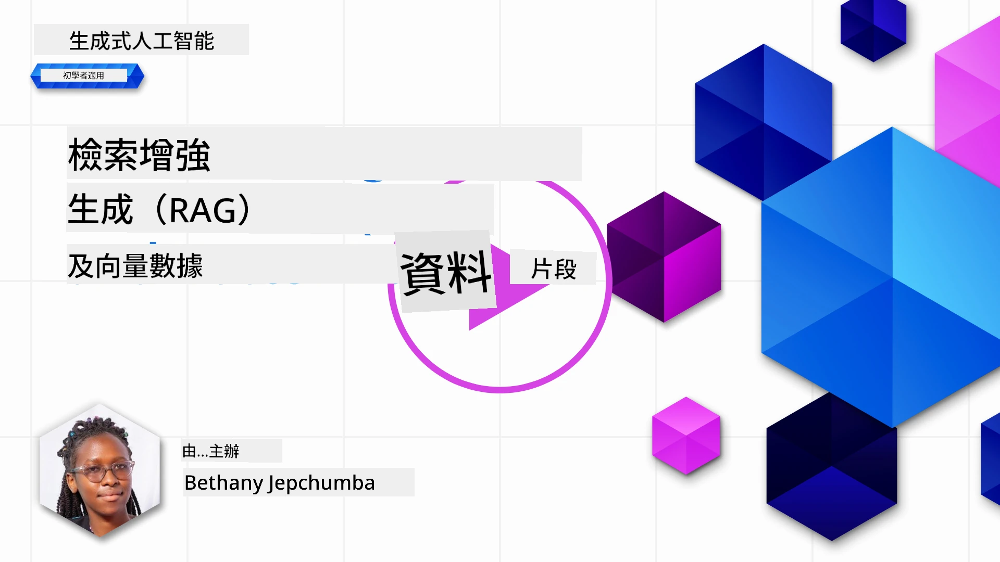
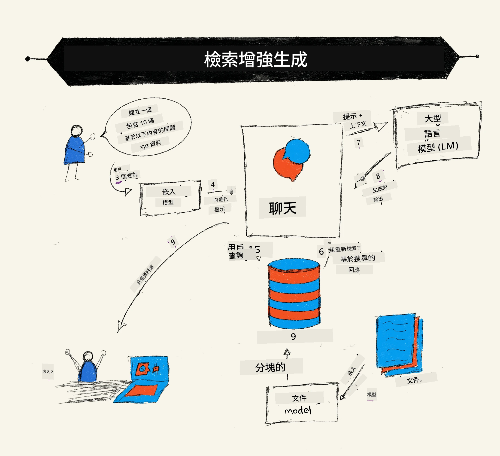
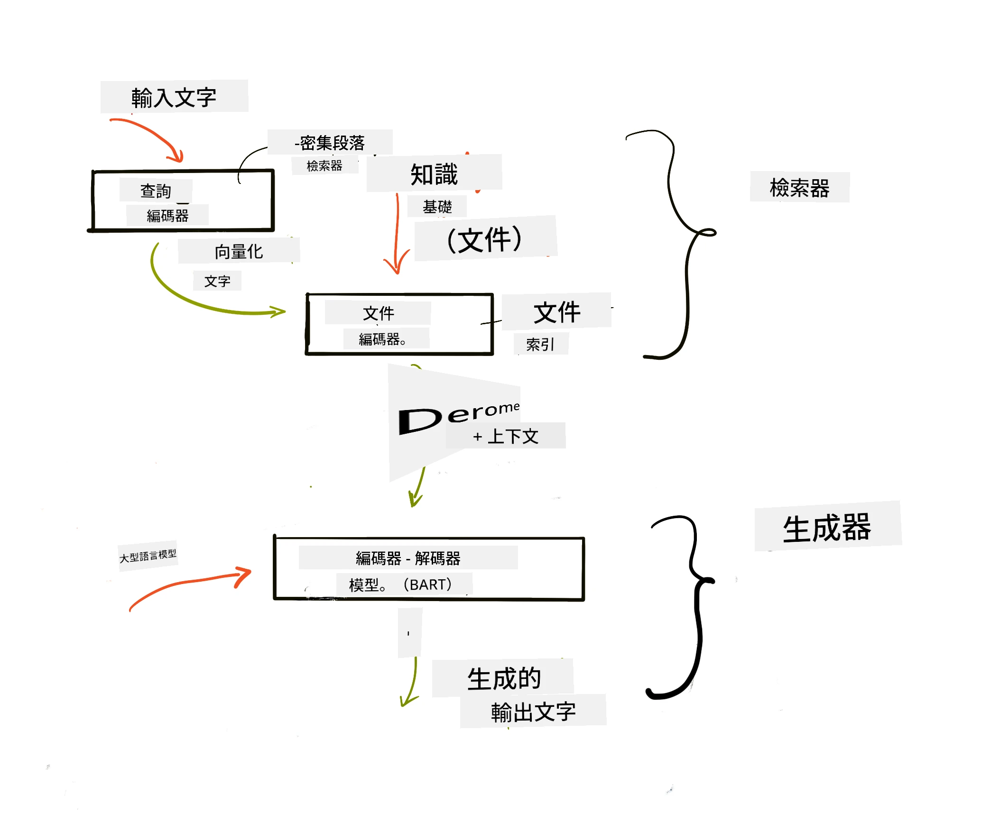
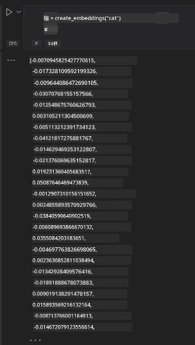

# 檢索增強生成 (RAG) 與向量數據庫

[](https://youtu.be/4l8zhHUBeyI?si=BmvDmL1fnHtgQYkL)

在搜尋應用課程中，我們簡要學習了如何將您自己的數據整合到大型語言模型（LLM）中。在本課程中，我們將深入探討在 LLM 應用中基於您的數據（grounding）的概念、過程機制以及存儲數據的方法，包括嵌入向量和文本。

> <strong>影片即將推出</strong>

## 介紹

在本課程中，我們將涵蓋以下內容：

- RAG 的介紹，它是什麼以及為何在人工智能 (AI) 中使用它。

- 了解向量數據庫的概念並為我們的應用創建一個。

- 關於如何將 RAG 集成到應用中的實用示例。

## 學習目標

完成本課程後，您將能夠：

- 說明 RAG 在數據檢索與處理中的重要性。

- 設置 RAG 應用並將您的數據基於到 LLM 中。

- 在 LLM 應用中有效整合 RAG 與向量數據庫。

## 我們的場景：用我們自己的數據強化 LLM

本課程中，我們希望將自己的筆記添加到教育創業項目，讓聊天機器人能夠獲取各科更多資訊。利用我們的筆記，學習者將能更好地學習並理解不同主題，從而更輕鬆地複習考試。為了建立場景，我們將使用：

- `Azure OpenAI:` 我們用於建立聊天機器人的 LLM

- `新手入門AI神經網絡課程`：我們將以此作為 LLM 的數據基礎

- `Azure AI Search` 和 `Azure Cosmos DB:` 用於存儲數據並建立搜尋索引的向量數據庫

用戶將能從筆記中創建練習測驗、複習抽認卡並總結成簡明概覽。首先來看看 RAG 是什麼以及它如何運作：

## 檢索增強生成 (RAG)

由 LLM 驅動的聊天機器人會處理用戶提示以生成回應。它被設計為互動式，能與用戶就各種主題交流。然而，其回答受限於提供的上下文和其基礎訓練資料。例如，GPT-4 的知識截止於 2021 年 9 月，意即它缺乏此後發生事件的知識。此外，訓練 LLM 的數據不包括機密資訊，例如個人筆記或公司產品手冊。

### RAG（檢索增強生成）的運作原理



假設您想部署一個能根據您的筆記創建測驗的聊天機器人，您需要連接到知識庫。這就是 RAG 發揮作用之處。RAG 的運作流程如下：

- **知識庫：** 在檢索前，這些文檔需進行攝取與預處理，通常是將大型文檔拆分成較小的段落，轉換為文本嵌入，並存儲於數據庫中。

- **用戶查詢：** 用戶提出問題

- **檢索：** 用戶發問時，嵌入模型從知識庫提取相關資訊，提供更多上下文，這些上下文會被納入提示中。

- **增強生成：** LLM 根據檢索到的數據加強回應，使生成的答案不僅基於預訓練數據，也結合了新增的相關上下文。LLM 接著回覆用戶的問題。



RAG 架構使用 transformer，包含兩部分：編碼器與解碼器。舉例來說，用戶提問時，輸入文本會被「編碼」成捕捉詞義的向量，然後向量被「解碼」到我們的文檔索引，並根據用戶查詢生成新文本。LLM 同時使用編碼器-解碼器模型來生成輸出。

根據論文 [Retrieval-Augmented Generation for Knowledge intensive NLP (natural language processing software) Tasks](https://arxiv.org/pdf/2005.11401.pdf?WT.mc_id=academic-105485-koreyst)，實現 RAG 有兩種方法：

- **_RAG-Sequence_**：使用檢索的文檔預測用戶查詢的最佳答案

- **RAG-Token**：使用文檔生成下一個字元，然後檢索回應用戶查詢

### 為何使用 RAG？

- **資訊豐富性：** 確保文字回答是最新且符合現狀，從而提升在特定領域任務上的表現，透過存取內部知識庫。

- 利用知識庫中的 <strong>可驗證數據</strong> 提供上下文，減少捏造資訊的可能。

- 與微調 LLM 相比，它們的成本更低，故為 <strong>成本效益</strong> 之選。

## 建立知識庫

我們的應用基於我們的個人數據，即新手入門 AI 神經網絡課程中的內容。

### 向量數據庫

向量數據庫與傳統數據庫不同，它是一種專門用於存儲、管理與搜索嵌入向量的數據庫。它存放文檔的數值表示。將數據拆解為數值嵌入向量使 AI 系統更易理解與處理數據。

我們將嵌入存儲在向量數據庫中，因為 LLM 對輸入的標記數量有限制。由於無法將整個嵌入直接傳入 LLM，我們需要將其分段，當用戶提問時，最相似的嵌入及提示一起返回。分段也可降低通過 LLM 傳遞標記數造成的成本。

一些熱門的向量數據庫包括 Azure Cosmos DB、Clarifyai、Pinecone、Chromadb、ScaNN、Qdrant 和 DeepLake。您可以使用 Azure CLI 創建 Azure Cosmos DB 模型，命令如下：

```bash
az login
az group create -n <resource-group-name> -l <location>
az cosmosdb create -n <cosmos-db-name> -r <resource-group-name>
az cosmosdb list-keys -n <cosmos-db-name> -g <resource-group-name>
```

### 從文本到嵌入向量

在儲存數據之前，我們需要將其轉換成向量嵌入。若您處理的是大型文檔或長文本，可根據預期查詢拆分為多段。可在句子級別或段落級別進行分段。由於分段依賴周圍詞彙的意義，您可以為分段添加上下文，例如加入文檔標題或包含分段前後的部分文本。分段方法範例如下：

```python
def split_text(text, max_length, min_length):
    words = text.split()
    chunks = []
    current_chunk = []

    for word in words:
        current_chunk.append(word)
        if len(' '.join(current_chunk)) < max_length and len(' '.join(current_chunk)) > min_length:
            chunks.append(' '.join(current_chunk))
            current_chunk = []

    # 如果最後一塊未達到最小長度，也要加入
    if current_chunk:
        chunks.append(' '.join(current_chunk))

    return chunks
```

分段後，我們可以使用不同的嵌入模型將文本嵌入。一些可用模型包括 word2vec、OpenAI 的 ada-002、Azure Computer Vision 等。選擇模型取決於您使用的語言、編碼的內容類型（文本/圖像/音頻）、可編碼的輸入大小及嵌入輸出的長度。

使用 OpenAI 的 `text-embedding-ada-002` 模型嵌入文本的示例如下：


## 檢索與向量搜索

用戶提問時，檢索器利用查詢編碼器將其轉為向量，接著在文檔搜尋索引中查找與輸入相關的向量。一旦找到，它會將輸入向量和文檔向量轉換成文本，再傳給 LLM。

### 檢索

檢索指系統試圖快速找到符合搜索條件的文檔。檢索器的目標是取得用於為 LLM 提供上下文及數據基礎的文檔。

在數據庫內執行搜索有多種方式，例如：

- <strong>關鍵字搜索</strong> - 用於文本查詢

- <strong>向量搜索</strong> - 使用嵌入模型將文本轉換為向量表示，允許進行基於詞義的 <strong>語義搜索</strong>。透過查詢與用戶問題向量最接近的向量所對應文檔進行檢索。

- <strong>混合搜索</strong> - 將關鍵字搜索與向量搜索結合。

檢索的挑戰是當數據庫中無與查詢相似的回應，系統會返回最佳資訊；您可設置最大相關距離或使用結合關鍵字和向量的混合搜索。本課程將採用混合搜索，並將數據存入包含分段和嵌入向量的資料框。

### 向量相似度

檢索器會在知識庫中尋找相近的嵌入，即最接近的鄰居，因為文字相似。在情境中，用戶先將查詢嵌入，再配對相似的嵌入。最常用的相似度衡量是基於兩向量間夾角的餘弦相似度。

其他相似度衡量可用歐氏距離（向量端點間的直線距離）和點積（對應元素積的和）。

### 搜索索引

檢索前需為知識庫建立搜索索引。索引儲存嵌入向量，即便數據庫龐大也能迅速檢索最相似的分段。我們可以使用以下方式在本地建立索引：

```python
from sklearn.neighbors import NearestNeighbors

embeddings = flattened_df['embeddings'].to_list()

# 建立搜尋索引
nbrs = NearestNeighbors(n_neighbors=5, algorithm='ball_tree').fit(embeddings)

# 如要查詢索引，你可以使用 kneighbors 方法
distances, indices = nbrs.kneighbors(embeddings)
```

### 重新排序

查詢數據庫後，您可能需要將結果按相關性排序。重新排序 LLM 利用機器學習改善結果的相關性，從而將它們按最相關排序。使用 Azure AI Search，重新排序會自動由語義重排器完成。以下是使用最近鄰進行重新排序的示例：

```python
# 尋找最相似的文件
distances, indices = nbrs.kneighbors([query_vector])

index = []
# 輸出最相似的文件
for i in range(3):
    index = indices[0][i]
    for index in indices[0]:
        print(flattened_df['chunks'].iloc[index])
        print(flattened_df['path'].iloc[index])
        print(flattened_df['distances'].iloc[index])
    else:
        print(f"Index {index} not found in DataFrame")
```

## 整合實現

最後一步是將 LLM 加入流程，使回應能基於我們的數據。實現方法如下：

```python
user_input = "what is a perceptron?"

def chatbot(user_input):
    # 將問題轉換為查詢向量
    query_vector = create_embeddings(user_input)

    # 找出最相似的文件
    distances, indices = nbrs.kneighbors([query_vector])

    # 將文件加入查詢以提供上下文
    history = []
    for index in indices[0]:
        history.append(flattened_df['chunks'].iloc[index])

    # 結合歷史記錄和用戶輸入
    history.append(user_input)

    # 建立訊息物件
    messages=[
        {"role": "system", "content": "You are an AI assistant that helps with AI questions."},
        {"role": "user", "content": "\n\n".join(history) }
    ]

    # 使用回應 API 來產生回覆
    response = client.responses.create(
        model="gpt-5-mini",
        max_output_tokens=800,
        input=messages,
        store=False,
    )

    return response.output_text

chatbot(user_input)
```

## 評估應用

### 評估指標

- 回應質量：確保回答聽起來自然、流暢且具有人類風格

- 數據基礎性：評估回答是否來自提供的文檔

- 相關性：評估回答是否符合並關聯提問內容

- 流利度：回答是否在語法上合理

## RAG（檢索增強生成）與向量數據庫的使用場景

多種使用場景中，函數呼叫能提升您的應用，比如：

- 問答系統：將公司數據基礎與聊天機器人連結，讓員工可提問。

- 推薦系統：創建可匹配相似值的系統，如電影、餐廳等。

- 聊天機器人服務：存儲聊天記錄並基於用戶數據個性化對話。

- 基於向量嵌入的圖片搜尋，有助於圖像識別和異常檢測。

## 總結

我們涵蓋了 RAG 的基本領域，從將數據添加至應用、用戶查詢到輸出。為簡化 RAG 的創建，您可以使用 Semanti Kernel、Langchain 或 Autogen 等框架。

## 作業

若要繼續學習檢索增強生成 (RAG)，您可以構建：

- 使用任意選擇的框架建立應用前端

- 採用 LangChain 或 Semantic Kernel 框架，重新創建您的應用。

恭喜您完成本課程 👏。

## 學習不止於此，繼續前行

完成本課程後，請查看我們的[生成式 AI 學習系列](https://aka.ms/genai-collection?WT.mc_id=academic-105485-koreyst)，持續提升您對生成式 AI 的認識！

---

<!-- CO-OP TRANSLATOR DISCLAIMER START -->
**免責聲明**：
本文件由 AI 翻譯服務 [Co-op Translator](https://github.com/Azure/co-op-translator) 翻譯而成。雖然我們致力於確保準確性，但請注意，機器自動翻譯可能包含錯誤或不準確之處。原始文件的母語版本應被視為權威來源。對於重要資訊，建議進行專業人工翻譯。我們不對因使用本翻譯而產生的任何誤解或誤釋承擔責任。
<!-- CO-OP TRANSLATOR DISCLAIMER END -->