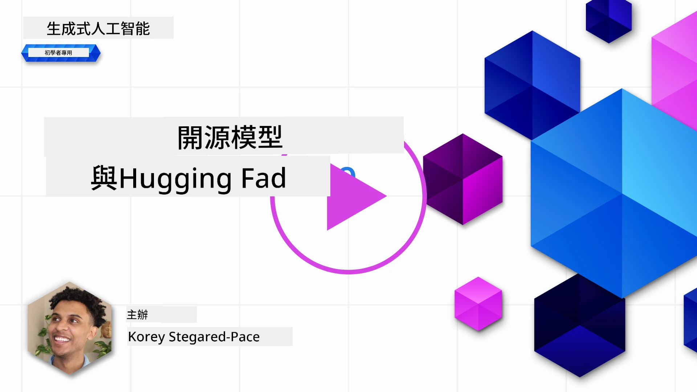
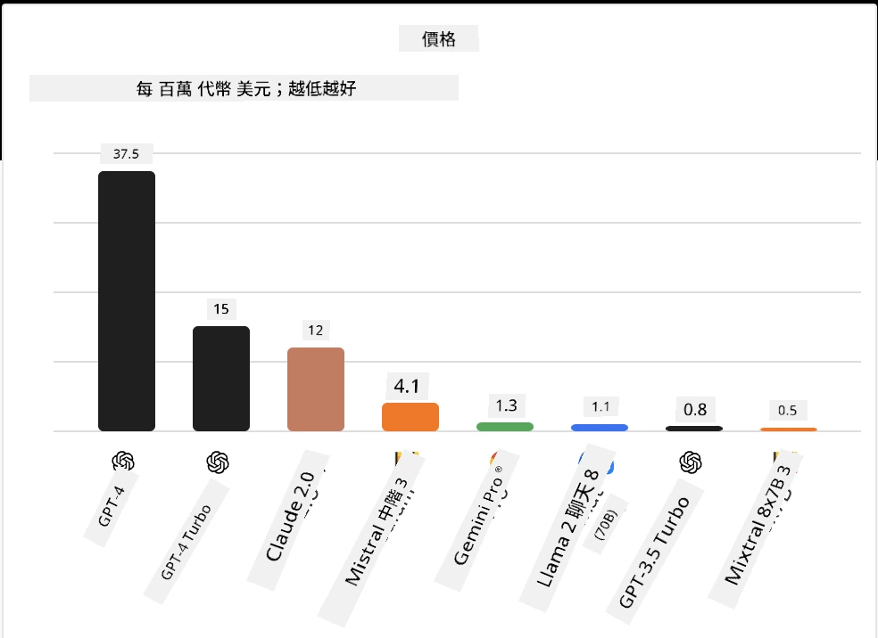
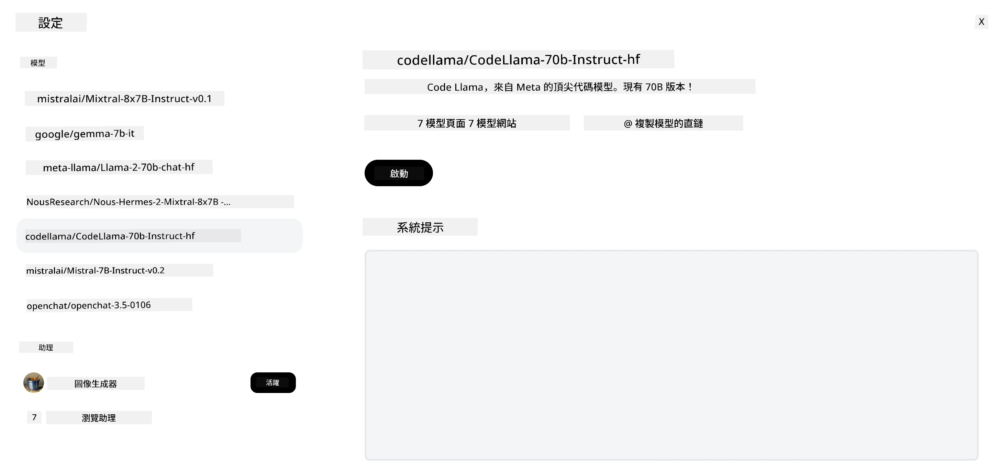
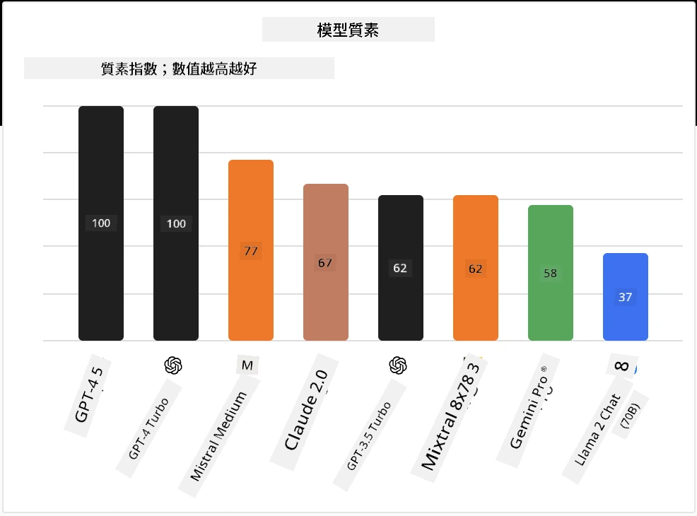

## 介紹

開源大型語言模型（LLMs）的世界既令人振奮又不斷演變。本課程旨在深入探討開源模型。如果您想了解專有模型與開源模型的比較，請參閱「[探索與比較不同的LLMs](../02-exploring-and-comparing-different-llms/README.md?WT.mc_id=academic-105485-koreyst)」課程。本課程也會涵蓋微調主題，但更詳細的說明請參見「[微調LLMs](../18-fine-tuning/README.md?WT.mc_id=academic-105485-koreyst)」課程。

## 學習目標

- 了解開源模型
- 理解使用開源模型的優勢
- 探索Hugging Face和Microsoft Foundry模型目錄上的開源模型

## 什麼是開源模型？

開源軟件在各領域科技成長中扮演了關鍵角色。開源倡議組織（Open Source Initiative，OSI）定義了[10項軟件標準](https://web.archive.org/web/20241126001143/https://opensource.org/osd?WT.mc_id=academic-105485-koreyst)，以便軟件能被歸類為開源。源代碼必須在OSI批准的許可證下公開分享。

雖然大型語言模型的開發與軟件開發有相似元素，但流程並不完全相同。這引發社群對於LLMs中開源定義的廣泛討論。要符合傳統開源定義，模型應公開以下資訊：

- 用於訓練模型的數據集。
- 包含在訓練中的完整模型權重。
- 評估代碼。
- 微調代碼。
- 完整的模型權重和訓練指標。

目前只有少數模型符合這些標準。[Allen Institute for Artificial Intelligence（AllenAI）開發的OLMo模型](https://huggingface.co/allenai/OLMo-7B?WT.mc_id=academic-105485-koreyst)即是其中之一。

在本課程中，我們將稱這些模型為「開放模型」，因為它們在撰寫時可能尚未完全符合上述標準。

## 開放模型的優點

<strong>高度可定制</strong> — 由於開放模型附帶詳細的訓練資訊，研究人員和開發者可以修改模型內部結構。這允許創建針對特定任務或研究領域微調的高度專門化模型。例如程式碼生成、數學運算和生物學。

<strong>成本</strong> — 使用及部署這些模型的每個字元成本低於專有模型。在構建生成式AI應用時，應根據效能與價格來評估這些模型在您使用案例中的表現。

來源：Artificial Analysis

<strong>靈活性</strong> — 使用開放模型讓您在選擇不同模型或結合使用時更具彈性。例如[HuggingChat 助手](https://huggingface.co/chat?WT.mc_id=academic-105485-koreyst)允許用戶直接在介面中選擇使用的模型：

## 探索不同的開放模型

### Llama 2

[Llama 2](https://huggingface.co/meta-llama?WT.mc_id=academic-105485-koreyst)由Meta開發，是為聊天應用優化的開放模型。這得益於其微調方法，涵蓋大量對話和人類反饋。透過此方法，模型產出更符合人類期望的結果，提供更佳的用戶體驗。

Llama的微調版本範例包括專注於日語的[Japanese Llama](https://huggingface.co/elyza/ELYZA-japanese-Llama-2-7b?WT.mc_id=academic-105485-koreyst)以及基礎模型的增強版[Llama Pro](https://huggingface.co/TencentARC/LLaMA-Pro-8B?WT.mc_id=academic-105485-koreyst)。

### Mistral

[Mistral](https://huggingface.co/mistralai?WT.mc_id=academic-105485-koreyst)是一款強調高效能和高效率的開放模型。它採用Mixture-of-Experts方法，將多個專門模型整合成一個系統，根據輸入選擇特定模型使用。此方案讓計算更有效率，因為模型只處理自己專長的輸入。

Mistral的微調版本範例包括專注醫療領域的[BioMistral](https://huggingface.co/BioMistral/BioMistral-7B?text=Mon+nom+est+Thomas+et+mon+principal?WT.mc_id=academic-105485-koreyst)和執行數學運算的[OpenMath Mistral](https://huggingface.co/nvidia/OpenMath-Mistral-7B-v0.1-hf?WT.mc_id=academic-105485-koreyst)。

### Falcon

[Falcon](https://huggingface.co/tiiuae?WT.mc_id=academic-105485-koreyst)是由科技創新研究院（Technology Innovation Institute，**TII**）開發的LLM。Falcon-40B訓練於400億參數，展現出比GPT-3在較低計算預算下更佳的效能。這歸功於其使用FlashAttention演算法和多查詢注意力機制，減少推論時記憶體需求。因推論時間縮短，Falcon-40B適合聊天應用。

Falcon的微調版本示例包括基於開放模型的[OpenAssistant](https://huggingface.co/OpenAssistant/falcon-40b-sft-top1-560?WT.mc_id=academic-105485-koreyst)助理，以及性能高於基礎模型的[GPT4ALL](https://huggingface.co/nomic-ai/gpt4all-falcon?WT.mc_id=academic-105485-koreyst)。

## 如何選擇

選擇開放模型沒有唯一答案。建議從Microsoft Foundry模型目錄使用「依任務篩選」功能開始。這有助於了解模型受訓練的任務類型。Hugging Face也維護有LLM排行榜，根據特定指標展示最佳表現模型。

若要比較不同類型的LLMs，[Artificial Analysis](https://artificialanalysis.ai/?WT.mc_id=academic-105485-koreyst)是很好的資源：

來源：Artificial Analysis

若針對特定使用案例，可尋找專注相同領域的微調版本，這樣更有效率。嘗試多個開放模型以評估它們是否符合您和用戶的期望，也是良好做法。

## 下一步

開放模型最棒之處是可以快速開始使用。請參閱[Microsoft Foundry模型目錄](https://ai.azure.com?WT.mc_id=academic-105485-koreyst)，其中包含了本課程討論的Hugging Face專用合集。

## 學習不止於此，繼續您的旅程

完成本課程後，請繼續參閱我們的[生成式AI學習合集](https://aka.ms/genai-collection?WT.mc_id=academic-105485-koreyst)以持續提升生成式AI知識！

---

<!-- CO-OP TRANSLATOR DISCLAIMER START -->
**免責聲明**：
本文件由 AI 翻譯服務 [Co-op Translator](https://github.com/Azure/co-op-translator) 翻譯而成。雖然我們致力於確保準確性，但請注意，機器自動翻譯可能包含錯誤或不準確之處。原始文件的母語版本應被視為權威來源。對於重要資訊，建議進行專業人工翻譯。我們不對因使用本翻譯而產生的任何誤解或誤釋承擔責任。
<!-- CO-OP TRANSLATOR DISCLAIMER END -->