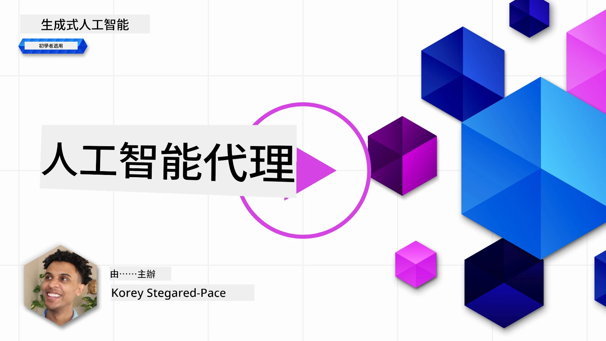
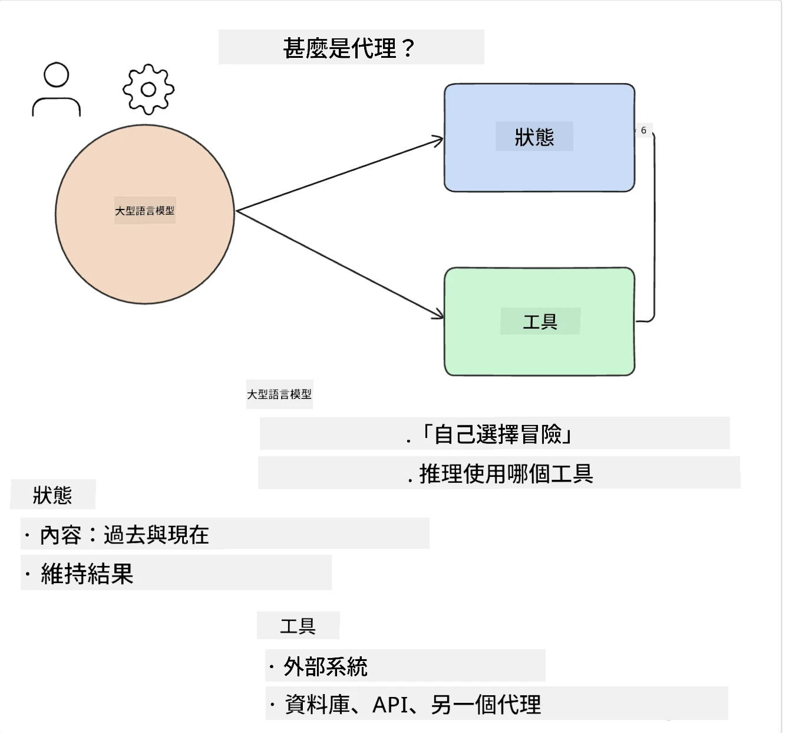
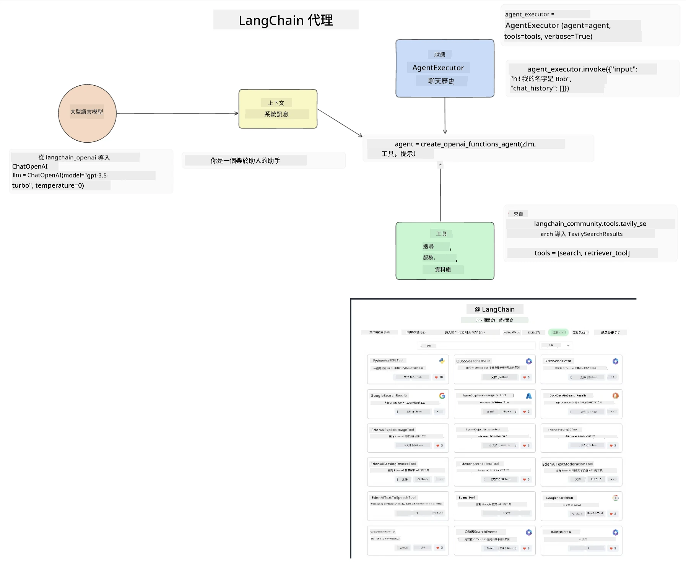
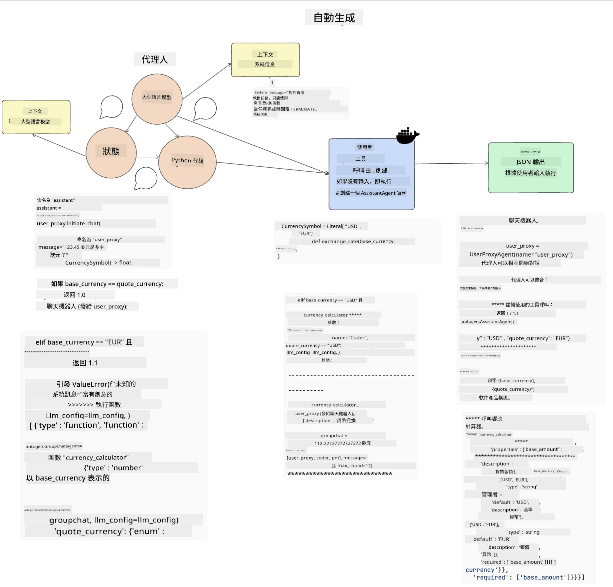
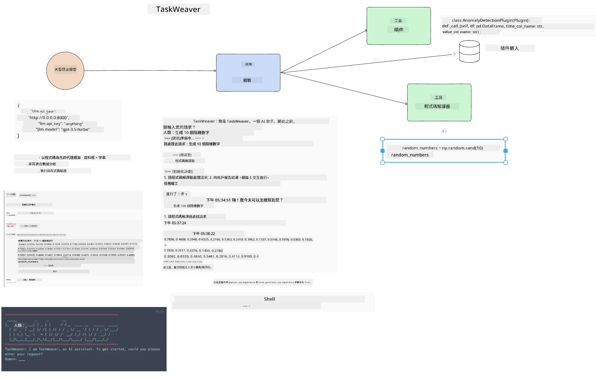
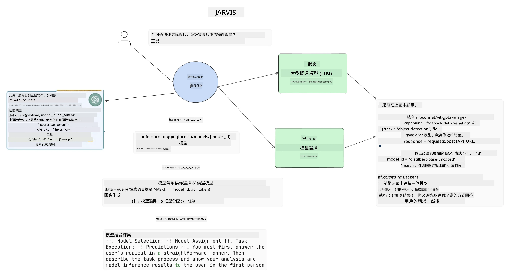

[](https://youtu.be/yAXVW-lUINc?si=bOtW9nL6jc3XJgOM)

## 介紹

AI Agents 代表了生成式 AI 的一個令人興奮的發展，使大型語言模型（LLMs）從助理進化為能夠採取行動的代理。AI 代理框架使開發者能夠創建應用程式，讓 LLMs 可以存取工具及狀態管理。這些框架亦增強了可視性，讓用戶及開發者可以監控 LLMs 所計劃的行動，從而改善體驗管理。

本課程將涵蓋以下範疇：

- 了解什麼是 AI 代理 — AI 代理到底是什麼？
- 探索四種不同的 AI 代理框架 — 它們有什麼獨特之處？
- 將這些 AI 代理應用於不同的使用場景 — 甚麼時候應使用 AI 代理？

## 學習目標

完成本課程後，你將能夠：

- 解釋 AI 代理是什麼，以及如何使用它們。
- 理解一些流行 AI 代理框架之間的差異及其不同之處。
- 理解 AI 代理如何運作，從而構建相應的應用程式。

## 什麼是 AI 代理？

AI 代理是生成式 AI 領域中非常令人興奮的部分。這份興奮有時會帶來術語及應用上的混淆。為了保持簡潔且包容大部分自稱 AI 代理的工具，我們會使用以下定義：

AI 代理允許大型語言模型（LLMs）執行任務，方法是給它們存取**狀態**和**工具**的權限。



讓我們定義這些術語：

**大型語言模型** — 指本課程中提到的模型，如 GPT-3.5、GPT-4、Llama-2 等。

**狀態** — 指 LLM 工作中所處的上下文。LLM 利用過往行動和當前上下文的資訊來指導其後續行動的決策。AI 代理框架使開發者更容易維護這個上下文。

**工具** — 為了完成使用者所請求且 LLM 所規劃的任務，LLM 需要存取工具。工具的例子包括資料庫、API、外部應用程式甚至是另一個 LLM！

這些定義希望能讓你對後續的實現有所基礎。讓我們來探索幾個不同的 AI 代理框架：

## LangChain Agents

[LangChain Agents](https://python.langchain.com/docs/how_to/#agents?WT.mc_id=academic-105485-koreyst) 是對上述定義的具體實作。

它使用內建函式 `AgentExecutor` 來管理 **狀態**。此函式接受定義好的 `agent` 和可用的 `tools`。

`AgentExecutor` 亦會儲存聊天歷史，提供對話上下文。



LangChain 提供了一個[工具目錄](https://integrations.langchain.com/tools?WT.mc_id=academic-105485-koreyst)，可以導入到你的應用程式中供 LLM 存取。這些工具由社區和 LangChain 團隊製作。

你可以定義這些工具並將它們傳遞給 `AgentExecutor`。

可視化是討論 AI 代理時另一重要面向。應用開發者需要了解 LLM 正在使用哪個工具及原因。為此，LangChain 團隊開發了 LangSmith。

## AutoGen

下一個我們將討論的 AI 代理框架是 [AutoGen](https://microsoft.github.io/autogen/?WT.mc_id=academic-105485-koreyst)。AutoGen 主要聚焦於對話。代理既是**可對話的**也是**可自定義的**。

**可對話的** — LLMs 可以與另一個 LLM 啟動及持續對話以完成任務。這通過創建 `AssistantAgents` 並賦予他們具體的系統訊息來實現。

```python

autogen.AssistantAgent( name="Coder", llm_config=llm_config, ) pm = autogen.AssistantAgent( name="Product_manager", system_message="Creative in software product ideas.", llm_config=llm_config, )

```

**可自定義的** — 代理不僅可以定義為 LLM，也可以是用戶或工具。作為開發者，你可以定義 `UserProxyAgent`，負責與用戶互動並收集完成任務的反饋。這些反饋可以繼續執行任務或終止它。

```python
user_proxy = UserProxyAgent(name="user_proxy")
```

### 狀態與工具

要更改和管理狀態，助理代理會生成 Python 代碼以完成任務。

以下是一個流程範例：



#### 使用系統訊息定義的 LLM

```python
system_message="For weather related tasks, only use the functions you have been provided with. Reply TERMINATE when the task is done."
```

這段系統訊息會指示此特定 LLM 哪些函數與其任務相關。記得，AutoGen 可以定義多個具有不同系統訊息的 AssistantAgents。

#### 對話由用戶啟動

```python
user_proxy.initiate_chat( chatbot, message="I am planning a trip to NYC next week, can you help me pick out what to wear? ", )

```

這條來自 user_proxy（人類）的訊息會啟動代理探索它應該執行之函數的過程。

#### 執行函數

```bash
chatbot (to user_proxy):

***** Suggested tool Call: get_weather ***** Arguments: {"location":"New York City, NY","time_periond:"7","temperature_unit":"Celsius"} ******************************************************** --------------------------------------------------------------------------------

>>>>>>>> EXECUTING FUNCTION get_weather... user_proxy (to chatbot): ***** Response from calling function "get_weather" ***** 112.22727272727272 EUR ****************************************************************

```

初始對話處理完後，代理會送出建議呼叫的工具，這裡是一個名為 `get_weather` 的函式。根據你的配置，此函式可自動執行並由代理讀取，或根據用戶輸入執行。

你可以參考[AutoGen 代碼示例](https://microsoft.github.io/autogen/docs/Examples/?WT.mc_id=academic-105485-koreyst)來進一步了解如何開始構建。

## Taskweaver

接著我們要探索的代理框架是 [Taskweaver](https://microsoft.github.io/TaskWeaver/?WT.mc_id=academic-105485-koreyst)。它被稱為「以代碼為先」的代理，因為它不僅操作 `string`，還能處理 Python 中的 DataFrames。在資料分析和生產任務中非常有用，比如創建圖表或產生隨機數。

### 狀態與工具

為了管理對話狀態，TaskWeaver 採用 `Planner` 的概念。`Planner` 是一個 LLM，負責接收用戶請求並規劃完成該請求所需的任務。

為完成這些任務，`Planner` 可使用稱為 `Plugins` 的工具集合。這些插件可以是 Python 類別或一般的程式碼解譯器。這些插件會被存成詞嵌入（embedding），讓 LLM 更容易搜尋合適的插件。



以下是一個用於異常檢測的插件範例：

```python
class AnomalyDetectionPlugin(Plugin): def __call__(self, df: pd.DataFrame, time_col_name: str, value_col_name: str):
```

執行前會先驗證代碼。在 Taskweaver 中管理上下文的另一特色是 `experience`。Experience 允許將對話上下文長期儲存在 YAML 文件中。這些可配置的檔案使得 LLM 在接觸過往對話後，能隨時間在特定任務上持續改進。

## JARVIS

最後我們探討的代理框架是 [JARVIS](https://github.com/microsoft/JARVIS?tab=readme-ov-file&WT.mc_id=academic-105485-koreyst)。JARVIS 的獨特之處在於，它使用 LLM 來管理對話的 `狀態`，而 `工具` 則是其他 AI 模型。這些 AI 模型各自專長於執行特定任務，如物件檢測、轉錄或圖片描述。



這個通用模型 LLM 收到用戶請求，辨識具體任務及完成該任務所需的參數/資料。

```python
[{"task": "object-detection", "id": 0, "dep": [-1], "args": {"image": "e1.jpg" }}]
```

然後 LLM 會以專門 AI 模型可理解的格式（如 JSON）來格式化請求。當 AI 模型根據任務返回預測結果後，LLM 會接收該回應。

若任務需要多個模型共同完成，LLM 還會解讀這些模型的回應，再綜合生成對用戶的回覆。

以下示例展示了當用戶請求對圖片中物件描述及計數時的工作流程：

## 作業

持續學習 AI 代理，你可以利用 AutoGen 建構：

- 一個模擬教育創業公司不同部門商業會議的應用程式。
- 建立系統訊息，引導 LLM 理解不同角色及優先事項，並讓用戶提出新產品構想。
- LLM 隨後應從各部門生成後續問題，以精煉和改善提案及產品構思。

## 學習不止步，繼續旅程

完成本課程後，歡迎查看我們的[生成式 AI 學習合集](https://aka.ms/genai-collection?WT.mc_id=academic-105485-koreyst)，繼續提升你的生成式 AI 知識！

---

<!-- CO-OP TRANSLATOR DISCLAIMER START -->
**免責聲明**：  
本文件乃使用 AI 翻譯服務 [Co-op Translator](https://github.com/Azure/co-op-translator) 所翻譯。雖然我們致力於保持準確，但請注意自動翻譯可能存在錯誤或不準確之處。原始文件的母語版本應被視為權威來源。對於重要資訊，建議採用專業人工翻譯。我們不對因使用此翻譯而產生的任何誤解或曲解承擔責任。
<!-- CO-OP TRANSLATOR DISCLAIMER END -->