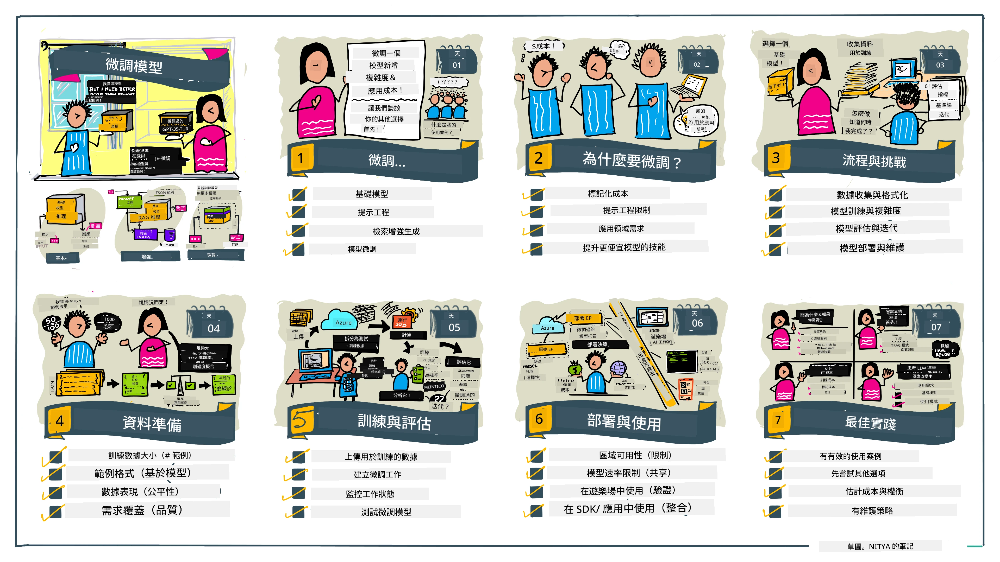

# 微調您的大型語言模型

使用大型語言模型來建立生成式 AI 應用程式帶來了新的挑戰。一個關鍵問題是確保模型為特定用戶請求生成的內容的回應質量（準確性和相關性）。在之前的課程中，我們討論了諸如提示工程和檢索增強生成等技術，這些技術試圖通過_修改模型的提示輸入_來解決該問題。

在今天的課程中，我們將討論第三種技術，**微調（fine-tuning）**，它試圖通過_使用附加數據重新訓練模型本身_來解決這一挑戰。讓我們深入了解細節。

## 學習目標

本課程介紹了預訓練語言模型的微調概念，探討了這種方法的優勢和挑戰，並提供了何時以及如何使用微調來提升生成式 AI 模型性能的指導。

完成本課程後，您應該能回答以下問題：

- 什麼是語言模型的微調？
- 什麼時候以及為什麼微調是有用的？
- 如何微調預訓練模型？
- 微調的限制是什麼？

準備好了嗎？我們開始吧。

## 插圖導覽

想在深入之前先了解我們將涵蓋內容的全貌？查看這份插圖導覽，描述了從學習微調的核心概念和動機，到理解微調過程及最佳實務的學習旅程。這是一個引人入勝的探索主題，別忘了瀏覽[資源](./RESOURCES.md?WT.mc_id=academic-105485-koreyst)頁面，獲取更多支持您自學之旅的連結！

## 什麼是語言模型的微調？

從定義上來看，大型語言模型是在大量來自多樣來源（包括網路）的文本上進行_預訓練_的。正如我們在之前的課程中所學，我們需要像_提示工程_和_檢索增強生成_這樣的技術來提升模型對用戶問題（“提示”）回應的質量。

常見的提示工程技術是給模型更多指引，說明期望回應內容，無論是提供_明確指令_（明確指導）或_給予一些示例_（隱含指導）。這被稱為_少量示例學習（few-shot learning）_，但它有兩個限制：

- 模型的 token 限制會限制可提供的示例數量，從而限制有效性。
- 模型的 token 成本使得在每個提示中添加示例變得昂貴，限制靈活性。

微調是在機器學習系統中常見的做法，我們將預訓練模型用新數據重新訓練，以改善它在特定任務上的性能。在語言模型的背景下，我們可以用_針對特定任務或應用領域策劃的示例集合_微調預訓練模型，從而創建一個可能在該任務或領域上更準確、更相關的**定制模型**。微調的附帶好處是，它還能減少少量示例學習所需的示例數量，降低 token 使用和相關成本。

## 什麼時候以及為什麼我們應該微調模型？

這裡提到的微調，是指**監督式**微調，即通過**添加新的數據**重新訓練模型，而這些數據不包含於原始訓練數據集中。這與無監督微調方法不同，後者是在原始數據上訓練模型但使用不同的超參數。

關鍵要記住的是，微調是一項進階技術，需要一定程度的專業知識才能達到預期效果。如果操作不當，可能無法帶來預期改進，甚至可能降低模型在目標領域的表現。

所以，在學習“如何”微調語言模型之前，你必須知道“為什麼”要走這條路，以及“何時”開始微調過程。先問自己這些問題：

- **使用場景**：您的微調_使用場景_是什麼？您希望改善現有預訓練模型的哪方面？
- **替代方案**：您是否嘗試了_其他技術_來達成期望的效果？將它們作為基線進行比較。
  - 提示工程：嘗試使用帶有相關示例的少量示例提示技術，評估回應質量。
  - 檢索增強生成：嘗試使用從您數據中檢索的查詢結果增強提示，評估回應質量。
- **成本**：您是否評估過微調的成本？
  - 可調整性 —— 預訓練模型是否允許微調？
  - 工作量 —— 準備訓練數據、評估和調整模型所需努力。
  - 計算 —— 執行微調作業和部署微調模型所需運算資源。
  - 數據 —— 是否有足夠且品質良好的示例支持微調成效。
- **益處**：您是否確認微調的效益？
  - 質量 —— 微調後的模型是否超越了基線？
  - 成本 —— 是否因簡化提示而降低了 token 使用？
  - 可擴展性 —— 是否可以將基礎模型重用於新領域？

通過回答這些問題，您應該能判斷微調是否適合您的使用場景。理想中，只有當效益大於成本時，這個方法才是合理的。一旦決定採用，就該思考_如何_微調預訓練模型。

想獲得更多決策過程的見解？觀看 [To fine-tune or not to fine-tune](https://www.youtube.com/watch?v=0Jo-z-MFxJs)

## 如何微調預訓練模型？

微調預訓練模型，您需要：

- 一個可微調的預訓練模型
- 用於微調的數據集
- 用於運行微調作業的訓練環境
- 用於部署微調模型的主機環境

## 微調實作案例

以下資源提供逐步教程，引導您使用精選模型和策劃數據集進行實際操作。若要完成這些教程，您需在特定提供者處註冊帳號，並取得相關模型及數據集的使用權限。

| 提供者       | 教程                                                                                                                                                                        | 說明                                                                                                                                                                                                                                                                                                                                                                                                                           |
| ------------ | --------------------------------------------------------------------------------------------------------------------------------------------------------------------------- | ------------------------------------------------------------------------------------------------------------------------------------------------------------------------------------------------------------------------------------------------------------------------------------------------------------------------------------------------------------------------------------------------------------------------------ |
| OpenAI       | [如何微調聊天模型](https://github.com/openai/openai-cookbook/blob/main/examples/How_to_finetune_chat_models.ipynb?WT.mc_id=academic-105485-koreyst)                        | 學習如何針對特定領域（“食譜助手”）微調 `gpt-35-turbo`，包括準備訓練數據、運行微調作業，並使用微調後的模型進行推理。                                                                                                                                                                                                                                                                                                            |
| Azure OpenAI | [GPT 3.5 Turbo 微調教學](https://learn.microsoft.com/azure/ai-services/openai/tutorials/fine-tune?tabs=python-new%2Ccommand-line&WT.mc_id=academic-105485-koreyst)            | 學習如何在 **Azure** 上微調 `gpt-35-turbo-0613` 模型，包括建立和上傳訓練數據、執行微調作業，以及部署和使用新模型。                                                                                                                                                                                                                                                                                                         |
| Hugging Face | [使用 Hugging Face 微調大型語言模型](https://www.philschmid.de/fine-tune-llms-in-2024-with-trl?WT.mc_id=academic-105485-koreyst)                                           | 本文介紹如何利用 [transformers](https://huggingface.co/docs/transformers/index?WT.mc_id=academic-105485-koreyst) 函式庫及 [Transformer Reinforcement Learning (TRL)](https://huggingface.co/docs/trl/index?WT.mc_id=academic-105485-koreyst)，在 Hugging Face 平台使用開放數據集微調公開大型語言模型（如 `CodeLlama 7B`）。                                                                                                                  |
|              |                                                                                                                                                                             |                                                                                                                                                                                                                                                                                                                                                                                                                                |
| 🤗 AutoTrain | [使用 AutoTrain 微調大型語言模型](https://github.com/huggingface/autotrain-advanced/?WT.mc_id=academic-105485-koreyst)                                                    | AutoTrain（或 AutoTrain Advanced）是由 Hugging Face 開發的 Python 函式庫，支持多種任務的微調，包括大型語言模型微調。AutoTrain 是無代碼解決方案，微調可以在您自己的雲端、Hugging Face Spaces 或本地環境完成。支持基於網頁的 GUI、命令行介面以及 YAML 配置文件的訓練。                                                                                                                                                 |
|              |                                                                                                                                                                             |                                                                                                                                                                                                                                                                                                                                                                                                                                |
| 🦥 Unsloth   | [使用 Unsloth 微調大型語言模型](https://github.com/unslothai/unsloth)                                                                                                    | Unsloth 是一個開源框架，支持大型語言模型微調和強化學習（RL）。它通過現成使用的[筆記本](https://github.com/unslothai/notebooks)簡化本地訓練、評估和部署。還支持文字轉語音（TTS）、BERT 及多模態模型。欲開始使用，請參考他們的逐步教學[微調大型語言模型指南](https://docs.unsloth.ai/get-started/fine-tuning-llms-guide)。                                                                                                    |
|              |                                                                                                                                                                             |                                                                                                                                                                                                                                                                                                                                                                                                                                |
## 作業

選擇上面的一個教程並跟隨完成。_我們可能會在此代碼庫的 Jupyter 筆記本中複製這些教程的版本供參考。請以原始來源為主，以獲得最新版本_。

## 做得很好！繼續學習。

完成此課程後，請瀏覽我們的[生成式 AI 學習集錦](https://aka.ms/genai-collection?WT.mc_id=academic-105485-koreyst)，繼續提升您的生成式 AI 知識！

恭喜您！！您已完成本課程 V2 系列的最後一課！別停止學習和構建。**請查看[資源](RESOURCES.md?WT.mc_id=academic-105485-koreyst)頁面，獲取本主題的更多建議清單。**

我們的 V1 系列課程也已更新，新增更多作業與概念。花點時間刷新您的知識，並請[分享您的問題及反饋](https://github.com/microsoft/generative-ai-for-beginners/issues?WT.mc_id=academic-105485-koreyst)，幫助我們為社群改進這些課程。

---

<!-- CO-OP TRANSLATOR DISCLAIMER START -->
**免責聲明**：  
本文件透過 AI 翻譯服務 [Co-op Translator](https://github.com/Azure/co-op-translator) 進行翻譯。雖然我們致力於確保準確性，但請注意自動翻譯可能包含錯誤或不準確之處。原始語言文件應視為權威來源。對於重要資訊，建議使用專業人工翻譯。本公司不對因使用此翻譯而產生的任何誤解或誤譯負責。
<!-- CO-OP TRANSLATOR DISCLAIMER END -->