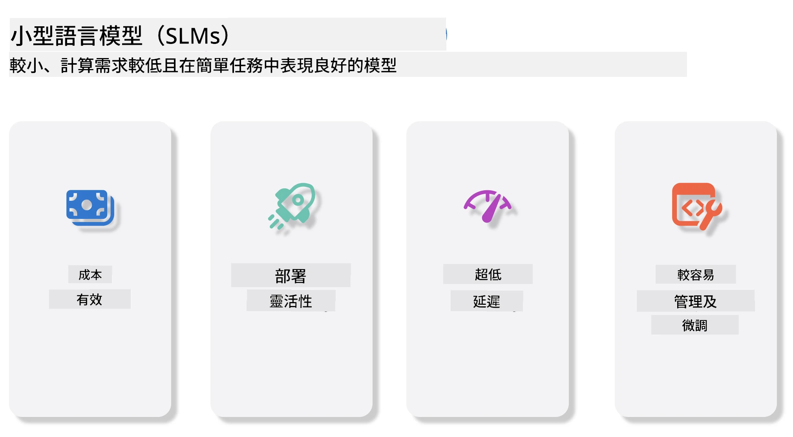
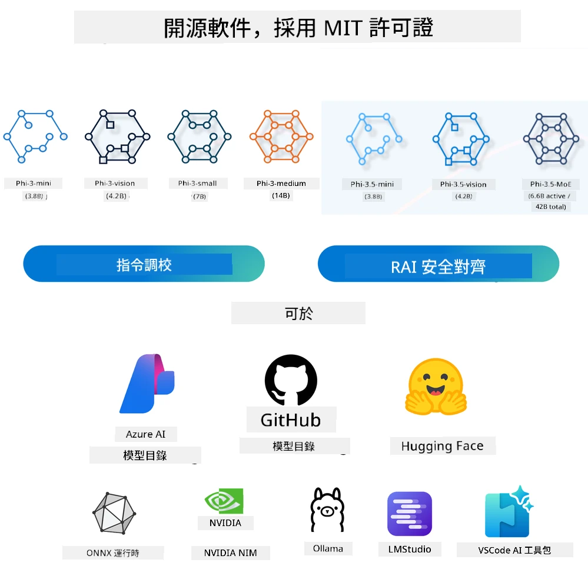
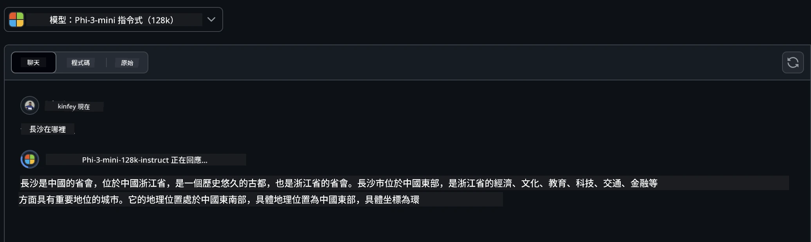
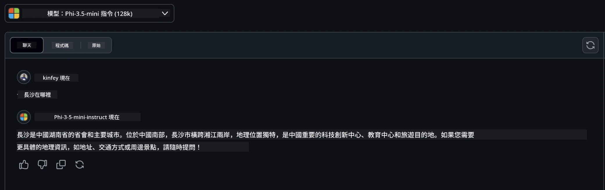

# 初學者入門生成式 AI 的小型語言模型簡介
生成式 AI 是人工智能的一個迷人領域，專注於創建能夠生成新內容的系統。這些內容可以涵蓋文本、圖片、音樂，甚至整個虛擬環境。生成式 AI 最令人興奮的應用之一就在於語言模型領域。

## 甚麼是小型語言模型？

小型語言模型（SLM）代表大型語言模型（LLM）的縮小版本，採用許多 LLM 的架構原則和技術，同時顯著降低了計算足跡。

SLM 是一類設計用於生成類人文本的語言模型子集。與 GPT-4 等大型模型不同，SLM 更為緊湊且高效，適合在計算資源有限的應用場景中使用。儘管體積較小，它們依然能執行多種任務。通常，SLM 由壓縮或蒸餾 LLM 而成，旨在保留大量原始模型的功能和語言能力。模型尺寸的縮減降低了整體複雜度，使 SLM 在記憶體使用和計算需求上更為高效。儘管如此，SLM 仍能完成多種自然語言處理（NLP）任務：

- 文字生成：創建連貫且上下文相關的句子或段落。
- 文字補全：根據提示預測並完成句子。
- 翻譯：將文本從一種語言轉換為另一種語言。
- 摘要：將長文本濃縮成更短且易於理解的摘要。

當然，這些優化也帶來與大型模型相較在性能或理解深度上的一些折衷。

## 小型語言模型如何運作？
SLM 於龐大文本資料上訓練，透過學習語言的模式與結構，使其能生成語法正確且語境適當的文本。訓練過程包含：

- 數據收集：從多種來源蒐集大量文字資料。
- 預處理：清理並組織資料，以適合訓練使用。
- 訓練：利用機器學習算法教模型理解並產生文字。
- 微調：調整模型以提升特定任務的表現。

SLM 的發展符合對於可部署於資源受限環境的模型需求，例如行動裝置或邊緣計算平台，因為這些場景中完整 LLM 的資源需求過於龐大。SLM 著重效率，在性能和可訪問性之間取得平衡，使其能在多個領域廣泛應用。



## 學習目標

本課程希望介紹 SLM 的知識，並結合 Microsoft Phi-3，學習不同文本內容、視覺與 MoE 的應用場景。

學完本課程後，你應該能回答以下問題：

- 甚麼是 SLM？
- SLM 和 LLM 有甚麼區別？
- 甚麼是 Microsoft Phi-3/3.5 系列？
- 如何使用 Microsoft Phi-3/3.5 系列進行推理？

準備好了嗎？讓我們開始吧。

## 大型語言模型 (LLM) 與小型語言模型 (SLM) 之間的區別

LLM 與 SLM 都建基於機率機器學習的基本原理，在架構設計、訓練方法、資料生成過程及模型評估等方面採用相似的方法。然而，兩者在幾個關鍵點上有顯著差異。

## 小型語言模型的應用

SLM 有廣泛的應用範疇，包括：

- 聊天機器人：提供客戶支援及用戶互動的對話式服務。
- 內容創作：協助寫作者產生點子，甚至起草完整文章。
- 教育：幫助學生完成寫作作業或學習新語言。
- 無障礙服務：為有特殊需要人士創建輔助工具，如文字轉語音系統。

**規模**

LLM 與 SLM 最大的區別在於模型規模。以 ChatGPT（GPT-4）為例，規模約為 1.76 兆參數，而開源的 SLM 如 Mistral 7B 僅有約 70 億參數。此差異主要源於模型架構和訓練流程的不同。舉例來說，ChatGPT 採用編碼器-解碼器架構內的自注意力機制，而 Mistral 7B 則使用滑動視窗注意力，讓解碼器模型的訓練更為高效。這種架構上的差異對模型的複雜度與性能有深遠影響。

**理解能力**

SLM 通常針對特定領域優化，具高度專業性，但可能限制了對多領域廣泛上下文的理解能力。反觀 LLM 旨在模擬更全面的人類智慧，透過龐大且多元的數據集訓練，能在多種領域表現優異，具更強的多功能性與適應性。因此，LLM 更適合廣泛的下游任務，如自然語言處理與程式設計。

**計算需求**

LLM 的訓練與部署資源密集，通常需要大規模 GPU 集群等龐大計算基礎設施。例如從頭訓練類似 ChatGPT 的模型可能需用上千 GPU 並歷經長時間。相較之下，SLM 參數較少，計算資源需求較低。像 Mistral 7B 這類模型可在配備適中 GPU 的本地機器訓練與運行，雖然訓練仍需多 GPU 且耗時數小時。

**偏見**

LLM 偏見問題普遍存在，主要來自訓練資料性質。這些模型經常依賴網路中開放的原始數據，其中文本可能對某些族群有所低估或誤導，標籤也可能錯誤，語言偏差可能受方言、地理差異和語法規則影響。此外，LLM 架構的複雜性無意中加劇偏見問題，若未經精細微調，這些偏見可能不易察覺。反之，SLM 透過在更受限且專門領域數據集上訓練，固有地對偏見的敏感度較低，但仍無法完全避免。

**推理速度**

SLM 較小的規模使其在推理速度上具明顯優勢，可在本地硬件高效生成輸出，無需大量並行處理。LLM 因規模與複雜度龐大，通常需要高並行計算資源才能達到可接受的推理時間，多使用者同時存取時響應速度還會進一步下降。

總結而言，雖然 LLM 與 SLM 都基於機器學習，但在模型大小、資源消耗、語境理解、偏見敏感度和推理速度上有顯著差異。這些區別反映其適用場景的不同，LLM 較為多功能但資源密集，SLM 則提供更專一的效率與較低的計算需求。

***注意：本課程將以 Microsoft Phi-3 / 3.5 為例介紹 SLM。***

## 介紹 Phi-3 / Phi-3.5 系列

Phi-3 / 3.5 系列主要針對文字、視覺與智能代理（MoE）應用場景：

### Phi-3 / 3.5 指令型 (Instruct)

主要用於文本生成、聊天補全及內容信息提取等。

**Phi-3-mini**

此 3.8B 語言模型可在 Microsoft Azure AI Studio、Hugging Face 和 Ollama 平台上使用。Phi-3 系列在多項基準測試中表現遠超同等甚至更大規模的模型（以下基準分數越高越好）。Phi-3-mini 的表現優於體積兩倍的模型，而 Phi-3-small 及 Phi-3-medium 則超越諸多大型模型，包括 GPT-3.5。

**Phi-3-small 與 medium**

擁有僅 7B 參數的 Phi-3-small，在語言、推理、代碼與數學基準測試中勝過 GPT-3.5T。

Phi-3-medium 擁有 14B 參數，呈現相同趨勢，表現優於 Gemini 1.0 Pro。

**Phi-3.5-mini**

可視為 Phi-3-mini 的升級版本，參數數量不變，但提升了多語言支持（支援超過 20 種語言，包括阿拉伯語、中文、捷克語、丹麥語、荷蘭語、英語、芬蘭語、法語、德語、希伯來語、匈牙利語、義大利語、日語、韓語、挪威語、波蘭語、葡萄牙語、俄語、西班牙語、瑞典語、泰語、土耳其語、烏克蘭語）並增強了長上下文處理能力。

擁有 3.8B 參數的 Phi-3.5-mini，在同等大小模型中表現最佳，並媲美兩倍大小的模型。

### Phi-3 / 3.5 視覺模型

Phi-3/3.5 的 Instruct 模型是 Phi 理解能力的體現，而 Vision 模型則賦予 Phi 觀察世界的「眼睛」。

**Phi-3-Vision**

Phi-3-vision 參數僅 4.2B，繼續其卓越表現，於一般視覺推理任務、OCR、表格及圖表理解任務中超越更大模型如 Claude-3 Haiku 與 Gemini 1.0 Pro V。

**Phi-3.5-Vision**

Phi-3.5-Vision 是 Phi-3-Vision 的升級版本，新增多圖片支持。你可以將其視為視覺能力的提升，不僅能看圖片，還能處理影片。

Phi-3.5-vision 在 OCR、表格與圖表理解任務中勝過更大模型如 Claude-3.5 Sonnet 與 Gemini 1.5 Flash，且在一般視覺知識推理任務中表現相當。支持多幀輸入，能對多張圖片同時進行推理。

### Phi-3.5-MoE

***專家混合模型（MoE）*** 允許以更少計算資源預訓練模型，意味著你可以在相同的計算預算下大幅擴展模型或數據集規模。特別是 MoE 模型在預訓練階段可比等效密集模型更快達到相同質量。

Phi-3.5-MoE 包含 16 個 3.8B 專家模組。僅以 6.6B 活躍參數，Phi-3.5-MoE 就能達到類似大型模型的推理、語言理解與數學能力水平。

基於不同場景，我們能使用 Phi-3/3.5 系列模型。與 LLM 不同的是，你可以在邊緣設備上部署 Phi-3/3.5-mini 或 Phi-3/3.5-Vision。

## 如何使用 Phi-3/3.5 系列模型

我們希望在不同場景中運用 Phi-3/3.5。接下來我們將根據各場景示範 Phi-3/3.5 的使用。



### 透過雲端 API 推理

**GitHub Models**

GitHub Models 是最直接的方式。你可以快速通過 GitHub Models 訪問 Phi-3/3.5-Instruct 模型。結合 Azure AI Inference SDK / OpenAI SDK，可通過程式碼調用 API 完成 Phi-3/3.5-Instruct 的呼叫。你也可以透過 Playground 測試不同效果。

- 演示範例：Phi-3-mini 與 Phi-3.5-mini 在中文場景的效果比較





**Azure AI Studio**

若想使用視覺與 MoE 模型，可以透過 Azure AI Studio 完成呼叫。如有興趣，可閱讀 Phi-3 Cookbook，了解如何透過 Azure AI Studio 呼叫 Phi-3/3.5 Instruct、Vision、MoE [點此前往](https://github.com/microsoft/Phi-3CookBook/blob/main/md/02.QuickStart/AzureAIStudio_QuickStart.md?WT.mc_id=academic-105485-koreyst)

**NVIDIA NIM**

除了 Azure 和 GitHub 提供的雲端模型目錄方案外，你還能使用 [NVIDIA NIM](https://developer.nvidia.com/nim?WT.mc_id=academic-105485-koreyst) 完成相關呼叫。你可訪問 NVIDIA NIM 執行 Phi-3/3.5 系列的 API 呼叫。NVIDIA NIM（NVIDIA Inference Microservices）是一套加速推理微服務，幫助開發者高效部署 AI 模型於多種環境，包括雲端、資料中心與工作站。

以下是 NVIDIA NIM 的一些主要特點：
- **部署簡易性：** NIM 允許只需一條命令即可部署 AI 模型，使其易於整合到現有工作流程中。
- **效能優化：** 它利用 NVIDIA 預先優化的推論引擎，如 TensorRT 和 TensorRT-LLM，確保低延遲和高吞吐量。
- **可擴展性：** NIM 支援 Kubernetes 自動擴展，使其能有效應對不同工作負載。
- **安全與控制：** 組織可透過在自家管理的基礎設施上自我托管 NIM 微服務，維持對其數據和應用的控制權。
- **標準 API：** NIM 提供行業標準的 API，使建立和整合聊天機器人、AI 助手等 AI 應用變得簡單。

NIM 是 NVIDIA AI Enterprise 的一部分，旨在簡化 AI 模型的部署和運營，使其能在 NVIDIA GPU 上高效運行。

- 示例演示：使用 NVIDIA NIM 調用 Phi-3.5-Vision-API [[點擊此連結](./python/Phi-3-Vision-Nividia-NIM.ipynb?WT.mc_id=academic-105485-koreyst)]


### 本地運行 Phi-3/3.5
針對 Phi-3 或任何語言模型如 GPT-3 的推論，指的是根據輸入生成回應或預測的過程。當你向 Phi-3 提供提示或問題時，它會利用其訓練好的神經網絡，通過分析其訓練數據中的模式和關聯，推斷出最可能且相關的回應。

**Hugging Face Transformer**
Hugging Face Transformers 是一個強大的庫，專為自然語言處理（NLP）及其他機器學習任務設計。以下是一些要點：

1. **預訓練模型：** 它提供數千個預訓練模型，可用於文本分類、命名實體識別、問答、摘要、翻譯和文本生成等多種任務。

2. **框架互通性：** 該庫支援多種深度學習框架，包括 PyTorch、TensorFlow 和 JAX，允許你在一個框架中訓練模型，並在另一個框架中使用。

3. **多模態能力：** 除了 NLP，Hugging Face Transformers 還支援計算機視覺（如圖像分類、物件檢測）和音訊處理（如語音識別、音訊分類）任務。

4. **易於使用：** 該庫提供 API 和工具，方便下載和微調模型，對初學者和專家均十分友好。

5. **社群與資源：** Hugging Face 擁有活躍的社區，豐富的文檔、教程和指南，幫助用戶快速上手並充分利用該庫。
[官方文檔](https://huggingface.co/docs/transformers/index?WT.mc_id=academic-105485-koreyst) 或其 [GitHub 倉庫](https://github.com/huggingface/transformers?WT.mc_id=academic-105485-koreyst)。

這是最常用的方法，但它也需要 GPU 加速。畢竟，像 Vision 和 MoE 這類場景需要大量計算，若未量化則在 CPU 上會非常慢。


- 示例演示：使用 Transformer 調用 Phi-3.5-Instruct [點擊此連結](./python/phi35-instruct-demo.ipynb?WT.mc_id=academic-105485-koreyst)

- 示例演示：使用 Transformer 調用 Phi-3.5-Vision [點擊此連結](./python/phi35-vision-demo.ipynb?WT.mc_id=academic-105485-koreyst)

- 示例演示：使用 Transformer 調用 Phi-3.5-MoE [點擊此連結](./python/phi35_moe_demo.ipynb?WT.mc_id=academic-105485-koreyst)

**Ollama**
[Ollama](https://ollama.com/?WT.mc_id=academic-105485-koreyst) 是一個平台，旨在方便用戶在本地機器上運行大型語言模型（LLM）。它支援多款模型，如 Llama 3.1、Phi 3、Mistral 和 Gemma 2 等。該平台簡化了流程，將模型權重、配置和數據打包為一個完整包，使用戶更容易自訂和建立自己的模型。Ollama 支援 macOS、Linux 和 Windows。如果你想在不依賴雲服務的情況下試驗或部署 LLM，這是一個不錯的工具。Ollama 是最直接的方式，你只需執行以下命令。


```bash

ollama run phi3.5

```


**ONNX Runtime for GenAI**

[ONNX Runtime](https://github.com/microsoft/onnxruntime-genai?WT.mc_id=academic-105485-koreyst) 是一個跨平台的推論和訓練機器學習加速器。ONNX Runtime for Generative AI (GENAI) 是一個強大的工具，幫助你在各種平台上高效運行生成式 AI 模型。

## 什麼是 ONNX Runtime?
ONNX Runtime 是一個開源項目，能夠實現高性能的機器學習模型推論。它支援 Open Neural Network Exchange (ONNX) 格式的模型，這是一種用於表示機器學習模型的標準。ONNX Runtime 推論能加快用戶體驗並降低成本，支援來自深度學習框架如 PyTorch 和 TensorFlow/Keras 以及經典機器學習庫如 scikit-learn、LightGBM、XGBoost 等的模型。ONNX Runtime 與不同硬體、驅動和作業系統兼容，並透過利用硬體加速器與圖優化和變換實現最佳性能。

## 什麼是生成式 AI?
生成式 AI 指的是能基於其訓練數據產生新內容的 AI 系統，內容可包括文本、圖像或音樂。示例有語言模型 GPT-3 和圖像生成模型 Stable Diffusion。ONNX Runtime for GenAI 庫提供了生成式 AI 的整套流程，包括使用 ONNX Runtime 進行推論、logits 處理、搜尋與採樣以及 KV 緩存管理。

## ONNX Runtime for GENAI
ONNX Runtime for GENAI 擴展了 ONNX Runtime 的功能，以支援生成式 AI 模型。主要特點包括：

- **廣泛的平臺支援：** 它可運行於 Windows、Linux、macOS、Android 和 iOS 等多個平台。
- **模型支援：** 支援多種流行的生成式 AI 模型，如 LLaMA、GPT-Neo、BLOOM 等。
- **性能優化：** 包含針對不同硬體加速器如 NVIDIA GPU、AMD GPU 等的優化。
- **易於使用：** 提供 API 方便整合到應用程序中，使你能以最少代碼生成文本、圖像及其他內容。
- 用戶可以呼叫高階的 generate() 方法，或者在迴圈中逐步執行模型每次生成一個 token，並可選擇性在迴圈內更新生成參數。
- ONNX Runtime 亦支援貪婪/束搜索和 TopP、TopK 採樣來生成 token 序列，並內建重複懲罰等 logits 處理。你還可以輕鬆添加自定義評分。

## 入門指南
要開始使用 ONNX Runtime for GENAI，可以按以下步驟：

### 安裝 ONNX Runtime：
```Python
pip install onnxruntime
```
### 安裝生成式 AI 擴展：
```Python
pip install onnxruntime-genai
```

### 運行模型：以下是 Python 的簡單示例：
```Python
import onnxruntime_genai as og

model = og.Model('path_to_your_model.onnx')

tokenizer = og.Tokenizer(model)

input_text = "Hello, how are you?"

input_tokens = tokenizer.encode(input_text)

output_tokens = model.generate(input_tokens)

output_text = tokenizer.decode(output_tokens)

print(output_text) 
```
### 演示：使用 ONNX Runtime GenAI 調用 Phi-3.5-Vision


```python

import onnxruntime_genai as og

model_path = './Your Phi-3.5-vision-instruct ONNX Path'

img_path = './Your Image Path'

model = og.Model(model_path)

processor = model.create_multimodal_processor()

tokenizer_stream = processor.create_stream()

text = "Your Prompt"

prompt = "<|user|>\n"

prompt += "<|image_1|>\n"

prompt += f"{text}<|end|>\n"

prompt += "<|assistant|>\n"

image = og.Images.open(img_path)

inputs = processor(prompt, images=image)

params = og.GeneratorParams(model)

params.set_inputs(inputs)

params.set_search_options(max_length=3072)

generator = og.Generator(model, params)

while not generator.is_done():

    generator.compute_logits()
    
    generator.generate_next_token()

    new_token = generator.get_next_tokens()[0]
    
    output = tokenizer_stream.decode(new_token)
    
    print(tokenizer_stream.decode(new_token), end='', flush=True)

```


**其他**

除了 ONNX Runtime 和 Ollama 參考方法外，我們還可以基於各家廠商提供的模型參考方法完成量化模型參考。比如 Apple MLX 框架搭配 Apple Metal、高通 QNN 配合 NPU、英特爾 OpenVINO 配合 CPU/GPU 等。你還可以從 [Phi-3 Cookbook](https://github.com/microsoft/phi-3cookbook?WT.mc_id=academic-105485-koreyst) 獲取更多內容。


## 更多

我們已學習了 Phi-3/3.5 家族的基礎知識，但若想深入了解 SLM，則需要更多知識。你可以在 Phi-3 Cookbook 中找到答案。若想了解更多，請訪問 [Phi-3 Cookbook](https://github.com/microsoft/phi-3cookbook?WT.mc_id=academic-105485-koreyst)。

---

<!-- CO-OP TRANSLATOR DISCLAIMER START -->
**免責聲明**：
本文件由 AI 翻譯服務 [Co-op Translator](https://github.com/Azure/co-op-translator) 進行翻譯。雖然我們力求準確，但請注意自動翻譯可能包含錯誤或不準確之處。原始文件的母語版本應視為具權威性的資料來源。對於關鍵資訊，建議採用專業人工翻譯。我們不對因使用此翻譯而導致的任何誤解或誤釋負責。
<!-- CO-OP TRANSLATOR DISCLAIMER END -->