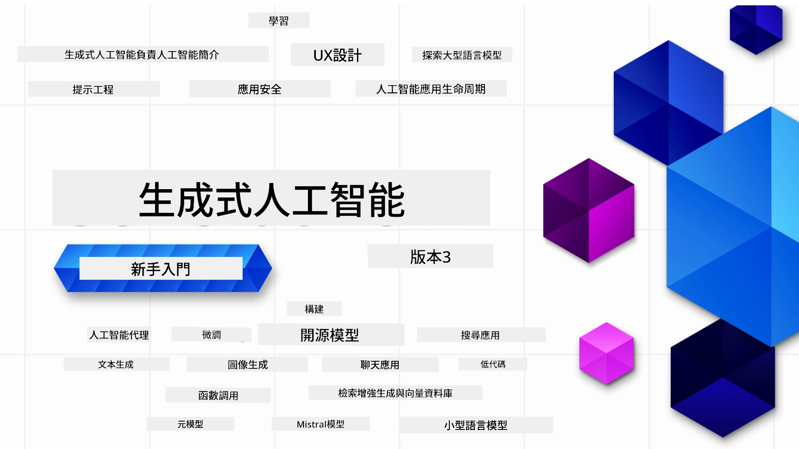

### 21 課教你構建生成式 AI 應用所需知道的一切

[](https://github.com/microsoft/Generative-AI-For-Beginners/blob/master/LICENSE?WT.mc_id=academic-105485-koreyst)
[](https://GitHub.com/microsoft/Generative-AI-For-Beginners/graphs/contributors/?WT.mc_id=academic-105485-koreyst)
[](https://GitHub.com/microsoft/Generative-AI-For-Beginners/issues/?WT.mc_id=academic-105485-koreyst)
[](https://GitHub.com/microsoft/Generative-AI-For-Beginners/pulls/?WT.mc_id=academic-105485-koreyst)
[](http://makeapullrequest.com?WT.mc_id=academic-105485-koreyst)

[](https://GitHub.com/microsoft/Generative-AI-For-Beginners/watchers/?WT.mc_id=academic-105485-koreyst)
[](https://GitHub.com/microsoft/Generative-AI-For-Beginners/network/?WT.mc_id=academic-105485-koreyst)
[](https://GitHub.com/microsoft/Generative-AI-For-Beginners/stargazers/?WT.mc_id=academic-105485-koreyst)

[](https://discord.gg/nTYy5BXMWG)

### 🌐 多語言支援

#### 透過 GitHub Action 支援（自動且始終更新）

<!-- CO-OP TRANSLATOR LANGUAGES TABLE START -->
[阿拉伯文](../ar/README.md) | [孟加拉文](../bn/README.md) | [保加利亞文](../bg/README.md) | [緬甸文](../my/README.md) | [中文（簡體）](../zh-CN/README.md) | [中文（繁體，香港）](./README.md) | [中文（繁體，澳門）](../zh-MO/README.md) | [中文（繁體，台灣）](../zh-TW/README.md) | [克羅地亞語](../hr/README.md) | [捷克語](../cs/README.md) | [丹麥語](../da/README.md) | [荷蘭語](../nl/README.md) | [愛沙尼亞語](../et/README.md) | [芬蘭語](../fi/README.md) | [法語](../fr/README.md) | [德語](../de/README.md) | [希臘語](../el/README.md) | [希伯來語](../he/README.md) | [印地語](../hi/README.md) | [匈牙利語](../hu/README.md) | [印尼語](../id/README.md) | [意大利語](../it/README.md) | [日語](../ja/README.md) | [卡納達語](../kn/README.md) | [韓語](../ko/README.md) | [立陶宛語](../lt/README.md) | [馬來語](../ms/README.md) | [馬拉雅拉姆語](../ml/README.md) | [馬拉地語](../mr/README.md) | [尼泊爾語](../ne/README.md) | [尼日利亞派欽語](../pcm/README.md) | [挪威語](../no/README.md) | [波斯語 (法爾西)](../fa/README.md) | [波蘭語](../pl/README.md) | [葡萄牙語（巴西）](../pt-BR/README.md) | [葡萄牙語（葡萄牙）](../pt-PT/README.md) | [旁遮普語（古魯穆奇）](../pa/README.md) | [羅馬尼亞語](../ro/README.md) | [俄語](../ru/README.md) | [塞爾維亞語（西里爾文）](../sr/README.md) | [斯洛伐克語](../sk/README.md) | [斯洛文尼亞語](../sl/README.md) | [西班牙語](../es/README.md) | [斯瓦希里語](../sw/README.md) | [瑞典語](../sv/README.md) | [他加祿語（菲律賓語）](../tl/README.md) | [泰米爾語](../ta/README.md) | [泰盧固語](../te/README.md) | [泰語](../th/README.md) | [土耳其語](../tr/README.md) | [烏克蘭語](../uk/README.md) | [烏爾都語](../ur/README.md) | [越南語](../vi/README.md)

> **想本地克隆存檔？**
>
> 此存儲庫包含 50 多種語言翻譯，會大幅增加下載大小。若想不含翻譯版本，請使用稀疏檢出：
>
> **Bash / macOS / Linux:**
> ```bash
> git clone --filter=blob:none --sparse https://github.com/microsoft/generative-ai-for-beginners.git
> cd generative-ai-for-beginners
> git sparse-checkout set --no-cone '/*' '!translations' '!translated_images'
> ```
>
> **CMD (Windows):**
> ```cmd
> git clone --filter=blob:none --sparse https://github.com/microsoft/generative-ai-for-beginners.git
> cd generative-ai-for-beginners
> git sparse-checkout set --no-cone "/*" "!translations" "!translated_images"
> ```
>
> 這樣你能以更快速度下載，取得完成課程所需的一切。
<!-- CO-OP TRANSLATOR LANGUAGES TABLE END -->

# 初學者生成式AI課程（第3版）

透過我們由 Microsoft Cloud Advocates 提供的 21 課綜合課程，學習構建生成式 AI 應用的基本知識。

## 🌱 開始學習

本課程共有 21 課，每課涵蓋獨立主題，您可自由選擇要從哪一課開始！

課程分為「學習」課程（說明生成式 AI 概念）及「實作」課程（說明一個概念並在可行時同時提供**Python**及**TypeScript**程式碼範例）。

若是 .NET 開發者，請參考 [初學者生成式 AI (.NET 版)](https://github.com/microsoft/Generative-AI-for-beginners-dotnet?WT.mc_id=academic-105485-koreyst)！

每課還包含「持續學習」部分，提供額外的學習工具。

## 你需要準備的事項
### 執行本課程程式碼，你可使用以下其中一種：
 - [Azure OpenAI 服務](https://aka.ms/genai-beginners/azure-open-ai?WT.mc_id=academic-105485-koreyst) - **使用課程:** "aoai-assignment"
 - [GitHub Marketplace 模型目錄](https://aka.ms/genai-beginners/gh-models?WT.mc_id=academic-105485-koreyst) - **使用課程:** "githubmodels"
 - [OpenAI API](https://aka.ms/genai-beginners/open-ai?WT.mc_id=academic-105485-koreyst) - **使用課程:** "oai-assignment"
   
- 具備 Python 或 TypeScript 的基本知識會有幫助 - \*若是完全初學者，可參考這兩門[Python](https://aka.ms/genai-beginners/python?WT.mc_id=academic-105485-koreyst)與[TypeScript](https://aka.ms/genai-beginners/typescript?WT.mc_id=academic-105485-koreyst)課程
- GitHub 帳號，用以[將本存儲庫分支傳送至您的 GitHub 帳號](https://aka.ms/genai-beginners/github?WT.mc_id=academic-105485-koreyst)

我們已製作一門**[課程設置](./00-course-setup/README.md?WT.mc_id=academic-105485-koreyst)**課程，協助您設定開發環境。

別忘了幫本倉庫[加星（🌟）](https://docs.github.com/en/get-started/exploring-projects-on-github/saving-repositories-with-stars?WT.mc_id=academic-105485-koreyst)，日後找起來更方便。

## 🧠 準備部署了嗎？

若想找更多進階程式碼範例，請參考我們於 **Python** 與 **TypeScript** 提供的[生成式 AI 程式碼範例合集](https://aka.ms/genai-beg-code?WT.mc_id=academic-105485-koreyst)。

## 🗣️ 認識其他學習者，獲得支援

加入我們的[官方 Azure AI Foundry Discord 伺服器](https://aka.ms/genai-discord?WT.mc_id=academic-105485-koreyst)，認識其他正在學習本課的學員並獲得支援。

也可於我們的 [Azure AI Foundry 開發者論壇](https://aka.ms/azureaifoundry/forum)（GitHub）提出問題或分享產品回饋。

## 🚀 要創業嗎？

請造訪 [Microsoft for Startups](https://www.microsoft.com/startups) ，了解如何利用 Azure 點數開始您的創業之路。

## 🙏 想幫忙嗎？

您有任何建議或發現拼寫/程式碼錯誤？[提出問題](https://github.com/microsoft/generative-ai-for-beginners/issues?WT.mc_id=academic-105485-koreyst) 或 [發送拉取請求](https://github.com/microsoft/generative-ai-for-beginners/pulls?WT.mc_id=academic-105485-koreyst)

## 📂 每課包含：

- 主題的簡短視頻介紹
- 作為 README 的教學內容
- 支援 Azure OpenAI 及 OpenAI API 的 Python 和 TypeScript 程式碼範例
- 用於繼續學習的額外資源連結

## 🗃️ 各課程

| #   | **課程連結**                                                                                                                                | **說明**                                                                                      | **視頻**                                                                     | **額外學習**                                                                 |
| --- | ------------------------------------------------------------------------------------------------------------------------------------------ | -------------------------------------------------------------------------------------------- | --------------------------------------------------------------------------- | -------------------------------------------------------------------------- |
| 00  | [課程設置](./00-course-setup/README.md?WT.mc_id=academic-105485-koreyst)                                                                      | **學習：** 如何設定你的開發環境                                                               | 視頻即將推出                                                                | [了解更多](https://aka.ms/genai-collection?WT.mc_id=academic-105485-koreyst) |
| 01  | [生成式 AI 與大型語言模型簡介](./01-introduction-to-genai/README.md?WT.mc_id=academic-105485-koreyst)                                           | **學習：** 了解什麼是生成式 AI 以及大型語言模型（LLMs）的運作                                 | [視頻](https://aka.ms/gen-ai-lesson-1-gh?WT.mc_id=academic-105485-koreyst)  | [了解更多](https://aka.ms/genai-collection?WT.mc_id=academic-105485-koreyst) |
| 02  | [探索與比較不同大型語言模型](./02-exploring-and-comparing-different-llms/README.md?WT.mc_id=academic-105485-koreyst)                            | **學習：** 如何為您的使用情境選擇合適的模型                                                  | [視頻](https://aka.ms/gen-ai-lesson2-gh?WT.mc_id=academic-105485-koreyst)   | [了解更多](https://aka.ms/genai-collection?WT.mc_id=academic-105485-koreyst) |
| 03  | [負責任地使用生成式 AI](./03-using-generative-ai-responsibly/README.md?WT.mc_id=academic-105485-koreyst)                                          | **學習：** 如何負責任地構建生成式 AI 應用                                                   | [視頻](https://aka.ms/gen-ai-lesson3-gh?WT.mc_id=academic-105485-koreyst)   | [了解更多](https://aka.ms/genai-collection?WT.mc_id=academic-105485-koreyst) |
| 04  | [了解提示工程基礎](./04-prompt-engineering-fundamentals/README.md?WT.mc_id=academic-105485-koreyst)             | **學習：** 實作提示工程最佳實踐                                           | [影片](https://aka.ms/gen-ai-lesson4-gh?WT.mc_id=academic-105485-koreyst)  | [了解更多](https://aka.ms/genai-collection?WT.mc_id=academic-105485-koreyst) |
| 05  | [創建進階提示](./05-advanced-prompts/README.md?WT.mc_id=academic-105485-koreyst)                                                | **學習：** 如何應用提示工程技術提升你的提示結果。 | [影片](https://aka.ms/gen-ai-lesson5-gh?WT.mc_id=academic-105485-koreyst)  | [了解更多](https://aka.ms/genai-collection?WT.mc_id=academic-105485-koreyst) |
| 06  | [建立文本生成應用程式](./06-text-generation-apps/README.md?WT.mc_id=academic-105485-koreyst)                                | **建立：** 使用 Azure OpenAI / OpenAI API 建立文本生成應用程式                                | [影片](https://aka.ms/gen-ai-lesson6-gh?WT.mc_id=academic-105485-koreyst)  | [了解更多](https://aka.ms/genai-collection?WT.mc_id=academic-105485-koreyst) |
| 07  | [建立聊天應用程式](./07-building-chat-applications/README.md?WT.mc_id=academic-105485-koreyst)                                     | **建立：** 高效構建及整合聊天應用程式的技術。               | [影片](https://aka.ms/gen-ai-lessons7-gh?WT.mc_id=academic-105485-koreyst) | [了解更多](https://aka.ms/genai-collection?WT.mc_id=academic-105485-koreyst) |
| 08  | [建立搜尋應用程式與向量資料庫](./08-building-search-applications/README.md?WT.mc_id=academic-105485-koreyst)                        | **建立：** 使用 Embeddings 搜尋資料的搜尋應用程式。                        | [影片](https://aka.ms/gen-ai-lesson8-gh?WT.mc_id=academic-105485-koreyst)  | [了解更多](https://aka.ms/genai-collection?WT.mc_id=academic-105485-koreyst) |
| 09  | [建立圖像生成應用程式](./09-building-image-applications/README.md?WT.mc_id=academic-105485-koreyst)                        | **建立：** 一個圖像生成應用程式                                                       | [影片](https://aka.ms/gen-ai-lesson9-gh?WT.mc_id=academic-105485-koreyst)  | [了解更多](https://aka.ms/genai-collection?WT.mc_id=academic-105485-koreyst) |
| 10  | [建立低代碼 AI 應用程式](./10-building-low-code-ai-applications/README.md?WT.mc_id=academic-105485-koreyst)                       | **建立：** 使用低代碼工具開發生成式 AI 應用程式                                     | [影片](https://aka.ms/gen-ai-lesson10-gh?WT.mc_id=academic-105485-koreyst) | [了解更多](https://aka.ms/genai-collection?WT.mc_id=academic-105485-koreyst) |
| 11  | [與函式調用整合外部應用程式](./11-integrating-with-function-calling/README.md?WT.mc_id=academic-105485-koreyst) | **建立：** 何謂函式調用及其在應用程式中的使用案例                          | [影片](https://aka.ms/gen-ai-lesson11-gh?WT.mc_id=academic-105485-koreyst) | [了解更多](https://aka.ms/genai-collection?WT.mc_id=academic-105485-koreyst) |
| 12  | [設計 AI 應用程式的用戶體驗 (UX)](./12-designing-ux-for-ai-applications/README.md?WT.mc_id=academic-105485-koreyst)                         | **學習：** 在開發生成式 AI 應用時如何應用 UX 設計原則         | [影片](https://aka.ms/gen-ai-lesson12-gh?WT.mc_id=academic-105485-koreyst) | [了解更多](https://aka.ms/genai-collection?WT.mc_id=academic-105485-koreyst) |
| 13  | [保護你的生成式 AI 應用程式](./13-securing-ai-applications/README.md?WT.mc_id=academic-105485-koreyst)                         | **學習：** AI 系統面臨的威脅與風險及保護這些系統的方法。             | [影片](https://aka.ms/gen-ai-lesson13-gh?WT.mc_id=academic-105485-koreyst) | [了解更多](https://aka.ms/genai-collection?WT.mc_id=academic-105485-koreyst) |
| 14  | [生成式 AI 應用程式生命週期](./14-the-generative-ai-application-lifecycle/README.md?WT.mc_id=academic-105485-koreyst)           | **學習：** 管理大型語言模型生命週期及 LLMOps 的工具與指標                         | [影片](https://aka.ms/gen-ai-lesson14-gh?WT.mc_id=academic-105485-koreyst) | [了解更多](https://aka.ms/genai-collection?WT.mc_id=academic-105485-koreyst) |
| 15  | [檢索增強生成 (RAG) 與向量資料庫](./15-rag-and-vector-databases/README.md?WT.mc_id=academic-105485-koreyst)        | **建立：** 使用 RAG 架構，從向量資料庫檢索 Embeddings 的應用程式  | [影片](https://aka.ms/gen-ai-lesson15-gh?WT.mc_id=academic-105485-koreyst) | [了解更多](https://aka.ms/genai-collection?WT.mc_id=academic-105485-koreyst) |
| 16  | [開源模型與 Hugging Face](./16-open-source-models/README.md?WT.mc_id=academic-105485-koreyst)                                    | **建立：** 使用 Hugging Face 上的開源模型開發應用程式                    | [影片](https://aka.ms/gen-ai-lesson16-gh?WT.mc_id=academic-105485-koreyst) | [了解更多](https://aka.ms/genai-collection?WT.mc_id=academic-105485-koreyst) |
| 17  | [AI 代理人](./17-ai-agents/README.md?WT.mc_id=academic-105485-koreyst)                                                                       | **建立：** 使用 AI 代理人框架的應用程式                                           | [影片](https://aka.ms/gen-ai-lesson17-gh?WT.mc_id=academic-105485-koreyst) | [了解更多](https://aka.ms/genai-collection?WT.mc_id=academic-105485-koreyst) |
| 18  | [微調大型語言模型 (LLMs)](./18-fine-tuning/README.md?WT.mc_id=academic-105485-koreyst)                                                              | **學習：** 什麼是微調 LLM，為什麼以及如何微調                                            | [影片](https://aka.ms/gen-ai-lesson18-gh?WT.mc_id=academic-105485-koreyst) | [了解更多](https://aka.ms/genai-collection?WT.mc_id=academic-105485-koreyst) |
| 19  | [使用小型語言模型 (SLMs) 建立應用程式](./19-slm/README.md?WT.mc_id=academic-105485-koreyst)                                                              | **學習：** 使用小型語言模型構建的好處                                            | 影片即將推出 | [了解更多](https://aka.ms/genai-collection?WT.mc_id=academic-105485-koreyst) |
| 20  | [使用 Mistral 模型建立應用程式](./20-mistral/README.md?WT.mc_id=academic-105485-koreyst)                                                              | **學習：** Mistral 系列模型的特徵及差異                                           | 影片即將推出 | [了解更多](https://aka.ms/genai-collection?WT.mc_id=academic-105485-koreyst) |
| 21  | [使用 Meta 模型建立應用程式](./21-meta/README.md?WT.mc_id=academic-105485-koreyst)                                                              | **學習：** Meta 系列模型的特徵及差異                                           | 影片即將推出 | [了解更多](https://aka.ms/genai-collection?WT.mc_id=academic-105485-koreyst) |

### 🌟 特別感謝

特別感謝 [**John Aziz**](https://www.linkedin.com/in/john0isaac/) 創建所有的 GitHub Actions 和工作流程。

[**Bernhard Merkle**](https://www.linkedin.com/in/bernhard-merkle-738b73/) 為每個課程做出關鍵貢獻，以提升學習者與代碼體驗。

## 🎒 其他課程

我們團隊還製作其他課程！請查看：

<!-- CO-OP TRANSLATOR OTHER COURSES START -->
### LangChain
[](https://aka.ms/langchain4j-for-beginners)
[](https://aka.ms/langchainjs-for-beginners?WT.mc_id=m365-94501-dwahlin)
[](https://github.com/microsoft/langchain-for-beginners?WT.mc_id=m365-94501-dwahlin)
---

### Azure / Edge / MCP / 代理人
[](https://github.com/microsoft/AZD-for-beginners?WT.mc_id=academic-105485-koreyst)
[](https://github.com/microsoft/edgeai-for-beginners?WT.mc_id=academic-105485-koreyst)
[](https://github.com/microsoft/mcp-for-beginners?WT.mc_id=academic-105485-koreyst)
[](https://github.com/microsoft/ai-agents-for-beginners?WT.mc_id=academic-105485-koreyst)

---
 
### 生成式 AI 系列
[](https://github.com/microsoft/generative-ai-for-beginners?WT.mc_id=academic-105485-koreyst)
[-9333EA?style=for-the-badge&labelColor=E5E7EB&color=9333EA)](https://github.com/microsoft/Generative-AI-for-beginners-dotnet?WT.mc_id=academic-105485-koreyst)
[-C084FC?style=for-the-badge&labelColor=E5E7EB&color=C084FC)](https://github.com/microsoft/generative-ai-for-beginners-java?WT.mc_id=academic-105485-koreyst)
[-E879F9?style=for-the-badge&labelColor=E5E7EB&color=E879F9)](https://github.com/microsoft/generative-ai-with-javascript?WT.mc_id=academic-105485-koreyst)

---
 
### 核心學習
[](https://aka.ms/ml-beginners?WT.mc_id=academic-105485-koreyst)
[](https://aka.ms/datascience-beginners?WT.mc_id=academic-105485-koreyst)
[](https://aka.ms/ai-beginners?WT.mc_id=academic-105485-koreyst)
[](https://github.com/microsoft/Security-101?WT.mc_id=academic-96948-sayoung)
[](https://aka.ms/webdev-beginners?WT.mc_id=academic-105485-koreyst)
[](https://aka.ms/iot-beginners?WT.mc_id=academic-105485-koreyst)
[](https://github.com/microsoft/xr-development-for-beginners?WT.mc_id=academic-105485-koreyst)

---
 
### Copilot 系列
[](https://aka.ms/GitHubCopilotAI?WT.mc_id=academic-105485-koreyst)
[](https://github.com/microsoft/mastering-github-copilot-for-dotnet-csharp-developers?WT.mc_id=academic-105485-koreyst)
[](https://github.com/microsoft/CopilotAdventures?WT.mc_id=academic-105485-koreyst)
<!-- CO-OP TRANSLATOR OTHER COURSES END -->

## 尋求協助

如果你遇到困難或對構建 AI 應用有任何疑問，請加入其他學習者和經驗豐富的開發者，一同參與 MCP 的討論。這是一個支持性的社群，歡迎提問及自由分享知識。

[](https://discord.gg/nTYy5BXMWG)

如果你有產品回饋或在構建過程中遇到錯誤，請訪問：

[](https://aka.ms/foundry/forum)

---

<!-- CO-OP TRANSLATOR DISCLAIMER START -->
**免責聲明**：
本文件由 AI 翻譯服務 [Co-op Translator](https://github.com/Azure/co-op-translator) 翻譯而成。雖然我們力求準確，但請注意，自動翻譯可能包含錯誤或不準確之處。原始文件的母語版本應視為權威來源。對於重要資訊，建議採用專業人工翻譯。對因使用本翻譯而引起的任何誤解或誤釋，我們概不負責。
<!-- CO-OP TRANSLATOR DISCLAIMER END -->