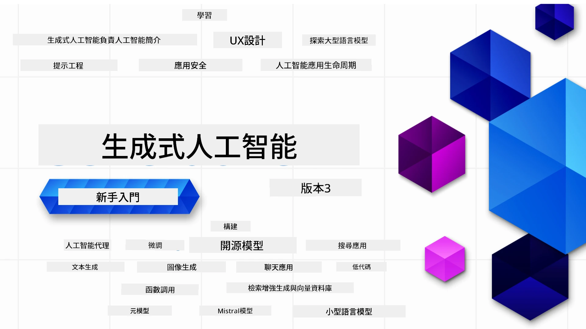

### 21 課教你建立生成式 AI 應用所需知道的一切

[](https://github.com/microsoft/Generative-AI-For-Beginners/blob/master/LICENSE?WT.mc_id=academic-105485-koreyst)
[](https://GitHub.com/microsoft/Generative-AI-For-Beginners/graphs/contributors/?WT.mc_id=academic-105485-koreyst)
[](https://GitHub.com/microsoft/Generative-AI-For-Beginners/issues/?WT.mc_id=academic-105485-koreyst)
[](https://GitHub.com/microsoft/Generative-AI-For-Beginners/pulls/?WT.mc_id=academic-105485-koreyst)
[](http://makeapullrequest.com?WT.mc_id=academic-105485-koreyst)

[](https://GitHub.com/microsoft/Generative-AI-For-Beginners/watchers/?WT.mc_id=academic-105485-koreyst)
[](https://GitHub.com/microsoft/Generative-AI-For-Beginners/network/?WT.mc_id=academic-105485-koreyst)
[](https://GitHub.com/microsoft/Generative-AI-For-Beginners/stargazers/?WT.mc_id=academic-105485-koreyst)

[](https://discord.gg/nTYy5BXMWG)

### 🌐 多語言支援

#### 透過 GitHub Action 支援（自動化且永遠保持最新）

<!-- CO-OP TRANSLATOR LANGUAGES TABLE START -->
[阿拉伯語](../ar/README.md) | [孟加拉語](../bn/README.md) | [保加利亞語](../bg/README.md) | [緬甸語](../my/README.md) | [中文（簡體）](../zh-CN/README.md) | [中文（繁體，香港）](./README.md) | [中文（繁體，澳門）](../zh-MO/README.md) | [中文（繁體，台灣）](../zh-TW/README.md) | [克羅地亞語](../hr/README.md) | [捷克語](../cs/README.md) | [丹麥語](../da/README.md) | [荷蘭語](../nl/README.md) | [愛沙尼亞語](../et/README.md) | [芬蘭語](../fi/README.md) | [法語](../fr/README.md) | [德語](../de/README.md) | [希臘語](../el/README.md) | [希伯來語](../he/README.md) | [印地語](../hi/README.md) | [匈牙利語](../hu/README.md) | [印度尼西亞語](../id/README.md) | [義大利語](../it/README.md) | [日語](../ja/README.md) | [坎納達語](../kn/README.md) | [高棉語](../km/README.md) | [韓語](../ko/README.md) | [立陶宛語](../lt/README.md) | [馬來語](../ms/README.md) | [馬拉雅拉姆語](../ml/README.md) | [馬拉地語](../mr/README.md) | [尼泊爾語](../ne/README.md) | [奈及利亞洋泾浜語](../pcm/README.md) | [挪威語](../no/README.md) | [波斯語（法爾西語）](../fa/README.md) | [波蘭語](../pl/README.md) | [葡萄牙語（巴西）](../pt-BR/README.md) | [葡萄牙語（葡國）](../pt-PT/README.md) | [旁遮普語（古魯穆奇文）](../pa/README.md) | [羅馬尼亞語](../ro/README.md) | [俄語](../ru/README.md) | [塞爾維亞語（西里爾字母）](../sr/README.md) | [斯洛伐克語](../sk/README.md) | [斯洛文尼亞語](../sl/README.md) | [西班牙語](../es/README.md) | [斯瓦希里語](../sw/README.md) | [瑞典語](../sv/README.md) | [他加祿語（菲律賓語）](../tl/README.md) | [泰米爾語](../ta/README.md) | [泰盧固語](../te/README.md) | [泰語](../th/README.md) | [土耳其語](../tr/README.md) | [烏克蘭語](../uk/README.md) | [烏爾都語](../ur/README.md) | [越南語](../vi/README.md)

> **想本機克隆？**
>
> 本儲存庫包含超過 50 種語言翻譯，顯著增加下載大小。如欲克隆不含翻譯版本，請使用稀疏檢出：
>
> **Bash / macOS / Linux:**
> ```bash
> git clone --filter=blob:none --sparse https://github.com/microsoft/generative-ai-for-beginners.git
> cd generative-ai-for-beginners
> git sparse-checkout set --no-cone '/*' '!translations' '!translated_images'
> ```
>
> **CMD（Windows）：**
> ```cmd
> git clone --filter=blob:none --sparse https://github.com/microsoft/generative-ai-for-beginners.git
> cd generative-ai-for-beginners
> git sparse-checkout set --no-cone "/*" "!translations" "!translated_images"
> ```
>
> 這樣你可以更快速下載所需的課程全部內容。
<!-- CO-OP TRANSLATOR LANGUAGES TABLE END -->

# 生成式 AI 初學者課程（版本 3）

由 Microsoft Cloud Advocates 提供的 21 課程，學習建立生成式 AI 應用的基礎。

## 🌱 開始學習

本課程共 21 課。每課自成主題，隨時從喜歡的地方開始！

課程分為「學習」課，闡述生成式 AI 概念；和「實作」課，說明概念並提供 **Python** 和 **TypeScript** 範例程式碼（若可能）。

.NET 開發者可查看[生成式 AI 初學者（.NET 版）](https://github.com/microsoft/Generative-AI-for-beginners-dotnet?WT.mc_id=academic-105485-koreyst)！

每課還附有「持續學習」單元，提供額外學習資源。

## 你需要準備什麼
### 執行本課程程式碼，你可以使用以下服務： 
 - [Azure OpenAI 服務](https://aka.ms/genai-beginners/azure-open-ai?WT.mc_id=academic-105485-koreyst) — **課程標籤：** "aoai-assignment"
 - [GitHub Marketplace 模型目錄](https://aka.ms/genai-beginners/gh-models?WT.mc_id=academic-105485-koreyst) — **課程標籤：** "githubmodels"
 - [OpenAI API](https://aka.ms/genai-beginners/open-ai?WT.mc_id=academic-105485-koreyst) — **課程標籤：** "oai-assignment" 
   
- 有基本的 Python 或 TypeScript 知識會更容易入門 — \*完全初學者請參考這些 [Python](https://aka.ms/genai-beginners/python?WT.mc_id=academic-105485-koreyst) 與 [TypeScript](https://aka.ms/genai-beginners/typescript?WT.mc_id=academic-105485-koreyst) 課程
- GitHub 帳號以便[將本儲存庫完整 Fork](https://aka.ms/genai-beginners/github?WT.mc_id=academic-105485-koreyst) 到自己的帳號

我們也準備了 **[課程設定](./00-course-setup/README.md?WT.mc_id=academic-105485-koreyst)** 單元協助你建立開發環境。

別忘了[為本儲存庫加星（🌟）](https://docs.github.com/en/get-started/exploring-projects-on-github/saving-repositories-with-stars?WT.mc_id=academic-105485-koreyst)，以便日後快速定位。

## 🧠 準備好部署了嗎？

如果想要更進階的範例程式碼，可瀏覽我們的[生成式 AI 程式碼範例集](https://aka.ms/genai-beg-code?WT.mc_id=academic-105485-koreyst)，提供 **Python** 和 **TypeScript** 版本。

## 🗣️ 與其他學員交流、獲得支援

加入我們的[官方 Azure AI Foundry Discord 伺服器](https://aka.ms/genai-discord?WT.mc_id=academic-105485-koreyst)，與正在修讀本課程的學員交流與支援。

在我們的 [Azure AI Foundry 開發者論壇](https://aka.ms/azureaifoundry/forum) (GitHub) 上提問或分享產品意見。

## 🚀 正在創業？

瀏覽 [Microsoft for Startups](https://www.microsoft.com/startups) 了解如何使用 Azure 點數開始創建應用。

## 🙏 想幫忙？

有建議或發現拼寫或程式錯誤嗎？歡迎[回報問題](https://github.com/microsoft/generative-ai-for-beginners/issues?WT.mc_id=academic-105485-koreyst)或[提出拉取請求](https://github.com/microsoft/generative-ai-for-beginners/pulls?WT.mc_id=academic-105485-koreyst)

## 📂 每課包含：

- 簡短的主題影片介紹
- 放在 README 中的課程說明
- 支援 Azure OpenAI 與 OpenAI API 的 Python 和 TypeScript 範例程式碼
- 持續學習的延伸資源連結

## 🗃️ 課程清單

| #   | <strong>課程連結</strong>                                                                                                                              | <strong>課程說明</strong>                                                                                   | <strong>影片</strong>                                                                   | <strong>額外學習資源</strong>                                                               |
| --- | ---------------------------------------------------------------------------------------------------------------------------------------- | --------------------------------------------------------------------------------------------- | ------------------------------------------------------------------------- | ------------------------------------------------------------------------------ |
| 00  | [課程設定](./00-course-setup/README.md?WT.mc_id=academic-105485-koreyst)                                                                   | **學習：** 如何設定開發環境                                                                   | 影片即將推出                                                               | [深入了解](https://aka.ms/genai-collection?WT.mc_id=academic-105485-koreyst)    |
| 01  | [生成式 AI 與大型語言模型（LLMs）簡介](./01-introduction-to-genai/README.md?WT.mc_id=academic-105485-koreyst)                              | **學習：** 了解什麼是生成式 AI 以及大型語言模型（LLMs）的運作方式                             | [影片](https://aka.ms/gen-ai-lesson-1-gh?WT.mc_id=academic-105485-koreyst) | [深入了解](https://aka.ms/genai-collection?WT.mc_id=academic-105485-koreyst)    |
| 02  | [探索與比較不同的大型語言模型](./02-exploring-and-comparing-different-llms/README.md?WT.mc_id=academic-105485-koreyst)                     | **學習：** 如何為你的使用案例選擇合適的模型                                                 | [影片](https://aka.ms/gen-ai-lesson2-gh?WT.mc_id=academic-105485-koreyst)  | [深入了解](https://aka.ms/genai-collection?WT.mc_id=academic-105485-koreyst)    |
| 03  | [負責任地使用生成式 AI](./03-using-generative-ai-responsibly/README.md?WT.mc_id=academic-105485-koreyst)                                   | **學習：** 如何負責任地建立生成式 AI 應用                                                  | [影片](https://aka.ms/gen-ai-lesson3-gh?WT.mc_id=academic-105485-koreyst)  | [深入了解](https://aka.ms/genai-collection?WT.mc_id=academic-105485-koreyst)    |
| 04  | [理解提示工程基礎](./04-prompt-engineering-fundamentals/README.md?WT.mc_id=academic-105485-koreyst)             | **學習：** 實踐提示工程最佳實務                                           | [視頻](https://aka.ms/gen-ai-lesson4-gh?WT.mc_id=academic-105485-koreyst)  | [了解更多](https://aka.ms/genai-collection?WT.mc_id=academic-105485-koreyst) |
| 05  | [創建進階提示](./05-advanced-prompts/README.md?WT.mc_id=academic-105485-koreyst)                                                | **學習：** 如何應用提示工程技巧來提升提示結果。 | [視頻](https://aka.ms/gen-ai-lesson5-gh?WT.mc_id=academic-105485-koreyst)  | [了解更多](https://aka.ms/genai-collection?WT.mc_id=academic-105485-koreyst) |
| 06  | [建構文字生成應用程式](./06-text-generation-apps/README.md?WT.mc_id=academic-105485-koreyst)                                | **建構：** 使用 Azure OpenAI / OpenAI API 開發文字生成應用程式                                | [視頻](https://aka.ms/gen-ai-lesson6-gh?WT.mc_id=academic-105485-koreyst)  | [了解更多](https://aka.ms/genai-collection?WT.mc_id=academic-105485-koreyst) |
| 07  | [建構聊天應用程式](./07-building-chat-applications/README.md?WT.mc_id=academic-105485-koreyst)                                     | **建構：** 高效建構及整合聊天應用程式的技術               | [視頻](https://aka.ms/gen-ai-lessons7-gh?WT.mc_id=academic-105485-koreyst) | [了解更多](https://aka.ms/genai-collection?WT.mc_id=academic-105485-koreyst) |
| 08  | [建構搜尋應用及向量資料庫](./08-building-search-applications/README.md?WT.mc_id=academic-105485-koreyst)                        | **建構：** 使用 Embeddings 進行資料搜尋的搜尋應用程式                        | [視頻](https://aka.ms/gen-ai-lesson8-gh?WT.mc_id=academic-105485-koreyst)  | [了解更多](https://aka.ms/genai-collection?WT.mc_id=academic-105485-koreyst) |
| 09  | [建構圖像生成應用程式](./09-building-image-applications/README.md?WT.mc_id=academic-105485-koreyst)                        | **建構：** 圖像生成應用程式                                                       | [視頻](https://aka.ms/gen-ai-lesson9-gh?WT.mc_id=academic-105485-koreyst)  | [了解更多](https://aka.ms/genai-collection?WT.mc_id=academic-105485-koreyst) |
| 10  | [建構低代碼 AI 應用程式](./10-building-low-code-ai-applications/README.md?WT.mc_id=academic-105485-koreyst)                       | **建構：** 使用低代碼工具開發生成式 AI 應用程式                                     | [視頻](https://aka.ms/gen-ai-lesson10-gh?WT.mc_id=academic-105485-koreyst) | [了解更多](https://aka.ms/genai-collection?WT.mc_id=academic-105485-koreyst) |
| 11  | [使用函數呼叫整合外部應用程式](./11-integrating-with-function-calling/README.md?WT.mc_id=academic-105485-koreyst) | **建構：** 什麼是函數呼叫及其應用程式使用案例                          | [視頻](https://aka.ms/gen-ai-lesson11-gh?WT.mc_id=academic-105485-koreyst) | [了解更多](https://aka.ms/genai-collection?WT.mc_id=academic-105485-koreyst) |
| 12  | [為 AI 應用程式設計用戶體驗](./12-designing-ux-for-ai-applications/README.md?WT.mc_id=academic-105485-koreyst)                         | **學習：** 開發生成式 AI 應用時如何應用用戶體驗設計原則         | [視頻](https://aka.ms/gen-ai-lesson12-gh?WT.mc_id=academic-105485-koreyst) | [了解更多](https://aka.ms/genai-collection?WT.mc_id=academic-105485-koreyst) |
| 13  | [確保生成式 AI 應用程式安全](./13-securing-ai-applications/README.md?WT.mc_id=academic-105485-koreyst)                         | **學習：** AI 系統的威脅與風險及保障方法             | [視頻](https://aka.ms/gen-ai-lesson13-gh?WT.mc_id=academic-105485-koreyst) | [了解更多](https://aka.ms/genai-collection?WT.mc_id=academic-105485-koreyst) |
| 14  | [生成式 AI 應用生命周期](./14-the-generative-ai-application-lifecycle/README.md?WT.mc_id=academic-105485-koreyst)           | **學習：** 管理大型語言模型生命周期和 LLMOps 的工具及指標                         | [視頻](https://aka.ms/gen-ai-lesson14-gh?WT.mc_id=academic-105485-koreyst) | [了解更多](https://aka.ms/genai-collection?WT.mc_id=academic-105485-koreyst) |
| 15  | [檢索增強生成 (RAG) 與向量資料庫](./15-rag-and-vector-databases/README.md?WT.mc_id=academic-105485-koreyst)        | **建構：** 使用 RAG 架構從向量資料庫檢索嵌入的應用程式  | [視頻](https://aka.ms/gen-ai-lesson15-gh?WT.mc_id=academic-105485-koreyst) | [了解更多](https://aka.ms/genai-collection?WT.mc_id=academic-105485-koreyst) |
| 16  | [開放原始碼模型與 Hugging Face](./16-open-source-models/README.md?WT.mc_id=academic-105485-koreyst)                                    | **建構：** 使用 Hugging Face 上可用的開放原始碼模型的應用程式                    | [視頻](https://aka.ms/gen-ai-lesson16-gh?WT.mc_id=academic-105485-koreyst) | [了解更多](https://aka.ms/genai-collection?WT.mc_id=academic-105485-koreyst) |
| 17  | [AI 代理](./17-ai-agents/README.md?WT.mc_id=academic-105485-koreyst)                                                                       | **建構：** 使用 AI 代理框架的應用程式                                           | [視頻](https://aka.ms/gen-ai-lesson17-gh?WT.mc_id=academic-105485-koreyst) | [了解更多](https://aka.ms/genai-collection?WT.mc_id=academic-105485-koreyst) |
| 18  | [大型語言模型微調](./18-fine-tuning/README.md?WT.mc_id=academic-105485-koreyst)                                                              | **學習：** 大型語言模型微調的內容、原因與方法                                            | [視頻](https://aka.ms/gen-ai-lesson18-gh?WT.mc_id=academic-105485-koreyst) | [了解更多](https://aka.ms/genai-collection?WT.mc_id=academic-105485-koreyst) |
| 19  | [使用小型語言模型建構](./19-slm/README.md?WT.mc_id=academic-105485-koreyst)                                                              | **學習：** 使用小型語言模型建構的好處                                            | 視頻即將推出 | [了解更多](https://aka.ms/genai-collection?WT.mc_id=academic-105485-koreyst) |
| 20  | [使用 Mistral 模型建構](./20-mistral/README.md?WT.mc_id=academic-105485-koreyst)                                                              | **學習：** Mistral 系列模型的功能與差異                                           | 視頻即將推出 | [了解更多](https://aka.ms/genai-collection?WT.mc_id=academic-105485-koreyst) |
| 21  | [使用 Meta 模型建構](./21-meta/README.md?WT.mc_id=academic-105485-koreyst)                                                              | **學習：** Meta 系列模型的功能與差異                                           | 視頻即將推出 | [了解更多](https://aka.ms/genai-collection?WT.mc_id=academic-105485-koreyst) |

### 🌟 特別感謝

特別感謝 [**John Aziz**](https://www.linkedin.com/in/john0isaac/) 創建所有 GitHub Actions 與工作流程

[**Bernhard Merkle**](https://www.linkedin.com/in/bernhard-merkle-738b73/) 為每堂課做出關鍵貢獻，改善學習及程式碼體驗。

## 🎒 其他課程

我們團隊還製作了其他課程！快來看看：

<!-- CO-OP TRANSLATOR OTHER COURSES START -->
### LangChain
[](https://aka.ms/langchain4j-for-beginners)
[](https://aka.ms/langchainjs-for-beginners?WT.mc_id=m365-94501-dwahlin)
[](https://github.com/microsoft/langchain-for-beginners?WT.mc_id=m365-94501-dwahlin)
---

### Azure / Edge / MCP / 代理
[](https://github.com/microsoft/AZD-for-beginners?WT.mc_id=academic-105485-koreyst)
[](https://github.com/microsoft/edgeai-for-beginners?WT.mc_id=academic-105485-koreyst)
[](https://github.com/microsoft/mcp-for-beginners?WT.mc_id=academic-105485-koreyst)
[](https://github.com/microsoft/ai-agents-for-beginners?WT.mc_id=academic-105485-koreyst)

---
 
### 生成式 AI 系列
[](https://github.com/microsoft/generative-ai-for-beginners?WT.mc_id=academic-105485-koreyst)
[-9333EA?style=for-the-badge&labelColor=E5E7EB&color=9333EA)](https://github.com/microsoft/Generative-AI-for-beginners-dotnet?WT.mc_id=academic-105485-koreyst)
[-C084FC?style=for-the-badge&labelColor=E5E7EB&color=C084FC)](https://github.com/microsoft/generative-ai-for-beginners-java?WT.mc_id=academic-105485-koreyst)
[-E879F9?style=for-the-badge&labelColor=E5E7EB&color=E879F9)](https://github.com/microsoft/generative-ai-with-javascript?WT.mc_id=academic-105485-koreyst)

---
 
### 核心學習
[](https://aka.ms/ml-beginners?WT.mc_id=academic-105485-koreyst)
[](https://aka.ms/datascience-beginners?WT.mc_id=academic-105485-koreyst)
[](https://aka.ms/ai-beginners?WT.mc_id=academic-105485-koreyst)
[](https://github.com/microsoft/Security-101?WT.mc_id=academic-96948-sayoung)
[](https://aka.ms/webdev-beginners?WT.mc_id=academic-105485-koreyst)
[](https://aka.ms/iot-beginners?WT.mc_id=academic-105485-koreyst)
[](https://github.com/microsoft/xr-development-for-beginners?WT.mc_id=academic-105485-koreyst)

---
 
### Copilot 系列
[](https://aka.ms/GitHubCopilotAI?WT.mc_id=academic-105485-koreyst)
[](https://github.com/microsoft/mastering-github-copilot-for-dotnet-csharp-developers?WT.mc_id=academic-105485-koreyst)
[](https://github.com/microsoft/CopilotAdventures?WT.mc_id=academic-105485-koreyst)
<!-- CO-OP TRANSLATOR OTHER COURSES END -->

## 尋求幫助

如果你遇到困難或對建立 AI 應用程式有任何疑問，請加入學習者和經驗豐富開發者的 MCP 討論。這是一個支持性社群，歡迎提問，並自由分享知識。

[](https://discord.gg/nTYy5BXMWG)

如果你在開發過程中有產品意見或錯誤，請訪問：

[](https://aka.ms/foundry/forum)

---

<!-- CO-OP TRANSLATOR DISCLAIMER START -->
**免責聲明**：  
本文件是使用 AI 翻譯服務 [Co-op Translator](https://github.com/Azure/co-op-translator) 進行翻譯。雖然我們力求準確，但請注意自動翻譯可能包含錯誤或不準確之處。原始文件之母語版本應視為權威來源。對於關鍵資訊，建議採用專業人工翻譯。我們不對因使用本翻譯而引起的任何誤解或誤釋承擔責任。
<!-- CO-OP TRANSLATOR DISCLAIMER END -->