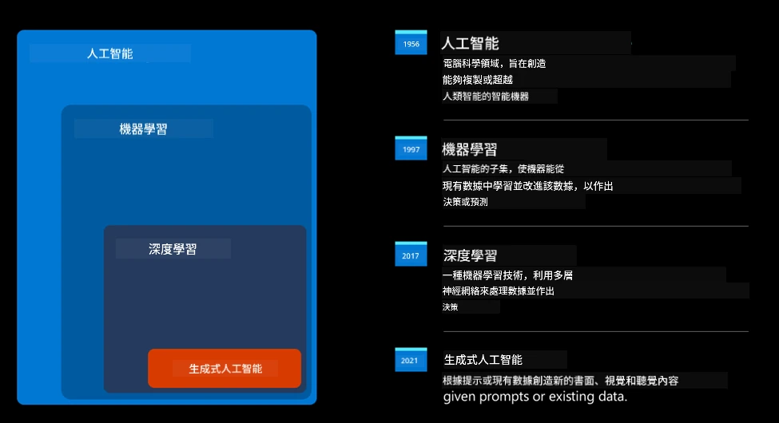
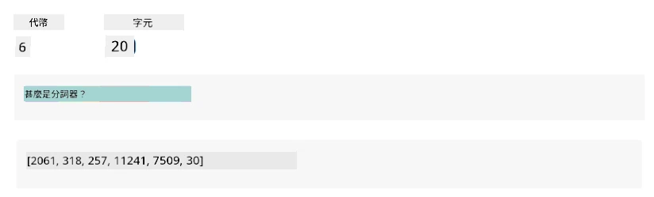
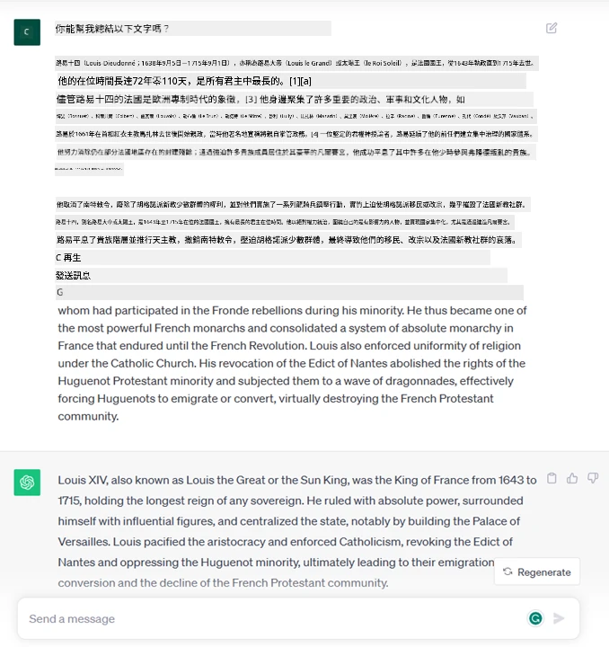
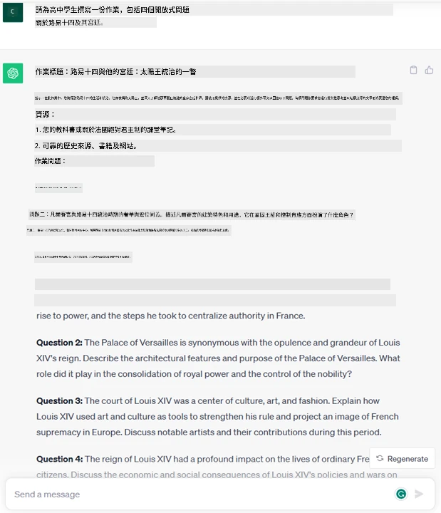
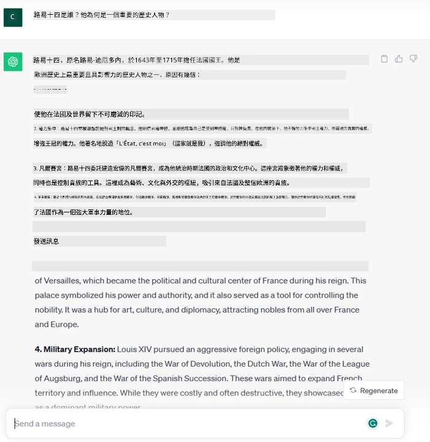
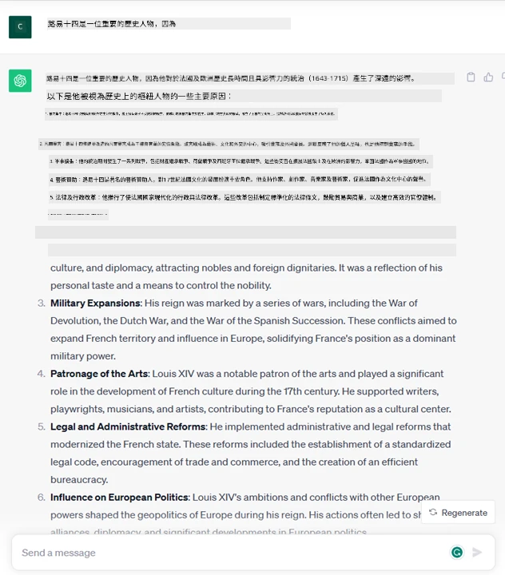
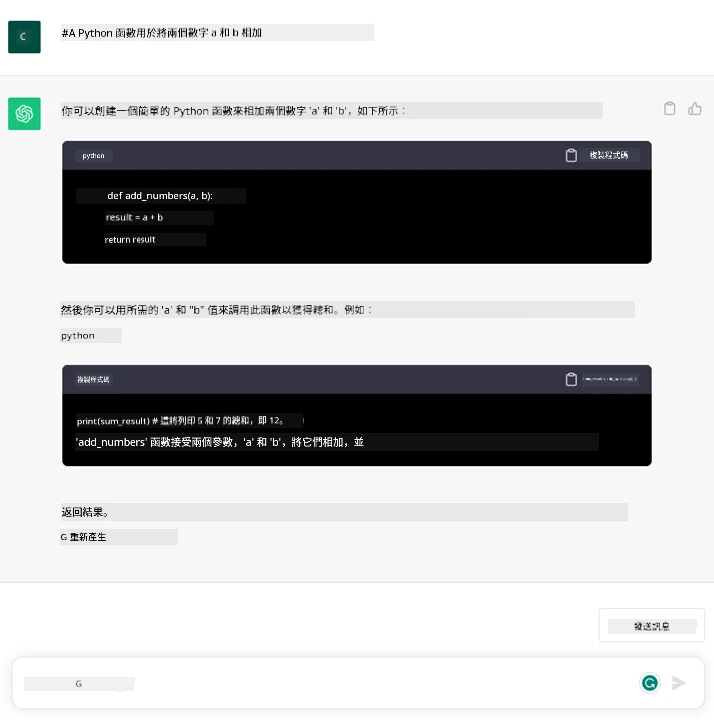

# 生成式人工智能與大型語言模型簡介

_(點擊上方圖片觀看本課程影片)_

生成式人工智能是一種能夠生成文字、圖片及其他類型內容的人工智能。它作為一項優秀技術的原因在於，人人都能簡單使用，僅需輸入一個文本提示，一句用自然語言書寫的句子。你無需學習 Java 或 SQL 這類語言來完成有意義的事情，只需使用你的語言，表達你想要的內容，便會從 AI 模型中得到建議。其應用與影響巨大，你可以寫作或理解報告、撰寫應用程式等，所有這些都能在數秒內完成。

在本課程中，我們將探討我們的初創企業如何利用生成式人工智能開啟教育界的新場景，以及我們如何應對其應用帶來的社會影響與技術限制方面必然面臨的挑戰。

## 簡介

本課程將涵蓋：

- 商業場景介紹：我們的初創企業理念與使命。
- 生成式人工智能及我們如何走到當前技術格局。
- 大型語言模型的內部運作原理。
- 大型語言模型的主要能力與實際應用案例。

## 學習目標

完成本課程後，你將理解：

- 什麼是生成式人工智能以及大型語言模型如何運作。
- 如何運用大型語言模型於不同用例，特別聚焦於教育場景。

## 場景：我們的教育初創企業

生成式人工智能（AI）代表 AI 技術的巔峰，突破了曾被認為不可能的界限。生成式 AI 模型擁有多種能力與應用，但本課程將探究它如何通過一個虛構的初創企業革新教育。我們稱該企業為 _我們的初創企業_。我們的初創企業致力於教育領域，懷抱著雄心勃勃的使命宣言：

> _在全球範圍內提升學習的可及性，確保教育公平，並依據每位學習者的需求提供個性化學習體驗_。

我們的初創企業團隊深知，沒有現代最強大的工具之一——大型語言模型（LLMs），我們無法達成這個目標。

生成式 AI 預計將革新人們當前的學習與教學方式，讓學生能全天候獲得虛擬教師提供的大量資訊與範例，教師則能利用創新工具評估學生並給予回饋。

開始之前，讓我們先定義一些在課程中將常用的基本概念與術語。

## 生成式 AI 是怎麼來的？

儘管近期生成式 AI 模型的發布引發了極大的 _熱潮_，但此技術已有數十年的發展歷程，最早的研究可追溯至六十年代。現今 AI 已擁有人類認知能力，如對話功能，典型例子有 [OpenAI ChatGPT](https://openai.com/chatgpt) 或 [Microsoft Copilot](https://copilot.microsoft.com/?WT.mc_id=academic-105485-koreyst)，後者也採用 GPT 模型來實現對話式網絡搜索體驗。

往回看，最早的 AI 原型是用打字機式聊天機械人，它們依賴從一組專家中提取的知識庫，並以電腦形式呈現。這些知識庫中的答案會根據輸入文字中的關鍵詞觸發。
但很快人們發現，這種採用打字機式聊天機械人的方式無法有效擴展。

### AI 的統計學方法：機器學習

九十年代出現了轉折點，透過應用統計方法於文本分析，促成新算法——即機器學習的誕生。此算法可從數據中學習模式，而不需明確編程。這使機器能模擬人類語言理解：統計模型以文本與標籤配對訓練，使其能以預設標籤為消息意圖，對未知輸入文本進行分類。

### 神經網絡與現代虛擬助理

近年來，硬件的技術進步，能處理更大數據量與更複雜計算，推動 AI 研究，催生了稱為神經網絡或深度學習的高級機器學習算法。

神經網絡（尤其是遞歸神經網絡——RNNs）顯著提升了自然語言處理的能力，能以更具意義的方式表達文本含義，重視詞在句中的語境。

這項技術孕育了本世紀第一個十年誕生的虛擬助理，能非常熟練地解析人類語言，識別需求並進行滿足行動，例如以預設腳本回應或調用第三方服務。

### 今日：生成式 AI

這就是我們怎麼到達今天的生成式 AI，它可以視為深度學習的一個子集。

經過數十年的 AI 研究後，一種稱為 _Transformer_ 的新模型架構突破了 RNN 的限制，能接受更長序列的文本為輸入。Transformer 基於注意力機制，讓模型對收到的輸入賦予不同權重，「更加關注」最相關信息，不論其在文本序列中所處的位置。

大多數近期的生成式 AI 模型——亦稱大型語言模型（LLMs），因為處理文本輸入與輸出——正是基於此架構。這些模型的趣味之處在於，它們在海量非標記數據（如書籍、文章及網站）上訓練，能被調整運用於多種任務，並能創造語法正確且具有一定創意的文本。因此，它們不僅極大增強了機器「理解」輸入文本的能力，也使其具備生成人類語言原創回應的能力。

## 大型語言模型如何運作？

接下來章節我們將探討不同類型的生成式 AI 模型，但現在先來看看大型語言模型，重點是 OpenAI 的 GPT（生成預訓練 Transformer）模型如何運作。

- **分詞器（Tokenizer），文字轉數字**：大型語言模型接受文字輸入並生成文字輸出。然而，作為統計模型，它們處理數字比文字序列更有效。因此，每個輸入在送入模型主體前，都會由分詞器處理。Token 是一段文本片段，長度可變，分詞器的主要任務是將輸入切分成 token 陣列。接著，每個 token 會與編碼的 token 索引相對應，該索引是原始文本片段的整數編碼。

- **預測輸出 token**：給定 n 個 token 為輸入（n 的最大值依模型而異），模型能預測一個 token 作為輸出。該 token 隨後會被加入下一輪輸入中，形成擴展窗口模式，提升使用者體驗，能獲得一個或多個句子作為答案。這也解釋為何你使用 ChatGPT 時，偶爾會覺得它突然中斷句子。

- **選擇過程，機率分布**：模型會根據當前文本序列後出現各 token 可能性的機率分布，選擇輸出 token。這機率分布是基於模型訓練所得計算。然而，並非總是選擇概率最高的 token。在選擇時會加入一定程度的隨機性，使模型行為非決定性——同一輸入可能得到不同輸出。此隨機度用於模擬創意思考過程，可透過稱為溫度（temperature）的模型參數調整。

## 我們的初創企業如何利用大型語言模型？

現在對大型語言模型的內部運作有更深入理解，我們來看一些它們能很好完成的常見任務的實際例子，並關注我們的商業場景。
我們說過，大型語言模型的主要能力是 _從零開始生成文本，基於自然語言形式的文字輸入_。

但這類文字輸入與輸出是怎樣的？
大型語言模型的輸入稱為 prompt（提示），輸出稱為 completion（補全），指模型生成下一個 token 以完成當前輸入的機制。我們將深究 prompt 是什麼以及如何設計以充分發揮模型效能。但現在先說明，prompt 可能包含：

- 一個 <strong>指令</strong>，指定我們期望模型輸出的類型。該指令有時會包含一些範例或額外資料。

  1. 對文章、書籍、產品評論等的摘要，及從非結構化資料中提取洞見。
    
    
  
  2. 創意構思與文章、論文、作業等的撰寫設計。
      
     

- 一個 <strong>問題</strong>，以與代理人對話的形式提出。
  
  

- 一段需要 <strong>補全</strong> 的文字，隱含了寫作協助需求。
  
  

- 一段 <strong>程式碼</strong> 以及要求解釋與文件化的需求，或請求生成執行特定任務的程式碼。
  
  

上述例子較為簡單，並非要全盤展示大型語言模型的能力，而是用以展現生成式 AI 的潛力，尤其是在教育領域但不限於此。

此外，生成式 AI 模型的輸出並非完美，有時候模型的創意反而成為其劣勢，輸出可能是人類用戶看似迷惑現實的文字組合，或甚至是冒犯性內容。生成式 AI 並不具智能——至少以包含批判性、創造性推理或情緒智能的廣義智能定義而言；它並非決定性的，也不可信，因為錯誤引用、內容與敘述可能混雜於正確資訊之中，且以令人信服且自信的方式呈現。在接下來的課程中，我們將處理所有這些限制，並看看如何減輕其影響。

## 作業

作業是：深入閱讀關於[生成式人工智能](https://en.wikipedia.org/wiki/Generative_artificial_intelligence?WT.mc_id=academic-105485-koreyst)的資料，嘗試找出當前還未導入生成式 AI 的領域。思考此技術的影響與傳統方法有何不同，你是否能做出以往無法做到的事情，或者速度是否更快？撰寫一篇 300 字的摘要，描述你理想中的 AI 初創企業模樣，並包含「問題」、「我會如何使用 AI」、「影響」等標題，並可選擇性包括商業計劃。

如果完成此任務，甚至可以準備申請微軟的育成器 [Microsoft for Startups Founders Hub](https://www.microsoft.com/startups?WT.mc_id=academic-105485-koreyst)，我們提供 Azure、OpenAI、導師輔導等多項資源的使用額度，歡迎了解！

## 知識測驗

關於大型語言模型，下列何者正確？

1. 每次都會得到完全相同的回應。
1. 它做事完美無缺，數字相加、程式碼撰寫等都沒問題。
1. 儘管使用同一提示，回應會有所不同。它也很擅長給你初稿，無論是文字或程式碼。但你需自行改善結果。

答案：3，大型語言模型是非決定性的，回應會有所不同，但你可以透過溫度設定控制變異程度。且不應指望它完美執行任務，它主要負責幫你完成繁重工作，讓你取得良好的初步結果，需逐步加以改進。

## 做得好！繼續學習之旅

完成本課程後，歡迎瀏覽我們的 [生成式人工智能學習集錦](https://aka.ms/genai-collection?WT.mc_id=academic-105485-koreyst) 持續提升你的生成式 AI 知識！

前往課程 2，我們將會探討如何[探索和比較不同類型的 LLM](../02-exploring-and-comparing-different-llms/README.md?WT.mc_id=academic-105485-koreyst)！

---

<!-- CO-OP TRANSLATOR DISCLAIMER START -->
**免責聲明**：
本文件使用 AI 翻譯服務 [Co-op Translator](https://github.com/Azure/co-op-translator) 進行翻譯。雖然我們力求準確，但請注意，自動翻譯可能包含錯誤或不準確之處。原始文件的母語版本應被視為權威來源。對於重要資訊，建議尋求專業人工翻譯。我們不對因使用本翻譯而引起的任何誤解或曲解承擔責任。
<!-- CO-OP TRANSLATOR DISCLAIMER END -->