# 探索及比較不同的 LLM

[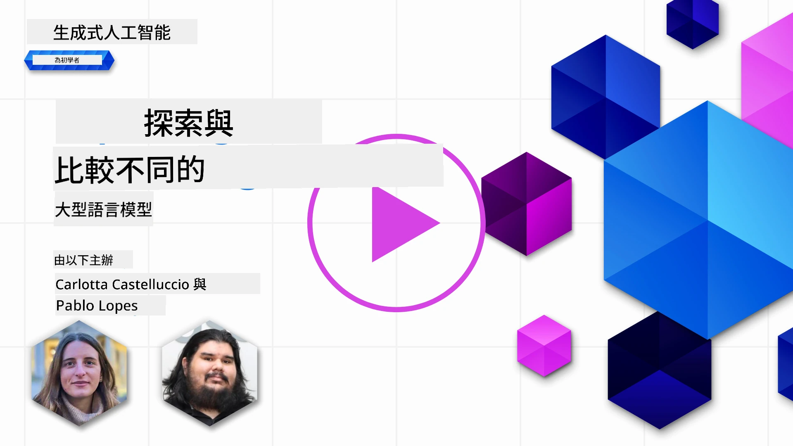](https://youtu.be/KIRUeDKscfI?si=8BHX1zvwzQBn-PlK)

> _點擊上方圖片以觀看本課程影片_

在上一課中，我們已了解生成式 AI 如何改變科技格局，瞭解大型語言模型（LLM）的運作，以及像我們的初創企業如何將其應用於商業案例並成長！本章會比較及對比不同類型的大型語言模型（LLM），以了解它們的優缺點。

我們創業之路的下一步是探索目前 LLM 的生態，並了解哪些適合我們的使用案例。

## 介紹

本課程涵蓋：

- 目前 LLM 生態中的不同類型。
- 在 Azure 上測試、迭代及比較不同模型以符合你的使用案例。
- 如何部署 LLM。

## 學習目標

完成本課後，你將能夠：

- 選擇適合你的使用案例的模型。
- 了解如何測試、迭代及提升模型效能。
- 知道企業如何部署模型。

## 了解不同類型的 LLM

LLM 可依架構、訓練資料及使用案例分多種分類。了解這些差異將幫助我們的初創企業選擇合適的模型，並明白如何測試、迭代及提升效能。

LLM 模型種類繁多，選擇模型取決於你的應用目標、數據、預算及其他因素。

根據你想用於文字、音頻、視頻、影像生成等，你可能會選擇不同型號的模型。

- <strong>音頻及語音識別</strong>。Whisper 風格模型仍是通用語音識別的好選擇，但目前還有新一代語音轉文字模型，如 `gpt-4o-transcribe`、`gpt-4o-mini-transcribe` 及區別說話者版本。需根據語言覆蓋範圍、區辨說話者、實時支援、延遲和成本評估你的情境。詳情見[OpenAI 語音轉文字說明文件](https://platform.openai.com/docs/guides/speech-to-text?WT.mc_id=academic-105485-koreyst)。

- <strong>影像生成</strong>。DALL-E 和 Midjourney 是知名影像生成工具，但目前 OpenAI 影像 API 以 GPT 影像模型如 `gpt-image-2` 為主，而 Stable Diffusion、Imagen、Flux 等模型系列亦是常見。比較提示符合度、編輯支援、風格控制、安全要求及授權政策。更多資訊請參閱[OpenAI 影像生成指南](https://platform.openai.com/docs/guides/images?WT.mc_id=academic-105485-koreyst)及本課程第 9 章。

- <strong>文本生成</strong>。文本模型現涵蓋先鋒模型、推理模型、小型低延遲模型及開源權重模型。目前例子有 OpenAI GPT-5.x 系列、Anthropic Claude 4.x、Google Gemini 3.x、Meta Llama 4 及 Mistral 模型。選擇時不要只看發佈日期或價格，還需比較任務品質、延遲、上下文窗口、工具使用、安全行為、地區可用性及整體成本。可參考[Microsoft Foundry 模型目錄](https://ai.azure.com/catalog?WT.mc_id=academic-105485-koreyst)比對 Azure 上的模型。

- <strong>多模態</strong>。許多現有模型不僅能處理文字，有些可接受影像、音頻或視頻輸入，有些可調用工具，專用模型能生成影像、音頻或視頻。例如目前 OpenAI 模型支持文字及影像輸入，Gemini 模型依版本支援文字、程式碼、影像、音頻和視頻輸入，Llama 4 Scout 和 Maverick 是原生多模態開權重模型。建議建立工作流程前先查看模型卡，確認支援的輸入及輸出模態。

選擇模型意味著獲得基本能力，但可能不夠用。通常你有公司專屬資料，需要某種方式告訴 LLM。處理方法有多種，會在後續章節詳細介紹。

### 基礎模型與 LLM

基礎模型一詞由[史丹佛研究人員提出](https://arxiv.org/abs/2108.07258?WT.mc_id=academic-105485-koreyst)，定義為符合某些標準的 AI 模型，如：

- <strong>透過無監督學習或自監督學習訓練</strong>，即使用未標註的多模態資料，訓練過程不需人工標註。
- <strong>模型非常巨大</strong>，基於非常深度神經網絡，訓練包含數十億個參數。
- **通常旨在作為其他模型的「基礎」**，可作為構建其他模型的起點，透過微調進行擴展。

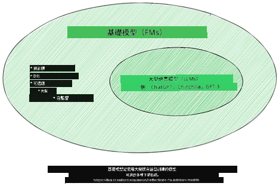

圖片來源：[Essential Guide to Foundation Models and Large Language Models | by Babar M Bhatti | Medium
](https://thebabar.medium.com/essential-guide-to-foundation-models-and-large-language-models-27dab58f7404)

為進一步說明，讓我們以 ChatGPT 為例。早期版本的 ChatGPT 以 GPT-3.5 作為基礎模型，OpenAI 後續用聊天特定數據及調整技術，打造出於對話場景（如聊天機器人）表現更佳的調校版本。現代 AI 服務常在多個模型變體間切換，因此服務名稱與底層模型名稱未必相同。

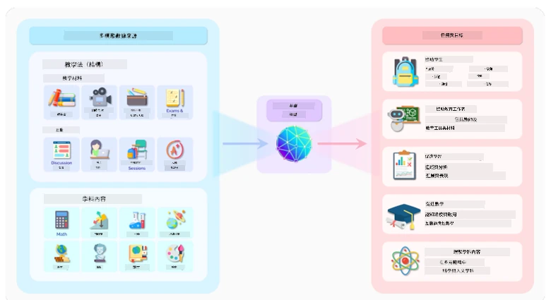

圖片來源：[2108.07258.pdf (arxiv.org)](https://arxiv.org/pdf/2108.07258.pdf?WT.mc_id=academic-105485-koreyst)

### 開源/開權重模型與專有模型

另一種分類 LLM 的方式是區分是否為開權重、開源或專有模型。

開源及開權重模型會公開模型物件供檢視、下載或定制，但許可證有所不同。有些完全開源，有些則是帶有限制使用的開權重模型。這類模型有助於企業更好地掌控部署、數據地理位置、成本及定制需求。不過團隊仍需檢視許可條款、服務成本、維護、安全更新及評估品質，才能用於生產。例子有 [Meta Llama 4](https://ai.meta.com/blog/llama-4-multimodal-intelligence/?WT.mc_id=academic-105485-koreyst)、部分 [Mistral 模型](https://docs.mistral.ai/models/overview?WT.mc_id=academic-105485-koreyst)、以及許多託管於 [Hugging Face](https://huggingface.co/models?WT.mc_id=academic-105485-koreyst) 的模型。

專有模型由供應商擁有並託管。這類模型一般為受管生產環境優化，能提供強大支援、安全系統、工具整合及規模擴展。然而，客戶通常無法檢視或修改模型權重，且需審核供應商條款，包括隱私、資料保存、合規及可接受使用範圍。例子有 [OpenAI 模型](https://platform.openai.com/docs/models?WT.mc_id=academic-105485-koreyst)、[Google Gemini](https://deepmind.google/models/gemini/pro/?WT.mc_id=academic-105485-koreyst)、和 [Anthropic Claude](https://platform.claude.com/docs/en/about-claude/models/overview?WT.mc_id=academic-105485-koreyst)。

### 嵌入向量、影像生成與文本及程式碼生成

LLM 亦可依產出類型分類。

嵌入向量是一類能將文本轉為數字形式（稱為嵌入向量）的模型，是輸入文本的數字表示。嵌入使機器更易理解詞與句間的關係，並可作為分類模型或聚類模型等其他模型的輸入，這些模型在處理數字資料時表現更佳。嵌入模型常用於遷移學習，先建構擁有海量資料的替代任務模型，再重用其權重（嵌入）於下游任務。一例是[OpenAI 嵌入模型](https://platform.openai.com/docs/models/embeddings?WT.mc_id=academic-105485-koreyst)。

影像生成模型會產生影像，通常用於影像編輯、合成及轉換。此類模型多在大型影像資料集訓練，如[LAION-5B](https://laion.ai/blog/laion-5b/?WT.mc_id=academic-105485-koreyst)，能生成新影像，或用修補、超解析、上色等技術編輯現有影像。例子有[GPT 影像模型](https://platform.openai.com/docs/guides/images?WT.mc_id=academic-105485-koreyst)、[Stable Diffusion 模型](https://github.com/Stability-AI/StableDiffusion?WT.mc_id=academic-105485-koreyst) 及 Imagen 模型。

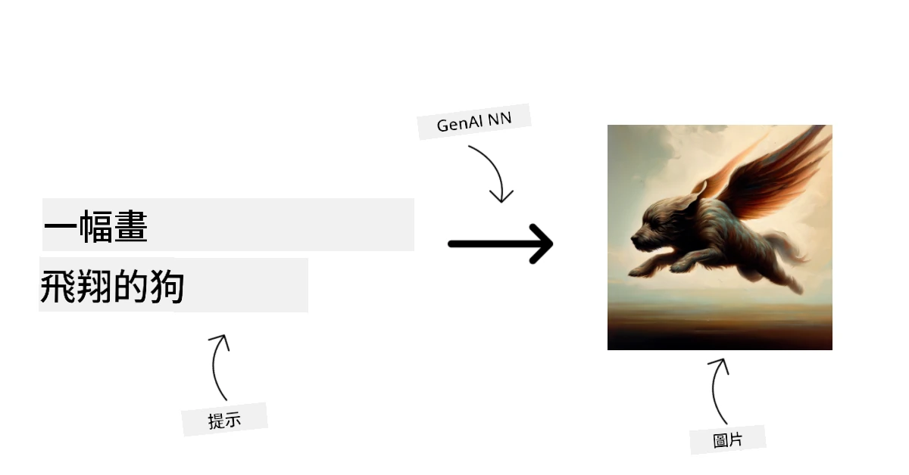

文本及程式碼生成模型則會產生文本或程式碼。常用於文本摘要、翻譯及問答。文本生成模型多在大型文本資料集訓練，如[BookCorpus](https://www.cv-foundation.org/openaccess/content_iccv_2015/html/Zhu_Aligning_Books_and_ICCV_2015_paper.html?WT.mc_id=academic-105485-koreyst)，可以生成新文本或回答問題。程式碼生成模型，如[CodeParrot](https://huggingface.co/codeparrot?WT.mc_id=academic-105485-koreyst)，多在大型程式碼資料集（如 GitHub）訓練，可用於產生新程式碼或修復現有程式錯誤。

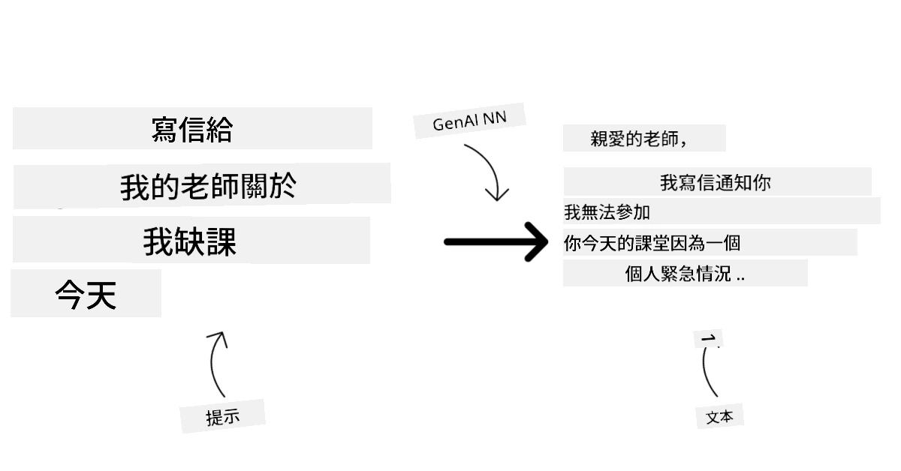

### 編碼器-解碼器與僅解碼器

講述 LLM 架構類型，讓我們用比喻來說明。

假設你經理交給你一個任務，要為學生出一份測驗。你有兩位同事，一位負責創作內容，另一位負責審核。

內容創作者如同僅解碼器模型：他們能看到主題，查看已寫內容，並根據上下文繼續生成內容。此類模型很擅長寫生動且具資訊量的文本，但如果任務只需分類、檢索或編碼資料，他們可能不是最佳選擇。例子包括 GPT 和 Llama 系列模型。

審核者如同僅編碼器模型，他們閱讀課文及答案，理解彼此關係及上下文，但不擅長生成內容。編碼器模型的例子是 BERT。

假設我們有同時能創作及審核測驗的人，那就是編碼器-解碼器模型。例子有 BART 和 T5。

### 服務與模型

現談服務與模型的差異。服務是雲端服務供應商提供的產品，通常結合多個模型、數據及其他元件。模型是服務的核心組件，常是基礎模型，如 LLM。

服務通常針對生產環境優化，使用起來較模型容易，通常有圖形介面。然而服務不一定免費，可能需訂閱或付費，以換取使用服務所有者的設備及資源，優化支出並輕鬆擴展。例如 [Azure OpenAI 服務](https://learn.microsoft.com/azure/ai-services/openai/overview?WT.mc_id=academic-105485-koreyst) 採按用量付費，按使用量計費。Azure OpenAI 服務還提供企業級安全及負責任的 AI 框架，基於模型能力之上。

模型是神經網絡藝術品：參數、權重、架構、分詞器及支援配置。於本地或私有環境運行模型需合適硬件、服務基礎設施、監控，以及相容的開源/開權重許可或商業許可。開權重模型如 Llama 4 或 Mistral 模型可自行托管，但仍需計算資源與運維技術。

## 如何在 Azure 上測試與迭代不同模型以瞭解效能

一旦我們的團隊探索了當前的LLMs生態並確定了一些適合他們場景的良好候選模型，下一步就是在他們的數據和工作負載上測試這些模型。這是一個通過實驗和測量進行的迭代過程。
我們之前段落中提到的大多數模型（OpenAI模型、像Llama 4和Mistral這樣的開放權重模型以及Hugging Face模型）都可在 [Microsoft Foundry Models](https://learn.microsoft.com/azure/foundry/concepts/foundry-models-overview?WT.mc_id=academic-105485-koreyst) 中找到。

[Microsoft Foundry](https://learn.microsoft.com/azure/foundry/what-is-foundry?WT.mc_id=academic-105485-koreyst)，前稱Azure AI Studio/Azure AI Foundry，是一個統一的Azure平台，用於構建AI應用和代理。它幫助開發人員管理從實驗和評估到部署、監控和治理的整個生命周期。Microsoft Foundry中的模型目錄使用戶能夠：

- 在目錄中找到感興趣的基礎模型，包括Azure銷售的模型以及合作夥伴和社區提供者的模型。用戶可以按任務、提供者、許可證、部署選項或名稱進行篩選。

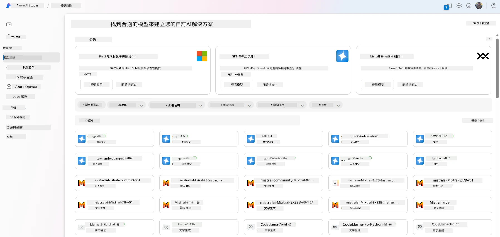

- 查看模型卡，包括詳細的用途說明和訓練數據，代碼示例以及內部評估庫上的評估結果。

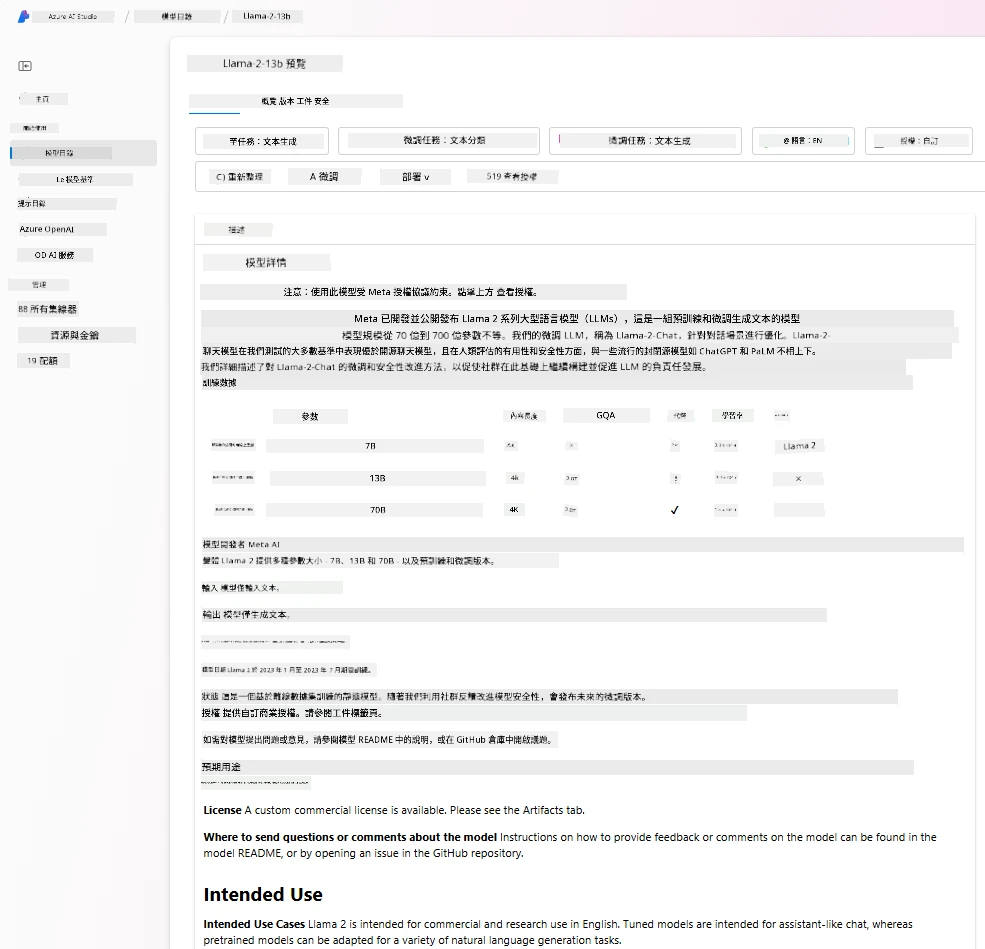

- 通過 [Model Benchmarks](https://learn.microsoft.com/azure/ai-studio/how-to/model-benchmarks?WT.mc_id=academic-105485-koreyst) 面板比較行業內可用的模型和數據集的基準測試，以評估哪個最符合業務場景。

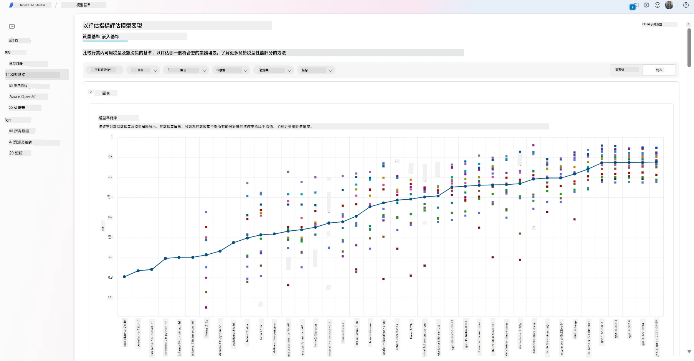

- 在自定義訓練數據上微調支持的模型，以提高特定工作負載的模型性能，利用Microsoft Foundry的實驗和追蹤功能。

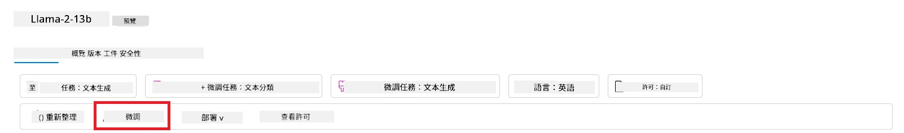

- 將原始預訓練模型或微調版本部署到遠程實時推論端點，使用託管計算或無伺服器部署選項，讓應用能夠使用模型。

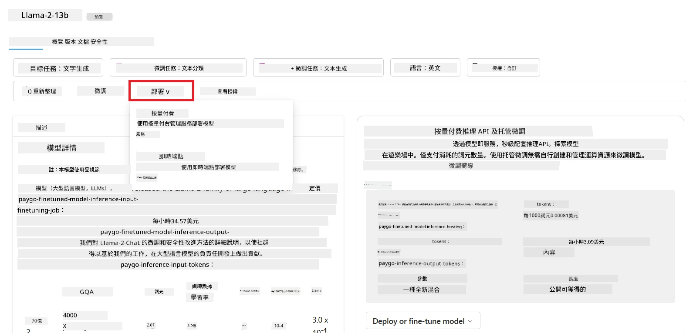

> [!NOTE]
> 目前目錄中的並非所有模型都支援微調和/或按需付費部署。請查看模型卡以了解模型的功能和限制詳情。

## 改善LLM結果

我們與初創團隊一起探索了不同類型的LLMs及一個雲平台（Microsoft Foundry），這使我們能夠比較不同模型，對測試數據進行評估，提升性能，並部署到推論端點。

但是他們應該在何時考慮微調模型，而不是使用預訓練模型？是否有其他方法能改善特定工作負載上的模型性能？

商業機構有多種方法可獲得他們從LLM中需要的結果。部署LLM時，您可以選擇不同類型和訓練程度的模型，具有不同的複雜度、成本和品質。以下是幾種不同的方法：

- <strong>帶上下文的提示工程</strong>。其思路是在提示時提供足夠的上下文，以確保獲得所需回應。

- **檢索增強生成（RAG）**。您的數據可能存在於數據庫或網絡端點中，為確保該數據或其子集在提示時被包含，您可以檢索相關數據並將其納入用戶提示中。

- <strong>微調模型</strong>。您進一步用自己的數據訓練模型，讓模型更精確且更能符合您的需求，但成本可能較高。

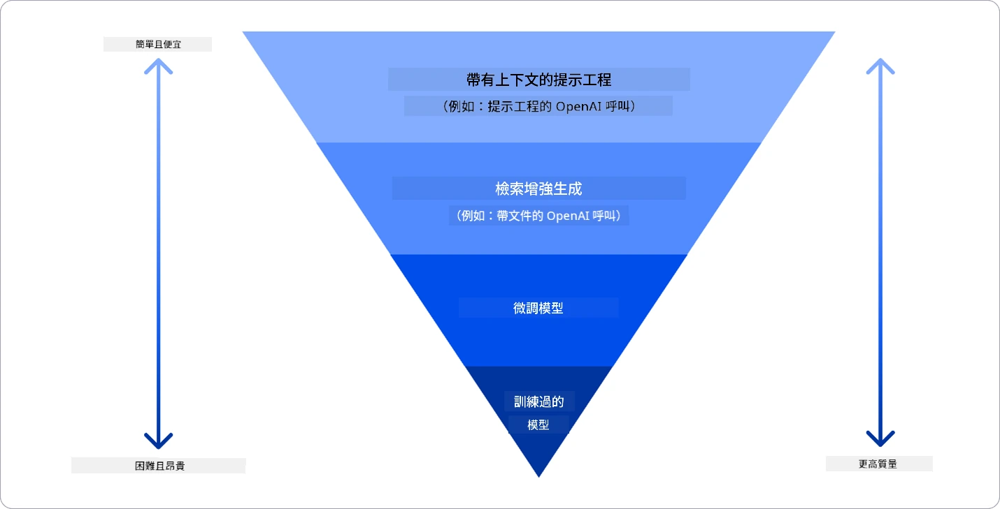

圖片來源：[Four Ways that Enterprises Deploy LLMs | Fiddler AI Blog](https://www.fiddler.ai/blog/four-ways-that-enterprises-deploy-llms?WT.mc_id=academic-105485-koreyst)

### 帶上下文的提示工程

預訓練的LLMs在通用自然語言任務中表現非常好，即使只用簡短提示，如完成句子或回答問題，被稱為“零次學習”。

然而，使用者越能以詳細請求和範例——即上下文——來框定其查詢，答案就越精確且越接近用戶期望。如果提示中只包含一個範例，稱為“單次學習”，包含多個範例則稱為“少樣本學習”。
以上下文進行提示工程是啟動時成本效益最高的方法。

### 檢索增強生成（RAG）

LLM的限制是只能利用其訓練過程中所使用的數據來生成答案。這意味著它們不瞭解訓練後發生的事件，也無法存取非公開資訊（如公司數據）。
這可通過RAG技術克服，該技術以文檔片段的形式擴充提示的外部數據，並考慮提示長度限制。這透過向量數據庫工具（例如 [Azure Vector Search](https://learn.microsoft.com/azure/search/vector-search-overview?WT.mc_id=academic-105485-koreyst)）來支援，該工具從多種預定數據源檢索有用片段並加入至提示上下文中。

當企業缺乏足夠數據、時間或資源來微調LLM，但仍希望提升特定工作負載表現並降低幻想、過時或無支援答案的風險時，此技術特別有用。

### 微調模型

微調是一種利用遷移學習的過程，使模型「適應」下游任務或解決特定問題。與少樣本學習和RAG不同，微調會生成新的模型，具有更新的權重和偏差。它需要一組由輸入（提示）和其關聯輸出（完成）組成的訓練範例。
如果：

- <strong>使用較小的特定任務模型</strong>。企業希望微調較小模型來完成較窄任務，而不是反覆呼叫較大型前沿模型，這可帶來成本效益和速度提升。

- <strong>考慮延遲</strong>。特定用例中延遲很重要，不可使用過長提示或提示長度限制與需學習的範例數量不符。

- <strong>適應穩定行為</strong>。企業擁有大量高品質範例，希望模型持續遵循任務模式、輸出格式、語氣或特定領域風格。如關注常變新事實或私密知識，應使用RAG而非僅依賴微調。

### 訓練模型

從零開始訓練LLM無疑是最困難及複雜的方法，需龐大數據、專業資源及適當運算能力。此選項僅在企業擁有特定領域用例及大量領域中心數據時才應考慮。

## 知識檢測

改善LLM完成結果的好方法是什麼？

1. 帶上下文的提示工程
1. RAG
1. 微調模型

答：三種方法均可幫助。從提示工程和上下文開始快速改進，當模型需具備最新事實或私有商業信息時使用RAG。當有足夠高品質範例且需模型持續遵循任務、格式、語氣或領域模式時，選擇微調。

## 🚀 挑戰

進一步閱讀如何為企業[使用RAG](https://learn.microsoft.com/azure/search/retrieval-augmented-generation-overview?WT.mc_id=academic-105485-koreyst)。

## 幹得好，繼續學習

完成本課程後，請參考我們的 [生成式AI學習合集](https://aka.ms/genai-collection?WT.mc_id=academic-105485-koreyst) 繼續提升您的生成式AI知識！

請前往第3課，我們將探討如何[負責任地使用生成式AI](../03-using-generative-ai-responsibly/README.md?WT.mc_id=academic-105485-koreyst)！

---

<!-- CO-OP TRANSLATOR DISCLAIMER START -->
**免責聲明**：
本文件使用 AI 翻譯服務 [Co-op Translator](https://github.com/Azure/co-op-translator) 進行翻譯。雖然我們力求準確，但請注意，自動翻譯可能包含錯誤或不準確之處。原始文件的母語版本應被視為權威來源。對於重要資訊，建議尋求專業人工翻譯。我們不對因使用本翻譯而引起的任何誤解或曲解承擔責任。
<!-- CO-OP TRANSLATOR DISCLAIMER END -->