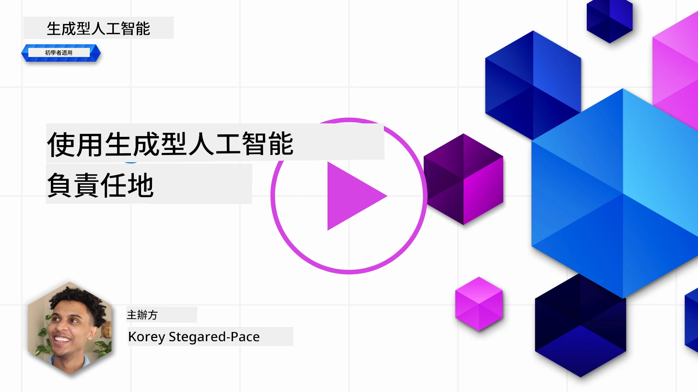
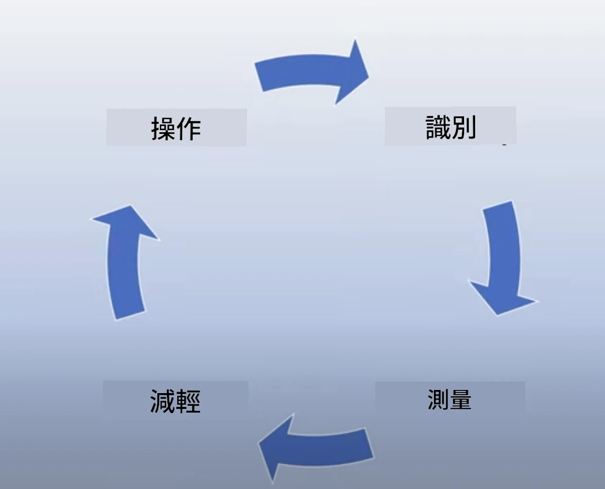
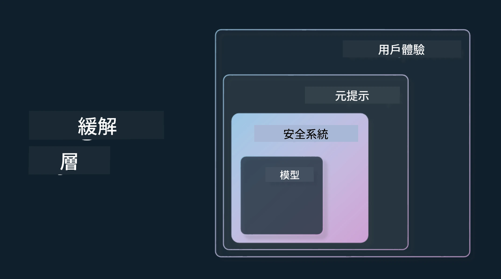

# 負責任地使用生成式人工智能

> _點擊上方圖片觀看本課程的影片_

人工智能尤其是生成式人工智能非常吸引人，但你需要考慮如何負責任地使用它。你需要考慮如何確保輸出是公平的、不具傷害性的等等。本章旨在提供上述背景、應考慮的事項以及如何採取積極步驟改進 AI 使用方式。

## 簡介

本課程將涵蓋：

- 為什麼在構建生成式人工智能應用時，應優先考慮負責任的 AI。
- 負責任 AI 的核心原則及其與生成式 AI 的關係。
- 如何透過策略和工具將這些負責任 AI 原則付諸實踐。

## 學習目標

完成本課程後，你將了解：

- 在構建生成式人工智能應用時負責任 AI 的重要性。
- 在建構生成式人工智能應用時，何時思考並應用負責任 AI 的核心原則。
- 可用來落實負責任 AI 概念的工具和策略。

## 負責任 AI 原則

對生成式 AI 的熱忱前所未有地高漲。這股熱潮吸引了大量新開發者、關注與資金。對於任何想要利用生成式 AI 建立產品與公司的開發者來說，這是非常正面的，但同時我們也必須負責任地前進。

在本課程中，我們專注於建構我們的初創企業及人工智能教育產品。我們將運用負責任 AI 的原則：公平性、包容性、可靠性/安全、保安與私隱、透明性與問責制。藉由這些原則，我們將探討它們與我們產品中生成式 AI 的關聯。

## 為什麼要優先考慮負責任 AI

建立產品時，採取以人為本的方式，將用戶最佳利益放在首位會帶來最佳效果。

生成式 AI 的獨特之處在於它能快速為用戶創造有用的答案、資訊、指引及內容，且多數無需大量手動操作，因而能呈現令人驚豔的成果。若無適當規劃與策略，也可能為用戶、產品和整體社會帶來不良後果。

讓我們看看一些（但非全部）潛在的不良後果：

### 幻覺（Hallucinations）

幻覺是指大型語言模型（LLM）產生完全無意義或與其他資訊來源明顯不符的內容。

舉例來說，我們開發了一個功能，讓學生能問模型歷史問題。若學生問「鐵達尼號唯一的倖存者是誰？」，

模型就可能產生如下回答：

> _(來源：[Flying bisons](https://flyingbisons.com?WT.mc_id=academic-105485-koreyst))_

這答案非常自信且詳盡，然而是錯誤的。稍加查證即可發現鐵達尼號事件中有多位倖存者。對剛開始研究該主題的學生來說，此答案具有說服力且難以質疑，並可能被誤當作事實。這種結果將使 AI 系統不可靠，並對我們初創企業的名聲造成負面影響。

每次大型語言模型迭代，我們都見證了在減少幻覺方面的表現提升。不過，即便如此，作為應用建構者和用戶，我們仍須警覺這些限制。

### 有害內容

我們之前提過 LLM 產生錯誤或無意義回應的情況，另一個需注意的風險是模型回應有害內容。

有害內容定義為：

- 提供指示或鼓勵自殘或傷害某些族群。
- 仇恨或貶低的內容。
- 指導計劃任何形式的襲擊或暴力行為。
- 提供尋找非法內容或實施非法行為的指示。
- 顯示色情暴露內容。

對我們初創企業而言，我們希望擁有合適的工具和策略以防止學生接觸此類內容。

### 缺乏公平性

公平性定義為「確保 AI 系統不帶偏見與歧視，且對所有人公平且平等對待」。在生成式 AI 世界中，我們想避免模型輸出加強對邊緣群體的排斥性世界觀。

這類輸出不但破壞為用戶建立正面產品體驗，也會造成社會進一步傷害。作為應用構建者，我們應設想多元且廣泛的用戶基礎，以打造生成式 AI 解決方案。

## 如何負責任地使用生成式人工智能

既然已明確負責任生成式 AI 的重要性，我們來看看可採取建構 AI 解決方案的四個步驟：

### 衡量潛在傷害

在軟件測試中，我們測試用戶在應用上的預期行為。同理，測試用戶最可能使用的多樣化提示是衡量潛在傷害的好方法。

因為我們的初創企業在建構教育產品，預備一份與教育相關的提示清單會很有幫助，如涵蓋某學科、歷史事實及學生生活的提問。

### 減緩潛在傷害

現在是時候尋找能預防或限制模型及其回應所致潛在傷害的方法。我們可以從四個層面來看：

- <strong>模型</strong>。為正確的用例選擇合適的模型。像 GPT-4 這樣較大且複雜的模型，在應用於較小且具體的用例時，可能增加有害內容的風險。用訓練資料進行微調也能降低有害內容的風險。

- <strong>安全系統</strong>。安全系統是部署模型的平台上用來減輕傷害的一套工具與配置。例如 Azure OpenAI 服務的內容過濾系統。這些系統還應能偵測越獄攻擊及機器人發起的非預期活動。

- **元提示（Metaprompt）**。元提示與基礎設定是我們依據特定行為與資訊引導或限制模型的方式。比如使用系統輸入定義模型的特定限制；或提供更切合系統範圍或領域的輸出。

也可採用檢索增強生成（RAG）等技術，使模型僅從特定受信來源調取資訊。本課程稍後會有一課談論[建構搜尋應用](../08-building-search-applications/README.md?WT.mc_id=academic-105485-koreyst)

- <strong>用戶體驗</strong>。最後一層是在我們的應用介面中，使用者直接與模型互動。透過 UI/UX 設計，可限制使用者可送至模型的輸入類型，以及顯示給用戶的文字或圖片。在部署 AI 應用時，我們也必須對生成式 AI 應用的能為與不能為保持透明。

我們有整堂課專門介紹[為 AI 應用設計 UX](../12-designing-ux-for-ai-applications/README.md?WT.mc_id=academic-105485-koreyst)

- <strong>評估模型</strong>。與大型語言模型合作具有挑戰性，因為我們無法完全控制模型的訓練資料。但無論如何，我們應該持續評估模型的表現與輸出。測量模型輸出的準確性、相似度、依據性與相關性仍十分重要，有助於提升向利害關係人及用戶的透明度與信任。

### 運營負責任的生成式 AI 解決方案

建立 AI 應用的運營實務是最後階段。這包括與我們初創的法務及安全部門合作，確保符合法規政策。上線前，我們也要規劃交付、處理事件與回滾計劃，以防範對用戶造成傷害的風險升高。

## 工具

雖然开发負責任 AI 解決方案的工作量看似不少，但成果非常值得。隨著生成式 AI 領域成長，更多協助開發者有效整合責任考量的工具將會成熟。例如，[Azure AI Content Safety](https://learn.microsoft.com/azure/ai-services/content-safety/overview?WT.mc_id=academic-105485-koreyst) 可透過 API 請求偵測有害內容與圖片。

## 知識檢測

為確保負責任地使用 AI，你需要關注哪些事項？

1. 答案是否正確。
1. 防止 AI 用於犯罪用途，避免有害使用。
1. 確保 AI 不帶偏見與歧視。

答案：2 與 3 正確。負責任 AI 幫助你思考如何減輕有害影響、偏見等問題。

## 🚀 挑戰

閱讀並了解 [Azure AI Content Safety](https://learn.microsoft.com/azure/ai-services/content-safety/overview?WT.mc_id=academic-105485-koreyst)，看看哪些可應用於你的使用中。

## 幹得好，繼續學習

完成本課程後，請參考我們的 [生成式 AI 學習合集](https://aka.ms/genai-collection?WT.mc_id=academic-105485-koreyst)，繼續提升生成式 AI 知識！

接著前往第 4 課，我們將探討 [提示工程基礎](../04-prompt-engineering-fundamentals/README.md?WT.mc_id=academic-105485-koreyst)！

---

<!-- CO-OP TRANSLATOR DISCLAIMER START -->
**免責聲明**：
本文件使用 AI 翻譯服務 [Co-op Translator](https://github.com/Azure/co-op-translator) 進行翻譯。雖然我們力求準確，但請注意，自動翻譯可能包含錯誤或不準確之處。原始文件的母語版本應被視為權威來源。對於重要資訊，建議尋求專業人工翻譯。我們不對因使用本翻譯而引起的任何誤解或曲解承擔責任。
<!-- CO-OP TRANSLATOR DISCLAIMER END -->