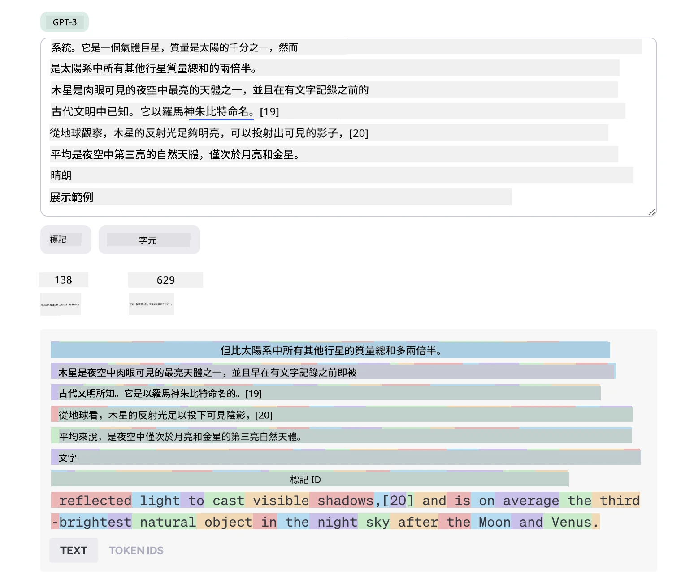

# Prompt Engineering Fundamentals

[](https://youtu.be/GElCu2kUlRs?si=qrXsBvXnCW12epb8)

## Introduction
本模組涵蓋在生成式 AI 模型中創建有效提示詞的基本概念和技術。你如何向大型語言模型（LLM）撰寫你的提示詞同樣重要。精心設計的提示詞可以達成更高品質的回應。但像「提示詞」和「提示詞工程」這些術語究竟代表什麼？我如何改進送到 LLM 的提示詞輸入？這些問題將在本章節及下一章嘗試解答。

_生成式 AI_ 能根據使用者請求創造新內容（例如文字、圖片、音訊、代碼等）。它透過如 OpenAI 的 GPT（「生成式預訓練轉換器」）系列大型語言模型進行，這些模型接受自然語言與程式碼訓練。

使用者現在可以用熟悉的互動形式，例如聊天，無需任何技術專業或訓練即可與這些模型互動。該模型是基於「提示詞」的 —— 使用者發送文本輸入（提示詞）並獲得 AI 回應（回覆）。他們可以以多輪對話的方式反覆與 AI「聊天」，不斷優化提示詞直到回應符合期待。

「提示詞」現在成為生成式 AI 應用的主要_程式介面_，告訴模型該做什麼並影響回應的質量。「提示詞工程」是一個快速成長的領域，專注於_設計和優化_提示詞，以規模化提供穩定且高品質的回應。

## Learning Goals

在本課中，我們將學習什麼是提示詞工程，為何它重要，以及我們如何為特定模型和應用目標打造更有效的提示詞。我們會理解核心概念與提示詞工程的最佳實務，並認識一個互動式 Jupyter 筆記本「沙盒」環境，在那裡可以看到這些概念如何應用於實例。

課程結束時，我們將能夠：

1. 解釋什麼是提示詞工程以及其重要性。
2. 描述提示詞的組成部分及其用途。
3. 學習提示詞工程的最佳實務與技術。
4. 使用 OpenAI 端點將所學技術應用於實際範例。

## Key Terms

提示詞工程：設計及優化輸入，引導 AI 模型生成預期輸出之實務。
分詞（Tokenization）：將文字轉換成模型可以理解和處理的更小單位（稱為詞元）的過程。
指令調教大型語言模型：經過特定指令微調以提升回應精確度及相關性的 LLM。

## Learning Sandbox

提示詞工程目前較像一門藝術而非科學。提升直覺的最好方法是_多加練習_，採用結合應用領域專業知識、推薦技術及模型專屬優化的試錯方法。

本課附帶的 Jupyter 筆記本提供一個_沙盒_環境，你可以隨時或在結尾的程式挑戰部分實作所學。執行練習需要：

1. **Azure OpenAI API 金鑰**—已部署 LLM 的服務端點。
2. **Python 執行環境**—可執行筆記本。
3. **本地環境變數**—_請立即完成[SETUP](./../00-course-setup/02-setup-local.md?WT.mc_id=academic-105485-koreyst)步驟進行準備_。

筆記本自帶_入門_練習，但建議你加入自訂的_Markdown_（說明）及_Code_（提示請求）區塊，以嘗試更多範例或想法，並培養提示詞設計的直覺。

## Illustrated Guide

想先了解本課涵蓋的整體架構嗎？看看這份插圖導覽，它讓你了解所涉主題的重點以及各部分你應思考的關鍵要點。本課程路線圖將帶你從理解核心概念和挑戰，到運用相關提示詞工程技術及最佳實務解決問題。《進階技術》部分則涵蓋本課程_下一章_內容。


## Our Startup

現在，談談這_主題_如何與我們旨在[將 AI 創新帶入教育](https://educationblog.microsoft.com/2023/06/collaborating-to-bring-ai-innovation-to-education?WT.mc_id=academic-105485-koreyst)的新創任務相聯繫。 我們希望開發基於 AI 的_個人化學習_應用 —— 那麼思考不同使用者如何「設計」提示詞很有幫助：

- **管理者**可能會讓 AI _分析課程數據以辨識覆蓋缺口_。AI 可彙整結果或用程式碼視覺化展示。
- **教育者**可能會讓 AI _為特定受眾與主題生成教案_。AI 可依指定格式打造個人化計畫。
- **學生**可能會讓 AI _輔導困難科目_。AI 現可根據學生程度，提供課程、提示與範例。

這只是冰山一角。參考[教育用提示詞庫](https://github.com/microsoft/prompts-for-edu/tree/main?WT.mc_id=academic-105485-koreyst) —— 一個由教育專家策劃的開源提示詞庫 —— 瞭解更多可能性！_試在沙盒或 OpenAI Playground 運行這些提示詞，看看結果！_

<!--
LESSON TEMPLATE:
This unit should cover core concept #1.
Reinforce the concept with examples and references.

CONCEPT #1:
Prompt Engineering.
Define it and explain why it is needed.
-->

## What is Prompt Engineering?

我們課程一開始就定義了**提示詞工程**是針對給定模型和應用目標設計及優化文本輸入（提示詞），以提供穩定且高品質回應（回覆）的過程。我們可將其視為兩階段過程：

- 為特定模型與目標_設計_初始提示詞
- 反覆_優化_提示詞以提升回應品質

此過程必須採用試錯方式，需要使用者的直覺及努力以獲得最佳結果。那麼它為何重要？回答前，我們需先理解三個概念：

- _分詞_＝模型「如何看」提示詞
- _基礎 LLM_＝基底模型「如何處理」提示詞
- _指令調教 LLM_＝模型如何理解「任務」

### Tokenization

LLM 將提示詞視為_詞元序列_，而不同模型（或版本）對相同提示詞的分詞方式可能不同。由於 LLM 是透過詞元訓練（非純文字），提示詞的分詞方式會直接影響生成回應的品質。

為增進對分詞機制的直覺認識，可以嘗試如下工具：[OpenAI Tokenizer](https://platform.openai.com/tokenizer?WT.mc_id=academic-105485-koreyst) 。將你的提示詞貼入，觀察其如何被轉換為詞元，並留意空格字元與標點符號的處理方式。此示例示範較舊的 LLM（GPT-3），使用較新模型時結果可能不同。



### Concept: Foundation Models

提示詞分詞後，「基礎 LLM」（[Base LLM](https://blog.gopenai.com/an-introduction-to-base-and-instruction-tuned-large-language-models-8de102c785a6?WT.mc_id=academic-105485-koreyst)）的主要功能是預測該詞元序列中的下一個詞元。由於 LLM 以海量文本數據訓練，對詞元間的統計關係有良好認知，能帶著一定信心作出預測。請注意，模型不理解提示詞或詞元的_意義_；它只是看到可用其「預測」下一詞元的模式。模型會持續預測序列，直到使用者中斷或達成某些預設條件。

想看基於提示詞的生成過程？將上述提示詞輸入 Azure OpenAI Studio [_Chat Playground_](https://oai.azure.com/playground?WT.mc_id=academic-105485-koreyst) 預設設定。系統配置將提示詞作為資訊請求，你將看到符合同上下文的回覆。

但若使用者想看到符合某些標準或任務目標的特定回應呢？這時用到_指令調教_的 LLM。


### Concept: Instruction Tuned LLMs

[指令調教 LLM](https://blog.gopenai.com/an-introduction-to-base-and-instruction-tuned-large-language-models-8de102c785a6?WT.mc_id=academic-105485-koreyst)以基礎模型為起點，並使用帶有明確指令的範例或輸入/輸出對（例如多輪「訊息」）進行微調。 AI 會嘗試遵循該指令給出回應。

這採用人類反饋強化學習（RLHF）等技術，訓練模型_遵守指令_及_從回饋中學習_，產生更適合實際應用、更貼近使用者目標的回應。

我們試試看 —— 重訪上述提示詞，但將_系統訊息_改為以下指令作為上下文：

> _請將您提供的內容為二年級學生做摘要。請保持結果為一段文字及 3-5 個重點條列。_

看看結果如何根據目標和格式調整了？教育者可直接在該堂課的投影片中使用此回應。


## Why do we need Prompt Engineering?

既然知道 LLM 如何處理提示詞，我們探討為何需要提示詞工程。原因在於現有 LLM 存在多種挑戰，若不投入提示詞設計及優化，難以達成_可靠且穩定的回覆_。例如：

1. **模型回應具有隨機性。**_相同提示詞_可能因不同模型或版本產生不同回應。甚至同一模型在不同時間可能回應各異。_提示詞工程技術可幫助我們降低這些變異，設置更好的護欄_。

1. **模型會偽造回應。**模型訓練使用_龐大但有限_的資料集，意即對訓練範圍外的知識不熟悉。結果它可能產生不準確、虛構甚至與已知事實相悖的回應。_透過提示詞工程，可協助使用者識別並減少此類偽造行為，例如要求 AI 引用來源或提供推理_。

1. **模型功能差異多。**較新的模型或新世代擁有更豐富功能，卻也帶來成本與複雜度等獨特問題。_提示詞工程助我們建立最佳實務與工作流程，以抽象差異並無縫適應模型特性_。

來看看 OpenAI 或 Azure OpenAI Playground 的實例：

- 對不同 LLM 部署（如 OpenAI、Azure OpenAI、Hugging Face）用相同提示詞 — 你是否看到不同結果？
- 對_相同_ LLM 部署（如 Azure OpenAI Playground）重複用相同提示詞 — 變異有何不同？

### Fabrications Example

在本課程，我們用**「偽造」**一詞指稱 LLM 有時因訓練限制或其他因素，生成事實不正確訊息的情況。你可能在文章或研究報告中見過稱之為_「幻覺」_。但我們強烈建議使用「偽造」一詞，避免將機器驅動結果擬人化，也符合[負責任 AI 指引](https://www.microsoft.com/ai/responsible-ai?WT.mc_id=academic-105485-koreyst)的用詞原則，避免使用在某些情境中可能具冒犯或不包容意味的術語。

想感受偽造如何運作嗎？想像一個提示詞，指示 AI 生成不存在主題的內容（以確保該主題未收錄於訓練資料）。例如，我嘗試了這個提示詞：

> **Prompt:** generate a lesson plan on the Martian War of 2076.
網絡搜尋告訴我有一些虛構的記述（例如電視劇或書籍）關於火星戰爭──但沒有發生在2076年。常識也告訴我們，2076年是_未來_，因此不能與真實事件相關聯。

那麼，當我們用不同的LLM供應商執行這個提示會發生什麼？

> **回應 1**：OpenAI Playground (GPT-35)


> **回應 2**：Azure OpenAI Playground (GPT-35)


> **回應 3**：Hugging Face Chat Playground (LLama-2)


正如預期，每個模型（或模型版本）由於隨機性行為和模型能力差異，會產生略微不同的回答。例如，一個模型針對八年級學生，而另一個假設是高中生。但這三個模型都生成了可讓毫無認知的使用者相信該事件是真實發生的回應。

提示工程技術如_元提示(metaprompting)_和_溫度設置(temperature configuration)_能在某種程度上減少模型的虛構內容。新的提示工程_架構_也將新工具和技術無縫整合到提示流程中，以減輕或降低部分這些影響。

## 案例研究：GitHub Copilot

讓我們以一個案例研究結束本節，了解提示工程在現實世界方案中的應用：[GitHub Copilot](https://github.com/features/copilot?WT.mc_id=academic-105485-koreyst)。

GitHub Copilot 是你的「AI 編程搭檔」──它將文本提示轉換為代碼補全，並整合進你的開發環境（例如 Visual Studio Code），提供無縫用戶體驗。如下列博客系列所述，最早的版本基於 OpenAI Codex 模型──工程師迅速意識到需要微調模型並開發更佳的提示工程技術，以提升代碼質量。在七月，他們[推出了超越 Codex 的改進AI模型](https://github.blog/2023-07-28-smarter-more-efficient-coding-github-copilot-goes-beyond-codex-with-improved-ai-model/?WT.mc_id=academic-105485-koreyst)，讓建議更快速。

請按順序閱讀這些文章，追蹤他們的學習之旅。

- **2023年5月** | [GitHub Copilot 正變得更懂你的代碼](https://github.blog/2023-05-17-how-github-copilot-is-getting-better-at-understanding-your-code/?WT.mc_id=academic-105485-koreyst)
- **2023年5月** | [GitHub 探秘：與 GitHub Copilot 背後的 LLMs 一同工作](https://github.blog/2023-05-17-inside-github-working-with-the-llms-behind-github-copilot/?WT.mc_id=academic-105485-koreyst)
- **2023年6月** | [如何為 GitHub Copilot 編寫更好的提示](https://github.blog/2023-06-20-how-to-write-better-prompts-for-github-copilot/?WT.mc_id=academic-105485-koreyst)
- **2023年7月** | [GitHub Copilot 超越 Codex 搭載改進的 AI 模型](https://github.blog/2023-07-28-smarter-more-efficient-coding-github-copilot-goes-beyond-codex-with-improved-ai-model/?WT.mc_id=academic-105485-koreyst)
- **2023年7月** | [開發者的提示工程與大型語言模型指南](https://github.blog/2023-07-17-prompt-engineering-guide-generative-ai-llms/?WT.mc_id=academic-105485-koreyst)
- **2023年9月** | [如何打造企業級 LLM 應用：GitHub Copilot 的教訓](https://github.blog/2023-09-06-how-to-build-an-enterprise-llm-application-lessons-from-github-copilot/?WT.mc_id=academic-105485-koreyst)

你也可以瀏覽他們的[工程博客](https://github.blog/category/engineering/?WT.mc_id=academic-105485-koreyst)，閱讀更多類似[這篇](https://github.blog/2023-09-27-how-i-used-github-copilot-chat-to-build-a-reactjs-gallery-prototype/?WT.mc_id=academic-105485-koreyst)的文章，展示這些模型和技術如何被_應用_於推動真實世界的應用程式。

---

<!--
LESSON TEMPLATE:
This unit should cover core concept #2.
Reinforce the concept with examples and references.

CONCEPT #2:
Prompt Design.
Illustrated with examples.
-->

## 提示構建

我們已經明白了為何提示工程重要──現在讓我們了解如何_構建_提示，才能評估不同技巧以設計更有效的提示。

### 基本提示

先從基本提示開始：一個傳送給模型的文本輸入，無其他上下文。例子如下──當我們把美國國歌的前幾個詞發送給 OpenAI [Completion API](https://platform.openai.com/docs/api-reference/completions?WT.mc_id=academic-105485-koreyst)，它會即時_補全_回應接續的幾行歌詞，展示基本的預測行為。

| 提示 (輸入)      | 補全 (輸出)                                                                                                                             |
| :----------------- | :----------------------------------------------------------------------------------------------------------------------------------------- |
| Oh say can you see | 聽起來你在開始唱「星條旗永不落」的歌詞，這是美國的國歌。完整歌詞是…… |

### 複雜提示

接著，我們為基本提示加入上下文與指令。[Chat Completion API](https://learn.microsoft.com/azure/ai-services/openai/how-to/chatgpt?WT.mc_id=academic-105485-koreyst)讓我們以一組_訊息_形式構建複雜提示：

- 輸入/輸出對映反映_user_輸入與_assistant_回應。
- 系統訊息設定助理的行為或個性上下文。

請求形式如下面所示，其中_tokenization_有效捕捉上下文和對話中相關資訊。改變系統上下文對完成品質的影響，和更改使用者輸入一樣顯著。

```python
response = openai.chat.completions.create(
    model="gpt-3.5-turbo",
    messages=[
        {"role": "system", "content": "You are a helpful assistant."},
        {"role": "user", "content": "Who won the world series in 2020?"},
        {"role": "assistant", "content": "The Los Angeles Dodgers won the World Series in 2020."},
        {"role": "user", "content": "Where was it played?"}
    ]
)
```

### 指令提示

在上述例子中，使用者提示是簡單文本查詢，可被解讀為求取資訊。使用_指令_提示時，我們可以利用文本更詳細指定任務，給 AI 更好的導引。例子如下：

| 提示 (輸入)                                                                                                                                                                                                                         | 補全 (輸出)                                                                                                        | 指令類型    |
| :------------------------------------------------------------------------------------------------------------------------------------------------------------------------------------------------------------------------------------- | :------------------------------------------------------------------------------------------------------------------------- | :------------------ |
| 寫一個關於美國內戰的描述                                                                                                                                                                                                   | _回傳一段簡單的段落_                                                                                              | 簡單              |
| 寫一個關於美國內戰的描述。請提供重要日期和事件並說明其重要性                                                                                                                                     | _回傳一段落，接著是包含事件關鍵日期及說明的列表_                                             | 複雜             |
| 用一段文字描述美國內戰，提供3個重點子彈列出重要日期及其意義，另外3個重點列出重要歷史人物及其貢獻。輸出格式為 JSON 文件 | _回傳更詳盡內容，置於一個可複製貼上並可驗證的 JSON 格式文本框中_ | 複雜。格式化。 |

## 主要內容

在上述例子中，提示仍然相當開放，讓大型語言模型決定它的預訓練數據中哪些部分是相關的。利用_主要內容(primary content)_設計模式，輸入文本分為兩部分：

- 一個指令（行動）
- 相關內容（影響行動的）

以下例子中，指令是「用兩句話摘要」。

| 提示 (輸入)                                                                                                                                                                                                                                                                                                                                                                                                                                                                                                                                                                                                                                                                                      | 補全 (輸出)                                                                                                                                                                                                                                                                             |
| :-------------------------------------------------------------------------------------------------------------------------------------------------------------------------------------------------------------------------------------------------------------------------------------------------------------------------------------------------------------------------------------------------------------------------------------------------------------------------------------------------------------------------------------------------------------------------------------------------------------------------------------------------------------------------------------------------- | :---------------------------------------------------------------------------------------------------------------------------------------------------------------------------------------------------------------------------------------------------------------------------------------------- |
| 木星是距離太陽第五顆行星，也是太陽系中最大的行星。它是氣體巨星，質量是太陽的千分之一，但相當於太陽系其他所有行星質量總和的兩倍半。木星是肉眼可見的夜空中最亮的天體之一，遠古文明在有文字記錄之前就已知曉它。它以羅馬神祇朱比特命名。[19] 從地球觀看，木星反射的光線足以投射可見的影子，[20] 並且平均而言是繼月球和金星後夜空中第三亮的自然天體。 <br/> **用兩句短句摘要這段內容** | 木星是太陽系中第五顆且最大的行星，也是夜空中最亮的天體之一。它以羅馬神朱比特命名，是一顆氣體巨星，其質量是太陽系其他所有行星質量總和的兩倍半。 |

主要內容用於不同方式強化指令效果：

- **範例**──不直接說明要做什麼，而提供範例讓模型推理輸出模式。
- **提示(cue)**──用指令後的「提示」引導完成，促使模型產出更相關回應。
- **模板**──使用可重覆的「食譜」格式，帶有佔位符（變數），以數據自訂滿足特定案例。

下面我們來看這些方式的實際應用。

### 利用範例

這種方法利用主要內容「餵給模型」一些該指令的期望輸出範例，讓模型從中推理輸出模式。根據範例數量，我們稱為零次、一次或少量示範提示。

提示現在包含三個組成部分：

- 任務說明
- 幾個期望輸出範例
- 新範例的開始（隱含任務說明）

| 學習類型 | 提示 (輸入)                                                                                                                                        | 補全 (輸出)         |
| :------------ | :---------------------------------------------------------------------------------------------------------------------------------------------------- | :-------------------------- |
| 零示範     | "The Sun is Shining". 翻譯成西班牙文                                                                                                            | "El Sol está brillando".    |
| 一示範      | "The Sun is Shining" => ""El Sol está brillando". <br> "It's a Cold and Windy Day" =>                                                                 | "Es un día frío y ventoso". |
| 少示範      | 球員跑壘 => 棒球 <br/> 球員打出王牌球 => 網球 <br/> 球員打出六分球 => 板球 <br/> 球員完成灌籃 => | 籃球                  |
|               |                                                                                                                                                       |                             |

可見零示範提示需要明確指令（「翻譯成西班牙文」），而一示範則從範例中推理出指令。少示範顯示增加範例數量可讓模型更準確推斷無額外指令。

### 提示線索(cues)

另一種使用主要內容的方法是提供_提示_而非範例。此處，我們給模型一個開始片段，反映期望回應格式，促使模型「接收提示」並沿著這個方向繼續。

| 提示數量     | 提示 (輸入)                                                                                                                                                                                                                                                                                                                                                                                                                                               | 補全 (輸出)                                                                                                                                                                                                                                                                                       |
| :------------- | :----------------------------------------------------------------------------------------------------------------------------------------------------------------------------------------------------------------------------------------------------------------------------------------------------------------------------------------------------------------------------------------------------------------------------------------------------------- | :-------------------------------------------------------------------------------------------------------------------------------------------------------------------------------------------------------------------------------------------------------------------------------------------------------- |
| 0              | 木星是距離太陽第五顆行星，也是太陽系中最大的行星。它是氣體巨星，質量是太陽的千分之一，但相當於太陽系其他所有行星質量總和的兩倍半。木星是肉眼可見的夜空中最亮的天體之一，遠古文明在有文字記錄之前就已知曉它。<br/>**摘要這段**                                       | 木星是我們太陽系中最大的行星，也是距太陽第五顆。它是氣體巨星，質量是太陽的千分之一，但比其他行星總和還重。古代文明早已知道木星，並且它在夜空中很容易看見。 |
| 1              | 木星是距太陽第五遠的行星，也是太陽系中最大的行星。它是一顆氣體巨星，質量約為太陽的千分之一，但卻是太陽系中其他所有行星質量總和的兩倍半。木星是夜空中肉眼可見的最明亮天體之一，並且自有文字記錄前的古代文明已經為人所知。<br/>**總結重點**<br/>我們學到的是木星 | 是距太陽第五遠的行星，也是太陽系中最大的行星。它是一顆氣體巨星，質量約為太陽的千分之一，但卻是所有其他行星質量總和的兩倍半。它肉眼可見，並自古代起為人所知。                        |
| 2              | 木星是距太陽第五遠的行星，也是太陽系中最大的行星。它是一顆氣體巨星，質量約為太陽的千分之一，但卻是太陽系中其他所有行星質量總和的兩倍半。木星是夜空中肉眼可見的最明亮天體之一，並且自有文字記錄前的古代文明已經為人所知。<br/>**總結重點**<br/>我們學到的前三個事實:         | 1. 木星是距太陽第五遠的行星，也是太陽系中最大的行星。<br/> 2. 它是一顆氣體巨星，質量約為太陽的千分之一...<br/> 3. 木星自古代起就能以肉眼觀察到...                                                                       |
|                |                                                                                                                                                                                                                                                                                                                                                                                                                                                              |                                                                                                                                                                                                                                                                                                           |

### Prompt Templates

一個提示模板是一個_預先定義的提示配方_，可以儲存並根據需要重複使用，以推動更一致的用戶體驗規模化。在最簡單的形式中，它僅僅是一組提示範例，比如[OpenAI的這個範例](https://platform.openai.com/examples?WT.mc_id=academic-105485-koreyst)，提供互動式的提示組件（用戶和系統訊息）以及通過 API 驅動的請求格式——支持重用。

在更複雜的形式中，比如[LangChain的這個範例](https://python.langchain.com/docs/concepts/prompt_templates/?WT.mc_id=academic-105485-koreyst)，它包含可以從多種來源（用戶輸入、系統上下文、外部資料來源等）替換的_佔位符_，用於動態生成提示。這讓我們能夠建立一個可重用提示的庫，**以程式化方式**規模化推動一致的用戶體驗。

最後，模板的真正價值在於能夠創建和發布面向垂直應用領域的_提示庫_——提示模板經過_優化_以反映應用特定的上下文或範例，使響應對目標用戶群更加相關且精確。[Prompts For Edu](https://github.com/microsoft/prompts-for-edu?WT.mc_id=academic-105485-koreyst) 倉庫是這種方法的理想範例，收錄了面向教育領域的提示庫，強調教學規劃、課程設計、學生輔導等關鍵目標。

## Supporting Content

如果將提示構造視為具有一個指令（任務）和一個目標（主要內容），那麼_次級內容_就像是我們提供的額外上下文，用來**在某種程度上影響輸出**。它可以是調整參數、格式指令、主題分類等，有助於模型_調整_其回應以適應期望的用戶目標或預期。

例如：給定一個包含豐富元數據（名稱、描述、等級、元標籤、講師等）的課程目錄：

- 我們可以定義一個指令為「總結2023秋季課程目錄」
- 我們可以用主要內容提供幾個期望輸出的範例
- 我們可以用次級內容標明最感興趣的五個「標籤」

現在，模型可以用幾個範例中顯示的格式提供摘要——但如果結果包含多個標籤，它可以優先標出在次級內容中確定的五個標籤。

---

<!--
LESSON TEMPLATE:
此單元應涵蓋核心概念＃1。
通過範例和參考文獻來強化該概念。

概念＃3：
提示工程技術。
有哪些基本的提示工程技術？
舉例說明並配合練習。
-->

## Prompting Best Practices

現在我們已了解提示如何_構造_，可以開始思考如何_設計_它們以反映最佳實踐。我們可以分為兩部分來考量——擁有正確的_心態_和應用正確的_技術_。

### 提示工程心態

提示工程是一個反覆試錯的過程，請保持以下三個大致指導原則：

1. **領域理解很重要。** 回應的準確性和相關性取決於應用或用戶所處的_領域_。運用你的直覺和領域專業知識來**進一步自訂技術**。例如，在系統提示中定義_領域特定的角色設定_，或者在用戶提示中使用_領域特定的模板_。提供反映領域特定上下文的次級內容，或者使用_領域特定的線索和範例_，引導模型走向熟悉的使用模式。

2. **模型理解很重要。** 我們知道模型本質上是隨機的。但模型實現可能會因所用訓練數據集（預訓練知識）、所提供能力（例如通過 API 或 SDK）以及優化的內容類型（例如代碼、圖片、文本）而異。了解你所用模型的強項和限制，用這些知識來_優先任務_或製作_為模型能力優化的自訂模板_。

3. **迭代與驗證很重要。** 模型和提示工程技術都在快速演進。作為領域專家，你可能擁有其他上下文或標準，適用於_你_的特定應用，非必然適用於整個社群。使用提示工程工具和技術「快速啟動」提示構造，然後用你的直覺和專業知識迭代及驗證結果。記錄你的見解並建立一個**知識庫**（例如提示庫），可作為他人未來更快迭代的新基線。

## Best Practices

現在讓我們看看由[OpenAI](https://help.openai.com/en/articles/6654000-best-practices-for-prompt-engineering-with-openai-api?WT.mc_id=academic-105485-koreyst)和[Azure OpenAI](https://learn.microsoft.com/azure/ai-services/openai/concepts/prompt-engineering#best-practices?WT.mc_id=academic-105485-koreyst)從業人員推薦的常見最佳實踐。

| 什麼                                   | 為什麼                                                                                                                                                                                                                                             |
| :------------------------------------- | :------------------------------------------------------------------------------------------------------------------------------------------------------------------------------------------------------------------------------------------------- |
| 評估最新模型。                         | 新一代模型很可能擁有更好的功能和品質，但可能會增加成本。先評估其影響，再做遷移決策。                                                                                                                                                               |
| 分開指令與上下文                       | 查看你的模型/供應商是否定義了_分隔符_，用以更清楚區分指令、主要與次級內容。這有助於模型更精確地分配權重給標記。                                                                                                                                     |
| 具體且清楚                           | 提供更多關於期望上下文、結果、長度、格式、風格等細節，能提升回應質量與一致性。可將配方記錄在可重用模板。                                                                                                                                        |
| 具描述性，使用範例                     | 模型可能更喜歡「示範與說明」方式。先用`零次擊`方式給予指令（無範例）；再用`少次擊`精煉，提供幾個期望輸出範例。使用類比說明。                                                                                                                    |
| 使用線索啟動完成                       | 給模型一些開頭文字或片語，引導它向期望結果前進，作為回應的起點。                                                                                                                                                                                 |
| 加強重複                             | 有時可能需要對模型重複指令。可在主要內容前後提供指令，或使用指令與線索等組合。迭代與驗證效果。                                                                                                                                                     |
| 呈現順序很重要                       | 對模型呈現資訊的順序可能影響輸出，即使在學習範例中亦是如此，因為近期偏差。嘗試不同選項以找出最佳方案。                                                                                                                                               |
| 給模型「後路」                       | 提供模型一個_回退_完成回應，讓它在無法完成任務時可用。這能降低模型生成錯誤或杜撰內容的機率。                                                                                                                                                      |
|                                      |                                                                                                                                                                                                                                                   |

像其他任何最佳實踐一樣，請記得基於模型、任務和領域不同，_實際效果可能有所差異_。將這些作為起點，不斷迭代以尋找最適合你的方案。隨著新模型和工具問世，不斷重新評估提示工程流程，聚焦於流程可擴展性和回應品質。

<!--
LESSON TEMPLATE:
本單元如適用，應提供程式碼挑戰

挑戰：
連結到只有程式碼註解的 Jupyter Notebook（代碼區塊留空）。

解答：
連結到已填寫提示並執行結果的 Notebook 範例。
-->

## Assignment

恭喜！你已完成本課程！現在是時候用實際範例來測試這些概念和技術了！

本次作業我們將使用一個可互動完成練習的 Jupyter Notebook。你也可以自行在 Notebook 裡增加 Markdown 和代碼單元，探索想法和技術。

### 開始之前，先 fork 倉庫，然後

- （推薦）啟動 GitHub Codespaces
- （選擇性）將倉庫克隆到本地設備，並利用 Docker Desktop 使用
- （選擇性）使用你偏好的 Notebook 執行環境打開 Notebook

### 接著，設定環境變數

- 將倉庫根目錄的 `.env.copy` 文件複製為 `.env`，並填入 `AZURE_OPENAI_API_KEY`、`AZURE_OPENAI_ENDPOINT` 和 `AZURE_OPENAI_DEPLOYMENT` 值。返回[學習沙盒部分](../../../04-prompt-engineering-fundamentals)學習方法。

### 然後，打開 Jupyter Notebook

- 選擇執行內核。如果是選項一或二，只需選擇開發容器默认的 Python 3.10.x 內核。

你就可以開始執行練習。請注意這裡不存在「對或錯」答案——而是透過嘗試與錯誤探索、並培養針對特定模型和應用領域的直覺。

_因此本課程中沒有程式碼解答段落。Notebook 中會有標題為「我的解答：」的 Markdown 單元，展示一個範例輸出供參考。_

 <!--
LESSON TEMPLATE:
用總結與自我導向學習資源包裹本節。
-->

## Knowledge check

以下哪一個提示是符合合理最佳實踐的好提示？

1. 顯示我一張紅色跑車的圖片
2. 顯示我一張紅色 Volvo XC90 跑車，停靠於懸崖旁夕陽景色中的圖片
3. 顯示我一張紅色 Volvo XC90 跑車的圖片

答：2，是最佳提示，因為提供了「什麼」的細節，並具體說明（不是任意車輛，而是特定廠牌和車型），同時描述了整體場景。3 次之，因為也包含很多描述。

## 🚀 挑戰

試試看對提示使用「線索」技巧：完成句子「顯示我一張紅色 Volvo 跑車，及……」。它會怎麼回答？你會怎麼改進？

## 幹得好！繼續學習

想深入學習不同的提示工程概念？請前往[持續學習頁面](https://aka.ms/genai-collection?WT.mc_id=academic-105485-koreyst)尋找更多優質資源。

接著前往第5課，我們將探討[進階提示技術](../05-advanced-prompts/README.md?WT.mc_id=academic-105485-koreyst)！

---

<!-- CO-OP TRANSLATOR DISCLAIMER START -->
**免責聲明**：  
本文件係透過人工智能翻譯服務 [Co-op Translator](https://github.com/Azure/co-op-translator) 進行翻譯。雖然我哋致力確保準確性，但請注意自動翻譯可能存在錯誤或不準確之處。原始文件之母語版本應視為權威來源。對於重要資訊，建議採用專業人工翻譯。因使用本翻譯所引致之任何誤解或誤釋，我哋概不負責。
<!-- CO-OP TRANSLATOR DISCLAIMER END -->